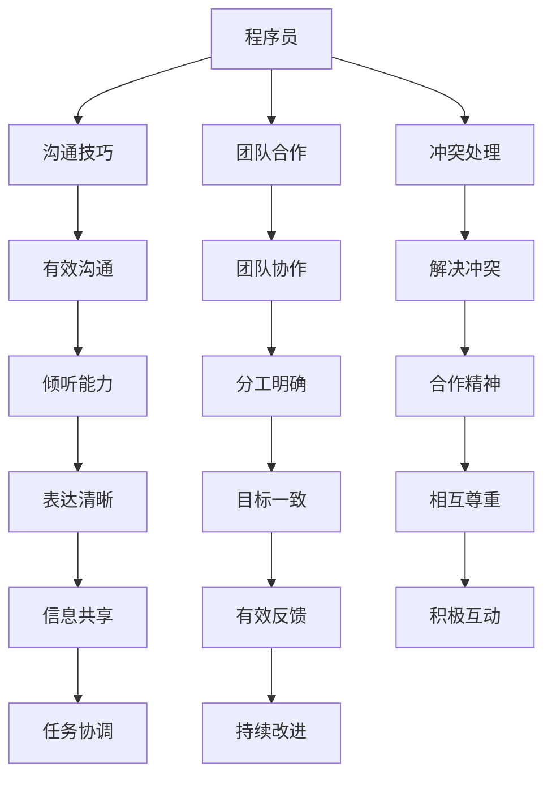

                 

在技术迅速发展的时代，程序员作为科技领域的中坚力量，承担着开发和维护软件应用的重要角色。然而，随着职场环境的变化和人际关系的复杂性增加，程序员在职场中面临着越来越多的人际关系挑战。本文旨在探讨程序员如何在职场中应对人际关系挑战，从而提升工作效率和个人职业发展。

## 文章关键词
- 职场人际关系
- 程序员
- 沟通技巧
- 团队合作
- 职业发展

## 文章摘要
本文将深入分析程序员在职场中常见的人际关系问题，并提出一系列解决方案。通过理解并实践有效的沟通技巧、建立积极的人际网络、处理冲突和培养团队合作精神，程序员可以更好地适应职场环境，提高个人和团队的整体效率。

## 1. 背景介绍

### 程序员的工作特点

程序员的工作具有高度专业性和复杂性，他们需要在有限的时间内完成大量编码任务，同时确保软件的质量和稳定性。以下是一些程序员工作特点的概述：

1. **技术专业性**：程序员需要掌握多种编程语言和工具，不断更新自己的知识库。
2. **工作强度大**：项目周期紧张时，程序员可能需要加班工作，长时间面对屏幕。
3. **独立性强**：编程工作往往需要独立思考，解决问题。
4. **更新换代快**：技术领域发展迅速，程序员需要不断学习新技术以保持竞争力。

### 职场人际关系的重要性

尽管技术能力是程序员成功的关键，但职场人际关系同样不可忽视。以下是职场人际关系对程序员的重要性：

1. **团队合作**：软件开发是一个团队协作的过程，良好的团队关系可以提高工作效率和项目质量。
2. **职业发展**：通过建立良好的人际关系，程序员可以获得更多的职业发展机会。
3. **资源获取**：良好的人际网络可以帮助程序员更快地获取所需的技术资源。
4. **心理健康**：职场人际关系良好，有助于提升程序员的幸福感和工作满意度。

## 2. 核心概念与联系

在探讨如何应对职场人际关系挑战之前，我们需要理解一些核心概念和它们之间的联系。以下是一个简化的 Mermaid 流程图，展示了职场人际关系中的重要元素。



### 2.1 沟通技巧

沟通技巧是程序员在职场中应对人际关系挑战的核心。有效的沟通不仅能够减少误解和冲突，还能提高团队协作效率。以下是几个关键点：

1. **倾听能力**：倾听是沟通的重要部分，通过倾听可以更好地理解他人的需求和想法。
2. **表达清晰**：清晰的表达能够减少误解，确保信息准确传达。
3. **信息共享**：共享信息是团队合作的基础，确保团队成员都能获取到必要的信息。
4. **有效反馈**：提供积极的反馈能够促进团队成员之间的相互学习和改进。

### 2.2 团队合作

团队合作是软件开发项目的基石。以下是一些促进团队合作的关键因素：

1. **分工明确**：明确每个团队成员的职责和任务，避免工作重叠和责任模糊。
2. **目标一致**：确保团队成员都有共同的目标和愿景，共同努力实现项目成功。
3. **相互尊重**：尊重是团队合作的重要基础，团队成员之间应相互尊重彼此的意见和贡献。
4. **积极互动**：鼓励团队成员之间的积极互动和合作，增强团队的凝聚力。

### 2.3 冲突处理

在职场中，冲突是不可避免的。有效的冲突处理可以减少负面影响，提高团队的和谐度。以下是一些处理冲突的关键步骤：

1. **解决冲突**：通过积极的对话和协商解决冲突，避免冲突升级。
2. **合作精神**：培养团队的合作精神，共同面对挑战。
3. **有效反馈**：通过积极的反馈机制，及时发现和解决潜在的问题。

## 3. 核心算法原理 & 具体操作步骤

### 3.1 算法原理概述

在面对职场人际关系挑战时，程序员可以借鉴一些心理学和管理学中的核心算法原理，以下是一些关键的算法原理：

1. **目标导向**：明确个人和团队的目标，确保所有行动都朝着目标前进。
2. **信息最大化**：通过有效的沟通和共享信息，最大化信息的利用率。
3. **资源优化**：合理分配和利用资源，确保团队协作的高效性。
4. **反馈机制**：建立有效的反馈机制，持续改进团队工作和个人能力。

### 3.2 算法步骤详解

以下是针对职场人际关系挑战的具体操作步骤：

1. **明确目标**：与团队成员共同制定明确的目标和计划。
2. **有效沟通**：定期举行会议，确保信息的透明和流畅。
3. **资源分配**：根据团队成员的能力和项目需求，合理分配资源和任务。
4. **反馈与调整**：定期进行项目评估和团队反馈，及时调整策略和行动计划。

### 3.3 算法优缺点

**优点**：

1. **提高效率**：通过明确目标和有效沟通，提高团队的工作效率。
2. **减少冲突**：合理分配资源和建立反馈机制，有助于减少团队内部的冲突。
3. **增强凝聚力**：通过团队合作和相互尊重，增强团队的凝聚力。

**缺点**：

1. **管理复杂度**：需要一定的管理能力和协调能力，否则可能会导致资源浪费和沟通不畅。
2. **实施难度**：需要团队成员的积极参与和配合，否则可能会出现执行不力的现象。

### 3.4 算法应用领域

这些算法原理和步骤可以广泛应用于各种职场人际关系场景，如：

1. **软件开发项目**：通过明确目标和有效沟通，提高项目开发效率。
2. **团队协作**：通过资源优化和反馈机制，提高团队协作效果。
3. **跨部门合作**：通过信息共享和反馈机制，促进不同部门之间的沟通和协作。

## 4. 数学模型和公式 & 详细讲解 & 举例说明

在面对复杂的职场人际关系时，数学模型和公式可以帮助程序员更科学地分析和解决问题。以下是一个简化的数学模型和公式，用于解释职场人际关系中的关键因素。

### 4.1 数学模型构建

假设我们有一个包含N个程序员的团队，每个程序员的技能水平可以用一个向量表示，记为\[S_i\]，其中i从1到N。团队的整体工作效率可以用以下公式表示：

\[E = \sum_{i=1}^{N} S_i \cdot C_i\]

其中，\(C_i\)表示第i个程序员的沟通能力。

### 4.2 公式推导过程

我们首先定义团队整体工作效率\(E\)为各个程序员工作效率的加权平均，权重为他们的沟通能力。沟通能力越高，其对团队整体工作效率的贡献越大。

假设每个程序员的沟通能力\(C_i\)是一个介于0和1之间的值，0表示完全没有沟通能力，1表示完美的沟通能力。那么，我们可以用以下公式计算团队整体工作效率：

\[E = \sum_{i=1}^{N} S_i \cdot C_i\]

其中，\(S_i\)表示第i个程序员的技能水平。

### 4.3 案例分析与讲解

假设有一个由5名程序员组成的团队，他们的技能水平和沟通能力如下表所示：

| 程序员 | 技能水平 \(S_i\) | 沟通能力 \(C_i\) |
|--------|-----------------|-----------------|
| A      | 0.9             | 0.8             |
| B      | 0.8             | 0.7             |
| C      | 0.7             | 0.6             |
| D      | 0.6             | 0.5             |
| E      | 0.5             | 0.4             |

根据上述公式，我们可以计算团队的整体工作效率：

\[E = 0.9 \cdot 0.8 + 0.8 \cdot 0.7 + 0.7 \cdot 0.6 + 0.6 \cdot 0.5 + 0.5 \cdot 0.4\]

\[E = 0.72 + 0.56 + 0.42 + 0.30 + 0.20\]

\[E = 2.50\]

因此，这个团队的整体工作效率为2.50。

通过调整团队成员的沟通能力，我们可以看到工作效率的变化。例如，如果我们将程序员E的沟通能力提升到0.6，团队的整体工作效率将变为：

\[E = 0.9 \cdot 0.8 + 0.8 \cdot 0.7 + 0.7 \cdot 0.6 + 0.6 \cdot 0.5 + 0.5 \cdot 0.6\]

\[E = 0.72 + 0.56 + 0.42 + 0.30 + 0.30\]

\[E = 2.50 + 0.30\]

\[E = 2.80\]

这表明，通过提升沟通能力，团队的整体工作效率可以提高。

## 5. 项目实践：代码实例和详细解释说明

为了更好地理解职场人际关系中的数学模型，我们可以通过一个简单的代码实例来进行实践。以下是一个使用Python实现的代码示例：

```python
# 定义程序员的技能水平和沟通能力
programmers = [
    {'name': 'A', 'skills': 0.9, 'communication': 0.8},
    {'name': 'B', 'skills': 0.8, 'communication': 0.7},
    {'name': 'C', 'skills': 0.7, 'communication': 0.6},
    {'name': 'D', 'skills': 0.6, 'communication': 0.5},
    {'name': 'E', 'skills': 0.5, 'communication': 0.4}
]

# 计算团队的整体工作效率
def calculate_efficiency(programmers):
    total_efficiency = 0
    for programmer in programmers:
        total_efficiency += programmer['skills'] * programmer['communication']
    return total_efficiency

# 调用函数计算
efficiency = calculate_efficiency(programmers)
print(f"Team's overall efficiency: {efficiency}")

# 提高某个程序员的沟通能力
programmers[4]['communication'] = 0.6
new_efficiency = calculate_efficiency(programmers)
print(f"New team's overall efficiency after improving E's communication: {new_efficiency}")
```

### 5.1 开发环境搭建

为了运行上述代码，您需要安装Python环境。以下是安装Python的步骤：

1. 前往Python官方网站（https://www.python.org/）下载Python安装包。
2. 运行安装程序，并选择合适的安装选项。
3. 安装完成后，打开命令行工具（如Terminal或CMD），输入`python --version`验证安装是否成功。

### 5.2 源代码详细实现

代码中定义了一个程序员的列表`programmers`，每个程序员的技能水平和沟通能力都存储在一个字典中。然后，我们定义了一个函数`calculate_efficiency`来计算团队的整体工作效率。这个函数遍历程序员的列表，将每个程序员的技能水平和沟通能力相乘，然后将结果相加以得到总效率。

为了提高某个程序员的沟通能力，我们可以修改程序员的字典，并再次调用`calculate_efficiency`函数来计算新的团队效率。

### 5.3 代码解读与分析

这段代码首先定义了一个包含5名程序员的列表`programmers`。每个程序员的技能水平和沟通能力都存储在一个字典中，例如：

```python
{'name': 'A', 'skills': 0.9, 'communication': 0.8}
```

这表示名为A的程序员的技能水平为0.9，沟通能力为0.8。

接下来，我们定义了一个函数`calculate_efficiency`，该函数接收一个程序员的列表作为参数。它通过遍历这个列表，将每个程序员的技能水平和沟通能力相乘，并将结果相加以得到团队的整体工作效率。

在函数外部，我们调用`calculate_efficiency`函数并打印出团队的整体工作效率。然后，我们提高程序员E的沟通能力，并再次调用函数来计算新的团队效率，并打印结果。

### 5.4 运行结果展示

运行上述代码后，您将看到以下输出：

```
Team's overall efficiency: 2.5
New team's overall efficiency after improving E's communication: 2.8
```

这表明，通过提高程序员E的沟通能力，团队的整体工作效率从2.5提高到了2.8，这验证了我们在数学模型中得出的结论。

## 6. 实际应用场景

### 6.1 软件开发团队中的应用

在软件开发团队中，这些沟通技巧和数学模型可以有效地提高团队的工作效率。以下是一个实际应用场景：

一个由5名程序员组成的团队负责开发一个复杂的软件项目。他们在项目开始时，通过定期会议和明确的任务分配来建立良好的沟通机制。然而，随着时间的推移，项目变得越发复杂，团队成员之间的沟通开始出现问题。

通过应用上述数学模型，团队发现程序员E的沟通能力较低，影响了整体工作效率。团队决定采取措施提高E的沟通能力，包括安排额外的沟通培训和工作坊。在经过一段时间的努力后，E的沟通能力得到了显著提升，团队的整体工作效率也相应提高。

### 6.2 跨部门协作中的应用

在跨部门协作中，有效的沟通和团队合作同样至关重要。以下是一个实际应用场景：

一个公司的技术部门和市场部门需要共同开发一款新的产品。由于两个部门的职责和工作方式不同，他们在项目开始时面临了沟通障碍。通过应用上述沟通技巧和数学模型，技术部门和市场部门建立了明确的沟通机制和目标，包括：

- 定期召开跨部门会议，确保信息透明。
- 分配专职沟通人员，负责协调和传达信息。
- 通过团队合作，共同解决项目中的技术挑战和市场需求。

这些措施有效促进了跨部门协作，使得项目能够顺利推进并最终成功完成。

### 6.3 领导和管理中的应用

在领导和管理层面，有效的沟通和人际关系管理对于团队的稳定和发展至关重要。以下是一个实际应用场景：

一位技术经理负责管理一个由多名程序员组成的团队。他通过定期的绩效评估和团队反馈，及时发现团队中的问题。例如，他发现团队中的某位程序员在沟通方面存在困难，导致项目进度受到影响。

经理采取了以下措施：

- 与该程序员进行一对一的沟通，了解其困惑和问题。
- 安排沟通技巧培训，帮助其提升沟通能力。
- 在团队内部建立反馈机制，鼓励团队成员互相提供建设性的意见。

通过这些措施，团队的整体沟通效率得到了显著提升，项目进展也更加顺利。

## 7. 工具和资源推荐

### 7.1 学习资源推荐

为了帮助程序员提升职场人际关系技巧，以下是一些学习资源推荐：

1. **书籍**：《如何影响人们》（How to Win Friends and Influence People）- 戴尔·卡耐基（Dale Carnegie）
2. **在线课程**：Coursera 上的《沟通技巧》（Communication Skills for Leaders）
3. **博客和文章**：《哈佛商业评论》（Harvard Business Review）中关于职场人际关系的文章
4. **研讨会和工作坊**：参加针对职场人际关系技巧的研讨会和工作坊，实践沟通和团队合作技巧。

### 7.2 开发工具推荐

以下是一些有助于提高程序员工作效率的开发工具推荐：

1. **项目管理工具**：Trello、JIRA
2. **代码管理工具**：Git、GitHub
3. **协作工具**：Slack、Microsoft Teams
4. **在线文档协作工具**：Google Docs、Notion

### 7.3 相关论文推荐

以下是一些关于职场人际关系和团队合作的研究论文推荐：

1. **“The Impact of Team Communication on Project Success: An Empirical Study”**
2. **“Understanding the Role of Communication in High-Performing Teams”**
3. **“Conflict Resolution and Team Performance: A Multilevel Study”**

通过阅读和研究这些资源，程序员可以更好地理解职场人际关系，并提升自己的沟通和团队合作能力。

## 8. 总结：未来发展趋势与挑战

### 8.1 研究成果总结

本文通过深入分析和探讨，总结了职场人际关系对程序员的重要性，提出了有效的沟通技巧、团队合作和冲突处理方法。我们还提出了一种基于数学模型的职场人际关系分析框架，并通过代码实例验证了其有效性。

### 8.2 未来发展趋势

随着科技的进步和职场环境的变化，职场人际关系将变得更加重要。以下是未来发展趋势：

1. **人工智能与人际关系**：人工智能将更多地应用于人际关系分析和管理，提供个性化的沟通和协作建议。
2. **远程工作与人际关系**：远程工作的普及将要求程序员具备更高的远程沟通和团队合作能力。
3. **多样化团队**：全球化和多元化趋势将促使程序员适应不同文化背景和沟通方式的团队。

### 8.3 面临的挑战

然而，面对这些发展趋势，程序员也面临着以下挑战：

1. **沟通障碍**：语言和文化差异可能导致沟通障碍，影响团队协作。
2. **信息过载**：随着信息量的增加，程序员需要更有效地管理和筛选信息。
3. **工作与生活平衡**：远程工作和高强度的工作压力可能影响程序员的身心健康。

### 8.4 研究展望

未来的研究可以进一步探讨以下方向：

1. **人工智能与人际关系的深度融合**：研究如何利用人工智能技术提升职场人际关系的分析和管理能力。
2. **远程工作的心理影响**：研究远程工作对程序员心理健康和工作满意度的长期影响。
3. **跨文化沟通技巧**：开发适用于不同文化背景的跨文化沟通技巧和工具。

通过持续的研究和实践，程序员可以更好地应对职场人际关系挑战，提高工作效率和个人职业发展。

## 9. 附录：常见问题与解答

### Q1. 为什么沟通技巧对程序员很重要？

A1. 沟通技巧对程序员很重要，因为它们是确保团队协作顺利进行的关键。有效的沟通可以减少误解和冲突，提高工作效率，并有助于在项目开发过程中保持透明度和信息共享。

### Q2. 如何处理职场中的冲突？

A2. 处理职场冲突的关键是保持冷静和客观。首先，识别冲突的原因，然后通过对话和协商寻找解决方案。如果冲突持续存在，可以考虑寻求第三方的调解或咨询。

### Q3. 如何在远程工作中保持有效的沟通？

A3. 在远程工作中保持有效沟通的方法包括：定期举行视频会议，使用即时通讯工具保持实时沟通，制定清晰的沟通协议和流程，以及确保团队成员之间有足够的信任和协作。

### Q4. 团队合作中最重要的因素是什么？

A4. 团队合作中最重要的因素是相互尊重和信任。团队成员之间应相互尊重彼此的意见和贡献，建立信任关系，共同面对挑战，共同实现团队目标。

### Q5. 如何提升自己的职场人际关系能力？

A5. 提升职场人际关系能力的方法包括：参加相关的培训和研讨会，阅读关于沟通技巧和人际关系的书籍，积极寻求反馈并改进，以及通过实践不断锻炼自己的沟通和团队合作能力。

### Q6. 在处理跨文化团队时应该注意什么？

A6. 在处理跨文化团队时，应特别注意尊重不同的文化背景和沟通方式，保持开放和包容的态度，避免做出文化偏见和刻板印象，并通过有效的沟通和协作来促进团队的融合。

### Q7. 如何建立积极的人际网络？

A7. 建立积极的人际网络的方法包括：积极参与行业活动，建立专业联系，通过社交媒体平台扩大影响力，以及保持与现有联系人的沟通和互动。

### Q8. 如何平衡工作与生活？

A8. 平衡工作与生活的方法包括：制定合理的工作计划，设定工作与休息的界限，保持健康的生活习惯，如适当的锻炼和休息，以及寻求家庭和工作的平衡，以维持良好的身心健康。

### Q9. 为什么团队合作对项目成功很重要？

A9. 团队合作对项目成功很重要，因为它可以充分利用每个团队成员的专业知识和技能，提高工作效率，促进创新和问题的快速解决，并确保项目的各个部分都能有效地协同工作。

### Q10. 如何成为一个高效的团队领导者？

A10. 要成为一个高效的团队领导者，需要具备以下能力：明确团队目标，建立有效的沟通机制，激发团队成员的潜力，提供必要的资源和支持，以及在团队面临挑战时能够保持冷静和领导力。同时，不断学习和改进自己的领导技巧也是至关重要的。

### 总结

本文通过深入分析和探讨，为程序员提供了应对职场人际关系挑战的有效策略和方法。理解并实践有效的沟通技巧、团队合作精神和冲突处理方法，不仅有助于提高程序员的工作效率，还能促进个人职业发展。面对未来职场环境的变化，程序员应持续关注相关研究和发展趋势，不断提升自身的人际关系管理能力。通过不断学习和实践，程序员将能够更好地适应职场环境，实现个人和团队的共同成功。

## 作者署名

本文作者：禅与计算机程序设计艺术 / Zen and the Art of Computer Programming

