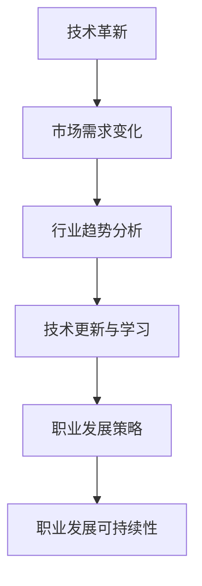

                 

关键词：行业变革、技术转型、程序员、持续学习、适应性

> 摘要：随着科技的飞速发展，IT行业正经历着前所未有的变革与转型。作为这一领域的从业者，程序员需要不断提升自身技能，适应新技术的涌现，以保持市场竞争力。本文将探讨程序员如何应对行业变革与转型，通过持续学习、技术更新和跨领域探索等策略，实现职业发展的可持续性。

## 1. 背景介绍

在过去的几十年中，计算机技术的发展速度令人惊叹。从PC时代的个人计算机到互联网时代的云计算，从静态网页到动态网站，从单一软件到跨平台应用，技术变革无处不在。然而，与这些技术进步并行的是行业的不断变革和转型。新的编程语言、开发框架、云计算平台等层出不穷，程序员面临着前所未有的挑战。

### 1.1 行业变革的原因

- **技术革新**：技术的快速发展推动行业不断迭代，旧的解决方案逐渐被新的技术所取代。
- **市场需求**：企业对高效、敏捷的开发流程和技术解决方案的需求不断增加，迫使程序员不断适应。
- **经济因素**：全球化进程加速，跨国公司对本地化解决方案的需求使得程序员需要具备跨文化和跨地域的工作能力。

### 1.2 行业变革的影响

- **职业压力**：程序员需要不断学习新技术，以保持竞争力，这给他们带来了巨大的学习压力。
- **技能要求**：随着行业的发展，对程序员的技能要求越来越高，不仅需要编程能力，还需要系统设计、项目管理等多方面的知识。
- **职业发展**：行业变革为程序员提供了更多的职业发展机会，但也要求他们具备更高的综合素质。

## 2. 核心概念与联系

### 2.1 行业变革的核心概念

- **技术变革**：包括编程语言、开发框架、数据库管理系统等。
- **行业趋势**：如云计算、大数据、人工智能等新兴技术的普及和应用。
- **市场需求**：企业对技术解决方案的需求变化。

### 2.2 行业变革的架构

```
                +----------------+
                |    程序员      |
                +----------------+
                    |             |
        +------------+             +---------------+
        |          技术          |          市场   |
        |   更新与学习           |   需求分析与响应|
        +------------+             +---------------+
                    |             |
                    | 应对策略     |
                +----------------+
                | 职业发展可持续性 |
                +----------------+
```

### 2.3 行业变革的流程图



## 3. 核心算法原理 & 具体操作步骤

### 3.1 算法原理概述

程序员应对行业变革的核心算法可以概括为：

- **持续学习**：通过定期学习新技术、新工具来保持竞争力。
- **适应性**：快速适应新技术和市场需求，调整自己的职业方向。
- **跨领域探索**：在保持核心技能的基础上，探索新的技术和应用领域。

### 3.2 算法步骤详解

#### 3.2.1 持续学习

1. **确定学习目标**：根据行业趋势和市场需求，确定需要学习的新技术和技能。
2. **制定学习计划**：合理安排时间，制定详细的学习计划。
3. **实践与应用**：在学习过程中，通过实际项目或练习来应用所学知识。

#### 3.2.2 适应性

1. **市场调研**：定期了解市场需求和技术趋势，识别新的职业机会。
2. **技能调整**：根据市场需求，调整自己的技能方向和深度。
3. **跨领域实践**：尝试参与不同领域的技术项目和合作，拓宽视野。

#### 3.2.3 跨领域探索

1. **知识积累**：在保持核心技能的同时，积累跨领域知识。
2. **项目参与**：参与多领域项目，锻炼跨领域合作和解决问题的能力。
3. **成果展示**：通过作品集、论文、演讲等形式展示自己的跨领域能力。

### 3.3 算法优缺点

#### 优点

- **提升竞争力**：通过持续学习和跨领域探索，程序员可以不断提升自身技能，增强市场竞争力。
- **职业发展**：适应行业变革和市场需求，程序员可以获得更多的职业发展机会。
- **创新能力**：跨领域探索有助于激发创新思维，为行业带来新的解决方案。

#### 缺点

- **学习压力**：持续学习和跨领域探索需要投入大量时间和精力，可能会给程序员带来较大的学习压力。
- **职业风险**：技术变革和市场需求变化可能导致某些技能迅速过时，程序员需要时刻保持警觉。

### 3.4 算法应用领域

- **软件开发**：程序员可以通过持续学习和技术更新，不断提升开发效率和项目质量。
- **项目管理**：了解行业趋势和市场需求，有助于程序员更好地管理项目和团队。
- **技术咨询**：跨领域探索和知识积累可以使程序员在技术咨询领域发挥更大的作用。

## 4. 数学模型和公式 & 详细讲解 & 举例说明

### 4.1 数学模型构建

为了更好地描述程序员应对行业变革的算法原理，我们可以构建一个简单的数学模型。假设程序员的技能水平为\( P \)，市场需求为\( D \)，则程序员的竞争力为\( C \)，可以用以下公式表示：

\[ C = f(P, D) \]

其中，函数\( f \)表示技能水平与市场需求之间的相互作用。

### 4.2 公式推导过程

根据上述模型，我们可以推导出以下公式：

\[ C = \frac{P}{D} \]

这个公式表示，程序员的竞争力与技能水平成正比，与市场需求成反比。

### 4.3 案例分析与讲解

假设一名程序员具有10年的工作经验，技能水平为\( P = 10 \)。市场需求为\( D = 5 \)，则他的竞争力为：

\[ C = \frac{10}{5} = 2 \]

这个结果表明，该程序员的竞争力为2。如果市场需求增加到\( D = 10 \)，则他的竞争力为：

\[ C = \frac{10}{10} = 1 \]

可以看到，市场需求增加，程序员的竞争力下降。这说明，在市场需求旺盛的时期，程序员需要更加努力地提升自己的技能水平，以保持竞争力。

## 5. 项目实践：代码实例和详细解释说明

### 5.1 开发环境搭建

在开始项目实践之前，我们需要搭建一个适合编程和学习的开发环境。这里以Python为例，具体步骤如下：

1. **安装Python**：从Python官方网站下载并安装Python 3.x版本。
2. **安装IDE**：选择一个合适的集成开发环境（IDE），如PyCharm或Visual Studio Code。
3. **安装依赖库**：使用pip命令安装所需的依赖库，例如`numpy`、`pandas`等。

### 5.2 源代码详细实现

以下是一个简单的Python代码实例，用于计算两个数的和：

```python
def add(a, b):
    return a + b

result = add(5, 3)
print("结果：", result)
```

在这个实例中，我们定义了一个名为`add`的函数，用于计算两个数的和。然后调用这个函数，并将结果打印出来。

### 5.3 代码解读与分析

1. **函数定义**：`def add(a, b):`表示定义了一个名为`add`的函数，参数为`a`和`b`。
2. **函数调用**：`result = add(5, 3)`表示调用`add`函数，传入参数5和3。
3. **返回值**：`return a + b`表示函数的返回值为`a`和`b`的和。
4. **打印结果**：`print("结果：", result)`用于输出函数的返回值。

### 5.4 运行结果展示

运行上述代码，输出结果如下：

```
结果： 8
```

这表明，两个数5和3的和为8。

## 6. 实际应用场景

### 6.1 软件开发

在软件开发过程中，程序员需要不断适应新技术和市场需求。例如，随着微服务架构的兴起，程序员需要掌握Docker、Kubernetes等容器化技术，以便更好地实现软件的模块化和分布式部署。

### 6.2 项目管理

在项目管理中，程序员需要了解敏捷开发、看板管理等现代管理方法，以提高项目的开发效率和团队协作能力。

### 6.3 技术咨询

在技术咨询领域，程序员需要具备跨领域的知识，以便为企业提供全面的技术解决方案。例如，了解大数据处理技术、人工智能算法等，可以帮助企业提升数据分析和决策能力。

## 7. 未来应用展望

随着科技的不断进步，程序员面临的行业变革和转型将会更加频繁。未来，程序员需要更加注重跨领域学习和跨行业合作，以应对不断变化的市场需求。此外，随着人工智能技术的发展，程序员也需要学会与机器协作，共同推动技术的进步。

## 8. 工具和资源推荐

### 8.1 学习资源推荐

- **在线课程平台**：如Coursera、Udacity、edX等，提供丰富的编程和技术课程。
- **技术博客和社区**：如GitHub、Stack Overflow、CSDN等，可以获取最新的技术资讯和解决方案。
- **专业书籍**：如《代码大全》、《设计模式：可复用的面向对象软件》等，有助于深入理解编程技术和设计方法。

### 8.2 开发工具推荐

- **集成开发环境（IDE）**：如PyCharm、Visual Studio Code、IntelliJ IDEA等，提供丰富的编程功能和插件。
- **版本控制工具**：如Git、SVN等，用于管理代码版本和协作开发。
- **容器化技术**：如Docker、Kubernetes等，用于简化应用程序的部署和管理。

### 8.3 相关论文推荐

- **《大规模分布式存储系统：原理解析与架构实战》**：详细介绍了分布式存储系统的原理和架构。
- **《深度学习：人工智能的理论与实现》**：介绍了深度学习的基本理论和应用实践。
- **《大数据技术导论》**：涵盖了大数据技术的基础知识和应用场景。

## 9. 总结：未来发展趋势与挑战

### 9.1 研究成果总结

通过本文的探讨，我们可以得出以下结论：

- **持续学习**：是程序员应对行业变革和转型的关键。
- **适应性**：是程序员保持市场竞争力的重要因素。
- **跨领域探索**：有助于程序员拓宽视野，提高综合素质。

### 9.2 未来发展趋势

- **技术创新**：新技术将持续涌现，程序员需要不断学习和适应。
- **行业融合**：不同行业之间的技术融合将越来越普遍。
- **人工智能**：人工智能将在软件开发、项目管理等领域发挥更大作用。

### 9.3 面临的挑战

- **技能更新**：程序员需要不断学习新技术，以保持竞争力。
- **职业压力**：持续学习和跨领域探索可能会给程序员带来较大的压力。
- **职业风险**：技术变革和市场需求变化可能导致某些技能迅速过时。

### 9.4 研究展望

未来，程序员需要更加注重跨领域学习和跨行业合作，以应对不断变化的市场需求。同时，随着人工智能技术的发展，程序员也需要学会与机器协作，共同推动技术的进步。总之，只有不断适应行业变革，程序员才能在未来的职业发展中立于不败之地。

## 10. 附录：常见问题与解答

### 问题1：如何选择学习资源？

解答：选择学习资源时，应考虑以下因素：

- **质量**：选择权威的教材、课程或教程，确保学习内容准确可靠。
- **适用性**：根据自身情况和需求，选择适合的学习资源。
- **更新频率**：优先选择更新频率高的资源，确保所学内容不过时。

### 问题2：如何保持学习的动力？

解答：以下方法有助于保持学习的动力：

- **制定学习计划**：合理安排学习时间，确保学习有序进行。
- **设定目标**：明确学习目标，激励自己不断前进。
- **实践应用**：通过实际项目或练习，将所学知识应用到实际工作中。

### 问题3：如何适应行业变革？

解答：适应行业变革的方法包括：

- **持续学习**：不断更新知识和技能，紧跟行业趋势。
- **跨领域探索**：拓宽视野，学习跨领域的知识和技能。
- **积极沟通**：与同行交流，了解行业动态和市场需求。

### 问题4：如何提高项目管理能力？

解答：提高项目管理能力的方法包括：

- **学习项目管理知识**：掌握项目管理的基本理论和技巧。
- **实践经验**：参与实际项目，锻炼项目管理能力。
- **团队合作**：提升团队协作能力，提高项目执行力。

### 问题5：如何应对职业压力？

解答：应对职业压力的方法包括：

- **调整心态**：保持积极乐观的心态，正确看待职业压力。
- **合理安排**：合理安排工作和生活，避免过度劳累。
- **寻求支持**：向家人、朋友或同事寻求支持和帮助。

---

作者：禅与计算机程序设计艺术 / Zen and the Art of Computer Programming
```

