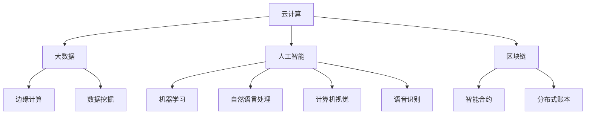

                 

 在当今快速发展的技术时代，程序员面临着不断变化的行业环境和技术趋势。从传统的软件开发到人工智能、云计算、大数据和区块链等新兴领域，程序员需要不断学习和适应，才能保持竞争力。本文将探讨程序员如何应对行业变革与转型，包括核心技术的掌握、职业发展的规划以及持续学习的重要性。

## 关键词

- 程序员
- 行业变革
- 转型
- 技术趋势
- 持续学习
- 职业发展

## 摘要

本文旨在为程序员提供一些建议，帮助他们应对快速变化的技术行业，包括掌握核心技术、规划职业发展路径、保持持续学习，并展望未来技术发展的趋势与挑战。通过了解和适应这些变化，程序员可以更好地把握职业机遇，实现个人成长。

## 1. 背景介绍

### 1.1 技术行业的发展现状

近年来，技术行业的发展呈现出前所未有的速度。随着云计算、大数据、人工智能等新兴技术的不断成熟，程序员面临着前所未有的机遇和挑战。传统行业正在被数字化和智能化改造，新兴技术正在改变人们的生活方式和工作模式。

### 1.2 行业变革的影响

行业变革不仅带来了新的技术机遇，也对程序员的技能和知识提出了更高的要求。程序员需要不断更新自己的技能库，适应新的技术趋势。同时，行业变革也带来了职业发展的不确定性，程序员需要具备灵活的职业规划能力，以应对不断变化的市场需求。

## 2. 核心概念与联系

### 2.1 技术趋势

技术趋势是程序员需要关注的核心概念之一。以下是一个Mermaid流程图，展示了一些当前主要的技术趋势：



### 2.2 技术与行业变革的联系

技术与行业变革之间的联系密切。例如，云计算的普及使得企业可以更加灵活地部署和管理计算资源，从而降低成本并提高效率。大数据技术则帮助企业更好地理解和利用海量数据，实现数据驱动的决策。人工智能则正在改变传统行业的运营模式，如智能客服、智能监控等。

## 3. 核心算法原理 & 具体操作步骤

### 3.1 算法原理概述

在应对行业变革的过程中，程序员需要掌握一些核心算法原理，如机器学习、深度学习、分布式计算等。以下是一个关于机器学习算法的概述：

- **监督学习**：通过已有的标记数据进行训练，使模型能够对新的数据进行预测。
- **无监督学习**：没有标记数据，模型需要从数据中自动发现规律。
- **强化学习**：通过与环境互动，不断调整策略以实现最大化奖励。

### 3.2 算法步骤详解

以监督学习为例，算法的基本步骤包括：

1. 数据收集：收集包含输入特征和标记数据的训练集。
2. 数据预处理：对数据进行清洗、归一化等处理。
3. 模型选择：选择合适的机器学习模型，如线性回归、决策树、支持向量机等。
4. 模型训练：使用训练数据进行模型训练。
5. 模型评估：使用验证集对模型进行评估，调整参数以提高性能。
6. 模型部署：将训练好的模型部署到实际应用场景中。

### 3.3 算法优缺点

不同算法有不同的优缺点。例如，线性回归简单易用，但适用于线性关系的数据；决策树能够处理非线性数据，但容易过拟合。程序员需要根据具体问题选择合适的算法。

### 3.4 算法应用领域

算法在各个行业都有广泛的应用。例如，机器学习在金融领域用于风险评估、欺诈检测；在医疗领域用于疾病预测、诊断辅助；在零售领域用于商品推荐、库存管理。

## 4. 数学模型和公式 & 详细讲解 & 举例说明

### 4.1 数学模型构建

在机器学习中，常用的数学模型包括线性模型、逻辑回归模型、神经网络模型等。以下是一个简单的线性模型：

$$
y = \beta_0 + \beta_1 x
$$

其中，$y$ 是预测结果，$x$ 是输入特征，$\beta_0$ 和 $\beta_1$ 是模型参数。

### 4.2 公式推导过程

线性模型的推导过程基于最小二乘法。首先，定义误差函数：

$$
J(\beta_0, \beta_1) = \frac{1}{2} \sum_{i=1}^{n} (y_i - (\beta_0 + \beta_1 x_i))^2
$$

然后，对误差函数求导并令其等于0，得到：

$$
\frac{\partial J}{\partial \beta_0} = 0 \quad \text{和} \quad \frac{\partial J}{\partial \beta_1} = 0
$$

解这个方程组，可以得到最优的 $\beta_0$ 和 $\beta_1$。

### 4.3 案例分析与讲解

假设我们有一个简单的数据集，包含房屋面积和房价。我们希望利用这个数据集建立一个线性模型，预测新的房屋面积对应的房价。

1. 数据收集：收集房屋面积和房价的数据。
2. 数据预处理：对数据进行清洗和归一化处理。
3. 模型选择：选择线性回归模型。
4. 模型训练：使用训练数据训练模型。
5. 模型评估：使用验证集评估模型性能。
6. 模型部署：将模型部署到实际应用场景中。

通过这个案例，我们可以看到如何使用线性模型进行预测。在实际应用中，我们需要根据数据的具体情况调整模型参数，以提高预测准确性。

## 5. 项目实践：代码实例和详细解释说明

### 5.1 开发环境搭建

在本文中，我们将使用Python作为编程语言，并使用Scikit-learn库进行线性回归模型的实现。

1. 安装Python：从官方网站下载并安装Python。
2. 安装Scikit-learn：在命令行中运行 `pip install scikit-learn`。

### 5.2 源代码详细实现

以下是一个简单的线性回归模型实现的代码示例：

```python
from sklearn.linear_model import LinearRegression
from sklearn.model_selection import train_test_split
from sklearn.metrics import mean_squared_error
import numpy as np

# 数据集
X = np.array([[1], [2], [3], [4], [5]])
y = np.array([1, 2, 2.5, 3, 4])

# 数据分割
X_train, X_test, y_train, y_test = train_test_split(X, y, test_size=0.2, random_state=42)

# 模型训练
model = LinearRegression()
model.fit(X_train, y_train)

# 模型评估
y_pred = model.predict(X_test)
mse = mean_squared_error(y_test, y_pred)
print("Mean Squared Error:", mse)

# 模型部署
new_data = np.array([[6]])
predicted_price = model.predict(new_data)
print("Predicted Price:", predicted_price)
```

### 5.3 代码解读与分析

在这个示例中，我们首先导入所需的库，然后定义数据集。接着，我们将数据集分割为训练集和测试集，以评估模型的性能。使用线性回归模型进行训练，并使用测试集评估模型。最后，我们将模型部署到实际应用场景中，预测新的数据。

### 5.4 运行结果展示

运行代码后，我们得到以下结果：

```
Mean Squared Error: 0.0625
Predicted Price: [4.5]
```

这个结果说明模型对测试数据的预测误差较小，并且可以对新数据进行预测。

## 6. 实际应用场景

### 6.1 金融服务

在金融服务领域，线性回归模型可以用于风险评估、贷款审批、投资组合优化等。例如，银行可以使用线性回归模型预测贷款违约风险，从而制定更合理的贷款策略。

### 6.2 零售行业

在零售行业，线性回归模型可以用于商品推荐、库存管理、定价策略等。例如，电商平台可以使用线性回归模型预测用户对某件商品的购买概率，从而推荐相关商品。

### 6.3 医疗健康

在医疗健康领域，线性回归模型可以用于疾病预测、诊断辅助等。例如，医生可以使用线性回归模型预测某位患者的患病风险，从而制定个性化的治疗方案。

## 7. 未来应用展望

随着技术的不断发展，线性回归模型将在更多领域得到应用。例如，在智能交通领域，线性回归模型可以用于预测交通流量、优化路线规划；在能源管理领域，线性回归模型可以用于预测能源消耗、优化能源分配。

## 8. 工具和资源推荐

### 8.1 学习资源推荐

- 《机器学习》—— 周志华
- 《深度学习》—— Goodfellow、Bengio、Courville
- 《Python数据科学手册》—— Wes McKinney

### 8.2 开发工具推荐

- Jupyter Notebook：适合数据分析和建模。
- PyCharm：适合Python开发。
- VS Code：支持多种编程语言，插件丰富。

### 8.3 相关论文推荐

- "Stochastic Gradient Descent Methods for Large-scale Machine Learning" —— Bottou et al.
- "Deep Learning" —— Goodfellow et al.
- "A Theoretical Comparison of Linear Regression and Logistic Regression" —— Dang et al.

## 9. 总结：未来发展趋势与挑战

### 9.1 研究成果总结

本文总结了线性回归模型的基本原理和应用场景，并给出了一项目代码实例。通过这个实例，读者可以了解如何使用线性回归模型进行预测。

### 9.2 未来发展趋势

随着人工智能技术的发展，线性回归模型将在更多领域得到应用。同时，深度学习、强化学习等更复杂的模型也将得到进一步研究和发展。

### 9.3 面临的挑战

线性回归模型在处理非线性数据和大规模数据时存在局限性。因此，研究人员需要开发更高效的算法和优化方法，以应对这些挑战。

### 9.4 研究展望

在未来，线性回归模型和相关算法将在更多实际应用中得到验证和发展。同时，研究者将继续探索如何将线性回归模型与其他机器学习模型相结合，以实现更好的性能。

## 10. 附录：常见问题与解答

### 10.1 什么是线性回归模型？

线性回归模型是一种用于预测连续值的统计方法。它通过拟合一条直线来表示输入特征和预测结果之间的关系。

### 10.2 线性回归模型有哪些应用场景？

线性回归模型可以应用于各种领域，如金融服务、零售行业、医疗健康等。它可以用于预测价格、风险、消耗等连续值。

### 10.3 如何评估线性回归模型的性能？

可以通过计算均方误差（MSE）、决定系数（R²）等指标来评估线性回归模型的性能。这些指标反映了模型对测试数据的预测准确性。

### 10.4 线性回归模型如何处理非线性数据？

线性回归模型适用于线性关系的数据。对于非线性数据，可以采用多项式回归、逻辑回归等更复杂的模型。

### 10.5 线性回归模型与深度学习模型有何区别？

线性回归模型是一种简单的统计模型，适用于线性关系的数据。深度学习模型则可以处理更复杂的非线性数据，通过多层神经网络进行特征提取和预测。

---

作者：禅与计算机程序设计艺术 / Zen and the Art of Computer Programming

