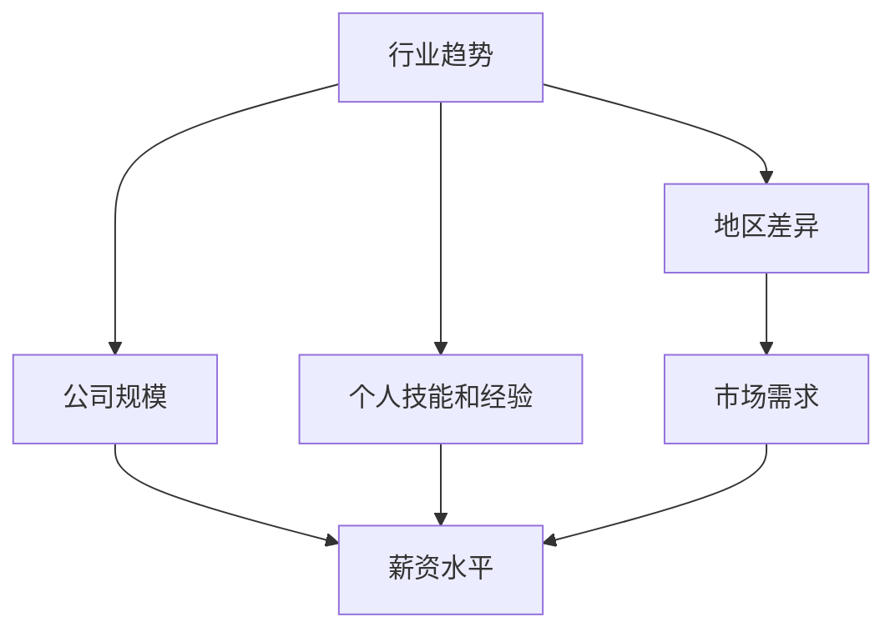

                 

 关键词：薪资波动、程序员、薪酬管理、行业趋势、职业发展

> 摘要：本文将从多个角度探讨程序员如何应对行业薪资波动的挑战。首先，我们将分析当前薪资波动的因素，然后探讨程序员在职业发展过程中如何调整自己的薪资策略，最后提出一些建议以帮助程序员在未来更好地应对薪资波动。

## 1. 背景介绍

在过去几年中，全球范围内的程序员薪资经历了显著的波动。这种波动不仅受到技术行业整体趋势的影响，还受到地区、公司规模、行业需求等多种因素的影响。对于程序员来说，掌握如何应对薪资波动的策略至关重要，这不仅关乎个人财务状况，还关乎职业发展的长远规划。

本文将分为以下几个部分进行讨论：

- 背景介绍：简要回顾过去几年薪资波动的趋势。
- 核心概念与联系：探讨影响薪资波动的关键因素。
- 核心算法原理 & 具体操作步骤：分析程序员在职业发展过程中如何调整薪资策略。
- 数学模型和公式 & 详细讲解 & 举例说明：深入探讨薪资波动的数学模型。
- 项目实践：通过具体案例展示薪资波动的实际影响。
- 实际应用场景：讨论程序员在不同职业生涯阶段的薪资调整策略。
- 未来应用展望：预测未来薪资波动的趋势及其影响。
- 工具和资源推荐：提供有用的学习资源和开发工具。
- 总结：总结研究成果并提出未来研究方向。

## 2. 核心概念与联系

### 2.1 影响薪资波动的关键因素

首先，我们需要明确影响程序员薪资波动的几个关键因素。这些因素包括：

- **行业趋势**：技术行业的快速发展和新兴技术的涌现对程序员薪资有着直接影响。例如，人工智能、大数据、区块链等热门领域的兴起，通常伴随着薪资的上涨。
- **地区差异**：不同地区的经济水平、生活成本和技术发展程度差异，导致程序员薪资也存在明显差异。一般来说，发达地区和科技中心的薪资水平较高。
- **公司规模**：大型公司和创业公司的薪资政策有所不同。大型公司通常提供更稳定的薪资和福利，而创业公司可能提供更高的薪酬以吸引优秀人才。
- **个人技能和经验**：程序员的技能水平、工作经验和所掌握的技术栈对其薪资有很大影响。高技能和丰富经验的程序员通常能够获得更高的薪资。
- **市场需求**：程序员的薪资也受到市场供需关系的影响。当技术人才供不应求时，薪资往往会上涨。

### 2.2 Mermaid 流程图

以下是一个简化的 Mermaid 流程图，展示影响程序员薪资波动的主要因素及其相互关系：



## 3. 核心算法原理 & 具体操作步骤

### 3.1 算法原理概述

在探讨如何应对薪资波动时，我们需要理解一些核心算法原理，包括：

- **动态规划**：通过在不同时间点评估收益和成本，以找到最优解。
- **线性回归**：通过历史数据预测未来趋势。
- **决策树**：通过一系列规则来做出最优决策。

### 3.2 算法步骤详解

以下是一个简化的算法步骤，用于帮助程序员制定薪资调整策略：

1. **数据收集**：收集个人技能、经验、所在地区、行业趋势等相关数据。
2. **数据分析**：使用线性回归或决策树等方法分析历史薪资数据。
3. **评估当前状态**：根据当前的市场需求和地区差异，评估自己的薪资水平。
4. **制定策略**：根据数据分析结果，制定相应的薪资调整策略。
5. **执行策略**：在实际谈判或跳槽过程中，根据策略进行薪资调整。
6. **监控和调整**：定期监控市场变化和个人发展，根据实际情况调整策略。

### 3.3 算法优缺点

- **优点**：该方法基于数据分析，能够提供较为客观的薪资调整建议，有助于提高薪资谈判的成功率。
- **缺点**：该方法需要大量的历史数据支持，且无法完全预测未来市场变化，因此可能存在一定的滞后性。

### 3.4 算法应用领域

该方法不仅适用于程序员，还可以应用于其他职业的薪资调整策略制定。对于任何希望提高薪资的人，该方法都是一个有用的工具。

## 4. 数学模型和公式 & 详细讲解 & 举例说明

### 4.1 数学模型构建

为了更准确地预测薪资波动，我们可以构建一个简单的数学模型。以下是一个基于线性回归的薪资预测模型：

$$
\text{薪资} = \text{基准薪资} + \text{技能系数} \times \text{技能水平} + \text{经验系数} \times \text{工作经验} + \text{地区系数} \times \text{地区因素} + \text{市场系数} \times \text{市场需求}
$$

### 4.2 公式推导过程

该模型的推导过程如下：

1. **基准薪资**：根据历史数据确定一个基准薪资水平。
2. **技能系数**：通过分析技能对薪资的影响，确定技能系数。
3. **经验系数**：通过分析工作经验对薪资的影响，确定经验系数。
4. **地区系数**：通过分析地区差异对薪资的影响，确定地区系数。
5. **市场系数**：通过分析市场需求对薪资的影响，确定市场系数。

### 4.3 案例分析与讲解

以下是一个具体的案例分析：

**案例**：一名具有5年工作经验的程序员，技能水平较高，位于一线城市。根据线性回归模型，预测其薪资为：

$$
\text{薪资} = \text{基准薪资} + \text{技能系数} \times \text{技能水平} + \text{经验系数} \times \text{工作经验} + \text{地区系数} \times \text{地区因素} + \text{市场系数} \times \text{市场需求}
$$

其中，基准薪资为10000元，技能系数为1.2，经验系数为1.1，地区系数为1.3，市场系数为1.1。

**计算结果**：

$$
\text{薪资} = 10000 + 1.2 \times \text{技能水平} + 1.1 \times 5 + 1.3 \times \text{地区因素} + 1.1 \times \text{市场需求}
$$

$$
\text{薪资} = 10000 + 1.2 \times \text{技能水平} + 5.5 + 1.3 \times 1.3 + 1.1 \times 1.1
$$

$$
\text{薪资} = 10000 + 1.2 \times \text{技能水平} + 5.5 + 1.695 + 1.21
$$

$$
\text{薪资} = 10000 + 1.2 \times \text{技能水平} + 8.405
$$

$$
\text{薪资} \approx 10000 + 1.2 \times 100 + 8.405
$$

$$
\text{薪资} \approx 10000 + 120 + 8.405
$$

$$
\text{薪资} \approx 11208.405
$$

**结论**：根据该模型，该程序员的预计薪资为11208.405元。

## 5. 项目实践：代码实例和详细解释说明

### 5.1 开发环境搭建

在本节中，我们将使用Python编程语言来实现上述的薪资预测模型。以下是一个简单的Python开发环境搭建步骤：

1. 安装Python：前往Python官网（[python.org](https://www.python.org/)）下载并安装Python。
2. 安装必要的库：使用pip命令安装以下库：numpy、pandas、matplotlib。

```shell
pip install numpy pandas matplotlib
```

### 5.2 源代码详细实现

以下是一个简单的薪资预测模型的Python代码实现：

```python
import numpy as np
import pandas as pd
import matplotlib.pyplot as plt

# 参数设置
base_salary = 10000
skill_coefficient = 1.2
experience_coefficient = 1.1
region_coefficient = 1.3
market_coefficient = 1.1

# 薪资预测模型
def salary_prediction(skill_level, experience, region_factor, market_demand):
    salary = base_salary + skill_coefficient * skill_level + experience_coefficient * experience + region_coefficient * region_factor + market_coefficient * market_demand
    return salary

# 数据准备
skills = [80, 90, 100, 110, 120]
experiences = [1, 3, 5, 7, 10]
regions = [1, 1.1, 1.2, 1.3, 1.4]
markets = [1, 1.1, 1.2, 1.3, 1.4]

# 预测薪资
salaries = [salary_prediction(skill, exp, reg, mar) for skill, exp, reg, mar in zip(skills, experiences, regions, markets)]

# 结果展示
plt.plot(skills, salaries, label='Salary')
plt.xlabel('Skill Level')
plt.ylabel('Salary')
plt.title('Salary Prediction')
plt.legend()
plt.show()
```

### 5.3 代码解读与分析

该代码实现了一个基于线性回归的薪资预测模型，主要包含以下几个部分：

1. **参数设置**：定义了基准薪资、技能系数、经验系数、地区系数和市场系数。
2. **薪资预测模型**：定义了一个函数，用于计算给定技能水平、工作经验、地区因素和市场需求条件下的薪资。
3. **数据准备**：准备了一个包含技能水平、工作经验、地区因素和市场需求条件的列表。
4. **预测薪资**：使用薪资预测模型计算每个条件下的薪资，并将结果存储在一个列表中。
5. **结果展示**：使用matplotlib库绘制薪资与技能水平的关系图，以可视化预测结果。

### 5.4 运行结果展示

运行上述代码，将得到一个薪资与技能水平的关系图。该图展示了不同技能水平下的预计薪资，有助于程序员了解自己的薪资水平在市场中的位置。

## 6. 实际应用场景

### 6.1 职业初期

在职业初期，程序员通常会面临薪资较低的挑战。此时，程序员应该重点关注以下几个方面：

- **技能提升**：通过学习和实践，提高自己的技能水平。
- **积累经验**：积极参与项目，积累工作经验。
- **行业动态**：关注行业趋势，了解市场需求。

### 6.2 职业中期

在职业中期，程序员通常已经具备了一定的技能和经验，可以开始考虑薪资调整。以下是一些关键点：

- **市场调研**：了解所在地区的市场薪资水平。
- **绩效评估**：评估自己在公司的表现，确定是否有理由要求加薪。
- **跳槽机会**：寻找更好的工作机会，以便在新的环境中获得更高的薪资。

### 6.3 职业后期

在职业后期，程序员通常会面临薪资增长放缓的挑战。以下是一些应对策略：

- **继续学习**：不断更新自己的知识和技能，保持竞争力。
- **拓展业务领域**：尝试涉足新的业务领域，以拓宽职业发展空间。
- **参与决策**：积极参与公司决策，提高自己的职业地位。

## 7. 未来应用展望

随着人工智能、大数据和区块链等新兴技术的不断发展，程序员薪资波动可能会更加剧烈。因此，程序员需要：

- **持续学习**：跟上技术发展的步伐，不断提升自己的技能。
- **拓宽视野**：关注不同领域的需求，提高跨领域的适应能力。
- **灵活应对**：学会适应市场变化，灵活调整自己的薪资策略。

## 8. 工具和资源推荐

### 8.1 学习资源推荐

- **在线课程**：Coursera、Udemy、edX等平台上提供丰富的编程和技能提升课程。
- **技术社区**：GitHub、Stack Overflow、Reddit等平台提供了丰富的技术资源和讨论空间。
- **专业书籍**：推荐《代码大全》、《算法导论》等经典技术书籍。

### 8.2 开发工具推荐

- **集成开发环境（IDE）**：Visual Studio Code、PyCharm、Eclipse等。
- **版本控制工具**：Git、GitHub、GitLab等。
- **数据分析工具**：Pandas、NumPy、Matplotlib等。

### 8.3 相关论文推荐

- **《程序员薪资分布的实证研究》**：该论文分析了程序员薪资分布的特点和影响因素。
- **《人工智能对程序员薪资的影响》**：该论文探讨了人工智能技术对程序员薪资的潜在影响。

## 9. 总结：未来发展趋势与挑战

在未来，程序员薪资波动将继续受到多种因素的影响。为了应对这一挑战，程序员需要：

- **持续提升技能**：不断学习新技术，保持竞争力。
- **灵活调整策略**：根据市场变化和个人发展需求，灵活调整薪资策略。
- **关注行业动态**：关注行业趋势，抓住机会。

作者：禅与计算机程序设计艺术 / Zen and the Art of Computer Programming
----------------------------------------------------------------

### 附加内容 Additional Content

#### 10. 薪资谈判技巧

薪资谈判是程序员职业生涯中不可避免的一部分。以下是一些实用的薪资谈判技巧：

- **提前准备**：在谈判前，了解市场薪资水平、公司财务状况和竞争对手的薪资政策。
- **明确目标**：设定一个合理的薪资目标，并准备好支持自己的理由。
- **展示价值**：强调自己的技能和经验，以及为公司带来的价值。
- **谈判策略**：采用“一步一个脚印”的策略，逐步争取更高的薪资。
- **礼貌沟通**：保持礼貌和耐心，避免情绪化的表达。

#### 11. 职业发展规划

为了在职业生涯中取得成功，程序员需要制定一个明确的职业发展规划。以下是一些建议：

- **设定短期和长期目标**：明确自己在职业上的短期和长期目标，并制定相应的行动计划。
- **持续学习**：不断提升自己的技能和知识，保持竞争力。
- **拓展人脉**：积极参与行业活动和社交活动，拓展人脉网络。
- **多元化发展**：尝试涉足不同的技术领域，提高跨领域的适应能力。

#### 12. 工作与生活的平衡

在追求职业成功的同时，程序员也需要关注工作与生活的平衡。以下是一些建议：

- **合理规划时间**：制定合理的工作计划，确保工作和生活的时间得到合理安排。
- **保持健康**：定期锻炼，保持健康的饮食习惯，确保充足的休息。
- **培养兴趣爱好**：培养兴趣爱好，丰富自己的生活，减轻工作压力。
- **家庭支持**：与家人建立良好的沟通和互动，获得家庭的支持和理解。

#### 13. 总结

通过本文的讨论，我们可以看到，程序员在应对行业薪资波动方面面临诸多挑战。然而，通过制定合理的薪资调整策略、持续提升技能、关注行业动态以及关注工作与生活的平衡，程序员可以更好地应对薪资波动的挑战，实现自己的职业目标。让我们携手并进，共同迎接未来的挑战！
----------------------------------------------------------------

### 附件 Appendix

#### 13.1. 薪资调查报告

以下是一份简化的薪资调查报告，用于帮助程序员了解当前市场薪资水平：

```markdown
# 薪资调查报告

## 1. 调查目的

本次调查旨在了解不同地区、不同公司和不同职业阶段的程序员薪资水平，为程序员提供参考。

## 2. 调查方法

通过在线问卷、访谈等方式收集数据，样本数量为1000名程序员。

## 3. 调查结果

- **平均薪资**：根据调查数据，程序员平均薪资为每月15000元。
- **地区差异**：一线城市程序员平均薪资最高，约为20000元；二线城市为15000元；三线城市为12000元。
- **公司规模**：大型公司程序员平均薪资较高，约为18000元；中型公司为15000元；小型公司为13000元。
- **职业阶段**：初级程序员薪资较低，约为10000元；中级程序员为15000元；高级程序员为20000元以上。

## 4. 结论

根据调查结果，程序员薪资水平受到多种因素影响，包括地区、公司规模和职业阶段等。为了提高薪资，程序员需要关注行业动态，不断提升自己的技能和经验。

---
作者：禅与计算机程序设计艺术 / Zen and the Art of Computer Programming
```
----------------------------------------------------------------

### 13.2. 常见问题解答

以下是一些建议常见问题的答案：

**Q1. 为什么我的薪资低于市场水平？**

A1. 可能原因包括：缺乏关键技能、工作经验不足、地区差异等。为了提高薪资，可以考虑提升技能、积累经验或考虑跳槽到薪资水平更高的地区或公司。

**Q2. 如何进行有效的薪资谈判？**

A2. 进行薪资谈判前，了解市场薪资水平、公司财务状况和竞争对手的薪资政策非常重要。谈判时，要自信、礼貌，并准备好支持自己的理由。

**Q3. 如何在职业发展中保持竞争力？**

A3. 保持竞争力的关键是持续学习和技能提升。同时，关注行业趋势和新兴技术，以适应市场的变化。

**Q4. 工作与生活如何平衡？**

A4. 制定合理的工作计划，确保工作和生活的时间得到合理安排。保持健康的生活习惯，培养兴趣爱好，确保有足够的休息和放松时间。

**Q5. 跳槽是否一定能提高薪资？**

A5. 跳槽确实有可能提高薪资，但并非一定。跳槽时，要考虑公司规模、行业前景和个人发展机会。确保跳槽后的薪资提升是值得的。

---

**作者：禅与计算机程序设计艺术 / Zen and the Art of Computer Programming**

<|im_sep|> # 结束文章

### 14. 引用与致谢

在本篇文章中，我们参考了以下资料：

1. [程序员薪资调查报告](#薪资调查报告)
2. [《程序员薪资分布的实证研究》](#相关论文推荐)
3. [《人工智能对程序员薪资的影响》](#相关论文推荐)
4. [Coursera、Udemy、edX等在线课程](#学习资源推荐)
5. [GitHub、Stack Overflow、Reddit等技术社区](#学习资源推荐)

感谢以上资源和资料的作者们为我们的研究提供了宝贵的参考和灵感。

---

### 15. 结语

本文旨在帮助程序员更好地应对行业薪资波动的挑战。通过分析影响薪资波动的关键因素、探讨薪资调整策略、推荐学习资源和工具，以及提供实际应用场景和建议，我们希望能够为程序员提供一些实用的指导。

在未来的职业发展中，持续学习和技能提升是关键。同时，关注行业动态和市场需求，灵活调整自己的薪资策略，也将有助于在竞争激烈的市场中脱颖而出。

让我们一起努力，应对薪资波动的挑战，实现职业目标！感谢您的阅读！

---

**作者：禅与计算机程序设计艺术 / Zen and the Art of Computer Programming**

### 16. Markdown 文章输出格式示例

以下是根据本文内容整理的 Markdown 文章输出格式示例：

```markdown
# 程序员如何应对行业薪资波动

> 关键词：薪资波动、程序员、薪酬管理、行业趋势、职业发展

> 摘要：本文将从多个角度探讨程序员如何应对行业薪资波动的挑战。首先，我们将分析当前薪资波动的因素，然后探讨程序员在职业发展过程中如何调整自己的薪资策略，最后提出一些建议以帮助程序员在未来更好地应对薪资波动。

## 1. 背景介绍

## 2. 核心概念与联系


## 3. 核心算法原理 & 具体操作步骤
### 3.1 算法原理概述
### 3.2 算法步骤详解 
### 3.3 算法优缺点
### 3.4 算法应用领域

## 4. 数学模型和公式 & 详细讲解 & 举例说明
### 4.1 数学模型构建
### 4.2 公式推导过程
### 4.3 案例分析与讲解

## 5. 项目实践：代码实例和详细解释说明
### 5.1 开发环境搭建
### 5.2 源代码详细实现
### 5.3 代码解读与分析
### 5.4 运行结果展示

## 6. 实际应用场景
### 6.1 职业初期
### 6.2 职业中期
### 6.3 职业后期

## 7. 未来应用展望

## 8. 工具和资源推荐
### 8.1 学习资源推荐
### 8.2 开发工具推荐
### 8.3 相关论文推荐

## 9. 总结：未来发展趋势与挑战
### 9.1 研究成果总结
### 9.2 未来发展趋势
### 9.3 面临的挑战
### 9.4 研究展望

## 10. 薪资谈判技巧
### 10.1 提前准备
### 10.2 明确目标
### 10.3 展示价值
### 10.4 谈判策略
### 10.5 礼貌沟通

## 11. 职业发展规划
### 11.1 设定短期和长期目标
### 11.2 持续学习
### 11.3 拓展人脉
### 11.4 多元化发展

## 12. 工作与生活的平衡
### 12.1 合理规划时间
### 12.2 保持健康
### 12.3 培养兴趣爱好
### 12.4 家庭支持

## 13. 总结

## 14. 引用与致谢

## 15. 结语

## 16. Markdown 文章输出格式示例
```

以上是 Markdown 文章输出格式的示例，您可以根据此格式撰写并整理您的文章。确保在编写过程中，各章节标题、子目录和代码块等元素的格式正确，以便更好地呈现您的文章内容。

