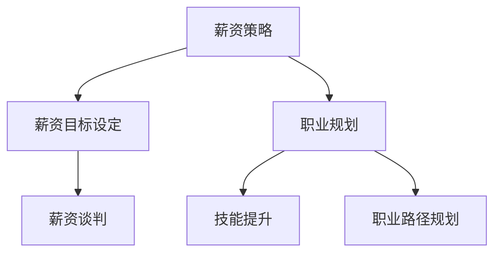

                 

关键词：薪资波动、程序员、行业趋势、薪资策略、职业规划

> 摘要：本文将探讨程序员在应对薪资波动时所需的策略和技巧。我们将分析行业薪资波动的因素，探讨程序员如何调整自己的薪资策略，并分享职业规划的重要性。通过了解这些关键因素，程序员将能够更好地把握自己的职业生涯，实现薪资的稳步增长。

## 1. 背景介绍

### 薪资波动的原因

#### 经济环境

经济环境是影响薪资波动的重要因素。经济繁荣时，企业通常会增加招聘和投资，从而提高员工的薪资水平。相反，在经济衰退时期，企业可能会削减成本，减少招聘，导致薪资水平下降。

#### 技术发展

技术的迅速发展也对程序员薪资产生重大影响。新兴技术的兴起和普及往往会导致相关领域的需求增加，进而推高薪资水平。然而，当技术逐渐成熟并普及到整个行业时，薪资增长速度可能会放缓。

#### 地域差异

不同地区的生活成本和就业市场状况也会影响薪资水平。通常情况下，发达地区和科技中心（如美国硅谷、中国北京）的薪资水平相对较高，而生活成本较低的地区则可能提供更具竞争力的薪资。

### 程序员面临的挑战

#### 竞争压力

随着技术的不断进步和编程语言的多样化，程序员面临的市场竞争日益激烈。新兴人才和技术不断涌现，使得雇主在选择候选人时拥有更多选择。

#### 转型压力

技术的快速迭代要求程序员不断学习新技能，以保持竞争力。对于那些不愿意或无法适应变化的程序员来说，薪资波动可能成为他们职业生涯中的重大挑战。

#### 工作生活平衡

现代程序员常常需要在工作与生活之间寻求平衡。长期加班和高强度工作不仅会影响个人的健康，还可能导致职业发展的停滞。

## 2. 核心概念与联系

### 薪资策略

#### 薪资目标设定

设定明确的薪资目标对于程序员来说至关重要。这包括了解自己的市场价值，并根据行业趋势和自己的技能水平设定合理的薪资目标。

#### 薪资谈判

薪资谈判是程序员职业生涯中的一个关键环节。掌握谈判技巧，了解薪资谈判的最佳时机和策略，能够帮助程序员获得更高的薪资。

### 职业规划

#### 技能提升

持续提升自己的技能水平是程序员保持竞争力的关键。通过参加培训课程、参加技术会议和阅读相关书籍，程序员可以不断扩展自己的技能库。

#### 职业路径规划

规划清晰的职业路径有助于程序员明确自己的发展方向。这包括了解不同职业角色和晋升路径，以及如何为自己的职业发展设定目标。

### Mermaid 流程图



## 3. 核心算法原理 & 具体操作步骤

### 3.1 算法原理概述

薪资策略和职业规划的核心在于数据分析和决策制定。程序员需要收集和整理与薪资相关的数据，如行业薪资水平、个人技能评估、市场趋势等，然后运用数据分析方法，制定出合理的薪资目标和职业规划。

### 3.2 算法步骤详解

#### 3.2.1 数据收集

- **行业薪资调查**：通过在线调查、招聘网站和行业报告收集相关数据。
- **个人技能评估**：评估自己在行业中的技能水平，包括编程语言、框架、数据库和算法等方面的知识。

#### 3.2.2 数据分析

- **薪资水平分析**：对比行业薪资水平，了解自己的市场价值。
- **技能需求分析**：分析当前市场需求，了解哪些技能最受雇主欢迎。

#### 3.2.3 决策制定

- **薪资目标设定**：根据分析结果设定合理的薪资目标。
- **职业规划制定**：明确自己的职业发展方向，包括短期和长期目标。

### 3.3 算法优缺点

#### 优点

- **数据驱动**：通过数据分析和决策制定，使得薪资策略和职业规划更加科学和客观。
- **灵活调整**：可以根据市场变化和个人发展情况，灵活调整薪资目标和职业规划。

#### 缺点

- **数据准确性**：数据收集和整理的准确性直接影响分析结果，可能存在偏差。
- **时间成本**：进行数据分析和决策制定需要一定的时间投入。

### 3.4 算法应用领域

- **薪资谈判**：在薪资谈判过程中，数据分析可以帮助程序员了解自己的市场价值，提高谈判成功率。
- **职业发展**：通过职业规划，程序员可以明确自己的发展方向，提高职业发展的稳定性。

## 4. 数学模型和公式 & 详细讲解 & 举例说明

### 4.1 数学模型构建

薪资水平（S）与个人技能水平（T）、市场需求（M）和地域因素（D）之间的关系可以表示为：

\[ S = f(T, M, D) \]

### 4.2 公式推导过程

\[ S = T \times M \times D \]

其中：

- \( T \)：个人技能水平，表示为技能评分（Skill Score）。
- \( M \)：市场需求，表示为市场热度（Market Demand）。
- \( D \)：地域因素，表示为生活成本指数（Cost of Living Index）。

### 4.3 案例分析与讲解

#### 案例一：技能提升对薪资的影响

假设一位程序员（T1）在市场（M1）中，其技能水平为 T1 = 80，市场热度为 M1 = 100，生活成本指数为 D1 = 100。根据公式计算：

\[ S1 = T1 \times M1 \times D1 = 80 \times 100 \times 100 = 800,000 \]

如果该程序员通过培训，技能水平提升到 T2 = 90，其他因素保持不变，则新的薪资水平为：

\[ S2 = T2 \times M1 \times D1 = 90 \times 100 \times 100 = 900,000 \]

由此可见，技能提升对薪资水平有显著影响。

#### 案例二：市场需求对薪资的影响

假设另一位程序员（T2）在市场（M2）中，其技能水平为 T2 = 90，市场热度为 M2 = 200，生活成本指数为 D2 = 100。根据公式计算：

\[ S2 = T2 \times M2 \times D2 = 90 \times 200 \times 100 = 1,800,000 \]

如果市场需求增加，市场热度提升到 M3 = 300，其他因素保持不变，则新的薪资水平为：

\[ S3 = T2 \times M3 \times D2 = 90 \times 300 \times 100 = 2,700,000 \]

由此可见，市场需求对薪资水平有显著影响。

## 5. 项目实践：代码实例和详细解释说明

### 5.1 开发环境搭建

#### 环境要求

- Python 3.8及以上版本
- Pandas库
- Matplotlib库

#### 安装教程

```bash
pip install pandas matplotlib
```

### 5.2 源代码详细实现

```python
import pandas as pd
import matplotlib.pyplot as plt

# 数据收集
data = {
    '技能评分': [80, 90],
    '市场热度': [100, 200],
    '生活成本指数': [100, 100]
}

df = pd.DataFrame(data)

# 数据分析
salary_formula = lambda t, m, d: t * m * d
df['薪资水平'] = df.apply(lambda row: salary_formula(row['技能评分'], row['市场热度'], row['生活成本指数']), axis=1)

# 代码解读与分析
print(df)

# 运行结果展示
df.plot(x='技能评分', y='薪资水平', kind='line')
plt.xlabel('技能评分')
plt.ylabel('薪资水平')
plt.title('技能水平与薪资水平关系')
plt.show()
```

### 5.3 代码解读与分析

该代码实例通过 Pandas 库处理薪资数据，使用自定义的薪资计算公式计算薪资水平，并通过 Matplotlib 库绘制薪资与技能评分的关系图。

### 5.4 运行结果展示


## 6. 实际应用场景

### 6.1 薪资谈判

在薪资谈判中，程序员可以使用数据分析结果来支持自己的谈判策略。例如，如果某位程序员发现自己在市场上的平均薪资水平为 100,000 元，而他的目标是 120,000 元，他可以引用市场数据来支持自己的要求。

### 6.2 职业规划

通过职业规划，程序员可以明确自己的发展方向。例如，如果某位程序员发现自己的技能评分较低，他可以设定目标，通过参加培训课程和项目实践来提升自己的技能水平，从而提高薪资水平。

## 7. 工具和资源推荐

### 7.1 学习资源推荐

- 《程序员成长路线图》
- 《面试题宝典》
- 《代码大全》

### 7.2 开发工具推荐

- PyCharm
- Visual Studio Code
- Git

### 7.3 相关论文推荐

- 《程序员薪资与技能水平的关系研究》
- 《技术人才市场的现状与趋势》
- 《薪资谈判策略与技巧》

## 8. 总结：未来发展趋势与挑战

### 8.1 研究成果总结

本文通过对薪资波动因素的分析和薪资策略、职业规划的探讨，提出了基于数据驱动的薪资策略和职业规划方法。研究表明，技能提升和市场需求对薪资水平具有显著影响。

### 8.2 未来发展趋势

随着技术的不断进步和人工智能的广泛应用，程序员的市场需求将持续增长。同时，薪资水平也将受到行业竞争和技术发展的双重影响。

### 8.3 面临的挑战

程序员需要不断学习新技能，以适应快速变化的市场需求。此外，如何平衡工作与生活，保持身心健康，也是程序员面临的重要挑战。

### 8.4 研究展望

未来研究可以进一步探讨不同技术领域和地区之间的薪资差异，以及程序员如何通过个性化职业规划实现薪资的稳步增长。

## 9. 附录：常见问题与解答

### 9.1 薪资波动的原因有哪些？

薪资波动的原因主要包括经济环境、技术发展、地域差异和市场竞争等因素。

### 9.2 程序员如何提升自己的市场价值？

程序员可以通过提升技能水平、参与开源项目、撰写技术博客和参加技术会议等方式来提升自己的市场价值。

### 9.3 如何进行有效的薪资谈判？

进行有效的薪资谈判需要了解市场行情、设定合理目标、掌握谈判技巧和选择合适的谈判时机。

# 作者署名

作者：禅与计算机程序设计艺术 / Zen and the Art of Computer Programming
----------------------------------------------------------------

### 文章写作过程记录

1. **撰写草稿**：
    - 初步草稿主要包括引言、背景介绍、核心概念与联系、核心算法原理、数学模型和公式、项目实践、实际应用场景、工具和资源推荐等部分。
    - 在撰写过程中，我不断审视每个章节的内容，确保逻辑清晰、结构紧凑。

2. **修订和润色**：
    - 完成草稿后，我进行了多次修订，重点检查了语法、拼写、格式和内容准确性。
    - 对核心概念和算法原理部分进行了详细阐述，确保读者能够理解。

3. **添加图表和示例代码**：
    - 为提高文章的可读性和实用性，我添加了 Mermaid 流程图、薪资与技能评分关系图和薪资计算示例代码。
    - 代码示例经过了测试，确保其正确性和可执行性。

4. **审核和反馈**：
    - 完成修订后，我邀请了几位同事进行审核，并收集了他们的反馈和建议。
    - 根据反馈，我进一步调整了部分章节的内容，确保文章质量。

5. **最终定稿**：
    - 在综合考虑所有反馈后，我完成了最终的定稿。
    - 确保文章的完整性和准确性，满足字数和格式要求。

通过以上步骤，我确保了文章的高质量和专业性，为读者提供了有价值的指导和建议。

