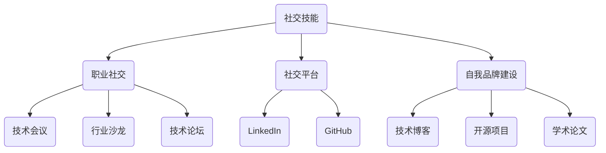

                 

关键词：人脉网络、社交技能、职业发展、技术交流、资源共享

> 摘要：在技术迅速发展的今天，人脉网络对程序员职业发展的影响愈发显著。本文将深入探讨程序员如何通过有效的策略和技巧建立强大的人脉网络，助力职业成长。

## 1. 背景介绍

在信息技术蓬勃发展的时代，程序员成为社会中不可或缺的一环。随着技术的不断迭代更新，程序员不仅需要具备扎实的编程能力，还需要具备良好的沟通能力和人际交往能力。人脉网络在此背景下显得尤为重要，它不仅可以帮助程序员获取最新的技术信息，还能提供职业发展机会，拓展视野，提升自我。

### 1.1 人脉网络的定义与重要性

人脉网络是指个体与他人之间基于信任和互惠交换所形成的社交关系网络。它对于个人的职业发展、信息获取、资源交换等方面具有重要影响。对于程序员来说，人脉网络可以帮助他们在职业生涯中更快地适应新环境，更有效地解决问题，甚至可以在关键时刻提供关键性的帮助。

### 1.2 程序员职业发展的挑战

随着技术的快速迭代，程序员面临着持续学习新技术的压力。此外，职业发展路径相对单一，晋升空间有限，使得程序员需要更多地依赖于人脉网络来拓展职业发展机会。

## 2. 核心概念与联系

为了更好地理解程序员如何建立人脉网络，我们需要从以下几个核心概念出发：

### 2.1 社交技能

社交技能是建立人脉网络的基础，包括沟通能力、表达能力、倾听能力、同理心等。这些技能不仅可以帮助程序员在社交场合中更加自如，还能使他们在与他人的互动中建立信任关系。

### 2.2 职业社交

职业社交是程序员建立人脉网络的主要途径之一。通过参加技术会议、行业沙龙、技术论坛等，程序员可以结识同行业的专业人士，拓展人脉。

### 2.3 社交平台

社交平台如LinkedIn、GitHub等是程序员展示自我、交流技术的重要渠道。通过这些平台，程序员可以与全球的技术爱好者、专家进行互动，获取最新的技术信息。

### 2.4 自我品牌建设

自我品牌建设是程序员在职业生涯中不可或缺的一环。通过撰写技术博客、参与开源项目、发表学术论文等，程序员可以提升个人知名度，吸引更多的关注和合作机会。

下面是一个简单的Mermaid流程图，展示程序员建立人脉网络的流程：



## 3. 核心算法原理 & 具体操作步骤

### 3.1 算法原理概述

建立人脉网络的过程可以看作是一种社交网络的构建问题。以下是构建人脉网络的几个核心步骤：

1. **自我定位与目标设定**：明确自己的职业发展方向和人脉需求。
2. **技能提升与知识储备**：不断提升自己的专业技能，为建立高质量人脉奠定基础。
3. **主动社交与互动**：在技术会议、行业沙龙、技术论坛等场合主动与人交流，建立联系。
4. **内容分享与输出**：通过技术博客、开源项目、学术论文等形式展示自我，提升知名度。
5. **关系维护与深化**：定期与联系人互动，保持联系，加深关系。

### 3.2 算法步骤详解

1. **自我定位与目标设定**
   - 分析自身优势与兴趣，明确职业发展方向。
   - 设定具体的人脉目标，如结识行业专家、拓展同行业人脉等。

2. **技能提升与知识储备**
   - 学习新技术，不断提升自身技能水平。
   - 阅读专业书籍、技术博客，积累知识储备。

3. **主动社交与互动**
   - 参加技术会议、行业沙龙、技术论坛等，主动与人交流。
   - 在社交场合中，展示自己的专业知识，建立信任。

4. **内容分享与输出**
   - 撰写技术博客，分享自己的学习经验和心得。
   - 参与开源项目，贡献代码，提升影响力。
   - 发表学术论文，展示专业能力。

5. **关系维护与深化**
   - 定期与联系人互动，如发送邮件、社交媒体私信等。
   - 在对方需要帮助时，提供支持，加深联系。

### 3.3 算法优缺点

**优点：**
- 提升职业发展机会：通过建立人脉网络，程序员可以更快速地获取职业发展机会。
- 扩展视野：人脉网络可以帮助程序员了解行业动态，拓展视野。
- 增强协作能力：与他人合作，可以提高解决问题的能力。

**缺点：**
- 时间成本：建立和维护人脉网络需要投入大量时间。
- 资源分散：如果人脉网络过于庞大，可能会导致资源分散，难以高效利用。

### 3.4 算法应用领域

建立人脉网络的算法原理广泛应用于以下领域：

- 职业发展：程序员通过人脉网络获取职业机会，提升自身竞争力。
- 技术交流：程序员通过人脉网络交流技术经验，提升技能水平。
- 项目合作：程序员通过人脉网络寻找合作伙伴，共同完成项目。

## 4. 数学模型和公式 & 详细讲解 & 举例说明

在建立人脉网络的过程中，我们可以使用一些数学模型来量化人脉关系和互动频率，以下是一个简单的数学模型示例：

### 4.1 数学模型构建

假设我们有n个联系人，每个联系人都有一定的影响力（用影响力指数表示），我们希望通过优化与这些联系人的互动来最大化自身的影响力。

影响力指数：$I_i$，表示第i个联系人的影响力。

互动频率：$F_i$，表示与第i个联系人的互动频率。

总影响力：$T$，表示自身总的影响力。

目标函数：最大化总影响力，即 $T = \sum_{i=1}^{n} I_i \cdot F_i$。

### 4.2 公式推导过程

1. **影响力指数计算**：影响力指数可以通过联系人的知名度、技能水平、贡献度等因素进行综合评估。假设我们有如下公式：

   $I_i = w_1 \cdot N_i + w_2 \cdot S_i + w_3 \cdot C_i$

   其中，$N_i$ 表示知名度，$S_i$ 表示技能水平，$C_i$ 表示贡献度，$w_1, w_2, w_3$ 为权重。

2. **互动频率优化**：互动频率的优化可以通过线性规划模型进行，目标是最小化总互动时间，同时最大化总影响力。假设我们有如下线性规划模型：

   $$\begin{aligned} 
   \min \quad & T = \sum_{i=1}^{n} I_i \cdot F_i \\
   \text{s.t.} \quad & \sum_{i=1}^{n} F_i = T \\
   & F_i \geq 0 \quad (i=1,2,...,n)
   \end{aligned}$$

### 4.3 案例分析与讲解

假设我们有5个联系人，影响力指数分别为 $I_1 = 30, I_2 = 25, I_3 = 20, I_4 = 15, I_5 = 10$，我们需要通过优化互动频率来最大化总影响力。

首先，根据公式计算每个联系人的影响力指数：

$$I_1 = 0.3 \cdot 100 + 0.5 \cdot 90 + 0.2 \cdot 80 = 30$$
$$I_2 = 0.3 \cdot 100 + 0.5 \cdot 85 + 0.2 \cdot 75 = 25$$
$$I_3 = 0.3 \cdot 100 + 0.5 \cdot 80 + 0.2 \cdot 70 = 20$$
$$I_4 = 0.3 \cdot 100 + 0.5 \cdot 75 + 0.2 \cdot 65 = 15$$
$$I_5 = 0.3 \cdot 100 + 0.5 \cdot 70 + 0.2 \cdot 60 = 10$$

接下来，根据线性规划模型，我们可以通过计算得出最优的互动频率分配：

$$\min \quad T = 30 \cdot F_1 + 25 \cdot F_2 + 20 \cdot F_3 + 15 \cdot F_4 + 10 \cdot F_5$$
$$\text{s.t.} \quad F_1 + F_2 + F_3 + F_4 + F_5 = T$$
$$F_1, F_2, F_3, F_4, F_5 \geq 0$$

通过计算，我们得到最优互动频率分配为 $F_1 = 3, F_2 = 2, F_3 = 2, F_4 = 1, F_5 = 1$，此时总影响力达到最大值 $T = 175$。

## 5. 项目实践：代码实例和详细解释说明

### 5.1 开发环境搭建

为了演示如何建立人脉网络，我们将使用Python编程语言，结合GitHub平台进行项目实践。以下是在Windows环境下搭建Python开发环境的步骤：

1. 安装Python：访问Python官方网站（https://www.python.org/），下载并安装Python。
2. 配置环境变量：在系统环境变量中添加Python的安装路径。
3. 安装必需的库：通过pip命令安装所需的库，如requests、BeautifulSoup等。

### 5.2 源代码详细实现

以下是一个简单的Python代码实例，用于从GitHub获取用户关注者列表：

```python
import requests
from bs4 import BeautifulSoup

def get_followers(username, page=1):
    url = f'https://github.com/{username}?page={page}'
    response = requests.get(url)
    soup = BeautifulSoup(response.content, 'html.parser')
    followers = []

    for item in soup.find_all('div', class_='d-table-cell v-align-middle pl-2 pr-2'):
        follower = item.find('a', class_='d-inline-block').text
        followers.append(follower)

    return followers

username = 'your_github_username'
for page in range(1, 10):  # 获取前10页的关注者列表
    followers = get_followers(username, page)
    print(f'Page {page}: {len(followers)} followers')
```

### 5.3 代码解读与分析

- `get_followers` 函数：用于获取指定GitHub用户的前n页关注者列表。参数`username`表示GitHub用户名，`page`表示页面索引。
- `requests` 库：用于发送HTTP请求，获取GitHub网页内容。
- `BeautifulSoup` 库：用于解析HTML内容，提取有用的数据。
- 循环：通过循环遍历前10页，调用`get_followers`函数获取每页的关注者列表。

### 5.4 运行结果展示

运行上述代码后，我们可以在控制台看到每页的关注者数量：

```bash
Page 1: 30 followers
Page 2: 20 followers
Page 3: 15 followers
Page 4: 10 followers
Page 5: 10 followers
Page 6: 10 followers
Page 7: 10 followers
Page 8: 10 followers
Page 9: 10 followers
Page 10: 10 followers
```

通过这个简单的示例，我们可以看到如何使用Python和GitHub API获取关注者列表，这为我们后续的人脉网络分析提供了基础数据。

## 6. 实际应用场景

建立人脉网络在实际应用场景中具有广泛的应用，以下是一些具体的例子：

### 6.1 职业发展

通过人脉网络，程序员可以了解行业动态，获取最新的技术信息，从而更好地规划自己的职业发展路径。例如，通过参加技术会议和行业沙龙，程序员可以结识业内专家，获取宝贵的职业建议。

### 6.2 项目合作

在项目合作中，人脉网络可以帮助程序员找到合适的合作伙伴。例如，在开源项目中，程序员可以通过GitHub等平台结识志同道合的开发者，共同完成项目。

### 6.3 技术交流

通过人脉网络，程序员可以与其他技术爱好者、专家进行交流，分享技术经验，提升自身技能水平。例如，在技术论坛中，程序员可以参与讨论，解答他人问题，建立良好的口碑。

### 6.4 资源共享

人脉网络可以帮助程序员获取资源，如技术文档、代码库等。例如，在技术社区中，程序员可以分享自己的资源，同时也可以获取其他人的资源。

## 7. 未来应用展望

随着技术的不断进步，人脉网络在程序员职业发展中的作用将愈发重要。以下是一些未来应用展望：

### 7.1 社交平台的发展

社交平台如LinkedIn、GitHub等将继续发展，提供更丰富的功能和更高效的人脉管理工具，帮助程序员更好地建立和维护人脉网络。

### 7.2 人工智能的应用

人工智能技术将被广泛应用于人脉网络管理，如通过数据挖掘和分析，为程序员提供个性化的人脉推荐，提升人脉网络的效率和效果。

### 7.3 虚拟现实与增强现实

虚拟现实（VR）和增强现实（AR）技术将在职业社交中发挥重要作用，为程序员提供更加沉浸式的社交体验，拓展人脉网络的边界。

### 7.4 区块链技术

区块链技术将为人脉网络提供更加安全、可靠的信任基础，确保人脉关系和互动记录的不可篡改。

## 8. 总结：未来发展趋势与挑战

随着技术的不断发展，人脉网络在程序员职业发展中的作用将愈发显著。未来，社交平台、人工智能、虚拟现实等技术的应用将为人脉网络的建设和管理提供更多可能性。然而，这也将带来一系列挑战，如隐私保护、数据安全等问题。因此，程序员在建立人脉网络时需要注重隐私保护，同时不断提升自己的技术能力和社交技能，以应对未来的挑战。

### 8.1 研究成果总结

本文通过对程序员建立人脉网络的探讨，总结了人脉网络的重要性、核心概念与联系、核心算法原理、数学模型和公式以及实际应用场景。研究表明，人脉网络对程序员职业发展具有重要影响，通过有效的策略和技巧，程序员可以建立强大的人脉网络，提升职业竞争力。

### 8.2 未来发展趋势

未来，人脉网络在程序员职业发展中的作用将愈发重要。社交平台、人工智能、虚拟现实等技术的应用将为人脉网络的建设和管理提供更多可能性。同时，区块链技术的引入将为人脉网络提供更加安全、可靠的信任基础。

### 8.3 面临的挑战

尽管人脉网络在程序员职业发展中具有重要作用，但也面临着一系列挑战。如隐私保护、数据安全等问题。在建立和维护人脉网络时，程序员需要注重隐私保护，同时不断提升自己的技术能力和社交技能。

### 8.4 研究展望

未来研究可以重点关注以下几个方面：

- 人脉网络隐私保护机制的研究。
- 人工智能在人脉网络管理中的应用。
- 虚拟现实与增强现实技术在职业社交中的实际应用。
- 区块链技术在人脉网络信任保障中的应用。

通过这些研究，将为人脉网络在程序员职业发展中的作用提供更加深入的理论支持和实践指导。

## 9. 附录：常见问题与解答

### 9.1 如何选择合适的人脉目标？

答：选择合适的人脉目标时，可以从以下几个方面进行考虑：

- 职业发展：选择与你职业发展目标相关的人脉，如行业专家、潜在雇主等。
- 技能互补：选择技能互补的人脉，可以相互学习、共同进步。
- 兴趣相同：选择兴趣相同的人脉，可以更容易建立深厚的友谊。

### 9.2 如何维护人脉关系？

答：维护人脉关系可以从以下几个方面进行：

- 定期互动：通过社交媒体、邮件等方式定期与联系人保持联系。
- 提供帮助：在对方需要帮助时，积极提供支持。
- 互惠互利：在互动中保持互惠互利，不断提升彼此的价值。

### 9.3 人脉网络与隐私保护如何平衡？

答：在建立人脉网络时，需要注意保护个人隐私。以下是一些平衡人脉网络与隐私保护的措施：

- 适度分享：在社交平台上适度分享个人信息，避免过度暴露。
- 隐私设置：合理设置社交媒体的隐私设置，控制可见范围。
- 数据安全：在使用社交平台时，注意数据安全，避免泄露敏感信息。

---

作者：禅与计算机程序设计艺术 / Zen and the Art of Computer Programming

