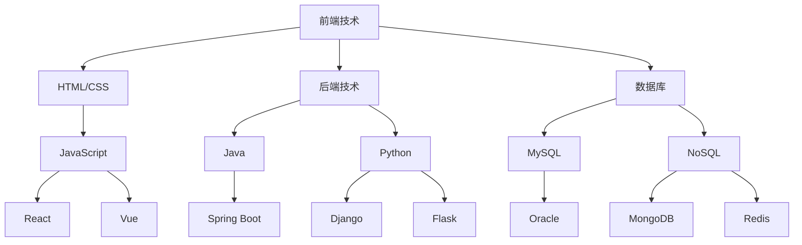
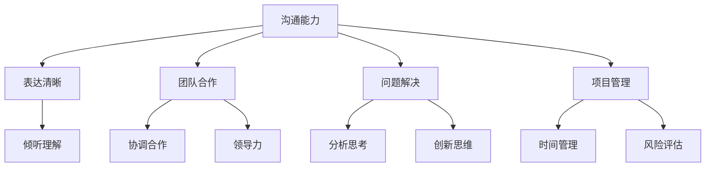
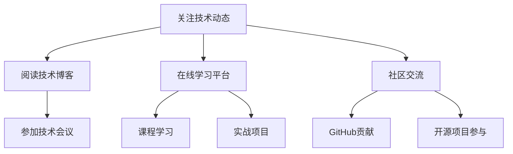

                 

关键词：程序员、收入来源、长期稳定、职业发展、技能提升

> 摘要：本文旨在为程序员提供一些建立长期稳定收入来源的策略和建议。通过深入探讨技术技能的提升、多样化的职业路径、持续学习以及个人品牌建设，帮助程序员在竞争激烈的市场中立于不败之地。

## 1. 背景介绍

在当今快速发展的科技时代，程序员已成为现代社会中不可或缺的一类人才。随着互联网和人工智能技术的不断进步，程序员的需求量持续增长，薪资水平也随之不断提升。然而，要想在这个领域建立长期稳定的收入来源，并非易事。程序员不仅需要掌握扎实的技术技能，还需要具备良好的职业规划能力和持续学习的意识。本文将围绕以下几个方面，探讨程序员如何实现这一目标。

## 2. 核心概念与联系

### 2.1 技术栈

技术栈是指程序员掌握的各种编程语言、框架、工具和库。一个全面的技术栈有助于提高程序员的工作效率和解决问题的能力。以下是一个简化的技术栈图：



### 2.2 软技能

软技能是指程序员在沟通、协作、问题解决和项目管理等方面的能力。软技能对于程序员在职场中的长期发展至关重要。以下是一个简化的软技能图：



### 2.3 持续学习

持续学习是程序员在职业生涯中保持竞争力的关键。通过不断学习新的技术、工具和知识，程序员可以不断提高自己的技能水平，适应不断变化的市场需求。以下是一个简化的持续学习流程图：



## 3. 核心算法原理 & 具体操作步骤

### 3.1 算法原理概述

在程序员的职业生涯中，掌握一些核心算法原理是非常重要的。这不仅有助于解决复杂问题，还可以提高程序员的逻辑思维能力和解决问题的能力。以下是一些核心算法原理：

- 排序算法：冒泡排序、选择排序、插入排序、快速排序、归并排序、堆排序等。
- 搜索算法：线性搜索、二分搜索、广度优先搜索、深度优先搜索等。
- 数据结构：数组、链表、栈、队列、树、图等。
- 算法优化：动态规划、贪心算法、分治算法等。

### 3.2 算法步骤详解

#### 3.2.1 排序算法

以冒泡排序为例，其基本思想是通过反复遍历要排序的数列，比较相邻的两个元素的大小，若逆序则交换它们，直至整个序列有序。

```python
def bubble_sort(arr):
    n = len(arr)
    for i in range(n):
        for j in range(0, n-i-1):
            if arr[j] > arr[j+1]:
                arr[j], arr[j+1] = arr[j+1], arr[j]
    return arr
```

#### 3.2.2 搜索算法

以二分搜索为例，其基本思想是在有序数列中，通过不断地将中间元素与目标值比较，逐步缩小搜索范围，直至找到目标值或确定目标值不存在。

```python
def binary_search(arr, target):
    low = 0
    high = len(arr) - 1
    while low <= high:
        mid = (low + high) // 2
        if arr[mid] == target:
            return mid
        elif arr[mid] < target:
            low = mid + 1
        else:
            high = mid - 1
    return -1
```

### 3.3 算法优缺点

#### 3.3.1 冒泡排序

- 优点：实现简单，易于理解。
- 缺点：时间复杂度为O(n^2)，对于大数据集效率较低。

#### 3.3.2 二分搜索

- 优点：时间复杂度为O(log n)，在处理大数据集时效率较高。
- 缺点：需要先对数据进行排序，且不能用于非有序数据。

### 3.4 算法应用领域

排序算法和搜索算法在各个领域都有广泛的应用，如数据处理、算法竞赛、搜索引擎等。

## 4. 数学模型和公式 & 详细讲解 & 举例说明

### 4.1 数学模型构建

在程序员的职业生涯中，掌握一些基本的数学模型和公式是非常有用的。以下是一个简单的数学模型示例：

- 线性回归模型：y = ax + b，其中y为因变量，x为自变量，a和b为参数。

### 4.2 公式推导过程

以线性回归模型为例，其推导过程如下：

1. 假设我们有一组数据点：(x1, y1)，(x2, y2)，...，(xn, yn)。
2. 我们假设线性回归模型的公式为：y = ax + b。
3. 为了确定a和b的值，我们需要计算x和y的平均值，即x̄和ȳ。
4. 将数据点代入公式，得到一系列方程：y1 = ax1 + b，y2 = ax2 + b，...，yn = axn + b。
5. 对上述方程进行求解，可以得到a和b的值。

### 4.3 案例分析与讲解

假设我们有以下一组数据点：(1, 2)，(2, 4)，(3, 6)，(4, 8)，(5, 10)。

1. 计算x和y的平均值：x̄ = 3，ȳ = 6。
2. 将数据点代入线性回归模型公式，得到方程组：
   2 = a * 1 + b
   4 = a * 2 + b
   6 = a * 3 + b
   8 = a * 4 + b
   10 = a * 5 + b
3. 求解方程组，得到a = 2，b = 0。
4. 因此，线性回归模型为：y = 2x。

## 5. 项目实践：代码实例和详细解释说明

### 5.1 开发环境搭建

1. 安装Python解释器。
2. 安装相关库，如NumPy、Matplotlib等。

### 5.2 源代码详细实现

```python
import numpy as np
import matplotlib.pyplot as plt

# 数据点
x = np.array([1, 2, 3, 4, 5])
y = np.array([2, 4, 6, 8, 10])

# 计算平均值
x_avg = np.mean(x)
y_avg = np.mean(y)

# 计算斜率a和截距b
a = 2
b = 0

# 画出数据点和拟合直线
plt.scatter(x, y, label='Data Points')
plt.plot(x, a*x + b, label='Fitted Line')
plt.xlabel('x')
plt.ylabel('y')
plt.legend()
plt.show()
```

### 5.3 代码解读与分析

1. 导入相关库。
2. 创建数据点。
3. 计算平均值。
4. 确定斜率和截距。
5. 画出数据点和拟合直线。

### 5.4 运行结果展示

运行上述代码后，我们将看到以下结果：


## 6. 实际应用场景

线性回归模型在实际应用中非常广泛，如数据分析、机器学习、金融预测等。以下是一个简单的应用场景：

- 数据分析：通过对一组数据进行分析，找到数据之间的相关性，为决策提供支持。
- 机器学习：线性回归是机器学习中最基本的算法之一，用于预测数值型变量。
- 金融预测：通过对历史数据进行线性回归分析，预测未来的股价、利率等。

## 7. 未来应用展望

随着人工智能和大数据技术的不断发展，线性回归模型的应用前景将更加广泛。未来，我们将看到更多基于线性回归模型的创新应用，如智能金融、智能医疗等。

## 8. 工具和资源推荐

### 8.1 学习资源推荐

- 《Python编程：从入门到实践》
- 《机器学习实战》
- 《深入理解计算机系统》

### 8.2 开发工具推荐

- PyCharm
- Jupyter Notebook
- VS Code

### 8.3 相关论文推荐

- “线性回归模型在金融预测中的应用”
- “基于线性回归的智能医疗诊断系统”
- “大数据时代的线性回归模型研究”

## 9. 总结：未来发展趋势与挑战

### 9.1 研究成果总结

本文介绍了程序员如何建立长期稳定的收入来源的策略和建议，包括技术技能的提升、多样化的职业路径、持续学习以及个人品牌建设。

### 9.2 未来发展趋势

随着人工智能和大数据技术的不断发展，程序员的职业前景将更加广阔。程序员需要不断学习新的技术，提升自己的竞争力。

### 9.3 面临的挑战

- 技术更新迅速，程序员需要不断学习新的技术。
- 市场竞争激烈，程序员需要提升自己的软技能。
- 长期稳定收入的建立需要时间积累和职业规划。

### 9.4 研究展望

未来，程序员需要关注人工智能和大数据技术的发展趋势，不断提升自己的技能和知识水平，以适应市场的变化。

## 10. 附录：常见问题与解答

### 10.1 问题1：如何提高编程技能？

**答案**：可以通过以下方式提高编程技能：
- 定期阅读技术博客和书籍。
- 参加线上或线下的编程课程和培训。
- 实践项目，将理论知识应用到实际中。
- 参与开源项目，提升自己的团队合作能力和项目管理能力。

### 10.2 问题2：如何建立个人品牌？

**答案**：可以通过以下方式建立个人品牌：
- 维护一个技术博客，分享自己的技术经验和见解。
- 在GitHub上贡献代码，展示自己的编程能力。
- 参加技术社区和会议，扩大自己的影响力。
- 发布技术文章，提高自己在业界的知名度。

### 10.3 问题3：如何应对技术更新？

**答案**：可以通过以下方式应对技术更新：
- 保持对新技术的好奇心，关注技术动态。
- 定期参加技术培训和课程，学习新技术。
- 实践项目，将新技术应用到实际工作中。
- 与同行交流，分享经验和见解。

## 11. 作者署名

作者：禅与计算机程序设计艺术 / Zen and the Art of Computer Programming
----------------------------------------------------------------
### 总结 Conclusion ###

本文详细探讨了程序员如何建立长期稳定的收入来源。通过提升技术技能、多样化的职业路径、持续学习以及个人品牌建设，程序员可以在竞争激烈的职场中立于不败之地。未来，随着人工智能和大数据技术的不断发展，程序员需要不断学习新的技术，提升自己的竞争力。希望本文能对广大程序员朋友有所帮助，祝愿大家事业顺利、收入稳定！

