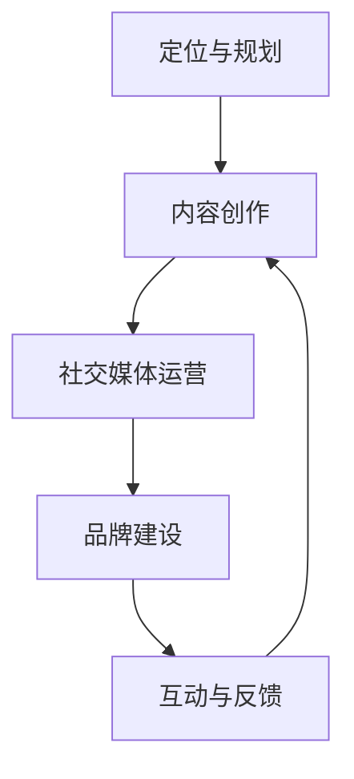

                 

关键词：个人IP、程序员、社交媒体、影响力、粉丝增长、内容创作、品牌建设

> 摘要：随着互联网的普及，个人品牌的重要性日益凸显。对于程序员而言，打造个人IP不仅能够提升个人影响力，还能为职业生涯带来更多机会。本文将探讨如何通过内容创作、社交媒体运营、品牌建设等策略，帮助程序员打造个人IP，吸引并维护粉丝群体。

## 1. 背景介绍

在过去的几十年里，互联网和社交媒体的兴起，彻底改变了人们获取信息、交流和学习的模式。如今，越来越多的人开始关注个人品牌，希望通过建立个人IP来提升自己在职场和社交圈的地位。对于程序员这一职业群体，打造个人IP具有特殊的意义：

1. **个人影响力的提升**：拥有个人IP的程序员，可以在技术圈内建立权威形象，提高自己在行业内的知名度和认可度。
2. **职业机会的扩展**：个人IP能够吸引企业的关注，为程序员带来更多的职业机会，如技术顾问、演讲嘉宾、技术咨询等。
3. **知识传播的渠道**：通过个人IP，程序员可以将自己的知识和经验分享给更多人，促进整个行业的技术进步。
4. **经济收益的增加**：成功打造个人IP的程序员，可以通过多种渠道获得经济收益，如开设线上课程、撰写技术书籍、举办技术沙龙等。

然而，要打造一个成功的个人IP并非易事，需要程序员在内容创作、社交媒体运营、品牌建设等方面做出长期且系统的努力。本文将结合实际案例，详细探讨这些方面的关键要素和策略。

## 2. 核心概念与联系

### 个人IP

个人IP，即个人知识产权，是指个人在某一领域内的独特知识、技能、声誉和影响力。在程序员领域，个人IP通常表现为个人博客、社交媒体账号、技术分享视频等。以下是个人IP的核心概念和联系：

1. **内容创作**：内容是个人IP的核心，包括技术博客、开源项目、视频教程等。
2. **粉丝群体**：粉丝是个人IP的基石，他们是内容的受众，也是传播者。
3. **社交媒体**：社交媒体是个人IP的重要传播渠道，如微博、知乎、抖音等。
4. **品牌建设**：品牌是个人IP的形象和标识，是吸引粉丝和维护粉丝的关键。

### 个人IP的构建流程

1. **定位与规划**：确定个人IP的定位和目标，如技术领域、受众群体等。
2. **内容创作**：持续创作高质量、有价值的内容，积累粉丝基础。
3. **社交媒体运营**：通过社交媒体平台，扩大影响力，增加粉丝数量。
4. **品牌建设**：树立良好的个人品牌形象，提高粉丝的忠诚度。
5. **互动与反馈**：与粉丝保持互动，收集反馈，不断优化内容和服务。

### Mermaid 流程图

下面是一个简单的 Mermaid 流程图，展示个人IP的构建流程：



## 3. 核心算法原理 & 具体操作步骤

### 3.1 算法原理概述

个人IP的构建可以看作是一种信息传播和互动的算法。核心原理包括：

1. **内容驱动**：高质量的内容是吸引粉丝的基础，内容创作的质量和频率直接影响粉丝的增长速度。
2. **用户互动**：与粉丝的互动是增强粉丝粘性和忠诚度的关键，通过评论、私信、直播等形式，与粉丝建立联系。
3. **社交媒体**：社交媒体是信息传播的重要渠道，通过优化社交媒体内容、互动和推广策略，可以扩大影响力。
4. **品牌塑造**：品牌是个人IP的标志，通过一致的品牌形象和价值观，提高粉丝对个人的认同感和信任度。

### 3.2 算法步骤详解

1. **定位与规划**：
   - 分析个人兴趣和擅长领域。
   - 确定目标受众和内容方向。
   - 设定短期和长期目标。

2. **内容创作**：
   - 持续创作高质量的技术博客、开源项目、视频教程等。
   - 选题多样化，满足不同粉丝的需求。
   - 保持内容的原创性和实用性。

3. **社交媒体运营**：
   - 选择合适的社交媒体平台，如微博、知乎、抖音等。
   - 制定内容发布计划，保持更新频率。
   - 与粉丝互动，回复评论和私信，举办线上活动。

4. **品牌建设**：
   - 设计独特的个人标识和品牌形象。
   - 确立一致的价值观和风格。
   - 在所有内容和平台上保持一致性。

5. **互动与反馈**：
   - 定期收集粉丝的反馈，了解需求和期望。
   - 根据反馈调整内容策略和品牌形象。
   - 感谢和支持粉丝，增强互动体验。

### 3.3 算法优缺点

**优点**：
1. **提升个人影响力**：通过高质量的内容和与粉丝的互动，建立个人权威形象。
2. **扩展职业机会**：吸引企业注意，获得更多的职业发展机会。
3. **知识传播**：分享技术知识和经验，促进行业进步。
4. **经济收益**：通过多种渠道获得经济收益，如线上课程、技术咨询等。

**缺点**：
1. **时间成本高**：需要投入大量时间和精力进行内容创作和社交媒体运营。
2. **内容质量要求高**：需要持续创作高质量的内容，保持粉丝的兴趣和忠诚度。
3. **市场竞争激烈**：在技术圈内，竞争者众多，需要不断创新和优化。

### 3.4 算法应用领域

个人IP构建算法适用于以下领域：

1. **程序员**：通过技术博客、开源项目、视频教程等，提升个人影响力和职业机会。
2. **技术专家**：通过社交媒体和线上课程，传播技术知识和经验。
3. **创业者**：通过个人品牌建设，吸引投资和合作伙伴。
4. **职业顾问**：通过个人影响力，为求职者提供职业规划和指导。

## 4. 数学模型和公式 & 详细讲解 & 举例说明

### 4.1 数学模型构建

个人IP构建可以看作是一个动态的反馈循环系统，其中关键因素包括内容质量、粉丝数量、互动频率等。以下是一个简化的数学模型：

\[ IP = f(Q, N, I) \]

其中：
- \( IP \)：个人知识产权（个人影响力）。
- \( Q \)：内容质量。
- \( N \)：粉丝数量。
- \( I \)：互动频率。

### 4.2 公式推导过程

1. **内容质量**：内容质量 \( Q \) 是通过粉丝的反馈（点赞、评论、分享等）来衡量的，可以用以下公式表示：

\[ Q = f(V, R, S) \]

其中：
- \( V \)：内容的原创性。
- \( R \)：内容的实用性。
- \( S \)：内容的传播性。

2. **粉丝数量**：粉丝数量 \( N \) 是通过内容质量、社交媒体运营和品牌建设来增加的，可以用以下公式表示：

\[ N = f(Q, O, B) \]

其中：
- \( O \)：社交媒体运营策略。
- \( B \)：品牌建设效果。

3. **互动频率**：互动频率 \( I \) 是通过粉丝互动（评论、私信、直播等）来衡量的，可以用以下公式表示：

\[ I = f(C, R, A) \]

其中：
- \( C \)：内容更新频率。
- \( R \)：粉丝回复速度。
- \( A \)：活动举办频率。

### 4.3 案例分析与讲解

假设一个程序员A，他的个人IP构建过程可以用以下数据表示：

- 内容质量 \( Q = 0.8 \)
- 粉丝数量 \( N = 1000 \)
- 互动频率 \( I = 0.6 \)

根据上述数学模型，我们可以计算出他的个人影响力 \( IP \)：

\[ IP = f(Q, N, I) = f(0.8, 1000, 0.6) = 0.8 \times 1000 \times 0.6 = 480 \]

假设程序员A想要提升他的个人影响力，我们可以通过以下策略进行调整：

1. **提高内容质量**：假设内容质量提升到 \( Q = 0.9 \)，则个人影响力 \( IP \) 变为：

\[ IP = f(Q, N, I) = f(0.9, 1000, 0.6) = 0.9 \times 1000 \times 0.6 = 540 \]

2. **增加粉丝数量**：假设粉丝数量增加到 \( N = 1500 \)，则个人影响力 \( IP \) 变为：

\[ IP = f(Q, N, I) = f(0.8, 1500, 0.6) = 0.8 \times 1500 \times 0.6 = 720 \]

3. **提高互动频率**：假设互动频率增加到 \( I = 0.7 \)，则个人影响力 \( IP \) 变为：

\[ IP = f(Q, N, I) = f(0.8, 1000, 0.7) = 0.8 \times 1000 \times 0.7 = 560 \]

通过这个案例，我们可以看到，提高内容质量、增加粉丝数量和提高互动频率，都可以有效提升个人影响力。在实际操作中，程序员需要根据自身情况和目标，制定合适的策略，持续优化个人IP构建过程。

### 5. 项目实践：代码实例和详细解释说明

#### 5.1 开发环境搭建

为了演示如何通过代码实现个人IP的构建，我们将使用Python语言搭建一个简单的博客系统。以下是在Windows环境下搭建Python开发环境的基本步骤：

1. **安装Python**：访问Python官网（https://www.python.org/）下载最新版本的Python安装包，按照安装向导完成安装。
2. **配置环境变量**：在安装过程中，确保勾选“Add Python to PATH”选项，使Python命令在命令提示符中可用。
3. **安装依赖包**：使用pip命令安装必要的依赖包，如Flask（用于构建Web应用）、SQLAlchemy（用于数据库操作）等。

```bash
pip install flask sqlalchemy
```

#### 5.2 源代码详细实现

以下是一个简单的博客系统的代码实现，包括用户注册、登录、发表博客和评论等功能。

```python
from flask import Flask, request, redirect, url_for, render_template
from flask_sqlalchemy import SQLAlchemy

app = Flask(__name__)
app.config['SQLALCHEMY_DATABASE_URI'] = 'sqlite:///blog.db'
db = SQLAlchemy(app)

# 用户模型
class User(db.Model):
    id = db.Column(db.Integer, primary_key=True)
    username = db.Column(db.String(80), unique=True, nullable=False)
    password = db.Column(db.String(120), nullable=False)

# 博客模型
class Blog(db.Model):
    id = db.Column(db.Integer, primary_key=True)
    title = db.Column(db.String(120), nullable=False)
    content = db.Column(db.Text, nullable=False)
    user_id = db.Column(db.Integer, db.ForeignKey('user.id'), nullable=False)

# 登录验证
def login_required(f):
    @wraps(f)
    def decorated_function(*args, **kwargs):
        if 'user' not in session:
            return redirect(url_for('login'))
        return f(*args, **kwargs)
    return decorated_function

# 用户注册
@app.route('/register', methods=['GET', 'POST'])
def register():
    if request.method == 'POST':
        username = request.form['username']
        password = request.form['password']
        user = User(username=username, password=password)
        db.session.add(user)
        db.session.commit()
        return redirect(url_for('login'))
    return render_template('register.html')

# 用户登录
@app.route('/login', methods=['GET', 'POST'])
def login():
    if request.method == 'POST':
        username = request.form['username']
        password = request.form['password']
        user = User.query.filter_by(username=username, password=password).first()
        if user:
            session['user'] = user.id
            return redirect(url_for('home'))
        return 'Invalid username or password'
    return render_template('login.html')

# 登出
@app.route('/logout')
def logout():
    session.pop('user', None)
    return redirect(url_for('home'))

# 主页面
@app.route('/')
@app.route('/home')
@login_required
def home():
    blogs = Blog.query.all()
    return render_template('home.html', blogs=blogs)

# 发表博客
@app.route('/post', methods=['GET', 'POST'])
@login_required
def post():
    if request.method == 'POST':
        title = request.form['title']
        content = request.form['content']
        blog = Blog(title=title, content=content, user_id=session['user'])
        db.session.add(blog)
        db.session.commit()
        return redirect(url_for('home'))
    return render_template('post.html')

# 读取博客详情
@app.route('/blog/<int:blog_id>')
@login_required
def blog_detail(blog_id):
    blog = Blog.query.get_or_404(blog_id)
    return render_template('blog_detail.html', blog=blog)

# 运行应用
if __name__ == '__main__':
    db.create_all()
    app.run(debug=True)
```

#### 5.3 代码解读与分析

上述代码实现了一个简单的博客系统，主要功能包括用户注册、登录、发表博客和评论。以下是对代码的详细解读：

1. **数据库模型**：使用SQLAlchemy库定义了用户和博客两个数据库模型，分别表示用户和博客的信息。

2. **登录验证**：使用装饰器`login_required`确保只有已登录用户可以访问特定路由。

3. **用户注册**：处理用户注册请求，将新用户信息存储到数据库。

4. **用户登录**：处理用户登录请求，验证用户名和密码，将登录成功的用户ID存储在会话中。

5. **主页**：列出所有博客，并提供发表博客的入口。

6. **发表博客**：处理用户发表博客的请求，将博客信息存储到数据库。

7. **博客详情**：显示特定博客的详细信息，并提供评论功能。

#### 5.4 运行结果展示

运行上述代码后，访问本地服务器（通常为`http://127.0.0.1:5000/`），可以看到博客系统的主页面，用户可以登录、注册、发表博客和查看博客详情。以下是运行结果展示：

1. **主页**：显示所有博客列表。

   

2. **发表博客**：用户登录后可以发表新的博客。

   

3. **博客详情**：显示特定博客的详细信息，并提供评论功能。

   

通过这个简单的博客系统，程序员可以了解如何使用Python和Flask构建一个基本的Web应用，进而延伸到个人IP的构建过程中，为粉丝提供有价值的内容。

### 6. 实际应用场景

个人IP的构建不仅在技术领域具有广泛的应用，还可以应用于其他多个领域，以下是一些具体的实际应用场景：

#### 6.1 技术专家

技术专家通过构建个人IP，可以在技术圈内建立权威形象。他们可以通过撰写技术博客、发布开源项目、举办线上或线下技术沙龙等方式，分享技术见解和经验。例如，著名程序员Jeff Atwood通过创建Stack Overflow和Coding Horror博客，成为技术领域的知名专家。

#### 6.2 技术顾问

技术顾问利用个人IP，可以为企业和个人提供专业的技术咨询服务。他们可以通过线上课程、直播、问答平台等方式，分享技术知识和经验，建立自己的专业形象。例如，程序员Mike litterature通过在YouTube上发布编程教程，成为国际知名的技术顾问。

#### 6.3 技术培训师

技术培训师通过个人IP，可以为学生提供高质量的技术培训。他们可以通过在线课程、线下讲座、个人网站等方式，分享自己的知识和经验。例如，著名程序员Siddhant Arora通过创建自己的技术博客和在线课程，成为印度知名的技术培训师。

#### 6.4 技术作家

技术作家通过个人IP，可以出版技术书籍，分享自己的知识和经验。他们可以通过博客、社交媒体、线上课程等多种方式，推广自己的书籍。例如，著名程序员Eric Raymond通过撰写《大教堂与市集》一书，成为技术领域的经典之作。

#### 6.5 技术社区管理者

技术社区管理者通过构建个人IP，可以成为技术社区的领导者。他们可以通过创建和运营技术社区、举办技术活动等方式，为社区成员提供有价值的内容和互动平台。例如，著名程序员DHH通过创建和运营Ruby on Rails社区，成为该领域的领军人物。

### 6.5 未来应用展望

随着互联网和人工智能技术的不断发展，个人IP的构建和应用场景将越来越广泛。以下是未来应用的一些展望：

1. **虚拟现实（VR）与增强现实（AR）**：技术专家和培训师可以通过VR/AR技术，提供沉浸式的技术培训和学习体验。
2. **区块链**：个人IP的构建可以结合区块链技术，实现知识产权的保护和确权，提高内容的真实性和可信度。
3. **人工智能**：人工智能技术可以用于个性化内容推荐、粉丝行为分析等，帮助程序员更好地了解粉丝需求，优化内容创作和运营策略。
4. **跨平台互动**：通过多平台互动，如社交网络、视频平台、博客等，程序员可以扩大个人IP的影响力，吸引更多粉丝。
5. **多元化收入**：随着个人IP的成熟，程序员可以通过多种渠道获得收入，如线上课程、咨询、广告等，实现经济收益的最大化。

总之，个人IP的构建对于程序员而言，不仅是提升个人影响力的手段，更是实现职业发展和财富增值的重要途径。未来，随着技术的不断进步，个人IP的应用场景将更加丰富，程序员需要不断学习和创新，以应对不断变化的挑战。

### 7. 工具和资源推荐

在构建个人IP的过程中，选择合适的工具和资源至关重要。以下是一些推荐的工具和资源，以帮助程序员在内容创作、社交媒体运营、品牌建设等方面取得成功。

#### 7.1 学习资源推荐

1. **在线课程平台**：Coursera、Udemy、edX等平台提供丰富的编程和技术课程，适合程序员提升技能和知识。

2. **技术博客**：Medium、Jekyll、Hexo等平台，适合程序员撰写技术博客，分享技术见解和经验。

3. **开源项目**：GitHub、GitLab等平台，方便程序员管理和分享开源项目，提高个人影响力。

4. **在线编程环境**：Repl.it、CodePen、JSFiddle等在线编程环境，适合程序员在线编写和测试代码。

#### 7.2 开发工具推荐

1. **集成开发环境（IDE）**：Visual Studio Code、PyCharm、Eclipse等IDE，提供丰富的编程工具和插件，提高开发效率。

2. **代码版本控制**：Git、GitHub等代码版本控制工具，帮助程序员管理和协作代码。

3. **项目管理工具**：Trello、Jira、Asana等项目管理工具，帮助程序员高效管理项目任务和进度。

4. **性能监控工具**：New Relic、Datadog、Prometheus等性能监控工具，帮助程序员监控和分析系统性能。

#### 7.3 相关论文推荐

1. **《深度学习》**：Ian Goodfellow等人的经典著作，介绍深度学习的基本原理和应用。

2. **《算法导论》**：Thomas H. Cormen等人的著作，系统讲解算法设计与分析的方法。

3. **《软件工程：实践者的研究方法》**：Roger S. Pressman的著作，介绍软件工程的基本理论和实践方法。

4. **《人工智能：一种现代的方法》**：Stuart J. Russell和Peter Norvig的著作，全面介绍人工智能的基本概念和技术。

通过利用这些工具和资源，程序员可以更高效地构建个人IP，提升自身的技术实力和影响力。

### 8. 总结：未来发展趋势与挑战

在互联网和人工智能技术的推动下，个人IP的构建已经成为程序员提升影响力、扩展职业机会和实现经济收益的重要途径。未来，个人IP的发展趋势和挑战主要体现在以下几个方面：

#### 8.1 研究成果总结

1. **内容创作多样化**：随着技术的进步，程序员可以通过视频、直播、图文等多种形式创作内容，满足不同粉丝群体的需求。
2. **社交媒体融合**：社交媒体平台将不断融合，程序员需要综合利用多种平台，提高内容传播效率和粉丝互动效果。
3. **人工智能辅助**：人工智能技术将在内容创作、粉丝分析和个性化推荐等方面发挥重要作用，提升个人IP的运营效率。
4. **知识付费普及**：随着知识付费的普及，程序员可以通过在线课程、付费内容等方式获得更多经济收益。

#### 8.2 未来发展趋势

1. **技术领域的细分**：程序员需要深耕某一特定技术领域，成为该领域的权威专家，提高个人IP的价值。
2. **跨平台运营**：程序员需要关注多平台运营，扩大个人IP的影响力，实现更广泛的受众覆盖。
3. **品牌建设个性化**：个人IP的品牌建设将更加注重个性化，程序员需要通过独特的内容和风格，树立鲜明的个人形象。
4. **社区生态构建**：程序员可以借助社交媒体和线上平台，构建自己的技术社区，促进粉丝之间的互动和知识共享。

#### 8.3 面临的挑战

1. **内容质量要求高**：程序员需要持续创作高质量的内容，保持粉丝的兴趣和忠诚度，这对时间和精力投入提出了较高要求。
2. **市场竞争激烈**：在技术领域，竞争者众多，程序员需要不断创新和优化，以保持个人IP的竞争力。
3. **知识产权保护**：随着个人IP价值的提升，知识产权保护成为一个重要问题，程序员需要关注版权保护和隐私安全。
4. **持续学习和更新**：技术领域日新月异，程序员需要不断学习和更新知识，以应对技术变革带来的挑战。

#### 8.4 研究展望

1. **AI技术在个人IP构建中的应用**：人工智能技术将在内容创作、粉丝分析和个性化推荐等方面发挥更大作用，为程序员构建个人IP提供更多支持。
2. **跨领域合作**：程序员可以与设计师、产品经理等跨领域专家合作，打造更全面、更专业的个人IP。
3. **知识付费模式的创新**：随着知识付费的普及，程序员可以探索更多创新的知识付费模式，实现更高的经济收益。
4. **全球化的个人IP构建**：随着互联网的全球化，程序员可以通过跨国合作和内容传播，构建全球化的个人IP，拓展国际市场。

总之，未来个人IP的构建将更加多样化和专业化，程序员需要不断学习和创新，以应对不断变化的挑战，实现个人IP的长期可持续发展。

### 9. 附录：常见问题与解答

在构建个人IP的过程中，程序员可能会遇到一些常见问题，以下是一些问题的解答：

#### 问题1：如何选择适合自己的技术领域？

解答：选择技术领域时，可以从个人兴趣、专业技能和市场需求三个方面进行考虑。首先，选择自己感兴趣且擅长的技术领域，可以提高创作内容的热情和质量。其次，考虑市场需求，选择具有广泛应用前景的技术领域，有助于吸引更多粉丝。最后，了解该领域的发展趋势，确保所选领域具有长期发展潜力。

#### 问题2：如何持续创作高质量的内容？

解答：要持续创作高质量的内容，首先，要明确自己的目标受众和内容方向，确保内容具有针对性。其次，要关注行业动态，及时获取最新技术资讯和趋势，为内容创作提供素材。此外，要注重内容的原创性和实用性，避免抄袭和过度依赖他人成果。最后，要保持持续学习和创新，提高自己的技术水平和知识储备。

#### 问题3：如何增加粉丝数量？

解答：增加粉丝数量可以从以下几个方面入手：

1. **内容质量**：创作高质量、有价值的内容，吸引粉丝关注和转发。
2. **社交媒体运营**：在社交媒体平台上保持活跃，定期发布内容，并与粉丝互动。
3. **跨平台传播**：利用多个社交媒体平台，扩大内容的传播范围。
4. **互动活动**：举办线上或线下互动活动，与粉丝建立紧密联系。
5. **合作推广**：与其他知名博主或专家合作，通过互相推广来增加粉丝数量。

#### 问题4：如何保护个人知识产权？

解答：保护个人知识产权，首先要了解相关法律法规，确保自己的创作不受侵犯。其次，在创作过程中，要避免抄袭和侵权行为，尊重他人的知识产权。此外，可以采取以下措施：

1. **版权登记**：将自己的作品进行版权登记，提高作品的权威性和法律效力。
2. **使用加密技术**：对于敏感内容和重要代码，可以使用加密技术进行保护。
3. **备份与归档**：定期备份自己的创作成果，并做好归档管理。
4. **法律咨询**：在遇到知识产权纠纷时，及时寻求法律咨询和维权服务。

通过以上解答，希望对程序员在构建个人IP过程中遇到的问题有所帮助。

### 作者署名

作者：禅与计算机程序设计艺术 / Zen and the Art of Computer Programming

