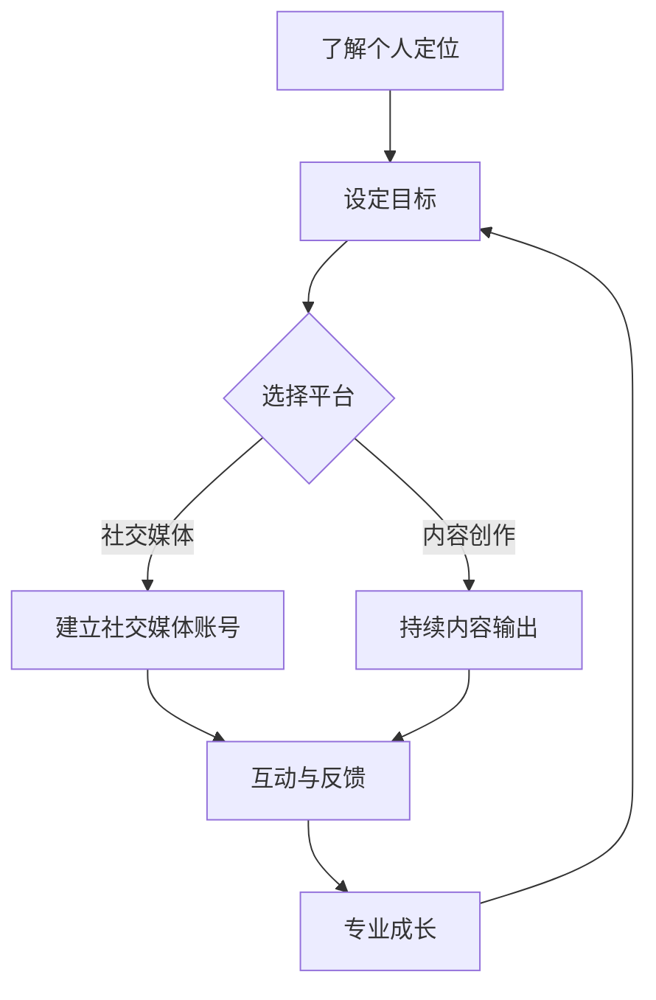
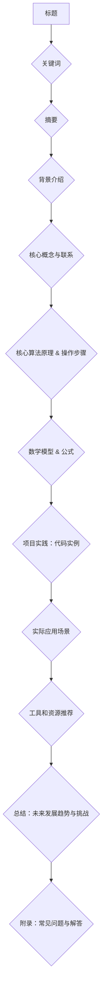

                 

关键词：程序员，个人品牌，IP打造，影响力，社交媒体，内容创作，专业成长

> 摘要：本文将探讨程序员如何通过打造个人品牌IP来提升个人影响力，实现职业成长。我们将从核心概念、算法原理、项目实践等多个角度，详细解析如何构建一个有吸引力的个人品牌，并为其注入持续的价值。

## 1. 背景介绍

在当今数字化时代，技术的重要性日益凸显，程序员作为技术领域的重要群体，其个人品牌建设显得尤为重要。一个强大的个人品牌不仅可以提升程序员的职业形象，还能带来更多的职业机会和收入。然而，如何打造一个成功的个人品牌IP，却是一个值得深入探讨的问题。

个人品牌IP，指的是个人在某一领域内形成的独特形象和影响力，它可以是某个技术领域的专家，也可以是在社交媒体上拥有庞大粉丝群体的意见领袖。一个成功的个人品牌IP可以带来多方面的益处，包括：

1. 提高知名度：通过个人品牌的塑造，程序员可以在行业内建立自己的声誉，成为大家熟知的名字。
2. 拓展职业发展：拥有强大个人品牌的程序员更容易获得高薪职位和更广泛的职业发展机会。
3. 增加收入来源：个人品牌可以带来多种收入来源，如技术咨询、演讲、培训等。
4. 促进知识传播：通过分享经验和知识，程序员可以对社会产生积极影响。

本文将围绕如何打造个人品牌IP，从多个方面提供具体的策略和指导，帮助程序员实现个人品牌的价值最大化。

## 2. 核心概念与联系

在开始打造个人品牌之前，我们需要理解几个核心概念，这些概念构成了个人品牌IP的基础。

### 2.1 个人品牌

个人品牌是指一个人在公众中的形象和声誉。对于程序员来说，个人品牌不仅仅是一个名字，更是一个技术专长、职业态度、沟通能力和个人特质的综合体现。

### 2.2 IP

IP（Intellectual Property，知识产权）在这里指的是个人在某一领域内创造的知识资产，包括技术专利、著作版权、商标等。对于程序员而言，个人品牌的IP主要体现在技术文章、代码库、演讲和在线课程等方面。

### 2.3 个人影响力

个人影响力是指个人在某一领域内对他人思想和行为的影响能力。一个有影响力的程序员能够通过自己的技术见解和经验，引导行业趋势，塑造公众对技术的认知。

### 2.4 社交媒体

社交媒体是现代个人品牌建设的重要工具，通过社交媒体平台，程序员可以快速传播自己的知识和经验，建立与粉丝的互动关系。

### 2.5 内容创作

内容创作是个人品牌建设的重要组成部分，通过撰写技术博客、发表技术文章、录制视频教程等方式，程序员可以不断积累自己的知识和影响力。

### 2.6 专业成长

专业成长是指程序员在技术领域内的不断学习和提升。一个成功的个人品牌离不开持续的专业成长，这包括对最新技术的掌握、对行业动态的敏感度以及解决实际问题的能力。

### 2.7 Mermaid 流程图

以下是个人品牌IP构建的基本流程：



通过这个流程图，我们可以清晰地看到个人品牌IP构建的步骤和各个环节之间的联系。

## 3. 核心算法原理 & 具体操作步骤

### 3.1 算法原理概述

构建个人品牌IP的核心算法可以概括为以下几个步骤：

1. **定位与目标设定**：明确自己在技术领域的定位和目标，确定个人品牌的核心价值和特色。
2. **平台选择**：根据目标受众选择合适的社交媒体平台，如Twitter、LinkedIn、GitHub等。
3. **内容输出**：持续创作高质量的技术内容，包括博客文章、代码示例、演讲稿等。
4. **互动与反馈**：积极与读者、观众互动，收集反馈，不断优化内容质量和传播策略。
5. **专业成长**：持续学习和实践，提升自己的技术能力和专业水平。

### 3.2 算法步骤详解

#### 3.2.1 定位与目标设定

定位是个人品牌IP构建的第一步，它决定了个人品牌的核心价值和特色。在定位过程中，程序员需要回答以下几个问题：

- 我在技术领域的专长是什么？
- 我的受众是谁？
- 我想要传达什么样的价值观和理念？

通过明确这些问题，程序员可以为自己的品牌定位提供一个清晰的方向。

#### 3.2.2 平台选择

选择合适的社交媒体平台是构建个人品牌的重要环节。不同的平台具有不同的特点和用户群体，程序员需要根据自己的定位和目标选择合适的平台。

- **Twitter**：适合快速传播信息，建立行业联系。
- **LinkedIn**：适合职业发展和商务合作。
- **GitHub**：适合展示代码和参与开源项目。
- **Medium/Blog**：适合深度内容创作和长期知识传播。

#### 3.2.3 内容输出

内容输出是个人品牌IP构建的核心，程序员需要持续创作高质量的技术内容。以下是一些内容输出的策略：

- **博客文章**：定期撰写技术博客，分享技术见解和经验。
- **代码示例**：在GitHub上发布自己的代码库，展示实际项目经验。
- **演讲稿**：参加技术会议和研讨会，分享自己的技术见解和经验。
- **视频教程**：录制视频教程，通过视觉和听觉传播知识。

#### 3.2.4 互动与反馈

互动与反馈是个人品牌IP构建中不可或缺的一部分。程序员需要积极与读者、观众互动，收集反馈，并不断优化内容质量和传播策略。

- **社交媒体互动**：在社交媒体平台上回复评论和私信，与读者建立联系。
- **问卷调查**：定期开展问卷调查，了解受众需求和偏好。
- **反馈机制**：建立反馈机制，收集读者意见和建议，不断改进内容。

#### 3.2.5 专业成长

专业成长是个人品牌IP构建的持续动力。程序员需要不断学习和实践，提升自己的技术能力和专业水平。

- **技术培训**：参加技术培训和研讨会，学习新技术和最佳实践。
- **开源项目**：参与开源项目，提升实战经验和技术能力。
- **技术交流**：与技术同行交流，分享经验和见解，建立专业网络。

### 3.3 算法优缺点

#### 优点

- **提高知名度**：通过持续的内容输出和互动，可以快速提高个人在技术领域的知名度。
- **拓展职业发展**：一个成功的个人品牌可以带来更多的职业机会和更高的薪资水平。
- **增加收入来源**：通过个人品牌，程序员可以开展多种商业活动，如技术咨询、演讲、培训等。
- **知识传播**：通过分享自己的知识和经验，程序员可以对行业和社会产生积极影响。

#### 缺点

- **时间成本**：构建个人品牌需要大量的时间和精力投入，对于工作繁忙的程序员来说可能是一大挑战。
- **内容创作难度**：高质量的内容创作需要程序员具备一定的写作和演讲能力，这对于一些技术背景较强的程序员来说可能是一个挑战。
- **品牌维护**：一个成功的个人品牌需要持续维护和更新，否则可能会逐渐失去影响力。

### 3.4 算法应用领域

个人品牌IP构建算法可以广泛应用于各个技术领域，以下是一些具体的应用场景：

- **软件开发**：程序员可以通过构建个人品牌，展示自己的技术能力和项目经验，吸引更多的雇主和客户。
- **数据科学**：数据科学家可以通过构建个人品牌，分享数据分析和建模经验，提升自己在行业内的知名度。
- **人工智能**：人工智能领域的程序员可以通过构建个人品牌，分享最新的研究成果和应用案例，成为行业内的意见领袖。
- **网络安全**：网络安全专家可以通过构建个人品牌，分享安全知识和防护技巧，提升自己的专业影响力。

## 4. 数学模型和公式 & 详细讲解 & 举例说明

### 4.1 数学模型构建

在个人品牌IP构建过程中，我们可以构建一个简单的数学模型来描述品牌影响力的增长。该模型主要考虑以下几个因素：

- **内容质量**（Q）：高质量的内容能够吸引更多的关注和分享，从而提升品牌影响力。
- **内容输出频率**（F）：持续的内容输出能够保持品牌的活跃度，增加曝光率。
- **互动与反馈**（I）：积极的互动与反馈能够增强与受众的联系，提升品牌忠诚度。
- **专业成长**（P）：持续的专业成长能够提升个人品牌的价值和吸引力。

基于上述因素，我们可以构建一个简单的线性模型：

\[ I(B) = Q \times F \times I \times P \]

其中，\( I(B) \) 表示个人品牌的影响力。

### 4.2 公式推导过程

1. **内容质量（Q）**：内容质量是品牌影响力的重要因素。假设内容质量与内容的原创性、深度和实用性相关，可以用一个评分系统来衡量。例如，评分范围为1到10，分数越高表示内容质量越高。

2. **内容输出频率（F）**：内容输出频率与品牌活跃度相关。假设每周输出一篇高质量内容，则频率为1。如果输出频率更高，则频率值相应增加。

3. **互动与反馈（I）**：互动与反馈能够增强与受众的联系，提升品牌忠诚度。假设每次互动都会增加品牌影响力，可以用一个互动指数来衡量。

4. **专业成长（P）**：专业成长与个人品牌的价值相关。假设每年提升一个等级，则专业成长指数为1。

### 4.3 案例分析与讲解

假设一个程序员在构建个人品牌时，内容质量（Q）为8，内容输出频率（F）为1，互动与反馈（I）为1.2，专业成长（P）为1.1。根据上述模型，我们可以计算出他的个人品牌影响力（I(B)）：

\[ I(B) = 8 \times 1 \times 1.2 \times 1.1 = 9.6 \]

这意味着，该程序员的个人品牌影响力为9.6。通过持续提升内容质量、增加内容输出频率、积极参与互动与反馈，以及持续专业成长，他的个人品牌影响力将进一步增加。

## 5. 项目实践：代码实例和详细解释说明

### 5.1 开发环境搭建

在构建个人品牌IP的项目中，我们首先需要搭建一个稳定的内容创作和发布环境。以下是基本的开发环境搭建步骤：

1. **选择平台**：根据个人品牌定位，选择合适的平台，如Medium、WordPress等。
2. **注册账号**：在选定的平台上注册账号，并完成个人资料的填写。
3. **配置工具**：安装文本编辑器（如Visual Studio Code）、Markdown编辑器（如Typora）以及版本控制工具（如Git）。
4. **搭建博客**：在平台上搭建个人博客，并配置域名和HTTPS。

### 5.2 源代码详细实现

以下是一个简单的Markdown文件示例，用于编写和发布博客文章：

```markdown
# 程序员如何打造个人品牌IP

> 关键词：程序员，个人品牌，IP打造，影响力，社交媒体，内容创作，专业成长

> 摘要：本文将探讨程序员如何通过打造个人品牌IP来提升个人影响力，实现职业成长。我们将从核心概念、算法原理、项目实践等多个角度，详细解析如何构建一个有吸引力的个人品牌，并为其注入持续的价值。

## 1. 背景介绍

...

## 2. 核心概念与联系

...

## 3. 核心算法原理 & 具体操作步骤

...

## 4. 数学模型和公式 & 详细讲解 & 举例说明

...

## 5. 项目实践：代码实例和详细解释说明

...

## 6. 实际应用场景

...

## 7. 工具和资源推荐

...

## 8. 总结：未来发展趋势与挑战

...

## 9. 附录：常见问题与解答

...

```

### 5.3 代码解读与分析

在这个Markdown文件中，我们使用了标准的Markdown语法来编写文章的结构和内容。以下是代码的关键部分解读：

- **标题**：使用`#`标记，数字越大，标题级别越高。
- **引用**：使用`>`标记，用于引用或添加侧边栏信息。
- **关键词和摘要**：位于文章开头，用于描述文章的核心内容和目标受众。
- **章节标题**：使用`##`标记，用于组织文章结构。
- **代码实例**：使用三个反引号（``）包围的代码块，用于展示代码示例或公式。
- **附录**：使用`###`标记，用于提供额外的参考信息或常见问题解答。

### 5.4 运行结果展示

将上述Markdown文件导入Markdown编辑器或平台，即可生成一篇完整的文章。运行结果将展示一个结构清晰、内容丰富的博客文章，读者可以通过阅读文章了解如何构建个人品牌IP。



通过上述步骤，程序员可以搭建一个简单但功能强大的个人品牌IP内容创作和发布平台，从而实现个人品牌的价值最大化。

## 6. 实际应用场景

在构建个人品牌IP的过程中，程序员可以根据不同的实际应用场景，灵活运用所学的方法和策略，以实现个人品牌的最大化价值。

### 6.1 技术博客

技术博客是程序员构建个人品牌最常见的方式之一。通过撰写高质量的技术博客，程序员可以分享自己的技术见解、解决实际问题的经验，以及最新技术趋势。以下是一些实际应用场景：

- **技术文档**：为开源项目编写详细的技术文档，帮助他人理解和使用项目。
- **技术教程**：撰写编程教程，分享具体的编程技巧和实践经验。
- **技术分析**：对最新技术趋势进行分析和预测，为读者提供前瞻性观点。

### 6.2 社交媒体

社交媒体平台为程序员提供了广泛的受众和高效的传播渠道。以下是一些实际应用场景：

- **内容分享**：定期在社交媒体上分享技术文章、博客链接、视频教程等。
- **互动交流**：回复读者评论、私信，与粉丝建立良好的互动关系。
- **活动组织**：举办线上技术沙龙、直播讲座等活动，提升个人影响力。

### 6.3 开源项目

参与开源项目是程序员提升技术能力、积累项目经验的重要途径。以下是一些实际应用场景：

- **代码贡献**：为开源项目提交代码，修复bug，增加新功能。
- **代码托管**：在GitHub上建立个人仓库，托管自己的代码库，展示项目成果。
- **项目维护**：参与项目维护，与其他贡献者协作，确保项目的长期稳定发展。

### 6.4 技术演讲

技术演讲是程序员展示个人品牌、提升影响力的有效方式。以下是一些实际应用场景：

- **技术会议**：参加技术会议，发表演讲，分享自己的研究成果和实践经验。
- **线上讲座**：通过直播平台举办线上讲座，与全球开发者交流。
- **研讨会**：组织或参与技术研讨会，深入探讨行业热点问题。

### 6.5 在线教育

在线教育平台为程序员提供了一个展示自己教学能力、分享知识的平台。以下是一些实际应用场景：

- **课程开发**：开发在线课程，教授编程语言、数据结构、算法等基础知识。
- **教学辅导**：提供一对一教学辅导，帮助学生解决编程难题。
- **学术研究**：参与在线教育项目，分享学术研究成果和应用实践。

### 6.6 商业咨询

通过个人品牌，程序员可以为企业提供技术咨询服务，提升企业的技术实力。以下是一些实际应用场景：

- **技术咨询**：为企业提供技术解决方案，提升业务效率。
- **技术培训**：为企业员工提供技术培训，提升团队技术水平。
- **项目合作**：与企业合作，参与项目开发，共同推进技术创新。

通过上述实际应用场景，程序员可以充分发挥个人品牌IP的价值，实现职业成长和收入增长。

### 6.7 未来应用展望

随着技术的不断发展和社交媒体的普及，个人品牌IP的应用场景将更加广泛和多样化。以下是一些未来应用的展望：

- **虚拟现实与增强现实**：利用虚拟现实和增强现实技术，程序员可以提供更加沉浸式的教学体验和互动交流。
- **人工智能与大数据**：结合人工智能和大数据技术，程序员可以提供更加精准和个性化的咨询服务和内容推荐。
- **区块链**：利用区块链技术，程序员可以构建去中心化的个人品牌平台，实现更安全、透明的知识传播和交易。
- **物联网**：随着物联网技术的普及，程序员可以开发物联网应用，实现个人品牌在更多设备和场景下的应用。

### 6.8 面临的挑战

尽管个人品牌IP具有巨大的潜力和价值，但在实际构建过程中，程序员也会面临一系列挑战：

- **时间管理**：构建个人品牌需要投入大量的时间和精力，程序员需要在繁忙的工作中找到平衡。
- **内容创作**：高质量的内容创作需要程序员具备较强的写作和表达能力，这对一些技术背景较强的程序员来说可能是一大挑战。
- **市场变化**：技术市场不断变化，程序员需要不断学习和适应新的技术和趋势，以保持个人品牌的竞争力。
- **网络安全**：在社交媒体和线上平台构建个人品牌，程序员需要关注网络安全，防范信息泄露和恶意攻击。

### 6.9 研究展望

未来，个人品牌IP构建将向更加智能化、个性化和多元化方向发展。以下是一些研究展望：

- **智能内容推荐**：利用人工智能技术，为程序员提供更加精准的内容推荐，提升内容创作效率。
- **社交网络分析**：通过社交网络分析技术，帮助程序员了解受众需求和偏好，优化内容创作和传播策略。
- **跨平台整合**：实现个人品牌在多个平台之间的数据整合和互动，提升整体品牌影响力。
- **版权保护**：研究更加有效的版权保护技术，保障程序员的知识产权。

通过不断探索和创新，程序员可以构建一个具有强大竞争力的个人品牌IP，实现个人价值和职业发展的最大化。

## 7. 工具和资源推荐

在构建个人品牌IP的过程中，选择合适的工具和资源至关重要。以下是一些建议，旨在帮助程序员高效地开展个人品牌建设。

### 7.1 学习资源推荐

- **在线课程平台**：如Coursera、Udemy等，提供丰富的编程和技术课程，有助于提升专业知识和技能。
- **技术博客网站**：如Medium、Dev.to等，提供技术文章发表和分享的平台，便于程序员展示自己的技术见解和经验。
- **GitHub**：全球最大的代码托管平台，程序员可以在这里托管自己的代码库，展示项目成果和参与开源项目。

### 7.2 开发工具推荐

- **Markdown编辑器**：如Typora、MarkText等，方便程序员撰写和编辑Markdown格式的文章。
- **版本控制工具**：如Git，用于代码版本管理和多人协作。
- **代码托管平台**：如GitHub、GitLab等，用于代码托管和项目协作。
- **文本编辑器**：如Visual Studio Code、Sublime Text等，提供丰富的编程插件和功能，提升开发效率。

### 7.3 相关论文推荐

- **《程序员如何构建个人品牌》**：该论文探讨了程序员构建个人品牌的重要性、方法和策略。
- **《社交媒体在个人品牌构建中的应用》**：分析了社交媒体平台在个人品牌构建中的作用和优势。
- **《开源项目在个人品牌建设中的价值》**：探讨了参与开源项目对程序员个人品牌建设的重要作用。

通过这些工具和资源的支持，程序员可以更加高效地构建和提升自己的个人品牌IP。

## 8. 总结：未来发展趋势与挑战

随着技术的不断进步和社交媒体的普及，个人品牌IP在程序员职业发展中扮演着越来越重要的角色。未来，个人品牌IP的发展趋势和面临的挑战将更加多元化和复杂。

### 8.1 研究成果总结

本文通过对程序员如何打造个人品牌IP的深入探讨，总结了以下几个关键点：

1. **定位与目标设定**：明确个人在技术领域的定位和目标，为个人品牌构建提供清晰的方向。
2. **平台选择**：根据目标受众选择合适的社交媒体平台，提高内容传播效果。
3. **内容输出**：持续创作高质量的技术内容，增强个人品牌的影响力。
4. **互动与反馈**：积极与受众互动，收集反馈，不断优化内容质量和传播策略。
5. **专业成长**：持续学习和实践，提升技术能力和专业水平，为个人品牌注入持续的价值。

### 8.2 未来发展趋势

1. **智能化与个性化**：随着人工智能和大数据技术的发展，个人品牌IP构建将变得更加智能化和个性化，为程序员提供更加精准的内容推荐和传播策略。
2. **多元化**：个人品牌IP的应用场景将不断扩展，从技术博客、社交媒体到在线教育、商业咨询等，程序员可以通过多种方式实现个人品牌的价值最大化。
3. **跨平台整合**：实现个人品牌在多个平台之间的数据整合和互动，提升整体品牌影响力。
4. **版权保护**：随着个人品牌IP价值的提升，版权保护将变得更加重要，程序员需要关注版权问题，确保自己的知识产权得到有效保护。

### 8.3 面临的挑战

1. **时间管理**：构建个人品牌需要投入大量的时间和精力，程序员需要在繁忙的工作中找到平衡，合理安排时间。
2. **内容创作**：高质量的内容创作需要程序员具备较强的写作和表达能力，这对一些技术背景较强的程序员来说可能是一大挑战。
3. **市场变化**：技术市场不断变化，程序员需要不断学习和适应新的技术和趋势，以保持个人品牌的竞争力。
4. **网络安全**：在社交媒体和线上平台构建个人品牌，程序员需要关注网络安全，防范信息泄露和恶意攻击。

### 8.4 研究展望

未来，个人品牌IP构建的研究将朝着以下几个方向发展：

1. **智能内容推荐**：利用人工智能技术，为程序员提供更加精准的内容推荐，提升内容创作效率。
2. **社交网络分析**：通过社交网络分析技术，帮助程序员了解受众需求和偏好，优化内容创作和传播策略。
3. **跨平台整合**：实现个人品牌在多个平台之间的数据整合和互动，提升整体品牌影响力。
4. **版权保护**：研究更加有效的版权保护技术，保障程序员的知识产权。

通过不断探索和创新，程序员可以构建一个具有强大竞争力的个人品牌IP，实现个人价值和职业发展的最大化。

## 9. 附录：常见问题与解答

### 9.1 如何选择合适的社交媒体平台？

选择社交媒体平台应考虑以下几个因素：

- **目标受众**：了解你的受众在哪些平台活跃，选择他们常用的平台。
- **平台特点**：不同平台具有不同的特点和功能，选择适合内容输出和互动的平台。
- **资源投入**：根据个人时间和资源，选择易于管理和维护的平台。

### 9.2 如何提高内容创作质量？

提高内容创作质量可以从以下几个方面着手：

- **深度学习**：深入研究技术领域，提升自己的专业水平。
- **写作技巧**：学习写作技巧，提高文章的可读性和逻辑性。
- **用户反馈**：收集用户反馈，不断优化内容质量和受众体验。
- **多样化内容**：尝试不同的内容形式，如视频、音频、图文等，提高内容吸引力。

### 9.3 如何建立有效的互动与反馈机制？

建立有效的互动与反馈机制可以从以下几个方面入手：

- **定期互动**：定期在社交媒体上回复评论和私信，与粉丝建立联系。
- **问卷调查**：定期开展问卷调查，了解受众需求和偏好。
- **反馈机制**：建立反馈机制，收集读者意见和建议，不断改进内容。
- **用户参与**：鼓励用户参与内容创作，如发起话题讨论、举办在线活动等。

### 9.4 如何平衡个人品牌建设和工作？

平衡个人品牌建设和工作可以从以下几个方面入手：

- **时间管理**：合理安排时间，确保个人品牌建设与工作之间不会相互干扰。
- **设定目标**：设定明确的目标，确保个人品牌建设与职业发展相一致。
- **团队合作**：与团队成员协作，共同分担工作和个人品牌建设任务。
- **优先级排序**：明确优先级，确保个人品牌建设不会影响工作的质量和进度。

通过以上策略，程序员可以在保证工作的同时，有效地构建个人品牌IP。

---

**作者：禅与计算机程序设计艺术 / Zen and the Art of Computer Programming** 

感谢您的阅读，希望本文对您的个人品牌IP构建之路有所启发。在技术领域中，持续学习和创新是永恒的主题，祝您在职业发展中不断取得新的成就！

