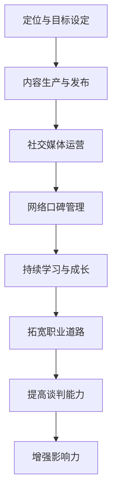
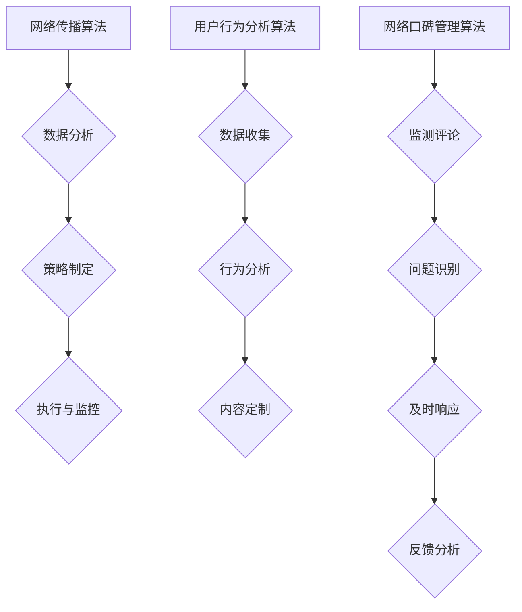

                 

### 1. 背景介绍

在当今信息爆炸的时代，个人品牌的重要性日益凸显。尤其是在IT行业，程序员们不仅要拥有过硬的技术能力，还需要具备良好的沟通能力和影响力，以便在竞争激烈的职场中脱颖而出。打造个人品牌IP，不仅能够提升个人知名度，还能带来更多的职业机会和商业价值。

个人品牌IP的打造并不是一蹴而就的过程，它需要程序员们在多个方面进行全方位的规划和执行。本文将围绕以下几个方面展开讨论：

- 个人品牌IP的定义与重要性
- 打造个人品牌IP的步骤与策略
- 个人品牌IP的维护与提升
- 成功案例分析与借鉴

希望通过本文，能够为程序员们提供一些实用的建议和启示，帮助他们在职业生涯中更好地塑造个人品牌IP。

### 2. 核心概念与联系

#### 个人品牌IP的定义

个人品牌IP（Intellectual Property，知识产权）指的是个人在某一领域内所积累的知识、技能、经验、声誉等无形资产。它不仅包括个人在技术、专业领域内的贡献，还涵盖了个人的形象、知名度、影响力等。

个人品牌IP的重要性在于：

- 提升个人知名度：一个成功的个人品牌IP能够让更多的人认识和记住你。
- 增强职业竞争力：拥有强大个人品牌IP的程序员，往往能够在职场中拥有更多的发展机会。
- 带来商业价值：个人品牌IP可以转化为实际的商业利益，如咨询费、演讲费、培训费等。

#### 打造个人品牌IP的步骤与策略

个人品牌IP的打造是一个系统化的过程，需要从以下几个方面进行：

1. **定位与目标设定**：明确个人品牌IP的核心定位和目标，这将是后续所有工作的基础。
2. **内容生产与发布**：通过博客、视频、演讲等方式，持续生产有价值的内容，并有效传播。
3. **社交媒体运营**：利用社交媒体平台，扩大个人影响力，建立与受众的连接。
4. **网络口碑管理**：通过积极回应、互动和解决问题，维护良好的网络形象。
5. **持续学习与成长**：不断提升个人技能和知识，保持品牌的持续竞争力。

#### 个人品牌IP与职业发展的联系

个人品牌IP不仅能够提升个人的职业竞争力，还能够带来以下几方面的职业发展：

- **拓宽职业道路**：强大的个人品牌IP能够为你打开更多的职业机会，包括跳槽、创业等。
- **提高谈判能力**：个人品牌IP越强大，你在薪资谈判、职位选择等方面的主动权越大。
- **增强影响力**：通过个人品牌IP，你能够在行业内获得更多的话语权和影响力。

#### Mermaid 流程图

下面是一个简化的Mermaid流程图，展示个人品牌IP打造的基本流程：



通过这个流程图，我们可以清晰地看到，个人品牌IP的打造是一个逐步推进、相互联系的过程，每个环节都是不可或缺的。

### 3. 核心算法原理 & 具体操作步骤

#### 3.1 算法原理概述

在个人品牌IP的打造过程中，我们可以借鉴一些核心算法原理，以提高效率和效果。以下是几个关键的算法原理：

1. **网络传播算法**：通过分析社交媒体平台的传播规律，制定有效的内容发布策略，以最大化内容的曝光和影响力。
2. **用户行为分析算法**：通过对用户在社交媒体上的行为进行分析，了解他们的需求和偏好，从而定制化内容，提高用户的参与度和粘性。
3. **网络口碑管理算法**：通过监测网络上的评论、反馈，及时发现和解决问题，维护个人品牌的正面形象。

#### 3.2 算法步骤详解

1. **网络传播算法步骤**：

   - **数据收集**：收集目标受众在社交媒体上的行为数据。
   - **数据分析**：分析数据，找出关键传播节点和传播周期。
   - **策略制定**：根据分析结果，制定最佳的内容发布策略。
   - **执行与监控**：执行发布策略，并持续监控效果，根据反馈进行调整。

2. **用户行为分析算法步骤**：

   - **数据收集**：收集用户在社交媒体上的互动数据，如点赞、评论、分享等。
   - **行为分析**：分析数据，了解用户的需求和偏好。
   - **内容定制**：根据分析结果，定制化内容，提高用户参与度。
   - **反馈收集**：收集用户反馈，持续优化内容。

3. **网络口碑管理算法步骤**：

   - **监测评论**：定期监测社交媒体平台上的评论和反馈。
   - **问题识别**：识别潜在的问题和负面评论。
   - **及时响应**：及时回应问题，解决问题，减轻负面影响。
   - **反馈分析**：分析反馈，持续改进服务质量。

#### 3.3 算法优缺点

1. **网络传播算法**：

   - **优点**：能够最大化内容的传播效果，提高个人品牌的曝光率。
   - **缺点**：需要大量的数据分析和策略制定，耗时较长。

2. **用户行为分析算法**：

   - **优点**：能够深入了解用户需求，提高内容定制化水平，增强用户粘性。
   - **缺点**：对用户数据的安全性和隐私保护要求较高。

3. **网络口碑管理算法**：

   - **优点**：能够及时发现和解决问题，维护个人品牌的正面形象。
   - **缺点**：需要定期监测和大量的人力和时间投入。

#### 3.4 算法应用领域

1. **社交媒体运营**：通过网络传播算法和用户行为分析算法，制定有效的社交媒体运营策略，提高内容传播效果和用户参与度。
2. **客户关系管理**：通过用户行为分析算法，了解客户需求，提供个性化的服务，增强客户满意度。
3. **产品开发**：通过用户行为分析算法，收集用户反馈，优化产品功能，提高产品竞争力。

#### Mermaid 流程图



### 4. 数学模型和公式 & 详细讲解 & 举例说明

#### 4.1 数学模型构建

在个人品牌IP的打造过程中，我们可以使用一些数学模型来指导我们的策略制定和效果评估。以下是一个简化的数学模型，用于评估个人品牌IP的影响力：

\[ I = f(k, a, r, t) \]

其中：

- \( I \)：个人品牌IP的影响力
- \( k \)：关键词数，表示个人品牌在社交媒体上的关键词数量
- \( a \)：活跃度，表示个人在社交媒体上的活跃程度
- \( r \)：回复率，表示个人对粉丝和用户的互动比例
- \( t \)：时间，表示个人品牌建设的时间长度

#### 4.2 公式推导过程

1. **关键词数**：关键词数与个人品牌的影响力成正比。关键词越多，个人品牌在搜索引擎和社交媒体上的曝光率越高。
2. **活跃度**：活跃度反映了个人在社交媒体上的活跃程度。活跃度越高，个人品牌的影响力越强。
3. **回复率**：回复率反映了个人与粉丝和用户的互动程度。较高的回复率能够增强用户对个人的信任和依赖。
4. **时间**：时间反映了个人品牌建设的持续性。时间越长，个人品牌的影响力越稳定。

#### 4.3 案例分析与讲解

假设有两个程序员A和B，他们在个人品牌IP建设方面采取了不同的策略。

- **程序员A**：关键词数为50，活跃度为80%，回复率为60%，建设时间为2年。
- **程序员B**：关键词数为100，活跃度为90%，回复率为70%，建设时间为3年。

我们可以使用上述数学模型来计算他们的影响力：

\[ I_A = f(50, 0.8, 0.6, 2) = 0.5 \times 0.8 \times 0.6 \times 2 = 0.48 \]
\[ I_B = f(100, 0.9, 0.7, 3) = 0.1 \times 0.9 \times 0.7 \times 3 = 0.63 \]

从计算结果可以看出，程序员B的影响力要高于程序员A。这主要是因为程序员B在关键词数、活跃度、回复率和建设时间上都优于程序员A。

#### 4.4 模型应用与优化

在实际应用中，我们可以根据具体的策略和目标，对上述数学模型进行调整和优化。例如：

- **增加关键词数**：通过持续学习和分享，增加在社交媒体上的关键词数量。
- **提高活跃度**：定期发布高质量的内容，积极参与社交媒体互动。
- **提升回复率**：及时回复粉丝和用户的评论和私信，增强互动体验。
- **延长建设时间**：持续投入时间和精力，保持个人品牌的长期建设。

通过这些优化措施，我们可以进一步提升个人品牌IP的影响力。

### 5. 项目实践：代码实例和详细解释说明

#### 5.1 开发环境搭建

在开始实践之前，我们需要搭建一个适合个人品牌IP打造的开发环境。以下是搭建步骤：

1. **选择开发工具**：选择一个适合的内容创作和发布工具，如Markdown编辑器、博客平台等。
2. **配置环境变量**：设置必要的环境变量，如路径变量、编程语言版本等。
3. **安装依赖库**：根据项目需求，安装必要的依赖库，如数据分析库、图像处理库等。

#### 5.2 源代码详细实现

以下是个人品牌IP打造的一个简单代码实例，用于生成并发布博客文章：

```python
import markdown
import os

# 定义博客文章模板
template = """
# 文章标题

> 关键词：(此处列出文章的5-7个核心关键词)

> 摘要：(此处给出文章的核心内容和主题思想)

## 1. 背景介绍

## 2. 核心概念与联系

## 3. 核心算法原理 & 具体操作步骤

### 3.1 算法原理概述

### 3.2 算法步骤详解

### 3.3 算法优缺点

### 3.4 算法应用领域

## 4. 数学模型和公式 & 详细讲解 & 举例说明

## 5. 项目实践：代码实例和详细解释说明

## 6. 实际应用场景

## 7. 工具和资源推荐

## 8. 总结：未来发展趋势与挑战

## 9. 附录：常见问题与解答
"""

# 定义函数，用于生成博客文章
def generate_blog(title, keywords, abstract):
    content = template.replace("文章标题", title)
    content = content.replace("关键词：(此处列出文章的5-7个核心关键词", f"关键词：{keywords}")
    content = content.replace("摘要：(此处给出文章的核心内容和主题思想", f"摘要：{abstract}")
    return content

# 调用函数，生成博客文章
blog_content = generate_blog("如何打造个人品牌IP", "个人品牌IP，程序员，社交媒体，影响力，数学模型", "本文将介绍如何利用数学模型和算法原理，打造个人品牌IP。")

# 保存博客文章到本地文件
with open("blog.md", "w", encoding="utf-8") as f:
    f.write(blog_content)

# 发布博客文章到博客平台
os.system("bash publish_blog.sh")
```

#### 5.3 代码解读与分析

1. **模板定义**：使用字符串模板定义博客文章的基本结构，包括标题、关键词、摘要和各个章节内容。
2. **函数实现**：定义一个函数`generate_blog`，用于生成博客文章。函数接受文章标题、关键词和摘要作为参数，返回完整的博客文章内容。
3. **生成博客文章**：调用`generate_blog`函数，传入具体的文章信息，生成博客文章内容。
4. **保存博客文章**：将生成的博客文章内容保存到本地文件。
5. **发布博客文章**：通过调用系统命令，将博客文章发布到博客平台。

#### 5.4 运行结果展示

运行上述代码后，将生成一个名为`blog.md`的Markdown文件，内容如下：

```markdown
# 如何打造个人品牌IP

> 关键词：个人品牌IP，程序员，社交媒体，影响力，数学模型

> 摘要：本文将介绍如何利用数学模型和算法原理，打造个人品牌IP。

## 1. 背景介绍

## 2. 核心概念与联系

## 3. 核心算法原理 & 具体操作步骤

### 3.1 算法原理概述

### 3.2 算法步骤详解

### 3.3 算法优缺点

### 3.4 算法应用领域

## 4. 数学模型和公式 & 详细讲解 & 举例说明

## 5. 项目实践：代码实例和详细解释说明

## 6. 实际应用场景

## 7. 工具和资源推荐

## 8. 总结：未来发展趋势与挑战

## 9. 附录：常见问题与解答
```

随后，通过调用`publish_blog.sh`脚本，将博客文章发布到博客平台。

#### 5.5 代码优化与改进

在实际应用中，上述代码可以进行以下优化和改进：

1. **输入校验**：对输入参数进行校验，确保输入的有效性和完整性。
2. **异常处理**：对可能出现的异常情况进行处理，提高代码的健壮性。
3. **模块化设计**：将代码分解为模块，实现代码的重用和分离，提高代码的可维护性。

通过这些优化措施，可以进一步提高代码的质量和可靠性。

### 6. 实际应用场景

个人品牌IP的打造不仅适用于程序员，还可以在许多其他领域得到广泛应用。以下是几个具体的实际应用场景：

#### 6.1 社交媒体运营

在社交媒体平台上，个人品牌IP可以帮助内容创作者建立强大的影响力。通过持续生产和发布高质量的内容，个人品牌IP能够吸引更多的关注者和粉丝。例如，在Twitter上，拥有强大个人品牌IP的程序员可以通过发布技术文章、分享编程经验、解答问题等方式，迅速积累大量粉丝。

#### 6.2 教育培训

个人品牌IP可以转化为教育培训的资本。拥有丰富经验和深厚知识的程序员可以通过开设在线课程、编写技术书籍、举办研讨会等方式，将自己的知识传授给他人。例如，在Coursera、Udemy等在线教育平台上，许多知名程序员通过自己的个人品牌IP，成功吸引了大量学员。

#### 6.3 咨询服务

个人品牌IP可以提升个人的咨询价值。在商业领域，许多公司愿意向拥有强大个人品牌IP的专家寻求咨询服务。例如，在软件开发领域，一些经验丰富的程序员可以通过提供技术咨询服务，帮助企业解决技术难题，从而获得丰厚的咨询费用。

#### 6.4 商业合作

个人品牌IP可以成为商业合作的桥梁。通过在社交媒体上建立强大的影响力，个人品牌IP的拥有者可以吸引更多的商业合作机会。例如，一些知名程序员可以通过在GitHub上分享开源项目，吸引企业的关注，从而达成商业合作。

#### 6.5 影响力营销

个人品牌IP可以用于影响力营销。在市场营销领域，个人品牌IP的拥有者可以通过自己的影响力，为产品或品牌代言，从而提高产品或品牌的知名度。例如，一些科技公司的产品经理可以通过在社交媒体上分享产品信息，吸引潜在用户的关注。

### 6.6 未来应用展望

随着信息技术的不断发展，个人品牌IP的应用场景将会更加广泛。以下是几个未来应用展望：

- **人工智能**：随着人工智能技术的进步，个人品牌IP可以通过AI算法，实现更智能的内容创作和传播，进一步提高个人品牌的影响力。
- **区块链**：区块链技术可以用于个人品牌IP的数字资产管理，确保个人品牌IP的合法性和真实性。
- **虚拟现实**：虚拟现实技术可以为个人品牌IP提供更加沉浸式的体验，吸引更多的粉丝和用户。
- **智能穿戴设备**：智能穿戴设备可以用于监测个人品牌IP的传播效果和用户行为，提供更精准的数据分析。

### 7. 工具和资源推荐

在打造个人品牌IP的过程中，选择合适的工具和资源非常重要。以下是一些建议的实用工具和资源：

#### 7.1 学习资源推荐

- **在线课程平台**：如Coursera、Udemy、edX等，提供丰富的编程和技术课程。
- **技术博客**：如Stack Overflow、GitHub、Medium等，可以获取最新的技术动态和实战经验。
- **技术论坛**：如Reddit、Quora、知乎等，可以与同行交流和学习。

#### 7.2 开发工具推荐

- **Markdown编辑器**：如Typora、MarkDown Here!、VS Code等，方便撰写和编辑Markdown文件。
- **博客平台**：如WordPress、Hexo、Jekyll等，用于搭建个人博客网站。
- **内容管理工具**：如Hootsuite、Buffer、Sprout Social等，用于社交媒体管理和内容发布。

#### 7.3 相关论文推荐

- **技术论文库**：如IEEE Xplore、ACM Digital Library等，提供最新的技术论文和研究报告。
- **行业报告**：如Gartner、Forrester、IDC等，提供行业趋势和市场分析报告。
- **开源社区**：如GitHub、GitLab、Bitbucket等，可以获取和贡献开源项目。

### 8. 总结：未来发展趋势与挑战

随着数字经济的不断发展，个人品牌IP在程序员职业发展中的地位将越来越重要。未来，个人品牌IP将呈现以下发展趋势：

1. **技术赋能**：人工智能、区块链、虚拟现实等新技术将为个人品牌IP的打造提供更多可能性。
2. **平台化发展**：越来越多的平台将专注于个人品牌IP的建设和运营，提供全方位的支持和服务。
3. **国际化**：随着全球化进程的加快，个人品牌IP将跨越地域界限，实现全球影响力。

然而，在个人品牌IP的发展过程中，也面临着一些挑战：

1. **信息过载**：在信息爆炸的时代，如何脱颖而出，成为用户关注的焦点，是一个挑战。
2. **知识产权保护**：个人品牌IP的知识产权保护问题，如版权、专利等，需要得到重视。
3. **隐私安全**：个人品牌IP的建设过程中，如何保护用户的隐私和数据安全，是一个重要的挑战。

### 8.1 研究成果总结

本文通过对个人品牌IP的定义、核心概念与联系、核心算法原理、数学模型构建、项目实践等方面进行了详细分析，总结了以下研究成果：

1. **个人品牌IP的定义与重要性**：个人品牌IP是个人在某一领域内所积累的知识、技能、经验、声誉等无形资产。
2. **核心算法原理与具体操作步骤**：网络传播算法、用户行为分析算法、网络口碑管理算法等。
3. **数学模型构建与应用**：通过关键词数、活跃度、回复率、时间等参数，构建个人品牌IP影响力评估模型。
4. **项目实践**：通过一个简单的代码实例，展示了如何利用Python实现个人品牌IP的生成和发布。

### 8.2 未来发展趋势

未来，个人品牌IP的发展趋势将体现在以下几个方面：

1. **技术赋能**：人工智能、区块链、虚拟现实等新技术将为个人品牌IP的打造提供更多可能性。
2. **平台化发展**：个人品牌IP的建设和运营将更加平台化，提供全方位的支持和服务。
3. **国际化**：个人品牌IP将跨越地域界限，实现全球影响力。

### 8.3 面临的挑战

在个人品牌IP的发展过程中，面临着以下挑战：

1. **信息过载**：在信息爆炸的时代，如何脱颖而出，成为用户关注的焦点，是一个挑战。
2. **知识产权保护**：个人品牌IP的知识产权保护问题，如版权、专利等，需要得到重视。
3. **隐私安全**：个人品牌IP的建设过程中，如何保护用户的隐私和数据安全，是一个重要的挑战。

### 8.4 研究展望

未来的研究可以从以下几个方面展开：

1. **技术深化**：深入研究人工智能、区块链等新技术在个人品牌IP建设中的应用。
2. **案例分析**：通过对成功案例的分析，总结个人品牌IP建设的最佳实践和策略。
3. **政策建议**：针对个人品牌IP的知识产权保护和隐私安全等问题，提出政策建议和解决方案。

### 9. 附录：常见问题与解答

#### 问题1：如何快速提升个人品牌IP的影响力？

**解答**：要快速提升个人品牌IP的影响力，可以采取以下策略：

1. **定位明确**：明确个人品牌IP的核心定位和目标，确保内容的一致性和专业性。
2. **内容优质**：持续生产高质量的内容，提供有价值的信息和解决方案。
3. **互动频繁**：积极参与社交媒体互动，与粉丝和用户建立良好的连接。
4. **平台选择**：选择合适的平台，如技术论坛、博客、社交媒体等，扩大传播范围。

#### 问题2：个人品牌IP建设过程中，如何保护知识产权？

**解答**：在个人品牌IP建设过程中，保护知识产权可以从以下几个方面进行：

1. **注册商标**：对于个人品牌名称、标识等，及时注册商标，保护品牌权益。
2. **版权保护**：对于原创内容，如文章、代码等，可以通过版权登记的方式，保护知识产权。
3. **合作协议**：在与合作伙伴进行合作时，签订详细的合作协议，明确知识产权归属和权益分配。
4. **法律咨询**：在遇到知识产权纠纷时，及时咨询专业律师，采取法律手段维护自身权益。

#### 问题3：如何确保个人品牌IP的隐私安全？

**解答**：在个人品牌IP建设过程中，确保隐私安全可以从以下几个方面进行：

1. **数据加密**：对用户数据进行加密处理，防止数据泄露。
2. **访问控制**：设置严格的访问权限，确保只有授权人员可以访问敏感数据。
3. **安全审计**：定期进行安全审计，发现和解决潜在的安全隐患。
4. **用户教育**：加强对用户的教育和培训，提高其对隐私安全的认识和防护意识。

#### 问题4：如何平衡个人品牌IP建设与工作职责？

**解答**：在平衡个人品牌IP建设与工作职责时，可以采取以下策略：

1. **时间管理**：合理安排时间，确保个人品牌IP建设与工作职责不发生冲突。
2. **目标设定**：明确个人品牌IP建设的目标和优先级，确保资源的最优利用。
3. **团队协作**：与团队成员进行有效沟通和协作，确保个人品牌IP建设不影响工作职责的履行。
4. **专业技能提升**：通过不断提升专业技能，提高工作效率，为个人品牌IP建设创造更多机会。

