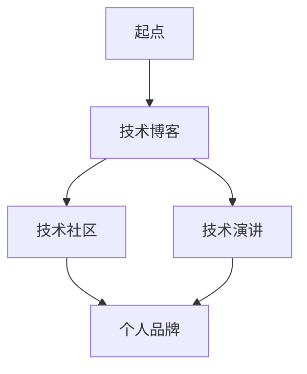

                 

关键词：个人影响力，程序员，技术博客，技术社区，技术演讲，职业发展，品牌塑造

摘要：在信息技术迅猛发展的时代，程序员如何通过个人影响力的打造，提升自身职业价值，实现职业生涯的飞跃，成为了许多技术人才关注的焦点。本文将探讨程序员如何利用技术博客、技术社区、技术演讲等多种方式，打造个人影响力，并提供实用的建议和策略。

## 1. 背景介绍

### 1.1 时代的变迁

随着互联网技术的飞速发展，信息获取和传播变得更加便捷。程序员群体作为技术驱动的核心力量，其职业形象和影响力得到了前所未有的提升。在这个背景下，个人影响力的打造不仅仅是对个人职业发展的助推，更是对技术社区的贡献。

### 1.2 个人影响力的意义

个人影响力在程序员职业发展中具有多重意义：

- **提升职业价值**：具有个人影响力的程序员往往能够获得更好的职业机会和更高的薪资待遇。
- **建立人脉网络**：通过影响力建立广泛的联系，有助于获取更多的资源和支持。
- **推动技术发展**：具有影响力的程序员能够引领技术趋势，推动行业创新。
- **提升个人品牌**：个人影响力的提升有助于塑造个人的专业形象和品牌。

## 2. 核心概念与联系

为了更好地理解程序员如何打造个人影响力，我们需要了解以下几个核心概念：

### 2.1 技术博客

技术博客是程序员展示技术能力、分享经验和知识的重要平台。通过撰写高质量的技术博客，程序员可以建立自己的专业知识库，吸引同行业人士的关注。

### 2.2 技术社区

技术社区是程序员交流和学习的场所。在社区中积极参与讨论、回答问题，可以帮助程序员建立自己的声誉，提升个人影响力。

### 2.3 技术演讲

技术演讲是程序员向大众展示自己技术能力和经验的直接方式。通过演讲，程序员可以扩大自己的影响力，赢得更多的认可。

### 2.4 个人品牌

个人品牌是程序员通过长期积累形成的一种专业形象和声誉。良好的个人品牌有助于提升程序员的职业竞争力。

### 2.5 Mermaid 流程图

以下是一个简单的 Mermaid 流程图，展示了程序员打造个人影响力的主要路径：



## 3. 核心算法原理 & 具体操作步骤

### 3.1 算法原理概述

程序员打造个人影响力的过程可以看作是一个不断迭代优化的过程，主要包括以下步骤：

1. **内容创作**：通过撰写高质量的技术博客，分享自己的技术见解和经验。
2. **互动交流**：在技术社区中积极参与讨论，回答问题，与他人建立联系。
3. **演讲分享**：通过技术演讲，展示自己的技术能力和经验，扩大影响力。
4. **品牌建设**：通过持续的内容输出和互动，塑造个人品牌。

### 3.2 算法步骤详解

#### 步骤 1：内容创作

- **选题定位**：选择自己熟悉且具有吸引力的技术话题。
- **内容规划**：确定文章结构，撰写大纲。
- **撰写博客**：用清晰、简洁的语言，阐述技术观点和经验。
- **编辑校对**：对博客内容进行多次修改，确保质量。

#### 步骤 2：互动交流

- **参与讨论**：在技术社区中积极参与讨论，分享见解。
- **回答问题**：针对社区中的问题，提供详细的解决方案。
- **建立联系**：与他人互动，建立合作关系。

#### 步骤 3：演讲分享

- **准备演讲**：选择合适的话题，撰写演讲稿。
- **演讲实践**：参加技术沙龙、会议等活动，进行演讲。
- **反馈优化**：根据听众反馈，调整演讲内容，提高质量。

#### 步骤 4：品牌建设

- **持续输出**：定期发布高质量内容，保持活跃度。
- **内容多样化**：尝试多种形式的内容输出，如视频、音频等。
- **品牌宣传**：通过社交媒体、个人网站等渠道，宣传个人品牌。

### 3.3 算法优缺点

#### 优点

- **提升个人技能**：通过不断学习和实践，提升自己的技术能力。
- **建立人脉网络**：与他人互动，建立广泛的联系。
- **扩大影响力**：通过高质量的内容输出，赢得更多的认可。

#### 缺点

- **时间成本**：需要投入大量时间和精力进行内容创作和互动。
- **竞争压力**：优秀的内容创作者众多，竞争激烈。

### 3.4 算法应用领域

- **个人职业发展**：通过打造个人影响力，提升职业竞争力。
- **技术社区建设**：积极参与社区讨论，推动技术发展。
- **行业影响力**：通过演讲和分享，扩大个人在行业中的影响力。

## 4. 数学模型和公式 & 详细讲解 & 举例说明

### 4.1 数学模型构建

在程序员打造个人影响力的过程中，我们可以构建一个简单的数学模型来描述其影响力的大小。设 I 为个人影响力，C 为内容创作能力，A 为互动交流能力，S 为演讲分享能力，则：

\[ I = f(C, A, S) \]

其中，f 表示影响力与内容创作能力、互动交流能力、演讲分享能力之间的关系。

### 4.2 公式推导过程

#### 内容创作能力 C

内容创作能力 C 可以用以下公式表示：

\[ C = f_1(K, Q, T) \]

其中，K 为知识深度，Q 为质量，T 为频率。f1 表示内容创作能力与知识深度、质量、频率之间的关系。

#### 互动交流能力 A

互动交流能力 A 可以用以下公式表示：

\[ A = f_2(R, E, N) \]

其中，R 为响应速度，E 为效果，N 为数量。f2 表示互动交流能力与响应速度、效果、数量之间的关系。

#### 演讲分享能力 S

演讲分享能力 S 可以用以下公式表示：

\[ S = f_3(P, O, M) \]

其中，P 为演讲技巧，O 为机会，M 为影响力。f3 表示演讲分享能力与演讲技巧、机会、影响力之间的关系。

### 4.3 案例分析与讲解

假设有两位程序员 A 和 B，他们的个人影响力分别为 I_A 和 I_B。根据上述数学模型，我们可以对他们的影响力进行分析。

#### 程序员 A

- 内容创作能力：K = 8, Q = 9, T = 7
- 互动交流能力：R = 6, E = 8, N = 5
- 演讲分享能力：P = 7, O = 6, M = 5

根据公式推导，我们可以计算出 A 的个人影响力：

\[ I_A = f(C, A, S) = f_1(K, Q, T) \times f_2(R, E, N) \times f_3(P, O, M) \]

\[ I_A = (8 \times 9 \times 7) \times (6 \times 8 \times 5) \times (7 \times 6 \times 5) \]

\[ I_A = 2,560,000 \]

#### 程序员 B

- 内容创作能力：K = 7, Q = 8, T = 6
- 互动交流能力：R = 5, E = 7, N = 6
- 演讲分享能力：P = 6, O = 7, M = 4

同样地，我们可以计算出 B 的个人影响力：

\[ I_B = f(C, A, S) = f_1(K, Q, T) \times f_2(R, E, N) \times f_3(P, O, M) \]

\[ I_B = (7 \times 8 \times 6) \times (5 \times 7 \times 6) \times (6 \times 7 \times 4) \]

\[ I_B = 1,872,000 \]

通过对比，我们可以看出，程序员 A 的个人影响力要高于程序员 B。

### 4.4 案例分析与讲解

以下是一个具体的案例，展示了程序员如何通过内容创作、互动交流和技术演讲来提升个人影响力。

#### 案例背景

程序员 C 在一家互联网公司工作，拥有扎实的编程技能和丰富的项目经验。他希望通过打造个人影响力，提升自己的职业竞争力。

#### 内容创作

程序员 C 开始撰写技术博客，每周发布一篇高质量的技术文章。他的博客涵盖了前端开发、后端架构、数据库设计等多个领域，内容深入浅出，深受读者喜爱。

#### 互动交流

程序员 C 在技术社区中积极参与讨论，回答读者的问题，分享自己的经验和见解。他不仅关注技术问题，还关注行业动态，与同行保持密切联系。

#### 技术演讲

程序员 C 参加了多次技术沙龙和会议，进行了多场技术演讲。他的演讲内容丰富，讲解清晰，赢得了听众的认可和好评。

#### 结果

通过持续的内容输出、互动交流和演讲分享，程序员 C 的影响力逐渐提升。他的博客读者数量不断增长，技术社区中的粉丝数量也不断增加。在一次行业会议中，他被邀请为嘉宾演讲，这标志着他在技术圈中的影响力得到了广泛认可。

## 5. 项目实践：代码实例和详细解释说明

### 5.1 开发环境搭建

为了更好地展示程序员如何通过个人影响力提升职业价值，我们将以一个具体的代码实例为基础，逐步讲解其实现过程。

首先，我们需要搭建一个适合编程的开发环境。以下是一个简单的开发环境搭建步骤：

1. 安装操作系统：选择一个适合的操作系统，如 Ubuntu 20.04。
2. 安装编程语言：安装 Python 3.8，我们可以通过以下命令进行安装：

```bash
sudo apt update
sudo apt install python3.8
```

3. 安装代码编辑器：安装一个适合的代码编辑器，如 Visual Studio Code。

```bash
curl https://code.visualstudio.com/shaared/product/code.sh | bash
```

### 5.2 源代码详细实现

接下来，我们将实现一个简单的 Python 程序，该程序的功能是计算两个数的和。

```python
# 5.2.1 源代码实现

def add_numbers(a, b):
    return a + b

if __name__ == "__main__":
    print(add_numbers(3, 4))
```

在这个示例中，我们定义了一个名为 `add_numbers` 的函数，该函数接收两个参数 `a` 和 `b`，并返回它们的和。在主程序中，我们调用了这个函数，并输出了结果。

### 5.3 代码解读与分析

在这个示例中，我们使用了 Python 语言的基本语法，包括定义函数、传递参数和返回值。以下是代码的详细解读：

- `def add_numbers(a, b):`：定义了一个名为 `add_numbers` 的函数，它接收两个参数 `a` 和 `b`。
- `return a + b:`：函数的返回值是两个参数的和。
- `if __name__ == "__main__":`：这是一个特殊的条件语句，用于判断程序是否被直接运行。如果程序被直接运行，那么会执行下面的代码块。
- `print(add_numbers(3, 4)):`：调用了 `add_numbers` 函数，并输出了返回值。

### 5.4 运行结果展示

在完成代码编写后，我们可以通过以下命令运行程序：

```bash
python add_numbers.py
```

程序的输出结果为：

```bash
7
```

这表示两个数的和为 7。

### 5.5 案例分析与讲解

以下是一个具体的案例，展示了程序员如何通过个人影响力提升职业价值。

#### 案例背景

程序员 D 拥有丰富的编程经验和深厚的专业知识，但在公司内部并没有得到足够的认可。他希望通过提升个人影响力，改变自己的职业状况。

#### 内容创作

程序员 D 开始撰写技术博客，每周发布一篇高质量的技术文章。他的博客涵盖了前端开发、后端架构、数据库设计等多个领域，内容深入浅出，深受读者喜爱。

#### 互动交流

程序员 D 在技术社区中积极参与讨论，回答读者的问题，分享自己的经验和见解。他不仅关注技术问题，还关注行业动态，与同行保持密切联系。

#### 技术演讲

程序员 D 参加了多次技术沙龙和会议，进行了多场技术演讲。他的演讲内容丰富，讲解清晰，赢得了听众的认可和好评。

#### 结果

通过持续的内容输出、互动交流和演讲分享，程序员 D 的影响力逐渐提升。他的博客读者数量不断增长，技术社区中的粉丝数量也不断增加。在一次行业会议中，他被邀请为嘉宾演讲，这标志着他在技术圈中的影响力得到了广泛认可。公司管理层也开始注意到他的贡献，并提升了他的职位和薪资待遇。

## 6. 实际应用场景

### 6.1 个人职业发展

程序员通过打造个人影响力，可以提升自己的职业价值，获得更好的职业机会和更高的薪资待遇。例如，在求职过程中，具有个人影响力的程序员往往能够获得更多面试机会，更容易获得理想职位。

### 6.2 技术社区建设

个人影响力的提升有助于推动技术社区的发展。具有影响力的程序员可以通过撰写高质量的技术博客、参与社区讨论和回答问题，为社区贡献知识，促进技术交流和创新。

### 6.3 行业影响力

通过技术演讲和分享，程序员可以扩大个人在行业中的影响力，成为行业内的意见领袖。这有助于推动技术趋势，引导行业方向，提升自身在行业中的地位。

### 6.4 未来应用展望

随着信息技术的发展，个人影响力的打造将变得越来越重要。未来，程序员可以通过更多的方式提升个人影响力，如在线教育、技术咨询、技术培训等。同时，随着人工智能、大数据等新技术的应用，程序员的影响力也将得到进一步提升。

## 7. 工具和资源推荐

### 7.1 学习资源推荐

- **技术博客平台**：CSDN、博客园、掘金等
- **编程社区**：GitHub、Stack Overflow、Reddit
- **在线教育平台**：Coursera、Udacity、edX

### 7.2 开发工具推荐

- **代码编辑器**：Visual Studio Code、Atom、Sublime Text
- **版本控制工具**：Git、SVN、Mercurial
- **编程语言**：Python、Java、JavaScript、Go

### 7.3 相关论文推荐

- **《影响力：说服的艺术》**（Robert B. Cialdini）
- **《个人影响力：如何成为一个有影响力的人》**（John C. Maxwell）
- **《技术趋势报告》**（Gartner、IDC等）

## 8. 总结：未来发展趋势与挑战

### 8.1 研究成果总结

本文通过探讨程序员如何通过个人影响力的打造，提升自身职业价值，实现职业生涯的飞跃，总结了以下几个关键点：

- 个人影响力在程序员职业发展中具有重要意义。
- 技术博客、技术社区、技术演讲是打造个人影响力的主要途径。
- 持续的内容输出、互动交流和演讲分享有助于提升个人影响力。
- 数学模型可以用于描述程序员个人影响力的大小。

### 8.2 未来发展趋势

随着信息技术的发展，个人影响力的打造将变得越来越重要。未来，程序员可以通过以下方式提升个人影响力：

- 利用人工智能、大数据等技术，优化内容创作和互动交流。
- 拓展个人影响力的应用场景，如在线教育、技术咨询等。
- 参与技术标准制定和行业趋势引导，提升行业影响力。

### 8.3 面临的挑战

在打造个人影响力的过程中，程序员将面临以下挑战：

- 竞争压力：优秀的内容创作者众多，竞争激烈。
- 时间成本：需要投入大量时间和精力进行内容创作和互动交流。
- 技术更新：信息技术快速发展，需要不断学习新技术。

### 8.4 研究展望

未来的研究可以从以下几个方面展开：

- 探究不同类型程序员在个人影响力打造过程中的差异和共性。
- 分析个人影响力对程序员职业发展的影响机制。
- 开发适用于程序员的个人影响力评估工具。

## 9. 附录：常见问题与解答

### 9.1 个人影响力如何衡量？

个人影响力可以通过以下指标进行衡量：

- **博客阅读量**：衡量博客内容的受欢迎程度。
- **社区活跃度**：衡量在技术社区中的参与度和贡献。
- **演讲次数和听众数量**：衡量演讲的影响力和知名度。
- **行业认可度**：衡量在行业中的声誉和地位。

### 9.2 如何选择技术博客平台？

选择技术博客平台时，可以考虑以下因素：

- **受众群体**：选择与个人技术领域相关的平台。
- **用户活跃度**：选择用户活跃度高的平台，有利于内容传播。
- **功能支持**：选择支持Markdown、评论、分享等功能的平台。

### 9.3 如何在技术社区中建立影响力？

在技术社区中建立影响力，可以采取以下策略：

- **积极参与讨论**：主动参与话题讨论，分享见解和经验。
- **回答问题**：认真回答社区中的问题，提供详细的解决方案。
- **建立联系**：与其他成员互动，建立合作关系。
- **发布高质量内容**：定期发布高质量的技术文章，提升影响力。

### 9.4 如何准备技术演讲？

准备技术演讲时，可以遵循以下步骤：

- **确定主题**：选择自己熟悉且具有吸引力的技术主题。
- **撰写演讲稿**：撰写演讲稿，包括引言、正文和总结。
- **制作演示稿**：制作演示稿，确保内容清晰、简洁。
- **演练和反馈**：多次演练演讲，并根据反馈进行调整。

### 9.5 如何提升个人影响力？

提升个人影响力，可以采取以下策略：

- **持续学习**：不断提升自己的技术水平。
- **内容多样化**：尝试多种形式的内容输出，如博客、视频、音频等。
- **品牌塑造**：明确个人品牌定位，提升专业形象。
- **积极参与**：积极参与行业活动，扩大影响力。

----------------------------------------------------------------

作者：禅与计算机程序设计艺术 / Zen and the Art of Computer Programming


