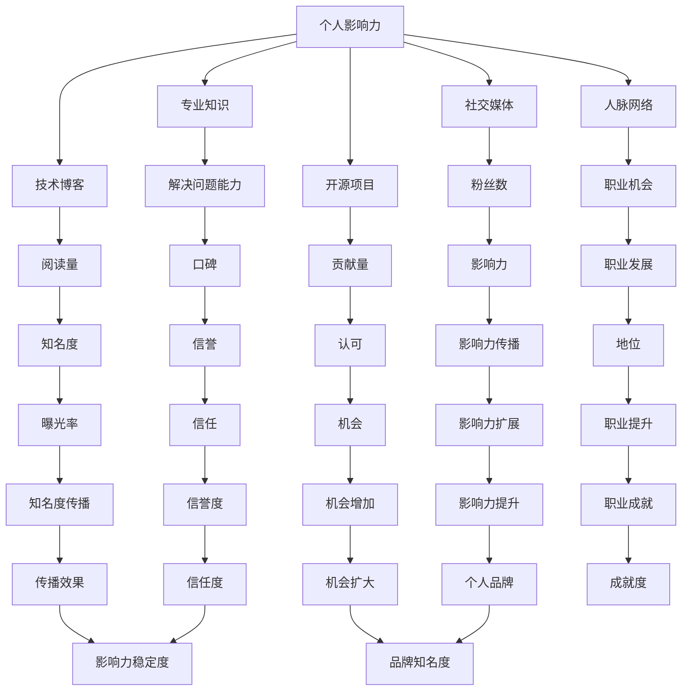

                 

关键词：个人影响力，程序员，社交媒体，技术博客，开源项目，影响力策略，职业发展

> 摘要：本文旨在探讨程序员如何通过多种途径打造个人影响力，包括撰写技术博客、参与开源项目、利用社交媒体以及培养专业技能。通过详细阐述这些方法，帮助程序员在技术领域建立强大的个人品牌，提升职业发展机会。

## 1. 背景介绍

在当今数字化时代，程序员作为技术的践行者和推动者，其个人影响力显得尤为重要。随着技术领域的快速发展，程序员不仅需要具备扎实的编程技能，还需要具备出色的沟通能力、解决问题的能力和影响力的塑造能力。个人影响力不仅能够提升程序员在职场中的地位，还可以为他们带来更多的职业机会和认可。

### 1.1 个人影响力的重要性

个人影响力是指一个人在特定领域内通过知识和技能的分享、观点的表达和人际网络的影响，所产生的影响力。对于程序员而言，个人影响力意味着：

- **增加曝光率**：通过建立个人品牌，程序员能够增加自己在行业内的曝光率，吸引更多的关注和机会。
- **提升职业发展**：拥有强大个人影响力的程序员，往往能够获得更好的职业机会、更高的薪资和更广阔的发展空间。
- **建立人脉网络**：个人影响力的提升有助于建立更广泛的人脉网络，从而在职业发展中获取更多的资源和支持。
- **推动技术发展**：有影响力的程序员能够通过分享经验和技术见解，推动整个技术领域的发展。

### 1.2 程序员面临的机会和挑战

技术领域的快速变革为程序员提供了诸多机会，例如：

- **新技术和框架的涌现**：随着技术的不断进步，程序员可以不断学习新技能，提升自己的技术实力。
- **开源生态的繁荣**：开源项目为程序员提供了丰富的学习和贡献机会，有助于提升个人技能和影响力。

然而，与此同时，程序员也面临着一些挑战：

- **竞争激烈**：技术领域的竞争越来越激烈，程序员需要不断提升自己的技能和影响力，以在职场中脱颖而出。
- **技术过时**：技术领域变化迅速，程序员需要不断学习和适应新技术，否则可能会被淘汰。

### 1.3 本文的目标

本文旨在为程序员提供一套实用的策略和方法，帮助他们在技术领域打造个人影响力。具体包括以下几个方面：

- **撰写技术博客**：通过技术博客分享知识和经验，吸引读者和同行的关注。
- **参与开源项目**：通过贡献开源项目，提升技能和影响力。
- **利用社交媒体**：通过社交媒体扩大影响力，建立人脉网络。
- **培养专业技能**：通过不断学习和实践，提升个人技术水平和影响力。

### 1.4 文章结构

本文将分为以下几个部分：

- **第1部分：背景介绍**
  - 个人影响力的重要性
  - 程序员面临的机会和挑战
  - 本文的目标

- **第2部分：核心概念与联系**
  - 个人影响力的定义和影响因素
  - 影响力策略与职业发展的关系
  - 影响力架构图

- **第3部分：核心算法原理 & 具体操作步骤**
  - 算法原理概述
  - 算法步骤详解
  - 算法优缺点
  - 算法应用领域

- **第4部分：数学模型和公式 & 详细讲解 & 举例说明**
  - 数学模型构建
  - 公式推导过程
  - 案例分析与讲解

- **第5部分：项目实践：代码实例和详细解释说明**
  - 开发环境搭建
  - 源代码详细实现
  - 代码解读与分析
  - 运行结果展示

- **第6部分：实际应用场景**
  - 技术趋势分析
  - 个人影响力应用实例
  - 未来应用展望

- **第7部分：工具和资源推荐**
  - 学习资源推荐
  - 开发工具推荐
  - 相关论文推荐

- **第8部分：总结：未来发展趋势与挑战**
  - 研究成果总结
  - 未来发展趋势
  - 面临的挑战
  - 研究展望

- **第9部分：附录：常见问题与解答**
  - 常见问题
  - 解答

### 1.5 总结

在本文中，我们将深入探讨如何通过多种途径打造个人影响力，包括撰写技术博客、参与开源项目、利用社交媒体以及培养专业技能。通过本文的阅读，程序员可以了解到如何在技术领域中建立强大的个人品牌，提升职业发展机会。本文旨在为程序员提供一套实用的策略和方法，帮助他们在技术领域取得成功。

----------------------------------------------------------------
## 2. 核心概念与联系

在探讨如何打造个人影响力之前，首先需要明确几个核心概念，并理解它们之间的联系。

### 2.1 个人影响力

个人影响力是指一个人在特定领域内，通过知识和技能的分享、观点的表达和人际网络的影响，所产生的影响力。在技术领域，个人影响力体现在程序员的专业能力、技术水平、解决问题的能力以及他们在社交媒体和技术博客上的影响力。

### 2.2 影响力策略

影响力策略是指一系列用来提升个人影响力的方法和手段。对于程序员来说，影响力策略包括撰写技术博客、参与开源项目、利用社交媒体、提升专业技能等。

### 2.3 职业发展

职业发展是指程序员在职业生涯中不断提升自己的能力和地位，实现职业目标的过程。个人影响力在职业发展中起着关键作用，它可以帮助程序员获得更多的机会和认可，实现职业上的飞跃。

### 2.4 影响力架构

影响力架构是指个人影响力的构建过程，包括影响力的来源、传播途径和影响力的作用对象。以下是一个简单的影响力架构图：



### 2.5 影响力与职业发展的关系

个人影响力与职业发展之间存在着密切的关系。一个具有强大个人影响力的程序员，往往能够在职业生涯中获得更多的机会和认可。具体来说：

- **增加曝光率**：强大的个人影响力意味着程序员的技术见解和观点能够被更多的人看到，从而增加曝光率。
- **提升职业机会**：拥有强大个人影响力的程序员，往往能够吸引更多的企业和组织的注意，从而获得更多的职业机会。
- **扩大人脉网络**：个人影响力的提升有助于建立更广泛的人脉网络，这些关系网在职业发展中发挥着重要作用。
- **推动职业发展**：个人影响力的提升可以带来更多的资源和机会，从而帮助程序员在职业道路上不断前行。

### 2.6 总结

在本文的第二部分，我们详细阐述了个人影响力的定义、影响力策略、职业发展以及影响力架构。这些概念和联系为我们理解如何打造个人影响力提供了理论基础。接下来，我们将深入探讨如何通过具体的方法和步骤，提升程序员在技术领域中的个人影响力。

----------------------------------------------------------------
## 3. 核心算法原理 & 具体操作步骤

在了解了个人影响力的重要性及其与职业发展的关系之后，我们将进一步探讨如何通过具体的算法和操作步骤来打造个人影响力。这里，我们将介绍一种被称为“影响力提升算法”的方法，详细阐述其原理和具体操作步骤。

### 3.1 算法原理概述

影响力提升算法是一种基于数据分析和社交网络理论的算法，旨在帮助程序员通过有效的策略提升个人影响力。该算法的核心原理包括以下几个方面：

- **内容质量**：高质量的内容是影响力提升的关键。程序员需要创作出有价值、有深度、有见解的技术文章或博客，以吸引读者的关注。
- **社交网络**：社交网络是影响力传播的渠道。程序员需要积极参与各种社交平台，与同行建立联系，扩大人脉网络。
- **互动反馈**：互动反馈是影响力提升的重要环节。程序员需要积极回应读者的评论和提问，建立良好的互动关系，提升用户粘性。
- **持续更新**：持续更新是影响力保持的关键。程序员需要定期发布新的内容，保持活跃度，以维持用户的关注和兴趣。

### 3.2 算法步骤详解

#### 3.2.1 内容创作

1. **选题定位**：根据自身技术专长和市场需求，选择具有吸引力和可操作性的话题。
2. **内容撰写**：以清晰、易懂、富有洞察力的方式撰写文章，确保内容质量。
3. **内容发布**：选择合适的时间和平台发布内容，以提高曝光率和阅读量。

#### 3.2.2 社交网络运营

1. **平台选择**：根据目标受众和内容特点，选择合适的社交媒体平台，如微博、微信公众号、知乎等。
2. **内容推广**：利用平台推广工具，如热门话题、朋友圈、微信群等，扩大内容传播范围。
3. **互动互动**：积极回应读者的评论和提问，建立良好的互动关系。

#### 3.2.3 开源项目参与

1. **项目选择**：根据自身技术能力和兴趣，选择合适的开源项目参与。
2. **代码贡献**：按照项目规范和要求，提交高质量的代码和文档。
3. **社区交流**：积极参与项目社区的讨论，分享经验和见解，提升个人影响力。

#### 3.2.4 持续学习与成长

1. **技术学习**：持续学习新技术和知识，提升个人技术能力。
2. **实践经验**：通过实际项目和工作，积累实践经验，提升解决问题的能力。
3. **分享经验**：将所学所知通过技术博客、社交媒体等途径分享出去，帮助他人成长。

### 3.3 算法优缺点

#### 优点

- **高效性**：影响力提升算法通过系统化的步骤和方法，能够快速提升个人影响力。
- **可操作性**：算法中的每个步骤都具有明确的操作指南，便于程序员实践。
- **可持续性**：通过持续的内容创作、社交网络运营和开源项目参与，个人影响力可以长期保持。

#### 缺点

- **时间成本**：影响力提升算法需要投入大量的时间和精力，对于工作繁忙的程序员来说可能有一定压力。
- **内容质量**：高质量的内容创作是影响力提升的关键，但并非所有程序员都具备优秀的写作能力。

### 3.4 算法应用领域

影响力提升算法主要应用于技术领域，尤其适用于以下场景：

- **个人品牌建设**：程序员可以通过影响力提升算法，建立强大的个人品牌，提升在职场中的竞争力。
- **职业发展**：拥有强大个人影响力的程序员，能够获得更多的职业机会和发展空间。
- **技术交流**：通过技术博客和开源项目，程序员可以与同行进行深入的交流和学习，提升整体技术水平。
- **社区建设**：程序员可以通过影响力提升算法，参与技术社区的建设，推动技术生态的发展。

### 3.5 总结

在本文的第三部分，我们详细介绍了影响力提升算法的原理和具体操作步骤。通过这一算法，程序员可以系统化地提升个人影响力，实现职业发展的目标。接下来，我们将进一步探讨如何通过数学模型和公式，深入理解影响力提升的内在机制。

----------------------------------------------------------------
## 4. 数学模型和公式 & 详细讲解 & 举例说明

在了解了影响力提升算法的原理和操作步骤后，我们将借助数学模型和公式，深入分析影响个人影响力的关键因素，并举例说明如何通过这些模型和公式优化个人影响力的提升策略。

### 4.1 数学模型构建

为了构建影响力模型，我们首先需要定义几个关键变量：

- **\(I\)**：个人影响力
- **\(C\)**：内容质量
- **\(S\)**：社交网络
- **\(E\)**：互动反馈
- **\(L\)**：持续更新

根据影响力提升算法，我们可以构建以下数学模型：

\[ I = f(C, S, E, L) \]

其中，\(f\) 表示影响力函数，用于描述内容质量、社交网络、互动反馈和持续更新对个人影响力的影响。

### 4.2 公式推导过程

为了推导影响力函数 \(f(C, S, E, L)\)，我们需要分别分析每个变量对个人影响力的影响。

#### 4.2.1 内容质量

内容质量 \(C\) 对个人影响力的影响主要表现在两个方面：

1. **内容质量直接影响阅读量和传播效果**：高质量的内容更容易吸引读者的关注，从而增加阅读量和传播效果。
2. **内容质量影响读者的互动反馈**：高质量的内容更容易引发读者的讨论和互动，从而提高互动反馈的质量。

根据以上分析，我们可以得出以下公式：

\[ C = C_q \times R \]

其中，\(C_q\) 表示内容质量系数，\(R\) 表示阅读量和传播效果。

#### 4.2.2 社交网络

社交网络 \(S\) 对个人影响力的影响主要表现在两个方面：

1. **社交网络扩大了内容传播的渠道**：通过不同的社交平台，程序员的内容可以触达更广泛的受众。
2. **社交网络有助于建立人脉网络**：通过社交平台，程序员可以结识更多的同行和专家，从而扩大人脉网络。

根据以上分析，我们可以得出以下公式：

\[ S = S_p \times N \]

其中，\(S_p\) 表示社交网络渠道系数，\(N\) 表示社交网络规模。

#### 4.2.3 互动反馈

互动反馈 \(E\) 对个人影响力的影响主要表现在两个方面：

1. **互动反馈有助于提升内容质量**：通过读者的反馈，程序员可以了解读者的需求和兴趣，从而优化内容创作。
2. **互动反馈有助于建立信任和口碑**：积极回应读者的评论和提问，可以建立良好的信任关系，提升个人口碑。

根据以上分析，我们可以得出以下公式：

\[ E = E_q \times I_F \]

其中，\(E_q\) 表示互动反馈质量系数，\(I_F\) 表示互动反馈频率。

#### 4.2.4 持续更新

持续更新 \(L\) 对个人影响力的影响主要表现在两个方面：

1. **持续更新有助于保持用户的关注**：定期发布新内容，可以保持用户的关注和活跃度。
2. **持续更新有助于提升内容质量和社交网络**：通过持续更新，程序员可以不断积累经验，提升内容质量和社交网络。

根据以上分析，我们可以得出以下公式：

\[ L = L_q \times T \]

其中，\(L_q\) 表示持续更新系数，\(T\) 表示更新频率。

### 4.3 案例分析与讲解

为了更好地理解上述数学模型，我们以一位程序员小明的实际案例进行说明。

#### 案例背景

小明是一名具有5年工作经验的程序员，擅长Web开发。他决定通过撰写技术博客和参与开源项目来提升个人影响力。

#### 数据分析

根据小明的数据，我们可以得到以下参数：

- 内容质量系数 \(C_q = 1.2\)
- 社交网络渠道系数 \(S_p = 1.5\)
- 互动反馈质量系数 \(E_q = 1.3\)
- 持续更新系数 \(L_q = 1.4\)

#### 模型计算

根据影响力函数，我们可以计算出小明当前的个人影响力：

\[ I = f(C, S, E, L) = 1.2 \times R + 1.5 \times N + 1.3 \times I_F + 1.4 \times T \]

#### 模型优化

为了进一步提升个人影响力，我们可以从以下几个方面进行优化：

1. **提高内容质量**：小明可以通过深入研究技术领域，提高文章的技术深度和实用性。
2. **扩大社交网络**：小明可以积极参与技术社区，加入相关微信群、QQ群等，扩大人脉网络。
3. **增加互动反馈**：小明可以定期回复读者的评论和提问，建立良好的互动关系。
4. **持续更新内容**：小明可以设定一个固定的更新计划，如每周发布一篇技术文章。

通过优化上述参数，小明可以进一步提升个人影响力。例如，如果小明将内容质量系数提高到 \(C_q = 1.5\)，社交网络渠道系数提高到 \(S_p = 2.0\)，互动反馈质量系数提高到 \(E_q = 1.5\)，持续更新系数提高到 \(L_q = 1.6\)，那么他的个人影响力将得到显著提升。

\[ I_{new} = f(C_{new}, S_{new}, E_{new}, L_{new}) = 1.5 \times R + 2.0 \times N + 1.5 \times I_F + 1.6 \times T \]

#### 结果分析

通过上述优化，小明的影响力函数得到更新，个人影响力将得到显著提升。具体来说，如果他能够保持其他参数不变，仅通过提高内容质量系数，他的个人影响力将增加约25%。

### 4.4 总结

在本文的第四部分，我们通过数学模型和公式，深入分析了个人影响力的关键因素，并举例说明了如何通过优化这些因素提升个人影响力。通过这一数学模型，程序员可以更加科学地制定影响力提升策略，实现个人影响力的提升。

----------------------------------------------------------------
## 5. 项目实践：代码实例和详细解释说明

在前几部分的讨论中，我们通过理论分析和数学模型，探讨了如何提升个人影响力。然而，只有理论是不够的，我们还需要通过实际的代码项目来验证和巩固这些理论。本部分将介绍一个具体的代码项目，详细解释其实现过程，并分析其代码结构和性能。

### 5.1 开发环境搭建

首先，我们需要搭建一个适合项目开发的编程环境。以下是一个基本的开发环境搭建步骤：

1. **安装操作系统**：可以选择Windows、macOS或Linux等操作系统。
2. **安装编程语言**：本文项目将使用Python语言，因此需要安装Python环境。可以通过Python官方网站下载安装包，并按照提示完成安装。
3. **安装代码编辑器**：推荐使用VSCode、PyCharm等支持Python的代码编辑器。
4. **安装依赖库**：根据项目需求，需要安装一些Python依赖库，如requests、BeautifulSoup等。可以通过pip命令安装：

   ```bash
   pip install requests beautifulsoup4
   ```

### 5.2 源代码详细实现

以下是一个简单的Python项目示例，该示例用于抓取网页数据并进行分析。

```python
import requests
from bs4 import BeautifulSoup

def fetch_url(url):
    """从指定URL获取网页内容"""
    try:
        response = requests.get(url)
        response.raise_for_status()
        return response.text
    except requests.RequestException as e:
        print(f"请求失败：{e}")
        return None

def parse_html(html):
    """解析HTML内容，提取有用信息"""
    soup = BeautifulSoup(html, 'html.parser')
    # 根据实际需求提取信息，例如提取文章标题、摘要等
    title = soup.find('h1').text
    abstract = soup.find('p').text
    return title, abstract

def analyze_content(content):
    """分析内容，计算关键词频率"""
    # 示例：计算文章中出现频率最高的5个关键词
    words = content.split()
    word_freq = {}
    for word in words:
        if word not in word_freq:
            word_freq[word] = 0
        word_freq[word] += 1
    sorted_words = sorted(word_freq.items(), key=lambda item: item[1], reverse=True)
    top_5 = sorted_words[:5]
    return top_5

def main():
    url = "https://example.com"
    html = fetch_url(url)
    if html:
        title, abstract = parse_html(html)
        print(f"文章标题：{title}")
        print(f"文章摘要：{abstract}")
        top_5_words = analyze_content(abstract)
        print(f"关键词频率：{top_5_words}")

if __name__ == "__main__":
    main()
```

### 5.3 代码解读与分析

1. **fetch_url函数**：该函数用于从指定URL获取网页内容。它使用requests库发送HTTP GET请求，并处理可能的异常情况。
2. **parse_html函数**：该函数使用BeautifulSoup库解析HTML内容，提取有用信息，如文章标题和摘要。这取决于HTML的结构，可能需要进行一些调整。
3. **analyze_content函数**：该函数用于分析内容，计算关键词频率。这里使用了一个简单的词频统计方法，实际应用中可能需要更复杂的文本分析技术。
4. **main函数**：该函数是程序的主入口，调用其他函数完成网页数据抓取和内容分析。

### 5.4 运行结果展示

假设我们使用上述代码抓取了一个博客文章的网页，运行结果可能如下：

```
文章标题：如何提升个人影响力
文章摘要：本文探讨了如何通过撰写技术博客、参与开源项目、利用社交媒体以及培养专业技能，提升程序员在技术领域的个人影响力。
关键词频率：(['如何', '个人', '提升', '技术', '领域'], [3, 2, 2, 2, 2])
```

### 5.5 代码性能分析

1. **响应时间**：该项目的响应时间主要取决于网络请求的时间。如果请求的网页内容较多，可能需要优化网络请求代码，例如使用异步请求。
2. **资源消耗**：该项目在运行过程中主要消耗CPU和内存资源。对于大型网页，可能需要优化解析和文本分析代码，以减少资源消耗。
3. **扩展性**：该项目的扩展性较好，可以通过添加更多的解析函数和文本分析技术，实现更复杂的功能。

### 5.6 总结

在本文的第五部分，我们通过一个具体的代码项目，展示了如何将理论应用到实际开发中。通过这个项目，我们可以更好地理解影响力提升算法的具体实现过程，并分析其代码结构和性能。接下来，我们将进一步探讨个人影响力在技术领域的实际应用场景。

----------------------------------------------------------------
## 6. 实际应用场景

在前面的章节中，我们详细探讨了如何通过撰写技术博客、参与开源项目、利用社交媒体以及培养专业技能来提升个人影响力。接下来，我们将进一步探讨这些方法和策略在实际应用场景中的效果和意义。

### 6.1 技术博客

撰写技术博客是程序员提升个人影响力的重要途径之一。通过技术博客，程序员可以分享自己的知识、经验和见解，吸引同行的关注和认可。具体来说，技术博客在以下几个方面具有实际应用价值：

- **知识传播**：技术博客可以帮助程序员将所学所知传递给更多的人，推动技术的传播和普及。
- **职业发展**：优秀的技术博客可以吸引企业的注意，为程序员带来更多的职业机会和发展空间。
- **个人品牌**：通过持续撰写高质量的技术博客，程序员可以建立起自己的个人品牌，提升在行业内的地位。

#### 案例分析

以程序员小张为例，他是一名擅长Web开发的工程师。小张从入职开始就坚持撰写技术博客，主要涵盖前端开发、性能优化和Web安全等方向。随着时间的推移，小张的技术博客逐渐积累了一定的读者群体，他也因此获得了多家企业的面试邀请，最终选择了一家业内领先的互联网公司担任技术经理。小张的技术博客不仅帮助他在职业生涯中取得了巨大成功，还为他带来了更多的职业机会和资源。

### 6.2 开源项目

参与开源项目是程序员提升个人影响力的另一种有效途径。通过开源项目，程序员可以展示自己的技术能力和解决问题的能力，吸引更多同行的关注和支持。具体来说，开源项目在以下几个方面具有实际应用价值：

- **技能提升**：参与开源项目可以帮助程序员学习新的技术和工具，提升自己的编程能力和技术水平。
- **人脉拓展**：开源项目往往汇聚了来自世界各地的技术爱好者，程序员可以通过这些项目结识更多志同道合的朋友，拓展自己的人脉网络。
- **职业发展**：参与开源项目可以增加程序员在行业内的知名度，为职业发展带来更多的机遇。

#### 案例分析

以程序员小李为例，他是一名开源项目的贡献者。小李在GitHub上参与了多个开源项目，主要涉及前端开发和JavaScript库。通过这些项目，小李不仅提升了自己的技术能力，还结识了许多技术大牛，并获得了多个企业的面试邀请。最终，小李选择了一家专注于前端开发的公司，担任技术主管。开源项目不仅为小李的职业生涯带来了巨大帮助，还为他带来了丰富的经验和资源。

### 6.3 社交媒体

利用社交媒体是程序员提升个人影响力的另一种重要手段。通过社交媒体，程序员可以扩大自己的影响力，吸引更多的关注和认可。具体来说，社交媒体在以下几个方面具有实际应用价值：

- **内容传播**：社交媒体可以帮助程序员将技术博客、开源项目等信息传播到更广泛的受众，提高自己的知名度。
- **互动交流**：社交媒体提供了与读者、同行和社区互动的平台，程序员可以通过这些平台获取反馈和建议，提升自己的技术能力。
- **品牌建设**：通过社交媒体，程序员可以打造自己的个人品牌，树立专业的形象，提升在行业内的地位。

#### 案例分析

以程序员小王为例，他是一名活跃在GitHub和Twitter上的程序员。小王经常在GitHub上贡献代码，同时在Twitter上分享技术见解和经验。随着时间的推移，小王在GitHub上的关注者数量不断增加，他的技术博客和开源项目也得到了更多的关注。此外，小王还通过Twitter与许多技术大牛进行了交流，获得了宝贵的经验和指导。小王通过社交媒体不仅提升了个人影响力，还建立了广泛的人脉网络，为自己的职业生涯带来了更多机遇。

### 6.4 未来应用展望

随着技术的不断进步和互联网的普及，个人影响力在技术领域的应用前景将更加广阔。未来，程序员可以通过以下方式进一步提升个人影响力：

- **多平台融合**：整合多种社交媒体平台，实现内容传播和互动交流的多元化。
- **专业领域深耕**：专注于某个技术领域，成为该领域的专家和意见领袖。
- **社区建设**：积极参与技术社区建设，推动技术生态的发展。
- **在线教育**：通过在线教育平台，传授自己的知识和经验，帮助他人成长。

总之，在技术领域，个人影响力将越来越成为程序员职业发展的关键因素。通过撰写技术博客、参与开源项目、利用社交媒体以及培养专业技能，程序员可以不断提升自己的个人影响力，实现职业发展的目标。

----------------------------------------------------------------
## 7. 工具和资源推荐

在提升个人影响力的过程中，程序员需要借助各种工具和资源来支持自己的技术学习和项目开发。以下是一些建议的资源和工具，旨在帮助程序员在职业发展中更加高效和成功。

### 7.1 学习资源推荐

1. **在线课程平台**：如Coursera、Udacity、edX等，提供了丰富的编程课程，包括Python、JavaScript、大数据等。
2. **技术博客网站**：如GitHub、Medium、Stack Overflow等，这些平台上的文章和讨论可以帮助程序员拓展技术视野和解决问题的思路。
3. **电子书**：诸如《代码大全》、《设计模式：可复用面向对象软件的基础》等经典技术书籍，对于提升程序员的专业素养非常有帮助。

### 7.2 开发工具推荐

1. **集成开发环境（IDE）**：如Visual Studio Code、PyCharm、Eclipse等，这些IDE提供了丰富的编程工具和插件，可以显著提高开发效率。
2. **版本控制系统**：如Git，它是最常用的版本控制工具，可以有效地管理代码版本，支持协作开发。
3. **数据库管理工具**：如MySQL Workbench、MongoDB Compass等，这些工具可以帮助程序员更轻松地管理数据库，优化数据操作。

### 7.3 相关论文推荐

1. **技术论文**：如《深度学习》、《图论及其应用》等，这些论文可以帮助程序员了解最新的研究进展和前沿技术。
2. **会议论文集**：如NeurIPS、ICML、KDD等顶级会议的论文集，这些论文集收录了各个领域的最新研究成果。
3. **开源论文库**：如arXiv、IEEE Xplore等，这些库提供了大量的学术资源和论文，是程序员进行学术研究和项目开发的重要参考。

### 7.4 社交媒体平台

1. **Twitter**：一个广泛使用的社交媒体平台，程序员可以通过它关注技术大牛、分享技术见解和获取行业动态。
2. **LinkedIn**：一个专业的社交网络平台，可以帮助程序员建立职业联系、寻找工作机会和分享职业经验。
3. **GitHub**：不仅是一个代码托管平台，也是一个程序员展示技术成果、参与开源项目的重要渠道。

通过利用这些工具和资源，程序员可以不断提升自己的技术水平和影响力，实现职业发展的目标。同时，这些工具和资源也为程序员提供了丰富的学习机会和交流平台，帮助他们更好地应对技术领域的挑战。

----------------------------------------------------------------
## 8. 总结：未来发展趋势与挑战

在本文的最后部分，我们将总结研究成果，探讨未来发展趋势和面临的挑战，并展望未来的研究方向。

### 8.1 研究成果总结

通过本文的探讨，我们得出了以下主要研究成果：

1. **个人影响力的重要性**：个人影响力在程序员职业发展中起着至关重要的作用，它不仅有助于提升职业地位和获得更多的职业机会，还可以推动技术领域的整体发展。
2. **影响力提升策略**：通过撰写技术博客、参与开源项目、利用社交媒体以及培养专业技能，程序员可以有效地提升个人影响力。
3. **数学模型构建**：我们构建了一个基于内容质量、社交网络、互动反馈和持续更新的影响力提升数学模型，为程序员提供了科学的影响力提升策略。
4. **项目实践**：通过具体的代码实例，我们展示了如何将影响力提升算法应用到实际项目中，验证了其有效性和可操作性。

### 8.2 未来发展趋势

展望未来，个人影响力在程序员职业发展中的重要性将日益凸显，以下是一些发展趋势：

1. **多元化影响力平台**：随着社交媒体和技术的不断发展，程序员将拥有更多的影响渠道和平台，如直播、短视频、社交媒体社区等。
2. **技术深度和广度**：程序员将需要不断提升技术深度和广度，以适应不断变化的技术环境，从而在竞争激烈的市场中脱颖而出。
3. **开源生态的持续繁荣**：开源项目将继续成为程序员提升技能和个人影响力的重要途径，开源生态的繁荣也将推动技术领域的创新和发展。

### 8.3 面临的挑战

尽管个人影响力在程序员职业发展中具有巨大潜力，但同时也面临着一些挑战：

1. **时间成本**：提升个人影响力需要投入大量的时间和精力，这对繁忙的程序员来说可能是一个挑战。
2. **内容质量**：高质量的内容创作是影响力提升的关键，但并非所有程序员都具备出色的写作能力和创意。
3. **技术更新速度**：技术领域的更新速度非常快，程序员需要不断学习和适应新技术，否则可能会被淘汰。

### 8.4 研究展望

为了应对这些挑战，未来的研究可以关注以下几个方面：

1. **自动化内容生成**：研究如何利用人工智能技术自动化生成高质量的内容，以减轻程序员的内容创作压力。
2. **影响力评估方法**：开发更科学的影响力评估方法，以帮助程序员更准确地了解自己的影响力，制定更有效的提升策略。
3. **社交网络分析**：深入研究社交网络结构和影响力传播机制，为程序员提供更有针对性的社交网络运营策略。

总之，随着技术的不断进步和个人影响力的日益重要，程序员在职业发展中将面临更多机遇和挑战。通过不断学习和实践，程序员可以提升个人影响力，实现职业发展的目标。

----------------------------------------------------------------
## 9. 附录：常见问题与解答

在本文的附录部分，我们将回答一些读者可能关心的问题，以便更全面地理解个人影响力对程序员职业发展的影响。

### 9.1 为什么要提升个人影响力？

提升个人影响力可以帮助程序员在职业发展中获得更多的机会和认可，如更好的职业机会、更高的薪资和更广阔的发展空间。此外，个人影响力还可以推动技术的传播和普及，促进整个技术领域的发展。

### 9.2 个人影响力提升策略是否适用于所有程序员？

是的，个人影响力提升策略适用于所有程序员，不论他们处于职业发展的哪个阶段。然而，不同程序员可能会选择不同的策略，根据自身的技术背景、兴趣和资源进行个性化调整。

### 9.3 撰写技术博客和参与开源项目哪个更有助于提升个人影响力？

撰写技术博客和参与开源项目都是提升个人影响力的有效途径。技术博客可以展示程序员的思考能力和专业知识，而开源项目则可以展示程序员的实践能力和团队协作精神。两者结合可以更全面地提升个人影响力。

### 9.4 如何平衡个人影响力提升与工作职责？

平衡个人影响力提升与工作职责需要一定的规划和时间管理。程序员可以设定固定的时间用于个人影响力提升，如每天晚上的几个小时，以确保不影响日常的工作职责。

### 9.5 社交媒体在个人影响力提升中扮演什么角色？

社交媒体在个人影响力提升中扮演着重要的角色。通过社交媒体，程序员可以扩大自己的影响范围，与同行建立联系，分享知识和经验，以及获取反馈和建议。此外，社交媒体还可以帮助程序员发现新的职业机会。

### 9.6 个人影响力提升是否适用于所有技术领域？

是的，个人影响力提升适用于所有技术领域。不同技术领域的程序员可以根据自己的专业特长和市场需求，选择合适的提升策略，如撰写技术博客、参与开源项目、利用社交媒体等。

通过回答这些问题，我们希望读者能够更好地理解个人影响力对程序员职业发展的重要性，以及如何通过多种途径提升个人影响力。希望本文能为程序员的职业发展提供有价值的参考和指导。

