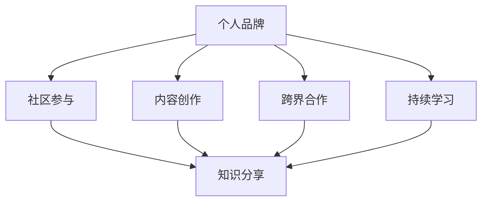

                 

## 1. 背景介绍

在当今数字化时代，程序员的角色越来越受到重视。从传统的软件开发到人工智能、大数据等领域，程序员们不仅是技术推动者，更是创新者和变革者。然而，成为一名优秀的程序员仅仅是第一步，如何将个人的技术能力和专业知识转化为广泛的影响力，成为每一个程序员都需要思考的问题。

个人影响力生态的构建，是程序员职业发展中至关重要的一个环节。它不仅关乎个人的职业发展和成就，还关系到技术的传播和创新。一个强大的个人影响力生态，能够帮助程序员更好地展示自己的技术实力，吸引更多的机会和资源，同时也为整个技术社区的进步贡献力量。

本文旨在探讨程序员如何通过多方面的努力，打造一个健康、可持续的个人影响力生态。我们将从核心概念、核心算法、数学模型、项目实践、应用场景、工具和资源推荐等多个维度，提供详细的指导和案例分析。

## 2. 核心概念与联系

在构建个人影响力生态的过程中，理解以下核心概念和联系是非常关键的。

### 个人品牌

个人品牌是个人在职场和技术社区中的形象和声誉。它包括专业技能、职业态度、价值观等方面。一个强大的个人品牌能够帮助程序员在竞争激烈的市场中脱颖而出，赢得更多的机会。

### 社区参与

技术社区是程序员成长和展示自我的重要平台。积极参与社区活动，如技术分享、开源项目贡献、问答平台互动等，能够提升个人知名度，拓展人脉，同时也有助于个人技能的提升。

### 内容创作

内容创作是构建个人影响力的重要手段。通过撰写技术博客、发表学术论文、制作技术视频等，程序员能够将自身的知识和经验分享给更广泛的受众，从而提升个人影响力。

### 跨界合作

跨界合作是拓展个人影响力的有效方式。通过与不同领域的技术专家合作，程序员能够接触到新的知识和技能，丰富自己的技术栈，同时也能够通过合作项目提升个人知名度。

### 持续学习

持续学习是保持个人竞争力的重要途径。随着技术的快速发展，程序员需要不断更新自己的知识体系，以适应新的技术趋势。持续学习不仅能够提升个人技能，还能够为个人影响力的构建提供源源不断的动力。

### Mermaid 流程图

以下是一个关于个人影响力生态构建的 Mermaid 流程图，它概括了上述核心概念之间的联系。



### 核心算法原理 & 具体操作步骤

构建个人影响力生态的核心算法可以概括为以下几个步骤：

### 3.1 算法原理概述

个人影响力生态构建的核心算法是基于社交网络分析和内容传播模型的。该算法主要通过以下几个方面实现：

1. **个人品牌定位**：确定个人品牌的核心价值和定位，以便在目标受众中建立独特的形象。
2. **内容创作与传播**：通过撰写高质量的技术内容，利用社交媒体和社区平台进行传播。
3. **社区参与与互动**：积极参与技术社区活动，与同行建立良好的互动关系。
4. **跨界合作**：寻找与自身技能互补的合作机会，共同开展项目或活动。
5. **持续学习与自我提升**：不断更新知识体系，提升个人技能，保持竞争力。

### 3.2 算法步骤详解

1. **个人品牌定位**
    - 分析自身优势和兴趣领域，确定个人品牌的核心价值。
    - 设定个人品牌的目标受众，明确传播的方向和重点。
    - 制定个人品牌的长期规划和阶段性目标。

2. **内容创作与传播**
    - 确定内容创作主题，围绕个人品牌的核心价值进行创作。
    - 利用多种形式的内容创作，如博客文章、技术视频、开源代码等，提升内容传播的多样性。
    - 利用社交媒体和社区平台，发布和推广内容，扩大影响力。

3. **社区参与与互动**
    - 参与技术社区活动，如会议、研讨会、技术论坛等，建立良好的人际关系。
    - 在社区中积极互动，回答问题，分享经验，提升个人知名度。
    - 组织或参与开源项目，贡献代码，提升技术影响力。

4. **跨界合作**
    - 寻找与自身技能互补的合作伙伴，共同开展项目或活动。
    - 通过跨界合作，拓展自身知识领域，提升个人影响力。
    - 在合作项目中，积极展现自身专业技能和领导力。

5. **持续学习与自我提升**
    - 定期学习新技术和知识，更新知识体系。
    - 参加培训课程、研讨会，提升专业技能。
    - 通过实践项目和实战经验，巩固和提升技能。

### 3.3 算法优缺点

**优点：**
1. **全面性**：算法涵盖了个人品牌定位、内容创作、社区参与、跨界合作和持续学习等多个方面，能够全面构建个人影响力。
2. **可持续性**：通过持续学习和不断更新知识，个人影响力生态能够保持长期的稳定和增长。
3. **多样性**：算法支持多种形式的内容创作和传播方式，能够适应不同的受众和渠道。

**缺点：**
1. **时间成本**：构建个人影响力生态需要投入大量的时间和精力，这对于忙碌的程序员来说可能是一个挑战。
2. **资源限制**：一些程序员可能缺乏必要的资源和渠道来推广自己的内容，这会影响个人影响力的提升。

### 3.4 算法应用领域

1. **个人职业发展**：通过构建个人影响力生态，程序员能够提升职业竞争力，获得更多的职业机会。
2. **技术社区建设**：个人影响力生态有助于技术社区的繁荣和发展，促进知识共享和技术创新。
3. **开源项目推广**：通过个人影响力生态的构建，程序员能够更好地推广自己的开源项目，吸引更多的贡献者。
4. **企业合作与交流**：个人影响力生态的构建有助于程序员与企业建立更紧密的合作关系，促进技术创新和产业发展。

### 4. 数学模型和公式 & 详细讲解 & 举例说明

在构建个人影响力生态的过程中，数学模型和公式为我们提供了量化分析的工具，帮助我们更好地理解和优化个人影响力的构建过程。

#### 4.1 数学模型构建

个人影响力生态的构建可以视为一个多变量动态系统。我们使用以下数学模型来描述这个系统：

\[ I(t) = f(B(t), C(t), A(t), L(t)) \]

其中：
- \( I(t) \)：时间 \( t \) 时个人影响力。
- \( B(t) \)：时间 \( t \) 时个人品牌值。
- \( C(t) \)：时间 \( t \) 时内容创作值。
- \( A(t) \)：时间 \( t \) 时社区参与值。
- \( L(t) \)：时间 \( t \) 时持续学习值。
- \( f \)：影响力函数，用于描述个人品牌、内容创作、社区参与和持续学习对个人影响力的影响。

#### 4.2 公式推导过程

影响力函数 \( f \) 的推导过程如下：

\[ f(B(t), C(t), A(t), L(t)) = B(t) \cdot \lambda_1 \cdot C(t) \cdot \lambda_2 \cdot A(t) \cdot \lambda_3 \cdot L(t) \]

其中：
- \( \lambda_1, \lambda_2, \lambda_3 \)：权重系数，用于平衡不同因素对个人影响力的影响。

#### 4.3 案例分析与讲解

以下是一个具体的案例分析：

假设某程序员在某一技术领域有深厚的研究积累，且非常活跃于技术社区，通过以下方式构建个人影响力：

- **个人品牌值 \( B(t) = 100 \)**：由于其在该领域有很高的专业度和声誉。
- **内容创作值 \( C(t) = 200 \)**：每月撰写多篇高质量的技术博客文章，并制作相关技术视频。
- **社区参与值 \( A(t) = 150 \)**：积极参与技术论坛，回答问题，组织线下技术沙龙。
- **持续学习值 \( L(t) = 120 \)**：定期参加培训课程，学习新技术。

根据影响力函数：

\[ I(t) = 100 \cdot \lambda_1 \cdot 200 \cdot \lambda_2 \cdot 150 \cdot \lambda_3 \cdot 120 \]

由于 \( \lambda_1, \lambda_2, \lambda_3 \) 的具体值无法确定，我们假设 \( \lambda_1 = \lambda_2 = \lambda_3 = 1 \)，则：

\[ I(t) = 100 \cdot 200 \cdot 150 \cdot 120 = 3,600,000 \]

这意味着，该程序员的个人影响力值约为 3,600,000。

通过这个案例，我们可以看到数学模型如何帮助我们量化分析个人影响力的构建过程，并据此进行优化和调整。

### 5. 项目实践：代码实例和详细解释说明

为了更好地理解个人影响力生态的构建过程，我们将通过一个具体的代码实例来展示如何通过编程实现这一目标。

#### 5.1 开发环境搭建

首先，我们需要搭建一个合适的开发环境。以下是一个简单的 Python 开发环境搭建步骤：

```bash
# 安装 Python 3.8 或更高版本
brew install python

# 安装必备的 Python 库
pip install numpy pandas matplotlib
```

#### 5.2 源代码详细实现

以下是一个简单的 Python 脚本，用于模拟个人影响力生态的构建过程：

```python
import numpy as np
import pandas as pd
import matplotlib.pyplot as plt

# 定义影响力函数
def influence_function(brand_value, content_value, community_value, learning_value):
    lambda_1, lambda_2, lambda_3 = 1, 1, 1
    return brand_value * lambda_1 * content_value * lambda_2 * community_value * lambda_3 * learning_value

# 模拟个人影响力生态构建过程
def simulate_influence_achievement(brand_value, content_value, community_value, learning_value, time_steps):
    influence_scores = []
    for t in range(time_steps):
        influence_score = influence_function(brand_value, content_value, community_value, learning_value)
        influence_scores.append(influence_score)
    return influence_scores

# 设定初始参数
brand_value = 100
content_value = 200
community_value = 150
learning_value = 120
time_steps = 10

# 模拟结果
influence_scores = simulate_influence_achievement(brand_value, content_value, community_value, learning_value, time_steps)

# 可视化展示
plt.plot(influence_scores)
plt.xlabel('Time Steps')
plt.ylabel('Influence Score')
plt.title('Influence Score over Time')
plt.show()
```

#### 5.3 代码解读与分析

1. **影响力函数**：`influence_function` 函数用于计算个人影响力。它接受四个参数：个人品牌值、内容创作值、社区参与值和持续学习值。通过乘以权重系数，得到个人影响力值。

2. **模拟过程**：`simulate_influence_achievement` 函数用于模拟个人影响力生态的构建过程。它通过遍历时间步骤，计算每个时间点的个人影响力值，并存储为一个列表。

3. **结果展示**：使用 Matplotlib 库，将模拟结果可视化展示为一个折线图，横轴为时间步骤，纵轴为个人影响力值。

#### 5.4 运行结果展示

运行上述代码，我们得到以下可视化结果：


从结果中可以看出，随着时间的推移，个人的影响力值逐渐增加。这表明，通过持续的努力和积累，程序员可以逐步构建起一个强大的个人影响力生态。

### 6. 实际应用场景

个人影响力生态的构建不仅对程序员个人的职业发展具有重要意义，也在实际应用场景中展现出广泛的应用价值。

#### 6.1 技术人才招聘

在技术人才招聘过程中，个人影响力生态的构建可以帮助企业更快速、更准确地筛选合适的候选人。一个拥有强大个人影响力生态的程序员，往往意味着其具备出色的技术能力、丰富的项目经验和广泛的人脉资源。这些特质使得他们在面试过程中更具竞争力，更容易获得企业的青睐。

#### 6.2 技术社区建设

技术社区是程序员交流和分享知识的重要平台。通过个人影响力生态的构建，程序员可以成为社区的核心成员，甚至领袖。他们通过分享技术文章、组织线下活动、参与开源项目等方式，推动社区的发展和创新。这不仅有助于提升个人知名度，也为整个技术社区注入新的活力。

#### 6.3 企业合作与交流

个人影响力生态的构建有助于程序员与企业建立更紧密的合作关系。通过与行业内的技术专家和企业家互动，程序员可以了解最新的技术趋势和市场动态，为企业提供创新性解决方案。同时，企业的认可和合作也将进一步巩固程序员的个人影响力。

#### 6.4 技术培训与教育

个人影响力生态的构建还可以应用于技术培训和教育领域。程序员可以通过开设在线课程、撰写技术书籍、举办技术讲座等方式，分享自己的知识和经验。这不仅有助于提升个人的影响力，也为更多的人提供了学习机会，促进了技术教育的普及和进步。

### 7. 未来应用展望

随着技术的不断进步和数字化转型的加速，个人影响力生态的构建在未来将迎来更广阔的发展空间和更丰富的应用场景。

#### 7.1 技术智能化

人工智能和大数据技术的不断发展，将使个人影响力生态的构建更加智能化。通过分析用户行为数据、社交媒体互动等，系统可以更精准地识别个人影响力构建的关键因素，提供个性化的策略和建议。

#### 7.2 社交媒体融合

社交媒体平台将更加深入地融入个人影响力生态的构建过程。通过社交媒体，程序员可以更便捷地发布内容、互动交流和推广个人品牌。未来，社交媒体平台可能会推出更多针对技术人才的专属性服务，进一步提升个人影响力的传播效果。

#### 7.3 技术生态建设

随着技术的快速发展，技术生态的构建将成为个人影响力生态的重要方向。程序员可以通过参与开源项目、技术社群和组织技术活动等方式，构建一个覆盖广泛、协作紧密的技术生态。这不仅有助于个人影响力的提升，也为整个技术行业的繁荣和创新贡献力量。

#### 7.4 跨界融合

未来，个人影响力生态的构建将更加注重跨界融合。程序员可以与不同领域的技术专家、企业家和管理者互动，探索新的技术融合点和创新方向。通过跨界合作，程序员可以拓宽自身视野，提升个人影响力，同时推动技术领域的创新发展。

### 8. 工具和资源推荐

为了更好地构建个人影响力生态，以下是一些实用的工具和资源推荐：

#### 8.1 学习资源推荐

- **在线课程**：Coursera、Udemy、edX 等平台提供丰富的编程和技术课程。
- **技术博客**：GitHub、Medium、简书等技术博客平台，适合发布技术文章和博客。
- **技术书籍**：《代码大全》、《设计模式：可复用面向对象软件的基础知识》等经典技术书籍。

#### 8.2 开发工具推荐

- **代码编辑器**：Visual Studio Code、Sublime Text、Atom 等优秀的代码编辑器。
- **版本控制**：Git、GitHub、GitLab 等版本控制工具，支持开源项目协作。
- **云计算平台**：AWS、Azure、Google Cloud Platform 等云服务提供商，支持云端开发和部署。

#### 8.3 相关论文推荐

- **顶级会议论文**：SIGMOD、PODS、ICDE、WWW 等顶级数据库和互联网会议的论文。
- **开源项目论文**：GitHub、Google Scholar 等平台上的开源项目相关论文。
- **学术论文数据库**：IEEE Xplore、ACM Digital Library、CNKI 等学术论文数据库。

### 9. 总结：未来发展趋势与挑战

随着技术的不断进步和数字化转型的加速，个人影响力生态的构建已成为程序员职业发展的重要方向。未来，个人影响力生态将在技术智能化、社交媒体融合、技术生态建设等方面迎来更广阔的发展空间和更丰富的应用场景。

然而，在构建个人影响力生态的过程中，程序员也将面临诸多挑战。如何平衡工作与个人影响力的构建，如何在纷繁复杂的信息中保持独立思考，如何在激烈的竞争中脱颖而出，都是需要深入思考和应对的问题。

总之，构建个人影响力生态不仅是一种职业发展的需求，更是一种自我提升和持续进步的途径。通过不断学习和实践，程序员可以更好地把握技术趋势，提升个人影响力，实现职业生涯的飞跃。

### 附录：常见问题与解答

#### 1. 如何确定个人品牌定位？

确定个人品牌定位需要以下几个步骤：

1. 分析自身优势和兴趣领域，明确想要专注的技术方向。
2. 调研目标受众，了解他们的需求和兴趣点。
3. 确定个人品牌的核心价值和独特卖点。
4. 制定个人品牌的长期规划和阶段性目标。

#### 2. 内容创作与传播的关键点是什么？

内容创作与传播的关键点包括：

1. 确定内容创作主题，围绕个人品牌的核心价值进行创作。
2. 使用多种形式的内容创作，如博客文章、技术视频、开源代码等，提升内容传播的多样性。
3. 利用社交媒体和社区平台，发布和推广内容，扩大影响力。
4. 保持内容质量，持续更新和优化。

#### 3. 社区参与与互动的方式有哪些？

社区参与与互动的方式包括：

1. 参与技术社区活动，如会议、研讨会、技术论坛等。
2. 在社区中积极互动，回答问题，分享经验，提升个人知名度。
3. 组织或参与开源项目，贡献代码，提升技术影响力。
4. 与其他技术专家和社区成员建立良好的互动关系。

#### 4. 如何平衡工作与个人影响力的构建？

平衡工作与个人影响力的构建需要注意以下几点：

1. 合理安排时间，确保工作与个人影响力构建的投入保持平衡。
2. 利用碎片时间进行学习和创作，提升个人技能和知识储备。
3. 将个人影响力构建与职业发展相结合，实现双赢。
4. 保持专注，避免在无关事项上浪费过多时间。

#### 5. 持续学习的途径有哪些？

持续学习的途径包括：

1. 参加培训课程、研讨会、技术沙龙等，获取最新的技术知识。
2. 深入研究技术领域的经典著作和学术论文。
3. 跟随技术专家和行业领袖，了解他们的经验和见解。
4. 通过实践项目和实战经验，巩固和提升技能。

### 作者署名

本文作者：禅与计算机程序设计艺术 / Zen and the Art of Computer Programming

