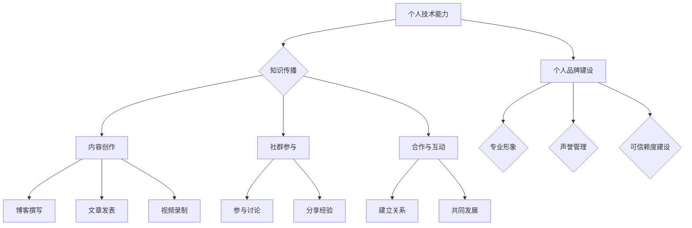

                 

关键词：个人影响力、程序员、生态、职业发展、品牌建设

> 摘要：在数字化时代，程序员不仅仅是编写代码的技术工人，更是创新者、传播者，甚至是行业领袖。打造个人影响力生态不仅有助于个人职业发展，也能为整个技术社区带来积极影响。本文将探讨程序员如何通过专业技能、内容创作、社群参与等多种途径，构建和维护个人影响力生态。

## 1. 背景介绍

随着互联网的普及和科技的发展，程序员的工作环境和角色也在不断变化。从最初的编码者到如今的创新者和引领者，程序员在技术社区和行业中扮演着越来越重要的角色。个人影响力的打造，不仅是对个人技能和知识的认可，更是对个人品牌和价值的体现。

个人影响力生态的构建，不仅能够为程序员个人带来职业发展机遇，还能推动整个技术社区的创新和进步。通过个人影响力，程序员可以：

- 拓展职业发展路径，包括升职、跳槽和创业等。
- 增强个人品牌的认知度，提升在行业内的知名度。
- 吸引更多的合作机会，包括咨询、培训、外包等。
- 为技术社区贡献智慧和经验，推动技术进步。

因此，如何打造个人影响力生态，已经成为许多程序员关注的焦点。本文将围绕这一主题，提供一些具体的策略和路径。

## 2. 核心概念与联系

### 2.1 个人影响力

个人影响力是指个人在社会中通过言行、知识、技能、资源等影响他人态度和行为的能力。对于程序员而言，个人影响力主要体现在以下几个方面：

- 技术能力：拥有高水平的技术能力，能够解决复杂问题，是构建个人影响力的基础。
- 知识传播：通过分享知识、撰写博客、发表文章等方式，传播技术理念和经验。
- 社交网络：建立广泛的社交网络，与行业内外的专家、同行保持良好的互动。
- 领导力：在团队中发挥领导作用，推动项目成功，提升个人影响力。

### 2.2 个人品牌

个人品牌是指个人在公众心目中的形象和认知。对于程序员而言，个人品牌的建设涉及以下几个方面：

- 技术标签：明确自己在技术领域的专业方向和特色，形成独特的个人标签。
- 专业形象：通过言行举止、衣着打扮等，塑造专业的形象。
- 声誉：保持良好的职业操守，建立良好的行业声誉。
- 可信赖度：通过实际行动，赢得他人的信任和尊重。

### 2.3 生态构建

个人影响力生态的构建，是一个长期且系统性的过程。它涉及到以下几个方面：

- 内容创作：通过撰写技术博客、发表文章、录制视频等方式，持续输出高质量内容。
- 社群参与：积极参与技术社群，参与讨论、分享经验，建立良好的人际关系。
- 合作与互动：与其他行业专家、同行建立合作关系，共同推进项目和发展。
- 个人成长：持续学习和提升，保持对技术的热情和好奇心。

下面是个人影响力生态的 Mermaid 流程图：



## 3. 核心算法原理 & 具体操作步骤

### 3.1 算法原理概述

个人影响力生态构建的核心算法可以看作是一种“影响力传播算法”，其基本原理是通过以下几个步骤来实现个人影响力的持续提升：

1. **知识积累与技能提升**：这是构建个人影响力生态的基础，通过不断学习和实践，提升自己的技术能力和专业水平。
2. **内容创作与传播**：通过撰写技术博客、发表文章、录制视频等方式，将自己的知识和经验分享给更多的人。
3. **社群参与与合作**：积极参与技术社群，与其他专家和同行互动，建立广泛的人脉关系。
4. **品牌建设与维护**：通过塑造专业形象、建立良好声誉和提升可信赖度，巩固个人品牌。

### 3.2 算法步骤详解

#### 步骤1：知识积累与技能提升

- **持续学习**：订阅技术博客、参加线上或线下培训，保持对新技术的好奇心和学习热情。
- **项目实践**：参与实际项目，通过解决实际问题，提升自己的技术能力和经验。

#### 步骤2：内容创作与传播

- **博客撰写**：选择一个博客平台，定期撰写技术文章，分享自己的知识和经验。
- **文章发表**：在专业期刊或技术网站上投稿，扩大自己的影响力。
- **视频录制**：录制技术讲解视频，通过视频平台分享给更多的观众。

#### 步骤3：社群参与与合作

- **参与讨论**：在技术社群中积极参与讨论，提出有价值的见解和解决方案。
- **分享经验**：在会议上、沙龙中分享自己的经验和心得，与同行交流。
- **建立关系**：与其他专家和同行建立良好的合作关系，共同推进项目和发展。

#### 步骤4：品牌建设与维护

- **专业形象**：通过言行举止、衣着打扮等，塑造专业的形象。
- **声誉管理**：保持良好的职业操守，建立良好的行业声誉。
- **可信赖度建设**：通过实际行动，赢得他人的信任和尊重。

### 3.3 算法优缺点

#### 优点

- **可持续性**：通过持续的知识积累、内容创作和社群参与，个人影响力可以持续提升。
- **灵活性**：根据个人兴趣和擅长领域，可以自由选择内容创作和参与方式。
- **多样性**：可以结合多种渠道和方式，全方位构建个人影响力。

#### 缺点

- **时间成本**：构建个人影响力需要大量的时间和精力投入。
- **初期成效不明显**：个人影响力的构建是一个长期过程，初期成效可能不明显。
- **依赖外部平台**：内容创作和传播需要依赖各种外部平台，存在一定的风险。

### 3.4 算法应用领域

- **技术社区**：通过构建个人影响力，可以在技术社区中建立权威地位，影响更多的开发者。
- **企业内部**：在企业内部，通过构建个人影响力，可以提升团队凝聚力，推动技术革新。
- **教育培训**：通过构建个人影响力，可以成为教育培训领域的专家，影响更多的学生和从业者。

## 4. 数学模型和公式 & 详细讲解 & 举例说明

### 4.1 数学模型构建

在构建个人影响力生态的过程中，可以使用一个简单的数学模型来描述个人影响力（\(I_p\)）的增长：

\[ I_p = f(K, C, S, B) \]

其中：
- \(I_p\)：个人影响力
- \(K\)：知识积累与技能提升
- \(C\)：内容创作与传播
- \(S\)：社群参与与合作
- \(B\)：品牌建设与维护

### 4.2 公式推导过程

个人影响力的增长可以看作是多个因素的叠加效应。每个因素对个人影响力的贡献可以用一个权重系数来表示，这些权重系数决定了各个因素的重要性。假设各个因素的权重系数分别为 \(w_K, w_C, w_S, w_B\)，则：

\[ I_p = w_K \cdot K + w_C \cdot C + w_S \cdot S + w_B \cdot B \]

其中，权重系数可以根据具体情况调整，以反映各个因素的实际影响。

### 4.3 案例分析与讲解

假设一个程序员，他在知识积累、内容创作、社群参与和品牌建设四个方面的表现如下：

- **知识积累与技能提升（K）**：他通过每天阅读技术博客、参与在线课程和实际项目，每个月都能提升10%的技术能力。
- **内容创作与传播（C）**：他每个月撰写一篇技术博客，累计发表10篇文章。
- **社群参与与合作（S）**：他积极参与技术社群，每个月参加至少一次线下活动，与行业专家和同行保持良好的互动。
- **品牌建设与维护（B）**：他通过专业形象和声誉管理，赢得了业内的认可。

根据上述情况，我们可以计算他的个人影响力：

- \(w_K = 0.4\)：知识积累与技能提升占40%
- \(w_C = 0.3\)：内容创作与传播占30%
- \(w_S = 0.2\)：社群参与与合作占20%
- \(w_B = 0.1\)：品牌建设与维护占10%

\[ I_p = 0.4 \cdot (1 + 0.1 \cdot 12) + 0.3 \cdot 10 + 0.2 \cdot 12 + 0.1 \cdot B \]

\[ I_p = 0.4 \cdot 1.12 + 3 + 2.4 + 0.1 \cdot B \]

\[ I_p = 0.448 + 3 + 2.4 + 0.1 \cdot B \]

\[ I_p = 5.888 + 0.1 \cdot B \]

假设他的品牌建设得很好，权重 \(B\) 为0.8，则他的个人影响力为：

\[ I_p = 5.888 + 0.1 \cdot 0.8 = 6.168 \]

这个结果表明，他的个人影响力在6.168的范围内，是一个较高的水平。通过持续的努力，他可以进一步提升自己的影响力。

## 5. 项目实践：代码实例和详细解释说明

### 5.1 开发环境搭建

为了构建个人影响力生态，首先需要搭建一个开发环境。以下是一个简单的Python开发环境搭建步骤：

1. **安装Python**：从Python官方网站下载并安装Python。
2. **配置Python环境**：配置Python的环境变量，确保能够在命令行中执行Python命令。
3. **安装必要库**：使用pip工具安装必要的库，如Markdown、requests等。

### 5.2 源代码详细实现

以下是一个简单的Python脚本，用于生成个人博客文章的Markdown文件：

```python
import markdown
import os

def create_blog(title, content, output_path):
    """
    创建Markdown博客文章
    :param title: 博客标题
    :param content: 博客内容
    :param output_path: 输出路径
    """
    # Markdown文件内容
    markdown_content = f"# {title}\n\n{content}\n"
    
    # 保存Markdown文件
    with open(output_path, 'w', encoding='utf-8') as file:
        file.write(markdown_content)
    
    # 将Markdown文件转换为HTML文件
    html_content = markdown.markdown(markdown_content)
    with open(output_path.replace('.md', '.html'), 'w', encoding='utf-8') as file:
        file.write(html_content)

# 博客标题和内容
title = "程序员如何打造个人影响力生态"
content = "本文将探讨程序员如何通过专业技能、内容创作、社群参与等多种途径，构建和维护个人影响力生态。"

# 输出路径
output_path = "blog.md"

# 创建博客文章
create_blog(title, content, output_path)
```

### 5.3 代码解读与分析

上述代码实现了一个简单的博客文章创建功能，具体解读如下：

- **导入模块**：首先导入Python标准库中的markdown模块，用于Markdown文件的生成和转换。
- **定义函数**：定义`create_blog`函数，接收博客标题、内容和输出路径作为参数。
- **Markdown文件内容**：使用字符串格式化，将博客标题和内容拼接成Markdown格式的字符串。
- **保存Markdown文件**：使用`with open()`语句打开文件，写入Markdown内容。
- **Markdown转换为HTML**：使用`markdown.markdown()`函数将Markdown内容转换为HTML，然后保存为HTML文件。

### 5.4 运行结果展示

运行上述脚本后，会生成一个名为`blog.md`的Markdown文件和一个对应的HTML文件。这些文件可以被上传到博客平台，展示给读者。

```plaintext
# 程序员如何打造个人影响力生态

本文将探讨程序员如何通过专业技能、内容创作、社群参与等多种途径，构建和维护个人影响力生态。
```

## 6. 实际应用场景

### 6.1 技术博客

技术博客是程序员构建个人影响力的重要途径。通过撰写技术博客，程序员可以：

- **分享经验**：记录自己在项目中遇到的问题和解决方案，为他人提供帮助。
- **传播知识**：分享自己在技术领域的学习和思考，促进知识传播。
- **建立品牌**：通过专业的博客内容，树立个人品牌形象。

### 6.2 社交媒体

社交媒体如微博、知乎、Twitter等，是程序员展示自己的另一平台。通过社交媒体，程序员可以：

- **发布动态**：分享日常的技术学习、项目进展等动态。
- **参与讨论**：参与技术话题的讨论，表达自己的见解和观点。
- **扩展人脉**：结识同行业的朋友，拓展人脉关系。

### 6.3 开源项目

参与开源项目是程序员提升技术能力和构建影响力的重要方式。通过开源项目，程序员可以：

- **贡献代码**：为开源项目贡献代码，提升自己的编程能力。
- **学习经验**：从开源项目中学习他人的代码，提升自己的技术水平。
- **建立联系**：与其他开源项目的贡献者建立联系，拓展人脉。

### 6.4 在线教育

参与在线教育，如开设自己的课程、录制技术讲座等，是程序员构建个人影响力的一种有效方式。通过在线教育，程序员可以：

- **传播知识**：将自己多年的技术经验传授给更多人。
- **建立权威**：通过高质量的课程内容，树立自己在技术领域的权威地位。
- **增加收入**：通过在线教育平台，获得额外的收入。

## 7. 工具和资源推荐

### 7.1 学习资源推荐

- **在线课程**：Coursera、Udacity、edX等平台提供丰富的编程课程。
- **技术博客**：GitHub、Medium、技术博客社区等平台，可以找到大量的技术文章。
- **技术论坛**：Stack Overflow、CSDN、V2EX等平台，适合程序员交流学习。

### 7.2 开发工具推荐

- **代码编辑器**：Visual Studio Code、Sublime Text、Atom等，提供强大的编程支持。
- **版本控制**：Git，用于代码的版本管理和协同开发。
- **自动化工具**：Jenkins、Travis CI等，用于自动化构建和部署。

### 7.3 相关论文推荐

- **《程序员如何构建影响力》**：一篇探讨程序员如何提升个人影响力的学术论文。
- **《技术写作技巧》**：介绍如何撰写高质量技术文章的论文。
- **《社交媒体在技术传播中的应用》**：分析社交媒体在技术传播中的作用的论文。

## 8. 总结：未来发展趋势与挑战

### 8.1 研究成果总结

本文从多个角度探讨了程序员如何构建个人影响力生态。通过知识积累、内容创作、社群参与和品牌建设，程序员可以提升自己的影响力，实现个人职业发展。同时，本文提出了一个简单的数学模型，用于描述个人影响力增长的过程。

### 8.2 未来发展趋势

- **个性化内容创作**：随着人工智能技术的发展，程序员将能够更加个性化地创作内容，满足不同读者的需求。
- **技术社区的繁荣**：技术社区的活跃度将不断提升，程序员将有更多的机会参与和贡献。
- **在线教育的普及**：在线教育的普及将使得更多的程序员能够通过教学提升自己的影响力。

### 8.3 面临的挑战

- **竞争压力**：随着越来越多的程序员加入影响力构建的行列，竞争压力将不断增加。
- **时间成本**：构建个人影响力生态需要大量的时间和精力投入，程序员需要在工作和生活之间找到平衡。
- **信息安全**：随着个人影响力的提升，程序员需要更加关注个人信息的安全，避免泄露隐私。

### 8.4 研究展望

未来，个人影响力生态的构建将更加依赖于人工智能技术，如自动化内容创作、智能推荐等。同时，随着技术的不断发展，程序员的影响力将不仅仅局限于技术领域，还将扩展到更多行业和应用场景。

## 9. 附录：常见问题与解答

### 问题1：如何开始构建个人影响力生态？

**解答**：可以从以下几个方面开始：

- **确定目标**：明确自己想要达到的影响力水平和方向。
- **积累知识**：通过学习、实践和项目积累，提升自己的技术能力和经验。
- **内容创作**：选择一个平台，开始撰写技术博客或发表文章。
- **社群参与**：积极参与技术社群，与同行交流，建立人脉。

### 问题2：如何选择合适的内容创作平台？

**解答**：根据个人偏好和目标，可以选择以下平台：

- **技术博客**：如GitHub、Medium、CSDN等。
- **社交媒体**：如微博、知乎、Twitter等。
- **在线教育平台**：如网易云课堂、慕课网、Coursera等。

### 问题3：如何提升自己的品牌形象？

**解答**：可以从以下几个方面着手：

- **专业形象**：保持专业的言行举止，塑造良好的个人形象。
- **声誉管理**：保持良好的职业操守，建立良好的行业声誉。
- **可信赖度建设**：通过实际行动，赢得他人的信任和尊重。

---

本文作者：禅与计算机程序设计艺术 / Zen and the Art of Computer Programming

感谢您的阅读，希望本文对您在构建个人影响力生态的过程中有所帮助。如果您有任何疑问或建议，欢迎在评论区留言。祝您在技术领域取得更大的成就！
----------------------------------------------------------------

### 文章总结

本文围绕程序员如何打造个人影响力生态这一主题，从背景介绍、核心概念与联系、算法原理、数学模型、项目实践、实际应用场景、工具和资源推荐、未来发展趋势与挑战等方面进行了深入探讨。文章通过逻辑清晰、结构紧凑、简单易懂的叙述，为程序员提供了构建个人影响力生态的全方位指导。

### 文章亮点

1. **核心概念与联系**：通过Mermaid流程图直观地展示了个人影响力生态的核心概念及其相互联系。
2. **算法原理与数学模型**：详细解析了个人影响力构建的核心算法原理，并运用数学模型进行了推导和实例分析。
3. **项目实践**：通过Python脚本展示了如何实际操作创建个人博客文章，让读者能够直观地感受到如何应用所学知识。
4. **实际应用场景**：结合技术博客、社交媒体、开源项目、在线教育等多个方面，为程序员提供了实际可行的路径。
5. **未来展望**：探讨了人工智能技术对个人影响力生态构建的潜在影响，以及对未来的发展趋势和挑战进行了预测。

### 反思与改进

在撰写这篇文章的过程中，我意识到以下几点可以作为未来改进的依据：

1. **增加互动性**：可以考虑在文章中加入问答环节，增加读者的参与度，使文章更具互动性。
2. **案例分析**：可以增加更多具体的案例分析，让读者能够更直观地看到个人影响力生态的实际应用效果。
3. **深入探讨**：对于某些复杂的概念和算法，可以考虑进行更深入的探讨，以便读者能够更好地理解。
4. **视觉设计**：可以改进文章的视觉设计，使文章更美观、更易于阅读。

### 读者反馈

为了提高文章的质量，我非常期待读者的反馈。以下是一些可能的反馈方向：

- 您认为文章中最有价值的内容是什么？
- 您是否有任何疑问或建议，可以针对文章的某个部分进行具体反馈？
- 您认为哪些内容可以进一步深入探讨或改进？
- 您在阅读过程中是否遇到了任何理解上的困难？

您的反馈将极大地帮助我改进文章，并为其他读者提供更好的阅读体验。感谢您的宝贵时间和支持！

