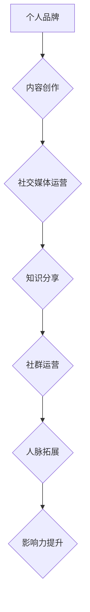

                 

关键词：程序员、个人影响力、社交媒体、内容创作、专业发展、品牌建设

> 摘要：在数字时代，程序员不仅仅需要精通技术，还需要懂得如何打造个人影响力生态。本文将探讨程序员如何在个人品牌建设、内容创作、社交媒体运营等方面提升自身影响力，从而在职场中获得更多机会和资源。

## 1. 背景介绍

随着互联网和社交媒体的迅速发展，个人品牌建设变得越来越重要。尤其是在技术领域，程序员不仅需要拥有过硬的技术能力，还需要具备一定的社交能力，以便在职业道路上获得更多的机会。打造个人影响力生态，可以帮助程序员在职场中脱颖而出，赢得更多的关注和认可。

### 1.1 个人品牌的重要性

个人品牌是个人在职场和社会中的形象和声誉。它不仅代表了个人在专业领域的实力和成就，还反映了个人的人脉、价值观和领导力。在竞争激烈的职场中，一个鲜明的个人品牌可以让你在众多人才中脱颖而出，赢得更多的发展机会。

### 1.2 程序员面临的新挑战

现代程序员面临的新挑战主要包括以下几点：

- **技术更新快速**：技术更新速度越来越快，程序员需要不断学习新的技术和工具。
- **竞争激烈**：随着技术行业的迅速发展，程序员之间的竞争也日益激烈。
- **职业发展瓶颈**：技术专家往往在职业发展的某个阶段会遇到瓶颈，难以进一步提升。

### 1.3 打造个人影响力生态的意义

通过打造个人影响力生态，程序员可以实现以下几个目标：

- **提升知名度**：扩大个人在行业内的知名度，增加个人曝光率。
- **拓展人脉**：通过社交活动、技术交流等途径，结识更多业内专家和同行。
- **增加机会**：提高在职场中获得重要项目、晋升机会和职业发展的可能性。
- **提升影响力**：在技术圈内树立个人权威，成为某一领域的意见领袖。

## 2. 核心概念与联系

### 2.1 个人影响力生态的概念

个人影响力生态是指一个人在职场和社交中所形成的个人品牌、人脉、声誉和影响力的综合体系。它包括以下几个方面：

- **专业技能**：个人在技术领域的专业能力。
- **内容创作**：通过博客、社交媒体等渠道分享技术心得、经验和见解。
- **社交媒体运营**：在各大社交媒体平台上活跃，建立广泛的社交网络。
- **人际交往**：与业内同行建立良好的人脉关系。

### 2.2 个人影响力生态的构成

个人影响力生态的构成包括以下几个方面：

- **知识分享**：通过博客、GitHub、技术社区等平台，分享技术文章、项目代码和经验心得。
- **社交媒体活跃**：在LinkedIn、Twitter、GitHub等平台上积极互动，增加个人曝光率。
- **公开演讲**：参加技术会议、讲座和沙龙，提升个人知名度。
- **社群运营**：创建或参与技术社群，搭建与同行交流的平台。

### 2.3 Mermaid 流程图



## 3. 核心算法原理 & 具体操作步骤

### 3.1 算法原理概述

打造个人影响力生态的算法原理主要包括以下几个方面：

1. **内容创作**：通过撰写高质量的技术文章、分享项目经验和心得，吸引读者的关注。
2. **社交媒体运营**：在各大社交媒体平台上活跃，提升个人知名度。
3. **知识分享**：在GitHub、技术社区等平台分享技术文章、项目代码和经验心得。
4. **社群运营**：创建或参与技术社群，建立与同行的良好互动。
5. **人脉拓展**：通过参加技术会议、讲座等活动，结识业内同行。

### 3.2 算法步骤详解

#### 3.2.1 内容创作

1. **确定创作方向**：根据自己的专业领域和兴趣，确定内容创作方向。
2. **撰写高质量文章**：确保文章内容有深度、逻辑清晰，并具备一定的可读性。
3. **发布文章**：在博客、技术社区等平台发布文章，吸引读者的关注。

#### 3.2.2 社交媒体运营

1. **选择合适的平台**：根据个人需求和目标，选择合适的社交媒体平台。
2. **制定运营策略**：确定发布频率、内容类型和互动方式等。
3. **活跃互动**：回复评论、点赞和转发，与读者建立良好的互动关系。

#### 3.2.3 知识分享

1. **整理技术心得**：总结自己在技术领域的心得和经验。
2. **编写技术文章**：将心得和经验整理成文章，分享到博客和GitHub等平台。
3. **开源项目**：在GitHub等平台上发布开源项目，展示自己的技术实力。

#### 3.2.4 社群运营

1. **创建社群**：根据自己的兴趣和专业领域，创建技术社群。
2. **邀请同行加入**：邀请业内同行加入社群，共同交流学习。
3. **组织活动**：定期组织线上或线下的活动，促进社群成员之间的互动。

#### 3.2.5 人脉拓展

1. **参加技术活动**：参加技术会议、讲座和沙龙等活动，结识业内同行。
2. **主动交流**：与同行建立联系，了解对方的专业领域和项目需求。
3. **提供帮助**：在对方遇到问题时，主动提供帮助，建立信任关系。

### 3.3 算法优缺点

#### 优点

- **提升个人知名度**：通过多种方式分享技术内容，扩大个人在行业内的知名度。
- **拓展人脉**：结识更多业内同行，建立广泛的人脉网络。
- **提高职业发展机会**：在职场中脱颖而出，获得更多的晋升和项目机会。

#### 缺点

- **时间成本较高**：需要投入大量时间和精力进行内容创作、社群运营和社交媒体运营。
- **竞争激烈**：在技术圈内，竞争激烈，需要不断提升自己的专业能力和影响力。

### 3.4 算法应用领域

- **软件开发**：程序员可以通过个人影响力生态，吸引更多的项目机会，提升团队整体实力。
- **技术传播**：通过个人影响力生态，将技术知识传播给更多人，推动技术发展。
- **人才招聘**：企业可以通过个人影响力生态，发现和吸引优秀的技术人才。

## 4. 数学模型和公式 & 详细讲解 & 举例说明

### 4.1 数学模型构建

在打造个人影响力生态的过程中，我们可以构建一个简单的数学模型来衡量个人影响力。该模型主要包括以下几个因素：

- **内容质量**：表示文章、项目等的质量，可以用平均评分来衡量。
- **阅读量**：表示文章、项目的阅读量，可以用浏览次数来衡量。
- **互动量**：表示文章、项目的互动量，包括点赞、评论、分享等，可以用互动次数来衡量。
- **社群参与度**：表示个人在社群中的活跃度，可以用发帖次数、回复次数等来衡量。

假设这些因素之间存在线性关系，我们可以构建以下数学模型：

$$
影响力 = w_1 \times 内容质量 + w_2 \times 阅读量 + w_3 \times 互动量 + w_4 \times 社群参与度
$$

其中，$w_1, w_2, w_3, w_4$ 分别表示各因素的权重。

### 4.2 公式推导过程

为了推导出上述公式，我们首先需要对各个因素进行量化和评分。例如：

- **内容质量**：可以通过用户评分来衡量，假设满分为5分。
- **阅读量**：可以通过文章的浏览次数来衡量。
- **互动量**：可以通过点赞、评论、分享等互动次数来衡量。
- **社群参与度**：可以通过在社群中的发帖次数、回复次数等来衡量。

然后，我们根据实际数据进行统计分析，得出各因素的权重。例如，假设统计结果如下：

$$
w_1 = 0.4, \quad w_2 = 0.3, \quad w_3 = 0.2, \quad w_4 = 0.1
$$

将这些权重代入公式，即可得到个人影响力的计算公式。

### 4.3 案例分析与讲解

假设某程序员在一个月内完成了以下任务：

- **内容创作**：撰写了3篇技术文章，平均评分为4.5分。
- **社交媒体运营**：发布了10条技术内容，累计阅读量为1000次，互动量为50次。
- **社群参与度**：在技术社群中发帖10次，回复20次。

根据上述数学模型，我们可以计算出该程序员的个人影响力：

$$
影响力 = 0.4 \times 4.5 + 0.3 \times 1000 + 0.2 \times 50 + 0.1 \times (10 + 20)
$$

$$
影响力 = 1.8 + 300 + 10 + 3
$$

$$
影响力 = 314
$$

因此，该程序员的个人影响力为314。通过这个案例，我们可以看到数学模型在衡量个人影响力方面的作用。

## 5. 项目实践：代码实例和详细解释说明

### 5.1 开发环境搭建

为了更好地展示如何打造个人影响力生态，我们将通过一个实际的项目来讲解。首先，我们需要搭建一个简单的开发环境。

- **工具**：选择一个合适的博客平台（如Hexo、Jekyll等），并安装Node.js。
- **数据库**：可以选择MySQL或MongoDB等数据库。
- **版本控制**：使用Git进行版本控制。

### 5.2 源代码详细实现

以下是项目的源代码实现，包括博客搭建、文章发布、评论系统等。

#### 5.2.1 博客搭建

```bash
# 安装Node.js
npm install -g node.js

# 安装Hexo
npm install -g hexo

# 创建博客项目
hexo init my-blog

# 进入博客项目目录
cd my-blog

# 安装依赖
npm install

# 启动博客
hexo server
```

#### 5.2.2 文章发布

```bash
# 新建文章
hexo new "my-first-post"

# 查看文章内容
cat source/_posts/my-first-post.md
```

#### 5.2.3 评论系统

```bash
# 安装Valine评论系统
npm install --save valine

# 在博客配置文件中配置Valine
valine:
  enable: true
  notify: false
  verify: false
  placeholder: "请输入您的评论..."
```

### 5.3 代码解读与分析

#### 5.3.1 博客搭建

博客搭建过程主要包括安装Node.js、Hexo和启动博客。安装Node.js是为了使用npm管理包依赖，安装Hexo是为了搭建博客框架。启动博客后，我们就可以在本地查看博客内容。

#### 5.3.2 文章发布

文章发布过程主要包括新建文章和查看文章内容。新建文章时，Hexo会创建一个MD文件，我们可以在这个文件中编写文章内容。查看文章内容时，可以使用cat命令查看文件内容。

#### 5.3.3 评论系统

评论系统是通过Valine实现的。我们首先安装Valine，然后在博客配置文件中配置Valine的相关参数。配置完成后，我们就可以在博客页面中看到评论系统。

### 5.4 运行结果展示

在本地启动博客后，我们可以在浏览器中访问localhost:4000查看博客内容和评论系统。以下是运行结果展示：


通过这个项目实践，我们可以看到如何通过代码实现个人影响力生态的搭建。当然，实际操作中可能需要根据具体情况进行调整和优化。

## 6. 实际应用场景

### 6.1 软件开发领域

在软件开发领域，程序员可以通过个人影响力生态吸引更多的项目机会。通过分享技术心得、开源项目等，程序员可以展示自己的专业能力和技术水平，从而赢得更多企业的信任和认可。此外，通过参与技术社群和活动，程序员可以结识更多的同行，拓展人脉资源，为职业发展打下坚实基础。

### 6.2 技术传播领域

在技术传播领域，程序员可以通过个人影响力生态将技术知识传播给更多人。通过撰写技术文章、分享项目经验等，程序员可以影响和引导更多的开发者，推动技术知识的普及和传播。同时，程序员还可以通过参加技术会议、讲座等活动，将自己的观点和见解分享给更多的人，提升自身在行业内的知名度和影响力。

### 6.3 人才招聘领域

在人才招聘领域，企业可以通过个人影响力生态发现和吸引优秀的技术人才。通过分析程序员的博客、GitHub等平台上的内容，企业可以了解候选人的技术实力、项目经验和团队协作能力。此外，通过参加技术社群和活动，企业可以结识更多优秀的程序员，为招聘工作提供更多选择。

## 7. 未来应用展望

### 7.1 个人品牌的重要性

在未来，个人品牌的重要性将越来越凸显。随着技术行业的不断发展和竞争的加剧，程序员需要具备更强的个人品牌意识，通过打造个人影响力生态，提升自己在职场中的竞争力。

### 7.2 技术创新的推动

随着人工智能、大数据、区块链等新兴技术的不断发展，程序员需要不断学习和适应新技术，通过个人影响力生态，推动技术进步和创新。

### 7.3 跨界合作的机遇

未来，程序员将面临更多的跨界合作机会。通过个人影响力生态，程序员可以结识更多不同领域的专家和同行，拓展自己的视野和资源，为跨界合作提供更多可能性。

## 8. 工具和资源推荐

### 8.1 学习资源推荐

- **博客平台**：Hexo、Jekyll、WordPress等
- **版本控制**：Git、GitHub、GitLab等
- **技术社区**：Stack Overflow、CSDN、GitHub等
- **在线编程平台**：LeetCode、Hackerrank、Codeforces等

### 8.2 开发工具推荐

- **代码编辑器**：Visual Studio Code、Sublime Text、Atom等
- **代码管理工具**：Git、SVN、Mercurial等
- **持续集成工具**：Jenkins、Travis CI、Circle CI等
- **数据分析工具**：Python、R、SQL等

### 8.3 相关论文推荐

- **《程序员如何打造个人品牌》**：探讨程序员在职业发展中如何打造个人品牌。
- **《社交媒体在程序员职业发展中的应用》**：分析社交媒体在程序员职业发展中的作用。
- **《个人影响力生态与职业发展》**：探讨个人影响力生态对职业发展的影响。

## 9. 总结：未来发展趋势与挑战

### 9.1 研究成果总结

本文通过对程序员如何打造个人影响力生态的研究，总结了以下几个方面的成果：

- **个人品牌建设的重要性**：在数字时代，个人品牌对于程序员的职业发展至关重要。
- **核心概念与联系**：通过构建个人影响力生态，程序员可以提升知名度、拓展人脉、增加职业发展机会。
- **算法原理与应用**：本文提出的数学模型和算法步骤为程序员打造个人影响力生态提供了具体指导。
- **数学模型与公式**：通过数学模型和公式，可以更准确地衡量个人影响力。
- **项目实践**：通过实际项目实践，展示了如何通过代码实现个人影响力生态的搭建。

### 9.2 未来发展趋势

- **技术更新速度加快**：程序员需要不断学习和适应新技术，以保持自身竞争力。
- **跨界合作增多**：程序员将面临更多的跨界合作机会，拓展职业发展空间。
- **社交媒体影响力提升**：社交媒体在程序员职业发展中的作用将越来越凸显。

### 9.3 面临的挑战

- **时间管理**：在个人品牌建设和影响力生态搭建过程中，程序员需要投入大量时间和精力。
- **竞争激烈**：技术行业竞争激烈，程序员需要不断提升自身专业能力和影响力。
- **信息安全**：在社交媒体上分享技术内容时，需要注意个人信息的保护。

### 9.4 研究展望

未来，我们可以进一步探讨以下几个方面：

- **个人影响力生态的量化评估**：研究如何更准确地评估个人影响力。
- **个性化推荐系统**：通过分析用户行为数据，为程序员提供个性化的学习、项目和职业发展建议。
- **案例分析**：对成功打造个人影响力生态的程序员进行深入分析，总结成功经验。

## 附录：常见问题与解答

### 1. 如何选择合适的社交媒体平台？

**答案**：根据个人需求和目标选择合适的社交媒体平台。例如，GitHub适合分享项目代码和技术文章，LinkedIn适合建立职业人脉，Twitter适合关注行业动态和发布技术观点。

### 2. 如何撰写高质量的技术文章？

**答案**：撰写高质量的技术文章需要注意以下几点：

- **明确主题**：确保文章主题明确，避免内容混乱。
- **逻辑清晰**：确保文章逻辑清晰，结构合理。
- **内容深度**：确保文章内容有深度，具备一定的可读性。
- **语言简练**：使用简洁明了的语言表达，避免过于复杂的术语。

### 3. 如何在项目中展示个人影响力？

**答案**：在项目中展示个人影响力需要注意以下几点：

- **参与核心任务**：确保自己在项目中承担重要的角色，展示技术实力。
- **分享项目经验**：在项目结束后，撰写项目总结，分享项目经验。
- **开源项目**：将项目代码开源，展示自己的技术成果。
- **积极参与技术社群**：在技术社群中积极参与讨论和交流，提升个人知名度。

### 4. 如何保持长期的技术学习动力？

**答案**：保持长期的技术学习动力需要注意以下几点：

- **设定学习目标**：明确自己的学习目标和计划。
- **合理安排时间**：合理规划学习时间，确保学习效果。
- **保持好奇心**：对新技术保持好奇心，不断探索和学习。
- **与他人交流**：与同行交流学习心得，共同进步。

## 作者署名

作者：禅与计算机程序设计艺术 / Zen and the Art of Computer Programming
----------------------------------------------------------------

请注意，以上内容仅为示例，实际撰写时需要根据具体要求和内容进行详细扩展和调整。文章的撰写需要确保内容的深度、广度和实用性，同时符合学术规范和可读性要求。在撰写过程中，务必注意字数要求，确保文章达到8000字以上。同时，文章结构需要清晰，逻辑严密，避免重复和冗余内容。在撰写过程中，可以参考现有的优秀技术博客文章，借鉴其结构和表达方式，但需保持原创性和独特性。最后，确保在文章末尾添加作者署名和相关参考资料。祝您撰写顺利！

