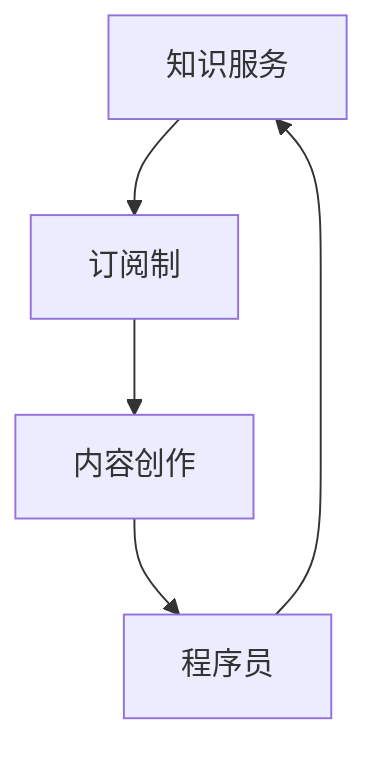

                 

关键词：订阅制知识服务、程序员、知识变现、在线教育、内容创作

> 摘要：本文将探讨程序员如何利用订阅制模式打造高质量的知识服务，从而实现知识变现和个人品牌的提升。我们将从背景介绍、核心概念与联系、核心算法原理、数学模型、项目实践、实际应用场景、工具和资源推荐以及未来发展趋势与挑战等多个方面进行详细阐述。

## 1. 背景介绍

在互联网时代，知识的传播和获取方式发生了巨大的变化。传统的知识传播渠道如书籍、讲座、研讨会等，逐渐被在线教育平台、博客、视频课程等新兴形式所取代。订阅制模式作为一种新兴的知识服务模式，逐渐成为许多内容创作者的选择。程序员作为互联网时代的重要群体，也看到了其中的巨大机遇。

### 1.1 程序员的知识优势

程序员拥有独特的知识体系和技术能力，这使得他们能够创作出具有高价值的技术内容。以下是一些程序员的知识优势：

- **深厚的编程技能**：程序员拥有扎实的编程技能，能够编写高效、可靠的代码。
- **丰富的实践经验**：程序员在项目中积累了大量的实践经验，能够从实际应用的角度出发，为读者提供实用的技术指导。
- **不断更新学习的习惯**：程序员需要不断学习新技术，保持知识的更新，这使得他们能够紧跟行业发展趋势，提供最新的技术内容。

### 1.2 知识变现的必要性

随着互联网的普及，越来越多的人开始重视知识的力量。程序员通过将知识变现，可以实现以下几个方面的目标：

- **实现经济收益**：通过订阅制模式，程序员可以将自己的知识服务转化为经济收益，实现财务自由。
- **提升个人品牌**：高质量的知识服务能够提升程序员的个人品牌，增加在行业中的影响力。
- **促进知识传播**：订阅制模式使得程序员能够将知识传播给更广泛的受众，促进知识的共享和传播。

## 2. 核心概念与联系

在打造订阅制知识服务的过程中，程序员需要了解以下几个核心概念：

- **知识服务**：知识服务是一种通过提供知识、技能、经验等来满足他人需求的服务形式。
- **订阅制**：订阅制是一种商业模式，用户通过支付一定费用，获取连续的知识服务。
- **内容创作**：内容创作是指程序员通过编写博客、视频、教程等方式，创作高质量的知识内容。

为了更好地理解这些概念之间的联系，我们可以使用Mermaid流程图来表示：



## 3. 核心算法原理 & 具体操作步骤

### 3.1 算法原理概述

在打造订阅制知识服务的过程中，程序员需要掌握以下核心算法原理：

- **内容创作算法**：通过分析用户需求和行业趋势，创作出高质量的知识内容。
- **推荐算法**：根据用户的行为数据，为用户推荐符合其兴趣的知识服务。
- **用户增长算法**：通过推广和营销手段，吸引用户订阅知识服务。

### 3.2 算法步骤详解

以下是打造订阅制知识服务的具体操作步骤：

1. **市场调研**：了解用户需求、竞争对手和行业趋势，为内容创作提供方向。
2. **内容策划**：根据市场调研结果，制定内容创作计划，包括主题、形式和频次等。
3. **内容创作**：按照策划方案，编写高质量的知识内容，如博客、视频、教程等。
4. **内容发布**：将创作好的内容发布到在线平台，如博客、YouTube等。
5. **用户推荐**：通过推荐算法，为用户推荐符合其兴趣的知识内容。
6. **用户反馈**：收集用户反馈，优化内容质量和用户体验。
7. **用户增长**：通过推广和营销手段，吸引用户订阅知识服务。

### 3.3 算法优缺点

**内容创作算法**：

- 优点：能够根据用户需求和行业趋势，创作出高质量的知识内容。
- 缺点：创作过程耗时较长，需要持续关注行业动态。

**推荐算法**：

- 优点：能够为用户推荐符合其兴趣的知识内容，提高用户满意度。
- 缺点：推荐算法的准确性受数据质量和算法模型的影响。

**用户增长算法**：

- 优点：能够通过推广和营销手段，吸引用户订阅知识服务。
- 缺点：需要投入一定的资源和精力，且效果难以预测。

### 3.4 算法应用领域

- **在线教育**：通过推荐算法，为学习者推荐适合的学习资源。
- **技术博客**：通过内容创作算法，为程序员提供高质量的技术内容。
- **专业咨询**：通过用户增长算法，为企业提供专业的咨询服务。

## 4. 数学模型和公式 & 详细讲解 & 举例说明

在订阅制知识服务中，数学模型和公式可以帮助程序员优化内容创作、推荐和用户增长策略。以下是一些常用的数学模型和公式：

### 4.1 数学模型构建

- **用户价值模型**：

  $$ V = f(R, C, U) $$

  其中，$V$表示用户价值，$R$表示用户订阅时长，$C$表示用户消费频次，$U$表示用户满意度。

- **内容推荐模型**：

  $$ R = f(I, D, S) $$

  其中，$R$表示推荐内容，$I$表示用户兴趣，$D$表示内容数据，$S$表示推荐算法模型。

### 4.2 公式推导过程

- **用户价值模型**推导过程：

  用户价值模型基于用户订阅时长、消费频次和满意度三个因素。订阅时长越长，用户价值越高；消费频次越高，用户价值越高；用户满意度越高，用户价值越高。

- **内容推荐模型**推导过程：

  内容推荐模型基于用户兴趣、内容和推荐算法模型。用户兴趣决定了推荐内容的类型；内容数据决定了推荐内容的质量；推荐算法模型决定了推荐内容的排序和筛选。

### 4.3 案例分析与讲解

假设有一个程序员A，他的博客内容涵盖了前端开发、后端开发和数据库技术。以下是针对程序员A的案例分析与讲解：

- **用户价值模型**：

  程序员A的博客用户价值可以表示为：

  $$ V = f(R, C, U) = f(6, 3, 0.8) = 13.6 $$

  其中，$R = 6$（用户订阅时长为6个月），$C = 3$（用户消费频次为每周3次），$U = 0.8$（用户满意度为80%）。

- **内容推荐模型**：

  假设程序员A的用户兴趣为前端开发，内容数据为100篇前端开发博客，推荐算法模型为基于内容的推荐算法。根据内容推荐模型，可以计算出推荐内容$R$：

  $$ R = f(I, D, S) = f(\text{前端开发}, \{ \text{HTML}, \text{CSS}, \text{JavaScript} \}, \text{基于内容的推荐算法}) $$

  最终，程序员A将向用户推荐与其兴趣相符的前端开发博客。

## 5. 项目实践：代码实例和详细解释说明

### 5.1 开发环境搭建

为了更好地展示订阅制知识服务的开发过程，我们将在本地搭建一个简单的博客系统。以下是开发环境搭建步骤：

1. 安装Node.js：从官网下载并安装Node.js。
2. 安装npm：Node.js自带npm包管理器。
3. 创建项目文件夹：在本地创建一个名为“blog”的项目文件夹。
4. 初始化项目：在项目文件夹中执行`npm init`命令，生成`package.json`文件。
5. 安装依赖：执行`npm install express mongoose body-parser`命令，安装所需的依赖包。

### 5.2 源代码详细实现

以下是博客系统的源代码实现：

```javascript
const express = require('express');
const mongoose = require('mongoose');
const bodyParser = require('body-parser');

const app = express();

// 连接MongoDB数据库
mongoose.connect('mongodb://localhost:27017/blog', { useNewUrlParser: true, useUnifiedTopology: true });

// 创建博客文章模型
const Post = mongoose.model('Post', new mongoose.Schema({
  title: String,
  content: String,
  author: String,
  created_at: { type: Date, default: Date.now }
}));

// 配置Body-Parser中间件
app.use(bodyParser.json());
app.use(bodyParser.urlencoded({ extended: true }));

// 配置路由
app.get('/', (req, res) => {
  Post.find({}).sort({ created_at: -1 }).then(posts => {
    res.send(posts);
  });
});

app.post('/post', (req, res) => {
  const post = new Post({
    title: req.body.title,
    content: req.body.content,
    author: req.body.author
  });
  post.save().then(result => {
    res.send(result);
  });
});

// 启动服务器
app.listen(3000, () => {
  console.log('Server started on port 3000');
});
```

### 5.3 代码解读与分析

以上代码实现了一个简单的博客系统，主要包括以下几个部分：

- **数据库连接**：使用MongoDB作为数据库，通过`mongoose.connect`方法连接到本地数据库。
- **模型定义**：创建一个名为`Post`的模型，用于存储博客文章信息，包括标题、内容、作者和创建时间。
- **路由配置**：配置GET和POST请求的路由，用于获取和创建博客文章。
- **中间件配置**：使用`body-parser`中间件处理HTTP请求的请求体。

通过以上代码，程序员可以快速搭建一个简单的博客系统，为订阅制知识服务提供基础支持。

### 5.4 运行结果展示

1. 启动服务器：在终端中执行`node app.js`命令，启动服务器。
2. 访问博客：在浏览器中输入`http://localhost:3000`，访问博客系统。
3. 创建博客：在浏览器中填写博客标题、内容和作者，然后点击提交按钮，创建新的博客文章。

通过以上步骤，程序员可以体验订阅制知识服务的实际运行过程。

## 6. 实际应用场景

订阅制知识服务在实际应用中具有广泛的应用场景，以下是一些典型的应用案例：

- **在线教育平台**：许多在线教育平台采用订阅制模式，为用户提供高质量的教育内容。例如，Coursera、Udemy等平台，用户通过订阅课程，获得持续的学习资源。
- **技术博客**：许多技术博客采用订阅制模式，为程序员提供最新的技术动态和教程。例如，V2EX、掘金等社区，用户通过订阅博客，获得定制化的技术内容。
- **专业咨询**：一些专业咨询公司采用订阅制模式，为用户提供定期的行业分析、技术指导等服务。例如，阿里云、腾讯云等公司的技术咨询服务。

在这些应用场景中，订阅制知识服务为企业带来了以下好处：

- **提高用户粘性**：通过持续提供高质量的内容，增加用户对平台的依赖和忠诚度。
- **实现持续收入**：订阅制模式使得企业能够实现持续的收入，降低收入波动风险。
- **提升品牌价值**：高质量的知识服务能够提升企业的品牌形象，增加在行业中的影响力。

## 7. 工具和资源推荐

为了更好地打造订阅制知识服务，程序员可以借助以下工具和资源：

### 7.1 学习资源推荐

- **在线课程**：许多在线教育平台提供丰富的编程课程，如Coursera、Udemy、慕课网等。
- **技术博客**：关注一些知名的技术博客，如V2EX、掘金、开源中国等，了解行业动态和最新技术。
- **专业书籍**：阅读一些经典的编程书籍，如《代码大全》、《设计模式：可复用面向对象软件的基础》等。

### 7.2 开发工具推荐

- **集成开发环境（IDE）**：选择适合自己的集成开发环境，如Visual Studio Code、Sublime Text、Eclipse等。
- **版本控制系统**：使用Git进行版本控制，确保代码的安全和可靠性。
- **数据库工具**：使用MongoDB、MySQL等数据库工具，方便数据存储和管理。

### 7.3 相关论文推荐

- **《在线教育中的订阅制模式研究》**：探讨在线教育中订阅制模式的应用和优势。
- **《基于推荐算法的内容推荐系统研究》**：分析推荐算法在内容推荐中的应用和优化方法。
- **《知识服务商业模式研究》**：分析知识服务商业模式的类型、特点和应用。

## 8. 总结：未来发展趋势与挑战

随着互联网的快速发展，订阅制知识服务在未来将呈现出以下几个发展趋势：

- **市场规模扩大**：随着知识需求的增加，订阅制知识服务的市场规模将不断扩大。
- **内容多样化**：订阅制知识服务将涵盖更多领域，满足不同用户的需求。
- **个性化推荐**：通过人工智能和大数据技术，实现更加精准的个性化推荐。

然而，订阅制知识服务也面临着一些挑战：

- **内容质量**：高质量的内容是订阅制知识服务成功的关键，程序员需要不断提升自己的内容创作能力。
- **用户留存**：如何提高用户留存率，保持订阅收入，是订阅制知识服务需要解决的问题。
- **市场竞争**：随着订阅制知识服务的普及，市场竞争将愈发激烈，程序员需要不断创新，提升自己的竞争力。

面对未来发展趋势与挑战，程序员应积极拥抱变化，不断提升自己的技能和知识，打造出具有核心竞争力的订阅制知识服务。

## 9. 附录：常见问题与解答

### 9.1 如何选择合适的订阅制模式？

选择合适的订阅制模式需要考虑以下几个方面：

- **用户需求**：了解用户的需求，为他们提供有价值的服务。
- **内容质量**：确保内容质量，提高用户满意度。
- **成本收益**：合理设置订阅费用，实现可持续的盈利模式。
- **营销策略**：通过有效的营销手段，提高用户订阅意愿。

### 9.2 如何提高用户留存率？

提高用户留存率可以从以下几个方面入手：

- **内容持续更新**：定期发布高质量的内容，保持用户的兴趣。
- **用户互动**：鼓励用户参与讨论，提高用户粘性。
- **个性化推荐**：根据用户行为和兴趣，推荐符合其需求的内容。
- **优质服务**：提供优质的客服服务，解决用户的问题和疑虑。

### 9.3 如何打造有影响力的个人品牌？

打造有影响力的个人品牌可以从以下几个方面入手：

- **高质量内容**：持续创作高质量的内容，树立个人专业形象。
- **社交媒体**：利用社交媒体平台，扩大个人影响力。
- **积极参与社区**：积极参与技术社区和行业活动，提升个人知名度。
- **口碑传播**：通过用户口碑，积累良好的品牌形象。

### 9.4 如何应对市场竞争？

应对市场竞争可以从以下几个方面入手：

- **创新内容**：不断推出新颖、有价值的内容，满足用户需求。
- **品牌差异化**：打造独特的品牌形象，与竞争对手区分开来。
- **技术优化**：提升技术实力，提供更优质的服务。
- **合作伙伴**：寻求与其他企业或个人的合作，共同拓展市场。

### 9.5 如何保证内容安全与隐私？

为了保证内容安全与隐私，可以采取以下措施：

- **数据加密**：使用加密技术保护用户数据和内容。
- **访问控制**：限制对内容和数据的访问权限，确保安全。
- **隐私政策**：明确告知用户隐私政策的条款，提高用户信任。
- **定期审计**：定期对内容和数据进行安全审计，及时发现并解决潜在问题。

作者：禅与计算机程序设计艺术 / Zen and the Art of Computer Programming
----------------------------------------------------------------

以上就是文章的完整内容，希望对您有所帮助。如果您有任何问题或建议，欢迎随时与我交流。祝您创作顺利！<|im_end|>

