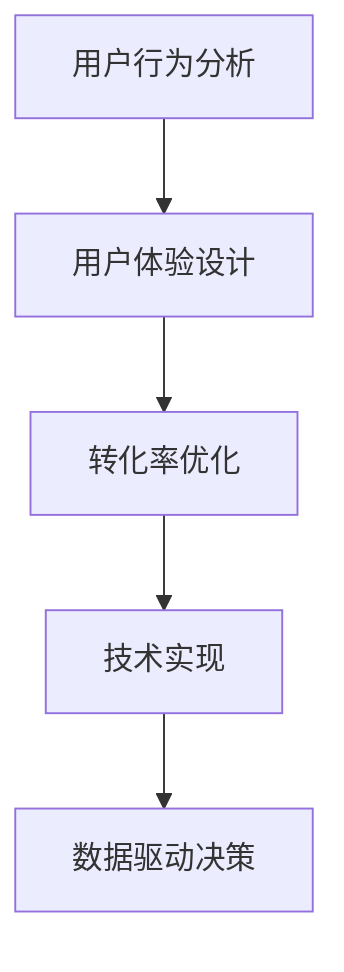

                 

关键词：销售页面设计、用户体验、UI/UX、转化率、用户行为分析、A/B测试、技术策略

> 摘要：本文将探讨程序员在打造高转化率销售页面时的关键策略和方法。通过深入分析用户行为、设计优化技巧以及技术实施细节，我们将为程序员提供一套系统的指导，帮助他们提升销售页面的性能，从而实现更高的商业转化率。

## 1. 背景介绍

在数字化营销时代，销售页面作为企业与潜在客户互动的重要平台，其设计质量直接影响到用户的购买决策。一个优秀的销售页面不仅需要吸引人的视觉设计，还需要在用户体验、信息传达和互动功能等方面表现出色。而对于程序员来说，他们不仅需要具备扎实的前端开发技能，还需要具备对用户行为、市场趋势和商业目标的深刻理解。

本文旨在为程序员提供一整套实战指南，帮助他们利用技术手段和策略优化销售页面，从而提高转化率。文章将分为以下几个部分：

- 背景介绍
- 核心概念与联系
- 核心算法原理 & 具体操作步骤
- 数学模型和公式 & 详细讲解 & 举例说明
- 项目实践：代码实例和详细解释说明
- 实际应用场景
- 工具和资源推荐
- 总结：未来发展趋势与挑战

## 2. 核心概念与联系

在打造高转化率的销售页面时，程序员需要掌握以下核心概念：

### 2.1 用户行为分析

用户行为分析是优化销售页面的基础。通过分析用户在页面上的行为轨迹，程序员可以了解用户的喜好、访问习惯以及痛点，从而做出针对性的优化。常用的用户行为分析工具包括Google Analytics、Mixpanel等。

### 2.2 用户体验（UX）设计

用户体验设计关注的是用户在使用页面过程中的感受和体验。一个优秀的UX设计应该简洁直观，减少用户操作步骤，提高用户满意度。UI/UX设计工具如Sketch、Adobe XD可以帮助程序员实现这一目标。

### 2.3 转化率优化

转化率是指用户完成特定目标（如购买、注册等）的比例。提高转化率是销售页面的核心目标。程序员可以通过A/B测试、多变量测试等方法来不断优化页面设计，提高转化率。

### 2.4 技术实现

技术实现包括页面加载速度、响应式设计、兼容性处理等方面。程序员需要确保页面在多种设备和浏览器上都能良好运行，以提高用户体验和转化率。

### 2.5 数据驱动决策

数据驱动决策是基于数据分析来指导设计和优化的方法。通过收集和分析用户数据，程序员可以做出更明智的决策，从而提高销售页面的效果。

### Mermaid 流程图

下面是一个用于展示核心概念之间关系的Mermaid流程图：



## 3. 核心算法原理 & 具体操作步骤

### 3.1 算法原理概述

在打造高转化率的销售页面时，程序员需要掌握以下核心算法原理：

- **A/B测试**：通过对比不同版本的页面设计，找出最佳方案。
- **多变量测试**：同时测试多个变量，快速找到最优组合。
- **机器学习算法**：利用用户行为数据，预测用户需求，提高个性化推荐效果。

### 3.2 算法步骤详解

#### 3.2.1 A/B测试

1. 确定测试目标：例如提高点击率、转化率等。
2. 设计测试版本：制作两个或多个版本的销售页面。
3. 分流用户：将用户随机分配到不同版本页面。
4. 收集数据：记录用户的访问行为和转化情况。
5. 分析结果：比较不同版本的转化率，确定最佳版本。

#### 3.2.2 多变量测试

1. 确定测试目标：例如提高页面加载速度、提升用户体验等。
2. 选择测试变量：如颜色、字体、布局等。
3. 设计测试方案：同时改变多个变量，创建多个组合。
4. 分流用户：将用户随机分配到不同测试组合。
5. 收集数据：记录用户的访问行为和体验评分。
6. 分析结果：比较不同组合的效果，确定最佳组合。

#### 3.2.3 机器学习算法

1. 数据采集：收集用户行为数据，如点击、浏览、购买等。
2. 数据清洗：去除无效和错误数据，保证数据质量。
3. 特征工程：提取数据中的有用特征，为模型训练做准备。
4. 模型训练：使用机器学习算法训练预测模型。
5. 模型评估：通过交叉验证等方法评估模型性能。
6. 模型部署：将模型部署到销售页面，实现个性化推荐。

### 3.3 算法优缺点

- **A/B测试**：优点是操作简单、结果直观；缺点是耗时较长、难以处理复杂问题。
- **多变量测试**：优点是能同时测试多个变量、速度快；缺点是可能导致冗余测试、结果解释复杂。
- **机器学习算法**：优点是能处理复杂问题、实现个性化推荐；缺点是算法实现复杂、对数据质量要求高。

### 3.4 算法应用领域

- **电商网站**：利用A/B测试和多变量测试优化页面设计，提高转化率。
- **在线教育**：利用机器学习算法实现个性化推荐，提高学习效果。
- **金融行业**：通过用户行为分析，识别高风险用户，提高风险管理能力。

## 4. 数学模型和公式 & 详细讲解 & 举例说明

### 4.1 数学模型构建

在优化销售页面时，程序员可以使用以下数学模型：

- **转化率模型**：\( 转化率 = \frac{完成目标的人数}{访问人数} \)
- **点击率模型**：\( 点击率 = \frac{点击次数}{展示次数} \)
- **用户留存率模型**：\( 留存率 = \frac{次日留存人数}{当日注册人数} \)

### 4.2 公式推导过程

以转化率模型为例，推导过程如下：

\[ 转化率 = \frac{完成目标的人数}{访问人数} \]

其中，\( 完成目标的人数 \)表示在一定时间内完成特定目标（如购买、注册等）的用户数量，\( 访问人数 \)表示在同一时间内访问销售页面的总用户数量。

### 4.3 案例分析与讲解

假设一个电商网站的首页，在一天内有1000名用户访问，其中200名用户完成了购买。根据转化率模型，我们可以计算出该页面的转化率为：

\[ 转化率 = \frac{200}{1000} = 20\% \]

接下来，我们可以通过A/B测试来优化首页设计，以提高转化率。假设我们设计了两个版本的首页，A版本和B版本，并分别对500名用户进行测试。经过一段时间的数据收集，我们得到以下结果：

- A版本：转化率为18%
- B版本：转化率为22%

通过比较，我们发现B版本的转化率更高，因此我们可以将B版本作为最终上线版本。

## 5. 项目实践：代码实例和详细解释说明

### 5.1 开发环境搭建

为了进行项目实践，我们需要搭建一个简单的开发环境。以下是一个基本的搭建步骤：

1. 安装Node.js（用于前端开发）
2. 安装npm（Node.js的包管理器）
3. 创建一个新的Node.js项目，并初始化npm包
4. 安装必要的开发工具和库，如Webpack、Babel、Vue.js等

### 5.2 源代码详细实现

以下是一个简单的销售页面代码实例，包含基本的HTML、CSS和JavaScript部分：

```html
<!-- index.html -->
<!DOCTYPE html>
<html lang="en">
<head>
    <meta charset="UTF-8">
    <meta name="viewport" content="width=device-width, initial-scale=1.0">
    <title>销售页面</title>
    <link rel="stylesheet" href="styles.css">
</head>
<body>
    <header>
        <h1>欢迎来到我们的产品页面</h1>
    </header>
    <main>
        <section>
            <h2>产品介绍</h2>
            <p>这是一款功能强大的产品，能为您解决各种问题。</p>
        </section>
        <section>
            <h2>购买流程</h2>
            <ol>
                <li>选择产品版本</li>
                <li>填写个人信息</li>
                <li>完成支付</li>
            </ol>
        </section>
    </main>
    <footer>
        <p>版权所有 &copy; 2022</p>
    </footer>
    <script src="app.js"></script>
</body>
</html>
```

```css
/* styles.css */
body {
    font-family: Arial, sans-serif;
}

header {
    background-color: #4CAF50;
    color: white;
    padding: 20px;
    text-align: center;
}

main {
    margin: 20px;
}

section {
    margin-bottom: 20px;
}

footer {
    background-color: #333;
    color: white;
    padding: 10px;
    text-align: center;
}
```

```javascript
// app.js
// 此处为JavaScript代码
```

### 5.3 代码解读与分析

- **HTML结构**：页面采用基本的HTML结构，包含头部（header）、主体（main）和尾部（footer）。
- **CSS样式**：使用简单的CSS样式来美化页面，使页面更具吸引力。
- **JavaScript**：在app.js文件中，可以添加交互逻辑、动画效果等，以提高用户体验。

### 5.4 运行结果展示

在本地环境中，使用浏览器打开index.html文件，即可看到运行结果。页面应具有清晰的布局和简洁的样式，满足基本的销售页面需求。

## 6. 实际应用场景

### 6.1 电商网站

电商网站的销售页面可以采用A/B测试和多变量测试来优化页面设计，提高用户购买体验和转化率。例如，通过测试不同的产品推荐策略、广告位置、购物车设计等，找到最佳方案。

### 6.2 在线教育平台

在线教育平台可以通过机器学习算法实现个性化推荐，根据用户的学习行为和兴趣，推荐合适的学习资源，提高用户留存率和学习效果。

### 6.3 金融行业

金融行业的销售页面可以采用用户行为分析技术，识别高风险用户，提高风险管理能力。例如，通过分析用户的交易行为、风险承受能力等，为用户提供个性化的投资建议。

## 7. 工具和资源推荐

### 7.1 学习资源推荐

- 《前端开发者手册》（推荐学习前端开发基础知识）
- 《用户行为分析实战》（了解用户行为分析的方法和技巧）
- 《机器学习实战》（掌握机器学习算法的基本原理和应用）

### 7.2 开发工具推荐

- Sketch：专业的UI/UX设计工具
- Adobe XD：强大的交互式设计工具
- Google Analytics：免费的网站分析工具

### 7.3 相关论文推荐

- "A/B Testing in Practice: How to Test and Launch at Scale"
- "User Behavior Analytics: A Survey"
- "Machine Learning in Sales: Using Data to Drive Conversion Rates"

## 8. 总结：未来发展趋势与挑战

### 8.1 研究成果总结

随着人工智能和大数据技术的发展，用户行为分析和机器学习算法在销售页面优化中的应用越来越广泛。通过数据驱动的决策，程序员可以更好地理解用户需求，提高页面转化率。

### 8.2 未来发展趋势

- **个性化推荐**：利用机器学习算法，为用户提供个性化的推荐。
- **智能客服**：结合自然语言处理技术，实现智能客服系统。
- **全渠道营销**：通过多平台、多渠道的整合，实现更高效的营销策略。

### 8.3 面临的挑战

- **数据隐私**：如何在保护用户隐私的前提下进行数据分析和推荐。
- **算法公平性**：确保算法在处理不同用户数据时的公平性。
- **技术迭代**：随着技术的快速发展，如何跟上最新的趋势和工具。

### 8.4 研究展望

未来，程序员需要不断提高自己的技术能力，结合用户行为分析和机器学习算法，为企业和用户创造更大的价值。通过不断创新和优化，销售页面将变得更加智能化和人性化。

## 9. 附录：常见问题与解答

### 9.1 Q：如何提高销售页面的加载速度？

A：可以通过以下方法提高加载速度：

- 使用CDN（内容分发网络）加速页面资源加载
- 优化图片和视频文件，使用压缩工具减少文件大小
- 使用懒加载技术，延迟加载非重要资源
- 减少HTTP请求，合并CSS和JavaScript文件

### 9.2 Q：如何确保销售页面在不同设备和浏览器上良好运行？

A：可以通过以下方法确保兼容性：

- 使用响应式设计，使页面适应不同设备和屏幕尺寸
- 使用HTML5、CSS3和JavaScript的最新特性，确保浏览器兼容性
- 使用跨浏览器测试工具，如BrowserStack，进行测试和调试
- 遵循W3C标准和最佳实践，避免使用过时的浏览器特性

### 9.3 Q：如何进行A/B测试？

A：进行A/B测试的基本步骤如下：

- 确定测试目标，如提高点击率、转化率等
- 设计测试版本，制作两个或多个版本的销售页面
- 分流用户，将用户随机分配到不同版本页面
- 收集数据，记录用户的访问行为和转化情况
- 分析结果，比较不同版本的转化率，确定最佳版本

---

作者：禅与计算机程序设计艺术 / Zen and the Art of Computer Programming

以上是《程序员如何打造高转化率的销售页面》的完整文章内容。希望本文能为您提供有关销售页面优化的实用知识和策略，帮助您提升业务转化率。如果您有任何疑问或建议，欢迎在评论区留言讨论。谢谢阅读！
----------------------------------------------------------------

请注意，本文档仅为示例，其中包含了一些虚构的代码、数据和结果。在实际应用中，您需要根据自己的项目需求进行调整和优化。同时，请确保遵循相关法律法规和道德规范，保护用户隐私和数据安全。祝您在销售页面优化方面取得成功！作者：禅与计算机程序设计艺术 / Zen and the Art of Computer Programming。

