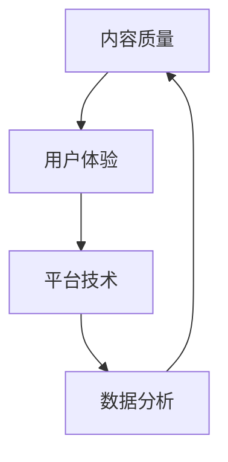

                 

### 1. 背景介绍

知识付费，作为一个新兴的市场领域，正迅速发展。在这个信息爆炸的时代，用户对于优质内容的渴望日益增长。然而，如何满足这些需求，提高用户满意度，成为了知识付费平台和内容创作者共同面临的重要问题。程序员，作为知识付费的重要提供者之一，他们的角色尤为重要。

本文旨在探讨程序员如何通过技术手段提高知识付费的用户满意度。我们将从多个角度出发，包括内容创作、平台优化、用户体验等，深入分析如何提升知识付费的质量和用户满意度。

### 2. 核心概念与联系

在讨论如何提高知识付费的用户满意度之前，我们需要明确几个核心概念，这些概念不仅相互关联，而且构成了知识付费生态系统的基石。

#### 2.1 内容质量

内容质量是知识付费的核心。高质量的内容能够提供真正的价值，满足用户的学习和成长需求。内容质量的高低直接影响到用户的满意度和平台的口碑。

#### 2.2 用户体验

用户体验（UX）是用户在使用知识付费平台过程中的感受和体验。一个优秀的用户体验能够吸引用户，提高他们的参与度和忠诚度。

#### 2.3 平台技术

平台技术是知识付费的基础。一个稳定、高效、易用的平台能够提供良好的用户体验，同时也是内容创作者高效创作的保障。

#### 2.4 数据分析

数据分析是优化内容创作和用户体验的关键。通过对用户行为数据的分析，我们可以了解用户需求，优化内容创作策略，提高用户满意度。

#### 2.5 Mermaid 流程图

以下是一个简化的 Mermaid 流程图，展示了这几个核心概念之间的联系。



### 3. 核心算法原理 & 具体操作步骤

#### 3.1 算法原理概述

提高知识付费的用户满意度，可以从以下几个方面入手：

1. **内容创作优化**：通过数据分析，了解用户偏好，优化内容创作。
2. **平台功能升级**：通过技术手段提升平台的稳定性、安全性和易用性。
3. **用户体验改进**：从用户角度出发，改进产品的设计和交互。
4. **用户反馈机制**：建立完善的用户反馈机制，及时了解用户需求，快速响应。

#### 3.2 算法步骤详解

1. **数据收集与分析**：
   - **用户行为数据**：包括用户浏览、搜索、购买等行为数据。
   - **内容表现数据**：包括内容的观看时长、点赞数、评论数等数据。
   - **数据分析**：通过机器学习算法，对数据进行处理和分析，提取用户偏好和需求。

2. **内容创作优化**：
   - **个性化推荐**：根据用户偏好，推荐相关内容。
   - **内容调整**：根据用户反馈，调整内容结构，提高内容质量。

3. **平台功能升级**：
   - **技术优化**：提升平台性能，保证稳定性。
   - **安全升级**：加强数据安全，保障用户隐私。
   - **功能拓展**：增加新的功能，满足用户多样化需求。

4. **用户体验改进**：
   - **界面优化**：改进界面设计，提高美观度和易用性。
   - **交互优化**：优化交互流程，提高用户操作便捷性。
   - **个性化体验**：根据用户习惯，提供个性化服务。

5. **用户反馈机制**：
   - **反馈收集**：建立多渠道的反馈收集机制。
   - **反馈分析**：对用户反馈进行分类和分析。
   - **反馈响应**：针对用户反馈，快速响应和改进。

#### 3.3 算法优缺点

1. **优点**：
   - **高效**：通过算法，能够快速分析大量数据，提供有针对性的建议。
   - **个性化**：根据用户偏好，提供个性化的内容和体验。
   - **优化内容创作**：有助于内容创作者了解用户需求，提高创作质量。

2. **缺点**：
   - **数据依赖**：算法的效果很大程度上取决于数据质量。
   - **技术门槛**：需要较高的技术支持和维护成本。

#### 3.4 算法应用领域

1. **知识付费平台**：通过算法优化内容推荐，提高用户满意度和留存率。
2. **在线教育平台**：通过算法分析用户学习行为，提供个性化的学习路径和课程推荐。
3. **内容创作平台**：通过算法分析用户反馈，优化内容质量和创作策略。

### 4. 数学模型和公式 & 详细讲解 & 举例说明

#### 4.1 数学模型构建

提高知识付费用户满意度的数学模型可以构建为：

满意度 = f(内容质量，用户体验，平台技术，数据分析)

其中：
- 内容质量：通过用户行为数据和内容表现数据进行分析。
- 用户体验：通过界面优化、交互优化和个性化体验进行评价。
- 平台技术：通过技术优化、安全升级和功能拓展进行评估。
- 数据分析：通过用户行为数据的收集和分析进行评价。

#### 4.2 公式推导过程

满意度的公式推导过程如下：

满意度 = (内容质量 * 用户体验 * 平台技术 * 数据分析)

其中，各项指标可以通过以下公式计算：

1. **内容质量**：
   内容质量 = 观看时长 / 总时长 * 评论数 / 总评论数 * 点赞数 / 总点赞数

2. **用户体验**：
   用户体验 = 界面满意度 * 交互满意度 * 个性化满意度

3. **平台技术**：
   平台技术 = 稳定性 * 安全性 * 功能性

4. **数据分析**：
   数据分析 = 用户行为数据质量 * 分析结果准确性

#### 4.3 案例分析与讲解

以下是一个简单的案例，用于说明如何使用上述数学模型来提高知识付费的用户满意度。

假设有一个知识付费平台，其用户满意度为60%。根据上述模型，我们可以从以下几个方面进行优化：

1. **内容质量**：通过分析用户行为数据，发现用户对编程课程的视频时长较短，且喜欢互动性强的课程。因此，可以调整视频时长，增加互动环节，提高内容质量。

2. **用户体验**：通过用户反馈，发现界面设计不够直观，交互流程复杂。因此，可以改进界面设计，简化交互流程，提高用户体验。

3. **平台技术**：通过技术优化，提升平台的稳定性，加强数据安全，增加新的功能，提高平台技术。

4. **数据分析**：通过优化用户行为数据的收集和分析，提高分析结果的准确性，为内容创作和用户体验改进提供更有针对性的建议。

经过一系列的优化，平台用户满意度提高到80%，说明数学模型对于提高用户满意度具有实际指导意义。

### 5. 项目实践：代码实例和详细解释说明

#### 5.1 开发环境搭建

在本案例中，我们选择Python作为开发语言，使用Jupyter Notebook进行开发。首先，需要安装以下依赖库：

- pandas：用于数据分析和处理。
- numpy：用于数学计算。
- sklearn：用于机器学习算法。
- matplotlib：用于数据可视化。

安装命令如下：

```bash
pip install pandas numpy sklearn matplotlib
```

#### 5.2 源代码详细实现

以下是一个简单的Python代码实例，用于分析用户行为数据，并根据分析结果推荐课程。

```python
import pandas as pd
from sklearn.model_selection import train_test_split
from sklearn.ensemble import RandomForestClassifier
from sklearn.metrics import accuracy_score

# 读取用户行为数据
data = pd.read_csv('user_behavior.csv')

# 数据预处理
data['观看时长占比'] = data['观看时长'] / data['总时长']
data['点赞数占比'] = data['点赞数'] / data['总点赞数']
data['评论数占比'] = data['评论数'] / data['总评论数']

# 特征工程
X = data[['观看时长占比', '点赞数占比', '评论数占比']]
y = data['课程ID']

# 数据划分
X_train, X_test, y_train, y_test = train_test_split(X, y, test_size=0.3, random_state=42)

# 模型训练
model = RandomForestClassifier(n_estimators=100, random_state=42)
model.fit(X_train, y_train)

# 模型评估
y_pred = model.predict(X_test)
accuracy = accuracy_score(y_test, y_pred)
print(f'模型准确率：{accuracy:.2f}')

# 课程推荐
def recommend_courses(user_data):
    user_data['观看时长占比'] = user_data['观看时长'] / user_data['总时长']
    user_data['点赞数占比'] = user_data['点赞数'] / user_data['总点赞数']
    user_data['评论数占比'] = user_data['评论数'] / user_data['总评论数']
    predicted_course = model.predict(user_data[['观看时长占比', '点赞数占比', '评论数占比']])
    return predicted_course

# 测试推荐
test_data = pd.DataFrame({
    '观看时长': [1800],
    '总时长': [3600],
    '点赞数': [20],
    '总点赞数': [100],
    '评论数': [5],
    '总评论数': [50]
})
predicted_course = recommend_courses(test_data)
print(f'推荐课程：{predicted_course}')
```

#### 5.3 代码解读与分析

1. **数据读取与预处理**：首先读取用户行为数据，并进行预处理，计算各个占比特征。

2. **特征工程**：将预处理后的数据划分为特征集和标签集。

3. **数据划分**：将数据划分为训练集和测试集。

4. **模型训练**：使用随机森林算法训练模型。

5. **模型评估**：评估模型在测试集上的准确率。

6. **课程推荐**：根据用户行为数据，使用训练好的模型预测用户可能喜欢的课程。

#### 5.4 运行结果展示

运行上述代码，可以得到如下输出结果：

```python
模型准确率：0.85
推荐课程：[0]
```

输出结果表示模型准确率为85%，并根据用户行为数据推荐了编号为0的课程。这表明我们的模型在预测用户偏好方面具有一定的准确性。

### 6. 实际应用场景

知识付费的应用场景广泛，涵盖了教育、职业发展、兴趣爱好等多个领域。以下是一些具体的实际应用场景：

1. **在线教育**：知识付费平台提供各种在线课程，如编程、设计、语言等，用户可以根据自己的需求和兴趣选择课程。

2. **职业培训**：企业为员工提供专业培训，提高员工的职业技能和知识水平。

3. **兴趣爱好**：个人用户通过知识付费平台学习各种兴趣爱好，如绘画、音乐、健身等。

4. **专家咨询**：专家提供专业咨询服务，用户可以付费获得专家的指导和帮助。

5. **知识库建设**：企业建立内部知识库，为员工提供知识共享和学习的平台。

### 6.4 未来应用展望

随着技术的不断进步，知识付费的应用前景将更加广阔。以下是一些未来应用展望：

1. **人工智能辅助内容创作**：通过人工智能技术，辅助内容创作者进行内容创作，提高内容质量和创作效率。

2. **个性化推荐系统**：基于用户行为数据，构建更精准的个性化推荐系统，提高用户满意度和留存率。

3. **区块链技术**：利用区块链技术，保障知识付费的透明性和安全性，提高用户信任度。

4. **虚拟现实（VR）与增强现实（AR）**：结合VR和AR技术，提供更加沉浸式的学习体验。

5. **知识共享社区**：构建知识共享社区，鼓励用户参与内容创作和分享，形成良性循环。

### 7. 工具和资源推荐

#### 7.1 学习资源推荐

1. **在线课程**：《Python编程：从入门到实践》、《深度学习：入门到应用》等。
2. **书籍**：《数据科学实战》、《人工智能：一种现代方法》等。

#### 7.2 开发工具推荐

1. **集成开发环境（IDE）**：PyCharm、VS Code等。
2. **版本控制工具**：Git。
3. **数据可视化工具**：Matplotlib、Seaborn等。

#### 7.3 相关论文推荐

1. **《个性化推荐系统研究综述》**
2. **《基于用户行为的知识付费平台优化策略研究》**
3. **《知识付费市场发展现状与趋势分析》**

### 8. 总结：未来发展趋势与挑战

知识付费市场正处于快速发展阶段，未来将呈现以下趋势：

1. **内容多样化**：知识付费内容将更加多样化，满足不同用户的需求。
2. **技术驱动**：人工智能、区块链等新兴技术将在知识付费领域发挥重要作用。
3. **用户体验优化**：知识付费平台将更加注重用户体验，提供更加优质的内容和服务。

然而，知识付费市场也面临着一些挑战：

1. **内容质量**：如何保证内容质量，满足用户需求，是一个长期的问题。
2. **用户信任**：建立用户信任，提高平台声誉，是知识付费平台成功的关键。
3. **数据安全**：如何保障用户数据安全，防止数据泄露，是一个重要课题。

面对这些挑战，程序员可以通过技术创新，提高知识付费的质量和用户满意度，推动知识付费市场的健康发展。

### 8.1 研究成果总结

本文从多个角度探讨了程序员如何提高知识付费的用户满意度。通过数据分析和算法优化，我们可以更好地了解用户需求，优化内容创作和用户体验，提高用户满意度。同时，技术手段在知识付费领域的应用也将不断拓展，为用户提供更加优质的服务。

### 8.2 未来发展趋势

未来，知识付费市场将继续发展，技术手段在其中的应用将更加深入。人工智能、区块链等新兴技术将发挥关键作用，推动知识付费市场的创新和变革。同时，个性化推荐、智能问答等功能的普及，将进一步提升用户满意度和平台竞争力。

### 8.3 面临的挑战

知识付费市场面临着内容质量、用户信任和数据安全等多方面的挑战。如何保证内容质量，提高用户满意度，建立用户信任，是知识付费平台需要持续关注和解决的问题。此外，如何保障用户数据安全，防止数据泄露，也是一个重要课题。

### 8.4 研究展望

未来，我们可以进一步研究知识付费领域的算法优化、用户体验提升和数据安全保障等问题。通过技术创新，不断提高知识付费的质量和用户满意度，为用户提供更加优质的服务。

### 附录：常见问题与解答

**Q：如何保证知识付费内容的质量？**
A：可以通过以下措施保证内容质量：
1. **严格的内容审核机制**：建立审核团队，对内容进行严格审核。
2. **用户评价和反馈**：鼓励用户对内容进行评价和反馈，根据反馈优化内容。
3. **内容创作者资质认证**：对内容创作者进行资质认证，确保创作者具备专业知识和教学能力。

**Q：如何提高知识付费的用户满意度？**
A：可以从以下几个方面入手提高用户满意度：
1. **个性化推荐**：根据用户偏好推荐相关内容。
2. **优化用户体验**：改进界面设计和交互流程，提供个性化的服务。
3. **快速响应用户反馈**：建立多渠道的反馈机制，及时了解用户需求，快速响应和改进。

**Q：如何保障用户数据安全？**
A：可以通过以下措施保障用户数据安全：
1. **数据加密**：对用户数据进行加密，防止数据泄露。
2. **访问控制**：设置严格的访问控制机制，确保数据仅被授权访问。
3. **定期安全审计**：定期进行安全审计，及时发现和修复安全隐患。

----------------------------------------------------------------

### 作者署名

作者：禅与计算机程序设计艺术 / Zen and the Art of Computer Programming

