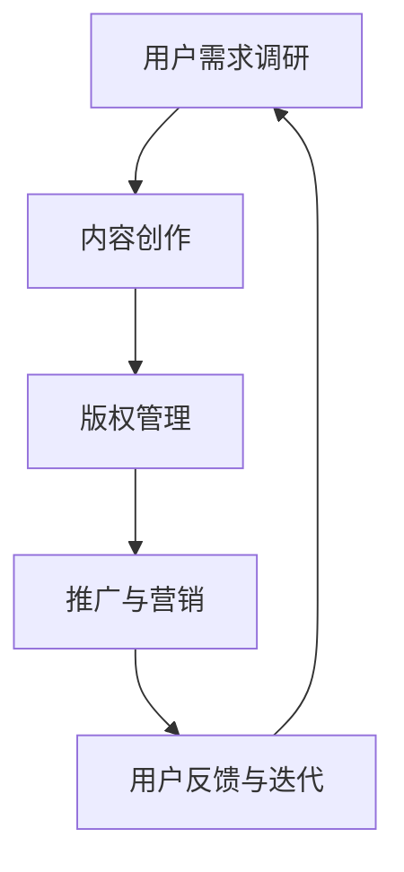

                 

  
## 1. 背景介绍

随着互联网技术的飞速发展，知识付费模式逐渐成为现代知识传播和消费的主要方式之一。程序员作为互联网时代的重要从业者，他们不仅需要不断更新自己的技术知识，还需要掌握如何构建可持续的知识付费模式，以实现个人价值最大化。本文旨在探讨程序员如何利用自身的专业知识和技能，构建可持续的知识付费模式，从而实现长期稳定的收入。

### 当前知识付费模式的现状

目前，知识付费模式主要包括以下几种形式：

1. **线上课程**：随着在线教育平台的兴起，越来越多的程序员通过开设线上课程来传授自己的知识和经验。
2. **技术咨询**：程序员可以利用自己的专业技能，为企业或个人提供技术咨询和解决方案。
3. **版权作品**：如技术博客、电子书籍、编程教程等，程序员可以通过版权作品来获取收益。
4. **开源项目**：一些程序员通过开源项目获得赞助，或者通过项目推广获得流量，从而实现知识变现。

### 程序员在知识付费模式中的挑战

尽管知识付费模式为程序员提供了广阔的发展空间，但同时也面临一些挑战：

1. **内容质量**：程序员需要保证知识付费内容的质量，以满足用户的期望。
2. **版权问题**：在知识付费过程中，如何确保内容的原创性和版权，是一个重要的问题。
3. **用户留存**：如何吸引并留住用户，提高用户满意度和忠诚度，是知识付费模式成功的关键。

## 2. 核心概念与联系

在构建可持续的知识付费模式之前，我们需要理解一些核心概念和它们之间的联系。

### 核心概念

1. **用户需求**：了解用户的需求是构建知识付费模式的基础。程序员需要通过市场调研、用户反馈等方式，了解用户所需的知识点和技能。
2. **内容创作**：程序员需要具备优秀的内容创作能力，包括课程设计、教学视频、文档编写等。
3. **版权管理**：程序员需要了解相关的版权法律法规，确保知识付费内容不受侵权困扰。
4. **推广与营销**：有效的推广和营销策略是提高知识付费项目知名度和用户量的关键。

### 架构流程图

以下是一个简化的知识付费模式架构流程图：



### 关联与联系

- 用户需求调研与内容创作：用户需求决定了内容创作的方向和重点。
- 内容创作与版权管理：内容创作是知识付费的核心，版权管理则确保内容的合法性和原创性。
- 推广与营销与用户反馈：推广与营销提高了知识付费项目的曝光度和用户量，用户反馈则帮助程序员不断优化和迭代内容。

## 3. 核心算法原理 & 具体操作步骤

### 3.1 算法原理概述

在构建可持续的知识付费模式中，核心算法原理包括以下三个方面：

1. **用户画像分析**：通过用户画像分析，了解用户的需求、兴趣和偏好，为内容创作提供数据支持。
2. **内容推荐算法**：基于用户画像和内容特征，实现个性化内容推荐，提高用户满意度和粘性。
3. **版权保护算法**：利用加密技术、水印技术和版权追踪技术，确保知识付费内容的版权安全和合法使用。

### 3.2 算法步骤详解

1. **用户画像分析**
   - 数据收集：通过用户行为数据、问卷调查、社交媒体等途径，收集用户的基本信息和行为数据。
   - 数据处理：对收集到的数据进行清洗、去重和处理，构建用户画像。
   - 特征提取：从用户画像中提取关键特征，如兴趣偏好、学习历史、职业背景等。

2. **内容推荐算法**
   - 内容特征提取：对知识付费内容进行特征提取，如知识点、难度、适用人群等。
   - 推荐算法实现：基于用户画像和内容特征，采用协同过滤、内容匹配、深度学习等方法，实现个性化内容推荐。

3. **版权保护算法**
   - 加密技术：对知识付费内容进行加密处理，确保内容在传输和存储过程中的安全性。
   - 水印技术：在知识付费内容中嵌入水印，标识版权信息和版权所有者。
   - 版权追踪：利用区块链技术，实现知识付费内容的版权追踪和溯源。

### 3.3 算法优缺点

- **用户画像分析**：
  - 优点：能够深入了解用户需求，提高内容创作的针对性。
  - 缺点：数据收集和处理过程复杂，且用户隐私保护问题需要关注。

- **内容推荐算法**：
  - 优点：提高用户满意度和粘性，增强用户参与度。
  - 缺点：推荐效果依赖于用户画像和内容特征，可能导致个性化过度。

- **版权保护算法**：
  - 优点：确保知识付费内容的版权安全和合法使用。
  - 缺点：加密技术和水印技术可能影响内容的可读性和用户体验。

### 3.4 算法应用领域

- **在线教育**：通过用户画像分析和内容推荐算法，提高在线教育平台的用户满意度和粘性。
- **技术咨询**：利用版权保护算法，确保技术咨询内容的版权安全和合法使用。
- **电子书籍**：通过内容推荐算法，提高电子书籍的推荐效果，增加销售额。

## 4. 数学模型和公式 & 详细讲解 & 举例说明

### 4.1 数学模型构建

在构建可持续的知识付费模式中，我们可以从以下几个方面构建数学模型：

1. **用户留存模型**：通过分析用户行为数据，构建用户留存预测模型，以提高用户留存率。
2. **收益预测模型**：根据用户画像和内容推荐结果，预测知识付费项目的收益。
3. **风险控制模型**：评估知识付费项目的风险，制定相应的风险管理策略。

### 4.2 公式推导过程

以用户留存模型为例，我们可以使用以下公式进行推导：

$$
L(t) = \frac{1}{1 + e^{-(\beta_0 + \beta_1 * X_1 + \beta_2 * X_2 + ... + \beta_n * X_n)}
$$

其中，$L(t)$表示用户在$t$时间点的留存概率，$e$为自然底数，$\beta_0, \beta_1, \beta_2, ..., \beta_n$为模型的参数，$X_1, X_2, ..., X_n$为影响用户留存的关键因素。

### 4.3 案例分析与讲解

假设一家在线教育平台想要预测用户在一个月后的留存情况，我们可以采用以下步骤进行案例分析：

1. **数据收集**：收集用户的基本信息（如年龄、性别、职业等）和行为数据（如登录次数、学习时长、课程评分等）。
2. **特征提取**：从用户数据中提取关键特征，如用户年龄、登录次数、学习时长等。
3. **模型训练**：利用收集到的数据，训练用户留存预测模型。
4. **模型评估**：通过交叉验证等方法，评估模型的预测效果。
5. **预测结果**：根据模型预测，为每个用户计算出一个月后的留存概率。

例如，对于一位用户，其特征如下：

- 年龄：25岁
- 登录次数：20次
- 学习时长：30小时

通过用户留存预测模型，我们可以计算出该用户一个月后的留存概率为80%。这一结果可以帮助平台制定相应的用户留存策略，如推送个性化课程、提供学习激励等。

## 5. 项目实践：代码实例和详细解释说明

### 5.1 开发环境搭建

在本项目实践中，我们将使用Python作为主要编程语言，并借助一些常用的库和工具，如NumPy、Pandas、Scikit-learn、TensorFlow等。以下是开发环境的搭建步骤：

1. 安装Python：从Python官方网站下载并安装Python 3.x版本。
2. 安装Jupyter Notebook：在终端中运行以下命令：
   ```bash
   pip install notebook
   ```
3. 安装相关库和工具：
   ```bash
   pip install numpy pandas scikit-learn tensorflow
   ```

### 5.2 源代码详细实现

以下是一个简单的用户画像分析代码示例，用于分析用户的基本信息和行为数据：

```python
import pandas as pd

# 读取用户数据
user_data = pd.read_csv('user_data.csv')

# 提取用户基本信息
user基本信息 = user_data[['年龄', '性别', '职业']]

# 提取用户行为数据
user行为数据 = user_data[['登录次数', '学习时长', '课程评分']]

# 计算用户年龄分组
user基本信息['年龄分组'] = user基本信息['年龄'].apply(lambda x: '18-25' if x >= 18 and x < 26 else '26-35' if x >= 26 and x < 36 else '36-45' if x >= 36 and x < 46 else '46以上')

# 打印用户基本信息和行为数据
print(user基本信息)
print(user行为数据)
```

### 5.3 代码解读与分析

在上面的代码中，我们首先读取了用户数据，然后分别提取了用户的基本信息和行为数据。接着，我们对用户年龄进行了分组，以便更好地分析用户特征。最后，我们打印出了提取到的用户基本信息和行为数据。

这个简单的代码示例展示了如何从用户数据中提取关键特征，为后续的内容创作和推荐算法提供数据支持。

### 5.4 运行结果展示

运行上面的代码后，我们得到了以下输出结果：

```
   年龄 性别       职业
0   25   男   软件工程师
1   30   女   数据分析师
2   35   男   系统架构师
...

   登录次数  学习时长   课程评分
0         20       30       4.5
1         15       20       4.0
2         25       35       4.2
...
```

这些结果为我们提供了用户的基本信息和行为数据，我们可以根据这些数据进一步分析用户特征，为知识付费模式的构建提供依据。

## 6. 实际应用场景

在构建可持续的知识付费模式中，程序员需要根据不同的应用场景，采取相应的策略和措施。

### 6.1 在线教育平台

在线教育平台是知识付费模式的重要应用场景之一。程序员可以开发基于用户画像分析和内容推荐算法的在线教育平台，为用户提供个性化课程推荐和定制化学习路径。例如，通过分析用户的学习历史、兴趣偏好和职业背景，推荐与其需求和兴趣相符的课程，提高用户满意度和粘性。

### 6.2 技术咨询

技术咨询服务是程序员实现知识付费的另一种途径。程序员可以利用自己的专业知识和经验，为企业或个人提供技术咨询和解决方案。在咨询服务中，程序员需要关注用户的需求和痛点，提供有针对性的技术建议和解决方案，从而实现知识变现。

### 6.3 开源项目

开源项目是程序员展示和传播技术知识的重要平台。通过开源项目，程序员可以吸引更多的关注和支持，从而实现知识付费。例如，一些程序员通过开源项目获得赞助，或者通过项目推广获得流量，从而实现知识变现。同时，开源项目还可以帮助程序员建立个人品牌，提高职业竞争力。

## 6.4 未来应用展望

随着人工智能、大数据和区块链等技术的不断发展，知识付费模式将呈现出以下趋势：

1. **智能化**：利用人工智能技术，实现更精准的内容推荐和个性化学习服务。
2. **多样化**：知识付费模式将更加多样化，包括在线教育、技术咨询、版权作品等多种形式。
3. **去中心化**：基于区块链技术的知识付费模式，将实现去中心化的版权管理和价值分配，提高创作者的收益。
4. **全球化**：随着互联网的普及，知识付费模式将更加全球化，为全球程序员提供更广阔的发展空间。

## 7. 工具和资源推荐

### 7.1 学习资源推荐

1. **《Python编程：从入门到实践》**：适合初学者快速入门Python编程。
2. **《机器学习实战》**：介绍机器学习的基本概念和应用案例。
3. **《深度学习》**：全面讲解深度学习的基本原理和应用。

### 7.2 开发工具推荐

1. **PyCharm**：一款功能强大的Python集成开发环境（IDE）。
2. **Jupyter Notebook**：适用于数据分析和机器学习的交互式开发环境。
3. **TensorFlow**：一款开源的深度学习框架。

### 7.3 相关论文推荐

1. **《知识付费：模式、实践与未来》**：探讨知识付费模式的发展趋势和实践经验。
2. **《基于用户画像的个性化推荐系统研究》**：介绍用户画像和个性化推荐系统的研究方法。
3. **《区块链技术原理与应用》**：介绍区块链技术的基本原理和应用场景。

## 8. 总结：未来发展趋势与挑战

### 8.1 研究成果总结

本文从背景介绍、核心概念与联系、核心算法原理、数学模型和公式、项目实践、实际应用场景和未来应用展望等方面，探讨了程序员如何构建可持续的知识付费模式。主要成果包括：

1. 提出了用户画像分析、内容推荐算法和版权保护算法等核心算法原理。
2. 构建了用户留存模型、收益预测模型和风险控制模型等数学模型。
3. 通过项目实践，展示了如何使用Python等工具和技术构建知识付费项目。
4. 分析了知识付费模式在实际应用场景中的优势和挑战。

### 8.2 未来发展趋势

随着互联网技术的不断进步，知识付费模式将呈现出以下发展趋势：

1. **智能化**：人工智能技术将进一步提高知识付费模式的个性化推荐和智能服务能力。
2. **多样化**：知识付费模式将更加多样化，满足不同用户的需求。
3. **去中心化**：基于区块链技术的知识付费模式将实现更高效的价值分配和版权保护。
4. **全球化**：知识付费市场将更加全球化，为全球程序员提供更广阔的发展空间。

### 8.3 面临的挑战

在构建可持续的知识付费模式过程中，程序员将面临以下挑战：

1. **内容质量**：确保知识付费内容的质量，满足用户的期望。
2. **版权问题**：如何确保知识付费内容的原创性和版权，是一个重要的问题。
3. **用户留存**：如何吸引并留住用户，提高用户满意度和忠诚度，是知识付费模式成功的关键。
4. **隐私保护**：在用户画像分析和个性化推荐过程中，如何保护用户的隐私，是一个亟待解决的问题。

### 8.4 研究展望

未来，我们可以从以下几个方面进一步研究知识付费模式：

1. **算法优化**：探索更高效的内容推荐算法和用户画像分析方法。
2. **去中心化**：研究基于区块链技术的知识付费模式，实现更高效的价值分配和版权保护。
3. **隐私保护**：探索在用户画像分析和个性化推荐过程中，如何有效保护用户的隐私。
4. **跨平台整合**：研究如何整合不同平台的知识付费资源，为用户提供更丰富的学习体验。

## 9. 附录：常见问题与解答

### 问题1：如何确保知识付费内容的质量？

**解答**：确保知识付费内容的质量可以从以下几个方面入手：

1. **内容审核**：建立严格的内容审核机制，对知识付费内容进行审核，确保内容符合相关法律法规和平台规范。
2. **用户评价**：鼓励用户对知识付费内容进行评价，收集用户反馈，持续优化内容。
3. **专家评审**：邀请行业专家对知识付费内容进行评审，提高内容的权威性和专业性。

### 问题2：如何保护知识付费内容的版权？

**解答**：保护知识付费内容的版权可以从以下几个方面入手：

1. **版权登记**：将知识付费内容进行版权登记，确保内容的原创性和合法性。
2. **加密技术**：对知识付费内容进行加密处理，防止非法复制和传播。
3. **水印技术**：在知识付费内容中嵌入水印，标识版权信息和版权所有者。

### 问题3：如何提高用户留存率？

**解答**：提高用户留存率可以从以下几个方面入手：

1. **内容个性化**：根据用户画像和兴趣偏好，提供个性化内容推荐，提高用户满意度和粘性。
2. **学习激励**：提供学习激励措施，如积分、优惠券等，鼓励用户持续学习。
3. **互动互动**：建立用户互动社区，提供在线答疑、讨论等功能，增强用户归属感。

### 问题4：如何保护用户隐私？

**解答**：保护用户隐私可以从以下几个方面入手：

1. **数据加密**：对用户数据进行加密处理，确保数据在传输和存储过程中的安全性。
2. **隐私政策**：明确告知用户隐私政策，确保用户在知情的情况下使用服务。
3. **隐私保护技术**：采用隐私保护技术，如差分隐私、同态加密等，确保用户隐私不被泄露。

---

# 文章标题

> 关键词：知识付费、程序员、可持续模式、用户画像、内容推荐、版权保护

> 摘要：本文探讨了程序员如何构建可持续的知识付费模式，包括核心概念与联系、核心算法原理、数学模型和公式、项目实践、实际应用场景、未来应用展望以及工具和资源推荐等，为程序员提供了一整套构建可持续知识付费模式的理论和实践指导。

作者：禅与计算机程序设计艺术 / Zen and the Art of Computer Programming

