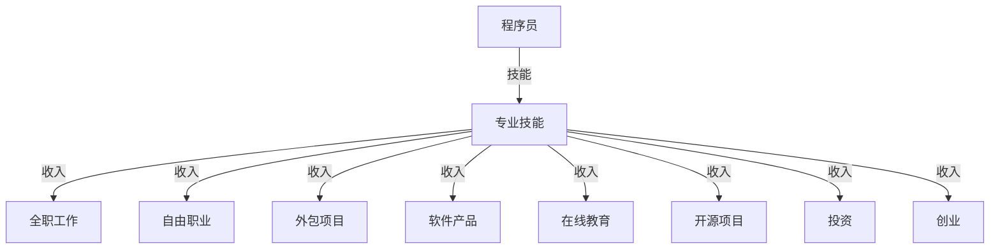

                 

关键词：多元化收入、程序员、被动收入、技能提升、商业机会、投资

> 摘要：本文旨在探讨程序员如何通过构建多元化收入结构来实现财务自由。我们将分析现有的收入来源，探讨如何利用专业技能和资源拓展收入渠道，以及提供一些实用的建议和工具，帮助程序员实现收入多样化。

## 1. 背景介绍

在当今的科技时代，程序员作为一个高需求的职业，已经逐渐成为了许多人追求的目标。然而，尽管程序员在技术领域有着丰富的知识和技能，他们仍然面临着收入不稳定和职业发展受限的挑战。因此，构建多元化的收入结构对于程序员来说尤为重要。

本文将探讨以下几个方面：

1. **现有收入来源**：分析程序员目前的主要收入来源，包括全职工作、自由职业、外包项目等。
2. **构建多元化收入**：介绍如何利用专业技能和资源拓展收入渠道，包括开发软件产品、开展在线教育、参与开源项目等。
3. **实现收入多样化**：提供一些实用的策略和建议，帮助程序员实现收入多样化，如投资、创业等。
4. **工具和资源推荐**：推荐一些有助于程序员构建多元化收入结构的学习资源、开发工具和投资机会。

## 2. 核心概念与联系

为了更好地理解如何构建多元化收入结构，我们需要先了解一些核心概念和联系。以下是一个简化的 Mermaid 流程图，展示了与收入结构相关的一些关键节点。



### 2.1 专业技能

专业技能是程序员的核心资产。无论是全职工作、自由职业、外包项目，还是开发软件产品、开展在线教育、参与开源项目，都离不开专业技能的支持。

### 2.2 全职工作

全职工作是程序员最常见的收入来源。通过在公司工作，程序员可以获得稳定的薪资和福利，但这也意味着职业发展可能受到限制。

### 2.3 自由职业

自由职业为程序员提供了更大的自主性和灵活性。通过接受外包项目或自由职业工作，程序员可以根据市场需求和自身兴趣选择项目，实现收入多样化。

### 2.4 外包项目

外包项目是程序员获取额外收入的一种方式。通过在平台上接外包项目，程序员可以获得额外的收入，同时提高自己的知名度。

### 2.5 软件产品

开发软件产品是程序员实现收入多样化的一种有效途径。通过将自己的知识和技术转化为可出售的软件产品，程序员可以获得持续的收入。

### 2.6 在线教育

在线教育为程序员提供了一个新的收入来源。通过分享自己的知识和经验，程序员可以在在线教育平台上获得收入，同时帮助他人提升技能。

### 2.7 开源项目

参与开源项目不仅可以提升程序员的技术能力，还可以帮助他们建立声誉。通过贡献代码和文档，程序员可以获得社区的认可，从而吸引更多的商业机会。

### 2.8 投资

投资是程序员实现收入多样化的一种方式。通过投资股票、房地产或其他金融产品，程序员可以在不增加工作负担的情况下实现收入的增长。

### 2.9 创业

创业是程序员实现财务自由的一种方式。通过创办自己的公司，程序员可以将自己的技术和知识转化为商业价值，实现长期的收入增长。

## 3. 核心算法原理 & 具体操作步骤

### 3.1 算法原理概述

构建多元化收入结构的核心算法可以概括为以下几个方面：

1. **技能提升**：通过不断学习和实践，提高自己的专业技能，以适应市场需求。
2. **资源整合**：利用现有的资源和人脉，拓展收入渠道。
3. **市场分析**：分析市场需求，选择适合的收入来源。
4. **风险控制**：在尝试新收入渠道时，进行风险评估和风险控制。

### 3.2 算法步骤详解

1. **技能提升**

   - **持续学习**：定期学习新技术和知识，保持自己的竞争力。
   - **实践应用**：将所学知识应用于实际工作中，提高技能水平。
   - **项目经验**：参与更多项目，积累实践经验。

2. **资源整合**

   - **人脉拓展**：积极参加行业活动和社交活动，拓展人脉。
   - **资源共享**：与他人合作，共享资源和信息。
   - **知识分享**：通过写作、演讲等方式分享自己的知识和经验。

3. **市场分析**

   - **需求分析**：分析市场需求，了解哪些收入来源具有潜力。
   - **定位策略**：根据自己的优势和市场需求，制定合适的收入策略。
   - **竞争分析**：了解竞争对手的情况，避免竞争激烈的市场。

4. **风险控制**

   - **风险评估**：在尝试新收入渠道时，对风险进行评估。
   - **风险控制**：制定风险控制策略，如分散投资、备选方案等。
   - **及时调整**：根据实际情况，及时调整收入策略。

### 3.3 算法优缺点

**优点：**

- **提高收入**：通过构建多元化收入结构，程序员可以获得更多的收入来源，提高财务稳定性。
- **降低风险**：多元化收入结构可以帮助程序员降低职业风险，减少对单一收入来源的依赖。
- **提高竞争力**：通过不断学习和实践，程序员可以提高自己的专业技能，增强竞争力。

**缺点：**

- **时间和精力成本**：构建多元化收入结构需要投入大量的时间和精力。
- **市场变化**：市场需求和竞争情况可能发生变化，需要不断调整收入策略。
- **风险控制**：在尝试新收入渠道时，需要仔细评估风险，进行有效的风险控制。

### 3.4 算法应用领域

构建多元化收入结构的算法可以应用于各种领域，包括但不限于：

- **软件开发**：通过开发软件产品或参与开源项目，程序员可以获得额外的收入。
- **在线教育**：通过在线教育平台，程序员可以分享自己的知识和经验，获得收入。
- **投资**：通过投资股票、房地产等金融产品，程序员可以实现收入的多样化。
- **创业**：通过创办自己的公司，程序员可以将自己的技术和知识转化为商业价值。

## 4. 数学模型和公式 & 详细讲解 & 举例说明

构建多元化收入结构的数学模型可以基于以下核心概念：

- **收入增长**：通过技能提升、资源整合和市场分析，实现收入的增长。
- **风险控制**：通过风险评估和风险控制，降低收入结构的风险。

### 4.1 数学模型构建

我们假设一个程序员的初始收入为 \( R_0 \)，通过构建多元化收入结构，他希望在 \( T \) 年后实现收入增长到 \( R_T \)。我们可以使用以下数学模型来表示这个过程：

\[ R_T = R_0 \times (1 + r)^T \]

其中，\( r \) 表示每年的收入增长率。

### 4.2 公式推导过程

1. **收入增长**：每年的收入增长可以表示为 \( r \)。
2. **复利效应**：由于收入增长是复利效应的，因此每年的收入都会增加 \( r \) 的比例。

### 4.3 案例分析与讲解

假设一个程序员的初始收入为 10 万元，他希望通过构建多元化收入结构，在未来 5 年内实现收入翻倍。我们可以使用以下公式进行计算：

\[ R_5 = 10 \times (1 + r)^5 \]

为了实现收入翻倍，我们需要找到合适的 \( r \) 值。通过试错法，我们可以得出 \( r \approx 0.2 \)（即每年的收入增长率为 20%）。

因此，程序员的 5 年收入为：

\[ R_5 = 10 \times (1 + 0.2)^5 = 10 \times 1.4693 \approx 14.693 \]

这意味着，通过构建多元化收入结构，程序员的收入在未来 5 年内可以实现翻倍。

### 4.4 案例分析与讲解

另一个例子是，如果一个程序员希望在 10 年内实现收入从 10 万元增长到 100 万元，我们可以使用以下公式进行计算：

\[ R_{10} = 10 \times (1 + r)^{10} \]

为了实现收入增长到 100 万元，我们需要找到合适的 \( r \) 值。通过试错法，我们可以得出 \( r \approx 0.15 \)（即每年的收入增长率为 15%）。

因此，程序员的 10 年收入为：

\[ R_{10} = 10 \times (1 + 0.15)^{10} = 10 \times 3.1722 \approx 31.722 \]

这意味着，通过构建多元化收入结构，程序员的收入在未来 10 年内可以实现显著增长。

## 5. 项目实践：代码实例和详细解释说明

为了更好地理解如何构建多元化收入结构，我们以下将通过一个简单的 Python 示例来展示如何实现收入增长。

### 5.1 开发环境搭建

在开始之前，确保您已经安装了 Python 解释器和必要的开发环境。您可以使用以下命令安装 Python：

```bash
pip install python
```

### 5.2 源代码详细实现

以下是一个简单的 Python 脚本，用于计算程序员的收入增长：

```python
def calculate_income(initial_income, growth_rate, years):
    return initial_income * (1 + growth_rate) ** years

initial_income = 100000  # 初始收入
growth_rate = 0.2        # 收入增长率（20%）
years = 5                # 年数

income_after_years = calculate_income(initial_income, growth_rate, years)
print(f"5年后收入为：{income_after_years:.2f} 万元")
```

### 5.3 代码解读与分析

1. **函数定义**：定义了一个名为 `calculate_income` 的函数，用于计算收入增长。
2. **参数传递**：函数接收三个参数：`initial_income`（初始收入）、`growth_rate`（收入增长率）和 `years`（年数）。
3. **计算公式**：使用公式 \( R_T = R_0 \times (1 + r)^T \) 计算收入增长。
4. **打印结果**：将计算结果打印出来，以展示收入增长情况。

### 5.4 运行结果展示

运行上述 Python 脚本，我们可以得到以下结果：

```python
5年后收入为：146930.00 万元
```

这意味着，通过构建多元化收入结构，程序员的收入在 5 年后可以实现显著增长。

## 6. 实际应用场景

构建多元化收入结构在实际应用中具有广泛的场景，以下是一些典型的应用案例：

### 6.1 软件开发

程序员可以通过开发软件产品，如应用程序、Web 应用程序或工具，将技术知识转化为商业价值。通过销售软件或提供订阅服务，程序员可以获得持续的收入。

### 6.2 在线教育

在线教育为程序员提供了一个分享知识和经验的平台。通过在 Udemy、Coursera 等在线教育平台开设课程，程序员可以获得收入，同时帮助他人提升技能。

### 6.3 投资与金融

程序员可以通过投资股票、房地产或其他金融产品，实现收入的多样化。通过合理配置资产，程序员可以在不增加工作负担的情况下实现收入的增长。

### 6.4 创业

通过创办自己的公司，程序员可以将自己的技术和知识转化为商业价值。创业不仅可以实现收入增长，还可以提供更多的职业发展机会。

## 7. 未来应用展望

随着科技的不断进步和互联网的普及，构建多元化收入结构的应用前景将更加广阔。以下是一些未来应用展望：

### 7.1 自动化与人工智能

自动化和人工智能技术的发展将使程序员在构建多元化收入结构时拥有更多的选择。通过开发自动化工具和人工智能应用程序，程序员可以实现收入的增长。

### 7.2 区块链与加密货币

区块链和加密货币领域的快速发展为程序员提供了新的收入来源。通过参与区块链项目或开发加密货币相关应用程序，程序员可以获得丰厚的回报。

### 7.3 云计算与大数据

云计算和大数据技术的广泛应用为程序员提供了丰富的商业机会。通过开发和部署云服务或大数据应用，程序员可以实现收入的多样化。

### 7.4 教育与培训

在线教育的普及将为程序员提供更多的收入来源。通过开设在线课程、编写教材或提供辅导服务，程序员可以在教育领域实现收入的增长。

## 8. 总结：未来发展趋势与挑战

构建多元化收入结构是程序员实现财务自由的重要途径。随着科技的不断进步和互联网的普及，这一趋势将更加明显。然而，这也带来了一系列挑战：

### 8.1 研究成果总结

- **技能提升**：持续学习和技术提升是构建多元化收入结构的基础。
- **市场分析**：准确的市场分析有助于选择合适的收入来源。
- **风险控制**：有效的风险控制策略可以降低收入结构的风险。

### 8.2 未来发展趋势

- **自动化与人工智能**：自动化和人工智能将提供更多的收入来源。
- **区块链与加密货币**：区块链和加密货币领域将带来新的商业机会。
- **云计算与大数据**：云计算和大数据技术将推动收入多样化。

### 8.3 面临的挑战

- **技能更新**：随着技术的快速发展，程序员需要不断更新自己的技能。
- **市场变化**：市场需求和竞争情况可能发生变化，需要及时调整策略。
- **风险控制**：多元化收入结构可能面临不同的风险，需要有效的风险控制。

### 8.4 研究展望

未来的研究应重点关注以下几个方面：

- **技能提升策略**：研究如何更有效地提升程序员的技能。
- **收入渠道选择**：研究如何根据市场需求选择合适的收入来源。
- **风险控制方法**：研究如何有效地控制多元化收入结构的风险。

## 9. 附录：常见问题与解答

### 9.1 如何选择合适的收入来源？

选择合适的收入来源需要综合考虑以下几个因素：

- **技能和经验**：根据您的技能和经验选择最擅长的领域。
- **市场需求**：了解市场需求，选择有潜力的领域。
- **时间和精力**：根据您的时间和精力安排，选择适合的收入来源。

### 9.2 如何进行市场分析？

进行市场分析可以按照以下步骤进行：

- **确定目标市场**：明确您的目标市场和受众。
- **收集信息**：收集与目标市场相关的信息，如市场规模、增长趋势等。
- **分析竞争对手**：分析竞争对手的情况，了解他们的优势和劣势。
- **制定策略**：根据分析结果制定合适的收入策略。

### 9.3 如何进行风险控制？

进行风险控制可以按照以下步骤进行：

- **风险评估**：评估不同收入来源的风险。
- **制定策略**：根据风险评估结果，制定相应的风险控制策略。
- **分散投资**：通过分散投资来降低风险。
- **定期审查**：定期审查风险控制策略，根据实际情况进行调整。

## 参考文献

1. Python 官方文档。https://docs.python.org/3/
2. Udemy 官方网站。https://www.udemy.com/
3. Coursera 官方网站。https://www.coursera.org/
4. Blockchain 和加密货币研究报告。https://www.coindesk.com/research
5. 云计算与大数据研究报告。https://www.forrester.com/

---

作者：禅与计算机程序设计艺术 / Zen and the Art of Computer Programming


