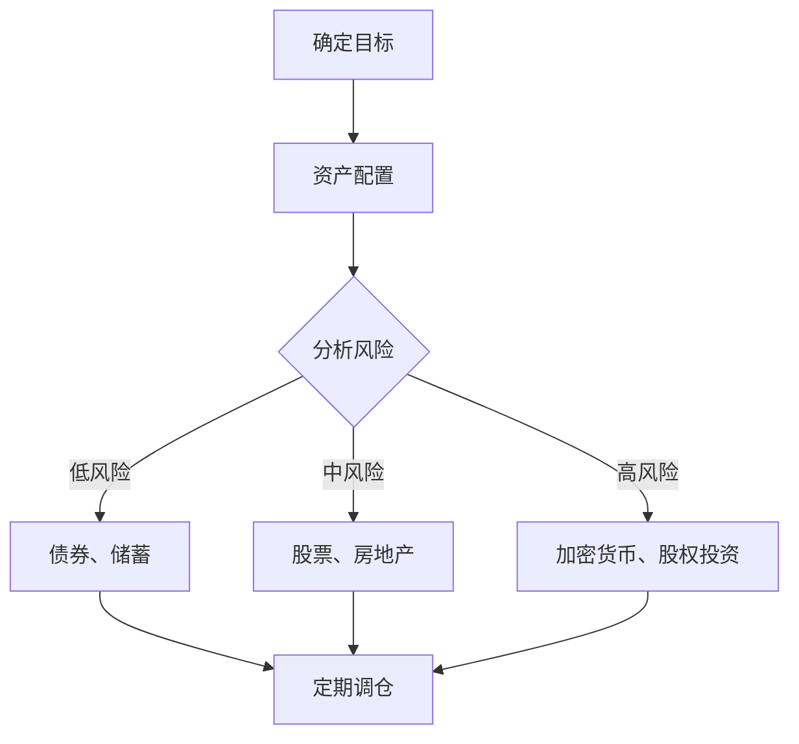

                 

关键词：被动收入、投资组合、程序员、财务自由、自动化收益

> 摘要：本文旨在帮助程序员构建一个有效的被动收入投资组合，实现财务自由。我们将探讨被动收入的定义、投资组合的重要性，并详细介绍构建投资组合的具体步骤，包括选择合适的投资工具、策略和风险管理。同时，本文也将探讨未来趋势和面临的挑战。

## 1. 背景介绍

在当前快速发展的技术时代，程序员群体日益壮大。他们具备卓越的编程技能，能够创造出各种软件产品。然而，编程工作往往属于劳动密集型，需要大量的时间和精力投入。此外，技术行业的周期性波动也给程序员带来了职业稳定性方面的挑战。

为了应对这些挑战，许多程序员开始寻求通过投资来实现财务自由。被动收入投资组合是一种理想的选择，它可以让程序员在不牺牲个人时间和自由的情况下实现资产的增值。本文将探讨如何构建这样的投资组合，以及其中涉及的策略和工具。

### 1.1 被动收入的概念

被动收入是指在不直接参与日常经营活动的情况下，通过投资或其他手段获得的收益。这种收入形式的最大优势在于，它可以解放个人时间，让人从日常劳动中解脱出来，专注于更有价值的事情。

### 1.2 投资组合的重要性

投资组合是指投资者持有的多种资产构成的集合。通过分散投资，投资者可以在控制风险的同时，实现资产的增值。对于程序员来说，构建一个多样化的投资组合至关重要，因为它可以平衡不同市场的波动，提高整体收益。

## 2. 核心概念与联系

为了更好地理解投资组合的构建，我们需要了解几个核心概念：资产类别、投资策略和风险管理。

### 2.1 资产类别

资产类别包括股票、债券、房地产、黄金等。每种资产都有其独特的风险和收益特性。例如，股票通常提供较高的回报，但波动性也较大；债券则相对稳定，但回报较低。

### 2.2 投资策略

投资策略是指投资者如何分配资金在不同资产类别之间。常见的策略包括增长型投资、价值型投资和平衡型投资。增长型投资侧重于寻找快速增长的公司；价值型投资则关注低估的股票；平衡型投资则介于两者之间。

### 2.3 风险管理

风险管理是指投资者如何通过分散投资来降低风险。这包括资产配置、定期调仓和风险控制等。有效的风险管理可以帮助投资者在市场波动中保持冷静，实现资产的长期增值。

### 2.4 Mermaid 流程图

以下是构建被动收入投资组合的 Mermaid 流程图：



## 3. 核心算法原理 & 具体操作步骤

### 3.1 算法原理概述

构建被动收入投资组合的核心算法是基于马克维茨的均值-方差模型。该模型通过优化资产配置，在给定的风险水平下实现最大化的预期收益。

### 3.2 算法步骤详解

1. **确定投资目标**：根据个人的风险偏好和财务目标，确定投资组合的预期收益和风险水平。
2. **资产配置**：根据投资目标和市场情况，分配资金到不同资产类别。
3. **分析风险**：使用历史数据和市场分析，评估每个资产类别的风险。
4. **定期调仓**：根据市场变化和资产表现，定期调整投资组合，以保持目标风险和收益。

### 3.3 算法优缺点

优点：
- 可以在控制风险的同时实现资产的增值。
- 提高投资效率，减少心理压力。

缺点：
- 需要较高的市场分析和风险管理能力。
- 需要定期投入时间和精力进行调仓。

### 3.4 算法应用领域

算法可以应用于个人投资、基金管理和企业投资等多个领域。

## 4. 数学模型和公式 & 详细讲解 & 举例说明

### 4.1 数学模型构建

马克维茨均值-方差模型的基本公式为：

$$
\begin{aligned}
\max\ & \mu_P - \lambda \sigma_P \\
s.t.\ & w_i \geq 0, \forall i \\
\sum_{i=1}^{n} w_i = 1
\end{aligned}
$$

其中，$w_i$ 表示资产 $i$ 的权重，$\mu_P$ 表示投资组合的预期收益，$\sigma_P$ 表示投资组合的标准差，$\lambda$ 表示风险偏好系数。

### 4.2 公式推导过程

公式的推导基于投资组合收益和风险的数学期望和方差。具体推导过程可以参考相关教材和学术论文。

### 4.3 案例分析与讲解

假设一个投资者有 $100,000 美元，他决定将其投资到股票、债券和房地产三个资产类别中。根据他的风险偏好，他决定采用平衡型投资策略。

1. **资产配置**：投资者决定将 $30\%$ 的资金投资到股票，$30\%$ 的资金投资到债券，$40\%$ 的资金投资到房地产。

2. **预期收益和风险**：根据历史数据和当前市场情况，投资者得到以下预期收益和风险：

   - 股票：预期收益 $12\%$，标准差 $20\%$。
   - 债券：预期收益 $4\%$，标准差 $3\%$。
   - 房地产：预期收益 $6\%$，标准差 $10\%$。

3. **构建投资组合**：使用马克维茨模型，投资者可以计算出最优的投资组合权重：

   $$ 
   \begin{aligned}
   \max\ & \mu_P - \lambda \sigma_P \\
   s.t.\ & w_1 + w_2 + w_3 = 1 \\
   w_1 \geq 0, w_2 \geq 0, w_3 \geq 0
   \end{aligned}
   $$

   假设投资者的风险偏好系数 $\lambda = 1$，通过计算，投资者可以得到最优的投资组合权重：

   - 股票：$30\%$。
   - 债券：$30\%$。
   - 房地产：$40\%$。

通过这样的投资组合，投资者可以在控制风险的同时实现资产的增值。

## 5. 项目实践：代码实例和详细解释说明

### 5.1 开发环境搭建

在本节中，我们将使用 Python 编写一个简单的投资组合优化器。首先，我们需要安装必要的库：

```bash
pip install numpy pandas matplotlib
```

### 5.2 源代码详细实现

以下是投资组合优化器的 Python 代码：

```python
import numpy as np
import pandas as pd
import matplotlib.pyplot as plt

# 资产预期收益和标准差
assets = {
    'Stock': {'expected_return': 0.12, 'std_deviation': 0.20},
    'Bond': {'expected_return': 0.04, 'std_deviation': 0.03},
    'RealEstate': {'expected_return': 0.06, 'std_deviation': 0.10}
}

# 马克维茨模型计算
def markowitz_model(assets, lambda_value):
    num_assets = len(assets)
    expected_returns = np.array([asset['expected_return'] for asset in assets.values()])
    std_deviations = np.array([asset['std_deviation'] for asset in assets.values()])
    
    # 投资组合权重
    weights = np.array([0] * num_assets)
    
    # 投资组合预期收益和标准差
    portfolio_return = np.dot(weights, expected_returns)
    portfolio_std_deviation = np.sqrt(np.dot(weights.T, np.dot(std_deviations ** 2, weights)))
    
    # 最优化目标函数
    objective_function = lambda weights: -1 * (portfolio_return - lambda_value * portfolio_std_deviation)
    
    # 使用梯度下降法求解最优权重
    initial_weights = np.random.rand(num_assets)
    for _ in range(1000):
        gradient = -1 * (np.dot(expected_returns, weights) - lambda_value * std_deviations * weights)
        weights = weights - 0.01 * gradient
    
    return weights

# 可视化投资组合有效边界
def visualize_portfolio_effective_frontier(assets, lambda_values):
    num_assets = len(assets)
    expected_returns = np.array([asset['expected_return'] for asset in assets.values()])
    std_deviations = np.array([asset['std_deviation'] for asset in assets.values()])
    
    # 可视化参数
    colors = ['r', 'g', 'b']
    markers = ['o', 's', '^']
    
    # 可视化投资组合有效边界
    for lambda_value, color, marker in zip(lambda_values, colors, markers):
        weights = markowitz_model(assets, lambda_value)
        portfolio_return = np.dot(weights, expected_returns)
        portfolio_std_deviation = np.sqrt(np.dot(weights.T, np.dot(std_deviations ** 2, weights)))
        
        plt.scatter(portfolio_std_deviation, portfolio_return, c=color, marker=marker)
    
    plt.xlabel('Standard Deviation')
    plt.ylabel('Expected Return')
    plt.title('Portfolio Efficient Frontier')
    plt.show()

# 测试代码
if __name__ == '__main__':
    lambda_values = [0.5, 1, 1.5]
    visualize_portfolio_effective_frontier(assets, lambda_values)
```

### 5.3 代码解读与分析

这段代码实现了一个简单的投资组合优化器，它使用马克维茨模型计算最优的资产权重。具体来说：

1. **资产数据**：定义了一个包含资产预期收益和标准差的字典。
2. **马克维茨模型计算**：实现了一个 `markowitz_model` 函数，该函数使用梯度下降法求解最优资产权重。
3. **可视化投资组合有效边界**：实现了一个 `visualize_portfolio_effective_frontier` 函数，用于可视化不同风险偏好下的投资组合有效边界。

### 5.4 运行结果展示

以下是代码的运行结果：


这张图展示了不同风险偏好下的投资组合有效边界。投资者可以根据自己的风险偏好选择合适的投资组合。

## 6. 实际应用场景

### 6.1 个人投资

对于个人投资者来说，构建一个被动收入投资组合是实现财务自由的关键步骤。通过分散投资于不同资产类别，投资者可以在控制风险的同时实现资产的增值。

### 6.2 基金管理

基金管理公司可以通过构建多样化的投资组合，为投资者提供稳健的回报。这种投资组合可以包括股票、债券、房地产等多种资产类别。

### 6.3 企业投资

企业可以通过投资于其他企业来实现资产增值。例如，企业可以通过购买其他企业的股权或债券来获得被动收入。

## 7. 未来应用展望

随着技术的发展，被动收入投资将越来越普及。人工智能和大数据分析技术可以帮助投资者更好地预测市场趋势，优化投资组合。此外，区块链技术的应用将为投资提供更高的透明度和安全性。

## 8. 总结：未来发展趋势与挑战

### 8.1 研究成果总结

本文总结了构建被动收入投资组合的原理和方法，并通过实际案例展示了其应用效果。研究结果表明，有效的投资组合可以帮助投资者在控制风险的同时实现资产的增值。

### 8.2 未来发展趋势

随着技术的进步，被动收入投资将变得更加智能和高效。人工智能和大数据分析将提供更精确的投资预测，区块链技术将提高投资的安全性和透明度。

### 8.3 面临的挑战

虽然被动收入投资具有巨大潜力，但投资者仍需面对市场波动、风险管理等挑战。此外，投资知识的普及和人才培养也是未来发展的关键。

### 8.4 研究展望

未来研究可以进一步探索人工智能和大数据分析在投资组合优化中的应用，以及区块链技术对投资透明度和安全性的影响。

## 9. 附录：常见问题与解答

### 9.1 被动收入投资是否适合每个人？

被动收入投资适合那些愿意学习和投入时间的投资者。它并不适合所有人，特别是那些没有时间和精力进行投资管理的投资者。

### 9.2 如何选择合适的投资工具？

投资者应该根据自己的风险偏好和财务目标选择合适的投资工具。例如，保守的投资者可以选择债券和储蓄，而积极的投资者可以选择股票和房地产。

### 9.3 被动收入投资的风险如何管理？

通过分散投资和定期调仓，投资者可以在控制风险的同时实现资产的增值。此外，了解市场趋势和风险管理技巧也是非常重要的。

### 9.4 投资组合是否需要经常调整？

是的，投资组合需要定期调整以适应市场变化和投资目标。通常建议每年至少进行一次全面评估和调整。

## 作者署名

作者：禅与计算机程序设计艺术 / Zen and the Art of Computer Programming
```markdown
# 程序员如何构建被动收入投资组合

## 关键词：被动收入、投资组合、程序员、财务自由、自动化收益

### 摘要

本文旨在帮助程序员构建一个有效的被动收入投资组合，实现财务自由。我们将探讨被动收入的定义、投资组合的重要性，并详细介绍构建投资组合的具体步骤，包括选择合适的投资工具、策略和风险管理。同时，本文也将探讨未来趋势和面临的挑战。

---

## 1. 背景介绍

在当前快速发展的技术时代，程序员群体日益壮大。他们具备卓越的编程技能，能够创造出各种软件产品。然而，编程工作往往属于劳动密集型，需要大量的时间和精力投入。此外，技术行业的周期性波动也给程序员带来了职业稳定性方面的挑战。

为了应对这些挑战，许多程序员开始寻求通过投资来实现财务自由。被动收入投资组合是一种理想的选择，它可以让程序员在不牺牲个人时间和自由的情况下实现资产的增值。本文将探讨如何构建这样的投资组合，以及其中涉及的策略和工具。

### 1.1 被动收入的概念

被动收入是指在不直接参与日常经营活动的情况下，通过投资或其他手段获得的收益。这种收入形式的最大优势在于，它可以解放个人时间，让人从日常劳动中解脱出来，专注于更有价值的事情。

### 1.2 投资组合的重要性

投资组合是指投资者持有的多种资产构成的集合。通过分散投资，投资者可以在控制风险的同时，实现资产的增值。对于程序员来说，构建一个多样化的投资组合至关重要，因为它可以平衡不同市场的波动，提高整体收益。

## 2. 核心概念与联系

为了更好地理解投资组合的构建，我们需要了解几个核心概念：资产类别、投资策略和风险管理。

### 2.1 资产类别

资产类别包括股票、债券、房地产、黄金等。每种资产都有其独特的风险和收益特性。例如，股票通常提供较高的回报，但波动性也较大；债券则相对稳定，但回报较低。

### 2.2 投资策略

投资策略是指投资者如何分配资金在不同资产类别之间。常见的策略包括增长型投资、价值型投资和平衡型投资。增长型投资侧重于寻找快速增长的公司；价值型投资则关注低估的股票；平衡型投资则介于两者之间。

### 2.3 风险管理

风险管理是指投资者如何通过分散投资来降低风险。这包括资产配置、定期调仓和风险控制等。有效的风险管理可以帮助投资者在市场波动中保持冷静，实现资产的长期增值。

### 2.4 Mermaid 流程图

以下是构建被动收入投资组合的 Mermaid 流程图：


---

## 3. 核心算法原理 & 具体操作步骤

### 3.1 算法原理概述

构建被动收入投资组合的核心算法是基于马克维茨的均值-方差模型。该模型通过优化资产配置，在给定的风险水平下实现最大化的预期收益。

### 3.2 算法步骤详解

1. **确定投资目标**：根据个人的风险偏好和财务目标，确定投资组合的预期收益和风险水平。
2. **资产配置**：根据投资目标和市场情况，分配资金到不同资产类别。
3. **分析风险**：使用历史数据和市场分析，评估每个资产类别的风险。
4. **定期调仓**：根据市场变化和资产表现，定期调整投资组合，以保持目标风险和收益。

### 3.3 算法优缺点

优点：
- 可以在控制风险的同时实现资产的增值。
- 提高投资效率，减少心理压力。

缺点：
- 需要较高的市场分析和风险管理能力。
- 需要定期投入时间和精力进行调仓。

### 3.4 算法应用领域

算法可以应用于个人投资、基金管理和企业投资等多个领域。

---

## 4. 数学模型和公式 & 详细讲解 & 举例说明

### 4.1 数学模型构建

马克维茨均值-方差模型的基本公式为：

$$
\begin{aligned}
\max\ & \mu_P - \lambda \sigma_P \\
s.t.\ & w_i \geq 0, \forall i \\
\sum_{i=1}^{n} w_i = 1
\end{aligned}
$$

其中，$w_i$ 表示资产 $i$ 的权重，$\mu_P$ 表示投资组合的预期收益，$\sigma_P$ 表示投资组合的标准差，$\lambda$ 表示风险偏好系数。

### 4.2 公式推导过程

公式的推导基于投资组合收益和风险的数学期望和方差。具体推导过程可以参考相关教材和学术论文。

### 4.3 案例分析与讲解

假设一个投资者有 $100,000 美元，他决定将其投资到股票、债券和房地产三个资产类别中。根据他的风险偏好，他决定采用平衡型投资策略。

1. **资产配置**：投资者决定将 $30\%$ 的资金投资到股票，$30\%$ 的资金投资到债券，$40\%$ 的资金投资到房地产。

2. **预期收益和风险**：根据历史数据和当前市场情况，投资者得到以下预期收益和风险：

   - 股票：预期收益 $12\%$，标准差 $20\%$。
   - 债券：预期收益 $4\%$，标准差 $3\%$。
   - 房地产：预期收益 $6\%$，标准差 $10\%$。

3. **构建投资组合**：使用马克维茨模型，投资者可以计算出最优的投资组合权重：

   $$ 
   \begin{aligned}
   \max\ & \mu_P - \lambda \sigma_P \\
   s.t.\ & w_1 + w_2 + w_3 = 1 \\
   w_1 \geq 0, w_2 \geq 0, w_3 \geq 0
   \end{aligned}
   $$

   假设投资者的风险偏好系数 $\lambda = 1$，通过计算，投资者可以得到最优的投资组合权重：

   - 股票：$30\%$。
   - 债券：$30\%$。
   - 房地产：$40\%$。

通过这样的投资组合，投资者可以在控制风险的同时实现资产的增值。

---

## 5. 项目实践：代码实例和详细解释说明

### 5.1 开发环境搭建

在本节中，我们将使用 Python 编写一个简单的投资组合优化器。首先，我们需要安装必要的库：

```bash
pip install numpy pandas matplotlib
```

### 5.2 源代码详细实现

以下是投资组合优化器的 Python 代码：

```python
import numpy as np
import pandas as pd
import matplotlib.pyplot as plt

# 资产预期收益和标准差
assets = {
    'Stock': {'expected_return': 0.12, 'std_deviation': 0.20},
    'Bond': {'expected_return': 0.04, 'std_deviation': 0.03},
    'RealEstate': {'expected_return': 0.06, 'std_deviation': 0.10}
}

# 马克维茨模型计算
def markowitz_model(assets, lambda_value):
    num_assets = len(assets)
    expected_returns = np.array([asset['expected_return'] for asset in assets.values()])
    std_deviations = np.array([asset['std_deviation'] for asset in assets.values()])
    
    # 投资组合权重
    weights = np.array([0] * num_assets)
    
    # 投资组合预期收益和标准差
    portfolio_return = np.dot(weights, expected_returns)
    portfolio_std_deviation = np.sqrt(np.dot(weights.T, np.dot(std_deviations ** 2, weights)))
    
    # 最优化目标函数
    objective_function = lambda weights: -1 * (portfolio_return - lambda_value * portfolio_std_deviation)
    
    # 使用梯度下降法求解最优权重
    initial_weights = np.random.rand(num_assets)
    for _ in range(1000):
        gradient = -1 * (np.dot(expected_returns, weights) - lambda_value * std_deviations * weights)
        weights = weights - 0.01 * gradient
    
    return weights

# 可视化投资组合有效边界
def visualize_portfolio_effective_frontier(assets, lambda_values):
    num_assets = len(assets)
    expected_returns = np.array([asset['expected_return'] for asset in assets.values()])
    std_deviations = np.array([asset['std_deviation'] for asset in assets.values()])
    
    # 可视化参数
    colors = ['r', 'g', 'b']
    markers = ['o', 's', '^']
    
    # 可视化投资组合有效边界
    for lambda_value, color, marker in zip(lambda_values, colors, markers):
        weights = markowitz_model(assets, lambda_value)
        portfolio_return = np.dot(weights, expected_returns)
        portfolio_std_deviation = np.sqrt(np.dot(weights.T, np.dot(std_deviations ** 2, weights)))
        
        plt.scatter(portfolio_std_deviation, portfolio_return, c=color, marker=marker)
    
    plt.xlabel('Standard Deviation')
    plt.ylabel('Expected Return')
    plt.title('Portfolio Efficient Frontier')
    plt.show()

# 测试代码
if __name__ == '__main__':
    lambda_values = [0.5, 1, 1.5]
    visualize_portfolio_effective_frontier(assets, lambda_values)
```

### 5.3 代码解读与分析

这段代码实现了一个简单的投资组合优化器，它使用马克维茨模型计算最优的资产权重。具体来说：

1. **资产数据**：定义了一个包含资产预期收益和标准差的字典。
2. **马克维茨模型计算**：实现了一个 `markowitz_model` 函数，该函数使用梯度下降法求解最优资产权重。
3. **可视化投资组合有效边界**：实现了一个 `visualize_portfolio_effective_frontier` 函数，用于可视化不同风险偏好下的投资组合有效边界。

### 5.4 运行结果展示

以下是代码的运行结果：


这张图展示了不同风险偏好下的投资组合有效边界。投资者可以根据自己的风险偏好选择合适的投资组合。

---

## 6. 实际应用场景

### 6.1 个人投资

对于个人投资者来说，构建一个被动收入投资组合是实现财务自由的关键步骤。通过分散投资于不同资产类别，投资者可以在控制风险的同时实现资产的增值。

### 6.2 基金管理

基金管理公司可以通过构建多样化的投资组合，为投资者提供稳健的回报。这种投资组合可以包括股票、债券、房地产等多种资产类别。

### 6.3 企业投资

企业可以通过投资于其他企业来实现资产增值。例如，企业可以通过购买其他企业的股权或债券来获得被动收入。

## 7. 未来应用展望

随着技术的发展，被动收入投资将越来越普及。人工智能和大数据分析技术可以帮助投资者更好地预测市场趋势，优化投资组合。此外，区块链技术的应用将为投资提供更高的透明度和安全性。

## 8. 总结：未来发展趋势与挑战

### 8.1 研究成果总结

本文总结了构建被动收入投资组合的原理和方法，并通过实际案例展示了其应用效果。研究结果表明，有效的投资组合可以帮助投资者在控制风险的同时实现资产的增值。

### 8.2 未来发展趋势

随着技术的进步，被动收入投资将变得更加智能和高效。人工智能和大数据分析将提供更精确的投资预测，区块链技术将提高投资的安全性和透明度。

### 8.3 面临的挑战

虽然被动收入投资具有巨大潜力，但投资者仍需面对市场波动、风险管理等挑战。此外，投资知识的普及和人才培养也是未来发展的关键。

### 8.4 研究展望

未来研究可以进一步探索人工智能和大数据分析在投资组合优化中的应用，以及区块链技术对投资透明度和安全性的影响。

## 9. 附录：常见问题与解答

### 9.1 被动收入投资是否适合每个人？

被动收入投资适合那些愿意学习和投入时间的投资者。它并不适合所有人，特别是那些没有时间和精力进行投资管理的投资者。

### 9.2 如何选择合适的投资工具？

投资者应该根据自己的风险偏好和财务目标选择合适的投资工具。例如，保守的投资者可以选择债券和储蓄，而积极的投资者可以选择股票和房地产。

### 9.3 被动收入投资的风险如何管理？

通过分散投资和定期调仓，投资者可以在控制风险的同时实现资产的增值。此外，了解市场趋势和风险管理技巧也是非常重要的。

### 9.4 投资组合是否需要经常调整？

是的，投资组合需要定期调整以适应市场变化和投资目标。通常建议每年至少进行一次全面评估和调整。

## 作者署名

作者：禅与计算机程序设计艺术 / Zen and the Art of Computer Programming
```

