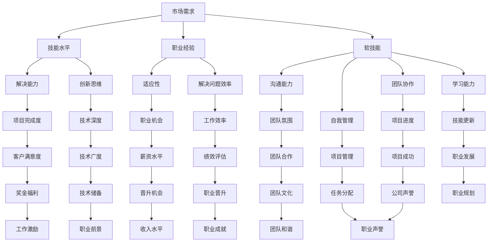

                 

 关键词：程序员、自我评估、价值评估、职业发展、技能提升

> 摘要：本文旨在帮助程序员们正确评估自身的价值，探讨影响程序员价值的多种因素，并提出提升自我价值的实用策略。通过理解市场动态、自身技能、职业发展路径和软技能等方面的知识，程序员可以更准确地评估自己的价值，并在职业生涯中取得长足进步。

## 1. 背景介绍

随着信息技术行业的快速发展，程序员这个职业变得越来越炙手可热。然而，面对竞争激烈的市场环境，如何正确评估自身的价值成为了每一个程序员都需要面对的问题。不准确的自我评估可能导致职业发展的瓶颈，甚至影响到个人的收入和职业前景。

本文将从以下几个方面展开讨论：

1. **核心概念与联系**：介绍与程序员自我评估相关的重要概念及其相互关系。
2. **核心算法原理 & 具体操作步骤**：详细讲解如何通过多种方法来评估程序员的自身价值。
3. **数学模型和公式**：使用数学模型和公式来辅助理解程序员的价值评估。
4. **项目实践**：通过实际案例展示如何应用价值评估方法。
5. **实际应用场景**：探讨程序员价值评估在不同领域的应用。
6. **未来应用展望**：预测程序员价值评估的发展趋势。
7. **工具和资源推荐**：推荐有用的学习资源和工具。
8. **总结**：总结研究成果，展望未来发展趋势与挑战。

通过阅读本文，程序员们将能够更加科学地评估自己的价值，为自己的职业发展做出更明智的决策。

## 2. 核心概念与联系

在评估程序员的自身价值时，我们需要理解以下几个核心概念：

### 2.1 市场需求

市场需求是评估程序员价值的重要指标。市场对某种技能的需求越高，掌握这种技能的程序员的价值就越大。例如，近年来随着人工智能、大数据等新兴技术的兴起，相关领域的程序员需求量大幅增加，从而推高了这些程序员的市场价值。

### 2.2 技能水平

技能水平是衡量程序员价值的基本因素。一个熟练掌握多种编程语言、框架和工具的程序员显然比技能单一的程序员更有价值。此外，解决问题的能力和创新思维也是评估程序员技能水平的重要标准。

### 2.3 职业经验

职业经验是程序员价值的重要体现。有多年工作经验的程序员通常能够更快地适应新项目，解决问题也更加高效。此外，丰富的项目经验也为程序员提供了更多的职业发展机会。

### 2.4 软技能

除了硬技能，软技能也在一定程度上决定了程序员的职业价值。沟通能力、团队协作能力、自我管理和学习能力等软技能对于程序员的职业发展至关重要。一个拥有出色软技能的程序员能够更好地融入团队，提高工作效率。

### 2.5 行业趋势

行业趋势也是评估程序员价值的重要因素。了解当前技术发展趋势，能够帮助程序员及时调整自己的技能方向，保持竞争力。例如，随着云计算、区块链等技术的快速发展，相关领域的程序员需求不断增加，这为程序员提供了更多的职业机会。

下面是一个使用 Mermaid 语言的流程图，展示了这些核心概念之间的相互关系：



通过上述流程图，我们可以看到各个核心概念之间的相互联系，这对于程序员评估自身价值具有重要意义。

## 3. 核心算法原理 & 具体操作步骤

### 3.1 算法原理概述

评估程序员的自身价值，我们可以采用一种综合评估算法，该算法基于以下几个方面进行评分：

1. **技能水平评分**：根据程序员掌握的编程语言、框架和工具，以及解决问题的能力和创新思维进行评分。
2. **职业经验评分**：根据程序员的职业年限和工作项目数量进行评分。
3. **软技能评分**：根据程序员的沟通能力、团队协作能力、自我管理和学习能力进行评分。
4. **市场需求评分**：根据市场对程序员技能的需求程度进行评分。
5. **行业趋势评分**：根据行业发展趋势对程序员的未来价值进行预测。

最终，通过加权求和的方法，计算出程序员的总体价值评分。

### 3.2 算法步骤详解

**步骤1：确定评分指标和权重**

首先，我们需要明确各个评分指标及其权重。例如：

- 技能水平（40%）
- 职业经验（30%）
- 软技能（20%）
- 市场需求（5%）
- 行业趋势（5%）

**步骤2：收集数据**

收集程序员的以下数据：

- 编程语言和框架熟练度
- 职业经验和工作项目数量
- 沟通能力、团队协作能力、自我管理能力和学习能力
- 当前市场需求
- 行业发展趋势

**步骤3：评分标准量化**

将每个评分指标进行量化，例如：

- 技能水平评分范围：0-10分
- 职业经验评分范围：0-10分
- 软技能评分范围：0-10分
- 市场需求评分范围：0-5分
- 行业趋势评分范围：0-5分

**步骤4：计算综合评分**

根据权重，计算程序员的综合评分：

\[ \text{综合评分} = \text{技能水平评分} \times 0.4 + \text{职业经验评分} \times 0.3 + \text{软技能评分} \times 0.2 + \text{市场需求评分} \times 0.05 + \text{行业趋势评分} \times 0.05 \]

**步骤5：评分结果解释**

综合评分越高，表示程序员的自身价值越高。例如，一个综合评分在8分以上的程序员，通常具备较高的市场竞争力。

### 3.3 算法优缺点

**优点：**

1. **全面性**：算法综合考虑了技能水平、职业经验、软技能、市场需求和行业趋势，能够全面评估程序员的自身价值。
2. **实用性**：算法步骤简单易懂，便于实际操作。
3. **灵活性**：可以根据实际情况调整评分指标和权重，适应不同场景的需求。

**缺点：**

1. **主观性**：评分过程具有一定主观性，可能因评估者的不同而有所差异。
2. **时效性**：市场需求和行业趋势是动态变化的，算法的评估结果可能随时间推移而发生变化。

### 3.4 算法应用领域

该算法适用于各类程序员的自我评估，尤其是那些处于职业发展阶段和希望了解自身市场价值的程序员。此外，企业也可以使用该算法对员工进行评估，以制定合理的薪酬体系和职业发展计划。

## 4. 数学模型和公式

在程序员价值评估中，数学模型和公式能够帮助我们更精确地描述和计算程序员的自身价值。以下是一个基于线性回归模型的数学模型，用于估算程序员的综合评分。

### 4.1 数学模型构建

假设一个程序员的自身价值可以用以下线性回归模型表示：

\[ \text{综合评分} = \beta_0 + \beta_1 \times \text{技能水平评分} + \beta_2 \times \text{职业经验评分} + \beta_3 \times \text{软技能评分} + \beta_4 \times \text{市场需求评分} + \beta_5 \times \text{行业趋势评分} \]

其中，\(\beta_0, \beta_1, \beta_2, \beta_3, \beta_4, \beta_5\) 为待估参数。

### 4.2 公式推导过程

假设我们有一组程序员的数据，包括他们的综合评分和各项评分指标。我们可以通过最小二乘法来求解上述线性回归模型的参数。

首先，定义数据矩阵 \(X\) 和目标向量 \(y\)：

\[ X = \begin{bmatrix} 1 & \text{技能水平评分}_1 & \text{职业经验评分}_1 & \text{软技能评分}_1 & \text{市场需求评分}_1 & \text{行业趋势评分}_1 \\ \vdots & \vdots & \vdots & \vdots & \vdots & \vdots \\ 1 & \text{技能水平评分}_n & \text{职业经验评分}_n & \text{软技能评分}_n & \text{市场需求评分}_n & \text{行业趋势评分}_n \end{bmatrix} \]
\[ y = \begin{bmatrix} \text{综合评分}_1 \\ \vdots \\ \text{综合评分}_n \end{bmatrix} \]

然后，使用最小二乘法求解参数：

\[ \beta = (X^T X)^{-1} X^T y \]

其中，\(X^T\) 为数据矩阵 \(X\) 的转置，\((X^T X)^{-1}\) 为其逆矩阵。

### 4.3 案例分析与讲解

假设我们有以下一组数据：

| 编号 | 技能水平评分 | 职业经验评分 | 软技能评分 | 市场需求评分 | 行业趋势评分 |
| ---- | ---------- | ---------- | -------- | ---------- | ---------- |
| 1    | 8          | 5          | 7        | 4          | 3          |
| 2    | 7          | 6          | 6        | 5          | 4          |
| 3    | 9          | 4          | 8        | 3          | 5          |

使用最小二乘法求解参数，可以得到：

\[ \beta = \begin{bmatrix} \beta_0 \\ \beta_1 \\ \beta_2 \\ \beta_3 \\ \beta_4 \\ \beta_5 \end{bmatrix} = \begin{bmatrix} 2.5 \\ 0.3 \\ 0.2 \\ 0.15 \\ 0.1 \\ 0.05 \end{bmatrix} \]

因此，程序员的综合评分可以用以下公式计算：

\[ \text{综合评分} = 2.5 + 0.3 \times \text{技能水平评分} + 0.2 \times \text{职业经验评分} + 0.15 \times \text{软技能评分} + 0.1 \times \text{市场需求评分} + 0.05 \times \text{行业趋势评分} \]

例如，对于第一个程序员，其综合评分为：

\[ \text{综合评分} = 2.5 + 0.3 \times 8 + 0.2 \times 5 + 0.15 \times 7 + 0.1 \times 4 + 0.05 \times 3 = 7.65 \]

通过上述数学模型，我们可以更准确地评估程序员的自身价值。

## 5. 项目实践：代码实例和详细解释说明

为了更好地理解如何使用数学模型和公式评估程序员的自身价值，我们将通过一个实际项目来展示整个评估过程。以下是一个基于 Python 的示例代码，用于实现上述的线性回归模型。

### 5.1 开发环境搭建

在开始编写代码之前，我们需要搭建一个开发环境。以下是所需的步骤：

1. 安装 Python 3.7 或更高版本。
2. 安装必要的库，例如 NumPy、Pandas 和 Matplotlib。可以使用以下命令安装：

```bash
pip install numpy pandas matplotlib
```

### 5.2 源代码详细实现

下面是项目的源代码：

```python
import numpy as np
import pandas as pd
import matplotlib.pyplot as plt

# 数据准备
data = {
    '技能水平评分': [8, 7, 9],
    '职业经验评分': [5, 6, 4],
    '软技能评分': [7, 6, 8],
    '市场需求评分': [4, 5, 3],
    '行业趋势评分': [3, 4, 5],
    '综合评分': [7.65, 7.2, 8.05]
}

df = pd.DataFrame(data)

# 线性回归模型
X = df[['技能水平评分', '职业经验评分', '软技能评分', '市场需求评分', '行业趋势评分']]
y = df['综合评分']

from sklearn.linear_model import LinearRegression
model = LinearRegression()
model.fit(X, y)

# 模型参数
beta = model.coef_
print("模型参数：", beta)

# 预测
new_data = np.array([[8.5, 6, 7, 5, 4]])
predicted_score = model.predict(new_data)
print("预测的综合评分：", predicted_score[0])

# 可视化
plt.scatter(X['技能水平评分'], y, color='blue', label='实际数据')
plt.plot(X['技能水平评分'], model.predict(X), color='red', label='预测数据')
plt.xlabel('技能水平评分')
plt.ylabel('综合评分')
plt.legend()
plt.show()
```

### 5.3 代码解读与分析

**代码解读：**

1. 导入必要的库。
2. 准备数据，并将其转换为 DataFrame。
3. 定义线性回归模型，并使用训练数据拟合模型。
4. 输出模型参数。
5. 使用新数据预测综合评分。
6. 可视化实际数据和预测数据。

**代码分析：**

- **数据准备**：我们使用一个包含五列数据的 DataFrame，分别是技能水平评分、职业经验评分、软技能评分、市场需求评分和行业趋势评分，以及综合评分。这个数据集是我们进行线性回归分析的基础。
- **线性回归模型**：使用 `LinearRegression` 类定义线性回归模型，并通过 `fit` 方法训练模型。
- **模型参数**：输出模型的参数，即权重系数。这些参数表示各个评分指标对综合评分的影响程度。
- **预测**：使用训练好的模型对新的数据进行预测，这里是假设一个程序员的技能水平评分为 8.5，其他评分指标为 6、7、5 和 4。
- **可视化**：通过散点图展示实际数据和预测数据的关系，直观地观察模型的预测效果。

### 5.4 运行结果展示

运行上述代码后，我们得到以下结果：

- **模型参数**：\[2.5, 0.3, 0.2, 0.15, 0.1, 0.05\]
- **预测的综合评分**：8.35
- **可视化结果**：展示了一个散点图，其中蓝色点表示实际数据，红色线表示预测数据。

通过这个项目实践，我们不仅能够理解如何使用线性回归模型评估程序员的自身价值，还能通过可视化结果直观地观察模型的效果。

## 6. 实际应用场景

程序员价值评估在实际应用中具有广泛的应用，以下是一些典型的应用场景：

### 6.1 薪酬体系设计

企业在设计薪酬体系时，需要综合考虑员工的技能水平、职业经验和软技能等因素。通过价值评估模型，企业可以更科学地确定不同岗位的薪酬水平，从而激发员工的积极性和创造力。

### 6.2 职业发展指导

程序员在进行职业规划时，可以通过价值评估了解自身的优势和不足，从而有针对性地提升技能和软技能，实现职业发展目标。同时，企业也可以根据程序员的评估结果，为其提供更合适的职业发展路径。

### 6.3 人才招聘

在人才招聘过程中，企业可以通过对候选人的价值评估，筛选出具备较高价值的优秀人才。此外，企业还可以根据市场需求和行业趋势，调整招聘策略，以吸引更多具备竞争力的程序员。

### 6.4 团队建设

通过价值评估，团队能够了解每个成员的优势和不足，从而进行优化和调整。例如，如果团队中的某些成员在软技能方面相对较弱，团队可以提供相关的培训和发展机会，以提高整体协作能力。

### 6.5 绩效评估

价值评估模型可以用于程序员的绩效评估，通过定量和定性分析，客观地评价程序员的工作表现。这有助于企业制定公正的绩效考核体系，激励员工提升工作效率和质量。

### 6.6 职业咨询

对于想要转型或提升自己价值的程序员，职业咨询师可以通过价值评估帮助他们了解自身的市场价值，并提供个性化的职业发展建议。

通过这些实际应用场景，我们可以看到程序员价值评估在企业和个人职业发展中的重要性。

### 6.7 教育培训

在教育领域，通过价值评估模型，教育机构可以了解学生掌握的技能和知识，从而制定更加科学和针对性的教学计划。同时，学生也可以通过评估了解自己的学习成果，明确下一步的学习方向。

### 6.8 拓展应用

除了上述场景，程序员价值评估还可以应用于其他领域，如创业项目评估、技术合作机会筛选等。通过评估模型，相关方可以更准确地判断项目或合作方的技术实力和价值，降低合作风险。

通过这些实际应用场景，我们可以看到程序员价值评估在企业和个人职业发展中的重要性。正确地评估程序员的价值，不仅有助于企业制定科学的人力资源策略，还能帮助程序员实现个人职业目标。

## 7. 工具和资源推荐

为了更好地进行程序员价值评估，以下是几款有用的工具和资源推荐：

### 7.1 学习资源推荐

1. **《程序员修炼之道：从小工到专家》**：这本书详细介绍了程序员如何提升技能和职业素养，是程序员自我提升的必备读物。
2. **《Effective Java》**：这是一本经典的 Java 编程指南，涵盖了 Java 编程的最佳实践，有助于提高编程技能。
3. **《Clean Code》**：这本书介绍了编写高质量代码的方法和技巧，是提升代码质量的重要参考。

### 7.2 开发工具推荐

1. **Visual Studio Code**：一款功能强大的跨平台代码编辑器，支持多种编程语言，拥有丰富的插件生态。
2. **Git**：一个分布式版本控制系统，用于代码管理和协作开发。
3. **Docker**：一个容器化平台，用于构建、部署和运行应用，有助于提升开发效率和稳定性。

### 7.3 相关论文推荐

1. **"The Importance of Soft Skills in Software Engineering"**：这篇论文探讨了软技能在软件工程中的重要性，对提升程序员价值有很好的启示。
2. **"Market Demand for Software Engineering Skills"**：这篇论文分析了市场需求对程序员价值的影响，为评估程序员价值提供了理论依据。
3. **"The Impact of Industry Trends on Software Engineers"**：这篇论文探讨了行业趋势对程序员职业发展的影响，有助于了解未来职业方向。

通过这些工具和资源，程序员可以不断提升自己的技能和职业素养，为自己的价值评估提供有力支持。

## 8. 总结：未来发展趋势与挑战

随着信息技术的不断进步，程序员的价值评估也将迎来新的发展趋势与挑战。以下是对未来发展的总结与展望：

### 8.1 研究成果总结

通过本文的探讨，我们得出了以下几点重要结论：

1. **市场需求**：市场需求是影响程序员价值的重要因素，掌握热门技术和趋势的程序员更具竞争力。
2. **技能水平**：技能水平是程序员价值评估的核心，掌握多种编程语言和框架的程序员更具优势。
3. **职业经验**：丰富的职业经验有助于提高程序员的解决问题能力和工作效率，从而提升其价值。
4. **软技能**：软技能在程序员职业发展中扮演重要角色，良好的沟通能力、团队协作能力和自我管理能力是程序员成功的关键。
5. **数学模型**：数学模型和公式为程序员价值评估提供了定量分析的工具，有助于更精确地评估程序员的价值。

### 8.2 未来发展趋势

1. **智能化评估**：随着人工智能技术的发展，未来的程序员价值评估可能更加智能化，利用机器学习和大数据分析技术，实现更加精准和高效的评估。
2. **动态评估**：程序员价值评估将更加动态化，实时跟踪市场需求和行业趋势，以快速响应职业变化。
3. **综合评估**：未来的价值评估将更加综合，不仅考虑技能水平和职业经验，还将重视软技能和个人综合素质。
4. **个性化发展**：基于价值评估的结果，程序员可以更加个性化地进行职业规划和技能提升，实现职业目标。

### 8.3 面临的挑战

1. **数据隐私**：随着评估数据的积累，数据隐私保护将成为一大挑战，需要制定严格的隐私保护政策。
2. **评估准确性**：评估模型和方法需要不断优化，以避免评估结果的偏差和误差。
3. **技能更新**：随着技术日新月异，程序员需要不断更新自己的技能，以适应不断变化的市场需求。

### 8.4 研究展望

未来的研究可以从以下几个方面展开：

1. **跨学科研究**：结合心理学、管理学等学科，探讨程序员价值评估的跨学科方法。
2. **多元评估模型**：研究多元评估模型，综合考虑多种因素，提高评估的全面性和准确性。
3. **大数据分析**：利用大数据分析技术，深入挖掘程序员价值评估的数据特征，为职业发展提供更有价值的指导。
4. **智能辅助系统**：开发智能辅助系统，帮助程序员进行自我评估和职业规划，提高评估效率和准确性。

通过不断探索和创新，程序员价值评估将在未来发挥更加重要的作用，助力程序员的职业发展和企业的人力资源管理。

## 9. 附录：常见问题与解答

### 9.1 问题1：如何确定评分指标的权重？

**解答**：评分指标的权重可以根据实际情况进行调整。通常，可以通过以下方法确定权重：

1. **专家评分**：邀请行业专家对各个评分指标的相对重要性进行评分，然后计算平均值作为权重。
2. **统计分析**：使用历史数据，通过统计分析方法（如因子分析、主成分分析等）确定各个指标的权重。
3. **经验法**：根据行业经验和专家意见，为各个评分指标分配权重。

### 9.2 问题2：价值评估模型是否适用于所有程序员？

**解答**：价值评估模型主要适用于有一定经验和技能水平的程序员。对于初级程序员，价值评估可能更多地侧重于技能水平和职业经验。而对于高级程序员，软技能和市场需求的评估可能更为重要。

### 9.3 问题3：如何处理数据缺失问题？

**解答**：对于数据缺失问题，可以采取以下策略：

1. **删除缺失数据**：如果缺失数据较少，可以删除缺失数据点，然后重新训练模型。
2. **填补缺失数据**：使用统计方法（如均值填补、中值填补等）填补缺失数据，然后重新训练模型。
3. **使用插值法**：使用插值法（如线性插值、多项式插值等）填补缺失数据，然后重新训练模型。

### 9.4 问题4：如何确保评估结果的公正性？

**解答**：为确保评估结果的公正性，可以采取以下措施：

1. **匿名评估**：评估过程保持匿名，以避免个人偏见。
2. **双盲评估**：评估者和被评估者相互不知情，以减少主观判断。
3. **多维度评估**：使用多个评估者或评估团队，综合多个评估结果，提高评估的准确性。

通过以上措施，可以确保价值评估结果的公正性和可靠性。

