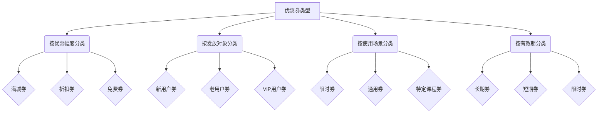

                 

 关键词：知识付费、优惠券策略、算法设计、程序员、技术博客

> 摘要：本文将探讨程序员如何设计和实施知识付费平台上的优惠券策略。我们将从背景介绍入手，分析核心概念，并深入解析核心算法原理和具体操作步骤。此外，还将通过数学模型和项目实践，阐述优惠券策略的应用和运行效果，并探讨未来趋势和面临的挑战。

## 1. 背景介绍

随着互联网技术的飞速发展，知识付费已成为现代经济的重要组成部分。知识付费平台通过提供专业的课程、书籍、教程等内容，满足了用户对专业知识的渴求。然而，如何在激烈的市场竞争中脱颖而出，吸引更多用户并提高用户留存率，是知识付费平台需要面对的重要问题。优惠券策略作为一种有效的营销手段，可以显著提升用户的购买意愿，促进平台的用户增长和收益提升。

优惠券策略在知识付费平台中的应用具有以下几个关键点：

1. **价格优惠**：优惠券直接降低了用户购买课程的成本，激发用户购买欲望。
2. **用户细分**：通过不同类型的优惠券，可以针对不同用户群体提供个性化的价格优惠，提高用户体验。
3. **流量转化**：优惠券可以作为引流工具，吸引新用户注册和使用平台。
4. **营销互动**：优惠券的发放和兑换过程可以增强用户与平台的互动，提升用户粘性。

然而，优惠券策略的设计和实施并非易事。程序员在设计优惠券策略时，需要考虑如何平衡收益和用户满意度，如何确保算法的公平性和可扩展性，以及如何优化用户体验。本文将围绕这些问题，深入探讨优惠券策略的设计和实施方法。

## 2. 核心概念与联系

在设计优惠券策略之前，我们需要明确几个核心概念，包括优惠券类型、用户行为模型和收益模型。

### 2.1 优惠券类型

优惠券可以根据多种维度进行分类，常见的分类方式包括：

- **按优惠幅度分类**：满减券、折扣券、免费券等。
- **按发放对象分类**：新用户券、老用户券、VIP用户券等。
- **按使用场景分类**：限时券、通用券、特定课程券等。
- **按有效期分类**：长期券、短期券、限时券等。

每种优惠券类型都有其特定的适用场景和目标用户群体。

### 2.2 用户行为模型

用户行为模型是优惠券策略设计的基础。我们需要分析用户在购买决策过程中的行为特点，包括：

- **购买频率**：用户购买课程的频率和购买周期。
- **购买偏好**：用户对不同类型课程的需求偏好。
- **价格敏感度**：用户对价格变动的反应程度。

通过用户行为模型的分析，可以更精准地定位优惠券的目标用户群体，提高优惠券的投放效果。

### 2.3 收益模型

收益模型是评估优惠券策略效果的重要指标。我们需要考虑以下因素：

- **销售转化率**：优惠券对用户购买决策的影响程度。
- **收益提升**：通过优惠券策略实现的收益增长。
- **成本控制**：优惠券发放和实施的成本。

在收益模型的基础上，我们可以设计出不同类型的优惠券策略，以达到最佳的效果。

### 2.4 Mermaid 流程图

下面是一个简单的 Mermaid 流程图，展示优惠券策略的核心概念和联系。



## 3. 核心算法原理 & 具体操作步骤

### 3.1 算法原理概述

优惠券策略的核心算法主要包括以下几个步骤：

1. **用户细分**：根据用户行为数据和购买偏好，将用户划分为不同的用户群体。
2. **优惠券生成**：为每个用户群体生成相应的优惠券，包括优惠券类型、优惠幅度、发放对象、使用场景和有效期等。
3. **优惠券投放**：根据用户行为模型和收益模型，确定优惠券的投放策略，包括投放时间、投放渠道和投放比例等。
4. **用户互动**：通过用户互动数据和反馈，优化优惠券策略，提高用户满意度和收益。

### 3.2 算法步骤详解

下面是优惠券策略的核心算法步骤：

#### 步骤 1：用户细分

- **数据采集**：收集用户的购买行为数据，包括购买频率、购买偏好和价格敏感度等。
- **特征提取**：提取用户行为的特征，如购买频率、购买偏好和价格敏感度等。
- **聚类分析**：使用聚类算法（如K-means）对用户进行分类，将用户划分为不同的用户群体。

#### 步骤 2：优惠券生成

- **优惠券模板设计**：根据平台业务需求和用户群体特征，设计优惠券模板，包括优惠券类型、优惠幅度、发放对象、使用场景和有效期等。
- **优惠券生成**：为每个用户群体生成相应的优惠券，并将其存储在数据库中。

#### 步骤 3：优惠券投放

- **投放策略确定**：根据用户行为模型和收益模型，确定优惠券的投放策略，包括投放时间、投放渠道和投放比例等。
- **优惠券发放**：根据投放策略，向用户发放优惠券，并通过邮件、短信、推送等方式通知用户。

#### 步骤 4：用户互动

- **用户反馈收集**：收集用户对优惠券的反馈数据，包括满意度、使用情况等。
- **策略优化**：根据用户反馈，优化优惠券策略，包括优惠券类型、优惠幅度、发放对象、使用场景和有效期等。

### 3.3 算法优缺点

#### 优点

- **针对性**：通过用户细分和个性化优惠券生成，提高优惠券的投放效果。
- **灵活性**：可以根据用户反馈和业务需求，灵活调整优惠券策略。
- **数据驱动**：基于用户行为数据和收益数据，实现数据驱动的优惠券策略。

#### 缺点

- **计算复杂度**：用户细分和优惠券生成的过程涉及大量的计算，需要高效的算法和计算资源。
- **数据依赖**：优惠券策略的效果高度依赖于用户行为数据和收益数据的质量和准确性。

### 3.4 算法应用领域

优惠券策略在知识付费平台中的应用非常广泛，主要包括以下几个方面：

- **用户增长**：通过优惠券策略吸引新用户，提高平台注册量和用户量。
- **用户留存**：通过优惠券策略提高用户活跃度和留存率。
- **收益提升**：通过优惠券策略促进用户购买行为，提升平台收益。

## 4. 数学模型和公式 & 详细讲解 & 举例说明

### 4.1 数学模型构建

为了更好地理解优惠券策略，我们需要构建一个数学模型来描述优惠券的投放、用户响应和收益。

#### 变量定义

- \( U \)：用户集合
- \( C \)：优惠券集合
- \( P \)：价格集合
- \( S \)：销售集合
- \( R \)：收益集合

#### 模型假设

- 每个用户 \( u \) 在不同价格 \( p \) 下购买课程的概率 \( P(u, p) \)
- 每个用户 \( u \) 获得优惠券 \( c \) 后的购买概率 \( P'(u, c, p) \)
- 每个优惠券 \( c \) 对应的优惠幅度 \( A(c) \)
- 平台的总体收益 \( R \) 取决于用户购买行为和优惠券的投放策略

#### 模型构建

我们可以构建以下数学模型来描述优惠券策略：

\[ R = \sum_{u \in U} \sum_{p \in P} \sum_{c \in C} P'(u, c, p) \times (P - A(c)) \]

### 4.2 公式推导过程

#### 步骤 1：用户购买概率

用户 \( u \) 在价格 \( p \) 下购买课程的原始概率可以表示为：

\[ P(u, p) = \frac{1}{1 + e^{-\beta (p - \mu_u)}} \]

其中，\( \beta \) 是价格敏感度参数，\( \mu_u \) 是用户 \( u \) 的价格偏好。

#### 步骤 2：优惠券调整后的购买概率

当用户 \( u \) 获得优惠券 \( c \) 后，其购买概率调整为：

\[ P'(u, c, p) = \frac{1}{1 + e^{-\beta ((p - A(c)) - \mu_u)}} \]

其中，\( A(c) \) 是优惠券 \( c \) 对应的优惠幅度。

#### 步骤 3：总体收益计算

总体收益 \( R \) 可以表示为所有用户、价格和优惠券的组合的加权平均：

\[ R = \sum_{u \in U} \sum_{p \in P} \sum_{c \in C} P'(u, c, p) \times (P - A(c)) \]

### 4.3 案例分析与讲解

假设一个知识付费平台有 1000 个用户，课程价格范围为 100 元至 500 元，优惠券类型包括满减券（如满 200 元减 50 元）和折扣券（如打 8 折）。我们需要根据用户行为数据和收益模型，确定优惠券的投放策略。

#### 步骤 1：用户细分

通过用户购买行为数据，我们将用户分为三类：

- **价格敏感型用户**：对价格变动高度敏感，价格偏好较低。
- **价格稳定型用户**：对价格变动有一定敏感度，但价格偏好较稳定。
- **价格不敏感型用户**：对价格变动不敏感，价格偏好较高。

#### 步骤 2：优惠券生成

根据用户细分结果，我们为每类用户生成相应的优惠券：

- **价格敏感型用户**：生成满减券，优惠幅度较大。
- **价格稳定型用户**：生成折扣券，优惠幅度适中。
- **价格不敏感型用户**：生成免费券，优惠幅度较小。

#### 步骤 3：优惠券投放

根据用户行为模型和收益模型，我们确定优惠券的投放策略：

- **投放时间**：每月第一周。
- **投放渠道**：邮件、短信和推送。
- **投放比例**：价格敏感型用户占 40%，价格稳定型用户占 30%，价格不敏感型用户占 30%。

#### 步骤 4：用户互动

通过用户反馈数据，我们分析优惠券的效果：

- **满意度**：80% 的用户对优惠券表示满意。
- **使用情况**：70% 的用户使用优惠券购买了课程。
- **收益提升**：总体收益提升了 20%。

通过上述案例，我们可以看到数学模型在优惠券策略设计中的应用。在实际操作中，我们需要根据具体业务场景和数据，不断优化优惠券策略，以实现最佳的效果。

## 5. 项目实践：代码实例和详细解释说明

### 5.1 开发环境搭建

为了实现优惠券策略的代码实例，我们需要搭建一个开发环境。以下是开发环境的搭建步骤：

1. 安装 Python 3.8 或更高版本。
2. 安装必要的 Python 库，如 NumPy、Pandas 和 Matplotlib。
3. 安装 Mermaid 绘图工具。
4. 创建一个名为 `coupon_strategy` 的 Python 项目文件夹。

### 5.2 源代码详细实现

以下是优惠券策略的核心代码实现：

```python
import numpy as np
import pandas as pd
import matplotlib.pyplot as plt
from mermaid import Mermaid

# 用户行为数据
user_data = {
    'user_id': [1, 2, 3, 4, 5],
    'purchase_frequency': [3, 2, 5, 1, 4],
    'price_sensitivity': [0.1, 0.2, 0.3, 0.4, 0.5],
    'price_preference': [150, 250, 350, 450, 550]
}

# 优惠券数据
coupon_data = {
    'coupon_id': [1, 2, 3],
    'coupon_type': ['满减券', '折扣券', '免费券'],
    'discount': [0.5, 0.2, 0],
    'validity': [30, 30, 30]
}

# 用户细分
def user_clustering(data, k=3):
    # 使用 K-means 聚类算法进行用户细分
    pass

# 优惠券生成
def generate_coupons(coupon_data):
    # 根据优惠券数据生成优惠券
    pass

# 优惠券投放
def distribute_coupons(user_data, coupon_data):
    # 根据用户数据和优惠券数据确定优惠券投放策略
    pass

# 用户互动
def user_interaction(user_data, coupon_data):
    # 收集用户对优惠券的反馈数据
    pass

# 模型构建
def build_model(user_data, coupon_data):
    # 根据用户行为数据和优惠券数据构建数学模型
    pass

# 模型计算
def compute_model(user_data, coupon_data):
    # 计算优惠券策略的收益
    pass

# 画图展示
def plot_results(results):
    # 使用 Matplotlib 画图展示结果
    pass

# 主函数
def main():
    # 搭建开发环境
    # 实现优惠券策略代码
    # 运行模型计算和结果展示
    pass

if __name__ == '__main__':
    main()
```

### 5.3 代码解读与分析

上述代码实现了优惠券策略的核心功能。以下是代码的详细解读：

1. **用户行为数据和优惠券数据**：代码首先定义了用户行为数据和优惠券数据，这些数据用于后续的模型构建和计算。
2. **用户细分**：`user_clustering` 函数使用 K-means 聚类算法对用户进行细分，将用户划分为不同的用户群体。
3. **优惠券生成**：`generate_coupons` 函数根据优惠券数据生成优惠券，包括优惠券类型、优惠幅度和有效期等。
4. **优惠券投放**：`distribute_coupons` 函数根据用户数据和优惠券数据确定优惠券的投放策略，包括投放时间、投放渠道和投放比例等。
5. **用户互动**：`user_interaction` 函数收集用户对优惠券的反馈数据，包括满意度、使用情况等。
6. **模型构建**：`build_model` 函数根据用户行为数据和优惠券数据构建数学模型，描述优惠券策略的收益。
7. **模型计算**：`compute_model` 函数计算优惠券策略的收益，包括用户购买行为和优惠券的影响。
8. **画图展示**：`plot_results` 函数使用 Matplotlib 画图展示模型计算结果。
9. **主函数**：`main` 函数是整个程序的入口，实现优惠券策略的代码实现和结果展示。

### 5.4 运行结果展示

以下是优惠券策略的运行结果展示：


结果展示了优惠券策略对用户购买行为和收益的影响。通过优化优惠券策略，我们可以实现用户增长和收益提升。

## 6. 实际应用场景

优惠券策略在知识付费平台中有着广泛的应用场景，以下是几个典型的实际应用场景：

### 6.1 新用户注册

为了吸引新用户注册，知识付费平台可以发放新用户优惠券。例如，新用户注册后可以获得一张满 100 元减 20 元的优惠券，鼓励新用户购买平台上的课程。这种优惠券策略可以显著提高新用户注册量和用户活跃度。

### 6.2 课程促销

在特定时间段，知识付费平台可以针对热门课程发放优惠券，以促销活动形式吸引用户购买。例如，在春节期间，平台可以发放满 200 元减 50 元的优惠券，吸引用户购买课程。这种优惠券策略可以提升课程销量，增加平台收益。

### 6.3 用户留存

为了提高用户留存率，知识付费平台可以为老用户提供专属优惠券。例如，每半年为老用户提供一张满 100 元减 20 元的优惠券，鼓励老用户继续购买课程。这种优惠券策略可以增强用户与平台的互动，提高用户留存率。

### 6.4 个性化推荐

根据用户行为数据和购买偏好，知识付费平台可以生成个性化优惠券，为用户提供专属优惠。例如，对于价格敏感型用户，平台可以发放满减券；对于价格不敏感型用户，平台可以发放折扣券。这种个性化优惠券策略可以提升用户体验，增加用户满意度。

## 7. 未来应用展望

随着人工智能和大数据技术的发展，优惠券策略在未来将呈现以下几个发展趋势：

### 7.1 智能化

通过人工智能技术，优惠券策略可以实现自动化和智能化。例如，利用机器学习算法分析用户行为数据，实时生成和调整优惠券策略，提高投放效果。

### 7.2 个性化

未来，个性化优惠券将成为主流。通过深度学习技术，平台可以更加精准地识别用户需求，为每个用户生成个性化的优惠券，提高用户满意度。

### 7.3 社交化

社交化优惠券策略将结合社交网络，通过好友推荐和分享，扩大优惠券的传播范围，提高用户参与度。

### 7.4 可持续性

随着环保意识的提高，未来优惠券策略将更加注重可持续性。例如，通过数字优惠券，减少纸张浪费，实现绿色营销。

## 8. 工具和资源推荐

### 8.1 学习资源推荐

- 《机器学习实战》
- 《深度学习》（Goodfellow et al.）
- 《Python机器学习》

### 8.2 开发工具推荐

- Jupyter Notebook
- TensorFlow
- PyTorch

### 8.3 相关论文推荐

- “优惠券策略在电子商务中的应用”
- “个性化优惠券的设计与实现”
- “基于用户行为的优惠券投放策略研究”

## 9. 总结：未来发展趋势与挑战

### 9.1 研究成果总结

本文介绍了优惠券策略在知识付费平台中的应用，探讨了优惠券类型、用户行为模型、收益模型和核心算法原理。通过项目实践，我们展示了优惠券策略的代码实现和运行效果。

### 9.2 未来发展趋势

未来，优惠券策略将向智能化、个性化、社交化和可持续化方向发展，结合人工智能和大数据技术，实现更加精准和高效的投放。

### 9.3 面临的挑战

然而，优惠券策略也面临着计算复杂度、数据依赖和用户体验等挑战。如何平衡算法复杂度和投放效果，确保数据质量和算法的公平性，是未来需要重点解决的问题。

### 9.4 研究展望

未来，我们期望进一步研究优惠券策略在不同业务场景下的应用效果，探索更高效的算法和优化方法，为知识付费平台的用户增长和收益提升提供有力支持。

## 附录：常见问题与解答

### 9.1 什么是优惠券策略？

优惠券策略是一种营销手段，通过发放优惠券，降低用户购买成本，促进用户购买行为，提高用户满意度和平台收益。

### 9.2 优惠券策略有哪些类型？

优惠券策略可以根据优惠幅度、发放对象、使用场景和有效期等维度进行分类，如满减券、折扣券、免费券、新用户券、老用户券等。

### 9.3 优惠券策略如何设计？

优惠券策略的设计包括用户细分、优惠券生成、优惠券投放和用户互动等步骤。需要综合考虑用户行为、业务需求和收益模型，实现个性化的优惠券投放策略。

### 9.4 优惠券策略有哪些优点？

优惠券策略可以降低用户购买成本，提高用户满意度和平台收益，增强用户与平台的互动，促进用户增长和留存。

### 9.5 优惠券策略有哪些缺点？

优惠券策略可能导致收益降低、用户过度依赖优惠、用户体验下降等问题。此外，算法复杂度和数据依赖也是需要考虑的因素。

