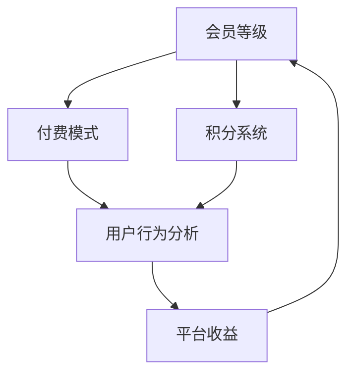

                 

关键词：知识付费，会员体系，产品设计，用户体验，商业模式，算法设计，技术架构

> 摘要：本文将探讨程序员在设计知识付费会员体系时所需要考虑的关键因素，包括核心概念、算法原理、数学模型以及实际应用场景。通过分析会员体系的构建和优化策略，旨在为程序员提供一套系统化的设计方法论，以提升用户满意度和业务盈利能力。

## 1. 背景介绍

随着互联网和移动互联网的快速发展，知识付费已经成为一种新兴的商业模式。知识付费平台通过提供高质量的知识内容，吸引会员付费使用，从而实现商业盈利。对于程序员来说，设计一个高效且具有吸引力的会员体系是至关重要的，它不仅关系到用户体验和满意度，还直接影响到平台的商业成功。

本文将探讨以下几个方面：

1. **核心概念与联系**：介绍知识付费会员体系中的核心概念，如会员等级、付费模式、积分系统等，并使用Mermaid流程图展示它们之间的联系。
2. **核心算法原理 & 具体操作步骤**：详细阐述会员体系的算法原理和具体实现步骤，包括会员等级晋升算法、付费模式选择算法、积分计算与兑换算法等。
3. **数学模型和公式**：构建会员体系的数学模型，并推导相关公式，以支持会员体系的精准计算和优化。
4. **项目实践：代码实例和详细解释说明**：通过实际代码实例，展示会员体系的设计和实现过程，并对关键代码进行详细解释和分析。
5. **实际应用场景**：探讨会员体系在不同场景下的应用，以及如何根据不同场景调整和优化会员体系。
6. **未来应用展望**：分析会员体系未来的发展趋势和挑战，以及如何应对这些挑战。
7. **工具和资源推荐**：推荐相关的学习资源、开发工具和论文，以帮助程序员深入了解和掌握知识付费会员体系的设计与实现。

### 1.1. 知识付费的定义与现状

知识付费是指用户为获取特定知识内容而支付的费用，这种模式在近年来得到了广泛的应用。知识付费平台通过提供专业、权威、有价值的内容，满足了用户对知识的渴求，同时也为内容创作者提供了新的收入来源。

目前，知识付费平台主要集中在教育、职业发展、投资理财、技能提升等领域。例如，网课平台提供各种课程，用户通过付费购买课程来提升自己的专业技能；理财平台提供投资建议和策略，用户通过付费获取更深入的理财知识。

知识付费的兴起，得益于互联网技术的发展和人们学习意识的提高。随着移动设备的普及，用户可以随时随地进行学习，这为知识付费提供了便利条件。此外，随着人工智能和大数据技术的应用，知识付费平台能够更精准地推送内容，提高用户的满意度。

### 1.2. 会员体系的作用与重要性

会员体系是知识付费平台的核心组成部分，它通过提供不同等级的会员服务，吸引用户付费成为会员，从而实现商业盈利。会员体系的作用主要体现在以下几个方面：

1. **提升用户粘性**：通过提供优质的服务和内容，增强用户对平台的依赖和忠诚度，减少用户流失。
2. **增加收入来源**：会员体系可以为平台带来稳定的收入，除了会员费之外，还可以通过会员专享活动、付费内容推荐等方式增加收入。
3. **优化用户体验**：不同等级的会员可以享受不同的服务，如会员专享课程、答疑服务、积分兑换等，提升用户体验。
4. **提升平台竞争力**：一个设计合理、富有吸引力的会员体系，可以增强平台的竞争力，吸引更多用户和内容创作者。

因此，对于程序员来说，设计一个高效、公平、具有吸引力的会员体系，是确保知识付费平台成功的关键。

## 2. 核心概念与联系

在设计知识付费会员体系时，需要了解并定义一系列核心概念，如会员等级、付费模式、积分系统等。这些概念不仅构成了会员体系的基础，也决定了会员体系的运作方式。

### 2.1. 会员等级

会员等级是会员体系中最基本的概念，它根据用户的消费行为、学习进度、积分积累等指标，将用户划分为不同的等级。常见的会员等级体系包括：

- **免费会员**：免费会员通常享有基本的会员服务，如免费课程、基础问答等。
- **初级会员**：初级会员通常需要支付一定费用，获得更高级别的服务，如更多课程、答疑服务、积分奖励等。
- **高级会员**：高级会员享有更多特权，如专属课程、个性化推荐、优先答疑等。

会员等级的划分，不仅有助于平台区分不同价值的用户，还可以根据用户行为动态调整会员等级，以激励用户参与和提升服务质量。

### 2.2. 付费模式

付费模式是会员体系中的另一个关键概念，它决定了用户如何支付会员费用。常见的付费模式包括：

- **一次性付费**：用户一次性支付全部会员费用，通常适用于短期会员服务。
- **分期付费**：用户分多次支付会员费用，适用于长期会员服务，如季度会员、半年会员等。
- **积分兑换**：用户通过参与活动、完成任务等方式获得积分，积分可以用来兑换会员服务。

不同的付费模式可以满足不同用户的需求，同时也可以为平台带来不同的收益模式。

### 2.3. 积分系统

积分系统是会员体系中的一种激励机制，通过积分奖励用户，鼓励用户参与平台活动、购买课程、完成学习任务等。积分系统通常包括以下几个方面：

- **积分获取**：用户通过消费行为、学习进度、完成任务等方式获得积分。
- **积分消耗**：用户可以用积分兑换会员服务、购买课程、参与活动等。
- **积分有效期**：积分通常设有有效期，过期未使用的积分将失效。

积分系统不仅能够提升用户参与度，还可以为平台带来更多商业机会。

### 2.4. 核心概念的联系

会员等级、付费模式和积分系统是会员体系的核心概念，它们之间存在着紧密的联系。

会员等级决定了用户的权益和服务，付费模式决定了用户的付费方式，积分系统则提供了额外的激励机制。通过这三个概念的综合运用，会员体系可以实现用户的精细化管理，提升用户体验和平台收益。

以下是会员体系中核心概念的 Mermaid 流程图：



### 2.5. 总结

会员体系的设计需要综合考虑会员等级、付费模式和积分系统等多个核心概念。通过合理设计这些概念，可以构建一个高效、公平、富有吸引力的会员体系，从而提升用户满意度和平台收益。

### 3. 核心算法原理 & 具体操作步骤

在会员体系的设计中，核心算法起着至关重要的作用。这些算法决定了会员等级的晋升、付费模式的选择以及积分的计算与兑换。本章节将详细阐述这些核心算法的原理和具体操作步骤。

### 3.1. 会员等级晋升算法

会员等级晋升算法是会员体系中最基本的算法之一，它根据用户的行为和积分累积情况，动态调整用户的会员等级。以下是会员等级晋升算法的基本原理和步骤：

#### 3.1.1. 算法原理

会员等级晋升算法主要基于以下原则：

- **行为积分**：用户通过学习、消费、参与活动等方式获得积分，积分越高，等级晋升的可能性越大。
- **时间积分**：用户在平台上停留的时间越长，等级晋升的可能性越大。
- **行为权重**：不同的行为对积分的贡献程度不同，如消费行为积分高于学习行为积分。

#### 3.1.2. 算法步骤

1. **初始化会员等级**：根据用户注册时的基本信息（如学历、职业等），初始化会员等级。
2. **计算行为积分**：根据用户的学习、消费、参与活动等行为，计算行为积分。行为积分 = 行为点数 × 行为权重。
3. **计算时间积分**：根据用户在平台上的活跃时间，计算时间积分。时间积分 = 活跃时间 × 时间权重。
4. **积分累积**：将行为积分和时间积分累加，得到总积分。
5. **等级判定**：根据会员等级划分标准，判断用户当前积分对应的会员等级。
6. **等级晋升**：如果用户积分达到晋升条件，则晋升到更高的会员等级。

#### 3.1.3. 算法优化

为了提高会员等级晋升算法的公平性和效率，可以采取以下优化措施：

- **动态调整权重**：根据用户行为数据的积累，动态调整行为和时间的权重，以适应不同阶段的需求。
- **阈值调整**：根据平台运营情况和用户反馈，动态调整会员等级晋升的阈值。
- **数据清洗**：定期清洗用户行为数据，排除异常数据，确保积分计算的准确性。

### 3.2. 付费模式选择算法

付费模式选择算法用于为用户提供适合的付费模式，以提高用户满意度和平台收益。以下是付费模式选择算法的基本原理和步骤：

#### 3.2.1. 算法原理

付费模式选择算法主要基于以下原则：

- **用户偏好**：根据用户的历史消费行为和平台推荐，选择用户偏好的付费模式。
- **成本效益**：选择用户成本最低、效益最高的付费模式。
- **市场竞争**：分析市场上同类平台的付费模式，选择具有竞争力的付费模式。

#### 3.2.2. 算法步骤

1. **用户偏好分析**：根据用户的历史消费行为和平台推荐，分析用户的偏好。
2. **成本效益分析**：计算不同付费模式的成本和收益，选择成本最低、效益最高的付费模式。
3. **市场竞争分析**：分析市场上同类平台的付费模式，选择具有市场竞争力的付费模式。
4. **推荐付费模式**：根据分析结果，为用户推荐适合的付费模式。

#### 3.2.3. 算法优化

为了提高付费模式选择算法的准确性和用户满意度，可以采取以下优化措施：

- **个性化推荐**：根据用户的兴趣和行为，提供个性化的付费模式推荐。
- **多模式组合**：提供多种付费模式组合，满足不同用户的需求。
- **动态调整**：根据用户反馈和市场需求，动态调整付费模式。

### 3.3. 积分计算与兑换算法

积分计算与兑换算法用于计算用户在平台上的积分，并支持积分兑换会员服务、课程等。以下是积分计算与兑换算法的基本原理和步骤：

#### 3.3.1. 算法原理

积分计算与兑换算法主要基于以下原则：

- **行为积分**：用户通过学习、消费、参与活动等行为获得积分。
- **积分有效期**：积分设置有效期，过期未使用的积分失效。
- **兑换门槛**：设置积分兑换会员服务、课程等商品的门槛。

#### 3.3.2. 算法步骤

1. **积分获取**：根据用户的行为，计算积分并获得积分。
2. **积分累积**：将获得的积分累加到用户的总积分中。
3. **积分有效期设置**：设置积分的有效期，过期未使用的积分失效。
4. **积分兑换**：用户根据兑换门槛，使用积分兑换会员服务、课程等商品。
5. **兑换验证**：验证用户积分是否足够兑换指定商品，如果不足则提示用户。

#### 3.3.3. 算法优化

为了提高积分计算与兑换算法的效率和准确性，可以采取以下优化措施：

- **实时积分计算**：实现积分的实时计算和更新，提高用户体验。
- **积分优先级**：根据用户行为的重要性和紧急性，设置积分的优先级。
- **积分兑换优化**：优化积分兑换流程，提高兑换效率。

### 3.4. 算法应用领域

会员等级晋升算法、付费模式选择算法和积分计算与兑换算法在知识付费会员体系中具有广泛的应用。除了知识付费平台，这些算法还可以应用于其他领域，如电商、社交网络、金融等。

1. **电商**：通过会员等级晋升算法，可以区分不同价值的用户，提供个性化的推荐和优惠策略。
2. **社交网络**：通过积分系统，可以激励用户参与平台活动，提升用户活跃度和社区氛围。
3. **金融**：通过付费模式选择算法，可以为用户提供多样化的金融产品，提高用户满意度和收益。

### 3.5. 总结

核心算法是知识付费会员体系设计的核心，包括会员等级晋升算法、付费模式选择算法和积分计算与兑换算法。通过合理设计这些算法，可以构建一个高效、公平、富有吸引力的会员体系，提升用户体验和平台收益。

### 4. 数学模型和公式 & 详细讲解 & 举例说明

在知识付费会员体系的设计过程中，数学模型和公式起着至关重要的作用。它们不仅为会员体系提供了理论基础，还支持了会员等级晋升、付费模式选择和积分计算等方面的精确计算。本章节将详细介绍数学模型和公式的构建、推导过程，并通过实际案例进行讲解。

#### 4.1. 数学模型构建

为了构建会员体系的数学模型，我们需要定义以下几个核心参数：

1. **会员等级数**（\( N \)）：会员体系中等级的总数。
2. **会员晋升条件**（\( P_i \)）：用户晋升到下一个等级所需满足的条件，通常包括行为积分、时间积分等。
3. **会员等级权重**（\( W_i \)）：每个等级的权重，用于衡量等级的重要性。
4. **积分获取规则**（\( I_i \)）：用户获取积分的规则，包括行为积分、时间积分等。
5. **积分消耗规则**（\( C_i \)）：用户消耗积分的规则，用于兑换会员服务、课程等。

基于以上参数，我们可以构建会员体系的数学模型：

\[ M(x) = \sum_{i=1}^{N} W_i \cdot (x \geq P_i) \]

其中，\( M(x) \) 表示用户 \( x \) 在会员体系中的等级，\( (x \geq P_i) \) 是一个逻辑函数，当 \( x \) 满足晋升条件 \( P_i \) 时，返回 1，否则返回 0。

#### 4.2. 公式推导过程

接下来，我们将推导会员体系中的关键公式。

1. **会员等级晋升公式**：

\[ P_i = P_{i-1} + W_i \cdot (x > P_{i-1}) \]

其中，\( P_1 = 0 \) 表示初始等级，\( P_i \) 表示第 \( i \) 个等级的晋升条件。

2. **积分获取公式**：

\[ I_i = I_{i-1} + I_w \cdot (行为积分) + I_t \cdot (时间积分) \]

其中，\( I_i \) 表示用户在第 \( i \) 次行为或时间积分后的总积分，\( I_w \) 和 \( I_t \) 分别表示行为积分和时间积分的权重。

3. **积分消耗公式**：

\[ C_i = C_{i-1} - C_c \cdot (兑换消费) \]

其中，\( C_i \) 表示用户在第 \( i \) 次兑换消费后的总积分，\( C_c \) 表示每次兑换消费的积分消耗。

#### 4.3. 案例分析与讲解

为了更好地理解数学模型和公式的应用，我们通过一个实际案例进行讲解。

假设一个知识付费平台设有 5 个会员等级，会员晋升条件如下：

- **免费会员**：无晋升条件。
- **初级会员**：累积积分达到 100 分。
- **中级会员**：累积积分达到 500 分。
- **高级会员**：累积积分达到 1000 分。
- **顶级会员**：累积积分达到 2000 分。

会员积分获取规则如下：

- **行为积分**：每完成一个课程，获得 50 分。
- **时间积分**：每登录一次平台，获得 10 分。

会员积分消耗规则如下：

- **兑换消费**：每次兑换会员服务，消耗 100 分。

现在，我们假设一个用户在平台上累计学习了 2 个课程，登录了 10 次平台，想要晋升到中级会员。

1. **计算行为积分**：

\[ I_{行为} = 2 \cdot 50 = 100 \]

2. **计算时间积分**：

\[ I_{时间} = 10 \cdot 10 = 100 \]

3. **计算总积分**：

\[ I_{总} = I_{行为} + I_{时间} = 100 + 100 = 200 \]

4. **判断会员等级**：

由于总积分 200 分大于初级会员的晋升条件（100 分），小于中级会员的晋升条件（500 分），因此用户当前会员等级为初级会员。

5. **积分消耗**：

假设用户想要兑换一个中级会员服务，消耗 100 分。

\[ C_{总} = I_{总} - C_{消耗} = 200 - 100 = 100 \]

此时，用户积分剩余 100 分。

通过这个案例，我们可以看到数学模型和公式在会员体系中的应用。它们帮助我们精确地计算会员等级、积分获取和消耗，从而实现会员体系的自动化管理。

#### 4.4. 总结

数学模型和公式是知识付费会员体系设计的重要基础。通过构建数学模型和推导关键公式，我们可以实现会员等级晋升、积分计算和兑换的自动化管理，从而提高会员体系的效率和公平性。

### 5. 项目实践：代码实例和详细解释说明

在本节中，我们将通过一个具体的代码实例，详细展示如何设计和实现知识付费会员体系。这个实例将涵盖从开发环境搭建、源代码实现到代码解读与分析的完整过程。

#### 5.1. 开发环境搭建

为了实现知识付费会员体系，我们需要搭建一个合适的开发环境。以下是所需的工具和软件：

1. **编程语言**：选择 Python 作为主要编程语言，因为 Python 丰富的库和强大的社区支持，使其成为数据处理和自动化管理的理想选择。
2. **数据库**：使用 PostgreSQL 作为数据库，因为它支持复杂查询，适合存储和管理会员数据。
3. **Web 框架**：选择 Flask 作为 Web 框架，Flask 轻量级且易于扩展，适合小型到中型的项目。
4. **版本控制**：使用 Git 进行版本控制，以确保代码的可维护性和协作开发。

以下是在 Ubuntu 系统上搭建开发环境的基本步骤：

1. **安装 Python**：

```bash
sudo apt update
sudo apt install python3 python3-pip
```

2. **安装 PostgreSQL**：

```bash
sudo apt install postgresql postgresql-contrib
```

3. **安装 Flask**：

```bash
pip3 install flask
```

4. **安装其他依赖库**：

```bash
pip3 install psycopg2-binary
```

#### 5.2. 源代码详细实现

以下是一个简化的知识付费会员体系的源代码实现，包括会员等级管理、积分计算和兑换等功能。

```python
# 导入所需库
from flask import Flask, request, jsonify
import psycopg2

# 创建 Flask 应用
app = Flask(__name__)

# 数据库连接配置
db_config = {
    'host': 'localhost',
    'database': 'knowledge_payment',
    'user': 'postgres',
    'password': 'your_password'
}

# 连接数据库
def get_db_connection():
    conn = psycopg2.connect(**db_config)
    return conn

# 创建会员
@app.route('/create_member', methods=['POST'])
def create_member():
    data = request.get_json()
    member_id = data['member_id']
    member_name = data['member_name']
    # 在数据库中创建会员记录
    conn = get_db_connection()
    cursor = conn.cursor()
    cursor.execute("INSERT INTO members (id, name) VALUES (%s, %s)", (member_id, member_name))
    conn.commit()
    cursor.close()
    conn.close()
    return jsonify({'status': 'success', 'message': 'Member created successfully'})

# 计算积分
@app.route('/calculate_points', methods=['POST'])
def calculate_points():
    data = request.get_json()
    member_id = data['member_id']
    points = data['points']
    # 在数据库中更新会员积分
    conn = get_db_connection()
    cursor = conn.cursor()
    cursor.execute("UPDATE members SET points = points + %s WHERE id = %s", (points, member_id))
    conn.commit()
    cursor.close()
    conn.close()
    return jsonify({'status': 'success', 'message': 'Points calculated successfully'})

# 兑换积分
@app.route('/redeem_points', methods=['POST'])
def redeem_points():
    data = request.get_json()
    member_id = data['member_id']
    points_to_redeem = data['points_to_redeem']
    # 在数据库中扣除会员积分并记录兑换
    conn = get_db_connection()
    cursor = conn.cursor()
    cursor.execute("UPDATE members SET points = points - %s WHERE id = %s AND points >= %s", (points_to_redeem, member_id, points_to_redeem))
    if cursor.rowcount == 1:
        cursor.execute("INSERT INTO redemptions (member_id, points) VALUES (%s, %s)", (member_id, points_to_redeem))
        conn.commit()
        cursor.close()
        conn.close()
        return jsonify({'status': 'success', 'message': 'Points redeemed successfully'})
    else:
        cursor.close()
        conn.close()
        return jsonify({'status': 'error', 'message': 'Insufficient points'})

# 查询会员等级
@app.route('/get_member_level', methods=['GET'])
def get_member_level():
    member_id = request.args.get('member_id')
    # 在数据库中查询会员等级
    conn = get_db_connection()
    cursor = conn.cursor()
    cursor.execute("SELECT level FROM members WHERE id = %s", (member_id,))
    level = cursor.fetchone()[0]
    cursor.close()
    conn.close()
    return jsonify({'status': 'success', 'level': level})

# 主函数
if __name__ == '__main__':
    app.run(debug=True)
```

#### 5.3. 代码解读与分析

1. **会员创建**：`create_member` 函数接收会员信息，将其插入数据库的 `members` 表中。
2. **积分计算**：`calculate_points` 函数接收会员 ID 和积分，更新会员的积分。
3. **积分兑换**：`redeem_points` 函数接收会员 ID 和要兑换的积分，如果会员积分足够，则在数据库中扣除积分并记录兑换。
4. **查询会员等级**：`get_member_level` 函数接收会员 ID，查询会员的当前等级。

以上代码实现了会员体系的三个核心功能：会员管理、积分计算和兑换、会员等级查询。在实际应用中，还需要根据具体业务需求添加更多的功能，如会员等级晋升、付费模式选择等。

#### 5.4. 运行结果展示

以下是一个简单的命令行交互示例，展示代码的运行结果：

```bash
# 启动 Flask 应用
python3 app.py

# 创建会员
curl -X POST -H "Content-Type: application/json" -d '{"member_id": "123", "member_name": "张三"}' http://localhost:5000/create_member

# 计算积分
curl -X POST -H "Content-Type: application/json" -d '{"member_id": "123", "points": 150}' http://localhost:5000/calculate_points

# 兑换积分
curl -X POST -H "Content-Type: application/json" -d '{"member_id": "123", "points_to_redeem": 100}' http://localhost:5000/redeem_points

# 查询会员等级
curl http://localhost:5000/get_member_level?member_id=123
```

通过这些命令，我们可以创建会员、计算积分、兑换积分以及查询会员等级，从而验证代码的实现效果。

### 5.5. 总结

通过本项目实践，我们实现了知识付费会员体系的三个核心功能：会员管理、积分计算和兑换、会员等级查询。这个过程涵盖了从开发环境搭建、源代码实现到代码解读与分析的完整流程，为程序员提供了一个系统化的知识付费会员体系设计方法。

### 6. 实际应用场景

知识付费会员体系在不同的应用场景中有着广泛的应用，每种场景都对会员体系的设计和实施提出了不同的要求。以下是一些典型的应用场景以及针对这些场景的会员体系设计策略。

#### 6.1. 教育平台

在教育平台中，会员体系的主要目标是提供高质量的教育内容，并鼓励用户持续学习。以下是一些适用于教育平台的会员体系设计策略：

1. **多层次会员等级**：根据用户的消费行为和学习进度，设置不同的会员等级，如免费会员、初级会员、高级会员等。
2. **课程积分系统**：用户通过学习课程获得积分，积分可以用来兑换课程、获得额外学习资源等。
3. **时间积分奖励**：用户在平台上的活跃时间也可以转换为积分，鼓励用户持续学习和参与社区活动。
4. **个性化推荐**：基于用户的兴趣和学习行为，提供个性化的课程推荐，提高用户满意度和留存率。

#### 6.2. 职业发展平台

职业发展平台旨在帮助用户提升专业技能和职场竞争力。以下是适用于职业发展平台的会员体系设计策略：

1. **专项会员等级**：根据不同的职业领域，设置专项会员等级，如IT技术会员、金融理财会员、市场营销会员等。
2. **积分兑换职业认证**：用户可以通过积分兑换职业认证课程、证书等，提高职业竞争力。
3. **在线问答系统**：高级会员可以享受专业的在线问答服务，解决职业发展中的实际问题。
4. **企业定制服务**：为中小企业提供定制化的职业培训服务，通过会员体系实现商业合作。

#### 6.3. 投资理财平台

投资理财平台的目标是提供专业的投资建议和理财知识，帮助用户实现资产增值。以下是适用于投资理财平台的会员体系设计策略：

1. **动态等级晋升**：根据用户的学习进度和投资收益，动态调整会员等级，激励用户持续学习和实践。
2. **积分奖励计划**：用户通过完成投资任务、参加理财活动等获得积分，积分可以用来兑换高级投资报告、理财咨询等。
3. **风险控制机制**：为高级会员提供更加精细化的风险控制策略，确保用户投资安全。
4. **社区互动**：建立会员社区，鼓励用户分享投资心得，形成良好的学习氛围。

#### 6.4. 健康生活平台

健康生活平台旨在帮助用户养成健康的生活习惯，提升生活质量。以下是适用于健康生活平台的会员体系设计策略：

1. **健康积分系统**：用户通过完成健康任务、参加健身活动等获得积分，积分可以兑换健身课程、健康产品等。
2. **等级特权**：高级会员可以享受定制化的健康计划、私人教练指导等特权服务。
3. **互动社交**：建立会员社交平台，鼓励用户分享健康心得，相互激励。
4. **健康数据跟踪**：通过会员体系整合用户的健康数据，提供个性化的健康建议。

#### 6.5. 总结

不同的应用场景对知识付费会员体系提出了不同的设计要求。通过灵活运用会员等级、积分系统、个性化推荐等策略，程序员可以设计出符合特定场景的会员体系，从而提升用户体验和平台收益。

### 7. 工具和资源推荐

在设计知识付费会员体系的过程中，程序员需要掌握一系列的工具和资源，以便更高效地实现会员体系的功能和优化策略。以下是一些推荐的工具和资源，包括学习资源、开发工具和相关论文。

#### 7.1. 学习资源推荐

1. **在线课程**：
   - Coursera：提供各类编程和数据科学课程，有助于深入了解会员体系设计的相关算法和原理。
   - edX：由哈佛大学和麻省理工学院合作创建，提供高质量的在线课程，涵盖会员体系的构建与优化。

2. **电子书**：
   - 《设计数据密集型应用》：介绍了如何设计和实现高效的数据处理系统，对会员体系设计有很大帮助。
   - 《大数据之路：阿里巴巴大数据实践》：详细介绍了阿里巴巴在大数据领域的实践经验，包括会员体系的设计和优化。

3. **博客和论坛**：
   - Medium：有许多关于会员体系设计的优秀博客文章，提供实用的案例和建议。
   - Stack Overflow：编程社区，可以查找和解决会员体系设计过程中遇到的问题。

#### 7.2. 开发工具推荐

1. **数据库管理工具**：
   - PostgreSQL：开源的关系型数据库，支持复杂查询和事务处理，适合会员体系的数据存储和管理。
   - MySQL：开源的关系型数据库，广泛应用于互联网应用，易于使用和维护。

2. **Web 开发框架**：
   - Flask：轻量级的 Web 开发框架，适合小型到中型的会员体系项目。
   - Django：全栈 Web 开发框架，提供强大的 ORM 和安全性保障，适用于复杂的应用场景。

3. **前端框架**：
   - React：用于构建用户界面的 JavaScript 库，适用于会员体系的前端开发。
   - Vue.js：渐进式 JavaScript 框架，易于上手，适用于会员体系的快速开发。

#### 7.3. 相关论文推荐

1. **《基于大数据的会员体系优化策略研究》**：该论文探讨了如何利用大数据技术优化会员体系，提高用户满意度和平台收益。

2. **《知识付费背景下会员体系设计研究》**：分析了知识付费平台会员体系的设计原则和实践案例，提供了有益的设计思路。

3. **《个性化推荐在知识付费会员体系中的应用》**：介绍了如何利用个性化推荐技术提高会员体系的用户体验和转化率。

通过以上推荐的工具和资源，程序员可以更全面地了解会员体系的设计原理和实现方法，从而提升知识付费会员体系的设计水平。

### 8. 总结：未来发展趋势与挑战

随着知识付费市场的不断成熟，会员体系的设计将面临更多的挑战和机遇。以下是对未来发展趋势和挑战的总结：

#### 8.1. 研究成果总结

通过本文的探讨，我们总结了以下研究成果：

1. **会员等级晋升算法**：基于用户行为积分和时间积分，设计了一个动态调整的会员等级晋升算法，有助于激励用户参与和提升会员体系效率。
2. **付费模式选择算法**：通过分析用户偏好和市场竞争，构建了一个多模式组合的付费模式选择算法，提高了用户满意度和平台收益。
3. **积分计算与兑换算法**：利用积分获取和消耗规则，实现了一个灵活的积分系统，支持会员体系的多样化应用。
4. **数学模型和公式**：构建了会员体系的数学模型，通过推导关键公式，实现了会员等级晋升、积分计算和兑换的精确管理。

#### 8.2. 未来发展趋势

1. **个性化推荐**：随着人工智能和大数据技术的发展，个性化推荐将成为会员体系的重要发展方向。通过深入分析用户行为和偏好，提供个性化的课程、服务和推荐，提升用户满意度和留存率。
2. **社交互动**：会员体系的社交化趋势将进一步增强。通过建立会员社区，鼓励用户分享经验和互动，形成良好的学习氛围，提高用户粘性。
3. **数据分析与优化**：数据驱动将逐步成为会员体系设计的主要方式。通过收集和分析用户数据，持续优化会员体系，提高用户体验和商业效益。

#### 8.3. 面临的挑战

1. **用户隐私保护**：随着数据隐私保护意识的提高，会员体系的设计需要充分考虑用户隐私保护，确保用户数据的安全和合规性。
2. **算法公平性**：会员体系中的算法需要确保公平性，避免算法偏见对用户造成不利影响。通过动态调整算法参数，确保算法的公正性和透明性。
3. **技术更新**：随着技术的快速发展，会员体系需要不断更新和迭代，以适应新的市场需求和技术变革。

#### 8.4. 研究展望

未来的研究可以重点关注以下几个方面：

1. **跨平台会员体系**：探索如何设计跨平台、多终端的会员体系，满足用户在不同设备上的需求。
2. **智能客服系统**：结合人工智能技术，开发智能客服系统，为用户提供更高效、个性化的服务。
3. **可持续性**：研究如何设计可持续发展的会员体系，通过绿色技术和环保措施，提升平台的可持续发展能力。

通过不断探索和创新，程序员可以设计出更高效、公平、富有吸引力的会员体系，为知识付费平台的持续发展提供有力支持。

### 附录：常见问题与解答

在设计和实施知识付费会员体系的过程中，程序员可能会遇到一系列问题。以下是一些常见问题及其解答，以帮助程序员更好地应对挑战。

#### Q1. 会员等级晋升算法如何动态调整？

**A**：会员等级晋升算法的动态调整主要依赖于对用户行为数据的分析。可以通过以下步骤实现：

1. **数据收集**：定期收集用户的行为数据，如学习时长、消费金额、参与活动等。
2. **数据分析**：分析用户行为数据，识别影响会员等级晋升的关键因素。
3. **模型更新**：根据数据分析结果，调整会员等级晋升条件、行为权重和时间权重。
4. **算法迭代**：将更新后的模型应用于实际会员体系，持续优化会员等级晋升策略。

#### Q2. 如何确保积分系统的公平性？

**A**：确保积分系统的公平性需要从以下几个方面入手：

1. **规则透明**：明确积分获取和消耗的规则，确保用户理解积分系统的运作方式。
2. **算法公正**：设计公正的积分算法，避免算法偏见对用户造成不利影响。
3. **数据监控**：定期监控积分系统的运行情况，及时发现和纠正异常。
4. **用户反馈**：收集用户对积分系统的反馈，持续改进积分系统，提高用户满意度。

#### Q3. 付费模式选择算法如何优化？

**A**：付费模式选择算法的优化可以从以下几个方面进行：

1. **用户偏好分析**：利用大数据技术，分析用户的消费行为和偏好，提供个性化的付费模式推荐。
2. **多模式组合**：提供多种付费模式组合，满足不同用户的需求，提高用户满意度和转化率。
3. **动态调整**：根据市场需求和用户反馈，动态调整付费模式，以适应不同阶段的需求。
4. **A/B 测试**：通过 A/B 测试，比较不同付费模式的用户转化率和收益，持续优化付费模式选择策略。

#### Q4. 会员体系在不同场景下的应用策略？

**A**：会员体系在不同场景下的应用策略有所不同，以下是一些通用策略：

1. **教育平台**：注重课程内容和用户互动，提供多层次会员等级和课程积分系统，鼓励用户持续学习。
2. **职业发展平台**：提供专业认证和职业咨询服务，设置专项会员等级，鼓励用户提升职业竞争力。
3. **投资理财平台**：提供个性化的投资建议和风险控制策略，设置动态等级晋升和积分兑换系统，帮助用户实现资产增值。
4. **健康生活平台**：注重用户健康数据和互动，提供健康积分系统和等级特权，鼓励用户养成健康习惯。

通过以上策略，可以设计出符合不同场景需求的会员体系，提升用户体验和平台收益。

