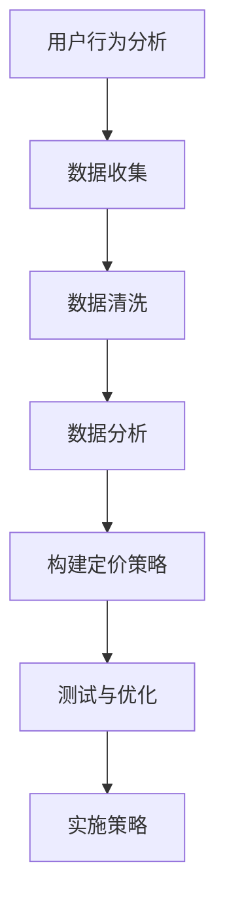

                 

关键词：知识付费、定价策略、阶梯定价、用户体验、盈利模型

## 摘要

随着互联网和数字技术的飞速发展，知识付费市场逐渐壮大。作为程序员，设计一个合理且有效的阶梯定价策略是提升用户粘性和实现持续盈利的关键。本文将探讨知识付费市场中的核心概念，并详细分析如何构建和优化阶梯定价策略，旨在为程序员提供实用的指导，以实现更好的商业价值。

## 1. 背景介绍

### 1.1 知识付费市场的现状

知识付费作为一种新型的商业模式，正逐渐改变传统的知识传播方式。用户愿意为高质量、专业的知识内容付费，这为知识付费市场带来了前所未有的机遇。根据相关数据显示，我国知识付费市场规模逐年扩大，用户消费习惯逐渐形成，为程序员提供了广阔的舞台。

### 1.2 程序员在知识付费市场中的角色

程序员不仅是技术领域的专家，还可以在知识付费市场中扮演多重角色。他们可以成为知识内容的创作者、分享者，甚至可以构建平台，为其他专家和知识爱好者提供展示和交易的平台。在这个市场中，程序员需要具备商业敏锐度和用户思维，以设计出满足市场需求的知识付费产品。

## 2. 核心概念与联系

在讨论阶梯定价策略之前，我们先来梳理一下相关知识概念。

### 2.1 定价策略

定价策略是企业为实现既定营销目标，根据产品特点、市场环境和竞争对手状况等因素，对产品价格进行制定的策略。常见的定价策略包括成本导向定价、需求导向定价、竞争导向定价等。

### 2.2 阶梯定价

阶梯定价是一种根据用户消费行为和需求变化，设置不同价格层次的定价策略。在知识付费市场中，阶梯定价可以通过设置不同级别的会员、课程或内容包，满足用户多样化的需求，提高用户粘性和转化率。

### 2.3 用户行为分析

用户行为分析是数据驱动的核心环节，通过对用户的行为数据进行收集、分析和应用，可以深入了解用户需求，为定价策略提供有力支持。

### 2.4 Mermaid 流程图



## 3. 核心算法原理 & 具体操作步骤

### 3.1 算法原理概述

阶梯定价策略的核心是构建一个合理的价格层次结构，根据用户消费行为和需求变化，动态调整价格。这需要结合用户行为分析、市场调研和竞争分析等多方面因素，以实现最佳收益。

### 3.2 算法步骤详解

#### 3.2.1 用户行为分析

首先，通过对用户行为数据的收集和分析，了解用户对知识内容的偏好和消费习惯。这包括用户访问频次、购买行为、课程学习进度等。

#### 3.2.2 市场调研

其次，进行市场调研，了解竞争对手的定价策略和市场动态。这有助于确定自身的价格定位和市场竞争力。

#### 3.2.3 构建定价模型

根据用户行为分析和市场调研结果，构建一个包含多个价格层次的定价模型。每个价格层次对应不同的会员级别或课程包，以满足用户多样化的需求。

#### 3.2.4 测试与优化

在实施定价策略之前，进行小范围测试，收集用户反馈，并对定价模型进行优化。这有助于确保定价策略的可行性和有效性。

#### 3.2.5 实施策略

最后，根据测试结果和优化方案，正式实施定价策略。同时，持续监控用户反馈和市场变化，及时进行调整。

### 3.3 算法优缺点

#### 优点：

- 提高用户粘性和转化率
- 满足用户多样化的需求
- 提升企业盈利能力

#### 缺点：

- 需要大量的用户行为数据支持
- 测试和优化过程较为复杂

### 3.4 算法应用领域

阶梯定价策略在知识付费市场中具有广泛的应用前景。无论是在线上教育、专业培训还是技能分享等领域，都能发挥重要作用。

## 4. 数学模型和公式 & 详细讲解 & 举例说明

### 4.1 数学模型构建

阶梯定价策略的核心是构建一个能够平衡用户需求和企业收益的数学模型。以下是构建阶梯定价模型的基本步骤：

#### 4.1.1 确定价格层次

首先，根据市场调研和用户需求分析，确定不同的价格层次。每个价格层次对应一个价格区间，满足不同用户群体的需求。

#### 4.1.2 计算价格梯度

然后，计算每个价格层次之间的梯度。梯度越大，价格层次之间的区分越明显，越能满足用户多样化的需求。

#### 4.1.3 确定定价系数

最后，根据企业目标收益和市场竞争状况，确定定价系数。定价系数可以调整价格层次之间的相对价格，以实现最佳收益。

### 4.2 公式推导过程

假设有 n 个价格层次，每个价格层次的价格区间为 [a\_i, b\_i]，其中 i = 1, 2, ..., n。定价系数为 k。则每个价格层次的价格为：

p\_i = k \* a\_i + (1 - k) \* b\_i

其中，k 为定价系数，取值范围为 [0, 1]。

### 4.3 案例分析与讲解

假设某在线教育平台有三个价格层次，价格区间分别为 [100, 200]、[200, 300] 和 [300, 400]。定价系数为 0.6。则每个价格层次的价格为：

- 第一层次：p\_1 = 0.6 \* 100 + (1 - 0.6) \* 200 = 120 + 80 = 200
- 第二层次：p\_2 = 0.6 \* 200 + (1 - 0.6) \* 300 = 120 + 90 = 210
- 第三层次：p\_3 = 0.6 \* 300 + (1 - 0.6) \* 400 = 120 + 140 = 260

通过调整定价系数，可以灵活调整价格层次之间的相对价格，以实现最佳收益。

## 5. 项目实践：代码实例和详细解释说明

### 5.1 开发环境搭建

本次项目采用 Python 编写，需要安装以下依赖库：

```shell
pip install numpy pandas matplotlib
```

### 5.2 源代码详细实现

以下是实现阶梯定价策略的 Python 代码：

```python
import numpy as np
import pandas as pd
import matplotlib.pyplot as plt

# 定义阶梯定价函数
def阶梯定价(a, b, k):
   p = k * a + (1 - k) * b
   return p

# 案例数据
a = [100, 200, 300]
b = [200, 300, 400]
k = 0.6

# 计算价格
p = [阶梯定价(a[i], b[i], k) for i in range(len(a))]

# 绘制价格曲线
plt.plot(a, p, marker='o', label='第一层次')
plt.plot(b, p, marker='s', label='第二层次')
plt.plot([300, 400], p, marker='^', label='第三层次')
plt.xlabel('价格区间')
plt.ylabel('价格')
plt.legend()
plt.show()
```

### 5.3 代码解读与分析

- 第 1 行：引入 numpy 库
- 第 2 行：引入 pandas 库
- 第 3 行：引入 matplotlib.pyplot 库
- 第 4 行：定义阶梯定价函数
- 第 5 行：计算每个价格层次的价格
- 第 6 行：绘制价格曲线

通过运行代码，可以得到不同价格层次的价格分布，便于分析和优化定价策略。

## 6. 实际应用场景

### 6.1 在线教育

在线教育平台可以通过阶梯定价策略，为用户提供不同层次的课程和会员服务，满足用户多样化的学习需求。例如，初级课程、中级课程和高级课程可以设置不同的价格层次，以吸引不同水平的用户。

### 6.2 专业培训

专业培训领域可以通过阶梯定价策略，为用户提供定制化的培训方案。例如，基础培训、进阶培训和高级培训可以设置不同的价格层次，以适应不同职业发展阶段的需求。

### 6.3 技能分享

技能分享平台可以通过阶梯定价策略，为用户提供不同的技能课程和会员服务。例如，入门课程、中级课程和高级课程可以设置不同的价格层次，以满足用户多样化的学习需求。

## 7. 未来应用展望

随着互联网和人工智能技术的不断发展，知识付费市场的竞争将越来越激烈。程序员需要不断优化阶梯定价策略，以应对市场变化和用户需求。未来，人工智能技术将有望在用户行为分析、定价模型构建和优化等方面发挥重要作用，进一步提升知识付费平台的竞争力。

## 8. 总结：未来发展趋势与挑战

### 8.1 研究成果总结

本文从核心概念、算法原理、数学模型、项目实践等方面，全面探讨了程序员如何设计知识付费的阶梯定价策略。通过分析实际应用场景，本文提出了一系列优化方案，为程序员提供了实用的指导。

### 8.2 未来发展趋势

随着技术的不断进步，知识付费市场的竞争将更加激烈。程序员需要紧跟市场趋势，持续优化定价策略，以提高用户满意度和平台竞争力。

### 8.3 面临的挑战

- 数据隐私和安全：在用户行为分析过程中，如何保护用户隐私和安全是一个重要挑战。
- 定价策略优化：如何根据用户需求和市场竞争状况，动态调整定价策略，实现最佳收益。
- 技术创新：如何利用人工智能、大数据等技术，提升定价策略的准确性和有效性。

### 8.4 研究展望

未来，我们将继续关注知识付费市场的发展动态，深入研究定价策略的优化方法，以期为程序员提供更全面、更实用的指导。

## 9. 附录：常见问题与解答

### 9.1 如何确定定价系数？

定价系数可以根据市场调研和用户行为分析数据，通过试验和调整得出。具体方法包括：

- 数据驱动：根据历史数据和用户反馈，确定定价系数的取值范围。
- 交叉验证：通过不同定价系数的测试，比较收益和用户满意度，选择最佳系数。

### 9.2 如何优化用户粘性？

- 提供高质量内容：确保知识内容的实用性和吸引力，提高用户满意度。
- 会员互动：建立会员社区，鼓励用户互动，提高用户粘性。
- 个性化推荐：根据用户行为数据，为用户提供个性化的推荐，提高用户粘性。

## 作者署名

作者：禅与计算机程序设计艺术 / Zen and the Art of Computer Programming

----------------------------------------------------------------
### 后记

本文以《程序员如何设计知识付费的阶梯定价策略》为题，从背景介绍、核心概念、算法原理、数学模型、项目实践等多个维度，全面探讨了知识付费市场的定价策略。希望通过本文，为广大程序员提供有价值的参考和借鉴，共同推动知识付费市场的健康发展。未来，我们将继续关注该领域的发展动态，深入研究更多相关问题。感谢您的阅读！

