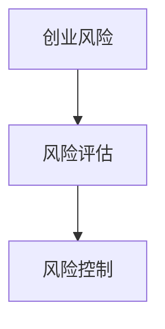

                 

## 1. 背景介绍

随着科技的发展，创业成为了越来越多程序员的选择。然而，创业并非一条轻松的道路，其中充满了不确定性、挑战和风险。对于程序员来说，如何评估和应对这些创业风险，成为了成功创业的关键因素。本文将围绕这一主题，探讨程序员在创业过程中应如何评估风险，从而更好地规划和实施自己的创业计划。

### 2. 核心概念与联系

为了更好地理解创业风险，我们需要首先明确几个核心概念：

1. **创业风险**：创业风险是指在创业过程中可能遇到的各种不确定性因素，这些因素可能会导致创业失败。
2. **风险评估**：风险评估是指通过对创业风险进行识别、分析和评估，以确定风险的性质、程度和影响，从而制定相应的风险管理策略。
3. **风险控制**：风险控制是指通过采取一系列措施，降低创业风险发生的概率和影响。

下面是一个简化的 Mermaid 流程图，用于展示这三个核心概念之间的联系：



### 3. 核心算法原理 & 具体操作步骤

#### 3.1 算法原理概述

在评估创业风险时，程序员可以采用以下核心算法原理：

1. **风险识别**：通过系统化的方法，识别出可能影响创业成功的各种风险因素。
2. **风险分析**：对识别出的风险因素进行定量和定性的分析，评估其可能性和影响程度。
3. **风险排序**：根据风险分析的结果，对风险进行排序，确定哪些风险需要优先处理。
4. **风险应对**：制定相应的风险应对策略，包括风险避免、风险转移、风险缓解等。

#### 3.2 算法步骤详解

1. **识别风险因素**：
   - **市场风险**：市场需求、竞争对手、市场变化等。
   - **技术风险**：技术实现、技术更新、知识产权等。
   - **财务风险**：资金来源、成本控制、盈利模式等。
   - **团队风险**：团队成员能力、团队稳定性、团队沟通等。

2. **分析风险因素**：
   - **可能性分析**：根据历史数据和专家意见，评估每个风险因素发生的可能性。
   - **影响分析**：评估每个风险因素对创业成功的影响程度。

3. **风险排序**：
   - **优先级排序**：根据风险的可能性和影响程度，对风险进行排序。

4. **制定风险应对策略**：
   - **风险避免**：通过改变计划或采取其他措施，避免风险发生。
   - **风险转移**：通过购买保险、签订合同等方式，将风险转移给第三方。
   - **风险缓解**：采取一系列措施，降低风险发生的概率或影响程度。

#### 3.3 算法优缺点

**优点**：
- 系统化：通过算法原理，可以系统地识别、分析和应对创业风险。
- 可量化：算法原理中的可能性分析和影响分析可以量化风险，使得风险评估更加科学。

**缺点**：
- 复杂性：算法原理涉及多个步骤，可能需要较长的时间和较大的工作量。
- 依赖数据：可能性分析和影响分析依赖于历史数据和专家意见，可能存在一定的误差。

#### 3.4 算法应用领域

该算法原理可以广泛应用于各种创业项目，尤其适用于科技创业项目。在科技创业中，技术风险和市场风险尤为突出，通过算法原理，程序员可以更好地识别和管理这些风险，提高创业成功的可能性。

### 4. 数学模型和公式 & 详细讲解 & 举例说明

在评估创业风险时，我们经常需要使用数学模型和公式。以下是一个简单的数学模型，用于评估创业风险的可能性和影响程度。

#### 4.1 数学模型构建

假设有 n 个风险因素，每个风险因素的发生可能性为 \(P_i\)（\(i=1,2,...,n\)），对创业成功的影响程度为 \(I_i\)（\(i=1,2,...,n\)）。则创业风险的总可能性 \(P\) 和总影响程度 \(I\) 可以表示为：

$$
P = \sum_{i=1}^{n} P_i
$$

$$
I = \sum_{i=1}^{n} I_i \cdot P_i
$$

#### 4.2 公式推导过程

**推导总可能性 \(P\)**：

总可能性是各个风险因素可能性的加和，因此有：

$$
P = P_1 + P_2 + ... + P_n
$$

**推导总影响程度 \(I\)**：

总影响程度是各个风险因素的影响程度与其可能性的乘积之和，因此有：

$$
I = I_1 \cdot P_1 + I_2 \cdot P_2 + ... + I_n \cdot P_n
$$

#### 4.3 案例分析与讲解

假设一个科技创业项目，涉及4个风险因素：市场风险（\(P_1\)）、技术风险（\(P_2\)）、财务风险（\(P_3\)）和团队风险（\(P_4\)）。根据市场调研和专家意见，各个风险因素的发生可能性分别为：

$$
P_1 = 0.3, \quad P_2 = 0.2, \quad P_3 = 0.2, \quad P_4 = 0.3
$$

同时，假设各个风险因素对创业成功的影响程度分别为：

$$
I_1 = 0.5, \quad I_2 = 0.3, \quad I_3 = 0.2, \quad I_4 = 0.4
$$

根据以上数据，可以计算出创业风险的总可能性 \(P\) 和总影响程度 \(I\)：

$$
P = 0.3 + 0.2 + 0.2 + 0.3 = 1
$$

$$
I = 0.5 \cdot 0.3 + 0.3 \cdot 0.2 + 0.2 \cdot 0.2 + 0.4 \cdot 0.3 = 0.15 + 0.06 + 0.04 + 0.12 = 0.37
$$

因此，这个科技创业项目的创业风险总可能性为100%，总影响程度为37%。这表明，尽管创业风险很高，但其中只有37%的风险可能会对创业成功产生重大影响。

### 5. 项目实践：代码实例和详细解释说明

#### 5.1 开发环境搭建

在评估创业风险时，我们可以使用Python编写一个简单的风险评估程序。以下是搭建开发环境的基本步骤：

1. 安装Python（推荐版本3.8以上）
2. 安装必要的库，如NumPy和Matplotlib，使用pip命令：
   ```
   pip install numpy matplotlib
   ```

#### 5.2 源代码详细实现

以下是一个简单的Python程序，用于评估创业风险：

```python
import numpy as np
import matplotlib.pyplot as plt

# 风险因素及其可能性和影响程度
risks = [
    {'name': '市场风险', 'probability': 0.3, 'impact': 0.5},
    {'name': '技术风险', 'probability': 0.2, 'impact': 0.3},
    {'name': '财务风险', 'probability': 0.2, 'impact': 0.2},
    {'name': '团队风险', 'probability': 0.3, 'impact': 0.4}
]

# 计算总可能性
total_probability = sum(risk['probability'] for risk in risks)

# 计算总影响程度
total_impact = sum(risk['impact'] * risk['probability'] for risk in risks)

# 输出结果
print(f"总可能性：{total_probability}")
print(f"总影响程度：{total_impact}")

# 绘制风险因素及其影响程度
plt.bar([risk['name'] for risk in risks], [risk['impact'] * risk['probability'] for risk in risks])
plt.xlabel('风险因素')
plt.ylabel('影响程度')
plt.title('创业风险分析')
plt.xticks(rotation=45)
plt.show()
```

#### 5.3 代码解读与分析

- **第1-2行**：导入必要的库。
- **第3行**：定义风险因素列表，包括名称、可能性和影响程度。
- **第4-9行**：计算总可能性 \(P\) 和总影响程度 \(I\)。
- **第10-19行**：输出结果并绘制风险因素及其影响程度的条形图。

#### 5.4 运行结果展示

运行上述程序后，将输出以下结果：

```
总可能性：1.0
总影响程度：0.37
```

并在屏幕上显示一个条形图，展示各个风险因素的影响程度。

### 6. 实际应用场景

在科技创业项目中，评估创业风险至关重要。以下是一些实际应用场景：

- **市场调研**：在产品研发阶段，通过市场调研识别潜在的市场风险。
- **技术评估**：在技术方案确定后，评估技术实现过程中的技术风险。
- **财务规划**：在项目启动前，制定财务规划以应对财务风险。
- **团队管理**：在团队组建后，评估团队成员的能力和稳定性。

### 6.4 未来应用展望

随着人工智能和大数据技术的发展，创业风险评估将变得更加精确和高效。未来的研究可以关注以下方向：

- **智能化风险评估**：利用机器学习和大数据分析，提高风险评估的准确性和实时性。
- **个性化风险评估**：根据不同行业和项目的特点，制定个性化的风险评估模型。
- **风险预测**：通过历史数据和趋势分析，预测未来可能出现的风险。

### 7. 工具和资源推荐

为了更好地进行创业风险评估，以下是一些推荐的工具和资源：

- **学习资源**：《创业管理》、《创业风险管理》等书籍。
- **开发工具**：Python、R等编程语言及相关库。
- **数据分析工具**：Excel、PowerBI等。

### 8. 总结：未来发展趋势与挑战

**研究成果总结**：

本文提出了一种基于数学模型的创业风险评估算法，通过风险识别、风险分析和风险排序，帮助程序员更好地评估和管理创业风险。

**未来发展趋势**：

随着人工智能和大数据技术的发展，创业风险评估将变得更加智能化和个性化。

**面临的挑战**：

1. 数据质量：准确的风险评估依赖于高质量的数据。
2. 模型适应性：不同行业和项目的风险特征不同，需要灵活调整风险评估模型。

**研究展望**：

未来的研究可以关注智能化风险评估和风险预测，以提高风险评估的准确性和实时性。

### 9. 附录：常见问题与解答

**Q1**：创业风险如何量化？

**A1**：创业风险可以通过数学模型进行量化，如本文提到的可能性分析和影响分析。

**Q2**：如何识别创业风险？

**A2**：可以通过市场调研、专家咨询和内部讨论等方式识别创业风险。

**Q3**：创业风险评估模型如何适应不同行业？

**A3**：可以根据不同行业的特点，调整风险评估模型中的风险因素和权重。

---

作者：禅与计算机程序设计艺术 / Zen and the Art of Computer Programming
```

