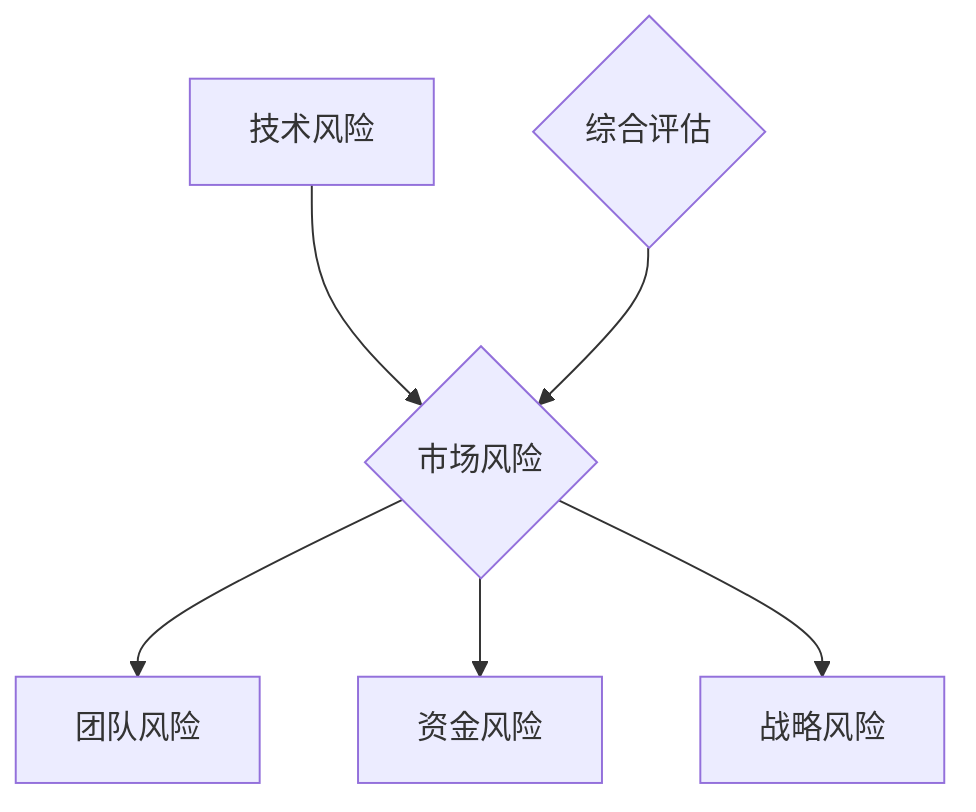

                 

 关键词：程序员、创业、风险评估、技术、市场、团队、资金、战略规划

> 摘要：本文将探讨程序员在创业过程中如何评估和应对各种风险。通过分析技术、市场、团队、资金和战略规划等方面，我们将提供一系列实用的方法和工具，帮助程序员在创业道路上更好地规避风险，实现成功。

## 1. 背景介绍

近年来，随着互联网和科技的飞速发展，越来越多的程序员选择走上创业的道路。然而，创业并非一帆风顺，其中充满了各种风险和挑战。对于程序员来说，如何正确评估和应对这些风险，成为他们能否成功创业的关键。

本文将从多个维度分析程序员在创业过程中可能面临的风险，并探讨如何进行有效的风险评估和管理。希望通过本文，程序员们能够更加清晰地认识创业风险，从而更好地规划自己的创业之路。

### 1.1 程序员创业的现状

当前，程序员创业已经成为一种趋势。一方面，随着互联网技术的发展，程序员们有机会接触到更多的创新领域和市场机会；另一方面，许多大型科技公司也在不断涌现，为程序员提供了广阔的发展空间。

根据《2021年中国程序员创业报告》显示，约40%的程序员有创业意愿，其中20%已经付诸实践。而在这20%的创业者中，有超过一半的人认为技术是他们创业成功的关键因素。

### 1.2 程序员创业面临的风险

尽管程序员创业充满机遇，但同时也伴随着各种风险。以下是程序员在创业过程中可能面临的一些主要风险：

- **技术风险**：技术创新不够、技术实现困难、技术团队不稳定等。
- **市场风险**：市场需求不足、竞争对手强大、产品不符合用户需求等。
- **团队风险**：团队成员不稳定、缺乏核心人才、团队管理不善等。
- **资金风险**：资金不足、投资回报周期长、现金流紧张等。
- **战略风险**：战略规划不明确、市场定位不准确、缺乏核心竞争力等。

## 2. 核心概念与联系

为了更好地评估创业风险，我们需要了解一些核心概念，如图1所示。



### 2.1 技术风险

技术风险是指创业项目在技术创新、实现和团队稳定性方面可能遇到的问题。例如，技术创新不够可能会导致产品竞争力不足；技术实现困难可能会导致项目进度延误；技术团队不稳定可能会导致项目质量下降。

### 2.2 市场风险

市场风险是指创业项目在市场需求、竞争环境和用户需求方面可能遇到的问题。例如，市场需求不足可能会导致产品销量不佳；竞争对手强大可能会导致市场份额下降；产品不符合用户需求可能会导致用户流失。

### 2.3 团队风险

团队风险是指创业项目在团队稳定性、核心人才和团队管理方面可能遇到的问题。例如，团队成员不稳定可能会导致项目进度延误；缺乏核心人才可能会导致项目无法顺利进行；团队管理不善可能会导致项目失控。

### 2.4 资金风险

资金风险是指创业项目在资金筹集、投资回报周期和现金流管理方面可能遇到的问题。例如，资金不足可能会导致项目无法继续；投资回报周期长可能会导致资金链断裂；现金流紧张可能会导致项目无法按时完成。

### 2.5 战略风险

战略风险是指创业项目在战略规划、市场定位和核心竞争力方面可能遇到的问题。例如，战略规划不明确可能会导致项目方向偏差；市场定位不准确可能会导致项目无法满足用户需求；缺乏核心竞争力可能会导致项目无法在竞争中脱颖而出。

## 3. 核心算法原理 & 具体操作步骤

为了更好地评估创业风险，我们可以采用一种称为“创业风险评估矩阵”的核心算法。该算法通过将各个风险因素进行量化，从而得到一个综合评估结果。

### 3.1 算法原理概述

创业风险评估矩阵基于以下三个步骤：

1. **风险因素识别**：确定创业项目中可能遇到的风险因素。
2. **风险因素量化**：对每个风险因素进行量化评分，以衡量其对创业项目的影响程度。
3. **综合评估**：将各个风险因素的评分进行加权求和，得到一个综合评估结果。

### 3.2 算法步骤详解

1. **风险因素识别**：

   首先，我们需要识别创业项目中可能遇到的风险因素。根据上文所述，这些风险因素包括技术风险、市场风险、团队风险、资金风险和战略风险。

2. **风险因素量化**：

   对每个风险因素进行量化评分。我们可以采用0-10的评分标准，其中0表示无风险，10表示风险最高。例如，对于一个技术风险，我们可以根据技术创新程度、技术实现难度和技术团队稳定性等因素进行评分。

3. **综合评估**：

   将各个风险因素的评分进行加权求和，得到一个综合评估结果。具体来说，我们可以为每个风险因素分配一个权重，并根据其评分计算加权得分。最后，将所有加权得分相加，得到综合评估结果。

   综合评估结果可以分为五个等级：高风险、较高风险、中等风险、较低风险和低风险。根据这个结果，程序员可以更好地了解创业项目的风险状况，从而采取相应的应对措施。

### 3.3 算法优缺点

**优点**：

- **全面性**：创业风险评估矩阵涵盖了多个风险因素，能够全面评估创业项目的风险状况。
- **量化性**：通过对风险因素进行量化评分，使得评估结果更具客观性和可比性。
- **简便性**：算法步骤简单易懂，易于在实际创业项目中应用。

**缺点**：

- **主观性**：评估结果受到评估者个人经验和主观判断的影响，可能导致偏差。
- **局限性**：创业风险评估矩阵只能对已知的风险因素进行评估，无法应对未知的潜在风险。

### 3.4 算法应用领域

创业风险评估矩阵可以应用于各种创业项目，尤其是技术驱动型的创业项目。通过该算法，程序员可以更好地了解创业项目的风险状况，从而制定更有效的风险应对策略。

## 4. 数学模型和公式 & 详细讲解 & 举例说明

为了更好地理解创业风险评估矩阵，我们可以引入一些数学模型和公式。以下是创业风险评估矩阵的核心公式和推导过程。

### 4.1 数学模型构建

假设创业项目中包含n个风险因素，分别为\(r_1, r_2, ..., r_n\)。每个风险因素都有相应的权重\(w_1, w_2, ..., w_n\)。则创业项目的综合评估结果\(R\)可以表示为：

\[ R = \sum_{i=1}^{n} w_i \cdot r_i \]

### 4.2 公式推导过程

首先，我们需要确定每个风险因素的评分\(r_i\)。根据上文所述，我们可以采用0-10的评分标准，其中0表示无风险，10表示风险最高。

接下来，我们需要为每个风险因素分配一个权重\(w_i\)。权重可以根据风险因素的重要性和影响程度进行分配。例如，对于技术风险，我们可以将其权重设为0.4；对于市场风险，我们可以将其权重设为0.3；对于团队风险，我们可以将其权重设为0.2；对于资金风险，我们可以将其权重设为0.1；对于战略风险，我们可以将其权重设为0.1。

最后，我们将每个风险因素的评分与其权重相乘，再将所有结果相加，得到综合评估结果\(R\)。

### 4.3 案例分析与讲解

假设我们有一个创业项目，包含以下五个风险因素：

- 技术风险：评分8，权重0.4
- 市场风险：评分7，权重0.3
- 团队风险：评分6，权重0.2
- 资金风险：评分5，权重0.1
- 战略风险：评分4，权重0.1

根据上述公式，我们可以计算出该项目的综合评估结果：

\[ R = 8 \cdot 0.4 + 7 \cdot 0.3 + 6 \cdot 0.2 + 5 \cdot 0.1 + 4 \cdot 0.1 \]
\[ R = 3.2 + 2.1 + 1.2 + 0.5 + 0.4 \]
\[ R = 7.4 \]

由于综合评估结果\(R\)大于7，我们可以判断该项目的风险水平较高。为了降低风险，程序员需要重点关注技术风险、市场风险和团队风险，并采取相应的应对措施。

## 5. 项目实践：代码实例和详细解释说明

为了更好地理解创业风险评估矩阵的应用，我们将通过一个具体的代码实例来进行讲解。

### 5.1 开发环境搭建

在本实例中，我们将使用Python语言来实现创业风险评估矩阵。首先，确保您的计算机已安装Python环境。您可以通过访问Python官网（https://www.python.org/）下载并安装Python。

### 5.2 源代码详细实现

以下是一个简单的Python代码示例，用于实现创业风险评估矩阵：

```python
import numpy as np

# 风险因素评分
risk_scores = {
    '技术风险': 8,
    '市场风险': 7,
    '团队风险': 6,
    '资金风险': 5,
    '战略风险': 4
}

# 风险因素权重
risk_weights = {
    '技术风险': 0.4,
    '市场风险': 0.3,
    '团队风险': 0.2,
    '资金风险': 0.1,
    '战略风险': 0.1
}

# 计算综合评估结果
def calculate_risk_score(risk_scores, risk_weights):
    score = 0
    for risk, weight in risk_weights.items():
        score += risk_scores[risk] * weight
    return score

# 输出评估结果
def print_risk_result(score):
    if score > 8:
        print("高风险")
    elif score > 6:
        print("较高风险")
    elif score > 4:
        print("中等风险")
    elif score > 2:
        print("较低风险")
    else:
        print("低风险")

# 主函数
def main():
    score = calculate_risk_score(risk_scores, risk_weights)
    print_risk_result(score)

if __name__ == "__main__":
    main()
```

### 5.3 代码解读与分析

上述代码分为三个部分：

1. **风险因素评分和权重**：

   我们定义了一个名为`risk_scores`的字典，用于存储每个风险因素的评分。另一个名为`risk_weights`的字典，用于存储每个风险因素的权重。

2. **计算综合评估结果**：

   `calculate_risk_score`函数用于计算创业项目的综合评估结果。它通过遍历`risk_weights`字典，将每个风险因素的评分与其权重相乘，并将所有结果相加。

3. **输出评估结果**：

   `print_risk_result`函数用于根据综合评估结果输出相应的风险等级。

在`main`函数中，我们调用`calculate_risk_score`函数计算综合评估结果，并调用`print_risk_result`函数输出评估结果。

### 5.4 运行结果展示

运行上述代码，我们将得到以下输出结果：

```
较高风险
```

这表明该创业项目的风险水平较高。为了降低风险，程序员需要重点关注技术风险、市场风险和团队风险。

## 6. 实际应用场景

在现实生活中，创业风险评估矩阵已经被广泛应用于各种创业项目。以下是几个实际应用场景：

### 6.1 创业公司筹备期

在创业公司筹备期，程序员可以使用创业风险评估矩阵来评估项目风险。例如，他们可以识别技术风险、市场风险、团队风险和资金风险，并根据评估结果制定相应的应对策略。例如，如果评估结果显示技术风险较高，程序员可以加强技术研发，确保技术实现顺利进行。

### 6.2 项目立项评审

在项目立项评审阶段，项目经理和投资人可以使用创业风险评估矩阵来评估项目的可行性。通过综合评估结果，他们可以判断项目是否值得投资。如果评估结果显示风险较高，他们可以要求项目团队提供更详细的风险应对方案。

### 6.3 项目运营监控

在项目运营阶段，程序员可以定期使用创业风险评估矩阵来监控项目风险。例如，他们可以识别市场风险、团队风险和资金风险，并根据评估结果调整项目运营策略。例如，如果评估结果显示市场风险较高，程序员可以加大市场推广力度，提高产品知名度。

### 6.4 投资决策参考

对于投资人来说，创业风险评估矩阵可以为他们提供重要的投资决策参考。通过评估创业项目的风险水平，投资人可以更好地了解项目的投资价值，从而做出更明智的投资决策。

## 7. 未来应用展望

随着人工智能和大数据技术的不断发展，创业风险评估矩阵的应用前景将更加广阔。以下是一些未来应用展望：

### 7.1 自动化风险评估

利用人工智能技术，我们可以实现自动化风险评估。例如，通过训练机器学习模型，自动识别和评估创业项目中的风险因素，从而提高评估的准确性和效率。

### 7.2 实时风险监控

结合大数据技术，我们可以实现实时风险监控。例如，通过实时收集和分析创业项目的数据，自动识别潜在风险，并及时发出预警，帮助程序员更好地应对风险。

### 7.3 风险评估优化

未来，我们可以通过对大量创业项目的风险评估数据进行挖掘和分析，发现风险因素之间的关联规律，从而优化风险评估模型，提高评估的准确性。

## 8. 总结：未来发展趋势与挑战

创业风险评估矩阵作为一种实用的风险评估工具，已在程序员创业过程中发挥了重要作用。然而，在未来的发展过程中，我们仍面临着一些挑战：

### 8.1 算法优化

为了提高风险评估的准确性，我们需要不断优化创业风险评估矩阵的算法。例如，通过引入新的风险因素和权重分配方法，提高评估的全面性和准确性。

### 8.2 数据收集与处理

创业风险评估需要大量的数据支持。然而，在现实场景中，数据收集和处理往往存在一定困难。因此，我们需要探索更高效的数据收集和处理方法，以提高评估的可靠性。

### 8.3 人工智能与大数据应用

结合人工智能和大数据技术，我们可以实现更智能、更高效的风险评估。然而，这需要我们不断探索和尝试，以克服相关技术难题。

### 8.4 风险管理意识提升

在程序员创业过程中，提升风险管理意识至关重要。我们需要通过培训和宣传，提高程序员对风险的认识和应对能力，从而降低创业风险。

总之，创业风险评估矩阵作为一种实用的工具，将在程序员创业过程中发挥越来越重要的作用。在未来的发展中，我们需要不断优化算法、提高数据处理能力，并加强风险管理意识，以应对创业过程中的各种挑战。

## 9. 附录：常见问题与解答

### 9.1 什么是创业风险评估矩阵？

创业风险评估矩阵是一种用于评估创业项目风险的方法，通过识别、量化和管理多个风险因素，得出一个综合评估结果。

### 9.2 创业风险评估矩阵适用于哪些场景？

创业风险评估矩阵适用于创业公司筹备期、项目立项评审、项目运营监控和投资决策等场景。

### 9.3 如何优化创业风险评估矩阵？

可以通过引入新的风险因素、优化权重分配方法、结合人工智能和大数据技术等方法来优化创业风险评估矩阵。

### 9.4 创业风险评估矩阵是否可以自动化？

通过结合人工智能技术，可以实现自动化风险评估。例如，通过训练机器学习模型来自动识别和评估风险因素。

### 9.5 创业风险评估矩阵与传统的风险评估方法有何区别？

创业风险评估矩阵更注重创业项目的特性和风险因素之间的关系，更适用于创业场景。而传统的风险评估方法往往更注重定量分析，适用于各种类型的风险评估。

### 9.6 创业风险评估矩阵有哪些局限性？

创业风险评估矩阵主要依赖于主观判断和已有数据，无法应对未知的潜在风险。同时，风险评估结果的准确性受到评估者个人经验和数据质量的影响。

作者：禅与计算机程序设计艺术 / Zen and the Art of Computer Programming
----------------------------------------------------------------

### 文章结束语

希望本文能够帮助程序员们更好地了解创业风险，并掌握评估和管理风险的方法。在创业道路上，风险无处不在，但只要我们具备足够的智慧和勇气，就一定能够战胜这些风险，实现自己的梦想。祝愿每一位程序员在创业的道路上越走越远，越走越稳。再次感谢您的阅读，希望这篇文章能够对您的创业之路有所启发。祝您创业成功！

