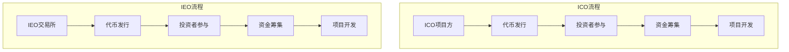

                 

 **关键词：**
- ICO
- IEO
- 程序员
- 项目评估
- 区块链

<|assistant|> **摘要：**
本文旨在为程序员提供一套全面的指导，帮助他们评估和参与Initial Coin Offerings（ICO）与Initial Exchange Offerings（IEO）项目。我们将深入探讨ICO与IEO的基本概念、评估方法、参与流程以及潜在的风险。通过本文，程序员可以更好地理解这些项目的工作原理，从而做出明智的投资决策。

## 1. 背景介绍

### 1.1 ICO与IEO的定义

**ICO（Initial Coin Offering）** 是一种通过发行代币来筹集资金的方式，旨在为初创公司或项目提供资金。参与者以比特币、以太坊等加密货币购买这些代币，从而成为项目的支持者。

**IEO（Initial Exchange Offering）** 是ICO的一种变体，由加密货币交易所发起，提供一种在交易所内部进行代币发行的机制。IEO相较于ICO有更严格的审查流程，因此被看作是更安全的选择。

### 1.2 ICO与IEO的发展历程

ICO起源于2017年，当时区块链和加密货币领域处于高速发展阶段。由于ICO的简单性和高回报潜力，许多项目选择通过ICO来筹集资金。然而，随着市场的快速发展，ICO也逐渐暴露出一些问题，如项目质量参差不齐、资金流向不透明等。为了应对这些问题，IEO应运而生。

### 1.3 ICO与IEO的现状

目前，ICO与IEO仍然是加密货币领域重要的融资方式。然而，由于监管政策的不断加强，一些国家已对ICO进行了严格限制，甚至禁止。与此同时，IEO逐渐成为主流，因其更严格的审核机制和交易所的信用背书，吸引了大量投资者。

## 2. 核心概念与联系

### 2.1 ICO的核心概念

- **代币发行**：项目方通过区块链技术发行代币，用于筹集资金。
- **投资者参与**：投资者以加密货币购买项目方发行的代币。
- **资金筹集**：项目方通过出售代币筹集到资金，用于项目开发。
- **代币价值**：代币的价值通常与项目的进展和市场需求相关。

### 2.2 IEO的核心概念

- **交易所角色**：IEO由加密货币交易所发起，交易所负责项目的审核和代币的发行。
- **投资者参与**：投资者通过交易所购买项目方发行的代币。
- **资金筹集**：项目方通过交易所发行代币筹集资金。
- **代币交易**：代币在交易所进行交易，投资者可以随时买卖。

### 2.3 ICO与IEO的联系与区别

- **联系**：ICO与IEO都是通过发行代币来筹集资金的方式。
- **区别**：ICO的审核较为宽松，而IEO的审核较为严格；ICO的资金直接流向项目方，而IEO的资金流向受到交易所的监管。

### 2.4 ICO与IEO的Mermaid流程图



## 3. 核心算法原理 & 具体操作步骤

### 3.1 算法原理概述

ICO与IEO项目的核心算法主要涉及代币的发行与分配、投资者的参与以及资金的筹集与管理。以下是这些算法的基本原理：

- **代币发行**：项目方通过智能合约发行代币，智能合约定义了代币的数量、分配方式以及发行时间表。
- **投资者参与**：投资者通过加密货币交易所或直接与项目方交互，购买项目方发行的代币。
- **资金筹集**：项目方将筹集到的资金用于项目开发，智能合约负责监管资金的流向。

### 3.2 算法步骤详解

#### ICO项目方操作步骤

1. **制定代币发行计划**：项目方制定代币发行计划，包括代币名称、总量、分配比例、发行时间表等。
2. **编写智能合约**：项目方使用智能合约编写工具（如Truffle）编写智能合约，智能合约定义了代币的发行规则和分配方式。
3. **部署智能合约**：项目方将智能合约部署到区块链上，通常使用以太坊链。
4. **宣传和营销**：项目方通过社交媒体、社区活动等方式宣传项目，吸引投资者参与。
5. **代币发行**：智能合约根据预设的时间表逐步发行代币。
6. **资金管理**：项目方将筹集到的资金存入智能合约指定的钱包，并按照项目开发计划进行使用。

#### 投资者操作步骤

1. **准备加密货币**：投资者准备好用于购买的比特币、以太坊等加密货币。
2. **注册交易所账户**：投资者在加密货币交易所注册账户，完成身份验证。
3. **充值加密货币**：投资者将比特币、以太坊等加密货币充值到交易所账户。
4. **参与代币发行**：投资者通过交易所参与项目方的代币发行，以加密货币购买代币。
5. **代币分配**：投资者按照购买数量和分配比例获得代币。

#### IEO交易所操作步骤

1. **项目审核**：交易所对项目进行审核，确保项目质量、资金用途合规。
2. **代币发行计划**：交易所制定代币发行计划，包括代币名称、总量、发行时间表等。
3. **部署智能合约**：交易所使用智能合约编写工具编写智能合约，并部署到区块链上。
4. **代币发行**：交易所按照计划发行代币，投资者可以通过交易所购买。
5. **资金管理**：交易所监管筹集到的资金，确保资金按照项目开发计划进行使用。

### 3.3 算法优缺点

#### 优点

- **便捷性**：ICO与IEO项目提供了快速、便捷的融资方式。
- **透明性**：智能合约确保了项目的透明性，投资者可以清楚地了解资金的流向。
- **灵活性**：项目方可以根据市场需求灵活调整代币发行策略。

#### 缺点

- **风险**：项目质量参差不齐，投资者可能面临资金损失的风险。
- **监管**：一些国家对ICO与IEO项目进行严格监管，增加了项目的合规成本。
- **技术要求**：投资者需要具备一定的技术知识，才能理解和参与ICO与IEO项目。

### 3.4 算法应用领域

ICO与IEO项目主要应用于以下领域：

- **区块链项目**：如去中心化金融（DeFi）、智能合约平台等。
- **加密货币项目**：如稳定币、去中心化交易所等。
- **其他新兴项目**：如去中心化应用（DApp）、物联网（IoT）等。

## 4. 数学模型和公式 & 详细讲解 & 举例说明

### 4.1 数学模型构建

ICO与IEO项目的数学模型主要涉及代币数量、发行时间表、投资者参与比例以及资金筹集目标等。

#### 代币数量模型

代币数量模型描述了项目方发行的代币总量以及分配比例。假设项目方发行的代币总量为 \( N \)，其中 \( P_1 \) 为私募代币数量，\( P_2 \) 为公募代币数量，\( P_3 \) 为团队代币数量，则有以下公式：

\[ N = P_1 + P_2 + P_3 \]

其中，\( P_1, P_2, P_3 \) 的分配比例可以根据项目方的需求进行设定。

#### 发行时间表模型

发行时间表模型描述了代币的发行时间和数量。假设项目方在 \( T_1 \) 时刻开始发行代币，\( T_2 \) 时刻结束发行，则在每个时间段内发行的代币数量为 \( Q(t) \)。则有以下公式：

\[ Q(t) = \begin{cases} 
N \cdot \frac{T_2 - t}{T_2 - T_1} & \text{如果 } T_1 \leq t \leq T_2 \\
0 & \text{否则} 
\end{cases} \]

#### 投资者参与比例模型

投资者参与比例模型描述了投资者购买代币的比例。假设投资者 \( I_i \) 购买了 \( Q_i \) 个代币，总代币数量为 \( N \)，则投资者 \( I_i \) 的参与比例为：

\[ R_i = \frac{Q_i}{N} \]

#### 资金筹集目标模型

资金筹集目标模型描述了项目方的资金筹集目标。假设项目方设定的资金筹集目标为 \( T \)，投资者以 \( P \) 的价格购买代币，则项目方筹集到的资金为：

\[ F = P \cdot N \]

其中，\( F \) 为筹集到的资金，\( P \) 为代币价格，\( N \) 为代币总量。

### 4.2 公式推导过程

#### 代币数量模型推导

代币数量模型可以通过以下步骤进行推导：

1. **设定代币总量**：项目方设定代币总量 \( N \)。
2. **分配比例**：根据项目方的需求设定私募代币数量 \( P_1 \)、公募代币数量 \( P_2 \) 和团队代币数量 \( P_3 \)。
3. **计算总量**：根据分配比例计算代币总量 \( N \)。

#### 发行时间表模型推导

发行时间表模型可以通过以下步骤进行推导：

1. **设定发行时间段**：项目方设定发行时间段为 \( [T_1, T_2] \)。
2. **计算发行数量**：在每个时间段内，根据发行时间段的长度和总量比例计算发行数量 \( Q(t) \)。

#### 投资者参与比例模型推导

投资者参与比例模型可以通过以下步骤进行推导：

1. **设定投资者购买数量**：投资者 \( I_i \) 购买了 \( Q_i \) 个代币。
2. **计算参与比例**：根据总代币数量 \( N \) 计算投资者 \( I_i \) 的参与比例 \( R_i \)。

#### 资金筹集目标模型推导

资金筹集目标模型可以通过以下步骤进行推导：

1. **设定筹集目标**：项目方设定筹集目标为 \( T \)。
2. **计算筹集资金**：根据代币价格 \( P \) 和代币总量 \( N \) 计算筹集到的资金 \( F \)。

### 4.3 案例分析与讲解

以下是一个简单的ICO项目案例分析：

**项目背景**：某个区块链项目计划通过ICO筹集1000万美元，其中私募代币占比20%，公募代币占比70%，团队代币占比10%。

**发行时间表**：ICO项目在2021年1月1日开始，持续到2021年1月31日。

**投资者参与**：投资者小明购买了100个代币，总代币数量为1000个。

**资金筹集**：根据设定，项目方筹集到的资金为1000万美元。

#### 代币数量模型

根据项目方的需求，代币数量模型如下：

\[ N = P_1 + P_2 + P_3 \]

其中，\( P_1 = 0.2 \times N \)，\( P_2 = 0.7 \times N \)，\( P_3 = 0.1 \times N \)。

假设 \( N = 1000 \)，则：

\[ N = 1000 \]
\[ P_1 = 200 \]
\[ P_2 = 700 \]
\[ P_3 = 100 \]

#### 发行时间表模型

根据发行时间表，项目方在2021年1月1日至2021年1月31日之间发行代币。假设每天发行的代币数量为总代币数量的1/31，则：

\[ Q(t) = \begin{cases} 
1000 \cdot \frac{31 - t}{31} & \text{如果 } t \in [1, 31] \\
0 & \text{否则} 
\end{cases} \]

#### 投资者参与比例模型

小明购买了100个代币，总代币数量为1000个，则：

\[ R_i = \frac{Q_i}{N} = \frac{100}{1000} = 0.1 \]

#### 资金筹集目标模型

根据设定，项目方筹集到的资金为1000万美元，假设代币价格为1美元，则：

\[ F = P \cdot N = 1 \cdot 1000 = 1000 \text{万美元} \]

## 5. 项目实践：代码实例和详细解释说明

### 5.1 开发环境搭建

在进行ICO与IEO项目的开发之前，程序员需要搭建一个适合的开发环境。以下是搭建开发环境的步骤：

1. **安装Node.js**：Node.js 是一个基于Chrome V8引擎的JavaScript运行环境，用于开发以太坊智能合约。
   ```bash
   sudo apt-get update
   sudo apt-get install nodejs npm
   npm install -g truffle
   ```

2. **安装Ganache**：Ganache 是一个以太坊本地节点和测试网，用于开发和使用以太坊智能合约。
   ```bash
   npm install -g ganache-cli
   ganache --help
   ```

3. **安装Metamask**：Metamask 是一个浏览器插件钱包，用于管理以太坊账户。
   ```bash
   # 从浏览器插件市场安装 Metamask
   ```

### 5.2 源代码详细实现

以下是一个简单的ICO项目源代码实例，展示了如何使用Solidity编写智能合约：

```solidity
// SPDX-License-Identifier: MIT
pragma solidity ^0.8.0;

contract ICO {
    address public owner;
    uint256 public totalSupply;
    uint256 public maxSupply;
    uint256 public fundraisingEnd;
    uint256 public fundingGoal;
    bool public isFundraisingActive;

    mapping(address => uint256) public balanceOf;

    event Transfer(address from, address to, uint256 amount);

    constructor() {
        owner = msg.sender;
        totalSupply = 1000000 * (10 ** 18); // 总供应量
        maxSupply = totalSupply; // 最大供应量
        fundraisingEnd = now + 60 days; // 融资结束时间
        fundingGoal = 1000000 * (10 ** 18); // 融资目标
        isFundraisingActive = true;
    }

    function buyTokens() public payable {
        require(isFundraisingActive, "Fundraising is not active");
        require(now <= fundraisingEnd, "Fundraising has ended");
        require(msg.value > 0, "You must send a non-zero value");

        uint256 tokens = msg.value * (10 ** 18); // 计算购买代币数量
        require(totalSupply - tokens >= 0, "Insufficient tokens left for purchase");

        balanceOf[msg.sender] += tokens;
        totalSupply -= tokens;

        emit Transfer(address(this), msg.sender, tokens);
    }

    function refund() public {
        require(now > fundraisingEnd, "Fundraising has not ended yet");
        require(balanceOf[msg.sender] > 0, "You do not have any tokens to refund");

        uint256 refundAmount = balanceOf[msg.sender];
        balanceOf[msg.sender] = 0;

        payable(msg.sender).transfer(refundAmount);
    }

    function endFundraising() public {
        require(msg.sender == owner, "Only the owner can end fundraising");
        require(now > fundraisingEnd, "Fundraising has not ended yet");

        isFundraisingActive = false;
    }

    function transferOwnership(address newOwner) public {
        require(msg.sender == owner, "Only the owner can transfer ownership");
        owner = newOwner;
    }
}
```

### 5.3 代码解读与分析

#### 构造函数

构造函数 `constructor()` 用于初始化合约的参数，包括：

- `owner`：合约的所有者地址。
- `totalSupply`：代币的总供应量。
- `maxSupply`：代币的最大供应量。
- `fundraisingEnd`：融资结束时间。
- `fundingGoal`：融资目标。
- `isFundraisingActive`：融资活动是否激活。

#### `buyTokens()` 函数

`buyTokens()` 函数允许投资者通过发送以太币购买代币。函数的主要步骤包括：

- 检查融资活动是否激活和是否已结束。
- 检查交易金额是否大于0。
- 计算购买代币数量。
- 检查是否足够剩余代币进行购买。
- 更新投资者的代币余额和总供应量。

#### `refund()` 函数

`refund()` 函数允许投资者在融资结束后退回未购买的代币。函数的主要步骤包括：

- 检查融资活动是否已结束。
- 检查投资者是否有代币余额。
- 更新投资者的代币余额并将退款发送到投资者的地址。

#### `endFundraising()` 函数

`endFundraising()` 函数允许合约所有者结束融资活动。函数的主要步骤包括：

- 检查合约所有者是否为调用者。
- 检查融资活动是否已结束。

#### `transferOwnership()` 函数

`transferOwnership()` 函数允许合约所有者将合约所有权转让给新的地址。函数的主要步骤包括：

- 检查合约所有者是否为调用者。

### 5.4 运行结果展示

在开发环境中部署上述智能合约后，可以使用Metamask模拟交易并查看结果。以下是一个简单的示例：

1. **部署合约**：

```bash
truffle create account
truffle migrate --network development
```

2. **查看合约地址**：

```bash
truffle console
> contract.address
```

3. **购买代币**：

使用Metamask连接到合约地址，调用 `buyTokens()` 函数发送以太币购买代币。

4. **查看余额**：

调用 `balanceOf()` 函数查看投资者的代币余额。

5. **退款**：

在融资结束后，调用 `refund()` 函数退回未购买的代币。

6. **结束融资**：

合约所有者调用 `endFundraising()` 函数结束融资活动。

## 6. 实际应用场景

### 6.1 区块链项目融资

ICO与IEO为区块链项目提供了便捷的融资渠道。例如，去中心化金融（DeFi）项目通过ICO筹集资金，用于开发去中心化交易平台、贷款平台等。

### 6.2 加密货币项目发行

ICO与IEO也为新的加密货币项目提供了发行平台。例如，稳定币项目通过ICO筹集资金，发行与法币挂钩的代币。

### 6.3 其他新兴项目融资

除了区块链项目，ICO与IEO还可以应用于其他新兴项目，如物联网（IoT）、人工智能（AI）等。这些项目可以通过ICO与IEO筹集资金，用于技术研发和市场推广。

## 7. 工具和资源推荐

### 7.1 学习资源推荐

- **区块链入门教程**：[区块链入门教程](https://www.blockchain.com/)
- **Solidity文档**：[Solidity官方文档](https://soliditylang.org/docs/)
- **Truffle文档**：[Truffle官方文档](https://www.trufflesuite.com/docs/truffle/getting-started/quick-start)

### 7.2 开发工具推荐

- **Metamask**：[Metamask官方网站](https://metamask.io/)
- **Truffle**：[Truffle官方网站](https://www.trufflesuite.com/)

### 7.3 相关论文推荐

- **"Initial Coin Offerings: Promise, Perils, and Possible Legal Responses"**：探讨ICO的法律问题和监管挑战。
- **"Initial Exchange Offerings: A New Era for Token Sales"**：分析IEO的兴起和发展趋势。

## 8. 总结：未来发展趋势与挑战

### 8.1 研究成果总结

ICO与IEO项目在区块链领域取得了显著的研究成果，为初创公司提供了新的融资渠道，促进了区块链技术的发展。然而，随着市场的不断演变，ICO与IEO项目也面临着诸多挑战。

### 8.2 未来发展趋势

- **监管加强**：随着各国政府对ICO与IEO的监管力度加大，项目方和投资者需遵循更严格的合规要求。
- **技术创新**：区块链技术的不断进步将推动ICO与IEO项目向更高效、更安全、更透明方向发展。
- **市场成熟**：随着市场的逐渐成熟，ICO与IEO项目的质量将逐步提升，投资风险将降低。

### 8.3 面临的挑战

- **监管挑战**：ICO与IEO项目需遵循各国不同的法律法规，面临监管合规的挑战。
- **技术风险**：智能合约的安全性问题、区块链网络性能瓶颈等是ICO与IEO项目需要克服的技术挑战。
- **市场风险**：市场波动、投资者情绪等可能导致ICO与IEO项目的失败。

### 8.4 研究展望

未来，研究人员和从业者需关注以下方面：

- **智能合约安全**：提升智能合约的安全性和可靠性，减少项目风险。
- **监管合作**：推动各国监管机构之间的合作，建立统一的监管框架。
- **技术创新**：探索区块链技术在ICO与IEO项目中的应用，提升项目效率。

## 9. 附录：常见问题与解答

### 9.1 ICO与IEO的区别是什么？

ICO与IEO的主要区别在于审核机制、资金流向和安全性。ICO审核较为宽松，资金直接流向项目方，安全性相对较低；而IEO由交易所发起，审核较为严格，资金流向受到交易所监管，安全性较高。

### 9.2 ICO与IEO项目的风险有哪些？

ICO与IEO项目的风险包括项目质量参差不齐、资金流向不透明、市场波动、技术风险等。投资者需谨慎评估项目风险，避免盲目跟风。

### 9.3 如何评估ICO与IEO项目的质量？

评估ICO与IEO项目的质量可以从以下方面入手：

- **项目团队**：了解项目团队的背景和经验，评估团队的专业能力。
- **白皮书**：阅读项目白皮书，了解项目的愿景、目标、技术方案等。
- **市场前景**：分析项目的市场前景，评估项目的可行性。
- **技术实现**：了解项目的技术实现，评估项目的技术可行性。
- **合作伙伴**：了解项目的合作伙伴，评估项目的资源支持。

### 9.4 如何参与ICO与IEO项目？

参与ICO与IEO项目的步骤包括：

1. **了解项目**：仔细阅读项目白皮书，了解项目的背景、愿景、目标等。
2. **准备资金**：准备好用于参与项目的加密货币，如比特币、以太坊等。
3. **注册账户**：在加密货币交易所注册账户，完成身份验证。
4. **参与购买**：通过交易所参与项目方的代币发行，以加密货币购买代币。
5. **资金管理**：参与项目后，关注项目的进展，进行资金管理。

### 9.5 ICO与IEO项目的资金筹集目标是什么？

ICO与IEO项目的资金筹集目标通常包括以下方面：

- **项目开发**：用于项目的开发、测试、部署等。
- **市场推广**：用于项目的市场推广、品牌建设等。
- **运营费用**：用于项目的日常运营、团队薪资等。

### 9.6 ICO与IEO项目的代币分配方式有哪些？

ICO与IEO项目的代币分配方式通常包括以下方面：

- **私募代币**：分配给项目方和早期投资者。
- **公募代币**：分配给普通投资者。
- **团队代币**：分配给项目团队成员。
- **社区代币**：分配给社区成员和贡献者。

### 9.7 ICO与IEO项目的融资进度如何查询？

ICO与IEO项目的融资进度通常在项目官方网站、社交媒体渠道等公布。投资者可以通过以下方式查询融资进度：

- **项目官网**：查看项目官网上公布的融资进度。
- **社交媒体**：关注项目官方社交媒体账号，获取最新融资信息。
- **交易所公告**：关注参与项目的交易所公告，了解项目的最新进展。

### 9.8 ICO与IEO项目的成功标准是什么？

ICO与IEO项目的成功标准包括以下方面：

- **融资目标达成**：项目方成功筹集到预定的资金目标。
- **项目进展**：项目按计划顺利进行，达到预期里程碑。
- **市场认可**：项目在市场上得到广泛认可，代币价格表现良好。
- **社区参与**：项目社区活跃，用户参与度高。

### 9.9 ICO与IEO项目的失败标准是什么？

ICO与IEO项目的失败标准包括以下方面：

- **融资失败**：项目方未能筹集到预定的资金目标。
- **项目停滞**：项目进展缓慢，未能按计划达到预期里程碑。
- **资金流失**：项目方资金管理不当，导致资金流失。
- **法律风险**：项目方涉嫌违法，面临法律风险。

### 9.10 ICO与IEO项目的投资者保护措施有哪些？

ICO与IEO项目的投资者保护措施包括以下方面：

- **项目审核**：交易所对项目进行严格审核，确保项目质量。
- **资金监管**：交易所监管筹集到的资金，确保资金按照项目开发计划进行使用。
- **智能合约安全**：项目方使用安全的智能合约，确保项目透明性。
- **法律合规**：项目方遵守各国法律法规，确保项目的合规性。

### 9.11 ICO与IEO项目的投资策略有哪些？

ICO与IEO项目的投资策略包括以下方面：

- **分散投资**：将投资分散到多个项目，降低风险。
- **风险控制**：设置投资预算，避免过度投资。
- **长期持有**：选择有潜力的项目进行长期投资。
- **短期交易**：根据市场行情进行短期交易，获取收益。

### 9.12 ICO与IEO项目的常见问题有哪些？

ICO与IEO项目的常见问题包括以下方面：

- **项目质量**：项目方是否具备专业能力，项目是否具有实际应用价值。
- **资金用途**：项目方筹集到的资金是否用于项目开发，是否合规使用。
- **项目进度**：项目是否按计划进行，是否达到预期里程碑。
- **市场前景**：项目在市场上的竞争力，是否具有长期发展潜力。
- **技术实现**：项目的技术实现是否可行，是否具有创新性。
- **合规性**：项目方是否遵守各国法律法规，是否合规运营。

### 9.13 ICO与IEO项目的市场规律有哪些？

ICO与IEO项目的市场规律包括以下方面：

- **市场波动**：市场行情波动对ICO与IEO项目的影响。
- **项目热度**：项目在市场上的关注度，对项目融资和代币价格的影响。
- **竞争环境**：同类项目之间的竞争，对市场格局的影响。
- **监管政策**：各国监管政策的变动，对ICO与IEO项目的影响。
- **投资者情绪**：投资者情绪对市场行情和项目表现的影响。

### 9.14 ICO与IEO项目的未来发展方向有哪些？

ICO与IEO项目的未来发展方向包括以下方面：

- **技术创新**：探索区块链技术的创新应用，提升项目价值。
- **监管合作**：推动各国监管机构之间的合作，建立统一的监管框架。
- **市场成熟**：市场逐渐成熟，项目质量提升，投资风险降低。
- **投资多元化**：投资者对ICO与IEO项目的投资更加多元化，风险分散。
- **生态系统建设**：建立完善的ICO与IEO项目生态系统，促进区块链技术的发展。

## 文章作者

**作者：禅与计算机程序设计艺术 / Zen and the Art of Computer Programming**<|im_sep|>

