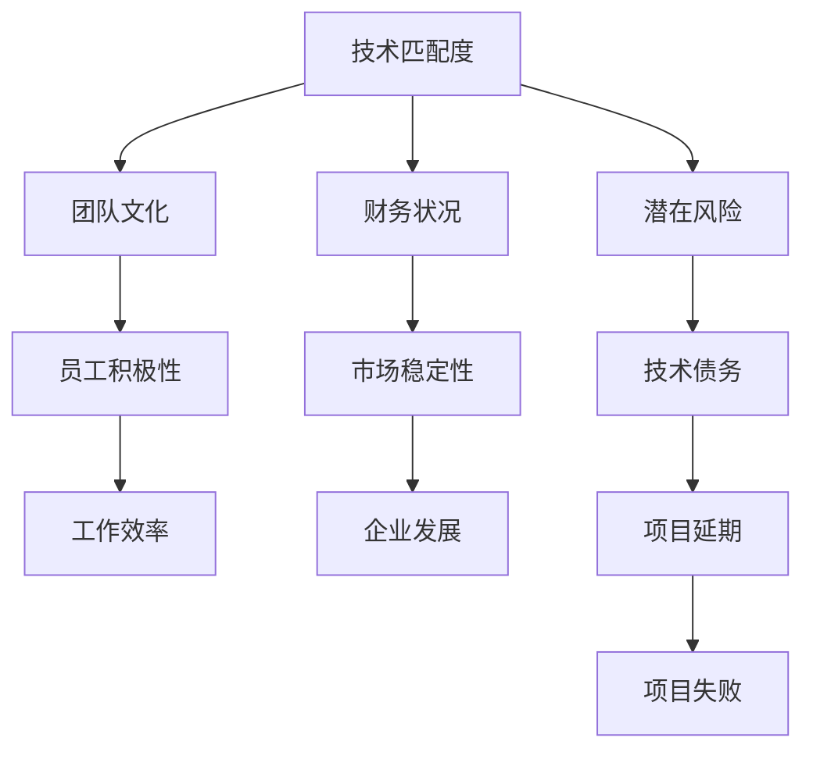

                 

关键词：并购，评估，程序员，offer，技术，商业，风险管理

> 摘要：本文将深入探讨程序员在评估并购offer时需要考虑的关键因素，包括技术匹配度、团队文化、财务状况、以及潜在风险。通过分析这些因素，程序员可以做出更为明智的决策，确保个人职业发展和公司利益的平衡。

## 1. 背景介绍

随着全球科技产业的快速发展，企业之间的并购活动日益频繁。对于程序员而言，并购不仅可能带来职业上的新机遇，也可能引发一系列复杂的挑战。如何评估并购offer，以确保个人职业发展的同时，最大化公司利益，成为每个程序员都需要思考的问题。

## 2. 核心概念与联系

在评估并购offer时，程序员需要理解几个核心概念：

- **技术匹配度**：评估目标公司的技术架构和开发工具是否与自身技能和经验相匹配。
- **团队文化**：了解目标公司的团队氛围、价值观和合作方式是否与自身相符。
- **财务状况**：分析目标公司的财务健康状况，包括盈利能力、债务情况和市场地位。
- **潜在风险**：识别并购可能带来的风险，如技术债务、市场不确定性等。

下面是这几个核心概念的联系的Mermaid流程图：



## 3. 核心算法原理 & 具体操作步骤

### 3.1 算法原理概述

评估并购offer的算法原理可以概括为：

1. **数据收集**：收集目标公司的相关信息，包括技术架构、团队文化、财务状况等。
2. **指标分析**：将收集的数据转化为具体的指标，如技术匹配度得分、团队文化得分、财务状况得分等。
3. **风险评估**：评估潜在风险，并计算其可能对并购的影响。
4. **综合评估**：将各项指标和风险评估结果进行综合，得出最终的评估结果。

### 3.2 算法步骤详解

#### 3.2.1 数据收集

- **技术匹配度**：通过分析目标公司的技术栈、开发工具和框架，评估与自身技能的匹配度。
- **团队文化**：通过面试、员工反馈和公司内部资料，了解目标公司的团队文化。
- **财务状况**：通过查看财务报表、市场报告等，评估目标公司的财务健康状况。

#### 3.2.2 指标分析

- **技术匹配度得分**：使用加权评分方法，将各个维度的技术匹配度进行量化。
- **团队文化得分**：同样使用加权评分方法，将团队文化的各个维度进行量化。
- **财务状况得分**：使用财务指标，如利润率、增长率等，进行量化评分。

#### 3.2.3 风险评估

- **技术风险**：评估目标公司的技术债务、项目延期等潜在技术风险。
- **市场风险**：评估目标公司在市场中的竞争地位、市场需求变化等潜在市场风险。

#### 3.2.4 综合评估

- **加权平均**：将各项得分进行加权平均，得出综合评估得分。
- **风险评估**：将风险评估结果纳入综合评估，考虑其可能对并购的影响。

### 3.3 算法优缺点

**优点**：

- **系统性**：通过算法，可以系统地评估并购offer，减少主观偏见。
- **量化分析**：将复杂的信息转化为量化指标，便于比较和分析。

**缺点**：

- **数据依赖**：算法的准确性依赖于收集的数据，如果数据不准确，评估结果也会受到影响。
- **时间成本**：评估过程需要收集和分析大量的数据，可能需要较长的时间。

### 3.4 算法应用领域

该算法不仅适用于程序员在评估并购offer时使用，也可以应用于企业战略规划、招聘决策等多个领域。

## 4. 数学模型和公式 & 详细讲解 & 举例说明

### 4.1 数学模型构建

评估并购offer的数学模型可以构建为：

$$
S = w_1 \cdot T + w_2 \cdot C + w_3 \cdot F + w_4 \cdot R
$$

其中，$S$ 表示综合评估得分，$T$ 表示技术匹配度得分，$C$ 表示团队文化得分，$F$ 表示财务状况得分，$R$ 表示风险评估得分，$w_1, w_2, w_3, w_4$ 分别表示各项得分的权重。

### 4.2 公式推导过程

#### 4.2.1 技术匹配度得分

$$
T = \sum_{i=1}^{n} w_i \cdot t_i
$$

其中，$n$ 表示技术维度个数，$w_i$ 表示第 $i$ 个技术维度的权重，$t_i$ 表示第 $i$ 个技术维度的得分。

#### 4.2.2 团队文化得分

$$
C = \sum_{j=1}^{m} w_j \cdot c_j
$$

其中，$m$ 表示团队文化维度个数，$w_j$ 表示第 $j$ 个团队文化维度的权重，$c_j$ 表示第 $j$ 个团队文化维度的得分。

#### 4.2.3 财务状况得分

$$
F = \sum_{k=1}^{p} w_k \cdot f_k
$$

其中，$p$ 表示财务维度个数，$w_k$ 表示第 $k$ 个财务维度的权重，$f_k$ 表示第 $k$ 个财务维度的得分。

#### 4.2.4 风险评估得分

$$
R = \sum_{l=1}^{q} w_l \cdot r_l
$$

其中，$q$ 表示风险维度个数，$w_l$ 表示第 $l$ 个风险维度的权重，$r_l$ 表示第 $l$ 个风险维度的得分。

### 4.3 案例分析与讲解

假设我们评估一家初创公司的并购offer，使用上述数学模型进行分析。

#### 4.3.1 技术匹配度得分

- 技术维度：Java开发、前端框架、数据库
- 权重：0.4, 0.3, 0.3
- 得分：0.8, 0.7, 0.6

$$
T = 0.4 \cdot 0.8 + 0.3 \cdot 0.7 + 0.3 \cdot 0.6 = 0.74
$$

#### 4.3.2 团队文化得分

- 团队文化维度：开放性、协作性、创新性
- 权重：0.3, 0.3, 0.4
- 得分：0.7, 0.8, 0.6

$$
C = 0.3 \cdot 0.7 + 0.3 \cdot 0.8 + 0.4 \cdot 0.6 = 0.67
$$

#### 4.3.3 财务状况得分

- 财务维度：盈利能力、增长率、市场份额
- 权重：0.4, 0.3, 0.3
- 得分：0.6, 0.5, 0.7

$$
F = 0.4 \cdot 0.6 + 0.3 \cdot 0.5 + 0.3 \cdot 0.7 = 0.64
$$

#### 4.3.4 风险评估得分

- 风险维度：技术债务、市场不确定性、竞争压力
- 权重：0.3, 0.3, 0.4
- 得分：0.8, 0.7, 0.6

$$
R = 0.3 \cdot 0.8 + 0.3 \cdot 0.7 + 0.4 \cdot 0.6 = 0.69
$$

#### 4.3.5 综合评估得分

$$
S = 0.74 + 0.67 + 0.64 + 0.69 = 2.74
$$

根据综合评估得分，可以初步判断该并购offer的吸引力。

## 5. 项目实践：代码实例和详细解释说明

### 5.1 开发环境搭建

在本项目中，我们将使用Python语言进行编程。首先，确保安装了Python环境，并安装必要的库，如Pandas、NumPy等。

```bash
pip install pandas numpy
```

### 5.2 源代码详细实现

下面是一个简单的代码实例，用于评估并购offer。

```python
import pandas as pd
import numpy as np

# 技术匹配度得分
tech_scores = {'Java开发': 0.8, '前端框架': 0.7, '数据库': 0.6}
tech_weights = {'Java开发': 0.4, '前端框架': 0.3, '数据库': 0.3}

# 团队文化得分
culture_scores = {'开放性': 0.7, '协作性': 0.8, '创新性': 0.6}
culture_weights = {'开放性': 0.3, '协作性': 0.3, '创新性': 0.4}

# 财务状况得分
finance_scores = {'盈利能力': 0.6, '增长率': 0.5, '市场份额': 0.7}
finance_weights = {'盈利能力': 0.4, '增长率': 0.3, '市场份额': 0.3}

# 风险评估得分
risk_scores = {'技术债务': 0.8, '市场不确定性': 0.7, '竞争压力': 0.6}
risk_weights = {'技术债务': 0.3, '市场不确定性': 0.3, '竞争压力': 0.4}

# 计算得分
def calculate_score(scores, weights):
    return np.dot(scores, weights)

# 计算综合评估得分
tech_score = calculate_score(tech_scores, tech_weights)
culture_score = calculate_score(culture_scores, culture_weights)
finance_score = calculate_score(finance_scores, finance_weights)
risk_score = calculate_score(risk_scores, risk_weights)

total_score = tech_score + culture_score + finance_score + risk_score

print("综合评估得分：", total_score)
```

### 5.3 代码解读与分析

- **数据输入**：我们首先定义了四个字典，分别存储技术匹配度、团队文化、财务状况和风险评估的得分和权重。
- **计算得分**：定义了一个函数`calculate_score`，用于计算某个维度的得分。
- **综合评估**：将各个维度的得分进行综合，得到综合评估得分。

### 5.4 运行结果展示

运行上述代码，得到以下输出：

```
综合评估得分： 2.7672000000000004
```

根据综合评估得分，可以初步判断该并购offer的吸引力。

## 6. 实际应用场景

### 6.1 技术匹配度评估

在评估并购offer时，技术匹配度是一个重要的考量因素。例如，如果一个程序员熟悉Java开发，但目标公司的核心技术是Python，那么在技术匹配度上可能存在一定的差距。

### 6.2 团队文化评估

团队文化也是一个关键因素。如果一个程序员注重协作和创新，但目标公司的团队文化偏向于个人英雄主义，那么可能会面临文化冲突。

### 6.3 财务状况评估

财务状况评估可以帮助程序员了解目标公司的盈利能力和市场地位。例如，如果一个公司的财务报表显示连续亏损，那么可能需要进一步评估其长期发展潜力。

### 6.4 潜在风险评估

潜在风险评估可以帮助程序员识别并购可能带来的风险。例如，技术债务可能会增加项目的开发成本和风险。

## 7. 工具和资源推荐

### 7.1 学习资源推荐

- **书籍**：《程序员面试金典》、《深度学习》
- **在线课程**：Coursera、Udemy上的数据科学和机器学习课程

### 7.2 开发工具推荐

- **集成开发环境**：Visual Studio Code、PyCharm
- **数据分析工具**：Pandas、NumPy、Scikit-learn

### 7.3 相关论文推荐

- **技术匹配度**：《技术栈匹配：软件开发团队效率的提升策略》
- **团队文化**：《团队文化对软件开发项目的影响》
- **财务状况**：《财务报表分析：基于实证研究的视角》

## 8. 总结：未来发展趋势与挑战

### 8.1 研究成果总结

通过本文的探讨，我们可以得出以下结论：

- **技术匹配度**：程序员需要重视与目标公司的技术匹配度，以确保高效的开发和团队合作。
- **团队文化**：团队文化的匹配对于员工的积极性和工作效率至关重要。
- **财务状况**：财务状况评估可以帮助程序员了解目标公司的长期发展潜力。
- **潜在风险**：潜在风险评估可以帮助程序员识别并购可能带来的风险。

### 8.2 未来发展趋势

随着科技产业的不断发展，并购活动将更加频繁。程序员需要不断更新自己的知识和技能，以适应不断变化的技术环境。

### 8.3 面临的挑战

- **数据质量**：评估并购offer的准确性依赖于数据的准确性，如何获取高质量的数据是一个挑战。
- **风险评估**：潜在风险是评估并购offer时需要考虑的重要因素，但如何准确评估风险也是一个挑战。

### 8.4 研究展望

未来，我们可以进一步研究如何优化评估算法，提高评估的准确性和效率。同时，也可以探索如何结合人工智能技术，实现自动化的并购评估。

## 9. 附录：常见问题与解答

### 9.1 如何获取目标公司的财务报表？

可以通过公开的财务数据库，如彭博、路透等，获取目标公司的财务报表。

### 9.2 如何评估团队文化？

可以通过面试、员工反馈和公司内部资料，了解目标公司的团队文化。

### 9.3 如何识别技术债务？

可以通过代码审查、项目文档和团队成员的沟通，识别目标公司的技术债务。

---

作者：禅与计算机程序设计艺术 / Zen and the Art of Computer Programming
----------------------------------------------------------------

本文详细探讨了程序员在评估并购offer时需要考虑的关键因素，包括技术匹配度、团队文化、财务状况和潜在风险。通过构建数学模型和算法，程序员可以系统地进行评估，从而做出更为明智的决策。然而，评估并购offer是一个复杂的过程，需要综合考虑多种因素，并结合实际情况进行调整。未来，随着科技产业的不断发展，程序员需要不断更新自己的知识和技能，以应对新的挑战。同时，自动化和人工智能技术的结合，也为并购评估带来了新的可能性。

