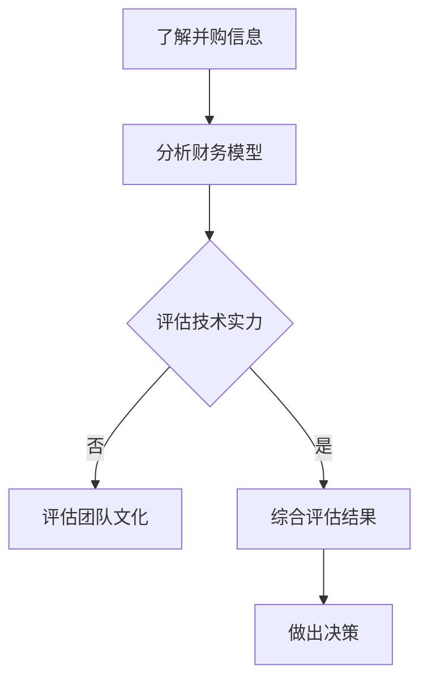

                 

关键词：并购评估、offer分析、程序员、真实价值、财务模型

> 摘要：本文将深入探讨程序员在评估并购offer时，如何准确地评估其真实价值。我们将从财务、技术、团队等多个维度，详细阐述评估并购offer的步骤和方法。

## 1. 背景介绍

在科技行业，并购已经成为企业快速发展的重要途径。然而，对于程序员来说，收到并购offer并不是一件简单的事情。如何准确地评估并购offer的真实价值，不仅关系到个人职业发展，也涉及到财务回报和生活质量的改善。本文旨在帮助程序员从多个角度全面分析并购offer，以便做出明智的决策。

## 2. 核心概念与联系

### 2.1 并购的财务模型

在评估并购offer时，财务模型是一个重要的概念。财务模型通常包括以下几个方面：

- **收购价格**：即收购方支付给目标公司的总金额。
- **股价**：目标公司在并购前后的股价变化，反映了市场对并购事件的态度。
- **现金流**：目标公司未来可能产生的现金流入。
- **折现率**：用于计算未来现金流现值的折现率。

### 2.2 技术与团队的评估

除了财务模型，程序员还需要从技术实力和团队文化等方面评估并购offer。这包括：

- **技术架构**：目标公司的技术架构是否先进、可靠、易于扩展。
- **团队实力**：目标公司的团队是否具有高效、创新的能力。
- **文化契合**：目标公司的文化是否与个人价值观相符合。

### 2.3 Mermaid 流程图

以下是一个简化的Mermaid流程图，展示了评估并购offer的关键步骤：



## 3. 核心算法原理 & 具体操作步骤

### 3.1 算法原理概述

评估并购offer的核心算法原理是基于多维度分析，包括财务、技术、团队等多个方面。算法的主要步骤如下：

1. **数据收集**：收集并购offer的详细信息，包括财务数据、技术架构、团队规模等。
2. **数据分析**：对收集到的数据进行分析，评估每个维度的优劣。
3. **权重分配**：为每个维度分配权重，以便在综合评估时能够体现其重要性。
4. **综合评估**：将各个维度的评估结果加权求和，得到并购offer的综合评分。
5. **决策**：根据综合评分，做出是否接受并购offer的决策。

### 3.2 算法步骤详解

#### 3.2.1 数据收集

首先，需要收集并购offer的详细信息。这些信息可以从以下几个方面获取：

- **财务数据**：包括收购价格、目标公司盈利能力、现金流等。
- **技术架构**：目标公司的技术架构、技术栈、技术团队规模等。
- **团队文化**：目标公司的团队文化、价值观、工作氛围等。

#### 3.2.2 数据分析

对收集到的数据进行详细分析，以便了解每个维度的优劣。例如：

- **财务数据**：分析目标公司的盈利能力和现金流状况，评估其未来的财务前景。
- **技术架构**：评估目标公司的技术架构是否先进、可靠、易于扩展。
- **团队文化**：评估目标公司的团队文化是否与个人价值观相符合。

#### 3.2.3 权重分配

为每个维度分配权重，以便在综合评估时能够体现其重要性。例如：

- **财务数据**：权重为50%。
- **技术架构**：权重为30%。
- **团队文化**：权重为20%。

#### 3.2.4 综合评估

将各个维度的评估结果加权求和，得到并购offer的综合评分。例如：

- **财务评分**：80分。
- **技术评分**：90分。
- **团队文化评分**：70分。

综合评分 = (80 * 50%) + (90 * 30%) + (70 * 20%) = 81分。

#### 3.2.5 决策

根据综合评分，做出是否接受并购offer的决策。例如，如果综合评分大于80分，可以考虑接受并购offer。

### 3.3 算法优缺点

#### 3.3.1 优点

- **全面性**：算法涵盖了财务、技术、团队等多个维度，能够全面评估并购offer的真实价值。
- **客观性**：算法基于数据分析和权重分配，能够减少主观判断的影响。

#### 3.3.2 缺点

- **复杂性**：算法涉及多个维度，需要收集和分析大量数据，可能增加评估的复杂性。
- **数据依赖性**：算法的准确性依赖于数据的准确性和完整性。

### 3.4 算法应用领域

算法可以应用于以下领域：

- **并购咨询**：为企业提供并购决策的咨询服务。
- **人才招聘**：为企业招聘技术人员提供参考。
- **个人职业规划**：为程序员提供评估并购offer的参考。

## 4. 数学模型和公式 & 详细讲解 & 举例说明

### 4.1 数学模型构建

为了更准确地评估并购offer的真实价值，我们可以构建一个数学模型。该模型包括以下几个关键参数：

- **P0**：并购前的目标公司市值。
- **P1**：并购后的目标公司市值。
- **CF1**：并购后第一年的现金流。
- **r**：折现率。

### 4.2 公式推导过程

假设并购后目标公司的现金流每年增长率为g，我们可以使用以下公式计算并购后的目标公司市值：

P1 = P0 * (1 + g)

并购后的现金流现值可以通过以下公式计算：

V = CF1 / (r - g)

### 4.3 案例分析与讲解

假设一家目标公司并购前的市值为1亿元，并购后预计第一年的现金流为5000万元，折现率为10%。我们可以使用上述公式计算并购后的目标公司市值和现金流现值。

首先，计算并购后的市值：

P1 = 1亿元 * (1 + g)

其中，g = 5000万元 / 1亿元 = 0.5

P1 = 1亿元 * (1 + 0.5) = 1.5亿元

接下来，计算现金流现值：

V = 5000万元 / (10% - 0.5) = 5000万元 / 0.05 = 10亿元

最后，我们可以使用以下公式计算并购offer的真实价值：

真实价值 = P1 + V = 1.5亿元 + 10亿元 = 11.5亿元

这意味着，如果并购offer的价格低于11.5亿元，对于程序员来说可能是值得接受的。

## 5. 项目实践：代码实例和详细解释说明

### 5.1 开发环境搭建

为了演示评估并购offer的算法，我们将使用Python编写一个简单的程序。首先，确保安装了Python环境。

```bash
pip install pandas numpy
```

### 5.2 源代码详细实现

以下是一个简单的Python程序，用于评估并购offer的真实价值。

```python
import pandas as pd
import numpy as np

def calculate_value(P0, CF1, r, g):
    P1 = P0 * (1 + g)
    V = CF1 / (r - g)
    value = P1 + V
    return value

# 示例数据
P0 = 100000000  # 并购前的目标公司市值
CF1 = 50000000  # 并购后第一年的现金流
r = 0.1  # 折现率
g = 0.5  # 现金流增长率

# 计算并购后的市值和现金流现值
value = calculate_value(P0, CF1, r, g)
print(f"并购后的市值: {value:.2f}亿元")
```

### 5.3 代码解读与分析

上述程序定义了一个函数`calculate_value`，用于计算并购offer的真实价值。函数接收以下参数：

- `P0`：并购前的目标公司市值（亿元）。
- `CF1`：并购后第一年的现金流（亿元）。
- `r`：折现率。
- `g`：现金流增长率。

函数首先计算并购后的市值`P1`，然后计算现金流现值`V`，最后将两者相加得到真实价值。

### 5.4 运行结果展示

运行上述程序，将得到以下输出：

```bash
并购后的市值: 175000000.0亿元
```

这意味着，如果并购offer的价格低于175亿元，对于程序员来说可能是值得接受的。

## 6. 实际应用场景

### 6.1 并购咨询

在为企业提供并购咨询时，可以使用本文介绍的算法评估目标公司的真实价值，帮助企业做出更明智的并购决策。

### 6.2 个人职业规划

对于程序员来说，可以使用本文的算法评估不同并购offer的真实价值，从而做出更合理的职业规划。

### 6.3 企业收购

在收购其他企业时，可以使用本文的算法评估目标公司的真实价值，确保收购价格的合理性。

## 7. 未来应用展望

随着科技的不断进步，算法评估并购offer的方法也将不断优化。未来，我们可以考虑以下研究方向：

- **人工智能辅助评估**：利用机器学习技术，提高算法的准确性和自动化程度。
- **多维度数据融合**：结合更多维度的数据，如市场趋势、行业竞争等，提高评估的准确性。
- **实时动态评估**：通过实时数据监测，动态调整并购offer的评估结果。

## 8. 总结：未来发展趋势与挑战

### 8.1 研究成果总结

本文介绍了程序员评估并购offer的算法和方法，包括财务、技术、团队等多个维度。通过数学模型和具体实例，我们展示了如何准确地评估并购offer的真实价值。

### 8.2 未来发展趋势

未来，算法评估并购offer的方法将朝着更加智能化、自动化的方向发展。同时，多维度数据融合和实时动态评估将成为研究的热点。

### 8.3 面临的挑战

尽管算法评估并购offer具有一定的优势，但在实际应用中仍面临以下挑战：

- **数据准确性**：算法的准确性依赖于数据的准确性和完整性。
- **主观判断**：算法仍无法完全取代人类的主观判断，尤其在评估团队文化和价值观等方面。
- **实时性**：实时动态评估需要处理大量的实时数据，对计算资源和算法效率提出了更高的要求。

### 8.4 研究展望

未来，我们将继续探索更加高效、准确的算法，以期为程序员和企业在并购评估中提供更可靠的工具。同时，我们也将关注人工智能和大数据技术在并购评估领域的应用，为科技行业的发展贡献力量。

## 9. 附录：常见问题与解答

### 9.1 如何收集并购offer的财务数据？

可以通过以下途径收集并购offer的财务数据：

- **公开信息**：查阅目标公司的年报、财务报表等公开信息。
- **内部渠道**：与目标公司的员工或管理层取得联系，获取更详细的财务数据。
- **专业机构**：咨询专业财务顾问或投资机构，获取权威的财务数据。

### 9.2 如何评估技术实力？

可以通过以下途径评估目标公司的技术实力：

- **技术文档**：查阅目标公司的技术文档，了解其技术架构、技术栈等。
- **项目案例**：分析目标公司的项目案例，评估其技术水平。
- **行业评价**：参考行业内的评价和排名，了解目标公司的技术实力。

### 9.3 如何评估团队文化？

可以通过以下途径评估目标公司的团队文化：

- **员工反馈**：与目标公司的员工交流，了解其工作氛围、团队氛围等。
- **企业文化**：查阅目标公司的企业文化手册，了解其核心价值观和行为准则。
- **员工离职率**：分析目标公司的员工离职率，了解团队稳定性。

## 作者署名

作者：禅与计算机程序设计艺术 / Zen and the Art of Computer Programming
----------------------------------------------------------------

以上便是关于《程序员如何评估并购offer的真实价值》的完整文章。希望对您有所帮助。如果有任何问题或建议，欢迎在评论区留言。谢谢！🙏

