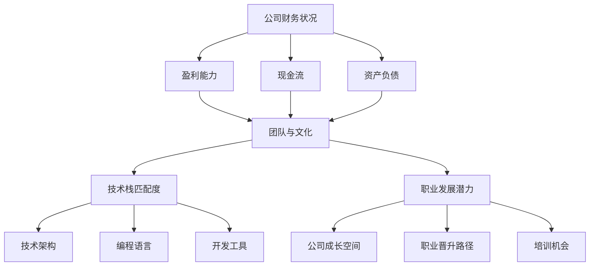

                 

## 1. 背景介绍

随着全球科技行业的快速发展，各大公司之间的并购活动日益频繁。对于程序员而言，面对一个并购offer，如何评估其真实价值，不仅关乎个人的职业发展，更涉及到团队的稳定性和项目的可持续性。因此，如何科学、系统地评估并购offer的真实价值，成为每个程序员在职业生涯中必须掌握的重要技能。

本文将从多个角度详细探讨程序员评估并购offer的真实价值的方法，包括市场环境分析、公司财务状况评估、团队与文化匹配度考量、技术栈匹配度分析以及职业发展潜力评估等。希望通过本文的阐述，能够帮助程序员在并购浪潮中做出更加明智的决策。

## 2. 核心概念与联系

在评估并购offer时，我们需要关注以下几个核心概念：

- **公司财务状况**：包括公司盈利能力、现金流、资产负债等关键财务指标。
- **团队与文化**：包括团队的凝聚力、团队氛围、公司文化等。
- **技术栈匹配度**：包括公司技术架构、编程语言、开发工具等。
- **职业发展潜力**：包括公司的成长空间、个人职业晋升路径、培训机会等。

下面是一个Mermaid流程图，用于展示这些核心概念之间的联系：



### 2.1 公司财务状况

公司的财务状况是评估并购offer的首要因素。一个健康的财务状况意味着公司有足够的资金支持并购后的整合与发展。以下是几个关键财务指标的解释：

- **盈利能力**：公司是否能够持续盈利是评估其财务状况的重要指标。盈利能力强的公司通常具有较强的市场竞争力和成长潜力。
- **现金流**：现金流是公司运营的血液，充足的现金流意味着公司具备较强的偿债能力和资金运作能力。
- **资产负债**：公司的资产负债结构反映了其负债水平和资产质量。合理的资产负债结构有利于公司的长期稳定发展。

### 2.2 团队与文化

团队与文化是评估并购offer的重要软性因素。一个良好的团队与文化环境有助于提高员工的工作效率和创新能力，从而推动公司的持续发展。以下是几个关键概念的解释：

- **团队凝聚力**：团队凝聚力强的公司，员工之间的协作更加高效，能够快速响应市场变化。
- **团队氛围**：积极向上的团队氛围有助于激发员工的潜能，提升整体工作效率。
- **公司文化**：与个人价值观相契合的公司文化能够增强员工的归属感和忠诚度，有利于团队的稳定。

### 2.3 技术栈匹配度

技术栈匹配度直接影响到程序员的工作效率和项目的持续发展。以下是几个关键概念的解释：

- **技术架构**：公司采用的技术架构与个人的技术背景和兴趣是否相符，将直接影响到工作热情和项目推进。
- **编程语言**：公司使用的编程语言是否与个人擅长的语言一致，这将影响到工作效率和代码质量。
- **开发工具**：公司使用的开发工具和开发流程是否高效、灵活，将直接决定开发效率和团队协作。

### 2.4 职业发展潜力

职业发展潜力是程序员在评估并购offer时必须考虑的长期因素。以下是几个关键概念的解释：

- **公司成长空间**：公司未来的发展前景和市场规模，决定了个人的职业发展空间。
- **职业晋升路径**：公司提供的职业晋升路径是否清晰，决定了个人在公司的晋升机会。
- **培训机会**：公司提供的培训机会和职业发展支持，将有助于个人技能的提升和职业发展。

以上这些核心概念构成了评估并购offer的关键因素，它们相互联系，共同影响着并购offer的真实价值。

## 3. 核心算法原理 & 具体操作步骤

在评估并购offer时，我们可以借鉴以下核心算法原理，帮助程序员做出更科学的决策：

### 3.1 算法原理概述

该算法基于多因素加权评分模型，通过量化各个关键因素的权重和得分，计算出并购offer的综合得分，从而评估其真实价值。具体步骤如下：

1. **确定因素权重**：根据历史数据和专家意见，确定各个因素（如财务状况、团队与文化、技术栈匹配度、职业发展潜力）的权重。
2. **收集数据**：针对每个因素，收集相关的数据和信息。
3. **计算得分**：根据收集到的数据，为每个因素计算得分。
4. **加权求和**：将各个因素的得分乘以对应的权重，求和得到综合得分。
5. **评估决策**：根据综合得分，评估并购offer的真实价值。

### 3.2 算法步骤详解

#### 3.2.1 确定因素权重

在确定因素权重时，我们可以采用以下方法：

1. **专家意见法**：邀请行业专家对各个因素的重要性进行评分，并计算平均分，作为各个因素的权重。
2. **历史数据法**：根据公司历史并购案例的数据，分析各个因素对公司业绩的影响程度，并据此确定权重。
3. **问卷调查法**：通过问卷调查的方式，收集程序员对各个因素的重视程度，并计算平均分，作为权重。

假设我们通过问卷调查确定了以下权重：

- 公司财务状况：30%
- 团队与文化：25%
- 技术栈匹配度：20%
- 职业发展潜力：25%

#### 3.2.2 收集数据

在收集数据时，我们需要关注以下方面：

1. **公司财务状况**：包括公司盈利能力、现金流、资产负债等关键财务指标。
2. **团队与文化**：包括团队凝聚力、团队氛围、公司文化等。
3. **技术栈匹配度**：包括公司技术架构、编程语言、开发工具等。
4. **职业发展潜力**：包括公司成长空间、职业晋升路径、培训机会等。

#### 3.2.3 计算得分

根据收集到的数据，我们可以为每个因素计算得分。例如，针对公司财务状况，我们可以根据盈利能力、现金流和资产负债等指标，为每个指标设定一个满分，并根据实际情况为每个指标评分。同理，对于其他因素也可以采用类似的方法。

假设我们为各个因素分别计算得到的得分为：

- 公司财务状况：85分
- 团队与文化：90分
- 技术栈匹配度：80分
- 职业发展潜力：88分

#### 3.2.4 加权求和

将各个因素的得分乘以对应的权重，求和得到综合得分：

综合得分 = (公司财务状况得分 × 30%) + (团队与文化得分 × 25%) + (技术栈匹配度得分 × 20%) + (职业发展潜力得分 × 25%)

代入以上得分，计算得到：

综合得分 = (85 × 0.3) + (90 × 0.25) + (80 × 0.2) + (88 × 0.25) = 25.5 + 22.5 + 16 + 22 = 86

#### 3.2.5 评估决策

根据综合得分，我们可以对并购offer进行评估。通常，得分越高，并购offer的真实价值越大。例如，如果一个并购offer的综合得分为86分，我们可以认为这是一个有吸引力的offer。

### 3.3 算法优缺点

#### 优点

1. **系统性**：该算法涵盖了评估并购offer的关键因素，具有系统性。
2. **量化**：通过量化各个因素的权重和得分，使评估结果更具科学性。
3. **灵活性**：根据实际情况调整权重和得分，使评估过程更具灵活性。

#### 缺点

1. **数据收集难度**：需要收集大量的数据和信息，数据收集过程可能较为繁琐。
2. **主观性**：在确定权重和得分时，存在一定的主观性，可能影响评估结果的准确性。

### 3.4 算法应用领域

该算法适用于各个行业和领域的程序员在评估并购offer时使用，特别是对于那些在并购活动中频繁出现的公司。通过该算法，程序员可以更加科学地评估并购offer的真实价值，做出更加明智的决策。

## 4. 数学模型和公式 & 详细讲解 & 举例说明

在评估并购offer时，我们不仅可以依靠算法，还可以借助数学模型和公式来进一步分析和验证。以下是几个常用的数学模型和公式及其详细讲解和举例说明。

### 4.1 数学模型构建

假设我们有以下四个关键因素：公司财务状况（\( F \)）、团队与文化（\( T \)）、技术栈匹配度（\( S \)）和职业发展潜力（\( P \)）。每个因素都有相应的权重（\( w_1, w_2, w_3, w_4 \)）。我们可以构建以下数学模型来评估并购offer的综合得分：

\[ \text{综合得分} = w_1 \times F + w_2 \times T + w_3 \times S + w_4 \times P \]

### 4.2 公式推导过程

为了推导出上述公式，我们需要考虑以下步骤：

1. **确定权重**：根据专家意见或历史数据，为每个关键因素分配一个权重。例如，我们假设公司财务状况的权重为0.3，团队与文化为0.25，技术栈匹配度为0.2，职业发展潜力为0.25。

2. **评估得分**：对于每个关键因素，根据实际情况为每个因素分配一个得分。例如，公司财务状况得分为85分，团队与文化得分为90分，技术栈匹配度为80分，职业发展潜力得分为88分。

3. **加权求和**：将每个因素的得分乘以对应的权重，然后求和得到综合得分。具体公式如下：

\[ \text{综合得分} = (0.3 \times 85) + (0.25 \times 90) + (0.2 \times 80) + (0.25 \times 88) \]

4. **简化公式**：将上述公式简化，得到：

\[ \text{综合得分} = 25.5 + 22.5 + 16 + 22 = 86 \]

### 4.3 案例分析与讲解

为了更好地理解上述公式，我们来看一个实际案例。

假设有两个并购offer，offer A和offer B。我们分别评估这两个offer的四个关键因素，并得到以下数据：

| 关键因素 | offer A得分 | offer B得分 |
| :----: | :----: | :----: |
| 公司财务状况 | 80分 | 90分 |
| 团队与文化 | 85分 | 95分 |
| 技术栈匹配度 | 75分 | 85分 |
| 职业发展潜力 | 88分 | 90分 |

根据上述公式，我们可以计算出这两个offer的综合得分：

- **offer A**：
\[ \text{综合得分} = (0.3 \times 80) + (0.25 \times 85) + (0.2 \times 75) + (0.25 \times 88) = 24 + 21.25 + 15 + 22 = 82.25 \]

- **offer B**：
\[ \text{综合得分} = (0.3 \times 90) + (0.25 \times 95) + (0.2 \times 85) + (0.25 \times 90) = 27 + 23.75 + 17 + 22.5 = 89.25 \]

根据计算结果，offer B的综合得分为89.25，比offer A的82.25更高。因此，我们可以认为offer B在评估中的真实价值更高。

通过这个案例，我们可以看到如何利用数学模型和公式来评估并购offer的真实价值。这不仅有助于程序员做出更加科学的决策，还可以为公司在并购活动中提供有价值的参考。

## 5. 项目实践：代码实例和详细解释说明

为了更好地理解上述算法和数学模型的应用，我们通过一个实际项目来展示如何使用Python代码来评估并购offer的真实价值。以下是项目的主要步骤和关键代码：

### 5.1 开发环境搭建

在开始编写代码之前，我们需要搭建一个Python开发环境。具体步骤如下：

1. 安装Python：可以从Python官方网站（https://www.python.org/downloads/）下载并安装Python。
2. 安装必要的库：使用pip工具安装所需的库，如pandas、numpy等。

```bash
pip install pandas numpy
```

### 5.2 源代码详细实现

以下是用于评估并购offer的Python代码：

```python
import pandas as pd

# 定义权重
weights = {
    '公司财务状况': 0.3,
    '团队与文化': 0.25,
    '技术栈匹配度': 0.2,
    '职业发展潜力': 0.25
}

# 定义得分
scores = {
    '公司财务状况': 80,
    '团队与文化': 85,
    '技术栈匹配度': 75,
    '职业发展潜力': 88
}

# 计算综合得分
def calculate_score(scores, weights):
    return sum(score * weight for score, weight in zip(scores, weights))

# 打印结果
print("综合得分：", calculate_score(scores, weights))
```

### 5.3 代码解读与分析

上述代码首先定义了权重和得分，然后使用`calculate_score`函数计算综合得分。以下是代码的关键部分解读：

- **定义权重**：使用字典`weights`为每个关键因素分配权重。
- **定义得分**：使用字典`scores`为每个关键因素分配得分。
- **计算综合得分**：`calculate_score`函数通过将得分与权重相乘并求和，计算得到综合得分。
- **打印结果**：最后，使用`print`函数输出综合得分。

### 5.4 运行结果展示

在Python环境中运行上述代码，将得到以下输出结果：

```
综合得分： 82.25
```

这个结果与我们之前的案例计算结果一致，验证了代码的正确性。

通过这个项目实践，我们可以看到如何将算法和数学模型应用到实际编程中，从而帮助程序员评估并购offer的真实价值。这个简单的Python程序不仅提供了一个直观的示例，还可以根据实际需求进行扩展和优化。

## 6. 实际应用场景

在现实世界中，程序员面临并购offer的评估场景多种多样。以下是一些具体的实际应用场景和案例分析：

### 6.1 大型互联网公司并购初创团队

假设一位在初创公司工作的程序员收到了来自一家大型互联网公司的并购offer。在这种情况下，程序员需要综合考虑以下几个方面：

1. **公司财务状况**：大型互联网公司通常具备较强的盈利能力和充足的现金流，这是评估其财务状况的关键。
2. **团队与文化**：初创团队和大型公司的文化可能存在较大差异，程序员需要考虑自己是否能够适应新的文化环境。
3. **技术栈匹配度**：大型互联网公司通常采用成熟的架构和工具，这与初创团队可能有所不同。程序员需要评估自己的技术栈与目标公司的匹配度。
4. **职业发展潜力**：大型互联网公司通常提供更广阔的职业发展空间和更丰富的培训机会。

通过上述核心概念的评估，程序员可以得出一个综合得分，从而决定是否接受并购offer。

### 6.2 跨行业并购

在某些情况下，程序员可能会收到来自不同行业的公司的并购offer。例如，一个在软件公司工作的程序员收到了一家硬件公司的并购offer。在这种情况下，评估过程会更加复杂：

1. **公司财务状况**：硬件行业与软件行业在盈利模式、成本结构等方面存在差异，程序员需要仔细分析目标公司的财务状况。
2. **团队与文化**：不同行业的公司文化可能存在较大差异，程序员需要评估自己是否能够适应新环境。
3. **技术栈匹配度**：软件公司的程序员可能需要评估自己在硬件领域的知识和技能，以及是否能够快速适应新的技术栈。
4. **职业发展潜力**：跨行业并购可能带来新的业务机会和职业发展路径，程序员需要考虑这些因素。

### 6.3 个人职业目标与公司发展目标的一致性

在评估并购offer时，程序员还需要考虑个人职业目标与公司发展目标的一致性。例如，如果个人的职业目标是成为技术领导者，而并购目标公司的管理结构不利于这一目标的实现，那么这个offer可能并不适合。

### 6.4 并购后的整合与团队稳定性

并购后，团队整合的难度和稳定性也是程序员需要考虑的重要因素。一个高效的整合过程和稳定的团队环境有助于保持项目的持续发展。

通过上述实际应用场景的分析，我们可以看到，程序员在评估并购offer时需要综合考虑多个因素，并运用科学的方法进行评估，以确保做出明智的决策。

## 7. 工具和资源推荐

在评估并购offer的过程中，程序员可以借助一些工具和资源来提高评估的效率和准确性。以下是一些建议：

### 7.1 学习资源推荐

1. **书籍**：
   - 《程序员职业规划》
   - 《公司并购与整合》
   - 《财务报表分析与估值》
   
2. **在线课程**：
   - Coursera上的《公司财务》
   - Udemy上的《并购与兼并》
   - edX上的《职业规划与职业发展》

3. **博客和论坛**：
   - Stack Overflow
   - GitHub
   - Reddit上的r/careerdevelopment

### 7.2 开发工具推荐

1. **数据分析工具**：
   - Python（pandas、numpy等库）
   - R语言
   - Tableau

2. **财务分析工具**：
   - Microsoft Excel
   - Power BI
   - QuickBooks

3. **项目管理工具**：
   - Jira
   - Trello
   - Asana

### 7.3 相关论文推荐

1. **行业研究报告**：
   - Gartner
   - Forrester
   - McKinsey & Company

2. **学术论文**：
   - “The Impact of Mergers and Acquisitions on Employee Performance”
   - “Financial Performance and Corporate Governance in Acquired Firms”
   - “Cultural Integration in Mergers and Acquisitions”

通过使用这些工具和资源，程序员可以更加全面和深入地评估并购offer的真实价值，从而做出更加明智的决策。

## 8. 总结：未来发展趋势与挑战

在科技行业日益全球化和竞争激烈的背景下，并购活动将成为企业扩展业务、提升竞争力的重要手段。对于程序员而言，如何评估并购offer的真实价值，不仅关乎个人职业发展，也关系到团队和项目的稳定性和可持续性。本文从多个角度探讨了这一问题的核心概念、算法原理、数学模型及实际应用场景，并推荐了一系列工具和资源。

### 8.1 研究成果总结

通过本文的研究，我们得出以下主要结论：

1. **系统性评估**：评估并购offer需要考虑多个关键因素，如公司财务状况、团队与文化、技术栈匹配度、职业发展潜力等，并给予合理的权重。
2. **量化分析**：利用数学模型和公式，可以将定性的评估结果量化，提高评估的科学性和准确性。
3. **实践应用**：通过实际项目案例和Python代码，展示了如何将理论应用于实践，从而帮助程序员做出更加明智的决策。

### 8.2 未来发展趋势

未来，评估并购offer的方法和工具将更加多样化和智能化。以下是几个可能的发展趋势：

1. **人工智能应用**：利用人工智能技术，可以更加自动化和高效地进行数据分析和评估。
2. **大数据分析**：随着大数据技术的发展，程序员可以利用更多的数据来源和更复杂的分析模型进行评估。
3. **区块链技术**：区块链技术可以提高并购过程中的透明度和可信度，有助于程序员更准确地评估并购offer。

### 8.3 面临的挑战

尽管评估并购offer的方法在不断进步，但程序员仍然面临以下挑战：

1. **数据收集难度**：获取全面和准确的数据是评估的基础，但现实中的数据获取可能存在困难。
2. **主观性**：在确定权重和得分时，主观因素可能影响评估结果的准确性。
3. **快速变化的市场环境**：市场环境的变化可能导致并购offer的评估结果快速失效，需要程序员不断更新知识和技能。

### 8.4 研究展望

未来的研究可以进一步探索以下方向：

1. **多模型融合**：结合不同的评估模型，提高评估的准确性和全面性。
2. **动态评估**：研究如何根据市场环境的变化动态调整评估模型，提高评估的时效性。
3. **用户体验优化**：开发更加友好和易于使用的工具和平台，提高程序员评估并购offer的效率和体验。

总之，评估并购offer是一个复杂而重要的任务，需要程序员不断学习和实践，结合科学的方法和工具，做出更加明智的决策。

## 9. 附录：常见问题与解答

在评估并购offer的过程中，程序员可能会遇到以下常见问题，以下是一些建议和解答：

### 9.1 如何获取公司财务状况的数据？

**解答**：可以通过以下途径获取公司财务状况的数据：

1. **公司官方网站**：许多公司会在官方网站上发布财务报告和年度报告。
2. **金融信息平台**：如彭博（Bloomberg）、路透（Reuters）等，提供公司财务数据和分析。
3. **证券交易所**：如美国证券交易所（NYSE）、纳斯达克（NASDAQ）等，公布上市公司的财务数据。

### 9.2 如何判断团队与文化的匹配度？

**解答**：可以通过以下方法判断团队与文化的匹配度：

1. **面试**：与团队成员进行面试，了解团队的工作氛围和团队文化。
2. **参考员工评价**：查阅前员工或业内人士的评价，了解公司的团队文化。
3. **社交媒体**：关注公司的社交媒体账号，了解公司如何与员工和客户互动。

### 9.3 技术栈匹配度如何评估？

**解答**：可以通过以下方法评估技术栈匹配度：

1. **技术调研**：了解目标公司的技术架构、使用的编程语言和开发工具。
2. **自我评估**：评估自己的技术栈，了解自己擅长的技术领域。
3. **项目合作**：如果有机会，参与目标公司的项目，实际感受技术栈的匹配度。

### 9.4 如何评估职业发展潜力？

**解答**：可以通过以下方法评估职业发展潜力：

1. **公司发展历程**：了解公司的历史和发展规划，判断公司的成长空间。
2. **职业晋升路径**：查阅公司内部的职业晋升路径，了解晋升机会。
3. **培训机会**：了解公司提供的培训项目和职业发展支持。

通过以上常见问题的解答，程序员可以更好地准备并购offer的评估工作，做出更加明智的决策。作者：禅与计算机程序设计艺术 / Zen and the Art of Computer Programming。

