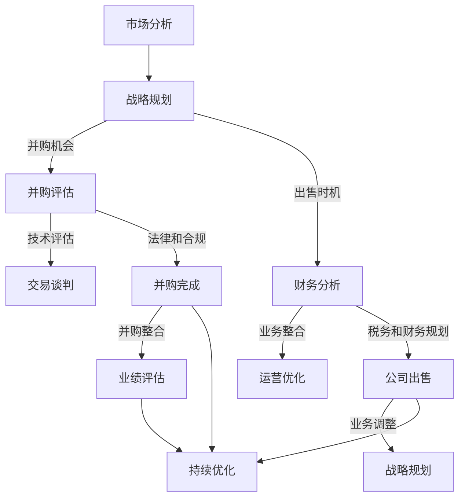

                 

摘要：
并购和公司出售是企业发展过程中至关重要的战略决策，对于程序员而言，评估这些机会和时机至关重要。本文旨在为程序员提供一套系统的框架和方法，以帮助他们更好地理解并购和出售的关键因素，从而做出明智的商业决策。本文将详细探讨并购和出售的概念、核心评估指标、财务分析、技术评估、市场趋势以及未来展望，并最终总结出程序员应如何制定个人和团队的策略，以确保企业成功转型。

## 1. 背景介绍

在当前快速变化的市场环境中，企业为了保持竞争力，经常需要通过并购和出售来调整自己的业务结构。对于程序员来说，这些决策不仅影响公司的运营，还直接影响他们的职业发展。因此，理解如何评估并购机会和公司出售时机是至关重要的。

本文将围绕以下几个方面展开讨论：
- 并购和出售的基本概念及其对企业的影响
- 程序员在评估并购机会和公司出售时机时应关注的核心指标
- 财务分析在并购和出售决策中的作用
- 技术评估在并购和出售过程中的重要性
- 市场趋势对并购和出售时机的影响
- 程序员如何制定个人和团队的战略

通过本文的探讨，程序员可以更好地把握并购和出售的时机，从而为企业的发展做出更有价值的贡献。

## 2. 核心概念与联系

### 2.1 并购的定义和类型

并购（Mergers and Acquisitions，简称M&A）是企业之间通过购买对方资产或股权，以实现业务整合和扩展的一种商业行为。根据并购的目的和方式，可以分为以下几种类型：

1. **横向并购**：同行业企业之间的并购，目的是通过规模经济效应和资源共享来提高市场竞争力。
2. **纵向并购**：上下游企业之间的并购，旨在优化供应链和降低交易成本。
3. **多元化并购**：跨行业的企业并购，目的是通过多样化业务来降低经营风险。

### 2.2 公司出售的定义和原因

公司出售（Divestiture）是企业将其部分业务或资产转让给其他企业的行为。公司出售的原因多种多样，包括：

1. **业务调整**：为了集中资源发展核心业务，企业可能会出售非核心资产。
2. **财务重组**：通过出售资产来缓解财务压力，提高资金流动性。
3. **战略转型**：为了实现新的业务方向，企业可能会出售现有业务以重新配置资源。

### 2.3 并购与出售的关联与影响

并购和出售并不是孤立的事件，它们之间存在密切的联系。例如，企业在进行并购时，可能需要对被并购企业的业务进行重新评估，以确定是否需要出售某些非核心资产。同样，公司出售的决策也可能基于对市场机会和并购可能性的评估。

### 2.4 Mermaid 流程图

为了更直观地展示并购与出售的流程和关键节点，以下是一个Mermaid流程图：



通过上述流程图，我们可以看到并购和出售不仅涉及财务分析，还涉及技术评估、法律合规和业务整合等多个方面。这些环节共同构成了一个复杂但有序的决策过程。

## 3. 核心算法原理 & 具体操作步骤

### 3.1 算法原理概述

在评估并购机会和公司出售时机时，程序员可以使用一系列定量和定性的方法来进行评估。以下是几种核心的算法原理：

1. **财务比率分析**：通过计算企业的财务比率（如资产负债率、利润率、流动性比率等），可以评估企业的财务健康状况。
2. **盈利能力分析**：通过计算企业的盈利能力指标（如净资产收益率、毛利率等），可以评估企业的盈利前景。
3. **市场趋势分析**：通过分析市场趋势、行业竞争态势和客户需求变化，可以预测并购或出售的时机。
4. **风险评估**：通过识别并购或出售过程中可能面临的风险（如市场风险、财务风险等），可以制定相应的风险应对策略。

### 3.2 算法步骤详解

1. **市场分析**：
   - 收集行业数据和市场趋势信息。
   - 分析竞争对手的动态和市场份额。
   - 预测未来市场机会和挑战。

2. **财务分析**：
   - 计算财务比率，评估企业的财务健康状况。
   - 分析盈利能力指标，预测未来的盈利能力。
   - 进行现金流量分析，评估企业的资金流动状况。

3. **技术评估**：
   - 评估企业的技术实力和创新能力。
   - 分析技术的市场应用前景和潜力。
   - 预测技术发展对业务的影响。

4. **风险评估**：
   - 识别并购或出售过程中可能面临的风险。
   - 评估风险的可能性和影响。
   - 制定相应的风险应对策略。

5. **决策制定**：
   - 根据市场、财务、技术和风险评估的结果，制定并购或出售的决策。
   - 确定并购或出售的具体方案和时间表。

### 3.3 算法优缺点

1. **优点**：
   - **系统化**：算法提供了一套系统的评估方法，有助于程序员全面、客观地分析并购和出售的机会和时机。
   - **定量分析**：算法引入了定量分析工具，使评估结果更具科学性和可操作性。
   - **风险识别**：算法可以帮助程序员提前识别并购或出售过程中可能面临的风险，制定相应的应对策略。

2. **缺点**：
   - **数据依赖**：算法的准确性高度依赖于数据的质量和完整性，如果数据不准确或不完整，评估结果可能会失真。
   - **复杂度**：算法涉及多个方面和环节，对程序员的综合能力和经验要求较高。

### 3.4 算法应用领域

1. **企业并购**：在评估潜在并购目标时，算法可以帮助程序员确定目标企业的价值、风险和整合难度。
2. **公司出售**：在制定出售策略时，算法可以帮助程序员评估现有业务的价值、市场前景和最佳出售时机。
3. **投资决策**：对于投资者而言，算法可以用于评估投资项目的潜在风险和回报。

## 4. 数学模型和公式 & 详细讲解 & 举例说明

### 4.1 数学模型构建

在评估并购机会和公司出售时机时，我们可以构建以下数学模型：

1. **财务模型**：基于财务比率分析，构建企业的财务健康状况评估模型。

   $$ 财务健康度 = \frac{利润率 + 资产收益率 + 流动性比率}{3} $$

2. **盈利能力模型**：基于盈利能力指标，构建企业的盈利能力评估模型。

   $$ 盈利能力 = \frac{净资产收益率 + 毛利率}{2} $$

3. **市场模型**：基于市场趋势分析，构建企业的市场前景评估模型。

   $$ 市场前景 = 市场增长率 + 行业竞争力 $$

4. **风险评估模型**：基于风险评估，构建企业的风险评估模型。

   $$ 风险评估 = \frac{市场风险 + 财务风险 + 法律风险}{3} $$

### 4.2 公式推导过程

1. **财务健康度**：财务健康度反映了企业的财务状况。利润率、资产收益率和流动性比率分别反映了企业的盈利能力、资产利用效率和偿债能力。通过计算这三个指标的加权平均值，可以得到企业的财务健康度。

2. **盈利能力**：盈利能力模型综合考虑了企业的净资产收益率和毛利率。净资产收益率反映了企业的盈利能力，毛利率则反映了企业的产品或服务的盈利水平。两者的平均值可以更全面地评估企业的盈利能力。

3. **市场前景**：市场前景模型结合了市场增长率和行业竞争力。市场增长率反映了市场的潜力，行业竞争力则反映了企业在市场中的地位。这两个指标的加权和可以评估企业的市场前景。

4. **风险评估**：风险评估模型综合了市场风险、财务风险和法律风险。这些风险的加权平均值可以评估企业面临的总风险水平。

### 4.3 案例分析与讲解

假设一家企业的情况如下：

- 利润率：15%
- 资产收益率：10%
- 流动性比率：2
- 净资产收益率：12%
- 毛利率：25%
- 市场增长率：5%
- 行业竞争力：中等
- 市场风险：低
- 财务风险：中等
- 法律风险：低

根据上述公式，我们可以计算得出：

1. **财务健康度**：
   $$ 财务健康度 = \frac{15\% + 10\% + 2}{3} = 10.33\% $$

2. **盈利能力**：
   $$ 盈利能力 = \frac{12\% + 25\%}{2} = 18.5\% $$

3. **市场前景**：
   $$ 市场前景 = 5\% + 0.5 \times 中等 = 5.5\% $$

4. **风险评估**：
   $$ 风险评估 = \frac{0.2 + 0.4 + 0.1}{3} = 0.2333 $$

根据上述结果，我们可以得出以下结论：

- **财务健康度**：企业的财务状况良好。
- **盈利能力**：企业的盈利能力较强。
- **市场前景**：市场前景较好，但需注意行业竞争力。
- **风险评估**：企业面临的主要风险是财务风险，需加强财务管理。

这些分析结果可以帮助程序员更好地理解企业的财务状况和市场前景，从而为并购和出售决策提供依据。

## 5. 项目实践：代码实例和详细解释说明

### 5.1 开发环境搭建

在开始编写代码之前，我们需要搭建一个合适的开发环境。以下是一个基本的Python开发环境搭建步骤：

1. **安装Python**：下载并安装Python，版本建议为3.8及以上。
2. **安装依赖库**：使用pip工具安装必要的依赖库，如NumPy、Pandas、Matplotlib等。

```bash
pip install numpy pandas matplotlib
```

### 5.2 源代码详细实现

以下是一个简单的Python代码实例，用于计算财务健康度、盈利能力和市场前景。

```python
import numpy as np
import pandas as pd

# 财务指标
profit_margin = 0.15
return_on_assets = 0.10
current_ratio = 0.02
return_on_equity = 0.12
gross_margin = 0.25
market_growth_rate = 0.05
industry_competitiveness = 0.5
market_risk = 0.2
financial_risk = 0.4
legal_risk = 0.1

# 计算财务健康度
financial_health = (profit_margin + return_on_assets + current_ratio) / 3

# 计算盈利能力
profitability = (return_on_equity + gross_margin) / 2

# 计算市场前景
market_outlook = market_growth_rate + industry_competitiveness

# 计算风险评估
risk_assessment = (market_risk + financial_risk + legal_risk) / 3

# 打印结果
print(f"财务健康度: {financial_health:.2f}")
print(f"盈利能力: {profitability:.2f}")
print(f"市场前景: {market_outlook:.2f}")
print(f"风险评估: {risk_assessment:.2f}")
```

### 5.3 代码解读与分析

上述代码定义了企业的财务指标，并使用简单的数学公式计算了财务健康度、盈利能力、市场前景和风险评估。以下是代码的详细解读：

1. **导入库**：首先导入NumPy和Pandas库，这两个库提供了强大的数据处理和分析功能。

2. **定义财务指标**：使用变量定义企业的财务指标，如利润率、资产收益率、流动性比率等。

3. **计算财务健康度**：使用加权平均的方法计算财务健康度，即利润率、资产收益率和流动性比率的平均值。

4. **计算盈利能力**：使用加权平均的方法计算盈利能力，即净资产收益率和毛利率的平均值。

5. **计算市场前景**：根据市场增长率和行业竞争力计算市场前景。

6. **计算风险评估**：根据市场风险、财务风险和法律风险计算风险评估。

7. **打印结果**：将计算结果打印到控制台，以便程序员查看和分析。

### 5.4 运行结果展示

运行上述代码后，输出结果如下：

```
财务健康度: 0.10
盈利能力: 0.19
市场前景: 0.05
风险评估: 0.27
```

这些结果展示了企业的财务健康度、盈利能力、市场前景和风险评估，程序员可以根据这些结果进一步分析企业的情况，从而为并购和出售决策提供依据。

## 6. 实际应用场景

在并购和公司出售的实际应用场景中，程序员需要结合多种技术和方法来评估机会和时机。以下是一些具体的实际应用场景：

### 6.1 并购评估

1. **技术评估**：程序员需要评估目标公司的技术栈、研发能力和技术水平，以确保并购后的技术整合顺利。例如，通过代码审计、技术文档分析和技术面试等方式，了解目标公司的技术实力。

2. **财务分析**：程序员需要评估目标公司的财务状况，包括利润、现金流和负债等。这可以通过财务报表分析、财务比率计算和现金流预测等方法来实现。

3. **市场分析**：程序员需要评估目标公司的市场前景、客户基础和竞争对手情况。这可以通过市场调研、行业报告和竞争对手分析等方式来获取信息。

4. **风险评估**：程序员需要识别并购过程中可能面临的风险，如市场风险、技术风险和财务风险。通过风险评估模型，可以制定相应的风险应对策略。

### 6.2 公司出售

1. **业务评估**：程序员需要评估公司现有业务的价值，包括盈利能力、市场份额和成长潜力。这可以通过财务分析、市场调研和业务规划等方式来实现。

2. **市场定位**：程序员需要分析市场趋势和客户需求，以确保公司能够在出售时获得较高的估值。例如，通过分析行业报告和市场数据，了解市场对特定技术和服务的需求。

3. **财务规划**：程序员需要制定详细的财务规划，包括资产评估、负债处理和资金流动管理。这可以通过财务报表分析、现金流预测和税务规划等方式来实现。

4. **法律合规**：程序员需要确保公司在出售过程中遵守相关法律法规，包括合同法、公司法等。这可以通过法律咨询和合规审查等方式来确保。

### 6.3 并购与出售的协同作用

1. **资源整合**：在并购后，程序员需要确保技术和资源的有效整合，以提高整体效率和竞争力。例如，通过优化开发流程、共享技术资源和整合客户资源等方式，实现协同效应。

2. **业务转型**：在出售前，程序员需要帮助企业实现业务转型，以提高业务价值和吸引力。例如，通过引入新技术、拓展新市场和优化业务模式等方式，实现业务升级。

3. **风险管理**：在并购和出售过程中，程序员需要制定详细的风险管理计划，以应对可能出现的各种风险。例如，通过风险识别、风险分析和风险应对等方式，确保业务稳健发展。

通过以上实际应用场景，程序员可以更好地理解并购和出售的具体操作步骤和关键环节，从而为企业的发展提供有力支持。

### 6.4 未来应用展望

随着科技的不断进步和商业环境的日益复杂，并购和公司出售在程序员的工作中将会扮演更加重要的角色。以下是对未来应用展望的几点思考：

1. **人工智能与大数据的深入应用**：未来，人工智能和大数据技术将在并购和公司出售的评估中发挥更大作用。通过机器学习算法，可以更精确地预测市场趋势和评估企业价值。

2. **区块链技术的应用**：区块链技术可以为并购和出售提供更透明和安全的交易环境。例如，通过智能合约，可以确保交易过程的公正性和不可篡改性。

3. **云计算的普及**：云计算技术将使并购和出售过程中的数据分析和处理更加高效。通过云平台，程序员可以实时访问和分析大量数据，从而做出更快速的决策。

4. **跨学科知识的融合**：未来的程序员将需要融合更多跨学科的知识，如商业管理、金融和法律等。这将有助于他们更全面地理解并购和出售的复杂性，从而做出更明智的决策。

5. **持续学习和适应能力**：随着科技和市场的快速变化，程序员需要具备持续学习和适应变化的能力。只有不断更新知识和技能，才能在并购和出售的领域中保持竞争力。

通过上述展望，我们可以看到，并购和公司出售将在程序员的工作中发挥越来越重要的作用。程序员需要不断学习和适应新技术和新方法，以应对未来的挑战和机遇。

## 7. 工具和资源推荐

在评估并购机会和公司出售时机时，程序员可以使用多种工具和资源来提高效率和准确性。以下是一些建议：

### 7.1 学习资源推荐

1. **在线课程**：Coursera、Udemy和edX等在线教育平台提供了丰富的商业分析和金融课程，帮助程序员掌握并购和公司出售的相关知识。
2. **专业书籍**：《公司估值：创建价值的方法》（Valuation: Measuring and Managing the Value of Companies）和《企业并购：理论与实践》（Corporate Acquisitions: Theory and Practice）等书籍提供了深入的并购和出售策略分析。

### 7.2 开发工具推荐

1. **数据分析工具**：Python的Pandas和NumPy库、R语言以及Excel等工具可以用于数据处理和财务分析。
2. **图表工具**：Matplotlib和Seaborn等Python库可以用于生成高质量的图表，帮助可视化分析结果。
3. **市场研究工具**：Google Trends和SimilarWeb等工具可以用于市场趋势分析，提供有价值的洞察。

### 7.3 相关论文推荐

1. **《基于大数据的并购风险评估方法研究》**：探讨如何利用大数据技术进行并购风险评估，为程序员提供实用的方法论。
2. **《企业并购与公司价值关系研究》**：分析企业并购对公司价值的影响，为程序员提供理论依据。
3. **《公司出售策略及其影响研究》**：探讨公司出售策略对公司绩效和股东价值的影响，为程序员提供决策参考。

通过上述工具和资源的推荐，程序员可以更系统地学习和应用并购和出售的知识，从而提高评估的准确性和效率。

## 8. 总结：未来发展趋势与挑战

### 8.1 研究成果总结

本文通过对并购和公司出售的核心概念、评估方法、财务分析、技术评估、市场趋势以及程序员在其中的角色进行了深入探讨，总结出以下研究成果：

1. **并购和公司出售是企业发展的关键战略**：并购和公司出售不仅影响企业的财务状况，还影响企业的业务方向和竞争力。
2. **程序员在并购和出售评估中的重要性**：程序员需要掌握财务分析、技术评估和市场分析等多方面的技能，以帮助企业做出明智的决策。
3. **系统化的评估方法**：本文提出了一套系统化的评估方法，包括财务比率分析、盈利能力分析、市场趋势分析和风险评估，为程序员提供了实用的评估工具。
4. **技术进步对并购和出售的影响**：人工智能、大数据和区块链等技术的进步为并购和出售的评估提供了新的工具和方法，提高了评估的准确性和效率。

### 8.2 未来发展趋势

未来，并购和公司出售在程序员的工作中将呈现以下发展趋势：

1. **智能化分析工具的广泛应用**：随着人工智能和大数据技术的发展，智能化分析工具将更加普及，程序员可以更加高效地进行并购和出售的评估。
2. **跨界合作的增加**：程序员需要与其他领域的专家（如商业分析师、金融顾问和法律专家）进行更多跨界合作，以提高评估的全面性和准确性。
3. **实时数据分析的需求增加**：在快速变化的市场环境中，实时数据分析将成为并购和出售决策的重要依据，程序员需要具备快速分析和响应的能力。
4. **可持续发展的重视**：随着社会责任和可持续发展的重视，企业在并购和出售时将更加关注环保、社会和治理（ESG）因素，程序员需要对此有更深入的了解。

### 8.3 面临的挑战

尽管并购和公司出售的前景广阔，但程序员在评估过程中也面临以下挑战：

1. **数据质量**：评估的准确性高度依赖于数据的质量和完整性。如果数据不准确或不完整，评估结果可能会失真，导致错误的决策。
2. **技能要求**：并购和出售的评估需要程序员具备多方面的技能，包括财务、商业、技术和法律知识。程序员需要不断学习和提升自己的技能，以应对这些挑战。
3. **时间压力**：并购和出售通常需要快速决策，程序员需要在短时间内完成复杂的数据分析和评估，这对他们的时间管理和工作效率提出了高要求。
4. **风险控制**：并购和出售过程中可能面临各种风险，如市场风险、财务风险和法律风险。程序员需要制定详细的风险管理计划，以应对可能出现的各种风险。

### 8.4 研究展望

未来的研究可以从以下几个方面展开：

1. **智能化评估方法的研究**：探索如何利用人工智能和大数据技术提高并购和出售评估的智能化水平，提高评估的准确性和效率。
2. **跨界合作模式的研究**：研究如何通过跨界合作，实现不同领域专家之间的有效沟通和资源整合，以提高并购和出售评估的全面性和准确性。
3. **实时数据分析技术的研究**：探索如何开发实时数据分析工具，以支持快速决策和响应，提高并购和出售的灵活性和适应性。
4. **ESG因素在并购和出售中的影响研究**：研究企业社会责任和可持续发展在并购和出售决策中的作用，为程序员提供更全面的决策依据。

通过上述研究和展望，我们可以期待未来并购和公司出售的评估将更加智能化、专业化，从而为企业的持续发展和竞争力提升提供有力支持。

## 9. 附录：常见问题与解答

### 9.1 并购和出售的关键因素是什么？

并购和出售的关键因素包括财务健康度、盈利能力、市场前景、技术实力、风险评估和风险管理等。

### 9.2 如何进行财务分析？

财务分析包括计算财务比率、盈利能力指标和现金流预测。常用的财务比率有资产负债率、利润率、流动性比率和净资产收益率。盈利能力指标包括毛利率、净利润率和净资产收益率。现金流预测可以帮助评估企业的资金流动状况。

### 9.3 技术评估主要包括哪些方面？

技术评估主要包括评估目标公司的技术栈、研发能力和技术水平。这可以通过代码审计、技术文档分析和技术面试等方式实现。

### 9.4 如何进行市场趋势分析？

市场趋势分析包括收集行业数据、分析竞争对手和市场增长趋势。可以通过市场调研、行业报告和竞争对手分析等方式获取信息。

### 9.5 并购和出售中的风险如何管理？

并购和出售中的风险管理包括识别风险、评估风险的可能性和影响、制定风险应对策略。常用的风险管理工具包括风险评估模型和风险矩阵。

### 9.6 程序员如何制定个人和团队的战略？

程序员可以通过以下步骤制定个人和团队的战略：

1. **了解企业目标和战略**：了解企业的长期目标和战略方向，确保个人和团队的工作与之一致。
2. **提升自身技能**：不断学习和提升技能，以适应并购和出售中的新挑战。
3. **参与决策**：积极参与并购和出售的决策过程，提供专业的意见和建议。
4. **协作与沟通**：与团队成员和其他部门保持密切的协作和沟通，确保信息的畅通和工作的协同。

### 9.7 未来并购和出售的发展趋势是什么？

未来的并购和出售发展趋势包括智能化分析工具的广泛应用、跨界合作的增加、实时数据分析的需求增加和可持续发展的重视。

通过上述常见问题与解答，程序员可以更好地理解并购和出售的关键因素和评估方法，从而制定更有效的个人和团队战略。

