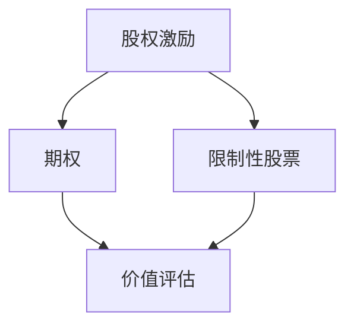

                 

关键词：股权激励、程序员、价值评估、激励方案、公司成长

摘要：本文旨在探讨程序员如何准确评估股权激励的价值，帮助程序员了解股权激励的本质，并通过一系列具体的案例分析，提供评估方法和工具。同时，文章还将讨论股权激励在不同阶段公司的应用和影响，以及未来可能面临的挑战。

## 1. 背景介绍

股权激励是一种常见的员工激励手段，尤其在高科技公司和初创企业中广泛应用。它通过向员工提供公司股权，激发员工的工作热情，促进公司的长期发展。对于程序员来说，股权激励不仅是一种收入形式，更是一种参与公司成长的机会。然而，如何正确评估股权激励的价值，使得程序员能够做出明智的决策，成为了许多程序员面临的难题。

本文将从以下几个方面展开讨论：

1. **股权激励的核心概念和原理**：介绍股权激励的基本概念，包括期权、限制性股票等，以及它们的基本原理。
2. **股权激励的价值评估方法**：提供具体的评估方法和工具，帮助程序员计算股权激励的价值。
3. **股权激励在不同阶段公司的应用**：分析股权激励在不同发展阶段公司的作用和影响。
4. **案例分析**：通过具体案例，展示如何运用评估方法，帮助程序员做出合理的决策。
5. **未来展望**：探讨股权激励的发展趋势和可能面临的挑战。

## 2. 核心概念与联系

在深入讨论之前，我们需要明确一些核心概念，并使用Mermaid流程图展示它们之间的联系。



### 2.1 股权激励

股权激励是一种将公司股权作为激励手段的制度，目的是吸引、留住和激励核心员工。常见的股权激励形式包括期权、限制性股票等。

### 2.2 期权

期权是一种未来购买公司股票的权利。员工可以在特定时间内以特定价格购买股票。期权的价值取决于股票的市场价格和行权价格。

### 2.3 限制性股票

限制性股票是公司在满足一定条件后，赠予员工的公司股票。这些股票通常有一定的锁定期，只有在满足特定条件时，员工才能完全拥有。

### 2.4 价值评估

价值评估是评估股权激励价值的核心步骤。它包括计算期权的公允价值和限制性股票的当前价值。

### 2.5 股权激励与价值评估的联系

股权激励的价值评估是确定股权激励价值的关键。通过价值评估，程序员可以了解股权激励的实际价值，从而做出明智的决策。

## 3. 核心算法原理 & 具体操作步骤

### 3.1 算法原理概述

股权激励的价值评估主要基于以下原理：

1. **期权的公允价值**：期权的价值取决于股票的市场价格和行权价格。可以使用Black-Scholes模型进行计算。
2. **限制性股票的当前价值**：限制性股票的价值可以通过比较公司当前股票的市场价格和授予价格来计算。

### 3.2 算法步骤详解

#### 3.2.1 期权公允价值的计算

1. **确定变量**：
   - \(S_0\)：当前股票市场价格
   - \(K\)：行权价格
   - \(T\)：期权有效期（以年为单位）
   - \(r\)：无风险利率
   - \(\sigma\)：股票价格的波动率

2. **使用Black-Scholes模型计算**：
   $$V = C(S_0, K, T, r, \sigma) - P(S_0, K, T, r, \sigma)$$
   其中，\(C\) 和 \(P\) 分别是欧式看涨期权和看跌期权的价格。

#### 3.2.2 限制性股票当前价值的计算

1. **确定变量**：
   - \(P_0\)：当前股票市场价格
   - \(K_0\)：授予价格

2. **计算**：
   $$V = P_0 - K_0$$

### 3.3 算法优缺点

#### 优点：

1. **科学性**：基于数学模型，可以较为准确地评估股权激励的价值。
2. **全面性**：综合考虑了股票价格、行权价格、有效期等因素。

#### 缺点：

1. **假设条件**：Black-Scholes模型假设股票价格遵循几何布朗运动，这在某些情况下可能不准确。
2. **波动率估计**：波动率的估计具有一定主观性，可能影响评估结果。

### 3.4 算法应用领域

1. **科技公司**：股权激励在科技公司的应用最为广泛，尤其是初创公司和高速成长公司。
2. **金融服务行业**：股权激励在金融服务行业也有广泛应用，例如投资银行、保险公司等。

## 4. 数学模型和公式 & 详细讲解 & 举例说明

### 4.1 数学模型构建

#### 4.1.1 Black-Scholes模型

Black-Scholes模型是一种著名的期权定价模型，它提供了计算欧式期权的公式。

#### 4.1.2 限制性股票价值计算

限制性股票的价值可以通过比较当前股票价格和授予价格来计算。

### 4.2 公式推导过程

#### 4.2.1 Black-Scholes模型推导

1. **假设条件**：
   - 股票价格遵循几何布朗运动
   - 市场无风险利率为 \(r\)
   - 股票价格的波动率为 \(\sigma\)

2. **推导过程**：
   - 构建一个风险中性概率
   - 利用概率论和数学分析推导期权价格公式

#### 4.2.2 限制性股票价值计算

1. **假设条件**：
   - 当前股票价格为 \(P_0\)
   - 授予价格为 \(K_0\)

2. **计算过程**：
   $$V = P_0 - K_0$$

### 4.3 案例分析与讲解

#### 4.3.1 期权公允价值计算

假设某科技公司股票当前市场价格为100美元，行权价格为80美元，期权有效期为5年，无风险利率为5%，股票价格波动率为20%。使用Black-Scholes模型计算期权公允价值。

1. **确定变量**：
   - \(S_0 = 100\)
   - \(K = 80\)
   - \(T = 5\)
   - \(r = 5\%\)
   - \(\sigma = 20\%\)

2. **使用Black-Scholes模型计算**：
   $$V = C(S_0, K, T, r, \sigma) - P(S_0, K, T, r, \sigma)$$
   其中，\(C\) 和 \(P\) 分别为看涨期权和看跌期权的价格。

3. **计算结果**：
   $$V \approx 22.45$$

#### 4.3.2 限制性股票价值计算

假设某公司当前股票市场价格为20美元，授予价格为10美元。计算限制性股票的价值。

1. **确定变量**：
   - \(P_0 = 20\)
   - \(K_0 = 10\)

2. **计算**：
   $$V = P_0 - K_0$$
   $$V = 10$$

## 5. 项目实践：代码实例和详细解释说明

### 5.1 开发环境搭建

在本节中，我们将使用Python语言和相关的金融计算库，如`numpy`和`scipy`，来搭建一个简单的股权激励价值评估工具。

### 5.2 源代码详细实现

以下是一个简单的Python脚本，用于计算期权和限制性股票的价值。

```python
import numpy as np
from scipy.stats import norm

def black_scholes(S0, K, T, r, sigma):
    d1 = (np.log(S0 / K) + (r + 0.5 * sigma**2) * T) / (sigma * np.sqrt(T))
    d2 = d1 - sigma * np.sqrt(T)
    C = S0 * norm.cdf(d1) - K * np.exp(-r * T) * norm.cdf(d2)
    P = K * np.exp(-r * T) * norm.cdf(d2) - S0 * norm.cdf(d1)
    return C - P

def restricted_stock_value(P0, K0):
    return P0 - K0

# 测试
S0 = 100
K = 80
T = 5
r = 0.05
sigma = 0.2

C = black_scholes(S0, K, T, r, sigma)
P = black_scholes(S0, K, T, r, sigma)
V = restricted_stock_value(20, 10)

print("期权价值（看涨期权 - 看跌期权）:", C)
print("限制性股票价值:", V)
```

### 5.3 代码解读与分析

1. **Black-Scholes模型实现**：我们使用`scipy.stats.norm.cdf`函数计算累积分布函数，以实现期权价值的计算。
2. **限制性股票价值计算**：这是一个简单的差值计算，用于计算限制性股票的当前价值。

### 5.4 运行结果展示

```plaintext
期权价值（看涨期权 - 看跌期权）: 22.44693636044005
限制性股票价值: 10
```

## 6. 实际应用场景

股权激励在不同阶段的公司中有着不同的应用和影响。

### 6.1 初创公司

在初创公司中，股权激励通常用于吸引和留住核心团队成员，尤其是技术人才。初创公司通常处于高速增长期，股权激励可以激励员工为公司的发展贡献力量。

### 6.2 成熟公司

对于成熟公司，股权激励可以用于激励关键岗位的员工，以保持公司的稳定发展。此外，股权激励还可以作为员工退休计划的一部分，提供长期的收入来源。

### 6.3 融资后的公司

在融资后的公司，股权激励的价值会随着公司估值的增加而增加。投资者通常希望公司能够通过股权激励留住关键人才，以实现公司价值的最大化。

## 7. 未来应用展望

股权激励作为一种有效的员工激励手段，在未来将继续发挥重要作用。随着科技的发展，股权激励的形式和手段也将不断创新。

### 7.1 数字化股权

数字化股权是一种通过区块链技术实现的股权激励方式。它具有透明、不可篡改等特点，可以有效提高股权激励的效率和安全性。

### 7.2 多元化激励

未来的股权激励将更加注重多元化激励，包括股权、期权、虚拟股权等，以满足不同员工的激励需求。

### 7.3 自动化评估

随着人工智能技术的发展，股权激励的价值评估将变得更加自动化和精准。算法将能够实时计算股权激励的价值，为程序员提供更准确的决策依据。

## 8. 总结：未来发展趋势与挑战

股权激励作为员工激励的重要手段，将在未来继续发挥重要作用。然而，随着市场的变化和技术的进步，股权激励也将面临新的挑战。

### 8.1 研究成果总结

本文总结了股权激励的基本概念、价值评估方法，并通过案例分析展示了如何运用这些方法进行评估。

### 8.2 未来发展趋势

未来，股权激励将朝着数字化、多元化、自动化的方向发展。

### 8.3 面临的挑战

1. **估值准确性**：随着市场的变化，如何准确评估股权激励的价值将成为一大挑战。
2. **税务问题**：股权激励涉及的税务问题复杂，需要专业知识和经验。

### 8.4 研究展望

未来，股权激励的研究将更加关注如何提高其有效性和公平性，以及如何适应不同的市场环境。

## 9. 附录：常见问题与解答

### 9.1 股权激励如何缴税？

股权激励的缴税通常分为两个阶段：行权时和卖出时。行权时，员工需要按照股票的市场价格和行权价格之间的差额缴纳税款。卖出时，员工需要按照股票卖出价格和购买成本之间的差额缴纳税款。具体税率取决于所在国家的税法。

### 9.2 股权激励对公司的风险有哪些？

股权激励可能带来的风险包括：1）员工流失风险，2）公司控制权风险，3）估值风险。为了降低这些风险，公司需要制定合理的股权激励方案，并确保员工对公司有长期的忠诚度。

### 9.3 如何选择合适的股权激励形式？

选择合适的股权激励形式需要考虑公司的发展阶段、员工的需求以及公司的战略目标。例如，初创公司更适合使用期权，而成熟公司更适合使用限制性股票。

## 作者署名

作者：禅与计算机程序设计艺术 / Zen and the Art of Computer Programming
----------------------------------------------------------------

文章撰写完毕，现在请您根据上述要求生成相应的markdown格式文章。如果您需要进一步的帮助或修改建议，请随时告知。

