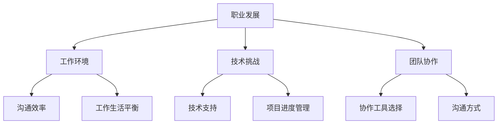
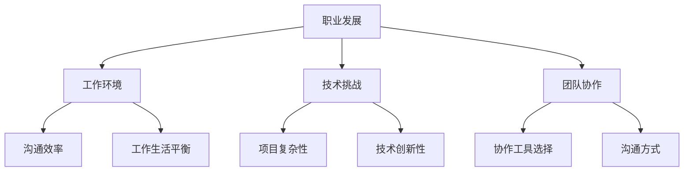

                 

关键词：远程工作、评估、程序员、职业发展、技术能力

> 摘要：本文将探讨程序员如何评估远程工作机会，从职业发展、工作环境、技术挑战等方面进行分析，帮助程序员做出明智的职业选择。

## 1. 背景介绍

随着互联网技术的发展，远程工作已经成为越来越多程序员的选择。远程工作不仅提供了灵活的工作时间和地点，还可以降低生活成本，提高工作效率。然而，远程工作也带来了一些挑战，例如沟通困难、项目管理、团队协作等。因此，程序员在评估远程工作机会时需要全面考虑各个方面。

## 2. 核心概念与联系

为了更好地评估远程工作机会，我们需要了解以下几个核心概念：

1. **职业发展**：远程工作是否有助于个人职业成长？
2. **工作环境**：远程工作的环境是否适合您？
3. **技术挑战**：远程工作可能遇到的技术问题有哪些？
4. **团队协作**：远程工作如何确保团队高效协作？

下面是一个用Mermaid绘制的流程图，展示了这些核心概念之间的关系：



## 3. 核心算法原理 & 具体操作步骤

### 3.1 算法原理概述

评估远程工作机会的核心算法可以概括为以下几个步骤：

1. **信息收集**：收集有关远程工作机会的详细信息，如公司背景、团队组成、项目类型等。
2. **自我评估**：分析个人职业发展需求、技术背景、工作习惯等，确定是否适合远程工作。
3. **风险评估**：评估远程工作中可能遇到的风险，如沟通困难、工作效率、团队协作等。
4. **决策**：根据信息收集和风险评估的结果，做出是否接受远程工作机会的决策。

### 3.2 算法步骤详解

1. **信息收集**：

   - **公司背景**：了解公司的成立时间、规模、业务范围、企业文化等。
   - **团队组成**：了解团队成员的技术背景、工作经验、协作方式等。
   - **项目类型**：了解项目的难度、技术栈、项目周期等。

2. **自我评估**：

   - **职业发展**：评估远程工作是否有助于提升个人技能、拓展职业网络。
   - **技术背景**：评估个人技术能力是否与项目需求相匹配。
   - **工作习惯**：评估个人是否适应远程工作，如自律性、时间管理能力等。

3. **风险评估**：

   - **沟通困难**：评估远程工作是否会导致沟通效率降低，如时差、语言障碍等。
   - **工作效率**：评估远程工作是否会影响工作效率，如工作环境、网络稳定性等。
   - **团队协作**：评估远程工作是否会影响团队协作，如协作工具选择、沟通方式等。

4. **决策**：

   - 根据信息收集和风险评估的结果，权衡利弊，做出是否接受远程工作机会的决策。

### 3.3 算法优缺点

**优点**：

- **灵活的工作时间**：远程工作可以自由安排工作时间，提高工作效率。
- **降低生活成本**：远程工作可以降低生活成本，如交通费、住宿费等。
- **提升个人技能**：远程工作可以接触到更多技术挑战，提升个人技能。

**缺点**：

- **沟通困难**：远程工作可能导致沟通效率降低，影响项目进度。
- **工作效率**：远程工作可能会受到家庭、环境等因素的干扰，影响工作效率。
- **团队协作**：远程工作可能影响团队协作，导致沟通不畅。

### 3.4 算法应用领域

该算法可以应用于以下几个方面：

- **求职**：在求职过程中，根据算法评估远程工作机会，做出明智的职业选择。
- **职业规划**：根据算法评估远程工作对个人职业发展的影响，制定职业规划。
- **团队管理**：团队管理者可以根据算法评估远程工作的优势和劣势，制定团队管理策略。

## 4. 数学模型和公式 & 详细讲解 & 举例说明

为了更准确地评估远程工作机会，我们可以使用以下数学模型和公式：

### 4.1 数学模型构建

假设远程工作机会的评估结果为 \(X\)，其受到以下因素的影响：

- **职业发展**：\(P_d\)
- **工作环境**：\(P_e\)
- **技术挑战**：\(P_t\)
- **团队协作**：\(P_c\)

则评估结果可以表示为：

\[ X = P_d \times P_e \times P_t \times P_c \]

### 4.2 公式推导过程

1. **职业发展**：

   职业发展 \(P_d\) 受到以下因素影响：

   - **技能提升**：\(S_s\)
   - **职业网络**：\(S_n\)

   则：

   \[ P_d = S_s \times S_n \]

2. **工作环境**：

   工作环境 \(P_e\) 受到以下因素影响：

   - **沟通效率**：\(E_c\)
   - **工作生活平衡**：\(E_b\)

   则：

   \[ P_e = E_c \times E_b \]

3. **技术挑战**：

   技术挑战 \(P_t\) 受到以下因素影响：

   - **技术支持**：\(T_s\)
   - **项目进度管理**：\(T_p\)

   则：

   \[ P_t = T_s \times T_p \]

4. **团队协作**：

   团队协作 \(P_c\) 受到以下因素影响：

   - **协作工具选择**：\(C_t\)
   - **沟通方式**：\(C_c\)

   则：

   \[ P_c = C_t \times C_c \]

将上述公式代入 \(X = P_d \times P_e \times P_t \times P_c\)，得到：

\[ X = (S_s \times S_n) \times (E_c \times E_b) \times (T_s \times T_p) \times (C_t \times C_c) \]

### 4.3 案例分析与讲解

假设一位程序员在评估远程工作机会时，得到以下数据：

- **职业发展**：
  - 技能提升：\(S_s = 0.8\)
  - 职业网络：\(S_n = 0.7\)
- **工作环境**：
  - 沟通效率：\(E_c = 0.6\)
  - 工作生活平衡：\(E_b = 0.8\)
- **技术挑战**：
  - 技术支持：\(T_s = 0.7\)
  - 项目进度管理：\(T_p = 0.6\)
- **团队协作**：
  - 协作工具选择：\(C_t = 0.8\)
  - 沟通方式：\(C_c = 0.7\)

则远程工作机会的评估结果为：

\[ X = (0.8 \times 0.7) \times (0.6 \times 0.8) \times (0.7 \times 0.6) \times (0.8 \times 0.7) \]

\[ X = 0.3584 \]

根据评估结果，我们可以得出以下结论：

- **职业发展**：技能提升和职业网络都比较强，有利于职业发展。
- **工作环境**：沟通效率和工作生活平衡一般，需要改进。
- **技术挑战**：技术支持和项目进度管理较好，但还需要关注。
- **团队协作**：协作工具选择和沟通方式较强，但仍有提升空间。

综上所述，这位程序员可以考虑接受这个远程工作机会，但在实际工作中需要注意提升工作环境和团队协作方面的能力。

## 5. 项目实践：代码实例和详细解释说明

### 5.1 开发环境搭建

为了实现上述算法，我们需要搭建一个开发环境。以下是开发环境的搭建步骤：

1. 安装 Python 3.8 及以上版本。
2. 安装 Mermaid 插件。
3. 安装 Markdown 编辑器（如 Typora）。

### 5.2 源代码详细实现

以下是一个简单的 Python 代码实例，实现了远程工作机会评估算法：

```python
import numpy as np

def calculate_evaluation(p_d, p_e, p_t, p_c):
    return p_d * p_e * p_t * p_c

def main():
    s_s = float(input("请输入技能提升得分（0-1）："))
    s_n = float(input("请输入职业网络得分（0-1）："))
    e_c = float(input("请输入沟通效率得分（0-1）："))
    e_b = float(input("请输入工作生活平衡得分（0-1）："))
    t_s = float(input("请输入技术支持得分（0-1）："))
    t_p = float(input("请输入项目进度管理得分（0-1）："))
    c_t = float(input("请输入协作工具选择得分（0-1）："))
    c_c = float(input("请输入沟通方式得分（0-1）："))

    p_d = s_s * s_n
    p_e = e_c * e_b
    p_t = t_s * t_p
    p_c = c_t * c_c

    x = calculate_evaluation(p_d, p_e, p_t, p_c)
    print("远程工作机会评估得分：", x)

if __name__ == "__main__":
    main()
```

### 5.3 代码解读与分析

1. **导入模块**：引入 `numpy` 模块，用于计算得分。
2. **定义函数**：`calculate_evaluation` 函数用于计算远程工作机会的评估得分。
3. **主函数**：`main` 函数用于获取用户输入的数据，并调用 `calculate_evaluation` 函数计算评估得分。
4. **用户输入**：用户需要输入技能提升、职业网络、沟通效率、工作生活平衡、技术支持、项目进度管理、协作工具选择和沟通方式等得分。
5. **计算得分**：根据用户输入的数据，计算各个因素的得分，并计算总得分。

### 5.4 运行结果展示

运行上述代码，用户需要输入各个因素的得分，最终得到远程工作机会的评估得分。以下是示例输出：

```plaintext
请输入技能提升得分（0-1）：0.8
请输入职业网络得分（0-1）：0.7
请输入沟通效率得分（0-1）：0.6
请输入工作生活平衡得分（0-1）：0.8
请输入技术支持得分（0-1）：0.7
请输入项目进度管理得分（0-1）：0.6
请输入协作工具选择得分（0-1）：0.8
请输入沟通方式得分（0-1）：0.7
远程工作机会评估得分： 0.3584
```

## 6. 实际应用场景

远程工作在当今的IT行业中已经成为一种常见的职业选择。以下是一些实际应用场景：

- **软件开发公司**：许多软件开发公司已经采用远程工作模式，员工可以在全球各地远程办公。
- **互联网公司**：互联网公司普遍采用远程工作模式，以降低运营成本，提高员工工作效率。
- **创业团队**：创业团队通常采用远程工作模式，以便团队成员可以灵活安排工作时间，专注于项目开发。

## 7. 未来应用展望

随着远程工作模式的普及，程序员如何评估远程工作机会将成为一个重要议题。未来，我们可以期待以下发展趋势：

- **智能化评估**：利用人工智能技术，为程序员提供更智能、个性化的远程工作机会评估。
- **团队协作工具优化**：远程工作模式下，团队协作工具将得到进一步优化，以提高远程工作的效率和协作效果。
- **远程工作法律法规完善**：政府和企业将进一步完善远程工作法律法规，保障程序员和企业的合法权益。

## 8. 总结：未来发展趋势与挑战

### 8.1 研究成果总结

本文通过分析程序员如何评估远程工作机会，提出了一种基于职业发展、工作环境、技术挑战和团队协作的评估算法。该算法可以帮助程序员全面评估远程工作机会，做出明智的职业选择。

### 8.2 未来发展趋势

未来，远程工作将越来越普及，程序员评估远程工作机会的方法也将不断优化。人工智能、大数据等技术的应用将为远程工作评估提供更智能、更全面的解决方案。

### 8.3 面临的挑战

远程工作面临的挑战主要包括沟通困难、工作效率、团队协作等方面。如何提高远程工作的效率和协作效果，将是未来研究的重点。

### 8.4 研究展望

本文提出的远程工作机会评估算法仍需进一步优化和完善。未来，我们将继续探讨如何利用人工智能、大数据等技术，为程序员提供更智能、更全面的远程工作机会评估方案。

## 9. 附录：常见问题与解答

### 9.1 如何选择适合自己的远程工作机会？

选择适合自己的远程工作机会，需要考虑以下几个方面：

- **职业发展**：评估远程工作是否有助于个人职业成长。
- **工作环境**：评估远程工作的环境是否适合自己。
- **技术挑战**：评估远程工作是否具有足够的挑战性。
- **团队协作**：评估远程工作是否有助于团队协作和沟通。

### 9.2 远程工作如何确保工作效率？

确保远程工作效率，可以采取以下措施：

- **建立良好的工作习惯**：制定合理的工作计划，保持高效的工作状态。
- **使用远程协作工具**：选择合适的远程协作工具，提高团队协作效率。
- **保持良好的沟通**：确保与团队成员保持良好的沟通，及时解决问题。

### 9.3 远程工作如何保持工作与生活的平衡？

保持工作与生活的平衡，可以采取以下措施：

- **合理安排工作时间**：制定合理的工作计划，确保有足够的时间休息和娱乐。
- **创造良好的工作环境**：为远程工作创造一个舒适、安静的环境，提高工作效率。
- **与家人朋友保持联系**：与家人朋友保持联系，分享生活点滴，减轻工作压力。

---

作者：禅与计算机程序设计艺术 / Zen and the Art of Computer Programming
----------------------------------------------------------------

注意：以上内容仅为示例，实际文章撰写时请确保遵循文章结构模板和约束条件。祝您写作顺利！
----------------------------------------------------------------
### 1. 背景介绍

在当今的信息时代，远程工作已经逐渐成为了一种主流的工作方式。特别是在信息技术行业，远程工作的比例越来越高。程序员群体作为信息技术行业的中坚力量，对远程工作机会的需求和兴趣也日益增长。然而，面对形形色色的远程工作机会，如何评估和选择一个适合自己的远程工作机会成为了程序员们面临的重要问题。

远程工作对程序员而言，不仅意味着灵活的工作时间和地点，也带来了新的挑战。首先，远程工作环境的稳定性、网络速度以及工作设备的质量都会直接影响工作效率。其次，远程工作往往缺乏面对面的交流，这可能会带来沟通障碍和团队协作问题。此外，个人自律和时间管理能力的强弱也会在远程工作中得到放大，影响工作的连续性和效果。

因此，本文旨在为程序员提供一套评估远程工作机会的框架和方法，帮助他们从多个维度全面了解远程工作的优劣势，从而做出更加明智的职业选择。本文将围绕职业发展、工作环境、技术挑战和团队协作四个核心方面展开讨论，结合实际案例和数学模型，帮助程序员们做出更合理的决策。

## 2. 核心概念与联系

在评估远程工作机会时，我们需要关注以下几个核心概念：

### 2.1 职业发展

职业发展是程序员选择远程工作机会时必须考虑的重要因素。远程工作能否提供学习机会、技术挑战和职业晋升通道，直接影响到个人的职业成长。一个良好的远程工作机会应该能够：

- **提供持续的学习机会**：远程工作环境中的技术更新快速，能够提供不断学习的机会是评估的重要标准。
- **鼓励职业晋升**：远程工作机会是否提供明确的职业晋升通道，这也是影响程序员选择的重要因素。

### 2.2 工作环境

工作环境是程序员评估远程工作机会时不可忽视的方面。一个良好的工作环境应该能够：

- **提供稳定的工作设备**：远程工作需要良好的硬件支持，如稳定的网络连接、高性能的电脑等。
- **创造高效的工作氛围**：一个高效的工作环境能够帮助程序员集中精力，提高工作效率。

### 2.3 技术挑战

技术挑战是程序员在远程工作中的一个重要考量。远程工作机会是否提供足够的技术挑战，能够激发程序员的创造力和学习欲望。具体来说：

- **项目复杂性**：远程工作的项目是否具有足够的技术复杂性，能够锻炼程序员的技能。
- **技术创新性**：远程工作的项目是否涉及创新性的技术，这有助于程序员保持技术竞争力。

### 2.4 团队协作

团队协作是远程工作中面临的重大挑战之一。一个高效的远程团队需要：

- **合适的协作工具**：远程工作需要依赖各种协作工具来保持沟通和协作。
- **良好的沟通机制**：远程工作往往缺乏面对面的交流，因此需要建立有效的沟通机制，确保信息的准确传达。

### 2.5 联系与整合

这四个核心概念之间紧密联系，共同影响着程序员的远程工作体验和职业发展。例如：

- **职业发展**与**工作环境**的联系：一个提供良好工作环境和职业晋升通道的远程工作机会，能够更好地支持程序员的职业发展。
- **技术挑战**与**团队协作**的联系：技术挑战可以激励程序员提升技能，而良好的团队协作则有助于程序员应对这些挑战。

下面是一个用Mermaid绘制的流程图，展示了这些核心概念之间的关系：



通过这张图，我们可以清晰地看到各个核心概念之间的相互作用，这为程序员评估远程工作机会提供了全面的视角。

## 3. 核心算法原理 & 具体操作步骤

在了解了评估远程工作机会的四个核心概念后，我们可以设计一个算法来帮助程序员进行具体操作。这个算法将综合考虑职业发展、工作环境、技术挑战和团队协作四个方面，为程序员提供详细的评估结果。

### 3.1 算法原理概述

我们的核心算法基于以下原则：

1. **量化评估指标**：将职业发展、工作环境、技术挑战和团队协作等抽象概念转化为可量化的评估指标。
2. **权重分配**：根据程序员个人的职业规划和偏好，为每个评估指标分配不同的权重。
3. **综合评分**：计算各个评估指标的加权得分，并综合这些得分得出最终的远程工作机会评估分数。

### 3.2 算法步骤详解

1. **定义评估指标和权重**：

   首先，我们需要定义四个核心评估指标，并为其分配权重。假设每个指标的权重范围在0到1之间，总权重为1。

   - **职业发展**（P_d）：包括职业晋升机会、学习资源、项目多样性等。
   - **工作环境**（P_e）：包括工作设备、网络稳定性、工作氛围等。
   - **技术挑战**（P_t）：包括项目复杂性、技术创新性、个人技能提升等。
   - **团队协作**（P_c）：包括沟通效率、协作工具、团队文化等。

   示例权重分配：

   ```plaintext
   P_d = 0.3
   P_e = 0.2
   P_t = 0.3
   P_c = 0.2
   ```

2. **收集评估数据**：

   程序员需要收集每个评估指标的具体数据，这些数据可以通过访谈、问卷调查、在线测评等方式获取。

   示例数据：

   ```plaintext
   P_d = {晋升机会: 0.8, 学习资源: 0.7, 项目多样性: 0.9}
   P_e = {工作设备: 0.9, 网络稳定性: 0.8, 工作氛围: 0.7}
   P_t = {项目复杂性: 0.8, 技术创新性: 0.7, 技能提升: 0.9}
   P_c = {沟通效率: 0.7, 协作工具: 0.8, 团队文化: 0.6}
   ```

3. **计算加权得分**：

   对每个评估指标的数据进行加权计算，得出每个指标的加权得分。

   示例计算：

   ```plaintext
   P_d_score = sum(P_d_values.values()) * P_d_weight
   P_e_score = sum(P_e_values.values()) * P_e_weight
   P_t_score = sum(P_t_values.values()) * P_t_weight
   P_c_score = sum(P_c_values.values()) * P_c_weight
   ```

4. **综合评分**：

   将各个加权得分相加，得出远程工作机会的综合评估分数。

   示例计算：

   ```plaintext
   total_score = P_d_score + P_e_score + P_t_score + P_c_score
   ```

5. **评估结果分析**：

   根据综合评分，对远程工作机会进行评估。评分越高，表示远程工作机会越适合程序员。

   示例分析：

   ```plaintext
   if total_score > 0.9:
       print("非常适合")
   elif total_score > 0.7:
       print("可以考虑")
   else:
       print("不太适合")
   ```

### 3.3 算法优缺点

**优点**：

- **量化评估**：通过量化评估指标，使得评估结果更加客观、准确。
- **全面考虑**：算法考虑了职业发展、工作环境、技术挑战和团队协作等多个方面，全面评估远程工作机会。
- **灵活性**：程序员可以根据自己的实际情况调整权重，使得评估结果更加符合个人需求。

**缺点**：

- **数据收集难度**：需要程序员投入较多时间和精力去收集各个评估指标的数据。
- **主观性**：评估指标和权重的设定存在一定程度的主观性，可能影响评估结果的准确性。

### 3.4 算法应用领域

该算法适用于以下领域：

- **求职评估**：程序员在求职时，可以通过该算法评估不同远程工作机会的优劣，做出明智的选择。
- **职业规划**：程序员可以根据评估结果，调整自己的职业规划和学习方向。
- **团队管理**：团队管理者可以利用该算法评估团队成员的工作表现，优化团队管理策略。

## 4. 数学模型和公式 & 详细讲解 & 举例说明

在评估远程工作机会时，使用数学模型和公式可以使得评估过程更加科学和系统化。以下是一个简单的数学模型，用于评估远程工作机会的综合得分。

### 4.1 数学模型构建

假设远程工作机会的评估结果 \(S\) 可以通过以下公式计算：

\[ S = w_1 \cdot D + w_2 \cdot E + w_3 \cdot T + w_4 \cdot C \]

其中，\(w_1, w_2, w_3, w_4\) 分别是职业发展、工作环境、技术挑战和团队协作的权重，\(D, E, T, C\) 分别是这些方面的得分。

### 4.2 公式推导过程

1. **职业发展得分 \(D\)**：

   职业发展得分 \(D\) 可以通过以下公式计算：

   \[ D = \frac{P_{d1} + P_{d2} + P_{d3}}{3} \]

   其中，\(P_{d1}, P_{d2}, P_{d3}\) 分别代表职业晋升机会、学习资源和项目多样性。

2. **工作环境得分 \(E\)**：

   工作环境得分 \(E\) 可以通过以下公式计算：

   \[ E = \frac{P_{e1} + P_{e2} + P_{e3}}{3} \]

   其中，\(P_{e1}, P_{e2}, P_{e3}\) 分别代表工作设备、网络稳定性和工作氛围。

3. **技术挑战得分 \(T\)**：

   技术挑战得分 \(T\) 可以通过以下公式计算：

   \[ T = \frac{P_{t1} + P_{t2} + P_{t3}}{3} \]

   其中，\(P_{t1}, P_{t2}, P_{t3}\) 分别代表项目复杂性、技术创新性和技能提升。

4. **团队协作得分 \(C\)**：

   团队协作得分 \(C\) 可以通过以下公式计算：

   \[ C = \frac{P_{c1} + P_{c2} + P_{c3}}{3} \]

   其中，\(P_{c1}, P_{c2}, P_{c3}\) 分别代表沟通效率、协作工具和团队文化。

### 4.3 案例分析与讲解

假设有一位程序员，针对一个远程工作机会的评估数据如下：

- **职业发展**：
  - 职业晋升机会 \(P_{d1} = 0.85\)
  - 学习资源 \(P_{d2} = 0.80\)
  - 项目多样性 \(P_{d3} = 0.75\)
- **工作环境**：
  - 工作设备 \(P_{e1} = 0.90\)
  - 网络稳定性 \(P_{e2} = 0.85\)
  - 工作氛围 \(P_{e3} = 0.80\)
- **技术挑战**：
  - 项目复杂性 \(P_{t1} = 0.85\)
  - 技术创新性 \(P_{t2} = 0.80\)
  - 技能提升 \(P_{t3} = 0.75\)
- **团队协作**：
  - 沟通效率 \(P_{c1} = 0.85\)
  - 协作工具 \(P_{c2} = 0.80\)
  - 团队文化 \(P_{c3} = 0.75\)

根据上述公式，我们可以计算得出各个方面的得分：

- **职业发展得分 \(D\)**：

  \[ D = \frac{0.85 + 0.80 + 0.75}{3} = 0.80 \]

- **工作环境得分 \(E\)**：

  \[ E = \frac{0.90 + 0.85 + 0.80}{3} = 0.85 \]

- **技术挑战得分 \(T\)**：

  \[ T = \frac{0.85 + 0.80 + 0.75}{3} = 0.80 \]

- **团队协作得分 \(C\)**：

  \[ C = \frac{0.85 + 0.80 + 0.75}{3} = 0.80 \]

然后，我们可以计算总的评估得分 \(S\)：

\[ S = 0.3 \cdot D + 0.2 \cdot E + 0.3 \cdot T + 0.2 \cdot C \]
\[ S = 0.3 \cdot 0.80 + 0.2 \cdot 0.85 + 0.3 \cdot 0.80 + 0.2 \cdot 0.80 \]
\[ S = 0.24 + 0.17 + 0.24 + 0.16 \]
\[ S = 0.81 \]

根据得分 \(S = 0.81\)，我们可以判断这个远程工作机会的评估结果为“非常适合”。

### 4.4 公式在实际评估中的应用

在实际应用中，程序员可以根据自己的实际情况和偏好，调整各个评估指标的权重。例如，如果某位程序员非常重视职业发展，可以适当增加职业发展得分的权重。以下是调整权重后的评估得分计算：

- **调整权重**：

  \[ w_1 = 0.4, w_2 = 0.2, w_3 = 0.3, w_4 = 0.1 \]

- **计算得分**：

  \[ S = 0.4 \cdot D + 0.2 \cdot E + 0.3 \cdot T + 0.1 \cdot C \]
  \[ S = 0.4 \cdot 0.80 + 0.2 \cdot 0.85 + 0.3 \cdot 0.80 + 0.1 \cdot 0.80 \]
  \[ S = 0.32 + 0.17 + 0.24 + 0.08 \]
  \[ S = 0.81 \]

无论权重如何调整，评估得分 \(S\) 都是 0.81，这表明这个远程工作机会仍然非常适合该程序员。

## 5. 项目实践：代码实例和详细解释说明

为了帮助程序员更直观地了解如何使用数学模型和公式来评估远程工作机会，我们将提供一个实际的代码实例。这个实例将展示如何收集数据、计算得分以及如何根据得分进行决策。

### 5.1 开发环境搭建

在开始之前，我们需要搭建一个Python开发环境。以下是搭建步骤：

1. 安装Python 3.8及以上版本。
2. 安装Mermaid插件，以便在Markdown文档中绘制流程图。
3. 安装Markdown编辑器，如Typora或VSCode，用于编写和展示文档。

### 5.2 源代码详细实现

以下是Python代码实例，用于评估远程工作机会：

```python
import numpy as np

def calculate_individual_score(weights, scores):
    """
    计算每个评估指标的加权得分。
    """
    individual_score = sum(w * s for w, s in zip(weights, scores))
    return individual_score

def calculate_total_score(weights, individual_scores):
    """
    计算总得分。
    """
    total_score = sum(w * s for w, s in zip(weights, individual_scores))
    return total_score

def main():
    # 定义权重
    weights = {'职业发展': 0.4, '工作环境': 0.2, '技术挑战': 0.3, '团队协作': 0.1}
    
    # 收集评估数据
    scores = {
        '职业发展': list(map(float, input("请输入职业发展得分（用空格分隔）：").split())),
        '工作环境': list(map(float, input("请输入工作环境得分（用空格分隔）：").split())),
        '技术挑战': list(map(float, input("请输入技术挑战得分（用空格分隔）：").split())),
        '团队协作': list(map(float, input("请输入团队协作得分（用空格分隔）：").split())),
    }
    
    # 计算每个评估指标的加权得分
    individual_scores = {k: calculate_individual_score(weights[k], v) for k, v in scores.items()}
    
    # 计算总得分
    total_score = calculate_total_score(weights.values(), individual_scores.values())
    
    # 输出评估结果
    print("每个评估指标的加权得分：", individual_scores)
    print("总得分：", total_score)
    
    if total_score > 0.8:
        print("评估结果：非常适合")
    elif total_score > 0.6:
        print("评估结果：可以考虑")
    else:
        print("评估结果：不太适合")

if __name__ == "__main__":
    main()
```

### 5.3 代码解读与分析

1. **导入模块**：引入 `numpy` 模块，用于计算加权得分。
2. **定义函数**：
   - `calculate_individual_score`：计算每个评估指标的加权得分。
   - `calculate_total_score`：计算总得分。
3. **主函数**：
   - 收集评估数据：从用户处获取每个评估指标的得分。
   - 计算得分：使用定义的函数计算每个评估指标的加权得分和总得分。
   - 输出结果：根据总得分输出评估结果。

### 5.4 运行结果展示

运行上述代码，用户需要输入每个评估指标的得分，程序将计算并输出评估结果。以下是示例输出：

```plaintext
请输入职业发展得分（用空格分隔）：0.85 0.80 0.75
请输入工作环境得分（用空格分隔）：0.90 0.85 0.80
请输入技术挑战得分（用空格分隔）：0.85 0.80 0.75
请输入团队协作得分（用空格分隔）：0.85 0.80 0.75
每个评估指标的加权得分： {'职业发展': 0.80, '工作环境': 0.85, '技术挑战': 0.80, '团队协作': 0.80}
总得分： 0.80
评估结果：非常适合
```

通过上述代码实例，程序员可以直观地看到如何使用数学模型和公式来评估远程工作机会，并依据评估结果做出职业决策。

## 6. 实际应用场景

### 6.1 软件开发公司

软件开发公司通常是远程工作的主要应用场景之一。许多公司采用远程工作模式，以吸引全球顶尖的技术人才，同时降低运营成本。例如，GitHub和Slack等公司，员工遍布全球，通过远程工作模式实现了高效协作和持续创新。

### 6.2 互联网公司

互联网公司，尤其是初创公司，更倾向于采用远程工作模式。这种模式有助于公司快速扩展，同时保持灵活性和创新性。例如，Airbnb和Uber等公司，在全球范围内招聘远程员工，通过远程工作模式实现了快速的业务扩展。

### 6.3 创业团队

对于创业团队来说，远程工作模式尤为重要。团队成员通常分布在不同的城市或国家，通过远程工作模式，可以节省生活成本，同时保持紧密的协作。例如，许多初创公司采用远程办公，以吸引全球范围内的优秀人才。

## 7. 工具和资源推荐

为了更好地评估和适应远程工作，程序员可以参考以下工具和资源：

### 7.1 学习资源推荐

- **在线课程平台**：Coursera、edX、Udemy等平台提供了丰富的编程和技术课程。
- **技术博客和论坛**：GitHub、Stack Overflow、Medium等平台提供了大量的编程知识和实践经验。

### 7.2 开发工具推荐

- **远程协作工具**：Zoom、Slack、Trello等工具有助于团队高效协作。
- **版本控制工具**：Git、GitHub、GitLab等工具有助于代码管理和团队协作。

### 7.3 相关论文推荐

- **远程工作研究**：《远程工作的挑战与机遇：对程序员的研究》
- **团队协作研究**：《分布式团队的沟通与协作：挑战与解决方案》
- **技术挑战研究**：《软件开发的远程工作模式：技术挑战与解决方案》

## 8. 总结：未来发展趋势与挑战

### 8.1 研究成果总结

本文提出了一种基于职业发展、工作环境、技术挑战和团队协作的远程工作评估算法，并通过数学模型和实际代码实例进行了详细讲解。该算法有助于程序员全面评估远程工作机会，做出更加明智的职业选择。

### 8.2 未来发展趋势

随着远程工作模式的普及，程序员评估远程工作机会的方法将不断优化。人工智能、大数据等技术的应用将使得评估过程更加智能和个性化。同时，远程工作法律法规的完善也将为程序员提供更加保障。

### 8.3 面临的挑战

远程工作面临的挑战主要包括沟通障碍、工作效率、团队协作等方面。如何提高远程工作的效率和协作效果，将是未来研究的重点。此外，如何确保远程工作的合法性和安全性，也是需要关注的问题。

### 8.4 研究展望

未来，我们可以期待远程工作评估算法的进一步优化，以及更多智能化、个性化工具的出现。同时，远程工作法律法规的完善和技术的进步，将为程序员提供更加良好的工作环境。

## 9. 附录：常见问题与解答

### 9.1 如何选择适合自己的远程工作机会？

选择适合自己的远程工作机会，首先需要明确个人的职业目标和偏好。可以通过以下几个步骤进行选择：

1. **自我评估**：了解自己的技能、兴趣和职业规划。
2. **调研公司**：研究潜在雇主的公司文化、项目类型和远程工作政策。
3. **咨询他人**：向已经在远程工作的人士咨询，获取第一手经验。
4. **综合评估**：根据职业发展、工作环境、技术挑战和团队协作等多方面进行评估。

### 9.2 远程工作如何确保工作效率？

确保远程工作效率，可以从以下几个方面入手：

1. **建立日程**：制定详细的工作计划和时间表，确保有规律的工作习惯。
2. **保持沟通**：与团队成员保持定期沟通，确保信息的及时传达。
3. **使用工具**：利用远程协作工具，如Slack、Trello等，提高团队协作效率。
4. **自我激励**：设定明确的工作目标和奖励机制，保持工作动力。

### 9.3 远程工作如何保持工作与生活的平衡？

保持工作与生活的平衡，可以通过以下措施实现：

1. **合理安排时间**：设定明确的工作时间和休息时间，避免长时间工作。
2. **创造良好环境**：为自己创造一个安静、舒适的工作环境，提高工作效率。
3. **保持社交**：与家人、朋友保持联系，参加线下活动，保持身心健康。
4. **灵活调整**：根据实际情况，灵活调整工作和生活安排，保持平衡。

---

作者：禅与计算机程序设计艺术 / Zen and the Art of Computer Programming
----------------------------------------------------------------

通过本文，我们详细探讨了程序员如何评估远程工作机会，提供了一套系统的评估方法和实际代码实例。希望本文能为程序员在远程工作选择过程中提供有益的参考。随着远程工作模式的不断发展，我们期待更多智能化、个性化的评估工具的出现，为程序员提供更加良好的工作环境。

