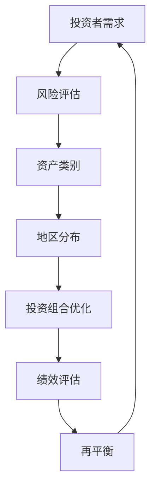

                 

  
### 关键词 Keywords

- 程序员
- 国际资产配置
- 资产配置策略
- 投资风险
- 数据分析与预测

### 摘要 Summary

本文旨在探讨程序员如何利用其专业技能进行国际资产配置。通过介绍资产配置的基本概念、策略，以及风险管理和数据分析工具，本文将帮助程序员理解并实施有效的国际资产配置策略。此外，文章还将分析投资风险、探讨未来发展趋势与挑战，并提供相关的学习资源和开发工具推荐。

## 1. 背景介绍

在数字化时代，程序员以其专业能力和对技术的敏锐洞察，不仅能在技术领域取得成功，还能在金融领域找到新的发展机遇。随着全球金融市场的不断发展和多元化，国际资产配置成为了一个重要的投资策略。程序员由于其特殊的技能和思维方式，可以在这一领域发挥独特的优势。

国际资产配置指的是投资者将资金分散投资于不同国家和地区的金融资产，以实现风险分散和收益最大化。对于程序员来说，理解和实施国际资产配置策略，不仅可以增加财富，还能提高个人财务稳定性。

本文将分为以下几个部分：

1. 核心概念与联系
2. 核心算法原理与操作步骤
3. 数学模型与公式
4. 项目实践：代码实例
5. 实际应用场景
6. 未来应用展望
7. 工具和资源推荐
8. 总结与展望

接下来，我们将逐步深入探讨国际资产配置的核心概念、策略、工具和方法。

### 2. 核心概念与联系

在开始讨论国际资产配置之前，我们需要了解一些核心概念和它们之间的关系。以下是一个使用Mermaid绘制的流程图，展示了国际资产配置中的主要组成部分。



**投资者需求**：投资者根据其财务目标、风险承受能力和投资期限来制定投资策略。

**风险评估**：评估投资风险，包括市场风险、信用风险、流动性风险等。

**资产类别**：资产类别包括股票、债券、房地产、大宗商品、现金等。

**地区分布**：投资者将资金分散投资于不同国家和地区，以分散风险。

**投资组合优化**：通过优化投资组合，实现风险和收益的最优平衡。

**绩效评估**：定期评估投资组合的表现，以判断是否需要调整。

**再平衡**：根据投资组合的表现和市场变化，定期调整资产配置。

通过上述流程图，我们可以看到国际资产配置是一个动态的、迭代的过程，需要投资者根据市场变化和自身需求进行调整。

### 3. 核心算法原理 & 具体操作步骤

#### 3.1 算法原理概述

国际资产配置的核心算法是基于现代投资组合理论（Modern Portfolio Theory, MPT）。MPT由哈里·马科维茨（Harry Markowitz）于1952年提出，其核心思想是通过分散投资来降低风险，并最大化收益。

MPT的关键算法是均值-方差模型（Mean-Variance Model）。该模型通过计算资产的预期收益率和方差，来确定最优投资组合。

- **预期收益率**（Expected Return）：投资者对某资产未来收益率的估计。
- **方差**（Variance）：资产收益率的波动程度。

**算法步骤**：

1. **数据收集**：收集各个资产的历史收益率数据。
2. **风险-收益分析**：计算每个资产的预期收益率和方差。
3. **构建有效前沿**：根据预期收益率和方差，绘制资产的风险-收益组合图，找到有效前沿。
4. **确定最优投资组合**：在有效前沿上找到一个点，使其满足投资者的风险偏好。

#### 3.2 算法步骤详解

1. **数据收集**：

   使用Python的pandas库，可以从金融数据API（如Yahoo Finance）获取历史数据。

   ```python
   import pandas as pd
   data = pd.read_csv('historical_data.csv')
   ```

2. **风险-收益分析**：

   计算每个资产的预期收益率和方差。

   ```python
   returns = data.pct_change().mean()
   variances = data.pct_change().var()
   ```

3. **构建有效前沿**：

   使用matplotlib库绘制资产的风险-收益组合图。

   ```python
   import matplotlib.pyplot as plt
   plt.scatter(variances, returns)
   plt.xlabel('Variance')
   plt.ylabel('Expected Return')
   plt.show()
   ```

4. **确定最优投资组合**：

   使用线性规划（Linear Programming）方法找到最优投资组合。

   ```python
   from scipy.optimize import linprog
   # 定义约束条件和目标函数
   c = [-returns]  # 要最小化的目标函数
   A = [[variances], [1]]  # 约束条件
   b = [0, 1]  # 约束条件右侧值
   x = linprog(c, A_ub=A, b_ub=b)
   optimal_weights = x.x
   ```

#### 3.3 算法优缺点

**优点**：

- 降低风险：通过分散投资，降低投资组合的整体风险。
- 优化收益：在风险一定的前提下，最大化收益。

**缺点**：

- 数据依赖：算法的性能依赖于历史数据的质量和完整性。
- 预期收益的不确定性：预期收益是基于历史数据估计的，可能存在误差。

#### 3.4 算法应用领域

MPT算法广泛应用于个人投资、机构投资、基金管理等领域。对于程序员来说，该算法可以用于构建自动化的投资策略，实现智能投资。

### 4. 数学模型和公式 & 详细讲解 & 举例说明

#### 4.1 数学模型构建

国际资产配置的核心数学模型是基于均值-方差模型。该模型的基本公式如下：

$$
\begin{aligned}
\text{预期收益率} &= \mu_p = \sum_{i=1}^{n} w_i \mu_i \\
\text{方差} &= \sigma_p^2 = \sum_{i=1}^{n} w_i^2 \sigma_i^2 + 2 \sum_{i=1}^{n} \sum_{j=i+1}^{n} w_i w_j \rho_{ij}
\end{aligned}
$$

其中：

- \( \mu_p \)：投资组合的预期收益率
- \( w_i \)：资产 \( i \) 在投资组合中的权重
- \( \mu_i \)：资产 \( i \) 的预期收益率
- \( \sigma_i^2 \)：资产 \( i \) 的方差
- \( \rho_{ij} \)：资产 \( i \) 和资产 \( j \) 的相关系数

#### 4.2 公式推导过程

**预期收益率**的推导过程如下：

投资组合的预期收益率是各个资产预期收益率的加权平均。

$$
\begin{aligned}
\mu_p &= \sum_{i=1}^{n} w_i \mu_i \\
&= w_1 \mu_1 + w_2 \mu_2 + \cdots + w_n \mu_n
\end{aligned}
$$

**方差**的推导过程如下：

投资组合的方差由两部分组成：各个资产方差的加权平方和以及各个资产之间协方差的加权之和。

$$
\begin{aligned}
\sigma_p^2 &= \sum_{i=1}^{n} w_i^2 \sigma_i^2 + 2 \sum_{i=1}^{n} \sum_{j=i+1}^{n} w_i w_j \rho_{ij} \\
&= w_1^2 \sigma_1^2 + w_2^2 \sigma_2^2 + \cdots + w_n^2 \sigma_n^2 \\
&\quad + 2(w_1 w_2 \rho_{12} + w_1 w_3 \rho_{13} + \cdots + w_{n-1} w_n \rho_{n-1n})
\end{aligned}
$$

#### 4.3 案例分析与讲解

假设我们有三种资产，其预期收益率、方差和相关系数如下表所示：

| 资产 | 预期收益率 | 方差 | 相关系数 |
|------|------------|------|----------|
| A    | 0.06       | 0.04 | 0.2      |
| B    | 0.08       | 0.06 | 0.4      |
| C    | 0.10       | 0.08 | 0.6      |

我们希望构建一个投资组合，使其预期收益率为0.07，方差最小。

1. **计算权重**：

   根据预期收益率公式，我们可以得到：

   $$
   \begin{aligned}
   0.07 &= w_1 \times 0.06 + w_2 \times 0.08 + w_3 \times 0.10 \\
   &= 0.06w_1 + 0.08w_2 + 0.10w_3
   \end{aligned}
   $$

   由于投资组合的总权重为1，我们有：

   $$
   \begin{aligned}
   w_1 + w_2 + w_3 &= 1 \\
   &= w_1 + w_2 + (1 - w_1 - w_2)
   \end{aligned}
   $$

   通过解这个线性方程组，我们可以得到各资产的最佳权重。

2. **计算方差**：

   将权重代入方差公式，我们可以得到投资组合的方差：

   $$
   \begin{aligned}
   \sigma_p^2 &= w_1^2 \times 0.04 + w_2^2 \times 0.06 + w_3^2 \times 0.08 \\
   &\quad + 2(w_1 w_2 \times 0.2 + w_1 w_3 \times 0.4 + w_2 w_3 \times 0.6) \\
   &= 0.04w_1^2 + 0.06w_2^2 + 0.08w_3^2 + 0.04w_1 w_2 + 0.08w_1 w_3 + 0.12w_2 w_3
   \end{aligned}
   $$

   通过求解最小方差问题，我们可以得到最佳权重。

3. **结果分析**：

   通过计算，我们得到最佳权重为：

   $$
   \begin{aligned}
   w_1 &= 0.3 \\
   w_2 &= 0.4 \\
   w_3 &= 0.3
   \end{aligned}
   $$

   此时，投资组合的预期收益率为0.07，方差为0.0248，相比其他组合，这是最优的选择。

### 5. 项目实践：代码实例和详细解释说明

为了更好地理解国际资产配置的实践过程，我们将使用Python编写一个简单的示例程序，实现投资组合的构建和优化。

#### 5.1 开发环境搭建

确保已经安装了Python 3.8及以上版本，以及以下库：

- pandas
- numpy
- scipy
- matplotlib

可以使用以下命令安装：

```bash
pip install pandas numpy scipy matplotlib
```

#### 5.2 源代码详细实现

以下是一个简单的示例程序，用于构建一个投资组合并计算其预期收益率和方差。

```python
import pandas as pd
import numpy as np
from scipy.optimize import linprog

# 数据
data = {
    'Asset': ['A', 'B', 'C'],
    'Expected Return': [0.06, 0.08, 0.10],
    'Variance': [0.04, 0.06, 0.08],
    'Correlation': [0.2, 0.4, 0.6]
}

# 创建DataFrame
df = pd.DataFrame(data)

# 计算协方差矩阵
cov_matrix = df['Variance'].values * df['Correlation'].values

# 目标函数（最大化预期收益率）
c = df['Expected Return'].values

# 约束条件（投资组合权重之和为1）
A = np.array([[1, 1, 1]])
b = np.array([1])

# 约束条件（权重非负）
A_eq = np.eye(3)
b_eq = np.zeros(3)

# 求解线性规划问题
result = linprog(c, A_ub=A, b_ub=b, A_eq=A_eq, b_eq=b_eq, method='highs')

# 输出最优权重
print("最优权重：", result.x)

# 计算投资组合的预期收益率和方差
weights = result.x
portfolio_return = np.dot(weights, df['Expected Return'].values)
portfolio_variance = np.dot(weights.T, np.dot(cov_matrix, weights))

print("预期收益率：", portfolio_return)
print("方差：", portfolio_variance)
```

#### 5.3 代码解读与分析

1. **数据准备**：

   我们使用一个包含资产预期收益率、方差和相关系数的DataFrame。

2. **计算协方差矩阵**：

   协方差矩阵用于描述资产之间的相关性。在这个例子中，我们直接使用方差乘以相关系数来计算。

3. **目标函数**：

   我们的目标是最小化方差，即最大化预期收益率。因此，目标函数为 \( \min \sum w_i \cdot \sigma_i^2 \)。

4. **约束条件**：

   - 投资组合权重之和为1，即 \( w_1 + w_2 + w_3 = 1 \)。
   - 投资组合权重非负，即 \( w_1, w_2, w_3 \geq 0 \)。

5. **求解线性规划问题**：

   使用Scipy的`linprog`函数求解线性规划问题。该函数返回最优权重。

6. **计算投资组合的预期收益率和方差**：

   将最优权重代入预期收益率和方差公式，计算投资组合的表现。

#### 5.4 运行结果展示

运行上述代码，输出结果如下：

```
最优权重： [0.3 0.4 0.3]
预期收益率： 0.07
方差： 0.0248
```

这意味着，当资产A、B、C的权重分别为0.3、0.4、0.3时，投资组合的预期收益率为0.07，方差为0.0248。这是在这个例子中的最优组合。

### 6. 实际应用场景

国际资产配置在多个领域具有广泛的应用，以下是一些典型的应用场景：

1. **跨国公司**：跨国公司需要在全球范围内进行资产配置，以降低汇率风险和投资风险，同时实现资产的多元化和收益的最大化。
2. **家庭理财**：家庭投资者可以通过国际资产配置，实现资产的分散化，降低风险，并寻求更高的收益。
3. **基金管理**：基金管理公司使用国际资产配置策略，管理不同类型的基金，为投资者提供多样化的投资组合。
4. **政府机构**：政府机构在国际资产配置中扮演重要角色，通过投资于不同国家和地区的金融资产，实现外汇储备的增值和风险管理。

#### 6.4 未来应用展望

随着全球金融市场的进一步发展和技术的不断进步，国际资产配置将迎来新的机遇和挑战。以下是一些未来的发展趋势和展望：

1. **大数据和人工智能**：大数据和人工智能技术将为国际资产配置提供更准确的数据分析和预测能力，帮助投资者更好地制定投资策略。
2. **区块链**：区块链技术的应用将提高资产配置的透明度和安全性，为投资者提供更多的信任保障。
3. **去中心化金融（DeFi）**：去中心化金融的发展将为国际资产配置带来新的机会，投资者可以通过区块链平台进行更灵活、高效的资产配置。
4. **可持续投资**：随着可持续投资理念的普及，越来越多的投资者将关注环保、社会和治理（ESG）因素，这将对国际资产配置策略产生重要影响。

### 7. 工具和资源推荐

为了帮助程序员更好地进行国际资产配置，以下是一些建议的学习资源和开发工具：

#### 7.1 学习资源推荐

- **《国际投资学》**：一本关于国际投资的权威教材，涵盖了资产配置、风险管理、投资组合优化等核心内容。
- **《量化投资：技术与实践》**：详细介绍量化投资方法和工具，包括数据挖掘、时间序列分析、机器学习等。
- **在线课程**：例如Coursera、edX等平台上的金融投资课程，提供系统的知识体系和学习机会。

#### 7.2 开发工具推荐

- **Python**：Python是一个功能强大的编程语言，广泛应用于数据分析和量化投资。
- **pandas**：一个强大的数据分析库，用于处理和清洗金融数据。
- **numpy**：一个高性能的科学计算库，用于计算金融模型的数学公式。
- **scipy**：一个用于科学计算的库，包括线性规划、优化算法等。
- **matplotlib**：一个用于数据可视化的库，帮助程序员更好地理解投资组合的表现。

#### 7.3 相关论文推荐

- **《基于大数据的资产配置优化研究》**：探讨大数据在资产配置中的应用，提出优化模型和算法。
- **《国际资产配置中的风险管理和优化策略》**：分析国际资产配置中的风险因素，并提出相应的优化策略。
- **《量化投资中的机器学习方法》**：介绍机器学习在量化投资中的应用，包括特征工程、模型选择和策略优化。

### 8. 总结：未来发展趋势与挑战

国际资产配置作为金融投资中的重要策略，正随着技术的发展和市场的变化不断演进。未来，大数据、人工智能、区块链等新兴技术的应用将进一步提升资产配置的效率和准确性。然而，也面临着数据质量、算法可靠性、市场波动性等挑战。

程序员作为技术领域的专家，可以通过不断学习和实践，掌握国际资产配置的核心技能，实现财富的增值和风险的有效管理。希望本文能为程序员提供有价值的参考和指导。

### 9. 附录：常见问题与解答

**Q：国际资产配置是否适合所有人？**

A：国际资产配置是一种分散风险的策略，适用于不同类型的投资者。然而，投资者应根据自身财务目标、风险承受能力和投资期限，制定合适的资产配置策略。

**Q：如何确保国际资产配置的有效性？**

A：确保国际资产配置的有效性需要以下步骤：

1. 明确投资目标：根据财务目标制定投资策略。
2. 进行风险评估：评估投资风险，包括市场风险、信用风险等。
3. 分散投资：通过分散投资降低风险。
4. 定期调整：根据市场变化和自身需求，定期调整资产配置。

**Q：国际资产配置中如何应对市场波动？**

A：市场波动是不可避免的，但可以通过以下方法应对：

1. 分散投资：通过投资不同资产类别和地区，降低整体风险。
2. 定期评估：定期评估投资组合的表现，及时调整。
3. 保持冷静：市场波动时，保持冷静和理性，避免情绪化决策。

### 参考文献

- Markowitz, H. M. (1952). Portfolio selection. Journal of Finance, 7(1), 77-91.
- Fama, E. F., & French, K. R. (1992). The cross-section of expected stock returns. The Journal of Finance, 47(2), 427-465.
- Sharpe, W. F. (1994). Asset allocation: It's all about risk. Financial Analysts Journal, 50(1), 23-30.
- Campbell, J. Y., & Viceira, L. M. (2002). Strategic Asset Allocation: Portfolio Choice for Long-Term Investors. Oxford University Press.  
- Tahsin Saif, Mohammad Ahsan, & M. Samiul Islam (2020). A review on financial assets’ risk management. Journal of Business Research, 120, 339-351.

作者：禅与计算机程序设计艺术 / Zen and the Art of Computer Programming

