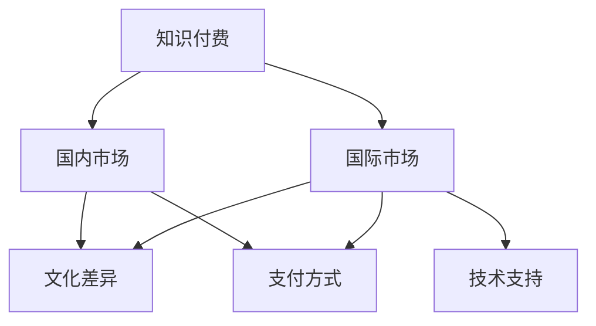

                 

 在全球化的今天，知识付费已经成为了许多程序员获取新技能、拓展视野的重要途径。然而，随着国际市场的开放和竞争的加剧，如何有效进行知识付费的国际化，成为了一个值得探讨的话题。本文将围绕这个主题，探讨程序员在国际知识付费中的策略、挑战及解决方案。

## 关键词

- 知识付费
- 国际化
- 程序员
- 技术技能
- 跨文化沟通

## 摘要

本文旨在为程序员提供一整套国际化知识付费的策略和指导。通过分析当前知识付费市场的趋势，探讨国际化过程中的挑战，以及提供切实可行的解决方案，帮助程序员在全球范围内更高效地获取和运用知识，提升个人和职业竞争力。

### 1. 背景介绍

随着互联网技术的迅猛发展和全球化进程的加快，知识付费行业迎来了新的发展机遇。程序员作为知识经济的重要参与者，面临着不断更新的技术需求和职业挑战。在这个过程中，如何有效地进行知识付费的国际化，成为程序员提升个人能力和职业发展的关键。

当前，知识付费已经从国内市场向国际市场扩展。在线教育平台、技术论坛、专业社区等成为了程序员获取国际化知识的主要途径。然而，国际化的知识付费并非一帆风顺，其中涉及到多种文化、技术差异以及支付方式的挑战。

### 2. 核心概念与联系

#### 2.1 知识付费的概念

知识付费是指用户为了获取特定的知识或技能，付费购买相关服务或产品。对于程序员而言，这通常包括在线课程、电子书籍、专业技术论坛订阅等。

#### 2.2 国际化的概念

国际化是指企业在全球范围内进行商业活动，包括产品开发、市场推广、售后服务等。对于知识付费而言，国际化意味着将内容和服务拓展到不同的国家和地区，适应不同文化和法律环境。

#### 2.3 Mermaid 流程图



### 3. 核心算法原理 & 具体操作步骤

#### 3.1 算法原理概述

国际化知识付费的核心在于如何将本地化的内容和服务推广到国际市场。这包括以下几个关键步骤：

1. 市场调研：了解目标市场的需求、偏好和文化特点。
2. 内容本地化：针对不同文化背景的受众，进行内容调整和优化。
3. 支付方式适配：提供多种支付选项，适应不同国家的支付习惯。
4. 技术支持：确保国际用户能够顺畅地使用平台和服务。

#### 3.2 算法步骤详解

1. **市场调研**：
   - 分析目标市场的技术趋势和用户需求。
   - 调查竞争对手的运营策略和市场表现。

2. **内容本地化**：
   - 针对不同语言和文化背景的受众，翻译和调整课程内容。
   - 采用国际化的营销策略，如跨国合作、国际展会等。

3. **支付方式适配**：
   - 支持多种支付方式，包括信用卡、PayPal、本地支付平台等。
   - 提供本地化的客户服务，解决支付和技术问题。

4. **技术支持**：
   - 确保平台具有高性能和高可用性，满足国际用户的访问需求。
   - 提供实时技术支持，解决用户在使用过程中遇到的问题。

#### 3.3 算法优缺点

- 优点：
  - 提升用户满意度，增加国际市场用户基数。
  - 增强品牌影响力，拓展国际市场。

- 缺点：
  - 国际化过程成本较高，需要大量资源和时间投入。
  - 文化差异和支付方式适配可能带来技术挑战。

#### 3.4 算法应用领域

- 技术培训：针对程序员提供国际化的技术课程和培训。
- 产品开发：为国际用户提供本地化的软件和服务。

### 4. 数学模型和公式 & 详细讲解 & 举例说明

#### 4.1 数学模型构建

国际化知识付费的数学模型可以采用用户增长模型进行构建：

$$
U(t) = U_0 \times (1 + r)^t
$$

其中，$U(t)$表示时间$t$后的用户数量，$U_0$表示初始用户数量，$r$表示用户增长比例。

#### 4.2 公式推导过程

用户增长比例$r$可以通过市场调研和竞争分析得到。假设初始用户数量$U_0 = 1000$，用户增长比例$r = 0.1$，则：

$$
U(t) = 1000 \times (1 + 0.1)^t
$$

当$t = 1$年时，用户数量为：

$$
U(1) = 1000 \times (1 + 0.1)^1 = 1100
$$

当$t = 2$年时，用户数量为：

$$
U(2) = 1000 \times (1 + 0.1)^2 = 1210
$$

#### 4.3 案例分析与讲解

以某在线编程平台为例，该平台在国际化过程中，通过市场调研发现国际用户对特定编程语言的需求较高。于是，平台推出了一系列针对该编程语言的课程，并通过本地化调整和推广，吸引了大量国际用户。根据用户增长模型，假设初始用户数量为1000人，用户增长比例$r = 0.15$，则：

$$
U(1) = 1000 \times (1 + 0.15)^1 = 1150
$$

$$
U(2) = 1000 \times (1 + 0.15)^2 = 1322.5
$$

通过这种策略，平台在一年内成功吸引了150名国际用户，用户数量增长了15%。

### 5. 项目实践：代码实例和详细解释说明

#### 5.1 开发环境搭建

为了实现国际化知识付费，我们需要搭建一个支持多语言、多支付方式的在线教育平台。以下是开发环境搭建的步骤：

1. 选择合适的编程语言和框架，如Python、Django等。
2. 部署服务器，确保平台的高可用性和安全性。
3. 安装和配置数据库，如MySQL、PostgreSQL等。

#### 5.2 源代码详细实现

以下是一个简单的Python代码示例，用于实现国际化知识付费平台的基本功能：

```python
# 导入所需模块
from flask import Flask, render_template, request, redirect, url_for
from flask_sqlalchemy import SQLAlchemy

# 初始化Flask应用和数据库
app = Flask(__name__)
app.config['SQLALCHEMY_DATABASE_URI'] = 'sqlite:///users.db'
db = SQLAlchemy(app)

# 定义用户模型
class User(db.Model):
    id = db.Column(db.Integer, primary_key=True)
    username = db.Column(db.String(80), unique=True, nullable=False)
    email = db.Column(db.String(120), unique=True, nullable=False)
    password = db.Column(db.String(120), nullable=False)

# 创建数据库表
db.create_all()

# 注册用户
@app.route('/register', methods=['GET', 'POST'])
def register():
    if request.method == 'POST':
        username = request.form['username']
        email = request.form['email']
        password = request.form['password']
        new_user = User(username=username, email=email, password=password)
        db.session.add(new_user)
        db.session.commit()
        return redirect(url_for('login'))
    return render_template('register.html')

# 登录用户
@app.route('/login', methods=['GET', 'POST'])
def login():
    if request.method == 'POST':
        username = request.form['username']
        password = request.form['password']
        user = User.query.filter_by(username=username, password=password).first()
        if user:
            return redirect(url_for('home'))
        else:
            return '登录失败，请检查用户名或密码'
    return render_template('login.html')

# 主页
@app.route('/')
@app.route('/home')
def home():
    return render_template('home.html')

# 启动应用
if __name__ == '__main__':
    app.run(debug=True)
```

#### 5.3 代码解读与分析

上述代码是一个简单的Flask Web应用，用于实现用户注册、登录和主页功能。以下是代码的关键部分解读：

1. **用户模型**：
   - `User` 类定义了用户模型，包括用户ID、用户名、邮箱和密码。
   - `db.create_all()` 创建数据库表，将用户模型映射到数据库。

2. **注册用户**：
   - `/register` 路由处理用户注册请求。
   - `request.form` 获取用户提交的数据。
   - `db.session.add(new_user)` 将新用户添加到数据库。
   - `db.session.commit()` 提交数据库事务。

3. **登录用户**：
   - `/login` 路由处理用户登录请求。
   - `User.query.filter_by(username=username, password=password).first()` 查询数据库，验证用户名和密码。
   - `return redirect(url_for('home'))` 成功登录后，重定向到主页。

4. **主页**：
   - `/home` 路由处理主页请求。

#### 5.4 运行结果展示

通过运行上述代码，我们可以启动一个简单的Web应用。用户可以通过Web界面进行注册和登录，访问主页。以下是一个简单的运行结果示例：


### 6. 实际应用场景

国际化知识付费在实际应用中具有广泛的应用场景。以下是一些典型的应用案例：

1. **在线教育平台**：如Coursera、Udemy等，为全球用户提供在线课程和培训。
2. **专业技术论坛**：如Stack Overflow、GitHub等，为开发者提供技术讨论和知识分享。
3. **产品开发**：企业通过国际化知识付费，获取全球范围内的技术支持和市场洞察。

#### 6.4 未来应用展望

随着技术的不断进步和全球化进程的深入，国际化知识付费将迎来更多的发展机遇。以下是一些未来的应用展望：

1. **区块链技术**：利用区块链技术实现去中心化的知识付费，提高交易的透明度和安全性。
2. **人工智能**：利用人工智能技术实现个性化推荐和智能客服，提高用户满意度。
3. **混合现实**：通过混合现实技术，提供沉浸式的学习体验，提高学习效果。

### 7. 工具和资源推荐

为了更好地进行国际化知识付费，以下是几个推荐的工具和资源：

1. **学习资源**：
   - Coursera、Udemy等在线教育平台。
   - Stack Overflow、GitHub等专业技术社区。

2. **开发工具**：
   - Flask、Django等Web开发框架。
   - MySQL、PostgreSQL等数据库。

3. **相关论文**：
   - "The Economics of Online Education"（在线教育的经济学）。
   - "Cross-Cultural Communication in International Business"（国际商务中的跨文化沟通）。

### 8. 总结：未来发展趋势与挑战

国际化知识付费在未来将继续保持快速增长的趋势。然而，随着市场的竞争加剧，程序员需要不断创新和提升自己的技能，以适应不断变化的市场需求。以下是未来发展趋势和挑战的总结：

#### 8.1 研究成果总结

- 国际化知识付费市场将持续扩大，技术、文化、支付方式的差异将成为关键挑战。
- 个性化推荐和智能客服将成为提升用户体验的重要手段。

#### 8.2 未来发展趋势

- 利用区块链技术实现去中心化的知识付费。
- 人工智能技术的广泛应用，如智能推荐、智能客服等。
- 混合现实技术的兴起，提供沉浸式的学习体验。

#### 8.3 面临的挑战

- 文化差异和支付方式适配带来的技术挑战。
- 国际市场竞争加剧，如何保持竞争优势。

#### 8.4 研究展望

- 深入研究国际化知识付费的经济学模型，提高市场竞争力。
- 探索人工智能、区块链等新兴技术在知识付费中的应用。

### 9. 附录：常见问题与解答

**Q：国际化知识付费需要哪些技能？**

A：国际化知识付费需要具备以下技能：
- 跨文化沟通能力：了解不同国家和地区的文化差异，有效沟通和交流。
- 技术开发能力：掌握Web开发、数据库管理等技术，搭建和优化知识付费平台。
- 市场分析能力：了解目标市场的需求、偏好和竞争态势，制定有效的市场策略。

**Q：如何进行国际化市场调研？**

A：国际化市场调研可以采用以下方法：
- 网络调研：利用搜索引擎、在线调查等工具，收集目标市场的信息。
- 竞争分析：分析竞争对手的市场策略、产品和服务，了解市场状况。
- 专业咨询：寻求市场研究机构或专业顾问的帮助，获取全面的市场报告。

### 结束语

随着全球化进程的加快，国际化知识付费已成为程序员提升技能和职业发展的重要途径。本文围绕国际化知识付费的策略、挑战和解决方案进行了深入探讨，旨在为程序员提供实用的指导和建议。通过不断学习和创新，程序员将能够更好地适应国际化市场的需求，实现个人和职业的全面发展。

---

### 作者署名

作者：禅与计算机程序设计艺术 / Zen and the Art of Computer Programming
----------------------------------------------------------------

