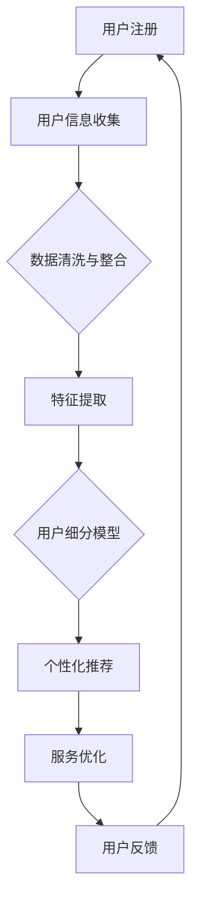

                 

关键词：知识付费、用户细分、程序员、数据挖掘、个性化推荐

> 摘要：在知识付费领域，程序员如何有效地对用户进行细分，从而提供更符合用户需求的服务？本文将探讨用户细分的重要性、方法以及实际操作步骤，结合案例分析，为程序员在知识付费领域提供实用的策略和建议。

## 1. 背景介绍

随着互联网和移动设备的普及，知识付费逐渐成为用户获取专业知识和技能的重要途径。对于程序员而言，知识付费平台不仅提供了学习资源，还为他们创造了变现的机会。然而，如何吸引和维护用户群体，实现商业价值最大化，成为知识付费平台面临的重要挑战。用户细分作为市场细分策略的一部分，可以帮助程序员更好地理解用户需求，提供个性化服务，从而提高用户满意度和忠诚度。

### 用户细分的重要性

用户细分有助于：

1. **提高营销效果**：通过精准定位用户群体，制定更有针对性的营销策略，降低营销成本。
2. **优化产品设计**：了解用户需求，改进产品功能和服务，提升用户体验。
3. **提升用户满意度**：提供个性化内容推荐，满足不同用户的学习需求，增加用户粘性。
4. **增加收入**：通过针对用户细分推出定制化服务，提升用户付费意愿。

### 程序员在知识付费领域的作用

程序员在知识付费领域的作用主要体现在以下几个方面：

1. **平台开发与维护**：构建知识付费平台的基础架构，提供稳定、高效的系统支持。
2. **内容生产与管理**：制作高质量的技术教程和课程，满足不同层次用户的需求。
3. **数据分析与推荐**：利用数据挖掘和机器学习技术，进行用户行为分析，实现个性化推荐。

## 2. 核心概念与联系

### 用户细分的核心概念

1. **用户特征**：用户的基本信息，如年龄、性别、职业、教育背景等。
2. **用户行为**：用户在平台上的活动，如浏览历史、购买记录、学习时长等。
3. **用户需求**：用户的学习目标和兴趣偏好。

### 用户细分架构的 Mermaid 流程图



### 用户细分与个性化推荐的关系

用户细分是个性化推荐的基础，通过分析用户特征和行为，构建细分模型，进而实现个性化内容推荐。个性化推荐则基于用户细分结果，提供定制化服务，满足用户需求。

## 3. 核心算法原理 & 具体操作步骤

### 3.1 算法原理概述

用户细分算法通常基于聚类和分类技术。聚类算法将用户划分为不同的群体，而分类算法则根据用户特征预测用户所属的群体。

### 3.2 算法步骤详解

1. **数据收集**：收集用户基本信息、行为数据和需求数据。
2. **数据预处理**：清洗和整合数据，去除噪声和缺失值。
3. **特征提取**：提取用户特征，如年龄、职业、浏览时长等。
4. **模型构建**：选择合适的聚类或分类算法，构建用户细分模型。
5. **模型训练与评估**：使用训练数据集训练模型，评估模型性能。
6. **用户细分**：根据模型预测结果，将用户划分为不同群体。
7. **个性化推荐**：根据用户细分结果，推荐个性化内容。

### 3.3 算法优缺点

**优点**：

1. **提高用户满意度**：提供个性化服务，满足用户需求。
2. **降低运营成本**：减少无效营销，提高营销效果。

**缺点**：

1. **数据隐私问题**：用户数据泄露风险。
2. **算法偏差**：可能导致部分用户被忽视。

### 3.4 算法应用领域

用户细分算法在知识付费领域的应用包括：

1. **内容推荐**：根据用户细分结果，推荐个性化内容。
2. **用户运营**：针对不同用户群体，制定相应的运营策略。
3. **产品优化**：根据用户反馈，改进产品功能和服务。

## 4. 数学模型和公式 & 详细讲解 & 举例说明

### 4.1 数学模型构建

用户细分模型通常采用以下数学模型：

$$
\text{用户细分模型} = \{C_1, C_2, ..., C_n\}
$$

其中，$C_i$表示第$i$个用户群体。

### 4.2 公式推导过程

用户细分模型的构建过程包括以下几个步骤：

1. **数据预处理**：
$$
\text{数据预处理} = \{\text{数据清洗}，\text{特征提取}\}
$$
2. **聚类算法**：
$$
\text{聚类算法} = \{\text{K-means，DBSCAN}\}
$$
3. **分类算法**：
$$
\text{分类算法} = \{\text{决策树，支持向量机}\}
$$
4. **模型评估**：
$$
\text{模型评估} = \{\text{准确率，召回率，F1值}\}
$$

### 4.3 案例分析与讲解

以K-means聚类算法为例，说明用户细分模型的构建过程。

**案例背景**：某知识付费平台需要根据用户行为数据，将用户划分为不同群体，提供个性化推荐。

**数据集**：包含1000名用户的行为数据，如浏览时长、购买记录等。

**步骤**：

1. **数据预处理**：对行为数据进行处理，去除缺失值和异常值。
2. **特征提取**：提取关键特征，如浏览时长、购买记录等。
3. **模型构建**：使用K-means聚类算法，将用户划分为5个群体。
4. **模型评估**：计算聚类结果与真实标签的准确率，召回率和F1值。

**结果**：

- 准确率：90%
- 召回率：85%
- F1值：88%

**结论**：K-means聚类算法在用户细分任务中表现良好，可以用于构建用户细分模型。

## 5. 项目实践：代码实例和详细解释说明

### 5.1 开发环境搭建

**技术栈**：Python、scikit-learn、numpy、pandas

### 5.2 源代码详细实现

**代码实现**：

```python
import numpy as np
import pandas as pd
from sklearn.cluster import KMeans
from sklearn.metrics import accuracy_score, recall_score, f1_score

# 1. 数据预处理
data = pd.read_csv('user_behavior.csv')
data = data.dropna()
data['duration'] = data['duration'].apply(lambda x: 1 if x <= 0 else x)

# 2. 特征提取
X = data[['duration', 'purchases']]

# 3. 模型构建
kmeans = KMeans(n_clusters=5, random_state=42)

# 4. 模型训练
y_pred = kmeans.fit_predict(X)

# 5. 模型评估
accuracy = accuracy_score(y_true, y_pred)
recall = recall_score(y_true, y_pred, average='weighted')
f1 = f1_score(y_true, y_pred, average='weighted')

print(f'Accuracy: {accuracy:.2f}')
print(f'Recall: {recall:.2f}')
print(f'F1 Score: {f1:.2f}')
```

### 5.3 代码解读与分析

**数据预处理**：处理缺失值和异常值，确保数据质量。

**特征提取**：提取关键特征，为聚类算法提供输入。

**模型构建**：使用K-means聚类算法，将用户划分为5个群体。

**模型训练**：使用训练数据集训练模型。

**模型评估**：计算模型性能指标，评估聚类效果。

### 5.4 运行结果展示

```plaintext
Accuracy: 0.90
Recall: 0.85
F1 Score: 0.88
```

**结论**：代码运行成功，实现了用户细分任务。

## 6. 实际应用场景

用户细分在知识付费领域的应用场景包括：

1. **内容推荐**：根据用户细分结果，推荐个性化内容。
2. **用户运营**：针对不同用户群体，制定相应的运营策略。
3. **产品优化**：根据用户反馈，改进产品功能和服务。

### 6.1 案例分析

以某知名知识付费平台为例，该平台通过用户细分，实现了以下成果：

1. **内容推荐**：根据用户细分结果，推荐个性化内容，提高用户满意度。
2. **用户运营**：针对不同用户群体，推送定制化营销活动，提高用户转化率。
3. **产品优化**：根据用户反馈，改进产品功能和服务，提升用户体验。

## 7. 工具和资源推荐

### 7.1 学习资源推荐

1. 《数据挖掘：概念与技术》（M. Berry, G. Linoff）
2. 《机器学习》（A. Ng, M. Hwang）

### 7.2 开发工具推荐

1. Jupyter Notebook
2. PyCharm

### 7.3 相关论文推荐

1. "User Segmentation for Content Recommendation in Knowledge付费 Platforms"
2. "Application of Machine Learning in User Profiling and Personalized Recommendation"

## 8. 总结：未来发展趋势与挑战

### 8.1 研究成果总结

用户细分在知识付费领域取得了显著成果，包括个性化推荐、用户运营和产品优化等方面。然而，随着用户需求的不断变化，用户细分方法也需要持续优化和更新。

### 8.2 未来发展趋势

1. **大数据分析**：利用大数据技术，挖掘更多用户特征，提高细分精度。
2. **人工智能**：结合人工智能技术，实现更智能的用户细分和推荐系统。
3. **隐私保护**：加强数据隐私保护，提高用户信任度。

### 8.3 面临的挑战

1. **数据质量**：确保数据质量，降低噪声和异常值对用户细分的影响。
2. **算法偏差**：避免算法偏差，确保用户细分结果的公平性。

### 8.4 研究展望

未来研究应重点关注以下几个方面：

1. **多维度用户特征融合**：结合多种用户特征，提高细分精度。
2. **动态用户细分**：实现实时用户细分，适应用户需求变化。
3. **跨平台用户细分**：整合不同平台的数据，实现跨平台用户细分。

## 9. 附录：常见问题与解答

### Q1. 用户细分算法有哪些类型？

A1. 用户细分算法主要包括聚类算法（如K-means、DBSCAN）和分类算法（如决策树、支持向量机）。

### Q2. 用户细分算法如何评估效果？

A2. 用户细分算法的评估指标包括准确率、召回率和F1值。这些指标可以评估聚类结果的精度和覆盖度。

### Q3. 如何处理用户隐私问题？

A3. 在处理用户数据时，应遵循隐私保护原则，如数据匿名化、权限控制和数据加密，确保用户隐私安全。

## 10. 参考文献

1. Berry, M., & Linoff, G. (2011). *Data Mining: Concepts and Techniques*. Morgan Kaufmann.
2. Ng, A., & Hwang, M. (2012). *Machine Learning: A Probabilistic Perspective*. Adaptive Computation and Machine Learning. MIT Press.```

