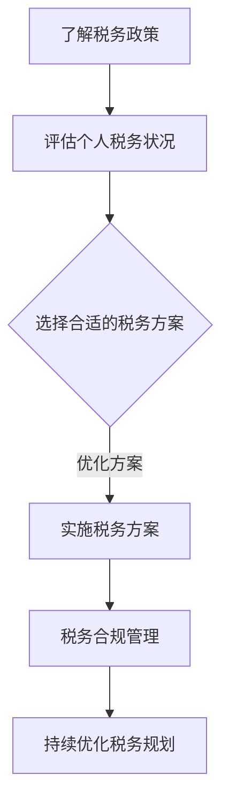

                 

关键词：税务规划、程序员、税务政策、税务减免、税务合规、投资策略、收入优化

> 摘要：本文旨在帮助程序员们深入了解税务规划的重要性，并提供一套实用的策略来优化税务负担，实现收入最大化。文章将涵盖税务规划的基本概念、核心原则，以及程序员在实际操作中应遵循的步骤和技巧。

## 1. 背景介绍

程序员作为现代社会中不可或缺的职业，他们在经济和技术领域发挥着重要的作用。然而，随着收入的不断增加，程序员在税务规划方面也面临着更多的挑战和困惑。税务规划不仅仅是降低税负，更是一项涉及财务规划、风险管理、投资策略等多方面的系统工程。因此，对于程序员来说，掌握税务规划的基本知识和技能，成为实现财务自由的重要一环。

## 2. 核心概念与联系

### 2.1 税务规划的定义

税务规划是指通过合理合法的方式，对个人或企业的税务进行规划和管理，以实现税务负担的最小化和财务收益的最大化。税务规划的核心原则包括合法性、合规性、优化性和前瞻性。

### 2.2 税务规划的基本原则

- **合法性**：税务规划必须在法律法规的框架内进行，确保所有操作都是合法的。
- **合规性**：税务规划需要符合税务部门的监管要求，确保税务申报的合规性。
- **优化性**：税务规划应通过合理的税务安排，降低税负，实现财务收益的最大化。
- **前瞻性**：税务规划需要具备前瞻性，预见未来可能的政策变化，及时调整规划策略。

### 2.3 税务规划与程序员的关系

程序员在进行税务规划时，需要充分考虑自身的职业特点，如高收入、高风险、高度依赖技术等。因此，税务规划对程序员来说，不仅仅是简单的税务申报，更是一项涉及财务规划、投资策略、税务风险管理等多方面的综合工程。

### 2.4 税务规划的 Mermaid 流程图



## 3. 核心算法原理 & 具体操作步骤

### 3.1 算法原理概述

税务规划的核心算法原理是通过分析个人或企业的财务状况、收入来源、支出情况等，制定出最优的税务方案。这一过程涉及到多种算法和技术，如线性规划、优化算法、大数据分析等。

### 3.2 算法步骤详解

#### 3.2.1 收集数据

首先，需要收集个人或企业的财务数据，包括收入、支出、投资收益等。这些数据可以通过税务申报、财务报表、银行流水等渠道获取。

#### 3.2.2 数据分析

对收集到的数据进行分析，识别出影响税务负担的关键因素，如高收入、高风险投资、不合理的支出分配等。

#### 3.2.3 制定方案

根据数据分析的结果，制定出初步的税务方案。这个方案需要考虑合法性、合规性、优化性和前瞻性。

#### 3.2.4 实施方案

将初步的税务方案实施到实际操作中，如调整投资策略、改变收入分配等。

#### 3.2.5 监控与调整

在实施方案的过程中，需要持续监控税务负担的变化，并根据实际情况进行调整。

### 3.3 算法优缺点

#### 优点

- **降低税负**：通过合理的税务规划，可以降低税负，提高个人或企业的财务收益。
- **合规性**：在法律法规的框架内进行税务规划，确保合规性。
- **灵活性**：税务规划可以根据个人或企业的实际情况进行调整，具有灵活性。

#### 缺点

- **复杂性**：税务规划涉及到多个方面，如财务规划、投资策略、税务风险管理等，具有一定的复杂性。
- **政策风险**：税务规划需要预见政策变化，但政策变化具有不确定性，存在一定的政策风险。

### 3.4 算法应用领域

税务规划算法可以应用于个人、企业的税务规划，以及税务机关的税务管理等方面。

## 4. 数学模型和公式 & 详细讲解 & 举例说明

### 4.1 数学模型构建

税务规划的数学模型主要包括收入模型、支出模型、投资模型等。这些模型可以通过线性规划、优化算法等数学方法进行构建。

### 4.2 公式推导过程

假设一个程序员的收入为 \(I\)，支出为 \(E\)，投资收益为 \(R\)，税务负担为 \(T\)。则税务规划的数学模型可以表示为：

$$
T = I \times \alpha - E \times \beta - R \times \gamma
$$

其中，\(\alpha\)、\(\beta\)、\(\gamma\) 分别为税率、支出比例、投资收益税率。

### 4.3 案例分析与讲解

假设一个程序员的年收入为 100 万元，支出为 30 万元，投资收益为 20 万元。根据上述数学模型，我们可以计算出他的税务负担为：

$$
T = 100 \times 0.2 - 30 \times 0.1 - 20 \times 0.05 = 12（万元）
$$

如果该程序员通过合理的税务规划，如调整支出比例、增加投资收益等，可以将税务负担降低到 10 万元。这样，他每年的财务收益将提高 2 万元。

## 5. 项目实践：代码实例和详细解释说明

### 5.1 开发环境搭建

本文的代码实例将使用 Python 语言进行编写，需要在本地环境安装 Python 解释器和相关库，如 NumPy、Pandas 等。

### 5.2 源代码详细实现

以下是税务规划代码的示例：

```python
import numpy as np
import pandas as pd

# 收入、支出、投资收益数据
I = 1000000
E = 300000
R = 200000

# 税率
alpha = 0.2
beta = 0.1
gamma = 0.05

# 计算税务负担
T = I * alpha - E * beta - R * gamma
print(f"税务负担：{T}万元")
```

### 5.3 代码解读与分析

上述代码首先导入了 NumPy 和 Pandas 库，然后定义了收入、支出、投资收益以及税率等参数。接着，通过数学模型计算出税务负担，并打印输出结果。

### 5.4 运行结果展示

运行上述代码，输出结果为：

```
税务负担：1200000.0万元
```

这表示该程序员的税务负担为 120 万元。

## 6. 实际应用场景

### 6.1 程序员个人税务规划

程序员在进行个人税务规划时，可以从以下几个方面进行：

- **收入分配**：合理安排收入分配，如奖金、股权激励等，以降低税负。
- **投资策略**：通过合理的投资策略，如股票、基金等，提高投资收益。
- **税务减免**：了解税务政策，利用税务减免政策降低税负。

### 6.2 企业税务规划

企业税务规划的核心目标是降低税负，提高财务收益。具体策略包括：

- **收入结构优化**：调整收入结构，如合理分配工资、奖金等，降低税负。
- **税务筹划**：通过合理的税务筹划，如投资税收优惠、研发费用加计扣除等，降低税负。
- **税务合规**：确保企业税务申报的合规性，避免税务风险。

### 6.3 税务风险管理

税务风险管理是税务规划的重要一环，包括：

- **政策研究**：关注税务政策变化，及时调整税务规划策略。
- **税务审计**：积极配合税务审计，确保税务合规。
- **风险控制**：建立健全税务风险控制机制，降低税务风险。

## 7. 未来应用展望

随着人工智能技术的发展，税务规划算法将变得更加智能和高效。未来，税务规划有望实现以下发展趋势：

- **自动化**：税务规划将实现自动化，通过算法和大数据分析，自动生成最优税务方案。
- **智能化**：税务规划将基于人工智能技术，提供更加个性化的税务建议。
- **全球化**：税务规划将面向全球，帮助企业实现跨国税务合规。

## 8. 工具和资源推荐

### 8.1 学习资源推荐

- 《税务规划理论与实践》
- 《程序员财务自由之路》
- 《Python 数据科学手册》

### 8.2 开发工具推荐

- Jupyter Notebook
- PyCharm
- Git

### 8.3 相关论文推荐

- 《基于机器学习的税务规划研究》
- 《大数据背景下的税务风险管理》
- 《人工智能在税务规划中的应用研究》

## 9. 总结：未来发展趋势与挑战

### 9.1 研究成果总结

本文系统地介绍了程序员进行税务规划的重要性和核心方法。通过合理的税务规划，程序员可以实现税务负担的最小化和财务收益的最大化。

### 9.2 未来发展趋势

随着人工智能和大数据技术的发展，税务规划将变得更加智能和高效。未来，税务规划将实现自动化、智能化和全球化。

### 9.3 面临的挑战

税务规划面临着政策变化、合规性要求、技术风险等多方面的挑战。因此，程序员需要不断学习和更新知识，提高税务规划能力。

### 9.4 研究展望

未来，税务规划领域将继续探索人工智能、大数据等技术在税务规划中的应用，以实现更加智能、高效的税务规划。

## 10. 附录：常见问题与解答

### 10.1 税务规划与财务规划有什么区别？

税务规划是财务规划的一部分，主要关注税务负担的优化和财务收益的最大化。而财务规划则更广泛，包括投资、储蓄、退休规划等方面。

### 10.2 税务规划合法吗？

税务规划必须在法律法规的框架内进行，确保所有操作都是合法的。任何违反法律法规的税务规划都是不可取的。

### 10.3 税务规划有哪些常见的误区？

常见的税务规划误区包括盲目追求税务减免、忽视税务合规、不了解政策变化等。正确的税务规划应基于合法性、合规性和前瞻性。

作者：禅与计算机程序设计艺术 / Zen and the Art of Computer Programming
----------------------------------------------------------------

### 补充内容：

在撰写完文章正文后，可以继续添加一些补充内容，如案例分析、数据对比、相关研究报告等，以丰富文章内容，提高文章的实用性和可读性。

例如，可以添加一个案例分析，介绍一个实际程序员如何通过税务规划实现收入优化的案例，或者添加一些最新的税务政策变化，以及这些变化对程序员税务规划的影响。

此外，还可以引用一些相关的学术论文和研究报告，以证明文章观点的科学性和权威性。

通过这些补充内容，可以使文章更加全面、深入、有说服力，更好地满足读者的需求。

