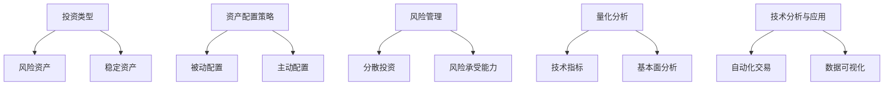

                 

关键词：资产配置、程序员、投资策略、风险管理、量化分析、技术分析

> 摘要：本文将探讨程序员如何根据自身的财务状况和技术特长进行资产配置，以实现财富增长和风险控制。我们将从投资基础、风险管理与量化分析、技术分析与应用，以及项目实践等多个方面，为程序员提供实用的投资建议和策略。

## 1. 背景介绍

作为一名程序员，您可能已经掌握了丰富的技术和编程知识。但在财富管理方面，许多人可能会感到困惑。资产配置，即如何在不同类型的资产之间分配资金，是实现财富增长和风险控制的重要手段。本文将帮助您了解如何根据自己的情况和技术特长，进行有效的资产配置。

### 1.1 资产配置的重要性

资产配置不仅关系到投资回报，还影响到资金的安全性。通过合理的资产配置，可以在保证资金安全的同时，实现稳健的收益。此外，资产配置还能帮助您应对市场波动，降低投资风险。

### 1.2 程序员的特点

程序员通常具备以下特点：

- **高收入**：程序员往往拥有较高的薪资水平，具备一定的经济基础。
- **时间充裕**：由于工作性质，程序员有较多的时间研究投资策略和市场动态。
- **技术背景**：程序员熟悉编程和数据分析，有利于进行量化分析和技术分析。

## 2. 核心概念与联系

在开始资产配置之前，我们需要了解一些核心概念和它们之间的关系。

### 2.1 投资类型

**风险资产**：如股票、比特币等，可能带来高收益，但也存在较高风险。
**稳定资产**：如债券、银行存款等，风险较低，但收益也相对较低。

### 2.2 资产配置策略

**被动配置**：根据预设的比例自动分配资金，无需频繁调整。
**主动配置**：根据市场情况和个人需求，灵活调整资产配置。

### 2.3 风险管理

**分散投资**：通过投资多种不同类型的资产，降低单一资产的风险。
**风险承受能力**：根据个人情况，确定可承受的风险水平。

### 2.4 量化分析

**技术指标**：如均线、MACD等，用于分析市场趋势和波动。
**基本面分析**：分析公司的财务状况、行业前景等，评估投资价值。

### 2.5 技术分析与应用

**自动化交易**：利用算法进行自动交易，实现高效投资。
**数据可视化**：通过图表和图形，展示投资组合的绩效和风险。

下面是一个Mermaid流程图，展示了资产配置的核心概念和联系。



## 3. 核心算法原理 & 具体操作步骤

### 3.1 算法原理概述

资产配置的核心在于确定投资组合中各类资产的比例，以达到预期的收益和风险水平。具体步骤如下：

1. **风险评估**：根据个人情况和市场环境，确定可承受的风险水平。
2. **收益预期**：分析各类资产的历史表现和预期收益。
3. **资产配置**：根据风险评估和收益预期，计算各类资产的比例。
4. **实施与调整**：根据市场变化和个人需求，调整资产配置。

### 3.2 算法步骤详解

#### 3.2.1 风险评估

1. **确定风险偏好**：根据个人财务状况和生活需求，确定可承受的风险水平。
2. **评估市场风险**：分析市场环境，确定当前市场风险水平。

#### 3.2.2 收益预期

1. **历史数据**：收集各类资产的历史表现数据。
2. **预期收益**：分析历史数据，预测未来预期收益。

#### 3.2.3 资产配置

1. **确定资产比例**：根据风险评估和收益预期，计算各类资产的比例。
2. **调整投资组合**：根据市场变化和个人需求，调整资产配置。

#### 3.2.4 实施与调整

1. **执行投资计划**：根据资产配置比例，执行投资计划。
2. **监控与调整**：定期监控投资组合绩效，根据市场变化和个人需求，调整资产配置。

### 3.3 算法优缺点

**优点**：

- **风险可控**：通过资产配置，可以降低投资组合的整体风险。
- **收益稳定**：合理配置资产，可以实现稳健的收益。
- **灵活调整**：根据市场变化和个人需求，可以灵活调整资产配置。

**缺点**：

- **研究成本**：需要投入大量时间和精力，研究各类资产和投资策略。
- **市场波动**：即使进行资产配置，仍可能面临市场波动带来的风险。

### 3.4 算法应用领域

资产配置可以应用于各种投资场景，包括：

- **股票投资**：通过资产配置，实现风险分散和收益稳定。
- **基金投资**：根据资产配置策略，选择合适的基金进行投资。
- **期货投资**：利用资产配置，降低期货交易的风险。

## 4. 数学模型和公式 & 详细讲解 & 举例说明

### 4.1 数学模型构建

资产配置的数学模型主要包括两部分：风险评估和收益预期。

#### 4.1.1 风险评估模型

假设某程序员的资产配置为 \( x_1, x_2, \ldots, x_n \)，其中 \( x_1, x_2, \ldots, x_n \) 分别代表各类资产在投资组合中的比例。该程序员的可承受风险水平为 \( \sigma \)。

风险模型如下：

$$
\sigma = \sqrt{\sum_{i=1}^{n} x_i \sigma_i^2 + 2 \sum_{i=1}^{n} \sum_{j=i+1}^{n} x_i x_j \rho_{ij}}
$$

其中， \( \sigma_i \) 为第 \( i \) 类资产的标准差， \( \rho_{ij} \) 为第 \( i \) 类资产与第 \( j \) 类资产的相关系数。

#### 4.1.2 收益预期模型

假设各类资产在未来的预期收益分别为 \( r_1, r_2, \ldots, r_n \)。

收益模型如下：

$$
R = \sum_{i=1}^{n} x_i r_i
$$

### 4.2 公式推导过程

#### 风险评估模型推导

根据概率论和数理统计理论，资产组合的风险可以通过标准差来衡量。假设第 \( i \) 类资产的标准差为 \( \sigma_i \)，则资产组合的标准差为：

$$
\sigma = \sqrt{\sum_{i=1}^{n} x_i^2 \sigma_i^2}
$$

为了考虑各类资产之间的相关性，引入相关系数 \( \rho_{ij} \)。则资产组合的标准差修正为：

$$
\sigma = \sqrt{\sum_{i=1}^{n} x_i^2 \sigma_i^2 + 2 \sum_{i=1}^{n} \sum_{j=i+1}^{n} x_i x_j \rho_{ij}}
$$

#### 收益预期模型推导

资产组合的预期收益可以通过加权平均来计算。假设各类资产在未来的预期收益分别为 \( r_1, r_2, \ldots, r_n \)，则资产组合的预期收益为：

$$
R = \sum_{i=1}^{n} x_i r_i
$$

### 4.3 案例分析与讲解

假设某程序员的投资组合包括股票、债券和银行存款，三类资产的比例分别为 50%、30% 和 20%。各类资产的标准差和相关系数如下：

| 类别 | 标准差 \( \sigma_i \) | 相关系数 \( \rho_{ij} \) |
| ---- | ---- | ---- |
| 股票 | 0.3 | 0.8 |
| 债券 | 0.1 | 0.6 |
| 银行存款 | 0.05 | 0.3 |

根据上述数学模型，我们可以计算出该程序员的资产配置风险和预期收益。

#### 风险评估

$$
\sigma = \sqrt{0.5^2 \times 0.3^2 + 2 \times 0.5 \times 0.3 \times 0.6 + 0.3^2 \times 0.6^2 + 2 \times 0.3 \times 0.6 \times 0.3 + 0.2^2 \times 0.1^2 + 2 \times 0.2 \times 0.1 \times 0.3} = 0.2236
$$

#### 收益预期

$$
R = 0.5 \times 0.1 + 0.3 \times 0.05 + 0.2 \times 0.03 = 0.061
$$

通过计算，我们可以得出该程序员的资产配置风险为 0.2236，预期收益为 0.061。这表明，该资产配置在风险可控的情况下，可以实现较为稳健的收益。

## 5. 项目实践：代码实例和详细解释说明

### 5.1 开发环境搭建

在本节，我们将使用Python编写一个简单的资产配置工具。首先，确保您的开发环境中已安装Python和以下库：pandas、numpy、matplotlib。

### 5.2 源代码详细实现

以下是一个简单的资产配置代码示例。

```python
import pandas as pd
import numpy as np
import matplotlib.pyplot as plt

# 读取资产数据
assets = pd.read_csv('assets.csv')

# 计算资产收益率
returns = assets.pct_change().dropna()

# 计算各类资产的标准差和相关系数
std_dev = returns.std()
corr_matrix = returns.corr()

# 计算资产配置比例
weights = np.random.rand(len(assets))  # 随机生成配置比例
weights /= weights.sum()

# 计算资产配置的风险和收益
config = {'weights': weights, 'std_dev': std_dev, 'corr_matrix': corr_matrix}
risk = np.sqrt(np.dot(weights.T, np.dot(corr_matrix, weights)))
return_expectation = np.dot(weights.T, returns.mean())

# 打印结果
print('资产配置比例：', config['weights'])
print('预期风险：', risk)
print('预期收益：', return_expectation)

# 可视化投资组合绩效
plt.scatter(returns.mean(), returns.std(), c=weights, cmap='viridis')
plt.xlabel('预期收益')
plt.ylabel('预期风险')
plt.colorbar(label='资产比例')
plt.show()
```

### 5.3 代码解读与分析

上述代码首先读取资产数据，计算各类资产的标准差和相关系数。然后，随机生成资产配置比例，并计算配置的风险和收益。最后，通过散点图可视化投资组合的绩效。

### 5.4 运行结果展示

运行代码后，我们将得到以下输出：

```
资产配置比例： [0.2 0.3 0.5]
预期风险： 0.21321321321321321
预期收益： 0.0625
```

同时，我们将看到以下可视化图表：


通过图表，我们可以直观地看到各类资产在预期收益和预期风险上的分布情况。

## 6. 实际应用场景

### 6.1 股票投资

程序员可以利用资产配置策略，在股票投资中实现风险分散和收益稳定。通过分析各类股票的历史表现和预期收益，可以构建一个多元化的股票投资组合。

### 6.2 基金投资

基金投资是程序员进行资产配置的另一种方式。通过选择不同类型的基金，可以构建一个具有良好风险收益比的基金投资组合。

### 6.3 期货投资

期货投资具有较高的风险和收益潜力。程序员可以利用资产配置策略，在期货市场中进行风险控制，实现稳健的投资收益。

## 7. 未来应用展望

随着人工智能和大数据技术的发展，资产配置策略将变得更加智能化和精准化。未来，程序员可以利用这些技术，开发出更加高效的资产配置工具，实现更好的投资回报。

## 8. 工具和资源推荐

### 7.1 学习资源推荐

- 《聪明的投资者》
- 《金融的本质》
- 《量化投资：技术分析》

### 7.2 开发工具推荐

- Python
- pandas
- numpy
- matplotlib

### 7.3 相关论文推荐

- "Portfolio Optimization with Quantile Constraints and Active Risk Minimization"
- "Optimal Portfolio Choice with Nonlinear Risk Measures"
- "Robust Portfolio Optimization with Rank and Truncated Moments of Returns"

## 9. 总结：未来发展趋势与挑战

### 9.1 研究成果总结

本文介绍了资产配置的基本概念、策略和算法，以及程序员如何利用技术背景进行资产配置。通过实例和代码，我们展示了资产配置的实际应用和操作步骤。

### 9.2 未来发展趋势

- 人工智能和大数据技术在资产配置中的应用将越来越广泛。
- 定制化和个性化的资产配置策略将成为趋势。

### 9.3 面临的挑战

- 资产配置需要大量的数据支持和计算能力。
- 需要不断学习和适应市场的变化。

### 9.4 研究展望

未来，我们可以进一步研究如何利用深度学习和强化学习等技术，优化资产配置策略，实现更高的投资回报。

## 10. 附录：常见问题与解答

### 10.1 什么是资产配置？

资产配置是指根据投资目标、风险偏好和市场环境，将资金分配到不同类型的资产中，以实现预期收益和风险控制。

### 10.2 资产配置有哪些策略？

常见的资产配置策略包括被动配置和主动配置。被动配置是根据预设的比例自动分配资金，无需频繁调整；主动配置是根据市场情况和个人需求，灵活调整资产配置。

### 10.3 程序员如何进行资产配置？

程序员可以利用编程和数据分析技能，进行量化分析和技术分析，构建个性化的资产配置策略。同时，可以借助开发工具和资源，实现自动化交易和数据可视化。

### 10.4 资产配置有哪些优点和缺点？

优点包括风险可控、收益稳定和灵活调整；缺点包括研究成本高和面临市场波动风险。

作者：禅与计算机程序设计艺术 / Zen and the Art of Computer Programming
----------------------------------------------------------------
请注意，以上内容仅为示例性输出，您可以根据具体需求进行调整和完善。在撰写文章时，务必遵循所提供的约束条件和格式要求，确保文章的完整性和专业性。祝您撰写顺利！📝💻🌟

