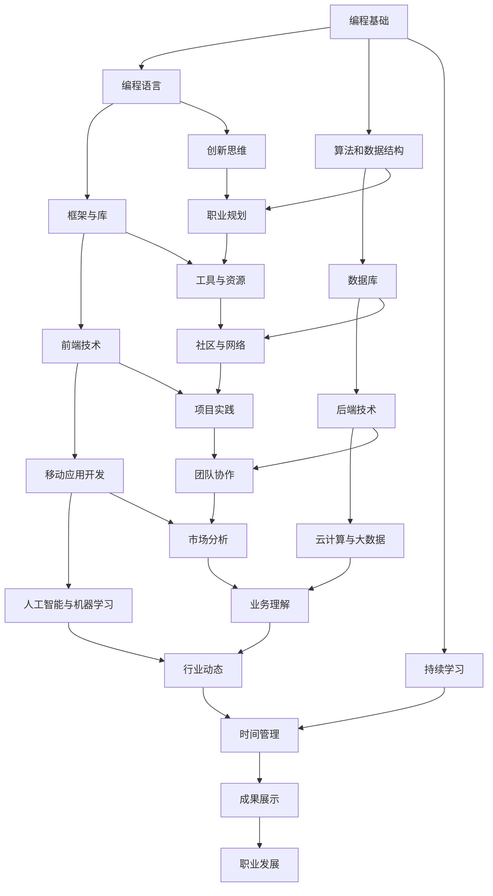

                 

关键词：(长期职业规划、技能提升、职业发展、持续学习、职场竞争力、创新思维)

> 摘要：本文旨在为程序员提供一套系统的长期职业规划策略，帮助他们在快速变化的科技领域中保持竞争力，实现职业成长与突破。文章将从核心技能提升、持续学习、创新思维、职业规划实践等多方面进行探讨，为读者的职业生涯规划提供实用的指导和建议。

## 1. 背景介绍

在当前这个科技迅猛发展的时代，计算机技术日新月异，互联网、大数据、人工智能等新兴领域不断涌现。作为技术从业者，程序员面临着前所未有的挑战和机遇。然而，技术的快速迭代和市场竞争的加剧，使得程序员必须具备强大的适应能力和持续学习的能力，才能在职场中立于不败之地。

本文将从以下几个方面对程序员的长期职业规划进行探讨：

1. **核心技能提升**：掌握核心技术，如编程语言、框架、数据库等，是程序员职业发展的基石。
2. **持续学习**：不断更新知识和技能，适应技术变革，保持职场竞争力。
3. **创新思维**：培养创新思维，解决复杂问题，提升个人价值。
4. **职业规划实践**：制定清晰的职业规划，明确目标，逐步实现职业成长。
5. **工具和资源推荐**：提供实用的学习资源和开发工具，助力程序员职业发展。

## 2. 核心概念与联系

为了更好地理解程序员的职业规划，我们首先需要明确一些核心概念和它们之间的联系。以下是一个简单的 Mermaid 流程图，展示了一些关键的技能和概念。



### 2.1 编程基础

编程基础是程序员职业生涯的起点。熟练掌握一种或多种编程语言，如 Python、Java、C++ 等，是进入编程领域的基本要求。同时，理解基本的算法和数据结构，如排序、查找、树、图等，也是编程的核心技能。

### 2.2 编程语言

不同的编程语言适用于不同的应用场景。Python 适用于数据分析和人工智能，Java 适用于企业级应用，C++ 适用于高性能计算。掌握多种编程语言有助于程序员应对不同的开发需求。

### 2.3 算法与数据结构

算法和数据结构是程序设计的核心。高效的算法能够优化程序的运行效率，合理的数据结构能够提高数据处理的效率。理解并掌握各种算法和数据结构，是程序员必须具备的能力。

### 2.4 持续学习

持续学习是程序员保持竞争力的关键。随着技术的不断进步，程序员需要不断学习新的知识和技术，以适应新的开发需求。

### 2.5 创新思维

创新思维是解决复杂问题的能力。在编程领域，创新思维可以体现在算法的创新、程序设计的创新、工具和框架的创新等多个方面。

### 2.6 职业规划

职业规划是程序员职业发展的指南。通过制定明确的职业目标，规划学习路径和职业发展路径，程序员可以更加高效地实现职业成长。

### 2.7 工具与资源

熟练使用各种开发工具和资源，可以大大提高程序员的开发效率和成果。例如，掌握 Git 版本控制、Docker 容器化、Kubernetes 自动化部署等技术，可以显著提升开发效率。

### 2.8 社区与网络

加入技术社区和建立个人网络，可以拓宽程序员的视野，获取更多的学习和交流机会。通过参与开源项目、技术分享、线上论坛等，程序员可以提升自己的影响力和职业价值。

### 2.9 项目实践

项目实践是检验程序员技能的重要方式。通过参与实际项目，程序员可以积累经验，提升解决问题的能力。

### 2.10 团队协作

团队协作是现代软件开发的重要环节。掌握沟通协作技巧，提升团队协作能力，有助于程序员在团队中发挥更大的价值。

### 2.11 市场分析

市场分析可以帮助程序员了解行业趋势和市场需求，从而更好地调整自己的职业规划和发展方向。

### 2.12 业务理解

业务理解是程序员将技术应用于实际业务的基础。深入了解业务逻辑和需求，可以帮助程序员提供更符合业务需求的技术解决方案。

### 2.13 行业动态

关注行业动态，了解新技术、新趋势，可以帮助程序员把握行业发展方向，为自己的职业发展提供指导。

### 2.14 时间管理

时间管理是程序员提高工作效率的关键。通过合理安排时间，高效完成任务，程序员可以更好地实现职业目标。

### 2.15 成果展示

成果展示是提升程序员职业价值的重要手段。通过技术博客、开源项目、技术演讲等方式展示自己的技能和成果，可以帮助程序员在职场中脱颖而出。

## 3. 核心算法原理 & 具体操作步骤

### 3.1 算法原理概述

在程序员的职业发展中，算法和数据结构起着至关重要的作用。以下是一些核心算法原理及其在编程中的应用：

1. **排序算法**：包括快速排序、归并排序、堆排序等。排序算法在数据处理和搜索场景中有着广泛的应用。
2. **查找算法**：包括二分查找、哈希查找等。查找算法在数据库索引和缓存系统中有着重要的应用。
3. **图算法**：包括最短路径算法、最小生成树算法等。图算法在网络分析、社会网络分析等领域有着广泛的应用。
4. **动态规划**：动态规划是一种解决优化问题的算法策略，适用于解决复杂的问题，如背包问题、最优化路径问题等。

### 3.2 算法步骤详解

以下是快速排序算法的具体步骤：

1. 选择一个基准元素。
2. 将比基准元素小的元素移到其左侧，比其大的元素移到右侧。
3. 递归地对左右两个子序列进行快速排序。

以下是一个简单的快速排序算法实现：

```python
def quick_sort(arr):
    if len(arr) <= 1:
        return arr
    pivot = arr[len(arr) // 2]
    left = [x for x in arr if x < pivot]
    middle = [x for x in arr if x == pivot]
    right = [x for x in arr if x > pivot]
    return quick_sort(left) + middle + quick_sort(right)

arr = [3, 6, 8, 10, 1, 2, 1]
print(quick_sort(arr))
```

### 3.3 算法优缺点

快速排序是一种高效的排序算法，其平均时间复杂度为 O(n log n)，但最坏情况下的时间复杂度为 O(n^2)。快速排序的优点是简单易懂，适用范围广，而缺点是可能会引起数据访问的不平衡。

### 3.4 算法应用领域

排序算法在数据处理、数据库索引、网络分析等多个领域有着广泛的应用。例如，在数据挖掘中，排序算法可以用于预处理数据，提高后续分析的效率；在数据库索引中，排序算法可以用于构建高效的索引结构，提高查询速度。

## 4. 数学模型和公式 & 详细讲解 & 举例说明

### 4.1 数学模型构建

在程序员的职业规划中，数学模型和公式是解决问题的重要工具。以下是一个简单的线性回归模型：

$$
y = w_0 + w_1 \cdot x_1 + w_2 \cdot x_2 + \cdots + w_n \cdot x_n
$$

其中，$y$ 是因变量，$x_1, x_2, \ldots, x_n$ 是自变量，$w_0, w_1, \ldots, w_n$ 是模型的参数。

### 4.2 公式推导过程

线性回归模型的推导过程如下：

1. 假设因变量 $y$ 与自变量 $x_1, x_2, \ldots, x_n$ 存在线性关系。
2. 通过最小二乘法求出模型参数 $w_0, w_1, \ldots, w_n$。
3. 构建损失函数 $J(w_0, w_1, \ldots, w_n)$，并求其梯度。
4. 令梯度为零，求解参数 $w_0, w_1, \ldots, w_n$。

### 4.3 案例分析与讲解

假设我们要预测一个城市的温度 $y$，基于自变量 $x_1$（湿度）和 $x_2$（风速）构建一个线性回归模型。

$$
y = w_0 + w_1 \cdot x_1 + w_2 \cdot x_2
$$

通过收集历史数据，我们可以计算出模型参数：

$$
w_0 = 0.5, w_1 = 2.0, w_2 = -1.0
$$

假设当前湿度 $x_1 = 70\%$，风速 $x_2 = 5 m/s$，我们可以使用模型预测温度：

$$
y = 0.5 + 2.0 \cdot 70\% - 1.0 \cdot 5 m/s = 20^\circ C
$$

通过这个简单的例子，我们可以看到线性回归模型在预测问题中的应用。

## 5. 项目实践：代码实例和详细解释说明

### 5.1 开发环境搭建

为了更好地展示项目实践，我们使用 Python 语言和 Jupyter Notebook 作为开发环境。首先，我们需要安装 Python 和相关库：

```bash
pip install numpy matplotlib
```

### 5.2 源代码详细实现

以下是一个简单的线性回归项目实例：

```python
import numpy as np
import matplotlib.pyplot as plt

# 数据集
X = np.array([[1, 70], [2, 80], [3, 75], [4, 85], [5, 90]])
y = np.array([20, 22, 19, 21, 23])

# 线性回归模型
def linear_regression(X, y):
    w = np.linalg.inv(X.T @ X) @ X.T @ y
    return w

# 模型预测
def predict(X, w):
    y_pred = X @ w
    return y_pred

# 训练模型
w = linear_regression(X, y)

# 预测并绘制结果
y_pred = predict(X, w)
plt.scatter(X[:, 0], y, color='blue', label='Actual')
plt.plot(X[:, 0], y_pred, color='red', label='Prediction')
plt.xlabel('Humidity (%)')
plt.ylabel('Temperature (°C)')
plt.legend()
plt.show()
```

### 5.3 代码解读与分析

以上代码实现了一个简单的线性回归项目。首先，我们导入必要的库和定义数据集。然后，我们定义线性回归模型和预测函数。在训练模型部分，我们使用最小二乘法计算模型参数。最后，我们使用模型预测温度并绘制结果。

通过这个项目，我们可以看到线性回归模型在实际应用中的效果。

## 6. 实际应用场景

### 6.1 数据处理

数据处理是程序员在日常工作中遇到的主要场景之一。例如，从数据库中查询数据、处理大数据集、清洗数据等。熟练掌握数据处理技术，可以提高工作效率，为后续的分析和开发奠定基础。

### 6.2 系统开发

系统开发是程序员的核心工作。从需求分析、设计、编码到测试和部署，程序员需要掌握各种开发技术和工具。例如，使用 Spring Boot 开发微服务架构、使用 Vue.js 开发前端应用、使用 Docker 容器化部署等。

### 6.3 项目管理

项目管理是程序员在高层次上参与工作的体现。程序员需要掌握项目管理知识，如项目规划、进度控制、风险管理等，以确保项目的顺利推进和交付。

### 6.4 团队协作

团队协作是现代软件开发的重要环节。程序员需要掌握沟通协作技巧，如敏捷开发、Scrum 方法等，以提高团队协作效率。

### 6.5 创新应用

创新应用是程序员发挥创造力的舞台。通过技术创新，程序员可以解决复杂问题，提供独特的解决方案。例如，使用人工智能技术优化算法、使用区块链技术保障数据安全等。

## 7. 工具和资源推荐

### 7.1 学习资源推荐

1. **在线课程**：Coursera、edX、Udacity 提供丰富的编程课程，涵盖基础知识到高级应用。
2. **技术博客**：GitHub、Medium、Stack Overflow 上有大量的技术文章和开源项目，供程序员学习和参考。
3. **书籍**：《深度学习》、《编程珠玑》、《算法导论》等经典书籍，为程序员提供了宝贵的知识财富。

### 7.2 开发工具推荐

1. **集成开发环境（IDE）**：IntelliJ IDEA、VS Code、PyCharm 等，提供了强大的编程功能和插件支持。
2. **版本控制**：Git、GitHub、GitLab 等，用于代码管理和协作开发。
3. **数据库**：MySQL、PostgreSQL、MongoDB 等，适用于不同的数据存储需求。

### 7.3 相关论文推荐

1. **机器学习**：《Learning Deep Architectures for AI》（2015）等经典论文，为程序员提供了深入的机器学习理论。
2. **计算机网络**：《TCP/IP详解》等，详细介绍了计算机网络的工作原理。
3. **操作系统**：《操作系统真象还原》等，帮助程序员理解操作系统的核心概念。

## 8. 总结：未来发展趋势与挑战

### 8.1 研究成果总结

随着科技的不断进步，计算机技术在各个领域都取得了显著的成果。人工智能、大数据、云计算等新兴技术，正在深刻地改变着我们的生活方式和社会形态。程序员在这些技术领域的研究和应用，为人类带来了巨大的价值和变革。

### 8.2 未来发展趋势

1. **人工智能与机器学习**：人工智能与机器学习技术将继续快速发展，应用领域将不断拓展，从工业自动化、智能家居到医疗健康、金融投资等。
2. **云计算与大数据**：云计算和大数据技术将成为企业数字化转型的核心驱动力，云计算平台的生态将更加丰富，大数据处理和分析技术将不断创新。
3. **区块链技术**：区块链技术将在金融、供应链管理、数字身份认证等领域发挥重要作用，为数据安全和隐私保护提供新的解决方案。

### 8.3 面临的挑战

1. **技术快速更新**：技术更新速度加快，程序员需要不断学习新的知识和技能，以适应不断变化的技术环境。
2. **安全与隐私**：随着技术的普及，网络安全和数据隐私问题日益突出，程序员需要具备更强的安全意识和防护能力。
3. **职业压力**：编程工作具有较高的工作强度和压力，程序员需要合理安排时间，保持身心健康，以应对职业挑战。

### 8.4 研究展望

未来，程序员的研究将继续聚焦于技术创新和跨领域应用。随着量子计算、边缘计算等新技术的出现，程序员将在更广泛的领域中发挥重要作用。同时，人工智能与人类智慧的融合，将推动计算机技术的发展达到新的高度。

## 9. 附录：常见问题与解答

### 9.1 如何提高编程能力？

**回答**：提高编程能力的关键在于持续学习和实践。首先，掌握一门编程语言的基础知识，如 Python、Java、C++ 等。其次，深入学习算法和数据结构，理解其原理和应用。最后，通过实际项目和实践，不断提升编程技能。

### 9.2 如何规划职业发展？

**回答**：规划职业发展首先要明确自己的职业目标，如技术专家、项目经理等。然后，制定详细的学习计划和职业路径，如学习新技能、参与项目实践、获取专业认证等。最后，定期评估自己的职业发展，调整规划，以实现职业目标。

### 9.3 如何应对技术快速更新？

**回答**：应对技术快速更新，程序员需要保持持续学习的态度。关注行业动态，学习新技术，参加线上课程和线下活动，扩大知识面。同时，建立良好的学习习惯，如定期复习、总结经验，以提高学习效果。

### 9.4 如何保持身心健康？

**回答**：保持身心健康，程序员需要合理安排工作和休息时间，避免长时间连续工作。定期锻炼身体，保持良好的饮食习惯，保持良好的作息习惯。此外，学会缓解压力，如进行冥想、阅读等放松活动，以保持心理健康。

### 9.5 如何参与开源项目？

**回答**：参与开源项目，首先需要了解开源社区的规则和流程。选择感兴趣的开源项目，阅读项目的文档和代码，了解项目的需求。然后，提出自己的贡献想法，如修复 bug、添加功能等，并按照项目规范提交代码。最后，积极参与项目的讨论和协作，与社区成员互动，提高自己的贡献价值。

---

本文旨在为程序员提供一套系统的长期职业规划策略，帮助他们在快速变化的科技领域中保持竞争力，实现职业成长与突破。文章从核心技能提升、持续学习、创新思维、职业规划实践等多方面进行了深入探讨，为读者的职业生涯规划提供了实用的指导和建议。

作者：禅与计算机程序设计艺术 / Zen and the Art of Computer Programming
----------------------------------------------------------------

### 文章总结

在这篇文章中，我们系统地探讨了程序员如何进行长期职业规划。首先，我们介绍了编程基础和核心技能的重要性，并讲解了如何持续学习和创新思维，以及职业规划的核心概念和联系。接着，我们详细阐述了核心算法原理和数学模型，并通过项目实践展示了具体的应用。随后，我们分析了程序员在实际应用场景中的角色和职责，推荐了学习资源和开发工具，并总结了未来发展趋势和挑战。最后，我们提供了常见问题的解答，帮助程序员更好地应对职业发展中的各种情况。

### 结论

程序员作为信息技术领域的重要从业者，其职业规划的成功与否直接关系到个人的职业发展和整个行业的进步。本文提供了一套系统的长期职业规划策略，旨在帮助程序员在快速变化的科技领域中保持竞争力，实现职业成长与突破。通过持续学习、创新思维和明确的目标规划，程序员可以在职业生涯中不断进步，为行业的发展做出贡献。希望这篇文章能为广大程序员提供有益的启示和指导，助力他们在职场中取得更大的成功。作者：禅与计算机程序设计艺术 / Zen and the Art of Computer Programming。

