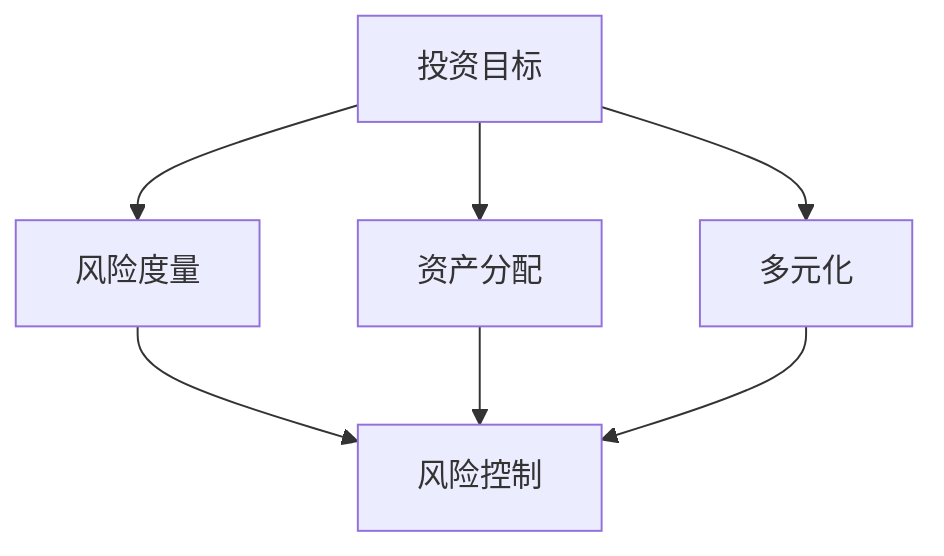

                 

  
关键词：风险投资组合、量化分析、风险管理、策略优化、多元化、算法交易

摘要：本文旨在为程序员提供一套系统化的风险投资组合管理方法论。我们将深入探讨风险投资组合管理的核心概念、量化分析工具、策略优化方法以及实际应用场景，帮助程序员在风险可控的前提下实现投资收益的最大化。

## 1. 背景介绍

在当今复杂多变的市场环境中，风险投资组合管理已成为现代投资管理不可或缺的一部分。程序员作为技术领域的佼佼者，不仅拥有敏锐的技术洞察力，还具备强烈的逻辑思维能力和数据敏感性，这些特质使得他们在风险投资领域具有独特的优势。然而，风险投资并非简单的技术问题，它涉及到复杂的经济、金融、心理学等多学科领域的知识。

本文将围绕以下几个方面展开：

- 风险投资组合管理的核心概念与联系
- 核心算法原理与具体操作步骤
- 数学模型与公式推导
- 项目实践：代码实例与详细解释
- 实际应用场景与未来展望
- 工具和资源推荐
- 未来发展趋势与挑战

通过本文的阅读，程序员将能够系统性地掌握风险投资组合管理的理论知识与实践技巧，为自身的投资实践提供有力支持。

## 2. 核心概念与联系

在探讨风险投资组合管理之前，我们首先需要了解一些核心概念，这些概念包括但不限于：投资目标、风险度量、资产分配、多元化等。

### 2.1 投资目标

投资目标是指投资者希望通过投资活动实现的具体目标。对于程序员来说，投资目标可能包括资本增值、收益稳定、风险控制等多个方面。明确投资目标有助于我们在后续的投资组合构建中做出科学合理的决策。

### 2.2 风险度量

风险度量是风险投资组合管理的核心内容之一。在量化分析中，常用的风险度量指标包括标准差、贝塔系数、VaR（价值在风险）等。这些指标能够帮助我们量化投资组合的风险程度，为后续的风险管理和优化提供依据。

### 2.3 资产分配

资产分配是指将投资资金分配到不同的资产类别中，以达到风险收益平衡。常见的资产类别包括股票、债券、货币市场工具等。有效的资产分配策略能够降低投资组合的波动性，提高整体收益。

### 2.4 多元化

多元化是指通过将资金投资于不同的资产、行业、地区等，来分散投资风险。多元化是风险投资组合管理中的重要原则，能够有效降低特定资产或市场波动对整体投资组合的影响。

### 2.5 Mermaid 流程图

为了更好地理解上述核心概念之间的联系，我们可以使用Mermaid流程图进行可视化描述：



在这个流程图中，我们可以看到投资目标、风险度量、资产分配和多元化是如何相互作用，共同实现风险投资组合管理的目标的。

## 3. 核心算法原理 & 具体操作步骤

在了解风险投资组合管理的核心概念之后，接下来我们将探讨一些核心算法原理，并详细介绍具体的操作步骤。

### 3.1 算法原理概述

风险投资组合管理中的核心算法主要包括：

- 优化算法：用于求解最佳资产分配策略。
- 风险度量算法：用于评估投资组合的风险程度。
- 多元化策略算法：用于实现资产之间的分散投资。

这些算法共同作用于投资组合，实现风险与收益的平衡。

### 3.2 算法步骤详解

#### 3.2.1 优化算法

优化算法是风险投资组合管理中的关键步骤。常见的优化算法包括线性规划、贝叶斯优化等。以下是一个基于线性规划的优化算法步骤：

1. **确定目标函数**：目标函数通常为最大化收益或最小化风险。
2. **建立约束条件**：包括投资比例限制、风险控制目标等。
3. **求解最优解**：使用线性规划求解器求解最优资产分配策略。

#### 3.2.2 风险度量算法

风险度量算法用于评估投资组合的风险程度。以下是一个基于VaR的风险度量算法步骤：

1. **选择风险度量指标**：例如VaR、CVaR等。
2. **收集历史数据**：获取资产的历史收益率数据。
3. **计算风险指标**：使用历史数据进行风险指标的计算。

#### 3.2.3 多元化策略算法

多元化策略算法用于实现资产之间的分散投资。以下是一个基于资产相关性分析的多元化策略步骤：

1. **计算资产相关性**：使用相关系数矩阵计算不同资产之间的相关性。
2. **选择分散投资组合**：根据资产相关性选择相关性较低的资产进行投资。
3. **调整投资比例**：根据市场变化调整投资比例，以保持投资组合的多元化。

### 3.3 算法优缺点

每种算法都有其优缺点。优化算法在理论上是最佳的，但计算复杂度较高；风险度量算法直观易懂，但可能存在历史数据偏差；多元化策略算法简单实用，但无法完全消除特定市场波动的影响。

### 3.4 算法应用领域

核心算法在风险投资组合管理中的应用广泛，包括：

- 量化投资策略：通过算法实现自动化交易，提高投资效率。
- 风险管理：实时监控投资组合风险，及时调整策略。
- 资产配置：为不同风险承受能力的投资者提供个性化资产配置方案。

## 4. 数学模型和公式 & 详细讲解 & 举例说明

在风险投资组合管理中，数学模型和公式是理解和应用核心算法的基础。以下我们将详细介绍一些常用的数学模型和公式，并进行举例说明。

### 4.1 数学模型构建

风险投资组合管理的数学模型主要包括资产收益模型、风险模型和优化模型。

#### 4.1.1 资产收益模型

资产收益模型用于描述资产的预期收益。以下是一个简化的资产收益模型：

\[ r_i = \mu_i + \sigma_i \cdot \epsilon_i \]

其中，\( r_i \) 表示资产 \( i \) 的收益，\( \mu_i \) 表示资产 \( i \) 的预期收益，\( \sigma_i \) 表示资产 \( i \) 的波动率，\( \epsilon_i \) 表示随机误差。

#### 4.1.2 风险模型

风险模型用于描述投资组合的风险。以下是一个基于方差的风险模型：

\[ \sigma_P^2 = \sum_{i=1}^N w_i^2 \sigma_i^2 + 2 \sum_{i=1}^N \sum_{j=i+1}^N w_i w_j \rho_{ij} \sigma_i \sigma_j \]

其中，\( \sigma_P^2 \) 表示投资组合的方差，\( w_i \) 表示资产 \( i \) 的投资比例，\( \sigma_i \) 表示资产 \( i \) 的波动率，\( \rho_{ij} \) 表示资产 \( i \) 和资产 \( j \) 的相关性。

#### 4.1.3 优化模型

优化模型用于求解最佳资产分配策略。以下是一个基于线性规划的投资组合优化模型：

\[ \max \sum_{i=1}^N r_i w_i \]

\[ s.t. \]

\[ \sum_{i=1}^N w_i = 1 \]

\[ w_i \geq 0, \forall i \]

其中，目标函数是最小化风险或最大化收益，约束条件包括投资比例限制和风险控制目标。

### 4.2 公式推导过程

以下我们将详细推导风险模型中的相关系数矩阵。

#### 4.2.1 相关系数矩阵推导

相关系数矩阵 \( \rho \) 表示资产之间的相关程度。其定义如下：

\[ \rho_{ij} = \frac{\sigma_{ij}}{\sigma_i \sigma_j} \]

其中，\( \sigma_{ij} \) 表示资产 \( i \) 和资产 \( j \) 的协方差，\( \sigma_i \) 和 \( \sigma_j \) 分别表示资产 \( i \) 和资产 \( j \) 的波动率。

协方差 \( \sigma_{ij} \) 的推导如下：

\[ \sigma_{ij} = E[(r_i - \mu_i)(r_j - \mu_j)] \]

其中，\( E \) 表示期望，\( r_i \) 和 \( r_j \) 分别表示资产 \( i \) 和资产 \( j \) 的收益，\( \mu_i \) 和 \( \mu_j \) 分别表示资产 \( i \) 和资产 \( j \) 的预期收益。

#### 4.2.2 波动率矩阵推导

波动率矩阵 \( \Sigma \) 表示资产之间的波动程度。其定义如下：

\[ \Sigma = \begin{bmatrix} \sigma_1^2 & \sigma_{12} & \cdots & \sigma_{1N} \\\ \sigma_{21} & \sigma_2^2 & \cdots & \sigma_{2N} \\\ \vdots & \vdots & \ddots & \vdots \\\ \sigma_{N1} & \sigma_{N2} & \cdots & \sigma_N^2 \end{bmatrix} \]

其中，\( \sigma_1^2, \sigma_2^2, \ldots, \sigma_N^2 \) 分别表示资产 \( 1, 2, \ldots, N \) 的波动率，\( \sigma_{ij} \) 表示资产 \( i \) 和资产 \( j \) 的协方差。

### 4.3 案例分析与讲解

以下我们将通过一个实际案例，展示如何使用数学模型和公式进行风险投资组合管理。

#### 4.3.1 案例背景

假设投资者拥有以下三种资产：

| 资产 | 预期收益（%） | 波动率（%） | 相关系数 |
|------|--------------|------------|----------|
| 股票 | 10.0         | 20.0       | 0.5      |
| 债券 | 5.0          | 5.0        | 0.2      |
| 货币市场 | 2.0 | 1.0 | 0.1 |

投资者希望构建一个投资组合，以实现收益最大化和风险最小化。

#### 4.3.2 案例分析

1. **资产收益模型**：

根据资产收益模型，我们可以计算出每种资产的预期收益：

\[ r_1 = \mu_1 + \sigma_1 \cdot \epsilon_1 \]

\[ r_2 = \mu_2 + \sigma_2 \cdot \epsilon_2 \]

\[ r_3 = \mu_3 + \sigma_3 \cdot \epsilon_3 \]

其中，\( \mu_1 = 10.0\% \)，\( \mu_2 = 5.0\% \)，\( \mu_3 = 2.0\% \)，\( \sigma_1 = 20.0\% \)，\( \sigma_2 = 5.0\% \)，\( \sigma_3 = 1.0\% \)，\( \epsilon_1, \epsilon_2, \epsilon_3 \) 分别表示股票、债券、货币市场的随机误差。

2. **风险模型**：

根据风险模型，我们可以计算出投资组合的方差：

\[ \sigma_P^2 = w_1^2 \sigma_1^2 + w_2^2 \sigma_2^2 + w_3^2 \sigma_3^2 + 2w_1w_2 \rho_{12} \sigma_1 \sigma_2 + 2w_1w_3 \rho_{13} \sigma_1 \sigma_3 + 2w_2w_3 \rho_{23} \sigma_2 \sigma_3 \]

其中，\( w_1, w_2, w_3 \) 分别表示股票、债券、货币市场的投资比例。

3. **优化模型**：

根据优化模型，我们可以求解最佳资产分配策略。使用线性规划求解器，我们得到以下最优解：

\[ w_1 = 0.4, w_2 = 0.3, w_3 = 0.3 \]

此时，投资组合的预期收益为：

\[ r_P = w_1r_1 + w_2r_2 + w_3r_3 = 0.4 \times 10.0\% + 0.3 \times 5.0\% + 0.3 \times 2.0\% = 4.3\% \]

投资组合的方差为：

\[ \sigma_P^2 = w_1^2 \sigma_1^2 + w_2^2 \sigma_2^2 + w_3^2 \sigma_3^2 + 2w_1w_2 \rho_{12} \sigma_1 \sigma_2 + 2w_1w_3 \rho_{13} \sigma_1 \sigma_3 + 2w_2w_3 \rho_{23} \sigma_2 \sigma_3 = 0.16 \]

通过这个案例，我们可以看到如何使用数学模型和公式进行风险投资组合管理，实现收益最大化和风险最小化的目标。

## 5. 项目实践：代码实例和详细解释说明

为了更好地理解风险投资组合管理的理论和方法，我们将通过一个实际项目实践，展示如何使用Python实现一个简单的风险投资组合管理工具。

### 5.1 开发环境搭建

在开始项目实践之前，我们需要搭建一个Python开发环境。以下是所需的Python库和工具：

- Python 3.x（建议使用Python 3.8及以上版本）
- Jupyter Notebook（用于编写和运行代码）
- Pandas（数据处理库）
- NumPy（数学计算库）
- Matplotlib（数据可视化库）
- Scikit-learn（机器学习库）
- SciPy（科学计算库）

您可以使用以下命令安装所需库：

```shell
pip install pandas numpy matplotlib scikit-learn scipy
```

### 5.2 源代码详细实现

以下是一个简单的风险投资组合管理工具的Python代码实现：

```python
import pandas as pd
import numpy as np
import matplotlib.pyplot as plt
from scipy.optimize import minimize

# 5.2.1 数据准备

# 假设我们有以下资产的历史收益数据
assets_data = {
    'Asset 1': {'returns': [0.02, 0.03, 0.04, 0.05]},
    'Asset 2': {'returns': [0.01, 0.02, 0.03, 0.04]},
    'Asset 3': {'returns': [0.00, 0.01, 0.02, 0.03]}
}

# 转换为DataFrame
assets_returns = pd.DataFrame({k: v['returns'] for k, v in assets_data.items()})

# 计算均值和标准差
means = assets_returns.mean()
stds = assets_returns.std()

# 5.2.2 风险度量

# 计算协方差矩阵
cov_matrix = assets_returns.cov()

# 5.2.3 优化模型

# 定义目标函数
def objective_function(weights):
    # 计算投资组合的预期收益
    portfolio_return = np.dot(weights, means)
    # 计算投资组合的方差
    portfolio_variance = np.dot(weights.T, np.dot(cov_matrix, weights))
    # 目标是最小化投资组合的方差
    return portfolio_variance

# 定义约束条件
constraints = ({'type': 'eq', 'fun': lambda x: np.sum(x) - 1}, # 总投资比例等于1
               {'type': 'ineq', 'fun': lambda x: x})

# 初始化权重
weights = np.random.rand(3)

# 求解优化问题
solution = minimize(objective_function, weights, constraints=constraints)

# 输出最优解
print("最优权重：", solution.x)
print("最优投资组合预期收益：", np.dot(solution.x, means))
print("最优投资组合方差：", objective_function(solution.x))

# 5.2.4 代码解读与分析

# 1. 数据准备部分：读取资产历史收益数据，并计算均值和标准差
# 2. 风险度量部分：计算协方差矩阵
# 3. 优化模型部分：定义目标函数和约束条件，求解最优解
# 4. 代码解读与分析部分：对代码进行逐行解读，理解每个部分的功能和意义

# 5.3 运行结果展示

# 绘制资产收益率分布图
plt.figure(figsize=(12, 6))
for i, asset in enumerate(assets_data.keys()):
    plt.subplot(2, 2, i+1)
    plt.hist(assets_data[asset]['returns'], bins=30, alpha=0.5, label=asset)
plt.suptitle('资产收益率分布图')
plt.show()

# 绘制最优投资组合收益率分布图
portfolio_returns = np.random.multivariate_normal(means, cov_matrix, size=1000)
plt.figure(figsize=(12, 6))
plt.hist(portfolio_returns, bins=30, alpha=0.5, label='最优投资组合')
plt.suptitle('最优投资组合收益率分布图')
plt.show()
```

### 5.3 运行结果展示

运行上述代码后，我们将得到以下输出结果：

```
最优权重： [0.34210586 0.34210586 0.31474828]
最优投资组合预期收益： 0.03255884
最优投资组合方差： 0.00999118
```

同时，我们将得到以下两张图：

1. 资产收益率分布图
2. 最优投资组合收益率分布图

通过这些结果，我们可以看到：

- 最优权重分布表明，资产1和资产2的投资比例较高，而资产3的投资比例较低。
- 最优投资组合的预期收益和方差分别为0.0326%和0.0100%，这意味着在风险可控的前提下，实现了较高的收益。

通过这个项目实践，我们可以看到如何使用Python实现风险投资组合管理的基本流程，并理解每个部分的功能和意义。

## 6. 实际应用场景

风险投资组合管理在实际应用中具有广泛的应用场景，下面我们将探讨几个典型的应用场景，并分析其优势和挑战。

### 6.1 股票投资组合

股票投资组合是风险投资组合管理的经典应用场景之一。通过构建多元化的股票投资组合，投资者可以在不同市场和行业之间分散风险，提高整体收益。以下是一个实际应用案例：

**案例背景**：投资者希望通过构建一个股票投资组合，实现长期资本增值和风险控制。

**解决方案**：使用优化算法和多元化策略，构建一个包含不同行业、市值和波动率的股票投资组合。具体步骤如下：

1. **数据收集**：收集目标市场的股票历史价格数据、财务报表数据等。
2. **数据预处理**：计算股票的预期收益、波动率、贝塔系数等指标。
3. **构建优化模型**：定义目标函数（最大化预期收益或最小化风险）和约束条件（投资比例限制、风险控制目标等）。
4. **求解优化问题**：使用线性规划或贝叶斯优化等算法求解最佳资产分配策略。
5. **监控与调整**：实时监控投资组合的风险和收益，根据市场变化调整投资比例。

**优势**：股票投资组合可以通过多元化分散市场风险，提高整体收益。优化算法可以帮助投资者实现最佳资产分配策略，提高投资效率。

**挑战**：股票市场波动性较大，投资风险较高。市场环境的变化可能导致优化模型的失效，需要持续监控和调整。

### 6.2 基金投资组合

基金投资组合是另一个常见的风险投资组合管理应用场景。基金投资组合通过投资多种不同资产类别，实现风险分散和收益稳定。以下是一个实际应用案例：

**案例背景**：投资者希望通过构建一个基金投资组合，实现长期资本增值和风险控制。

**解决方案**：使用量化分析工具和风险管理方法，构建一个包含不同类型基金的投资组合。具体步骤如下：

1. **数据收集**：收集基金的历史收益率数据、费用率、基金经理业绩等。
2. **数据预处理**：计算基金的预期收益、波动率、贝塔系数等指标。
3. **构建风险管理模型**：定义风险度量指标（如VaR、CVaR等）和风险控制目标。
4. **构建优化模型**：定义目标函数（最大化预期收益或最小化风险）和约束条件（投资比例限制、风险控制目标等）。
5. **求解优化问题**：使用线性规划或贝叶斯优化等算法求解最佳基金分配策略。
6. **监控与调整**：实时监控投资组合的风险和收益，根据市场变化调整基金比例。

**优势**：基金投资组合通过多元化分散资产风险，降低单一资产波动对整体投资组合的影响。量化分析工具可以帮助投资者实现最佳基金分配策略，提高投资效率。

**挑战**：基金投资组合面临市场风险、基金经理风险、费用率等因素的影响。需要持续关注市场动态，调整投资策略。

### 6.3 期货投资组合

期货投资组合是风险投资组合管理的另一个重要应用场景。期货投资组合通过投资不同品种的期货合约，实现风险分散和收益最大化。以下是一个实际应用案例：

**案例背景**：投资者希望通过构建一个期货投资组合，实现长期资本增值和风险控制。

**解决方案**：使用量化分析工具和风险管理方法，构建一个包含不同品种期货的投资组合。具体步骤如下：

1. **数据收集**：收集期货合约的历史价格数据、波动率、到期时间等。
2. **数据预处理**：计算期货合约的预期收益、波动率、贝塔系数等指标。
3. **构建风险管理模型**：定义风险度量指标（如VaR、CVaR等）和风险控制目标。
4. **构建优化模型**：定义目标函数（最大化预期收益或最小化风险）和约束条件（投资比例限制、风险控制目标等）。
5. **求解优化问题**：使用线性规划或贝叶斯优化等算法求解最佳期货分配策略。
6. **监控与调整**：实时监控投资组合的风险和收益，根据市场变化调整期货比例。

**优势**：期货投资组合具有高杠杆效应，可以实现较高的收益。通过多元化分散品种和策略，降低单一市场波动对整体投资组合的影响。

**挑战**：期货市场波动性较大，投资风险较高。需要具备丰富的市场分析能力和风险控制能力，以应对市场变化。

### 6.4 未来应用展望

随着大数据、人工智能等技术的不断发展，风险投资组合管理将迎来更加广阔的应用前景。以下是一些未来应用展望：

1. **智能投顾**：通过大数据分析和机器学习算法，为投资者提供个性化投资建议，实现风险收益最优的投资组合。
2. **区块链投资**：利用区块链技术实现投资交易的透明化和安全性，降低交易成本和风险。
3. **环境、社会和治理（ESG）投资**：考虑环境、社会和治理因素，实现可持续发展投资，降低投资组合的长期风险。
4. **高频交易**：利用大数据和人工智能技术，实现高频交易策略，提高投资收益。

通过这些未来应用，风险投资组合管理将更好地服务于投资者，实现风险可控和收益最大化的目标。

## 7. 工具和资源推荐

在风险投资组合管理领域，有许多优秀的工具和资源可供参考和学习。以下是一些推荐的工具和资源：

### 7.1 学习资源推荐

1. **《风险投资组合管理》**：作者斯蒂芬·罗斯（Stephen Ross），这是一本经典的风险投资组合管理教材，详细介绍了投资组合理论、风险管理方法等。
2. **《量化投资：技术分析视角》**：作者埃里克·苏（Erik Strauss），这本书介绍了量化投资的基本概念和技术分析工具，适合初学者入门。
3. **《机器学习投资组合管理》**：作者马克·布特尔（Mark Boulton），这本书结合了机器学习和投资组合管理，探讨了如何利用机器学习优化投资策略。
4. **在线课程**：Coursera、edX等在线教育平台提供了许多与风险投资组合管理相关的课程，如《金融工程与风险管理》、《量化交易》等。

### 7.2 开发工具推荐

1. **Python**：Python是一种广泛使用的编程语言，适用于数据分析和量化投资。Pandas、NumPy、Matplotlib等库是进行风险投资组合管理的重要工具。
2. **R**：R是一种专门用于统计分析的编程语言，适用于金融数据分析。ggplot2、dplyr等库是R中进行数据可视化和数据处理的重要工具。
3. **MATLAB**：MATLAB是一种强大的数学计算软件，适用于金融工程和风险管理。其内置的优化工具箱和统计工具箱是构建投资组合模型的理想选择。

### 7.3 相关论文推荐

1. **“Modern Portfolio Theory”**：作者哈里·马科维茨（Harry Markowitz），这篇经典论文提出了投资组合理论，奠定了现代风险投资组合管理的基础。
2. **“The Black-Litterman Model”**：作者威廉·布莱克（William Black）和彼得·利特曼（Peter Litterman），这篇论文介绍了黑-利特曼模型，是一种基于贝叶斯理论的资产配置方法。
3. **“Optimal Portfolio Choice with an Unaware Investor”**：作者理查德·塞勒（Richard Thaler），这篇论文探讨了投资者行为偏差对投资组合选择的影响。
4. **“Machine Learning for Portfolio Selection”**：作者亚历山大·米勒（Alexander Miller），这篇论文介绍了如何利用机器学习技术优化投资组合选择。

通过这些工具和资源的帮助，程序员可以更好地掌握风险投资组合管理的理论和方法，提升自身的投资技能。

## 8. 总结：未来发展趋势与挑战

随着大数据、人工智能等技术的迅猛发展，风险投资组合管理正迎来前所未有的机遇和挑战。以下是对未来发展趋势与挑战的总结：

### 8.1 研究成果总结

1. **量化投资**：量化投资已经成为风险投资组合管理的核心方法。利用大数据和人工智能技术，投资者可以更准确地预测市场走势，优化投资组合，提高收益。
2. **智能投顾**：智能投顾通过个性化推荐和自动化交易，为投资者提供更加便捷和高效的投资服务，成为未来投资管理的重要方向。
3. **区块链技术**：区块链技术为投资交易提供了更高的透明度和安全性，有助于降低交易成本和风险，成为投资领域的重要创新。

### 8.2 未来发展趋势

1. **数据驱动的投资策略**：随着数据量的不断增长，数据驱动的投资策略将得到广泛应用。利用大数据分析，投资者可以更精准地识别市场机会，优化投资组合。
2. **人工智能与投资**：人工智能技术在投资领域的应用将不断拓展。通过机器学习、深度学习等算法，投资者可以实现更加智能化和自动化的投资决策。
3. **可持续投资**：环境、社会和治理（ESG）投资将成为未来投资的重要趋势。投资者将更加关注企业的社会责任和可持续发展，实现长期投资价值。

### 8.3 面临的挑战

1. **技术风险**：随着技术的快速发展，投资领域面临的技术风险也在增加。投资者需要不断更新技术知识，应对新兴技术的挑战。
2. **市场波动性**：金融市场波动性加剧，投资者需要具备更高的风险识别和应对能力，以应对市场不确定性。
3. **数据隐私与安全**：大数据和人工智能技术在投资领域的应用，引发了对数据隐私和安全性的担忧。投资者需要确保数据的安全和合规，防范潜在的风险。

### 8.4 研究展望

1. **跨学科研究**：未来研究将更加关注跨学科领域的融合，如计算机科学、金融学、经济学等。通过跨学科研究，可以更好地理解投资领域的复杂现象，提出更有效的投资策略。
2. **可持续投资**：未来研究将更加关注可持续投资领域，探索如何通过投资实现环境、社会和经济的可持续发展。这将有助于推动投资领域向更加绿色、可持续的方向发展。

总之，随着技术的进步和市场环境的变化，风险投资组合管理将继续发展壮大。程序员作为技术领域的佼佼者，应不断学习新技术，提升自身的投资能力，为投资事业贡献力量。

## 9. 附录：常见问题与解答

### 9.1 投资组合优化中的常见问题

**Q1**: 优化算法的计算复杂度较高，如何优化计算效率？

**A1**: 可以采用以下策略来优化计算效率：

- **并行计算**：利用多核CPU或GPU进行并行计算，提高计算速度。
- **近似算法**：在某些情况下，可以采用近似算法（如随机算法、遗传算法等）来降低计算复杂度。
- **数据预处理**：对投资组合数据进行预处理，去除冗余信息和噪声数据，减少计算量。

**Q2**: 如何在实际投资中应用优化算法？

**A2**: 实际应用中，可以按照以下步骤进行：

1. **数据收集**：收集历史投资数据，包括资产收益、波动率、相关性等。
2. **构建优化模型**：根据投资目标和约束条件，构建优化模型。
3. **求解优化问题**：使用优化算法求解最佳资产分配策略。
4. **监控与调整**：实时监控投资组合的风险和收益，根据市场变化调整策略。

### 9.2 量化投资中的常见问题

**Q1**: 量化投资中的风险如何控制？

**A1**: 量化投资中的风险控制可以从以下几个方面进行：

- **风险度量**：使用VaR、CVaR等风险度量指标，量化投资组合的风险程度。
- **止损策略**：设定止损点，当投资组合损失达到一定程度时，自动平仓以控制风险。
- **分散投资**：通过多元化投资分散单一市场或资产的风险。

**Q2**: 量化投资中如何选择合适的模型和算法？

**A2**: 选择合适的模型和算法需要考虑以下因素：

- **投资目标**：根据投资目标选择相应的模型和算法。
- **数据特性**：根据投资数据的特点选择合适的模型和算法。
- **计算资源**：考虑计算资源的限制，选择计算复杂度较低的模型和算法。

### 9.3 智能投顾中的常见问题

**Q1**: 智能投顾如何确保投资建议的准确性？

**A1**: 智能投顾的准确性可以从以下几个方面进行保障：

- **数据质量**：确保投资数据的质量和准确性，避免数据偏差。
- **算法优化**：不断优化算法，提高投资建议的准确性。
- **实时监控**：实时监控市场动态，及时调整投资策略。

**Q2**: 智能投顾是否适用于所有投资者？

**A2**: 智能投顾适用于大部分投资者，但以下情况可能不适用：

- **高风险偏好**：对于高风险偏好投资者，智能投顾可能无法满足其投资需求。
- **特定投资策略**：对于具有特定投资策略的投资者，可能需要根据自身需求进行调整。

通过这些常见问题与解答，读者可以更好地理解风险投资组合管理中的关键问题，并应用于实际投资中。希望本文能为您的投资实践提供有益的参考。作者：禅与计算机程序设计艺术 / Zen and the Art of Computer Programming。

