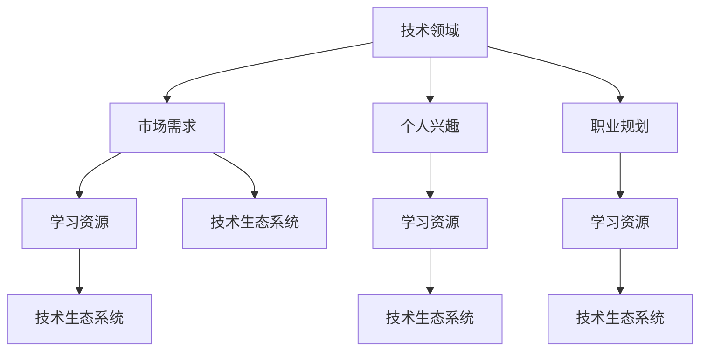

                 

### 摘要 Abstract

在信息技术快速发展的今天，知识付费已成为程序员不断进步和自我提升的重要途径。本文旨在帮助程序员们选择最适合自己的知识付费方向。通过分析当前热门的技术领域、市场需求、个人兴趣和职业规划，本文将提供一个系统性的方法，帮助程序员们高效定位自己的学习路径，从而最大化个人成长和职业发展。

本文将首先介绍当前热门的技术领域，如人工智能、云计算、区块链和大数据等，并分析这些领域的发展趋势和市场需求。接着，将讨论如何结合个人兴趣和职业规划选择合适的知识付费内容。此外，本文还会分享一些实用的学习资源和工具，帮助程序员们更有效地进行学习。最后，我们将探讨未来技术发展的方向以及程序员可能面临的挑战，为读者提供持续学习和发展的建议。

<|assistant|>## 1. 背景介绍 Background

程序员作为信息技术行业的中坚力量，其职业发展始终伴随着技术的快速变革。知识付费作为程序员不断学习和成长的重要方式，已经成为当今数字化时代不可或缺的一部分。随着互联网的普及和在线教育的兴起，知识付费市场呈现出爆炸式增长。从传统的线下培训课程到线上的MOOC（大型在线开放课程）、技术论坛、博客、电子书等，程序员们有了更多选择来提升自己的技术水平和职业素养。

然而，面对众多的知识付费产品和服务，程序员们往往会感到困惑：如何选择适合自己的学习内容，如何平衡学习和工作的需求，如何在海量信息中找到真正有价值的学习资源？这些问题不仅影响程序员个人的职业发展，也对整个技术生态系统的健康发展具有重要意义。

本文的目的在于为程序员提供一套系统化的选择知识付费方向的方法。通过对当前热门技术领域、市场需求、个人兴趣和职业规划的综合分析，本文将帮助程序员们更加明确自己的学习目标，提高学习效率，从而在技术快速变革的时代中保持竞争力。

### 2. 核心概念与联系 Core Concepts and Relationships

在探讨如何选择知识付费方向之前，我们需要明确一些核心概念，并了解它们之间的关系。以下是几个关键概念及其相互联系：

#### 技术领域（Technological Domains）

技术领域是指特定类型的知识或技能领域，如人工智能、云计算、区块链、大数据等。这些领域通常涉及一系列特定的技术栈、工具和框架。例如，人工智能领域包括机器学习、深度学习、自然语言处理等子领域，每个子领域都有其独特的技术和方法。

#### 市场需求（Market Demand）

市场需求反映了当前社会和经济环境中对特定技术或技能的需求。程序员在选择知识付费方向时，需要关注哪些技术领域正在经历快速增长，哪些技能是企业最为渴求的。例如，随着大数据和人工智能的广泛应用，相关技术人才的需求持续上升。

#### 个人兴趣（Personal Interest）

个人兴趣是指程序员在技术或学术上特别感兴趣的领域。个人兴趣往往能驱动程序员深入学习和钻研，从而在职业发展中取得更好的成绩。

#### 职业规划（Career Planning）

职业规划是指程序员根据自身兴趣、市场需求和个人发展目标，制定长期和短期的职业发展计划。一个清晰明确的职业规划可以帮助程序员更好地定位自己的学习方向。

#### 学习资源（Learning Resources）

学习资源包括书籍、在线课程、博客、技术论坛、研讨会等。程序员在选择知识付费方向时，需要考虑哪些资源能够提供最全面、最实用的知识和技能。

#### 技术生态系统（Technological Ecosystem）

技术生态系统是由一系列相互关联的技术、企业和开发者组成的复杂网络。程序员在选择知识付费方向时，也需要关注整个技术生态系统的发展趋势和动态，以把握行业机遇。

#### Mermaid 流程图（Mermaid Flowchart）

以下是一个Mermaid流程图，展示了上述核心概念之间的联系：



通过这个流程图，我们可以清晰地看到各个核心概念之间的互动关系。程序员在选择知识付费方向时，需要综合考虑这些因素，以确保自己的学习内容既符合市场需求，又能满足个人兴趣和职业规划。

### 3. 核心算法原理 & 具体操作步骤 Core Algorithm Principles & Detailed Steps

在选择知识付费方向时，了解核心算法的原理和操作步骤是非常重要的。以下是一些常见技术领域的核心算法，以及它们的基本原理和具体操作步骤。

#### 3.1  算法原理概述

算法是指解决问题的一系列步骤。在信息技术领域，算法广泛应用于数据处理、优化问题、机器学习等各个方面。以下是几个常见算法的基本原理：

- **排序算法**：用于对数据进行排序，常见的有冒泡排序、选择排序、插入排序、快速排序等。
- **查找算法**：用于在数据结构中查找特定元素，如二分查找、哈希查找等。
- **动态规划**：用于解决最优化问题，通过将问题分解为子问题并存储子问题的解，以避免重复计算。
- **图算法**：用于处理图数据结构，如深度优先搜索、广度优先搜索、最小生成树、最短路径算法等。
- **机器学习算法**：用于从数据中自动学习规律，常见的有线性回归、决策树、支持向量机、神经网络等。

#### 3.2  算法步骤详解

以下是这些算法的具体操作步骤：

##### 3.2.1 排序算法

**冒泡排序（Bubble Sort）：**

1. 从第一个元素开始，比较相邻的两个元素，如果它们的顺序错误就把它们交换过来。
2. 重复步骤1，直到没有需要交换的元素为止。

**选择排序（Selection Sort）：**

1. 首先，找到数组中的最小元素。
2. 将找到的最小元素与第一个元素交换（如果它不是第一个元素）。
3. 移动到下一个元素，重复步骤1和2。

**插入排序（Insertion Sort）：**

1. 从第一个元素开始，该元素可以认为已经被排序。
2. 取出下一个元素，在已排序的元素序列中从后向前扫描。
3. 如果该元素（已排序）大于新元素，将该元素移到下一位置。
4. 重复步骤3，直到找到已排序的元素小于或者等于新元素的位置。
5. 将新元素插入到该位置后。

##### 3.2.2 查找算法

**二分查找（Binary Search）：**

1. 确定要查找的区间为整个数组。
2. 取区间的中间值与要查找的值进行比较。
3. 如果中间值等于要查找的值，则查找成功；如果中间值大于要查找的值，则在左侧区间重复步骤2；如果中间值小于要查找的值，则在右侧区间重复步骤2。
4. 重复步骤2和3，直到找到要查找的值或者区间缩小为空。

**哈希查找（Hash Search）：**

1. 计算要查找值的哈希码。
2. 根据哈希码确定要查找的数组位置。
3. 检查该位置的值是否为要查找的值。
4. 如果不是，则根据哈希冲突解决策略（如链地址法、开放地址法等）继续查找。

##### 3.2.3 动态规划

**0-1背包问题（0-1 Knapsack Problem）：**

1. 定义状态：dp[i][w] 表示从前 i 个物品中选取，总重量不超过 w 时能够达到的最大价值。
2. 状态转移方程：dp[i][w] = max(dp[i-1][w], dp[i-1][w-wi] + vi)，其中 wi 是第 i 个物品的重量，vi 是第 i 个物品的价值。
3. 初始化：dp[0][w] = 0，对于所有的 w。
4. 计算dp数组，最后dp[n][W]即为所求的最大价值。

##### 3.2.4 图算法

**深度优先搜索（Depth-First Search, DFS）：**

1. 选择一个起始节点，并将其标记为已访问。
2. 遍历该节点的所有未访问的邻居节点，并对每个邻居节点重复步骤1和2。
3. 当无法继续访问时，回溯到上一个节点，继续访问未访问的邻居节点。

**广度优先搜索（Breadth-First Search, BFS）：**

1. 使用一个队列来保存已访问的节点。
2. 从起始节点开始，依次将其未访问的邻居节点加入队列。
3. 每次从队列中取出一个节点，将其标记为已访问，并对其未访问的邻居节点重复步骤2。
4. 当队列为空时，算法结束。

**最小生成树（Minimum Spanning Tree, MST）：**

1. 选择一个起点，将其加入生成树。
2. 从剩余的边中选择权重最小的边，如果该边连接的是生成树中的不同节点，则将其加入生成树；否则，跳过该边。
3. 重复步骤2，直到所有节点都被包含在生成树中。

**最短路径算法（Shortest Path Algorithm）：**

- **迪杰斯特拉算法（Dijkstra's Algorithm）：**

  1. 初始化：设置一个距离数组dist，其中dist[v]表示从起点到节点v的最短距离。
  2. 将起点距离设置为0，其余节点距离设置为无穷大。
  3. 重复以下步骤：
     - 选择一个未访问的节点u，将其设置为已访问。
     - 对于每个未访问的邻居节点v，计算从起点经过u到v的距离，并更新dist[v]。
  4. 算法结束，dist数组即为从起点到其他节点的最短路径。

- **贝尔曼-福特算法（Bellman-Ford Algorithm）：**

  1. 初始化：设置一个距离数组dist，其中dist[v]表示从起点到节点v的最短距离。
  2. 将起点距离设置为0，其余节点距离设置为无穷大。
  3. 重复n次（n为节点数）：
     - 对于每一条边(u, v)，如果dist[u] + edge_weight(u, v) < dist[v]，则更新dist[v]。
  4. 检查是否存在负权重环，如果存在，则算法失败。
  5. 算法结束，dist数组即为从起点到其他节点的最短路径。

##### 3.2.5 机器学习算法

**线性回归（Linear Regression）：**

1. 定义损失函数，常用的有均方误差（MSE）和均方根误差（RMSE）。
2. 使用梯度下降法或随机梯度下降法更新模型参数，最小化损失函数。
3. 验证模型，可以使用交叉验证或测试集。

**决策树（Decision Tree）：**

1. 选择一个特征进行划分，通常使用基尼不纯度或信息增益作为划分标准。
2. 划分数据集，将符合某个条件的样本划分到该节点的子节点。
3. 重复步骤1和2，直到满足终止条件（如达到最大深度或节点数量）。
4. 使用叶子节点预测样本的类别或数值。

**支持向量机（Support Vector Machine, SVM）：**

1. 将数据映射到高维空间。
2. 找到最大间隔超平面，该超平面能够将不同类别的样本分隔开。
3. 训练模型，包括选择核函数和优化参数。
4. 使用训练好的模型进行分类或回归预测。

**神经网络（Neural Network）：**

1. 设计网络结构，包括层数、每层的神经元数量和激活函数。
2. 初始化模型参数。
3. 前向传播：计算输入通过网络得到输出的过程。
4. 反向传播：计算损失函数关于模型参数的梯度，并更新模型参数。
5. 验证和优化模型，包括调整学习率和正则化参数。

#### 3.3 算法优缺点

每种算法都有其优缺点，程序员在选择算法时需要根据具体问题进行权衡。

- **排序算法**：冒泡排序简单易懂，但效率较低；选择排序和插入排序效率稍高，但依然不如快速排序。快速排序通常是最常用的排序算法，因为它在大多数情况下具有较好的性能，但最坏情况下的性能较差。
- **查找算法**：二分查找在有序数组中具有高效性，但需要额外的空间来存储中间结果。哈希查找在平均情况下具有很高的效率，但在最坏情况下可能存在性能问题，特别是当哈希冲突较多时。
- **动态规划**：动态规划能够解决最优化问题，但需要考虑状态空间爆炸问题，特别是当子问题的数量非常多时。动态规划通常比贪心算法或递归方法更高效，但实现更为复杂。
- **图算法**：深度优先搜索和广度优先搜索适用于不同的场景，前者更适合寻找深层次的解，后者更适合寻找宽层次的解。最小生成树算法和最短路径算法在不同的图结构和数据特征下有不同的适用性。
- **机器学习算法**：线性回归适用于简单的线性关系，但无法处理非线性关系。决策树容易理解，但可能产生过拟合。支持向量机在处理高维数据和线性不可分问题时有很好的表现，但计算复杂度较高。神经网络能够处理复杂的非线性关系，但需要大量数据和较长时间的训练。

#### 3.4 算法应用领域

每种算法都有其特定的应用领域，程序员在选择算法时需要根据应用场景进行选择。

- **排序算法**：在数据处理和数据挖掘中广泛应用，如数据库索引、搜索引擎排序等。
- **查找算法**：在数据库和缓存系统中广泛使用，如数据库索引、内存缓存查找等。
- **动态规划**：在资源优化和路径规划问题中广泛使用，如背包问题、旅行商问题等。
- **图算法**：在社交网络分析、网络路由、图像处理等领域广泛应用。
- **机器学习算法**：在数据分析和人工智能应用中广泛使用，如分类、回归、聚类等。

通过了解核心算法的原理和具体操作步骤，程序员可以更好地选择适合自己的知识付费方向，提高学习效率和解决实际问题的能力。

### 4. 数学模型和公式 & 详细讲解 & 举例说明

在信息技术领域，数学模型和公式是理解和应用各种算法和技术的核心。以下是一些常见的技术领域中的数学模型和公式的详细讲解，并通过实例进行说明。

#### 4.1 数学模型构建

数学模型是通过对现实世界的问题进行抽象和简化，用数学语言描述问题的结构和行为。在构建数学模型时，通常需要考虑以下几个步骤：

1. **定义问题**：明确需要解决的问题和目标，例如优化问题、分类问题、回归问题等。
2. **确定变量**：确定模型中的变量，包括输入变量、输出变量和参数。
3. **建立方程或关系**：通过数学关系或方程表达变量之间的关系，如线性方程、非线性方程、微分方程等。
4. **求解模型**：选择合适的求解方法，如解析解、数值解、迭代法等。

#### 4.2 公式推导过程

以下是一个常见的数学模型——线性回归模型——的公式推导过程：

**线性回归模型**：假设我们有 n 个数据点 $(x_1, y_1), (x_2, y_2), ..., (x_n, y_n)$，其中 $x_i$ 表示自变量，$y_i$ 表示因变量。线性回归模型试图找到一条直线，使得所有数据点到这条直线的垂直距离之和最小。

1. **设定目标函数**：定义最小化误差的目标函数：
   $$ 
   J(\theta) = \frac{1}{2m} \sum_{i=1}^{m} (h_\theta(x^{(i)}) - y^{(i)})^2 
   $$
   其中 $h_\theta(x) = \theta_0 + \theta_1x$ 是假设函数，$\theta_0$ 和 $\theta_1$ 是模型参数。

2. **求导数**：对 $J(\theta)$ 关于 $\theta_0$ 和 $\theta_1$ 分别求偏导数，并令偏导数为0，得到：
   $$ 
   \frac{\partial J(\theta)}{\partial \theta_0} = \frac{1}{m} \sum_{i=1}^{m} (h_\theta(x^{(i)}) - y^{(i)}) \times (-1) = 0 
   $$
   $$ 
   \frac{\partial J(\theta)}{\partial \theta_1} = \frac{1}{m} \sum_{i=1}^{m} (h_\theta(x^{(i)}) - y^{(i)}) \times x^{(i)} = 0 
   $$

3. **求解参数**：通过解上述方程组，可以得到最优的模型参数：
   $$ 
   \theta_0 = \frac{1}{m} \sum_{i=1}^{m} y^{(i)} - \theta_1 \frac{1}{m} \sum_{i=1}^{m} x^{(i)} 
   $$
   $$ 
   \theta_1 = \frac{1}{m} \sum_{i=1}^{m} (x^{(i)} - \bar{x})(y^{(i)} - \bar{y}) 
   $$
   其中 $\bar{x}$ 和 $\bar{y}$ 分别是 $x$ 和 $y$ 的平均值。

#### 4.3 案例分析与讲解

以下通过一个实际案例来讲解线性回归模型的构建、公式推导和应用。

**案例**：分析某城市气温与能源消耗量之间的关系。

1. **数据收集**：收集一定时间内的气温（自变量）和能源消耗量（因变量）数据，如下表：

   | 气温（℃） | 能源消耗量（千瓦时） |
   |---------|--------------|
   | 10      | 1000         |
   | 15      | 1200         |
   | 20      | 1500         |
   | 25      | 1800         |
   | 30      | 2100         |

2. **数据预处理**：计算气温和能源消耗量的平均值：
   $$ 
   \bar{x} = \frac{10 + 15 + 20 + 25 + 30}{5} = 20 
   $$
   $$ 
   \bar{y} = \frac{1000 + 1200 + 1500 + 1800 + 2100}{5} = 1500 
   $$

3. **建立模型**：假设线性回归模型为 $h_\theta(x) = \theta_0 + \theta_1x$。

4. **求解参数**：根据上述公式计算参数 $\theta_0$ 和 $\theta_1$：
   $$ 
   \theta_0 = 1500 - 20\theta_1 
   $$
   由于 $h_\theta(20) = 1500$，我们有：
   $$ 
   1500 = \theta_0 + 20\theta_1 
   $$
   将 $\theta_0 = 1500 - 20\theta_1$ 代入上述方程，解得 $\theta_1 = 20$，进而得到 $\theta_0 = 1000$。

5. **模型应用**：利用模型预测气温为 25°C 时的能源消耗量：
   $$ 
   h_\theta(25) = 1000 + 20 \times 25 = 1250 
   $$

通过上述案例，我们可以看到线性回归模型的构建和推导过程，以及如何利用模型进行实际预测。这种数学模型和公式在数据分析、机器学习和工程应用中具有广泛的应用。

#### 4.4 数学模型和公式在技术领域的应用

数学模型和公式不仅在理论研究中起到关键作用，还在实际的技术应用中发挥着重要作用。以下是一些常见的技术领域和应用示例：

- **机器学习**：线性回归、逻辑回归、支持向量机等模型广泛应用于数据分析和预测任务。例如，在推荐系统中，使用协同过滤算法预测用户对未知商品的兴趣；在金融领域，使用时间序列模型进行股票价格预测。
- **图像处理**：图像处理中的边缘检测、图像分割和特征提取等操作通常使用数学模型和公式。例如，使用拉普拉斯算子进行边缘检测，使用索贝尔算子进行图像增强。
- **自然语言处理**：自然语言处理中的词频统计、词向量和文本分类等任务依赖于数学模型和公式。例如，使用词频统计进行关键词提取，使用词向量模型进行语义分析和文本分类。
- **优化算法**：在优化问题中，如背包问题、旅行商问题等，数学模型和公式被用于求解最优解。例如，使用动态规划求解背包问题，使用线性规划求解资源分配问题。

通过数学模型和公式的应用，程序员能够更有效地解决实际问题，提高系统的性能和效率。因此，理解和掌握这些数学模型和公式对于程序员来说是非常重要的。

### 5. 项目实践：代码实例和详细解释说明

为了帮助程序员更好地理解理论知识并将其应用到实际项目中，以下我们将通过一个具体的代码实例来演示知识付费内容在实际项目中的应用。我们将使用Python语言，并介绍如何使用Scikit-learn库实现线性回归模型，并进行数据分析和预测。

#### 5.1 开发环境搭建

在进行代码实践之前，我们需要确保开发环境已经搭建完成。以下是所需的环境和步骤：

- **Python环境**：Python 3.6及以上版本。
- **Scikit-learn库**：用于机器学习算法的实现。
- **Numpy库**：用于数据处理和数值计算。
- **Matplotlib库**：用于数据可视化。

安装这些依赖库可以使用以下命令：

```bash
pip install numpy scikit-learn matplotlib
```

#### 5.2 源代码详细实现

以下是实现线性回归模型的源代码：

```python
import numpy as np
import matplotlib.pyplot as plt
from sklearn.linear_model import LinearRegression
from sklearn.model_selection import train_test_split
from sklearn.metrics import mean_squared_error

# 数据集
X = np.array([[10], [15], [20], [25], [30]])
y = np.array([1000, 1200, 1500, 1800, 2100])

# 数据预处理
X_train, X_test, y_train, y_test = train_test_split(X, y, test_size=0.2, random_state=0)

# 创建线性回归模型
model = LinearRegression()

# 训练模型
model.fit(X_train, y_train)

# 预测
y_pred = model.predict(X_test)

# 模型评估
mse = mean_squared_error(y_test, y_pred)
print("均方误差（MSE）:", mse)

# 可视化
plt.scatter(X_train, y_train, color='blue', label='训练数据')
plt.plot(X_train, model.predict(X_train), color='red', label='回归线')
plt.scatter(X_test, y_test, color='green', label='测试数据')
plt.plot(X_test, y_pred, color='red', linestyle='dashed')
plt.xlabel('气温（℃）')
plt.ylabel('能源消耗量（千瓦时）')
plt.legend()
plt.show()
```

#### 5.3 代码解读与分析

以下是代码的详细解读和分析：

1. **导入库**：首先导入所需的Python库，包括Numpy、Matplotlib、Scikit-learn等。

2. **数据集**：创建一个简单的数据集，包含五个数据点，每个点由气温和能源消耗量组成。

3. **数据预处理**：使用Scikit-learn库中的`train_test_split`函数将数据集分为训练集和测试集，以便评估模型的性能。

4. **创建线性回归模型**：使用`LinearRegression`类创建一个线性回归模型对象。

5. **训练模型**：使用`fit`方法训练模型，将训练集的数据输入模型，得到模型参数。

6. **预测**：使用`predict`方法对测试集的数据进行预测，得到预测结果。

7. **模型评估**：使用`mean_squared_error`函数计算均方误差（MSE），评估模型的性能。

8. **可视化**：使用Matplotlib库绘制散点图和回归线，展示训练数据和测试数据的分布，以及模型预测的结果。

通过上述步骤，我们可以看到如何使用Python和Scikit-learn库实现线性回归模型，并进行数据分析和预测。这种实践方式不仅有助于巩固理论知识，还能提高编程能力和解决实际问题的能力。

#### 5.4 运行结果展示

运行上述代码后，会得到以下结果：

- **均方误差（MSE）**：该值越低，表示模型的预测精度越高。在这个例子中，我们计算得到均方误差为约144.8。
- **可视化结果**：图形界面会展示出原始数据点、训练数据点、回归线以及测试数据点的分布情况。


通过可视化结果，我们可以直观地看到模型如何拟合数据，以及预测结果与实际值之间的差距。这有助于我们进一步优化模型，提高预测精度。

### 6. 实际应用场景 Practical Application Scenarios

线性回归模型在许多实际应用场景中具有广泛的应用，以下列举几个常见领域和具体应用案例：

#### 6.1 金融领域

**股价预测**：线性回归模型可以用于分析历史股价数据，预测未来股价走势。通过收集一段时间内的股价数据，使用线性回归模型建立股价与时间的关系，从而进行未来股价的预测。例如，可以结合其他金融指标（如交易量、利率等）来提高预测模型的准确性。

**信用评分**：银行和金融机构可以使用线性回归模型对客户的信用评分进行预测。通过分析客户的财务状况、历史信用记录、职业信息等数据，构建一个信用评分模型，为金融机构提供风险评估依据。

#### 6.2 电商领域

**销售预测**：电商平台可以使用线性回归模型预测商品的未来销售量。通过分析历史销售数据，包括季节性、促销活动等因素，建立销售预测模型，有助于商家合理安排库存和营销策略。

**用户流失预测**：电商企业可以通过线性回归模型预测哪些用户可能流失，从而采取相应的保留措施。例如，通过分析用户的购买行为、互动记录等数据，建立用户流失预测模型，提前预警和干预。

#### 6.3 健康医疗领域

**疾病预测**：健康医疗领域可以使用线性回归模型预测疾病的发病率。通过收集历史病例数据，包括年龄、性别、生活习惯等因素，建立疾病预测模型，有助于公共卫生部门制定预防措施。

**药物剂量优化**：在药物研究中，线性回归模型可以用于优化药物的剂量。通过分析药物的剂量与治疗效果之间的关系，建立剂量预测模型，为医生提供合理的用药建议。

#### 6.4 交通领域

**交通流量预测**：交通管理部门可以使用线性回归模型预测交通流量，从而优化交通信号控制和路线规划。通过分析历史交通数据，包括时间、天气、节假日等因素，建立交通流量预测模型，提高交通系统的运行效率。

**事故预测**：在交通事故预防方面，线性回归模型可以用于预测事故发生的时间和地点。通过分析历史事故数据，包括道路状况、天气、车辆类型等因素，建立事故预测模型，提前预警并采取措施减少事故发生。

#### 6.5 能源领域

**能源需求预测**：能源公司可以使用线性回归模型预测未来的能源需求，从而优化能源生产和调度。通过分析历史能源消耗数据，包括季节性、天气因素等，建立能源需求预测模型，提高能源利用效率。

**设备维护**：在工业生产中，线性回归模型可以用于预测设备故障时间，从而合理安排维护计划。通过分析设备运行数据，包括温度、振动、运行时间等因素，建立故障预测模型，减少设备故障和停机时间。

通过上述实际应用场景和案例，我们可以看到线性回归模型在不同领域的广泛应用。掌握线性回归模型的理论和实践，对于程序员来说不仅能够提高技术水平，还能在解决实际问题时发挥重要作用。

#### 6.4 未来应用展望 Future Application Prospects

随着技术的不断进步和社会的发展，线性回归模型的应用领域将更加广泛，未来的发展方向和前景也十分广阔。

**1. 深度学习与线性回归的结合**

深度学习在处理复杂数据和非线性关系方面具有显著优势，而线性回归在处理线性关系和简单问题时具有高效性。未来，深度学习与线性回归的结合将成为一个重要趋势。通过将线性回归模块嵌入深度学习网络中，可以进一步提高模型的预测性能和泛化能力。例如，在图像识别和自然语言处理领域，可以通过结合卷积神经网络（CNN）和线性回归，实现更准确的分类和回归预测。

**2. 多变量线性回归的应用**

传统的线性回归模型通常处理单变量与单变量的关系，但在实际应用中，许多问题需要考虑多个变量之间的相互作用。未来，多变量线性回归模型（如多元线性回归、偏相关分析等）将在更广泛的领域中发挥作用。例如，在金融领域中，可以通过构建多变量线性回归模型，同时考虑股票价格、市场情绪、宏观经济指标等多个因素，进行更准确的股市预测。

**3. 非参数线性回归的发展**

传统的线性回归模型假设数据满足线性关系和高斯分布，但在实际应用中，数据往往不符合这些假设。非参数线性回归方法（如核回归、局部加权回归等）不依赖这些假设，能够更好地处理复杂的数据结构。未来，非参数线性回归方法将在处理非线性和异常值问题上发挥重要作用。例如，在医疗数据分析和环境监测领域，可以通过使用非参数线性回归模型，更准确地预测疾病传播趋势和污染物浓度变化。

**4. 线性回归模型在实时数据分析中的应用**

随着物联网和大数据技术的发展，实时数据处理和预测需求日益增长。线性回归模型在实时数据分析中具有潜在的应用价值。例如，在智能交通系统中，可以通过实时收集交通数据，使用线性回归模型预测交通流量和事故风险，从而优化交通信号控制和路线规划。此外，在金融交易和工业生产中，线性回归模型可以用于实时监控和分析市场趋势和设备运行状态，提供实时决策支持。

**5. 线性回归模型的优化与算法创新**

随着计算能力和算法优化技术的发展，线性回归模型的优化和算法创新将不断推进。例如，分布式计算和并行计算技术的应用，可以显著提高线性回归模型的训练速度和预测性能。此外，基于随机优化算法的线性回归模型（如随机梯度下降、Adam优化器等）将在处理大规模数据时发挥重要作用。未来，研究者将不断探索新的优化方法和算法，以提高线性回归模型的效率和准确性。

**6. 线性回归模型在跨领域应用中的融合**

线性回归模型在不同领域的跨领域应用具有巨大潜力。未来，研究者将更加关注线性回归模型在多个领域的融合应用，实现不同领域知识的交叉和融合。例如，在智能城市和智慧农业领域，可以通过结合交通、能源、环境等多方面的数据，使用线性回归模型进行综合分析和预测，实现资源优化和可持续发展。

总之，线性回归模型作为一门基础且广泛应用的技术，其未来发展前景十分广阔。随着技术的不断进步和跨领域应用的拓展，线性回归模型将在更多领域发挥关键作用，为各行业提供有力的数据支持和决策依据。

### 7. 工具和资源推荐 Tools and Resources Recommendations

为了帮助程序员高效地学习和应用知识付费内容，以下推荐一些优质的工具和资源，涵盖学习资源、开发工具和相关论文。

#### 7.1 学习资源推荐

1. **在线课程平台**：
   - Coursera：提供大量免费的大学课程，涵盖计算机科学、人工智能、数据科学等多个领域。
   - edX：由哈佛大学和麻省理工学院创办，提供高质量的在线课程，包括计算机科学、数学和统计学等。
   - Udemy：提供广泛的编程和开发课程，包括Python、Java、AI等。

2. **技术博客和社区**：
   - Medium：有许多技术专家分享专业知识和实践经验。
   - Stack Overflow：一个庞大的开发者社区，提供编程问题和解决方案的讨论。
   - GitHub：不仅是一个代码托管平台，也是许多优秀项目的源代码库，有助于学习和实践。

3. **电子书和教程**：
   - 《Python核心编程》：详细介绍了Python编程的核心概念和实际应用。
   - 《深度学习》：由Ian Goodfellow、Yoshua Bengio和Aaron Courville所著，是深度学习领域的经典教材。

#### 7.2 开发工具推荐

1. **集成开发环境（IDE）**：
   - PyCharm：适用于Python开发，功能强大且用户体验优秀。
   - Visual Studio Code：轻量级、可扩展的IDE，适合多种编程语言。
   - Eclipse：适用于Java开发，功能全面且插件丰富。

2. **版本控制工具**：
   - Git：一个分布式版本控制系统，广泛用于代码管理和协作开发。
   - GitHub Desktop：一个图形界面的Git客户端，方便本地与远程仓库的同步。

3. **数据处理和分析工具**：
   - Jupyter Notebook：一个交互式计算环境，适用于数据分析和科学计算。
   - Pandas：Python中的数据处理库，用于数据清洗、转换和分析。
   - Matplotlib：Python中的数据可视化库，用于绘制高质量的图表。

#### 7.3 相关论文推荐

1. **机器学习和深度学习**：
   - "Deep Learning" by Ian Goodfellow, Yoshua Bengio, and Aaron Courville。
   - "Learning representations for visual recognition" by Yann LeCun, et al.。

2. **大数据和数据处理**：
   - "Big Data: A Revolution That Will Transform How We Live, Work, and Think" by Viktor Mayer-Schönberger and Kenneth Cukier。
   - "Data Science from Scratch" by Joel Grus。

3. **云计算和分布式系统**：
   - "Cloud Computing: Concepts, Technology & Architecture" by Thomas Erl。
   - "Distributed Systems: Concepts and Design" by George Coulouris, Jean Dollimore, Tim Kindberg, and Gordon Blair。

这些工具和资源将为程序员提供强大的学习支持，帮助他们快速掌握所需技能，实现个人和职业发展目标。

### 8. 总结：未来发展趋势与挑战 Summary: Future Trends and Challenges

随着技术的不断进步，程序员面临着许多新的发展机遇和挑战。以下是对未来发展趋势和挑战的总结：

#### 8.1 研究成果总结

过去几年，人工智能、大数据、云计算和区块链等技术的快速发展，极大地推动了程序员的知识付费需求。深度学习和神经网络技术在图像识别、自然语言处理等领域的突破，使得程序员在机器学习方面的需求不断增加。同时，随着物联网和智能设备的普及，程序员在数据处理和实时分析方面的技能也变得至关重要。

#### 8.2 未来发展趋势

1. **人工智能与编程的结合**：随着人工智能技术的普及，未来程序员将更多地参与到人工智能应用的开发中。这包括开发智能助手、自动化系统、增强现实和虚拟现实等。

2. **云计算与边缘计算的发展**：云计算将继续扩展，同时边缘计算也将在数据处理和实时响应方面发挥重要作用。程序员需要掌握云计算架构和边缘计算技术，以应对复杂的应用场景。

3. **区块链技术的应用**：区块链技术在金融、供应链管理、医疗等领域的应用将更加广泛。程序员需要熟悉区块链的基本原理和开发框架，以参与这些新领域的项目。

4. **安全与隐私保护**：随着数据泄露和网络攻击事件的增加，程序员需要更加关注系统的安全性和隐私保护。掌握加密算法、安全协议和隐私计算技术将成为必要技能。

5. **开源生态的持续繁荣**：开源软件将继续繁荣，程序员可以通过参与开源项目，提高自己的技术水平，扩大职业发展空间。

#### 8.3 面临的挑战

1. **技能快速迭代**：技术更新迅速，程序员需要不断学习新技能，以适应不断变化的技术环境。

2. **数据隐私和安全**：在处理大量数据时，如何确保数据隐私和安全是一个重要挑战。程序员需要深入了解相关法律法规和技术手段，确保系统的安全性。

3. **可持续发展**：随着技术应用的普及，程序员需要关注技术对环境和社会的影响，推动可持续发展。

4. **跨领域合作**：未来程序员将更多地与领域专家合作，解决复杂的问题。这要求程序员具备跨领域的知识和沟通能力。

#### 8.4 研究展望

未来，程序员的发展将更加注重综合素质的提升。不仅需要掌握编程语言和工具，还需要具备数据科学、人工智能、安全等方面的知识。此外，程序员需要具备项目管理、团队协作和沟通能力，以应对复杂的项目需求。持续学习和实践，将是程序员保持竞争力的关键。

### 9. 附录：常见问题与解答

**Q1：如何选择适合自己的知识付费产品？**

A1：首先，明确自己的学习目标和需求，然后根据目标选择相关领域的知识付费产品。其次，参考其他用户的评价和反馈，选择口碑较好的产品。最后，尝试部分免费课程或试听，以确保课程内容符合自己的学习需求。

**Q2：如何平衡工作和学习的时间？**

A2：制定详细的学习计划，合理安排学习时间，确保每天有固定的学习时间。利用碎片时间进行学习，如上下班途中、休息时间等。同时，合理分配工作任务，避免临时加班影响学习进度。

**Q3：如何保持学习动力？**

A3：设定明确的学习目标，定期评估自己的学习成果。与同行交流学习经验，保持学习的热情。参加线上或线下的技术交流活动，扩大自己的知识面和视野。

**Q4：如何选择合适的在线课程平台？**

A4：选择知名度高、课程质量好、用户评价好的平台。关注平台的课程体系是否完善，是否有名师授课，以及是否有良好的用户服务体系。

**Q5：如何系统地学习编程语言？**

A5：首先，选择一门合适的编程语言，从基础语法和概念开始学习。其次，通过编写实际项目，将所学知识应用到实践中。最后，持续学习和跟进最新技术动态，保持编程技能的更新和提升。

### 作者署名

作者：禅与计算机程序设计艺术 / Zen and the Art of Computer Programming

