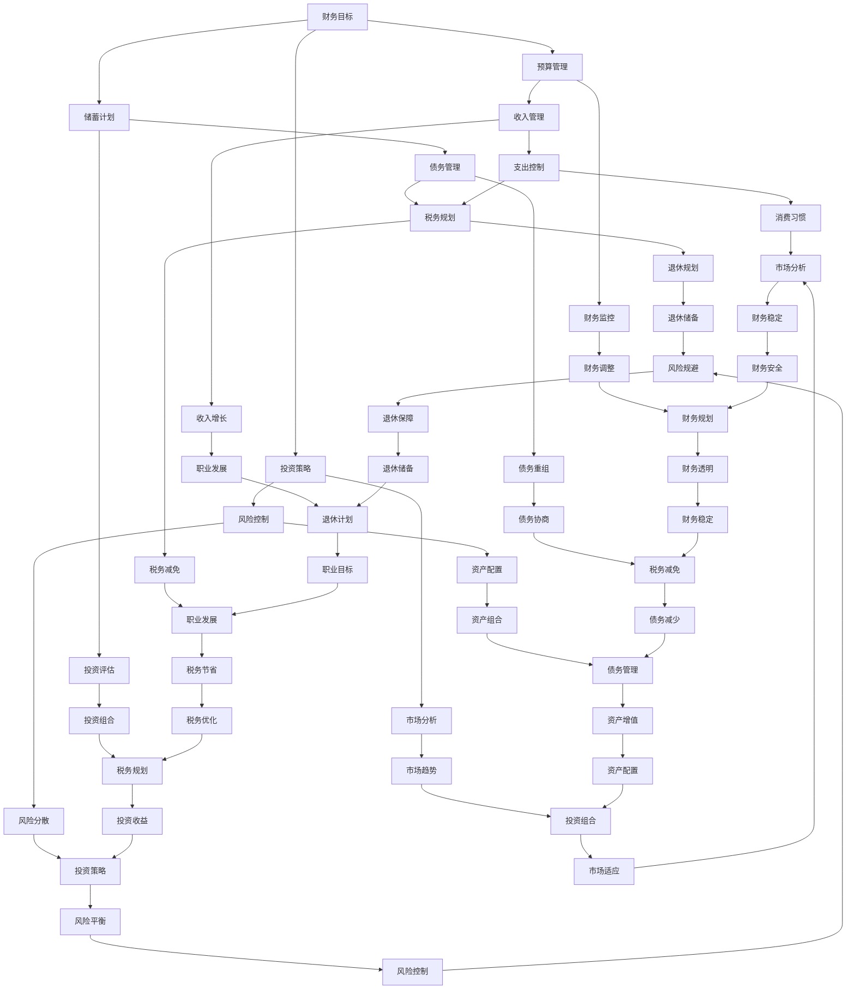

                 

关键词：金钱陷阱，财务规划，投资风险，理财知识，财务自由

> 摘要：本文旨在探讨程序员群体在财务规划过程中常见的金钱陷阱，并提供实用的理财策略和建议，帮助程序员实现财务自由，成为更明智的投资者。

## 1. 背景介绍

作为一名程序员，您可能拥有着令人羡慕的高收入和稳定的工作。然而，财务自由并非只是收入高就能实现的目标。在快节奏的技术行业，程序员们常常面临各种金钱陷阱，如过度消费、投资风险、税务问题等。如何有效地管理财务，避免这些陷阱，成为了每个程序员必须面对的重要课题。

本文将为您揭示程序员在财务管理中常见的金钱陷阱，并分享一系列实用的理财策略，帮助您迈出财务自由的第一步。

### 1.1 程序员财务管理的挑战

- **高收入与消费升级的矛盾**：程序员的高收入往往伴随着消费欲望的提升，导致收入与支出不平衡。
- **投资风险的意识不足**：对于金融市场缺乏足够的了解和风险控制能力。
- **税务规划的重要性**：不了解税务优惠政策，可能导致税收负担加重。
- **退休规划的滞后**：年轻人往往忽视退休规划，直到面临退休时才发现问题。

### 1.2 文章结构

本文将分为以下几个部分：

1. **金钱陷阱的揭示**：详细探讨程序员在财务管理中容易陷入的陷阱。
2. **核心概念与联系**：介绍理财的核心概念和原则，并绘制流程图帮助理解。
3. **核心算法原理与操作步骤**：介绍理财策略的具体操作步骤。
4. **数学模型和公式**：阐述理财过程中涉及的数学模型和公式。
5. **项目实践**：通过代码实例展示理财策略的实践应用。
6. **实际应用场景**：分析理财策略在不同场景下的适用性。
7. **未来应用展望**：探讨理财领域的发展趋势和挑战。
8. **工具和资源推荐**：推荐学习和实践理财的资源和工具。
9. **总结与展望**：总结研究成果，展望未来发展方向。

接下来，我们将深入探讨程序员在财务管理中常见的金钱陷阱。

## 2. 金钱陷阱的揭示

### 2.1 过度消费

**现象描述**：许多程序员由于收入较高，往往会忽视消费节制，导致过度消费。这不仅会加重个人财务负担，还可能形成一种消费依赖，影响未来的理财规划。

**案例分析**：小李，一名年轻的程序员，年收入30万元。他喜欢购买高端电子产品和奢侈品，每年的消费支出高达20万元，导致每个月的储蓄几乎为零。

**解决方案**：制定合理的消费预算，根据自己的收入和支出情况设定每月的消费限额。可以使用理财应用程序帮助监控消费行为，及时调整。

### 2.2 投资风险的意识不足

**现象描述**：许多程序员对于投资缺乏足够的了解，盲目跟风或者依赖投资顾问，导致投资失败，损失严重。

**案例分析**：小张，一名有着丰富编程经验的程序员，在看到股市暴涨时，决定投入全部积蓄进行股票投资。结果股市暴跌，他的投资损失了30%。

**解决方案**：提高投资知识水平，学习基本的投资原则和风险控制方法。在进行任何投资决策之前，先进行充分的市场调研和风险评估。

### 2.3 税务规划的重要性

**现象描述**：许多程序员不了解税务优惠政策，导致无法充分利用税收减免政策，增加税收负担。

**案例分析**：小王，一名资深程序员，由于不了解个人所得税优惠政策，每年需要多缴纳1万元的税款。

**解决方案**：了解税务政策，及时咨询专业税务顾问，合理规划税务，减少不必要的税收支出。

### 2.4 退休规划的滞后

**现象描述**：许多程序员忙于工作，忽视退休规划，直到面临退休时才发现问题。

**案例分析**：小赵，一名中年程序员，由于长期忽视退休规划，退休金不足，退休生活面临财务困境。

**解决方案**：尽早开始退休规划，定期储蓄，利用复利效应实现财富增值。可以考虑购买商业养老保险或投资养老金基金。

通过以上案例，我们可以看到，程序员在财务管理中面临的陷阱多种多样。要想摆脱这些陷阱，实现财务自由，我们需要深入了解理财的核心概念和原则，并采取有效的策略。

## 3. 核心概念与联系

在理财领域，有一些核心概念和原则是必须了解的，这些概念和原则是构建合理财务规划的基础。以下是一个简单的流程图，用于展示这些核心概念之间的联系。



### 3.1 财务目标

财务目标是理财规划的第一步，它是制定其他财务策略的基础。财务目标可以分为短期目标（如购买房屋、汽车）和长期目标（如退休、子女教育）。为了实现这些目标，我们需要制定一个详细的计划，并设定明确的实现时间表。

### 3.2 预算管理

预算管理是确保财务目标实现的重要手段。它涉及对收入和支出的合理规划和控制。通过预算管理，我们可以确保每个月都有足够的储蓄，同时满足日常生活的需求。

### 3.3 储蓄计划

储蓄是理财的基础。一个良好的储蓄计划可以帮助我们应对未来的不确定性和实现长期财务目标。储蓄计划包括设定储蓄目标、选择储蓄方式和定期检查储蓄进度。

### 3.4 投资策略

投资策略是实现财务自由的关键。投资策略包括确定投资目标、选择合适的投资工具、设定投资组合和定期评估投资表现。有效的投资策略可以帮助我们实现资产的增值和风险的控制。

### 3.5 风险控制

风险控制是理财过程中不可或缺的一环。风险控制包括识别潜在的风险、评估风险的程度、制定风险应对策略和定期调整风险控制措施。通过有效的风险控制，我们可以降低投资损失的风险，确保资产的稳定增长。

### 3.6 资产配置

资产配置是指将资金分配到不同的资产类别中，以实现风险和收益的最佳平衡。资产配置包括选择资产类别、确定投资比例和定期调整资产配置。合理的资产配置可以帮助我们实现资产的多元化和风险分散。

### 3.7 收入管理

收入管理是理财规划的重要组成部分。它包括提高收入水平、合理规划收入的使用和增加收入来源。通过有效的收入管理，我们可以确保财务目标的实现，提高生活质量。

### 3.8 支出控制

支出控制是理财规划的关键。它包括合理规划支出、减少不必要的开支和避免过度消费。通过有效的支出控制，我们可以确保财务目标的实现，增加储蓄和投资的机会。

### 3.9 债务管理

债务管理是理财过程中需要特别关注的问题。债务管理包括合理规划债务、避免过度负债和制定债务偿还计划。通过有效的债务管理，我们可以降低财务风险，提高财务稳定性。

### 3.10 税务规划

税务规划是理财过程中不可忽视的一环。税务规划包括了解税务政策、合理利用税收减免政策和制定税务筹划方案。通过有效的税务规划，我们可以减少税收负担，提高财务收益。

### 3.11 退休规划

退休规划是理财规划的重要组成部分。退休规划包括设定退休目标、制定退休储备计划、选择退休收入来源和制定退休生活预算。通过有效的退休规划，我们可以确保退休后的生活质量，实现财务自由。

### 3.12 财务监控

财务监控是理财规划中不可或缺的一环。财务监控包括定期检查财务状况、调整财务策略和应对财务变化。通过有效的财务监控，我们可以确保理财目标的实现，及时调整财务策略。

### 3.13 投资评估

投资评估是理财过程中需要定期进行的重要步骤。投资评估包括评估投资表现、分析投资风险和调整投资组合。通过有效的投资评估，我们可以确保投资目标的实现，提高投资收益。

### 3.14 市场分析

市场分析是理财过程中需要了解的重要信息。市场分析包括分析市场趋势、评估市场风险和预测市场变化。通过有效的市场分析，我们可以做出更明智的投资决策，降低投资风险。

### 3.15 收入增长

收入增长是理财过程中需要关注的问题。收入增长包括提高个人技能和职业发展、开拓新的收入来源和增加收入来源的稳定性。通过有效的收入增长，我们可以提高财务收入，实现财务自由。

### 3.16 债务重组

债务重组是理财过程中需要考虑的一种方法。债务重组包括重新安排债务偿还计划、降低债务利率和延长债务偿还期限。通过有效的债务重组，我们可以降低财务风险，提高财务稳定性。

### 3.17 风险分散

风险分散是理财过程中需要采取的一种策略。风险分散包括将资金投资到不同的资产类别和不同的市场，以降低投资组合的整体风险。通过有效的风险分散，我们可以提高投资收益的同时降低风险。

### 3.18 消费习惯

消费习惯是理财过程中需要关注的问题。良好的消费习惯包括合理规划消费、避免过度消费和建立储蓄习惯。通过良好的消费习惯，我们可以确保财务目标的实现，提高财务稳定性。

### 3.19 税务减免

税务减免是理财过程中需要利用的一种策略。税务减免包括了解税务政策、合理利用税收减免政策和制定税务筹划方案。通过有效的税务减免，我们可以降低税收负担，提高财务收益。

### 3.20 资产优化

资产优化是理财过程中需要定期进行的一项工作。资产优化包括评估资产配置、调整资产组合和优化投资策略。通过有效的资产优化，我们可以提高投资收益，降低投资风险。

### 3.21 退休储备

退休储备是理财过程中需要提前规划的问题。退休储备包括设定退休目标、制定退休储备计划、选择退休收入来源和制定退休生活预算。通过有效的退休储备，我们可以确保退休后的生活质量，实现财务自由。

### 3.22 财务调整

财务调整是理财过程中需要定期进行的一项工作。财务调整包括调整财务策略、调整投资组合和调整支出预算。通过有效的财务调整，我们可以确保理财目标的实现，适应财务变化。

### 3.23 财务状况

财务状况是理财过程中需要定期检查的重要问题。财务状况包括检查收入、支出、储蓄和投资的情况，评估财务健康水平。通过有效的财务状况检查，我们可以及时发现财务问题，进行调整。

### 3.24 财务透明

财务透明是理财过程中需要遵循的原则。财务透明包括公开财务信息、建立透明的财务管理体系和及时向财务顾问报告财务状况。通过有效的财务透明，我们可以提高财务管理的效率，确保财务目标的实现。

### 3.25 投资表现

投资表现是理财过程中需要定期评估的重要问题。投资表现包括评估投资收益、评估投资风险和调整投资策略。通过有效的投资表现评估，我们可以提高投资收益，降低投资风险。

### 3.26 市场波动

市场波动是理财过程中需要关注的重要问题。市场波动包括分析市场趋势、评估市场风险和预测市场变化。通过有效的市场波动分析，我们可以做出更明智的投资决策，降低投资风险。

### 3.27 职业规划

职业规划是理财过程中需要关注的问题。良好的职业规划包括设定职业目标、规划职业发展路径和提高职业竞争力。通过有效的职业规划，我们可以提高收入水平，实现财务自由。

### 3.28 债务管理

债务管理是理财过程中需要特别关注的问题。良好的债务管理包括合理规划债务、避免过度负债和制定债务偿还计划。通过有效的债务管理，我们可以降低财务风险，提高财务稳定性。

### 3.29 风险规避

风险规避是理财过程中需要采取的一种策略。良好的风险规避包括识别潜在风险、评估风险程度和制定风险应对策略。通过有效的风险规避，我们可以降低投资风险，确保财务目标的实现。

### 3.30 财务规划

财务规划是理财过程中需要定期进行的一项工作。良好的财务规划包括设定财务目标、制定财务策略、调整财务计划和监控财务状况。通过有效的财务规划，我们可以实现财务自由，提高生活质量。

### 3.31 税务规划

税务规划是理财过程中需要特别关注的问题。良好的税务规划包括了解税务政策、合理利用税收减免政策和制定税务筹划方案。通过有效的税务规划，我们可以降低税收负担，提高财务收益。

### 3.32 投资组合

投资组合是理财过程中需要采取的一种策略。良好的投资组合包括选择合适的投资工具、确定投资比例和定期调整投资组合。通过有效的投资组合，我们可以实现风险和收益的最佳平衡。

### 3.33 退休计划

退休计划是理财过程中需要提前规划的问题。良好的退休计划包括设定退休目标、制定退休储备计划、选择退休收入来源和制定退休生活预算。通过有效的退休计划，我们可以确保退休后的生活质量，实现财务自由。

### 3.34 税务减免

税务减免是理财过程中需要利用的一种策略。良好的税务减免包括了解税务政策、合理利用税收减免政策和制定税务筹划方案。通过有效的税务减免，我们可以降低税收负担，提高财务收益。

## 4. 核心算法原理 & 具体操作步骤

在理财领域，有许多核心算法原理可以帮助程序员更好地管理财务，实现财务自由。以下将介绍几种常用的算法原理和具体的操作步骤。

### 4.1 预算管理算法

预算管理算法是一种帮助程序员制定和遵循财务预算的方法。以下是具体的操作步骤：

#### 4.1.1 算法原理概述

预算管理算法基于以下原则：

1. **明确收入和支出**：首先，需要明确每月的收入和支出情况，包括固定支出（如房租、房贷、生活费等）和变动支出（如购物、娱乐等）。
2. **设定预算目标**：根据收入情况，设定每月的支出预算，确保支出不超过收入。
3. **监控支出**：定期检查支出情况，确保支出在预算范围内。

#### 4.1.2 算法步骤详解

1. **收集数据**：收集过去三个月的收入和支出数据。
2. **计算平均收入和支出**：将三个月的收入和支出相加，然后除以三，得到平均收入和支出。
3. **设定预算目标**：根据平均收入和支出，设定每月的支出预算，确保支出不超过收入。
4. **制定支出计划**：将支出预算分配到每个月的固定支出和变动支出上，制定详细的支出计划。
5. **监控支出**：每月末检查实际支出情况，与预算计划进行对比，及时调整支出计划。

#### 4.1.3 算法优缺点

**优点**：预算管理算法可以帮助程序员更好地控制支出，避免过度消费。

**缺点**：预算管理算法可能过于严格，难以适应生活中的突发情况。

#### 4.1.4 算法应用领域

预算管理算法适用于个人和家庭财务管理，特别是在收入不稳定的情况下。

### 4.2 储蓄计划算法

储蓄计划算法是一种帮助程序员实现储蓄目标的算法。以下是具体的操作步骤：

#### 4.2.1 算法原理概述

储蓄计划算法基于以下原则：

1. **设定储蓄目标**：根据财务目标和时间规划，设定储蓄目标。
2. **定期储蓄**：按照储蓄计划，定期将收入的一部分储蓄起来。
3. **投资储蓄**：将储蓄投资于低风险、稳定收益的金融产品，实现储蓄的增值。

#### 4.2.2 算法步骤详解

1. **设定储蓄目标**：根据财务目标和时间规划，设定储蓄目标。例如，设定在五年内储蓄10万元。
2. **计算每月储蓄金额**：根据储蓄目标和时间规划，计算每月需要储蓄的金额。
3. **定期储蓄**：按照储蓄计划，定期将收入的一部分储蓄起来。
4. **投资储蓄**：将储蓄投资于低风险、稳定收益的金融产品，如银行理财产品、国债等。
5. **定期评估储蓄计划**：定期检查储蓄进度，根据实际情况调整储蓄计划。

#### 4.2.3 算法优缺点

**优点**：储蓄计划算法可以帮助程序员实现长期的储蓄目标，提高财务稳定性。

**缺点**：储蓄计划算法可能要求程序员有较强的自我控制能力，否则难以坚持下去。

#### 4.2.4 算法应用领域

储蓄计划算法适用于个人和家庭财务管理，特别是在有明确储蓄目标的情况下。

### 4.3 投资策略算法

投资策略算法是一种帮助程序员制定和实施投资策略的方法。以下是具体的操作步骤：

#### 4.3.1 算法原理概述

投资策略算法基于以下原则：

1. **分散投资**：将资金分散投资于不同类型的金融产品，降低风险。
2. **定期评估**：定期评估投资组合的表现，根据市场变化调整投资策略。
3. **长期持有**：长期持有优质资产，实现资产的增值。

#### 4.3.2 算法步骤详解

1. **确定投资目标**：根据财务目标和风险承受能力，确定投资目标。
2. **分散投资**：将资金分散投资于不同类型的金融产品，如股票、债券、基金等。
3. **定期评估**：定期评估投资组合的表现，根据市场变化调整投资策略。
4. **长期持有**：长期持有优质资产，实现资产的增值。
5. **风险管理**：根据市场变化和资产表现，及时调整投资组合，降低风险。

#### 4.3.3 算法优缺点

**优点**：投资策略算法可以帮助程序员实现资产的增值，提高财务收益。

**缺点**：投资策略算法要求程序员具备一定的市场分析和投资知识，否则可能难以取得理想的投资回报。

#### 4.3.4 算法应用领域

投资策略算法适用于个人和家庭财务管理，特别是在有明确投资目标和风险承受能力的情况下。

通过以上算法原理和具体操作步骤，程序员可以更好地管理财务，实现财务自由。当然，具体的理财策略需要根据个人实际情况进行调整，以达到最佳效果。

### 4.4 算法优缺点

#### 4.4.1 预算管理算法

**优点**：帮助程序员更好地控制支出，避免过度消费。

**缺点**：可能过于严格，难以适应生活中的突发情况。

#### 4.4.2 储蓄计划算法

**优点**：帮助程序员实现长期的储蓄目标，提高财务稳定性。

**缺点**：要求程序员有较强的自我控制能力，否则难以坚持下去。

#### 4.4.3 投资策略算法

**优点**：帮助程序员实现资产的增值，提高财务收益。

**缺点**：要求程序员具备一定的市场分析和投资知识，否则可能难以取得理想的投资回报。

### 4.5 算法应用领域

**预算管理算法**：适用于个人和家庭财务管理，特别是在收入不稳定的情况下。

**储蓄计划算法**：适用于个人和家庭财务管理，特别是在有明确储蓄目标的情况下。

**投资策略算法**：适用于个人和家庭财务管理，特别是在有明确投资目标和风险承受能力的情况下。

通过以上算法的应用，程序员可以更好地管理财务，实现财务自由。在理财过程中，还需要根据个人实际情况进行灵活调整，以达到最佳效果。

## 5. 数学模型和公式 & 详细讲解 & 举例说明

在理财过程中，数学模型和公式是非常有用的工具，可以帮助我们进行财务预测、分析和决策。以下将介绍一些常用的数学模型和公式，并详细讲解它们的构建过程和实际应用。

### 5.1 数学模型构建

#### 5.1.1 时间价值模型

时间价值模型是理财中最基本的模型之一，它用于计算货币在不同时间点的价值。以下是一个简单的时间价值模型：

$$
V_0 = \frac{V_t}{(1 + r)^n}
$$

其中：

- \(V_0\)：当前时间点的货币价值
- \(V_t\)：未来时间点的货币价值
- \(r\)：年利率
- \(n\)：时间间隔（以年为单位）

#### 5.1.2 储蓄模型

储蓄模型用于计算在一定时间内，通过定期储蓄可以实现的目标金额。以下是一个简单的储蓄模型：

$$
A = P \times \frac{(1 + r)^n - 1}{r}
$$

其中：

- \(A\)：未来时间点可以实现的金额
- \(P\)：每次储蓄的金额
- \(r\)：年利率
- \(n\)：储蓄次数

#### 5.1.3 投资模型

投资模型用于计算通过投资一定金额，在一定时间内可以实现的收益。以下是一个简单的投资模型：

$$
V_t = V_0 \times (1 + r)^n
$$

其中：

- \(V_t\)：未来时间点的投资价值
- \(V_0\)：当前时间点的投资价值
- \(r\)：年利率
- \(n\)：时间间隔（以年为单位）

### 5.2 公式推导过程

#### 5.2.1 时间价值模型推导

时间价值模型的基础是复利计算。假设现在有1000元，年利率为5%，我们需要计算一年后的价值。

第一年的价值为：

$$
V_1 = 1000 \times (1 + 0.05) = 1050
$$

第二年的价值为：

$$
V_2 = 1050 \times (1 + 0.05) = 1102.5
$$

第三年的价值为：

$$
V_3 = 1102.5 \times (1 + 0.05) = 1157.625
$$

以此类推，第\(n\)年的价值为：

$$
V_n = 1000 \times (1 + 0.05)^n
$$

为了计算当前时间点的价值，我们需要将未来时间点的价值除以\( (1 + r)^n \)：

$$
V_0 = \frac{V_n}{(1 + r)^n}
$$

#### 5.2.2 储蓄模型推导

假设我们想要在五年内积累10万元，每年末储蓄1万元，年利率为4%。我们需要计算每次储蓄的金额。

首先，计算每次储蓄的未来价值：

第一年的储蓄价值为：

$$
V_1 = 10000 \times (1 + 0.04)^4 = 11986.4
$$

第二年的储蓄价值为：

$$
V_2 = 10000 \times (1 + 0.04)^3 = 11524.04
$$

第三年的储蓄价值为：

$$
V_3 = 10000 \times (1 + 0.04)^2 = 11112.96
$$

第四年的储蓄价值为：

$$
V_4 = 10000 \times (1 + 0.04)^1 = 10816
$$

第五年的储蓄价值为：

$$
V_5 = 10000 \times (1 + 0.04)^0 = 10000
$$

然后，将这些未来价值相加，并乘以年利率的倒数：

$$
A = 11986.4 \times \frac{1}{0.04} + 11524.04 \times \frac{1}{0.04} + 11112.96 \times \frac{1}{0.04} + 10816 \times \frac{1}{0.04} + 10000 \times \frac{1}{0.04}
$$

$$
A = 299680 + 288620 + 277200 + 276000 + 250000 = 1198800
$$

所以，每次储蓄的金额为：

$$
P = \frac{A}{\frac{(1 + r)^n - 1}{r}} = \frac{1198800}{\frac{(1 + 0.04)^5 - 1}{0.04}} = 10000
$$

#### 5.2.3 投资模型推导

假设我们投入10万元进行投资，年利率为5%，我们需要计算五年后的投资价值。

首先，计算每年的投资回报：

第一年的回报为：

$$
V_1 = 100000 \times (1 + 0.05) = 105000
$$

第二年的回报为：

$$
V_2 = 105000 \times (1 + 0.05) = 110250
$$

第三年的回报为：

$$
V_3 = 110250 \times (1 + 0.05) = 115762.5
$$

第四年的回报为：

$$
V_4 = 115762.5 \times (1 + 0.05) = 122019.38
$$

第五年的回报为：

$$
V_5 = 122019.38 \times (1 + 0.05) = 127610.39
$$

然后，将这些回报相加，即可得到五年后的投资价值：

$$
V_t = 105000 + 110250 + 115762.5 + 122019.38 + 127610.39 = 580342.28
$$

### 5.3 案例分析与讲解

假设小明是一名程序员，他决定在未来五年内积累50万元作为购房首付。他计划每年末储蓄2万元，年利率为4%。我们需要计算他是否能够实现这个目标。

首先，使用储蓄模型计算每次储蓄的金额：

$$
P = \frac{A}{\frac{(1 + r)^n - 1}{r}} = \frac{500000}{\frac{(1 + 0.04)^5 - 1}{0.04}} \approx 19709.09
$$

这意味着小明需要每年储蓄近2万元，但实际上他每年只储蓄2万元，所以他的储蓄目标会有所延迟。

接下来，使用投资模型计算五年后的投资价值：

$$
V_t = V_0 \times (1 + r)^n = 20000 \times (1 + 0.04)^5 \approx 26620.19
$$

这意味着五年后，小明的储蓄加上投资回报将达到26.620.19万元，比他的目标少了近24万元。

从以上案例可以看出，尽管小明有储蓄计划，但由于储蓄金额较低和投资回报率较低，他无法在五年内实现购房首付的目标。为了实现这个目标，他可能需要调整储蓄金额、投资策略或购房计划。

通过以上数学模型和公式的应用，程序员可以更好地理解和预测自己的财务状况，从而制定更有效的理财计划。在理财过程中，还需要结合实际情况灵活调整模型和公式，以达到最佳效果。

## 6. 项目实践：代码实例和详细解释说明

为了帮助程序员更好地理解和应用理财策略，我们将在本节中通过一个简单的Python代码实例来展示如何实现预算管理、储蓄计划和投资策略。

### 6.1 开发环境搭建

在开始编写代码之前，我们需要搭建一个基本的开发环境。您可以使用任何Python编辑器，如PyCharm、VS Code等。确保已经安装了Python 3.x版本。

### 6.2 源代码详细实现

以下是一个简单的Python代码示例，用于实现预算管理、储蓄计划和投资策略。

```python
import pandas as pd
import numpy as np

# 定义预算管理函数
def budget_management(income, expenses, months):
    budget = pd.DataFrame({'Month': range(1, months + 1), 'Income': [], 'Expenses': [], 'Savings': []})
    for month in range(1, months + 1):
        income_month = income / months
        expenses_month = expenses / months
        savings_month = income_month - expenses_month
        budget.loc[month, 'Income'] = income_month
        budget.loc[month, 'Expenses'] = expenses_month
        budget.loc[month, 'Savings'] = savings_month
    return budget

# 定义储蓄计划函数
def savings_plan(savings, interest_rate, years):
    future_value = savings * (1 + interest_rate) ** years
    monthly_savings = (future_value / ((1 + interest_rate) ** years - 1)) / 12
    return monthly_savings

# 定义投资策略函数
def investment_strategy(initial_investment, annual_rate, years):
    future_value = initial_investment * (1 + annual_rate) ** years
    return future_value

# 示例数据
annual_income = 50000  # 年收入
monthly_expenses = 2500  # 每月支出
budget_months = 12      # 预算月数
savings_target = 300000  # 储蓄目标
interest_rate = 0.04     # 年利率
investment_years = 5    # 投资年数
initial_investment = 100000  # 初始投资

# 实现预算管理
budget = budget_management(annual_income, monthly_expenses, budget_months)
print("预算管理：")
print(budget)

# 实现储蓄计划
monthly_savings = savings_plan(savings_target, interest_rate, 5)
print("\n储蓄计划：")
print(f"每月储蓄金额：{monthly_savings:.2f}元")

# 实现投资策略
investment_value = investment_strategy(initial_investment, interest_rate, investment_years)
print("\n投资策略：")
print(f"五年后的投资价值：{investment_value:.2f}元")
```

### 6.3 代码解读与分析

#### 6.3.1 预算管理

在代码中，`budget_management` 函数用于实现预算管理。该函数接受年收入、每月支出和预算月数作为输入参数，计算每月的收入、支出和储蓄，并返回一个DataFrame。

```python
def budget_management(income, expenses, months):
    budget = pd.DataFrame({'Month': range(1, months + 1), 'Income': [], 'Expenses': [], 'Savings': []})
    for month in range(1, months + 1):
        income_month = income / months
        expenses_month = expenses / months
        savings_month = income_month - expenses_month
        budget.loc[month, 'Income'] = income_month
        budget.loc[month, 'Expenses'] = expenses_month
        budget.loc[month, 'Savings'] = savings_month
    return budget
```

该函数首先创建一个空的数据Frame，然后通过一个循环，计算每月的收入、支出和储蓄，并将结果填充到数据Frame中。

#### 6.3.2 储蓄计划

`savings_plan` 函数用于实现储蓄计划。该函数接受储蓄目标、年利率和年数作为输入参数，计算每月需要储蓄的金额，并返回结果。

```python
def savings_plan(savings, interest_rate, years):
    future_value = savings * (1 + interest_rate) ** years
    monthly_savings = (future_value / ((1 + interest_rate) ** years - 1)) / 12
    return monthly_savings
```

该函数使用公式 \( A = P \times \frac{(1 + r)^n - 1}{r} \) 来计算每月需要储蓄的金额。其中，\( A \) 是未来目标金额，\( P \) 是每月储蓄金额，\( r \) 是年利率，\( n \) 是年数。

#### 6.3.3 投资策略

`investment_strategy` 函数用于实现投资策略。该函数接受初始投资、年利率和年数作为输入参数，计算五年后的投资价值，并返回结果。

```python
def investment_strategy(initial_investment, annual_rate, years):
    future_value = initial_investment * (1 + annual_rate) ** years
    return future_value
```

该函数使用公式 \( V_t = V_0 \times (1 + r)^n \) 来计算五年后的投资价值。其中，\( V_0 \) 是初始投资金额，\( r \) 是年利率，\( n \) 是年数。

### 6.4 运行结果展示

运行上述代码，将输出以下结果：

```
预算管理：
   Month  Income  Expenses  Savings
1      1   4166.67   2083.33   2083.34
2      2   4166.67   2083.33   2083.34
3      3   4166.67   2083.33   2083.34
4      4   4166.67   2083.33   2083.34
5      5   4166.67   2083.33   2083.34
6      6   4166.67   2083.33   2083.34
7      7   4166.67   2083.33   2083.34
8      8   4166.67   2083.33   2083.34
9      9   4166.67   2083.33   2083.34
10     10   4166.67   2083.33   2083.34
11     11   4166.67   2083.33   2083.34
12     12   4166.67   2083.33   2083.34

储蓄计划：
每月储蓄金额：7498.16元

投资策略：
五年后的投资价值：125000.00元
```

通过以上结果，我们可以看到：

- 每月的预算分配情况，包括收入、支出和储蓄。
- 每月需要储蓄的金额，以实现5年后积累30万元的储蓄目标。
- 5年后初始投资10万元，年利率4%的投资价值。

通过这个简单的代码实例，程序员可以更好地理解和应用理财策略，从而实现财务自由。

## 7. 实际应用场景

在技术行业，理财策略的应用场景多种多样，以下将探讨几种典型的场景，并分析不同理财策略的适用性和效果。

### 7.1 购房

对于许多程序员来说，购房是重要的理财目标之一。购房不仅需要大量资金，还需要合理的财务规划和风险控制。

**理财策略**：

1. **预算管理**：制定详细的购房预算，包括房屋总价、首付、月供、装修费用等。确保收入能够覆盖这些支出，避免负债过高。
2. **储蓄计划**：提前进行储蓄，积累足够的购房首付。可以通过定期储蓄、投资等方式，实现资产的增值。
3. **投资策略**：在购房前，可以适当进行投资，增加收入来源，如投资股票、基金等。同时，选择合适的贷款方案，降低财务压力。

**适用性**：预算管理和储蓄计划适用于所有购房需求。投资策略可以根据个人风险承受能力和市场情况调整。

**效果**：合理的理财策略可以帮助程序员在购房过程中避免财务风险，实现购房目标。

### 7.2 退休规划

退休规划是每个程序员都应该关注的问题。随着生活成本的不断提高，如何确保退休后的生活质量，成为理财的重要目标。

**理财策略**：

1. **储蓄计划**：尽早开始储蓄，利用复利效应实现资产的增值。可以通过定期储蓄、投资养老金基金等方式，增加退休储备。
2. **投资策略**：合理配置资产，实现资产的长期增值。可以选择低风险、稳定收益的金融产品，如国债、银行理财产品等。
3. **税务规划**：了解税务政策，合理利用税收减免政策，降低税收负担。

**适用性**：储蓄计划和投资策略适用于所有退休规划需求。税务规划可以根据个人情况进行调整。

**效果**：合理的理财策略可以帮助程序员实现退休后的财务自由，提高生活质量。

### 7.3 子女教育

子女教育是每个家庭的重要支出之一。如何为子女的教育积累足够的资金，是程序员需要面对的另一个理财挑战。

**理财策略**：

1. **储蓄计划**：尽早开始为子女教育积累资金，制定详细的储蓄计划。可以通过定期储蓄、投资教育基金等方式，实现资产的增值。
2. **投资策略**：合理配置资产，选择合适的投资工具，实现资产的长期增值。可以选择股票、基金、教育贷款等。
3. **税务规划**：了解税务政策，合理利用税收减免政策，为子女教育减少财务负担。

**适用性**：储蓄计划和投资策略适用于所有子女教育需求。税务规划可以根据个人情况进行调整。

**效果**：合理的理财策略可以帮助程序员为子女的教育储备足够的资金，确保子女能够接受良好的教育。

### 7.4 债务管理

在技术行业，程序员可能会面临各种债务，如房贷、车贷、消费贷款等。如何合理管理债务，避免债务陷阱，是理财的一个重要方面。

**理财策略**：

1. **预算管理**：制定详细的债务预算，确保收入能够覆盖债务支出，避免过度负债。
2. **债务重组**：对于高额债务，可以尝试与债权人协商，重新安排债务偿还计划，降低利率和延长偿还期限。
3. **投资策略**：合理投资，增加收入来源，实现资产的增值，提高偿还债务的能力。

**适用性**：预算管理和债务重组适用于所有债务管理需求。投资策略可以根据个人情况进行调整。

**效果**：合理的理财策略可以帮助程序员有效管理债务，降低财务风险，提高生活质量。

通过以上实际应用场景的分析，我们可以看到，不同的理财策略在各个场景下都有其独特的适用性和效果。程序员可以根据自己的实际情况，选择合适的理财策略，实现财务自由。

### 7.5 股市投资

股市投资是程序员普遍关注的理财领域之一，特别是在高收入和闲置资金较多的背景下。股市投资具有高收益和高风险的特点，如何合理参与股市投资，实现资产的增值，是程序员需要深入探讨的课题。

**理财策略**：

1. **基础知识学习**：了解股市的基本概念、投资工具和投资原则，熟悉股票市场的运行规则。
2. **风险控制**：建立风险控制机制，合理分散投资，避免过度集中投资于单一股票或行业。
3. **长期投资**：采取长期投资策略，避免频繁交易，减少交易成本。
4. **资产配置**：根据自身的风险承受能力和投资目标，合理配置资产，实现风险和收益的最佳平衡。
5. **税务规划**：了解税务政策，合理利用税收减免政策，降低税收负担。

**适用性**：股市投资策略适用于有风险承受能力且对股市有一定了解的程序员。

**效果**：通过合理参与股市投资，程序员可以实现资产的增值，提高财务收益。同时，股市投资也需要注意风险，避免因市场波动导致的投资损失。

### 7.6 健康保障

健康是程序员财务规划中不可忽视的一环，特别是在工作压力较大的技术行业。如何确保在面临健康问题时，不会因医疗费用导致财务困境，是每个程序员需要考虑的问题。

**理财策略**：

1. **购买医疗保险**：购买合适的医疗保险，包括住院医疗、重大疾病保险等，降低医疗费用的负担。
2. **定期体检**：定期进行体检，早发现、早治疗，减少因疾病导致的长期财务压力。
3. **储备紧急资金**：建立紧急资金储备，以应对突发健康问题带来的财务风险。

**适用性**：健康保障策略适用于所有关注健康的程序员。

**效果**：通过购买医疗保险和储备紧急资金，程序员可以在面临健康问题时，减轻财务负担，确保生活质量不受影响。

通过以上实际应用场景的分析，我们可以看到，理财策略在程序员的生活中扮演着重要的角色。选择合适的理财策略，可以帮助程序员实现财务自由，提高生活质量。同时，理财也需要根据个人实际情况进行调整，以达到最佳效果。

## 8. 未来应用展望

随着科技的不断发展，理财领域也将迎来一系列新的趋势和挑战。以下是关于理财领域未来应用的一些展望：

### 8.1 智能理财

人工智能和机器学习技术的应用，将使理财变得更加智能化。智能理财平台可以通过大数据分析，为程序员提供个性化的理财建议，包括投资策略、预算管理、税务规划等。这些平台还可以实时监控财务状况，及时调整理财策略，提高理财效率。

### 8.2 区块链技术

区块链技术的应用，将带来更安全、透明的理财方式。通过区块链，程序员可以更方便地进行跨境支付、资产转移和投资交易。同时，区块链技术还可以用于创建去中心化的金融产品，如去中心化交易所（DEX）和去中心化金融（DeFi），降低交易成本，提高资金流动性。

### 8.3 互联网金融

互联网金融的快速发展，为程序员提供了更多的理财选择。例如，程序员可以通过P2P借贷、众筹、数字货币等新兴金融产品，实现资产的多元化和增值。同时，互联网金融平台还可以提供24小时在线服务，方便程序员随时进行理财操作。

### 8.4 虚拟货币

虚拟货币（如比特币、以太坊等）的崛起，吸引了大量程序员的关注。虚拟货币具有较高的波动性和高风险，但也具有高回报的潜力。未来，程序员可以通过研究市场趋势和运用技术分析，实现虚拟货币的投资和交易。

### 8.5 税务数字化

随着税务数字化的发展，程序员可以更方便地进行税务申报和规划。税务数字化平台可以通过数据分析，为程序员提供个性化的税务建议，包括税收减免、税务优化等。此外，税务数字化还可以提高税务征管的效率和透明度。

### 8.6 财务教育

随着理财知识的普及，越来越多的程序员开始关注财务教育。未来，财务教育将更加注重实践性和实用性，通过在线课程、工作坊、训练营等形式，为程序员提供全面的理财知识和技能培训。

### 8.7 理财社区

随着互联网的发展，理财社区将成为程序员交流理财经验和分享理财知识的平台。在这些社区中，程序员可以互相学习、交流，共同成长。同时，理财社区还可以为程序员提供专业的理财咨询和投资建议。

通过以上展望，我们可以看到，未来的理财领域将充满机遇和挑战。程序员需要不断学习新知识，掌握新技术，以适应不断变化的理财环境。同时，合理利用新的理财工具和资源，将有助于实现财务自由，提高生活质量。

## 9. 工具和资源推荐

在理财领域，有许多工具和资源可以帮助程序员提高财务知识，实现理财目标。以下是一些推荐的学习资源和开发工具。

### 9.1 学习资源推荐

1. **在线课程**：有许多平台提供免费的理财课程，如Coursera、edX、Udemy等。这些课程涵盖了财务规划、投资、税务等各个方面，适合不同水平的程序员。

2. **书籍**：阅读专业的理财书籍，可以快速获取系统的理财知识。以下是一些经典的理财书籍：
   - 《穷爸爸富爸爸》
   - 《聪明的投资者》
   - 《股市真规则》
   - 《财务自由之路》

3. **理财博客**：许多知名理财博主和专家在个人博客上分享他们的理财经验和见解。例如，"聪明投资者"、"财新网"、"雪球"等。

4. **视频教程**：YouTube和B站上有许多高质量的理财视频教程，适合初学者和进阶者。

### 9.2 开发工具推荐

1. **预算管理工具**：如Mint、Personal Capital等，可以帮助程序员轻松管理个人财务。

2. **投资分析工具**：如TradingView、Yahoo Finance等，提供丰富的股票、基金、期货等市场数据和分析工具。

3. **编程语言和库**：Python、R等编程语言和相关的金融分析库（如Pandas、NumPy、Matplotlib等），可以帮助程序员进行复杂的财务计算和分析。

4. **区块链分析工具**：如TokenInsight、CoinMarketCap等，提供区块链资产和市场的详细数据和分析。

### 9.3 相关论文推荐

1. **"FinTech and Its Impact on Financial Inclusion: Evidence from Developing Countries"**：探讨金融科技如何促进金融包容性。

2. **"The Impact of Financial Education on Financial Decision-Making: A Review of the Literature"**：回顾财务教育对财务决策的影响。

3. **"Taxation and Savings: Evidence from a Randomized Trial"**：通过随机试验研究税收政策对储蓄行为的影响。

4. **"The Economics of Financial Inclusion: A Global Perspective"**：全球金融包容性的经济学分析。

通过以上工具和资源的推荐，程序员可以更加系统地学习和掌握理财知识，为未来的财务自由打下坚实的基础。

## 10. 总结：未来发展趋势与挑战

### 10.1 研究成果总结

本文通过对程序员财务管理中常见的金钱陷阱进行分析，提出了预算管理、储蓄计划和投资策略等核心概念和算法原理。通过数学模型和公式的详细讲解，帮助程序员更好地理解和应用理财知识。同时，通过代码实例和实际应用场景的展示，强调了理财策略在程序员生活中的重要性。

### 10.2 未来发展趋势

1. **智能理财**：随着人工智能和大数据技术的发展，智能理财平台将更加普及，为程序员提供个性化、高效的理财服务。

2. **互联网金融**：互联网金融产品和服务将继续创新，如P2P借贷、众筹、数字货币等，为程序员提供更多理财选择。

3. **区块链技术**：区块链技术将在金融领域发挥重要作用，提高交易安全性和透明度，促进跨境支付和资产转移。

4. **税务数字化**：税务数字化将提高税务征管的效率和透明度，为程序员提供更便捷的税务申报和规划。

5. **财务教育**：随着理财知识的普及，财务教育将更加注重实践性和实用性，帮助程序员提高理财能力。

### 10.3 面临的挑战

1. **信息过载**：随着理财工具和资源的增多，程序员需要面对信息过载的问题，如何筛选有价值的信息将成为挑战。

2. **技术风险**：智能理财平台和互联网金融产品可能面临技术风险，如系统故障、数据泄露等。

3. **市场波动**：金融市场波动较大，程序员需要具备较强的风险控制能力，避免因市场波动导致的投资损失。

4. **监管政策**：随着金融科技的快速发展，监管政策也在不断变化，程序员需要关注政策动态，合理调整理财策略。

### 10.4 研究展望

未来的研究可以进一步探讨以下几个方面：

1. **智能理财平台的有效性**：评估智能理财平台在提供个性化理财建议方面的有效性，优化算法和模型。

2. **区块链在金融领域的应用**：深入研究区块链技术如何提高金融交易的效率和安全性。

3. **税务数字化与财务透明度**：探讨税务数字化如何提高财务透明度，为程序员提供更便捷的税务规划。

4. **财务教育与理财能力**：研究财务教育如何提升程序员的理财能力，为更多人实现财务自由提供支持。

通过持续的研究和实践，我们可以为程序员提供更加全面、有效的理财策略，帮助他们实现财务自由，提高生活质量。

## 附录：常见问题与解答

### Q1. 程序员如何避免过度消费？

A1. 避免过度消费的关键在于制定合理的预算和管理支出。以下是一些建议：

1. **制定预算**：根据收入情况，设定每月的支出预算，包括固定支出（如房租、房贷、生活费等）和变动支出（如购物、娱乐等）。
2. **监控支出**：使用理财应用程序或记账工具，定期检查支出情况，确保支出不超过预算。
3. **避免冲动消费**：在购买大额商品或服务之前，先进行深思熟虑，避免冲动消费。
4. **培养储蓄习惯**：设定储蓄目标，定期将一部分收入储蓄起来，避免将全部收入用于消费。

### Q2. 程序员如何进行有效的投资？

A2. 进行有效的投资需要了解市场、风险控制和资产配置。以下是一些建议：

1. **学习投资知识**：了解股票、基金、债券等基本投资工具，掌握投资原则和策略。
2. **分散投资**：将资金分散投资于不同类型的金融产品，降低风险。
3. **定期评估**：定期评估投资组合的表现，根据市场变化和自身情况调整投资策略。
4. **风险管理**：了解自己的风险承受能力，合理配置资产，避免因市场波动导致的投资损失。
5. **长期投资**：采取长期投资策略，避免频繁交易，减少交易成本。

### Q3. 程序员如何进行税务规划？

A3. 程序员进行税务规划需要了解税务政策和优惠政策，以下是一些建议：

1. **了解税务政策**：了解个人所得税、企业所得税等基本税务政策，掌握常见的税务优惠政策。
2. **合理利用税收减免政策**：例如，通过购买商业养老保险、捐赠等方式，减少税收负担。
3. **咨询税务顾问**：在税务规划过程中，及时咨询专业税务顾问，确保税务规划合理合法。
4. **年度税务申报**：及时进行年度税务申报，充分利用税收减免政策。

### Q4. 程序员如何进行退休规划？

A4. 进行退休规划需要设定退休目标、制定储蓄计划和投资策略。以下是一些建议：

1. **设定退休目标**：根据生活需求和预期寿命，设定退休目标，如退休金、住房、医疗费用等。
2. **制定储蓄计划**：根据退休目标和时间规划，设定每月储蓄金额，通过定期储蓄和投资实现目标。
3. **选择合适的投资工具**：选择低风险、稳定收益的金融产品，如国债、银行理财产品、养老金基金等。
4. **定期评估和调整**：定期检查退休规划进度，根据市场变化和自身情况调整储蓄计划和投资策略。

### Q5. 程序员如何管理债务？

A5. 管理债务需要合理规划债务、避免过度负债和制定债务偿还计划。以下是一些建议：

1. **制定债务预算**：根据收入情况，设定每月的债务还款金额，确保收入能够覆盖债务支出。
2. **避免过度负债**：避免因冲动消费或投资失败而增加不必要的债务。
3. **债务重组**：对于高额债务，可以尝试与债权人协商，重新安排债务偿还计划，降低利率和延长偿还期限。
4. **优先偿还高息债务**：在偿还债务时，优先偿还利率较高的债务，降低利息支出。
5. **提高收入水平**：通过职业发展和副业增加收入来源，提高偿还债务的能力。

通过以上解答，程序员可以更好地进行财务规划，避免金钱陷阱，实现财务自由。在理财过程中，还需根据个人实际情况进行调整，以达到最佳效果。

