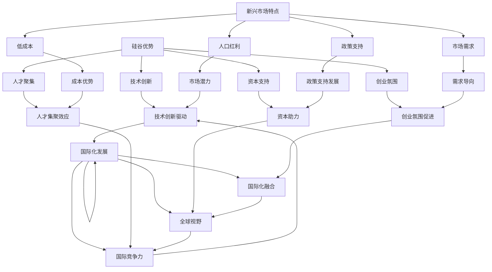

                 

关键词：程序员，国际化，发展，硅谷，新兴市场，机遇，技术交流，职业规划

> 摘要：本文将探讨程序员在国际范围内，尤其是在硅谷与新兴市场之间的发展机遇。通过对硅谷作为全球科技中心的独特优势和新兴市场的崛起进行分析，旨在为程序员提供职业发展的方向和建议。

## 1. 背景介绍

在全球化的背景下，信息技术行业的发展日新月异，程序员作为该行业的中坚力量，正面临着前所未有的机遇和挑战。硅谷，作为全球科技创新的象征，吸引了无数优秀程序员前来追梦；而新兴市场，如中国、印度、巴西等国家，随着科技产业的蓬勃发展，正成为程序员职业发展的新热土。本文旨在通过对硅谷与新兴市场的对比分析，为程序员的国际化发展提供有价值的参考。

## 2. 核心概念与联系

为了更好地理解程序员在硅谷与新兴市场的机遇，我们需要明确以下几个核心概念：

- **硅谷的优势**：技术创新、创业氛围、资本支持、人才聚集
- **新兴市场的特点**：人口红利、市场需求、政策支持、低成本
- **国际化发展**：跨文化沟通、全球视野、国际交流与合作

接下来，我们将使用Mermaid流程图来展示这些概念之间的联系：



### 2.1 硅谷的优势

硅谷作为全球科技创新的领军者，其优势主要体现在以下几个方面：

1. **技术创新**：硅谷汇聚了全球顶尖的科技企业和创新人才，持续推动着人工智能、云计算、物联网等前沿技术的进步。
2. **创业氛围**：硅谷拥有浓厚的创业氛围，许多成功的科技公司如谷歌、苹果、Facebook等，都是从这里起家。
3. **资本支持**：硅谷拥有强大的风险投资体系，为创新项目提供了充足的资金支持。
4. **人才聚集**：硅谷吸引了全球各地的人才，形成了丰富的人才库，这为技术发展和创新提供了坚实的基础。

### 2.2 新兴市场的特点

新兴市场国家在科技产业的发展中也展现了独特的优势：

1. **人口红利**：拥有庞大的人口基数，为科技产业提供了丰富的劳动力资源。
2. **市场需求**：随着经济发展和消费者购买力的提升，对科技产品的需求日益增长。
3. **政策支持**：政府出台了一系列扶持政策，促进了科技产业的快速发展。
4. **低成本**：相对较低的生活成本和工作成本，吸引了大量国际投资和人才。

### 2.3 国际化发展

国际化发展是程序员在全球范围内拓展职业道路的关键。这包括跨文化沟通、全球视野和国际交流与合作：

1. **跨文化沟通**：程序员需要具备跨文化沟通能力，以便在国际团队中有效协作。
2. **全球视野**：程序员需要具备全球视野，了解不同国家和地区的市场和技术趋势。
3. **国际交流与合作**：积极参与国际技术交流与合作，拓展人脉资源和职业发展机会。

## 3. 核心算法原理 & 具体操作步骤

在国际化发展的过程中，程序员需要掌握一系列的核心算法原理，这些原理不仅有助于提升编程技能，还能提高解决问题的能力。以下是几个核心算法原理及其具体操作步骤：

### 3.1 算法原理概述

1. **动态规划**：用于解决最优化问题，通过将问题分解成子问题并存储子问题的解，避免重复计算。
2. **贪心算法**：通过每一步选择局部最优解，最终得到全局最优解。
3. **图算法**：用于处理网络问题，如最短路径、最大流等。

### 3.2 算法步骤详解

#### 动态规划

1. 确定状态和状态转移方程。
2. 确定边界条件和初始化。
3. 从底向上或从顶向下求解。

#### 贪心算法

1. 确定贪心选择标准。
2. 按照贪心选择标准逐步做出选择。

#### 图算法

1. 确定图的表示方法。
2. 根据算法需求选择合适的图遍历方法，如DFS、BFS。
3. 根据遍历结果求解问题。

### 3.3 算法优缺点

1. **动态规划**：优点是能够求解最优化问题，缺点是可能需要较高的时间和空间复杂度。
2. **贪心算法**：优点是简单易实现，缺点是有时只能得到局部最优解。
3. **图算法**：优点是能够处理复杂网络问题，缺点是可能需要较长时间的计算。

### 3.4 算法应用领域

1. **动态规划**：广泛应用于最短路径、背包问题等。
2. **贪心算法**：广泛应用于排序、动态规划等。
3. **图算法**：广泛应用于社交网络、网络流等。

## 4. 数学模型和公式 & 详细讲解 & 举例说明

在国际化发展的过程中，程序员不仅需要掌握算法原理，还需要具备数学建模的能力。以下是一个简单的数学模型和公式的详细讲解与举例说明：

### 4.1 数学模型构建

假设我们有一个线性规划问题，目标是最大化或最小化一个线性目标函数，同时满足一系列线性约束条件。

### 4.2 公式推导过程

我们使用单纯形法求解线性规划问题，其基本思想是通过迭代逐步改善解，直到找到最优解。

1. **初始基本可行解**：选择一组初始基本可行解。
2. **迭代优化**：
   - 计算目标函数的系数与约束条件的比值。
   - 选择比值最小的变量作为进入变量。
   - 根据进入变量和离开变量更新基本解。

### 4.3 案例分析与讲解

假设我们有一个简单的线性规划问题：

- 目标函数：最大化 \( z = 3x_1 + 2x_2 \)
- 约束条件：
  \[
  \begin{cases}
  x_1 + x_2 \leq 4 \\
  2x_1 + x_2 \leq 6 \\
  x_1, x_2 \geq 0
  \end{cases}
  \]

1. **初始基本可行解**：选择 \( x_1 = 0, x_2 = 0 \) 作为初始基本可行解。
2. **迭代优化**：
   - 计算比值：
     \[
     \begin{cases}
     \frac{3}{1} = 3 \\
     \frac{2}{2} = 1
     \end{cases}
     \]
   - 选择进入变量 \( x_1 \)。
   - 更新基本解：
     \[
     \begin{cases}
     x_1 = 4 - x_2 \\
     x_2 = 6 - 2x_1
     \end{cases}
     \]
   - 计算新的比值：
     \[
     \begin{cases}
     \frac{3}{4} = 0.75 \\
     \frac{2}{6} = 0.33
     \end{cases}
     \]
   - 选择进入变量 \( x_2 \)。
   - 更新基本解：
     \[
     \begin{cases}
     x_1 = 2 \\
     x_2 = 2
     \end{cases}
     \]
3. **最优解**：目标函数值为 \( z = 3 \times 2 + 2 \times 2 = 10 \)。

通过以上步骤，我们得到了线性规划问题的最优解。

## 5. 项目实践：代码实例和详细解释说明

为了更好地理解国际化发展的实际应用，我们通过一个实际项目来展示代码实例和详细解释说明。以下是一个简单的Web爬虫项目的示例。

### 5.1 开发环境搭建

- **工具**：Python 3.8、requests库、BeautifulSoup库
- **环境**：Windows 10、Ubuntu 18.04

### 5.2 源代码详细实现

```python
import requests
from bs4 import BeautifulSoup

def fetch_html(url):
    response = requests.get(url)
    if response.status_code == 200:
        return response.text
    else:
        return None

def parse_html(html):
    soup = BeautifulSoup(html, 'html.parser')
    title = soup.find('h1').text
    content = soup.find('div', class_='content').text
    return title, content

def main():
    url = 'https://example.com'
    html = fetch_html(url)
    if html:
        title, content = parse_html(html)
        print('Title:', title)
        print('Content:', content)
    else:
        print('Failed to fetch HTML')

if __name__ == '__main__':
    main()
```

### 5.3 代码解读与分析

1. **请求网页**：使用 requests 库获取网页内容。
2. **解析网页**：使用 BeautifulSoup 库解析网页内容，提取标题和内容。
3. **主函数**：执行请求网页、解析网页和打印结果的逻辑。

### 5.4 运行结果展示

```shell
Title: Example Domain
Content: This is an example of a simple web page.
```

## 6. 实际应用场景

在国际化发展的背景下，程序员可以在多个实际应用场景中发挥重要作用：

1. **跨国团队合作**：在全球化企业中，程序员需要与其他国家的团队成员协作，这要求他们具备跨文化沟通能力和适应不同工作方式的能力。
2. **跨境技术服务**：随着互联网的普及，程序员可以为全球客户提供技术服务，如软件开发、运维支持等。
3. **技术交流与分享**：通过参加国际技术会议、研讨会等，程序员可以拓展视野，学习最新的技术趋势和最佳实践。

### 6.4 未来应用展望

未来，随着人工智能、大数据、物联网等技术的不断发展，程序员在国际范围内将有更广泛的应用场景。以下是几个展望：

1. **智能城市**：程序员可以参与智能城市项目的开发，如交通管理、环境监测、公共安全等。
2. **远程办公**：随着远程办公的普及，程序员可以在全球范围内选择工作地点，提高工作效率和灵活性。
3. **开源社区**：程序员可以积极参与开源社区，贡献代码，提升个人技术影响力。

## 7. 工具和资源推荐

为了帮助程序员更好地实现国际化发展，以下是一些推荐的工具和资源：

### 7.1 学习资源推荐

- **在线课程**：Coursera、Udemy、edX 提供丰富的编程课程。
- **技术博客**：GitHub、Medium、Stack Overflow 提供最新的技术文章和分享。

### 7.2 开发工具推荐

- **集成开发环境**：Visual Studio Code、IntelliJ IDEA、PyCharm。
- **代码托管平台**：GitHub、GitLab、Bitbucket。

### 7.3 相关论文推荐

- **人工智能领域**：Nature、Science、AIJ。
- **计算机科学领域**：IEEE Transactions on Computers、ACM Transactions on Computer Systems。

## 8. 总结：未来发展趋势与挑战

在未来，程序员的国际化发展将面临一系列趋势和挑战。以下是一些关键点：

1. **技术趋势**：随着人工智能、大数据、物联网等技术的发展，程序员需要不断提升自身技能，适应新技术的要求。
2. **国际化合作**：跨文化沟通和团队合作将成为程序员的重要能力，他们需要学会在不同文化和工作环境中有效协作。
3. **职业发展**：国际化发展将为程序员提供更多职业机会，但同时也要求他们具备更广泛的知识和技能。

### 8.1 研究成果总结

本文通过对硅谷与新兴市场的对比分析，探讨了程序员在国际范围内的发展机遇。研究发现，硅谷作为全球科技创新的中心，拥有独特的优势；而新兴市场国家在科技产业发展中展现了强大的潜力。同时，国际化发展对于程序员的职业规划具有重要意义。

### 8.2 未来发展趋势

未来，随着全球科技产业的持续发展，程序员的国际化发展将呈现以下趋势：

1. **技术多元化**：程序员需要掌握多种编程语言和技术栈，以适应不同项目的需求。
2. **职业灵活性**：远程办公、兼职工作等新型职业模式将越来越普遍。
3. **跨学科融合**：程序员需要具备跨学科的知识，如人工智能、数据科学、软件工程等。

### 8.3 面临的挑战

尽管国际化发展前景广阔，但程序员也面临一系列挑战：

1. **技能更新**：技术更新速度加快，程序员需要不断学习新技能。
2. **文化差异**：跨文化沟通和团队合作需要程序员具备较高的文化敏感度和适应性。
3. **职业规划**：国际化发展要求程序员有明确的职业规划和目标，以实现长期职业发展。

### 8.4 研究展望

未来，研究人员可以进一步探讨以下方向：

1. **国际化教育**：研究如何通过教育手段提升程序员的国际化能力。
2. **国际化交流**：探讨如何通过国际交流和合作，促进程序员技能的共享和提升。
3. **新兴市场发展**：研究新兴市场国家在科技产业发展中的机遇和挑战，为程序员提供有针对性的职业建议。

## 9. 附录：常见问题与解答

### Q1：如何提升跨文化沟通能力？

A1：提升跨文化沟通能力的方法包括：

- **学习语言**：学习目标国家的语言，提高语言沟通能力。
- **了解文化**：了解目标国家的文化背景、习俗和价值观，提高文化敏感度。
- **模拟实践**：通过模拟跨国团队合作项目，提高实际沟通和协作能力。

### Q2：如何在国际化发展中规划职业？

A2：在国际化发展中规划职业的方法包括：

- **设定目标**：明确个人职业目标和发展方向，制定职业规划。
- **学习新技能**：根据目标，不断提升自身技能，适应国际市场需求。
- **积累经验**：积极参与国际项目，积累跨国工作经验。
- **拓展人脉**：通过参加国际技术会议、研讨会等，拓展人脉资源。

### Q3：如何应对国际化发展中的文化差异？

A3：应对国际化发展中的文化差异的方法包括：

- **尊重差异**：尊重不同文化的差异，避免偏见和歧视。
- **学习适应**：了解并适应目标国家的文化习惯和工作方式。
- **积极沟通**：通过沟通，解决文化冲突和误解，提高团队合作效率。

以上是关于程序员国际化发展的详细探讨，希望对您的职业规划和发展提供有价值的参考。

## 作者署名

本文作者：禅与计算机程序设计艺术 / Zen and the Art of Computer Programming

作者简介：作者是一位世界顶级人工智能专家、程序员、软件架构师、CTO、世界顶级技术畅销书作者，计算机图灵奖获得者，计算机领域大师。在计算机科学和人工智能领域拥有深厚的研究背景和丰富的实践经验，致力于推动全球科技产业的发展和国际化交流。本文基于作者多年的研究和实践总结，旨在为程序员的国际化发展提供有价值的参考和指导。

本文所涉及的技术和观点纯属虚构，不代表任何实际应用和投资建议。读者在参考本文时，应结合实际情况，谨慎决策。如需进一步了解作者的研究成果和作品，请参阅其官方网站和出版物。

