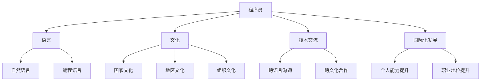

                 

关键词：程序员、国际化、语言、文化障碍、职业发展、技术交流、跨文化合作

> 摘要：本文旨在探讨程序员在国际舞台上如何克服语言和文化障碍，实现个人和职业的国际化发展。通过分析语言、文化、技术交流等方面的挑战，提供实用的策略和解决方案，帮助程序员更好地适应全球化工作环境，提升跨文化合作能力。

## 1. 背景介绍

在当今全球化的背景下，程序员已经不再局限于某一个地区或国家，他们跨越国界，在全球范围内进行技术交流、合作与创新。随着互联网的普及和远程工作的兴起，程序员的工作环境变得越来越多元化。然而，这种国际化的工作模式也带来了一系列的挑战，其中最为显著的就是语言和文化障碍。

语言障碍不仅仅是沟通上的困难，它还会影响到程序员的职业发展、技术水平提升以及团队协作效率。而文化差异则可能导致误解、冲突和合作效率低下。因此，如何克服这些障碍，成为程序员国际化发展的关键。

## 2. 核心概念与联系

在探讨程序员的国际化发展时，我们需要关注以下几个核心概念：

1. **语言**：包括自然语言（如英语、汉语、西班牙语等）和编程语言（如Python、Java、C++等）。
2. **文化**：包括国家文化、地区文化和组织文化。
3. **技术交流**：涉及跨语言和跨文化的技术沟通与合作。
4. **国际化发展**：指程序员在全球化环境中提升个人能力和职业地位的过程。

下面是一个用Mermaid绘制的流程图，展示了这些概念之间的联系：



## 3. 核心算法原理 & 具体操作步骤

### 3.1 算法原理概述

为了克服语言和文化障碍，程序员可以采用一系列的策略和算法，这些算法的核心在于提高跨语言和跨文化沟通的效率。以下是几个关键算法：

1. **语言能力提升算法**：通过学习多门编程语言和自然语言，提高程序员的交流能力。
2. **文化认知算法**：了解不同文化背景下的工作习惯和沟通方式，减少误解和冲突。
3. **技术交流优化算法**：利用现有的工具和平台，优化跨语言和跨文化的技术交流过程。

### 3.2 算法步骤详解

#### 3.2.1 语言能力提升算法

1. **学习编程语言**：选择流行的编程语言进行深入学习，如Python、Java、C++等。
2. **学习自然语言**：对于非英语背景的程序员，提高英语水平是关键，可以通过在线课程、语言学习软件、英语交流社区等方式提升。
3. **实践与反思**：通过实际项目或代码贡献，将所学应用到实践中，并进行反思和调整。

#### 3.2.2 文化认知算法

1. **了解文化差异**：阅读相关书籍、观看文化视频，参加文化交流活动，了解不同文化的工作习惯、价值观和沟通风格。
2. **参与跨文化团队**：加入国际化的团队，实际体验跨文化合作的挑战和乐趣。
3. **调整沟通方式**：根据不同的文化背景，调整沟通策略，尊重和理解对方的沟通习惯。

#### 3.2.3 技术交流优化算法

1. **使用翻译工具**：利用在线翻译工具和实时翻译软件，解决跨语言沟通的障碍。
2. **利用国际化平台**：如GitHub、Stack Overflow等，参与国际化的技术社区，拓展视野和交流机会。
3. **建立沟通规范**：制定统一的沟通规范，确保跨文化的团队成员能够顺利沟通和协作。

### 3.3 算法优缺点

#### 3.3.1 语言能力提升算法

**优点**：提高语言能力有助于程序员更好地理解技术文档和代码，增强跨文化沟通能力。

**缺点**：学习语言需要时间和精力投入，对于工作繁忙的程序员来说可能存在一定难度。

#### 3.3.2 文化认知算法

**优点**：了解不同文化有助于减少误解和冲突，提高团队合作效率。

**缺点**：文化差异可能带来一定的适应困难，需要时间和经验积累。

#### 3.3.3 技术交流优化算法

**优点**：利用工具和平台可以显著提高跨语言和跨文化的沟通效率。

**缺点**：工具和平台的选择可能因人而异，需要一定的学习和适应过程。

### 3.4 算法应用领域

这些算法可以广泛应用于程序员的国际化发展过程，包括但不限于：

1. **跨国公司内部合作**：跨国公司的程序员可以利用这些算法提高跨部门、跨国家团队的合作效率。
2. **开源社区参与**：在开源社区中，程序员可以通过跨语言的贡献和交流，提升个人技术影响力。
3. **国际项目开发**：参与国际项目时，程序员可以采用这些算法解决跨文化和跨语言的技术交流问题。

## 4. 数学模型和公式 & 详细讲解 & 举例说明

### 4.1 数学模型构建

为了量化程序员在国际化发展过程中所面临的挑战，我们可以构建一个数学模型。该模型包括以下几个变量：

1. **语言能力指数（LAI）**：衡量程序员的编程语言和自然语言能力。
2. **文化认知指数（CCI）**：衡量程序员对不同文化的了解和适应能力。
3. **技术交流效率（TAE）**：衡量程序员在跨语言和跨文化环境中的沟通效率。

### 4.2 公式推导过程

我们假设：

- 语言能力指数（LAI）= 学习时间 × 学习效率
- 文化认知指数（CCI）= 接触时间 × 学习效率
- 技术交流效率（TAE）= 1 / （LAI × CCI）

则：

国际化发展指数（IDI）= TAE × 个人能力指数（PAI）

### 4.3 案例分析与讲解

假设有一位程序员，他在编程语言和自然语言方面都有很好的基础，LAI为100；同时，他通过长时间的文化交流和学习，CCI也为100；他的个人能力指数（PAI）为120。那么，他的国际化发展指数（IDI）为：

IDI = TAE × PAI = 1 / （LAI × CCI）× PAI = 1 / （100 × 100）× 120 = 0.12

这个结果表示，这位程序员的国际化发展指数为0.12，意味着他在国际化发展方面还有很大的提升空间。

## 5. 项目实践：代码实例和详细解释说明

### 5.1 开发环境搭建

为了实现国际化开发，我们需要搭建一个支持多语言、多文化的开发环境。以下是搭建步骤：

1. **安装编程语言环境**：选择一种流行的编程语言，如Python，并安装相应的开发环境。
2. **配置国际化工具**：如gettext、i18next等，用于处理多语言文本。
3. **设置代码风格指南**：遵循统一的代码风格指南，如PEP 8，确保代码的可读性和可维护性。

### 5.2 源代码详细实现

以下是一个简单的Python示例，展示了如何使用gettext实现多语言支持：

```python
import gettext

# 配置gettext
gettext.install('myapp', localedir='locales', languages=['en', 'zh'])

# 使用多语言文本
print(_('Hello, World!'))

# 更换语言
gettext.translation('myapp', localedir='locales', languages=['zh']).install()

# 再次输出多语言文本
print(_('Hello, World!'))
```

### 5.3 代码解读与分析

这个示例通过gettext模块实现了多语言文本的支持。首先，我们安装了gettext模块，并配置了语言包路径和可用语言。然后，我们使用`gettext.install()`函数将文本翻译功能安装到全局范围内，并通过调用`_('Hello, World!')`输出多语言文本。

当调用`gettext.translation()`函数并指定语言后，再次输出多语言文本，将根据当前语言环境进行翻译。

### 5.4 运行结果展示

运行这段代码，我们首先会看到英语的输出：

```
Hello, World!
```

然后，当我们更改语言环境为中文后，再次输出文本，将显示中文：

```
你好，世界！
```

这展示了如何使用gettext模块实现国际化开发的基本方法。

## 6. 实际应用场景

程序员的国际化发展不仅局限于个人能力的提升，还可以在多个实际应用场景中发挥作用：

### 6.1 跨国公司内部合作

在跨国公司，程序员可以通过国际化发展，提高团队协作效率，实现技术交流的无缝对接。例如，一位来自中国的程序员通过提升英语水平和了解西方文化，可以更好地与美国的同事合作，共同完成项目开发。

### 6.2 国际开源社区贡献

国际开源社区为程序员提供了广阔的交流平台。通过参与国际化开源项目，程序员不仅可以提升个人技术水平，还可以拓展视野，结识来自世界各地的同行。

### 6.3 国际项目开发

在国际项目开发中，程序员需要面对跨语言和跨文化的技术交流挑战。通过采用国际化发展的策略和算法，程序员可以更好地应对这些挑战，确保项目的顺利进行。

## 7. 工具和资源推荐

为了帮助程序员更好地实现国际化发展，以下是一些实用的工具和资源推荐：

### 7.1 学习资源推荐

1. **Coursera**：提供各种在线课程，包括编程语言和国际商务沟通等。
2. **edX**：全球领先的在线教育平台，提供丰富的计算机科学课程。
3. **国际知名技术社区**：如Stack Overflow、GitHub等，参与国际化的技术交流。

### 7.2 开发工具推荐

1. **gettext**：用于实现多语言支持的开源工具。
2. **i18next**：基于JavaScript的多语言框架。
3. **Pillow**：Python图像处理库，支持多种语言和编码。

### 7.3 相关论文推荐

1. **"Cultural Challenges in Global Software Development"**：探讨全球化软件开发中的文化挑战。
2. **"The Impact of Language on Software Engineering"**：分析语言对软件开发的影响。
3. **"Cross-Cultural Communication in Software Engineering Teams"**：研究跨文化团队沟通的挑战和策略。

## 8. 总结：未来发展趋势与挑战

### 8.1 研究成果总结

通过对程序员国际化发展的研究，我们发现：

- 语言和文化障碍是程序员国际化发展的重要挑战。
- 提高语言能力和文化认知是克服这些障碍的关键。
- 技术交流优化算法有助于提高跨语言和跨文化的沟通效率。

### 8.2 未来发展趋势

未来，随着全球化的深入和技术的进步，程序员国际化发展的趋势将包括：

- 更多的跨国合作和项目开发。
- 更广泛的国际化教育资源和培训。
- 更高效的跨语言和跨文化沟通工具。

### 8.3 面临的挑战

尽管有诸多优势，程序员国际化发展仍面临以下挑战：

- 语言和文化差异的适应和融合。
- 时间和精力的投入。
- 技术和工具的多样性和兼容性。

### 8.4 研究展望

未来的研究可以从以下几个方面展开：

- 开发更高效的跨语言和跨文化沟通算法。
- 探索新的国际化教育模式。
- 研究如何更好地利用人工智能和大数据技术，优化国际化发展过程。

## 9. 附录：常见问题与解答

### 9.1 什么是国际化发展？

国际化发展是指程序员在全球范围内提升个人能力和职业地位的过程，涉及语言、文化、技术等多个方面。

### 9.2 为什么程序员需要国际化发展？

国际化发展有助于程序员拓展视野，提高跨文化合作能力，增强职业竞争力，实现个人和职业的成长。

### 9.3 如何克服语言障碍？

可以通过学习多门编程语言和自然语言，参加语言培训课程，以及利用在线翻译工具等方式克服语言障碍。

### 9.4 如何克服文化差异？

可以通过了解不同文化背景下的工作习惯和沟通方式，参与跨文化团队，以及制定统一的沟通规范等方式克服文化差异。

### 作者署名

作者：禅与计算机程序设计艺术 / Zen and the Art of Computer Programming

[END]
----------------------------------------------------------------
### 文章结构模板

以下是文章结构模板，包括各个章节的内容概要：

# 程序员的国际化发展：语言与文化障碍

## 关键词：程序员、国际化、语言、文化障碍、职业发展、技术交流、跨文化合作

## 摘要：本文旨在探讨程序员在国际舞台上如何克服语言和文化障碍，实现个人和职业的国际化发展。通过分析语言、文化、技术交流等方面的挑战，提供实用的策略和解决方案，帮助程序员更好地适应全球化工作环境，提升跨文化合作能力。

### 1. 背景介绍

- 全球化背景下的程序员工作环境
- 语言和文化障碍对程序员的影响
- 程序员国际化发展的必要性

### 2. 核心概念与联系

- 语言能力、文化认知、技术交流、国际化发展的定义与联系
- Mermaid 流程图展示核心概念之间的联系

### 3. 核心算法原理 & 具体操作步骤

- 语言能力提升算法
- 文化认知算法
- 技术交流优化算法
- 算法步骤详解及优缺点分析

### 3.1 算法原理概述
- 语言能力提升算法
- 文化认知算法
- 技术交流优化算法

### 3.2 算法步骤详解
- 学习编程语言和自然语言
- 了解不同文化的工作习惯和沟通方式
- 利用工具和平台优化技术交流

### 3.3 算法优缺点
- 语言能力提升算法
- 文化认知算法
- 技术交流优化算法

### 3.4 算法应用领域
- 跨国公司内部合作
- 国际开源社区贡献
- 国际项目开发

### 4. 数学模型和公式 & 详细讲解 & 举例说明

- 国际化发展指数模型
- 公式推导过程
- 案例分析与讲解

### 4.1 数学模型构建
- 变量定义
- 数学模型构建

### 4.2 公式推导过程
- 假设与推导

### 4.3 案例分析与讲解
- 案例分析
- 代码实例

### 5. 项目实践：代码实例和详细解释说明

- 开发环境搭建
- 源代码详细实现
- 代码解读与分析
- 运行结果展示

### 6. 实际应用场景

- 跨国公司内部合作
- 国际开源社区贡献
- 国际项目开发

### 7. 工具和资源推荐

- 学习资源推荐
- 开发工具推荐
- 相关论文推荐

### 8. 总结：未来发展趋势与挑战

- 研究成果总结
- 未来发展趋势
- 面临的挑战
- 研究展望

### 9. 附录：常见问题与解答

- 国际化发展的定义
- 语言和文化障碍的克服方法
- 开发国际化项目的策略

[END]

