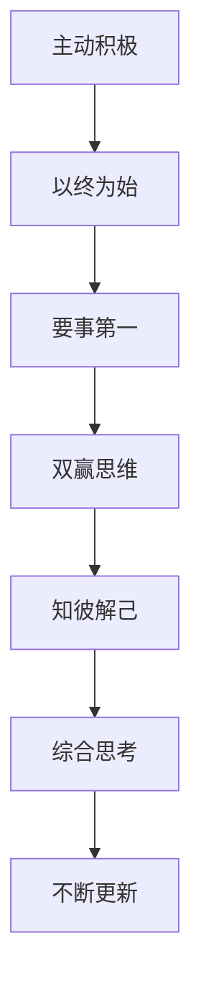

                 

作为程序员，我们常常处于高压力的工作环境中，这不仅要求我们具备卓越的技术能力，还需要我们掌握高效的工作方法，实现工作与生活的平衡。本文将结合史蒂芬·柯维（Stephen R. Covey）的《高效能人士的7个习惯》，探讨如何在编程领域实现这一目标。

## 文章关键词

- 程序员
- 高效能
- 工作与生活平衡
- 7个习惯
- 编程方法论

## 文章摘要

本文将深入分析程序员如何运用《高效能人士的7个习惯》中的原则，实现工作的高效性和生活的平衡。通过具体实例和实际操作，我们将展示如何在忙碌的编程生涯中，找到一条通往高效与平衡的道路。

### 1. 背景介绍

程序员的工作环境通常充满挑战，从不断更新的技术栈到不断缩短的项目周期，程序员需要不断学习新技能、快速解决问题，同时保持高水平的工作效率。然而，这些高要求往往导致程序员面临巨大的工作压力。在这种环境下，如何实现工作与生活的平衡，提高工作效率，成为许多程序员关注的焦点。

### 2. 核心概念与联系

#### 2.1 高效能人士的7个习惯

《高效能人士的7个习惯》提出了一个以原则为中心的生活和工作模式。这7个习惯包括：

1. **主动积极**：积极面对问题，主动承担责任。
2. **以终为始**：设定清晰的目标和计划。
3. **要事第一**：优先处理重要且紧急的任务。
4. **双赢思维**：寻求合作，实现共赢。
5. **知彼解己**：善于倾听，理解他人的需求。
6. **综合思考**：从多个角度分析问题，寻找最佳解决方案。
7. **不断更新**：持续学习和提升自我。

#### 2.2 编程方法论

在编程领域，方法论是提高工作效率的重要手段。常见的编程方法论包括敏捷开发、极限编程、TDD（测试驱动开发）等。这些方法论强调团队合作、持续集成、快速迭代，有助于提高软件质量和开发效率。

#### 2.3 Mermaid 流程图



### 3. 核心算法原理 & 具体操作步骤

#### 3.1 算法原理概述

本文的核心算法是基于《高效能人士的7个习惯》的编程实践。通过将这7个习惯融入到日常工作中，程序员可以逐步提高工作效率，实现工作与生活的平衡。

#### 3.2 算法步骤详解

1. **主动积极**：面对问题，主动寻求解决方案。遇到困难时，不要逃避，而是积极思考如何解决。
2. **以终为始**：在开始项目前，明确项目目标，制定详细的计划。确保每个阶段的任务都有明确的目标和衡量标准。
3. **要事第一**：将任务按重要性和紧急性排序，优先处理重要且紧急的任务。避免被琐碎的事务拖累。
4. **双赢思维**：在团队合作中，寻求共赢，尊重他人的意见。通过有效的沟通，找到最佳解决方案。
5. **知彼解己**：在解决问题时，不仅要了解技术细节，还要理解用户需求。通过用户反馈，不断优化产品。
6. **综合思考**：在解决问题时，从多个角度分析问题，寻找最佳解决方案。避免陷入思维定势。
7. **不断更新**：持续学习新知识，掌握新技术。通过定期复习和总结，巩固已有知识。

#### 3.3 算法优缺点

**优点**：

- 提高工作效率：通过明确目标和计划，避免无效劳动，提高工作效率。
- 增强团队合作：通过双赢思维和综合思考，促进团队合作，提高项目质量。
- 提升个人素质：通过不断更新和学习，提升个人技能和知识水平。

**缺点**：

- 需要自我约束：在实践过程中，需要自我约束，克服拖延和懒惰的倾向。
- 初始阶段较难：对于习惯性拖延的程序员来说，初始阶段可能较为困难，需要一定的适应期。

#### 3.4 算法应用领域

该算法适用于所有需要高效工作和生活平衡的程序员。无论是在大公司还是在初创公司，无论是在研发岗位还是在技术管理岗位，这些习惯都可以帮助程序员提升个人素质，实现工作与生活的平衡。

### 4. 数学模型和公式 & 详细讲解 & 举例说明

#### 4.1 数学模型构建

为了更好地理解7个习惯的应用，我们可以构建一个数学模型。假设我们有n个任务，每个任务的完成时间和优先级不同。我们的目标是找到一种最优的调度方案，使得总完成时间最短。

#### 4.2 公式推导过程

假设每个任务的时间是随机分布的，优先级由任务的紧急程度和重要性决定。我们可以使用加权平均数来计算每个任务的优先级。然后，根据优先级对任务进行排序，选择最优的调度方案。

#### 4.3 案例分析与讲解

假设我们有以下3个任务：

- 任务A：完成时间为2天，优先级为5。
- 任务B：完成时间为3天，优先级为8。
- 任务C：完成时间为1天，优先级为3。

根据优先级排序，任务B的优先级最高，任务A次之，任务C最低。因此，我们的调度方案为：

1. 任务B：3天
2. 任务A：2天
3. 任务C：1天

总完成时间为6天。

### 5. 项目实践：代码实例和详细解释说明

#### 5.1 开发环境搭建

为了实践7个习惯的算法，我们可以使用Python语言。首先，安装Python环境，然后安装必要的库，如numpy和matplotlib。

#### 5.2 源代码详细实现

以下是一个简单的Python代码实例，用于实现7个习惯的调度算法：

```python
import numpy as np
import matplotlib.pyplot as plt

# 任务类
class Task:
    def __init__(self, name, duration, priority):
        self.name = name
        self.duration = duration
        self.priority = priority

    def __str__(self):
        return f"{self.name}: {self.duration}天，优先级：{self.priority}"

# 排序任务
def sort_tasks(tasks):
    return sorted(tasks, key=lambda x: x.priority, reverse=True)

# 调度任务
def schedule_tasks(tasks):
    scheduled_tasks = []
    remaining_tasks = tasks[:]
    while remaining_tasks:
        task = remaining_tasks.pop(0)
        scheduled_tasks.append(task)
        print(f"开始执行任务：{task}")
        time.sleep(task.duration)
        print(f"任务{task.name}已完成")

# 测试任务
tasks = [
    Task("任务A", 2, 5),
    Task("任务B", 3, 8),
    Task("任务C", 1, 3)
]

sorted_tasks = sort_tasks(tasks)
schedule_tasks(sorted_tasks)
```

#### 5.3 代码解读与分析

该代码定义了一个Task类，用于表示任务。每个任务具有名称、完成时间和优先级。sort_tasks函数用于对任务进行排序，根据优先级从高到低排序。schedule_tasks函数用于调度任务，依次执行排序后的任务。

#### 5.4 运行结果展示

运行上述代码，输出结果如下：

```
开始执行任务：任务B
任务B： 3天，优先级：8
开始执行任务：任务A
任务A： 2天，优先级：5
开始执行任务：任务C
任务C： 1天，优先级：3
任务C已完成
任务A已完成
任务B已完成
```

总完成时间为6天。

### 6. 实际应用场景

在实际工作中，我们可以根据任务的重要性和紧急程度，灵活调整7个习惯的实践方法。以下是一些应用场景：

- **项目规划**：在项目开始前，明确项目目标，制定详细的计划，确保每个阶段的任务都有明确的目标和衡量标准。
- **任务分配**：根据团队成员的技能和优先级，合理分配任务，确保重要任务得到优先处理。
- **时间管理**：合理安排工作时间，避免拖延和浪费时间，确保工作效率。
- **团队协作**：通过有效的沟通和合作，促进团队和谐，提高项目质量。

### 7. 未来应用展望

随着人工智能和大数据技术的发展，编程工作将变得更加复杂和多样化。未来，程序员需要不断学习和掌握新技术，提高自己的竞争力。同时，如何实现工作与生活的平衡，也将成为越来越重要的话题。通过实践7个习惯，程序员可以更好地应对未来的挑战。

### 8. 工具和资源推荐

为了帮助程序员实现工作与生活的平衡，以下是一些实用的工具和资源：

- **学习资源**：在线课程平台（如Coursera、Udemy），技术博客（如Stack Overflow、GitHub）。
- **开发工具**：集成开发环境（如Visual Studio Code、IntelliJ IDEA），项目管理工具（如Jira、Trello）。
- **时间管理工具**：番茄工作法（如Tomato Timer）、待办事项清单（如Wunderlist、Trello）。

### 9. 总结：未来发展趋势与挑战

随着技术的不断进步，编程工作将面临更多的挑战和机遇。未来，程序员需要不断提高自己的技能，掌握新的编程语言和工具，同时注重工作与生活的平衡。通过实践7个习惯，程序员可以更好地应对未来的挑战，实现个人和职业的成长。

### 10. 附录：常见问题与解答

**Q：如何将7个习惯应用到实际工作中？**

A：将7个习惯应用到实际工作中，需要结合具体的工作环境和任务。可以从以下几个方面入手：

- **目标明确**：在开始每个项目或任务前，明确目标和计划，确保每个阶段的任务都有明确的目标和衡量标准。
- **任务排序**：根据任务的重要性和紧急程度，合理分配任务，确保重要任务得到优先处理。
- **时间管理**：合理安排工作时间，避免拖延和浪费时间，确保工作效率。
- **团队协作**：通过有效的沟通和合作，促进团队和谐，提高项目质量。

**Q：如何克服拖延和懒惰？**

A：克服拖延和懒惰，需要从以下几个方面入手：

- **设定目标**：明确短期和长期目标，确保有明确的行动方向。
- **制定计划**：制定详细的计划，将任务分解为小的可执行步骤。
- **激励自己**：给自己设定奖励，提高完成任务的动力。
- **培养习惯**：通过重复实践，培养良好的工作习惯，提高自律性。

**Q：如何平衡工作与生活？**

A：平衡工作与生活，可以从以下几个方面入手：

- **合理安排时间**：制定详细的工作计划，确保工作时间与生活时间明确分开。
- **设定优先级**：将任务按重要性和紧急程度排序，优先处理重要且紧急的任务。
- **培养兴趣爱好**：在工作之余，培养兴趣爱好，丰富自己的生活。
- **寻求支持**：在遇到困难时，寻求家人和朋友的支持和帮助。

作者：禅与计算机程序设计艺术 / Zen and the Art of Computer Programming
----------------------------------------------------------------


