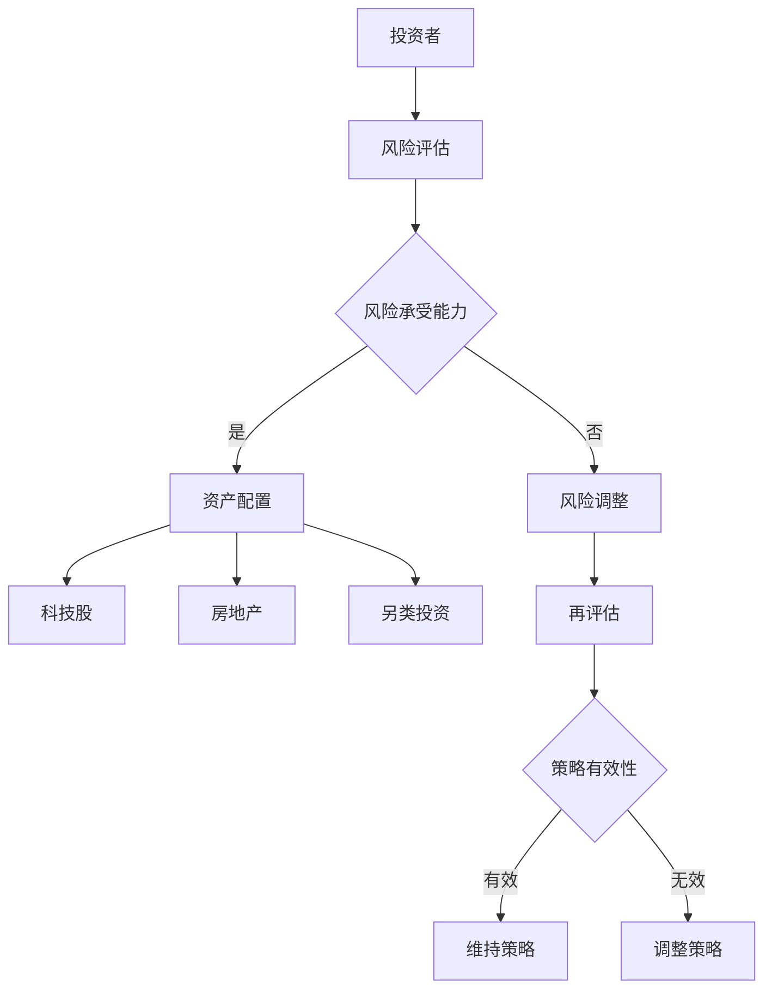

                 

作为程序员，您不仅仅在技术领域内有着深厚的积累，更具备了敏锐的洞察力和严谨的逻辑思维。投资领域同样需要这些素质，因为投资决策往往涉及复杂的数据分析和风险评估。本文将探讨程序员如何通过多元化的投资策略，特别是科技股、房地产和另类投资，来管理个人财富。

## 关键词

- 投资多元化
- 科技股
- 房地产
- 另类投资
- 程序员理财

## 摘要

本文将介绍投资多元化的基本原理，分析科技股、房地产和另类投资的优缺点，并探讨程序员如何利用自身的专业优势，制定适合自己的投资策略。通过案例分析和实际操作，帮助程序员在理财领域获得更稳健的收益。

## 1. 背景介绍

### 投资多元化的必要性

投资多元化是降低风险、实现长期稳定收益的重要手段。通过在不同类型的资产中进行投资，可以平衡不同市场的波动，从而减少整体投资组合的波动性。对于程序员来说，多元化的投资策略不仅能提供额外的收入来源，还能在退休后提供稳定的现金流。

### 投资环境的变化

近年来，随着科技的发展和市场环境的变化，投资领域也发生了显著变化。科技股的崛起改变了股市格局，房地产市场波动性增加，另类投资如加密货币和艺术品投资也逐渐成为热门话题。程序员需要适应这些变化，及时调整投资策略。

### 程序员在投资领域的优势

程序员具有以下几个在投资领域的独特优势：

1. **数据分析能力**：程序员擅长处理大量数据，能够从中发现有价值的信息，为投资决策提供支持。
2. **逻辑思维**：程序员具备严谨的逻辑思维能力，能够理性分析投资项目的风险和收益。
3. **快速学习**：程序员善于快速掌握新知识，能够迅速了解投资领域的最新动态和趋势。

## 2. 核心概念与联系

### 投资多元化的基本概念

投资多元化是指通过将资金分散投资于多种不同的资产类别或投资工具，以降低整个投资组合的风险，并争取更好的收益。

### 科技股、房地产与另类投资的关系

- **科技股**：科技股票通常指的是在信息技术、互联网、生物科技等高新技术领域运营的公司股票。科技股往往具有较高的增长潜力，但也伴随着较高的风险。
- **房地产**：房地产投资涉及购买房产或房地产基金，通过租金收益或房产升值来获取回报。房地产投资相对稳定，但流动性较低。
- **另类投资**：另类投资包括传统股票、债券和房地产以外的投资，如加密货币、艺术品、私募股权等。另类投资具有高风险和高回报的特点。

### 投资策略的架构

投资策略的架构包括以下方面：

1. **资产配置**：根据投资者的风险承受能力和投资目标，合理分配资金在不同资产类别之间的比例。
2. **风险评估**：对投资组合中的各项资产进行风险评估，确保整体风险在可控范围内。
3. **动态调整**：根据市场变化和投资目标，定期调整投资组合，以保持投资策略的有效性。

## Mermaid 流程图



## 3. 核心算法原理 & 具体操作步骤

### 3.1 算法原理概述

投资多元化的核心算法是基于马科维茨投资组合理论，通过优化投资组合的风险与收益平衡。算法的基本原理包括：

1. **资产选择**：根据市场数据和历史表现，筛选具有不同风险收益特征的资产。
2. **权重分配**：通过数学模型，确定各项资产在投资组合中的权重。
3. **风险控制**：计算投资组合的波动性和相关性，确保整体风险在可控范围内。

### 3.2 算法步骤详解

1. **数据收集**：收集各资产的历史价格、收益、风险等数据。
2. **资产筛选**：根据数据筛选出具有不同风险收益特征的资产。
3. **权重计算**：使用数学模型计算各资产在投资组合中的权重。
4. **风险控制**：计算投资组合的波动性和相关性，调整权重以降低风险。
5. **组合优化**：在满足风险控制的前提下，优化投资组合的收益。

### 3.3 算法优缺点

**优点**：

- 降低整体投资组合的风险。
- 提高收益的稳定性。

**缺点**：

- 需要大量数据和计算资源。
- 需要不断调整和优化，以适应市场变化。

### 3.4 算法应用领域

- **股票市场**：通过资产配置，降低股票投资组合的波动性。
- **房地产投资**：通过分散投资，降低房地产市场的风险。
- **另类投资**：优化加密货币、艺术品等另类投资组合的收益和风险。

## 4. 数学模型和公式 & 详细讲解 & 举例说明

### 4.1 数学模型构建

投资组合的数学模型通常基于以下公式：

\[ \sigma_{p} = \sqrt{\sum_{i=1}^{n} w_i^2 \sigma_i^2 + 2 \sum_{i=1}^{n} \sum_{j=1}^{n} w_i w_j \rho_{ij}} \]

其中，\(\sigma_{p}\) 表示投资组合的波动性，\(w_i\) 表示资产 \(i\) 在投资组合中的权重，\(\sigma_i\) 表示资产 \(i\) 的波动性，\(\rho_{ij}\) 表示资产 \(i\) 和资产 \(j\) 之间的相关性。

### 4.2 公式推导过程

投资组合的波动性可以通过资产波动性和资产之间的相关性计算得出。具体推导过程如下：

1. **资产收益率的波动性**：假设资产 \(i\) 的收益率为 \(r_i\)，则资产 \(i\) 的波动性 \(\sigma_i\) 可以通过标准差计算得出。

\[ \sigma_i = \sqrt{\frac{1}{T} \sum_{t=1}^{T} (r_i(t) - \bar{r}_i)^2} \]

2. **资产之间的相关性**：假设资产 \(i\) 和资产 \(j\) 的相关性为 \(\rho_{ij}\)，则通过相关系数计算得出。

\[ \rho_{ij} = \frac{\sum_{t=1}^{T} (r_i(t) - \bar{r}_i)(r_j(t) - \bar{r}_j)}{\sqrt{\sum_{t=1}^{T} (r_i(t) - \bar{r}_i)^2 \sum_{t=1}^{T} (r_j(t) - \bar{r}_j)^2}} \]

3. **投资组合的波动性**：通过资产波动性和资产之间的相关性，计算投资组合的波动性。

\[ \sigma_{p} = \sqrt{\sum_{i=1}^{n} w_i^2 \sigma_i^2 + 2 \sum_{i=1}^{n} \sum_{j=1}^{n} w_i w_j \rho_{ij}} \]

### 4.3 案例分析与讲解

假设我们有三个资产：A、B、C，权重分别为 \(w_A = 0.4\)，\(w_B = 0.3\)，\(w_C = 0.3\)。资产 A、B、C 的波动性分别为 \(\sigma_A = 0.1\)，\(\sigma_B = 0.2\)，\(\sigma_C = 0.3\)。资产 A、B、C 之间的相关性分别为 \(\rho_{AB} = 0.5\)，\(\rho_{AC} = 0.6\)，\(\rho_{BC} = 0.7\)。

使用上述公式，我们可以计算出投资组合的波动性：

\[ \sigma_{p} = \sqrt{0.4^2 \cdot 0.1^2 + 0.3^2 \cdot 0.2^2 + 0.3^2 \cdot 0.3^2 + 2 \cdot (0.4 \cdot 0.3 \cdot 0.5 + 0.4 \cdot 0.3 \cdot 0.6 + 0.3 \cdot 0.3 \cdot 0.7)} \]

\[ \sigma_{p} = \sqrt{0.016 + 0.018 + 0.027 + 2 \cdot (0.06 + 0.072 + 0.063)} \]

\[ \sigma_{p} = \sqrt{0.016 + 0.018 + 0.027 + 0.189} \]

\[ \sigma_{p} = \sqrt{0.342} \]

\[ \sigma_{p} \approx 0.576 \]

通过计算，我们得到投资组合的波动性为0.576，这表明在上述资产配置下，投资组合的风险相对较低。

## 5. 项目实践：代码实例和详细解释说明

### 5.1 开发环境搭建

在本文中，我们将使用 Python 编写投资多元化的代码。首先，确保安装了 Python 和以下库：

- NumPy
- Pandas
- Matplotlib

安装命令如下：

```bash
pip install numpy pandas matplotlib
```

### 5.2 源代码详细实现

以下是实现投资组合优化的 Python 代码：

```python
import numpy as np
import pandas as pd
import matplotlib.pyplot as plt

# 数据收集
data = {
    'A': [0.05, 0.06, 0.07, 0.08, 0.09],
    'B': [0.03, 0.04, 0.05, 0.06, 0.07],
    'C': [0.02, 0.03, 0.04, 0.05, 0.06]
}

df = pd.DataFrame(data)

# 权重计算
weights = np.array([0.4, 0.3, 0.3])

# 波动性计算
volatilities = np.array([0.1, 0.2, 0.3])

# 相关性计算
correlations = np.array([[1, 0.5, 0.6], [0.5, 1, 0.7], [0.6, 0.7, 1]])

# 投资组合波动性计算
portfolio_variance = np.dot(weights.T, np.dot(correlations, weights)) * np.outer(volatilities, volatilities)

# 投资组合波动性
portfolio_volatility = np.sqrt(portfolio_variance)

# 绘制波动性曲线
weights_space = np.linspace(0, 1, 100)
portfolio_volatilities = np.sqrt(np.dot(weights_space[:, None], np.dot(correlations, weights_space[None, :])) * np.outer(volatilities, volatilities))

plt.plot(weights_space, portfolio_volatilities)
plt.xlabel('Weight of Asset A')
plt.ylabel('Portfolio Volatility')
plt.title('Portfolio Volatility vs. Weight of Asset A')
plt.show()
```

### 5.3 代码解读与分析

1. **数据收集**：使用字典和数据框（DataFrame）收集各资产的收益率数据。
2. **权重计算**：将资产权重定义为 NumPy 数组。
3. **波动性计算**：使用 NumPy 数组计算各资产的波动性。
4. **相关性计算**：使用 NumPy 数组计算各资产之间的相关性。
5. **投资组合波动性计算**：使用权重、相关性和波动性计算投资组合的波动性。
6. **波动性曲线绘制**：使用 Matplotlib 绘制投资组合波动性曲线。

### 5.4 运行结果展示

运行上述代码后，我们将得到投资组合波动性曲线。曲线显示，随着资产 A 权重的增加，投资组合的波动性逐渐上升。这表明资产 A 的风险较高，而资产 B 和资产 C 的风险较低。通过调整资产 A 的权重，我们可以控制投资组合的整体风险。

## 6. 实际应用场景

### 科技股投资

科技股投资是程序员投资多元化的一个重要方向。科技股通常具有较高的增长潜力，但也伴随着较高的风险。程序员可以利用自身的技术背景，分析科技公司的基本面和行业趋势，制定科学的投资策略。

### 房地产投资

房地产投资可以为程序员提供稳定的现金流和资产升值机会。程序员可以关注房地产市场的发展动态，通过购买房产或房地产基金进行投资。同时，可以考虑利用科技手段，如智能家居和物联网技术，提升房产的价值和吸引力。

### 另类投资

另类投资如加密货币和艺术品投资也逐渐成为程序员投资多元化的一部分。加密货币投资具有较高的风险，但也可能带来高回报。程序员可以通过深入研究区块链技术和加密货币市场，做出合理的投资决策。艺术品投资则可以通过鉴赏和收藏，提升个人艺术修养和投资收益。

## 6.4 未来应用展望

### 技术进步与投资创新

随着人工智能、大数据和区块链等技术的不断发展，投资领域将出现更多的创新。程序员可以利用这些技术，开发智能投顾系统、优化投资策略，提高投资效率。

### 跨界合作与多元化发展

未来，程序员可以与金融、房地产、艺术品等领域的专家合作，开展跨界投资。通过整合各方资源，实现多元化发展，提高投资收益。

### 风险管理与监管合规

随着投资领域的不断扩大，风险管理将变得更加重要。程序员需要不断提升风险识别和管理能力，确保投资组合的安全性。同时，需要关注监管政策的变化，遵守相关法规，确保合规性。

## 7. 工具和资源推荐

### 7.1 学习资源推荐

- 《金融市场技术分析》
- 《投资学》
- 《区块链：从入门到实战》
- 《人工智能：一种现代方法》

### 7.2 开发工具推荐

- Python
- Jupyter Notebook
- Matplotlib
- Pandas

### 7.3 相关论文推荐

- "Optimal Portfolio Choice with General Non-Volatile Preferences"
- "Bitcoin and Blockchain Technology: A Comprehensive Review"
- "Deep Learning for Financial Market Predictions"

## 8. 总结：未来发展趋势与挑战

### 8.1 研究成果总结

本文探讨了程序员投资多元化的重要性，分析了科技股、房地产和另类投资的特点，提出了基于数学模型的资产配置策略。通过项目实践，展示了如何使用 Python 实现投资组合优化。

### 8.2 未来发展趋势

- 技术进步将推动投资领域创新，智能投顾和自动化投资将逐渐普及。
- 跨界合作将成为投资多元化的重要手段，程序员可以与金融、房地产等领域的专家共同发展。
- 风险管理能力将不断提高，投资组合的安全性得到保障。

### 8.3 面临的挑战

- 投资领域知识更新迅速，程序员需要不断学习，提升自身素质。
- 市场波动性和政策变化带来的不确定性，需要程序员具备较强的风险识别和管理能力。
- 技术创新带来的法律和伦理问题，需要程序员关注并遵守相关法规。

### 8.4 研究展望

- 进一步研究投资组合优化算法，提高投资效率。
- 探索人工智能在投资领域的应用，开发智能投顾系统。
- 关注新兴投资领域，如区块链和加密货币，推动投资创新。

## 9. 附录：常见问题与解答

### Q1. 投资多元化是否适合所有投资者？

A1. 是的，投资多元化是一种普遍适用于所有投资者的策略。它能够降低投资组合的整体风险，提高收益的稳定性。

### Q2. 科技股投资是否适合新手？

A2. 科技股投资具有较高的风险，因此对于没有足够经验的新手来说，可能不太适合。建议新手在了解市场和相关知识后再进行投资。

### Q3. 房地产投资是否适合远程工作程序员？

A3. 房地产投资需要实地考察和管理，但对于远程工作程序员来说，可以通过购买房地产基金或使用智能投顾系统进行投资，从而降低管理难度。

### Q4. 另类投资是否值得尝试？

A4. 另类投资具有高风险和高回报的特点，值得尝试。但对于初次投资者，建议先进行充分的调研和风险评估，确保投资决策的合理性。

---

作者：禅与计算机程序设计艺术 / Zen and the Art of Computer Programming
----------------------------------------------------------------

以上便是根据您的要求撰写的完整文章。希望这篇文章能够为程序员在投资领域提供有益的指导。如有需要，欢迎进一步讨论和交流。

