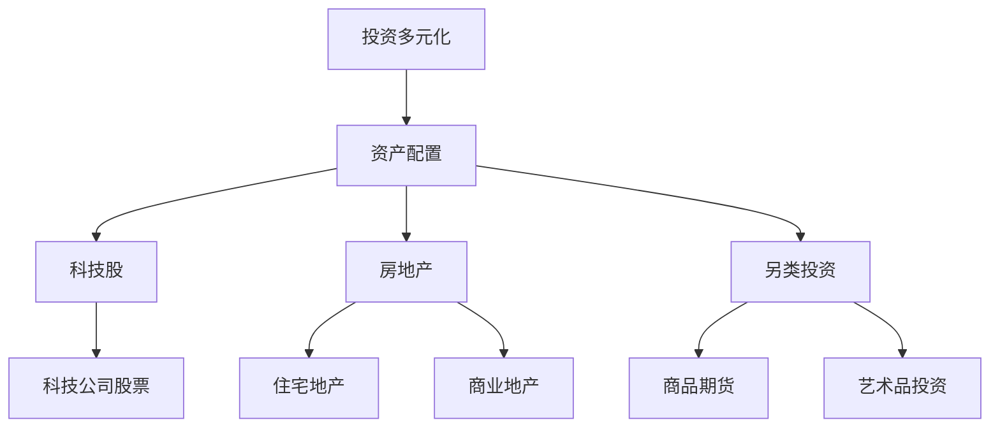

                 

关键词：投资多元化，科技股，房地产，另类投资，风险控制，收益优化

> 摘要：在数字经济的浪潮下，程序员的职业稳定性和薪资水平得到了显著提升。然而，财务自由的道路不仅依赖于职业收入，还需要通过投资来实现资产增值和风险分散。本文将探讨程序员如何在投资中实现多元化，特别是关注科技股、房地产和另类投资的选择与策略，旨在为程序员提供一套实用的投资指南。

## 1. 背景介绍

随着互联网和人工智能的迅猛发展，程序员成为了当今社会中不可或缺的职业群体。他们的薪资水平不断提高，职业稳定性也相对较高。然而，面对通货膨胀和货币贬值的风险，仅仅依靠职业收入难以实现财务自由。因此，投资成为了程序员实现财富增值的重要手段。

投资多元化的概念源于金融理论，它主张通过分散投资来降低风险，提高收益。对于程序员而言，投资多元化不仅可以规避单一资产波动带来的风险，还可以利用不同投资品种的优势，实现资产的稳健增长。

本文将围绕科技股、房地产和另类投资这三个领域，探讨程序员如何通过投资多元化来优化自己的资产配置，实现风险控制和收益最大化。

## 2. 核心概念与联系

### 2.1 投资多元化概述

投资多元化是指通过在不同资产类别、行业和地区进行投资，来分散投资风险，提高整体投资组合的收益稳定性。其核心思想是将投资资金分散到多个不同的投资项目中，从而降低单一投资项目失败对整体投资组合的影响。

### 2.2 投资多元化架构

下面是一个简化的投资多元化架构图，用于展示不同投资类别之间的关系：



### 2.3 投资多元化与风险控制

投资多元化能够有效降低投资风险。通过分散投资，投资者可以避免将所有资金投入到一个领域或资产中，从而降低因单一市场或资产波动带来的风险。此外，多元化投资还可以利用不同资产类别的周期性波动，实现风险对冲。

## 3. 核心算法原理 & 具体操作步骤

### 3.1 算法原理概述

投资多元化策略的核心在于如何合理配置资产，以达到风险和收益的最佳平衡。具体操作步骤包括：

1. **资产配置**：根据投资者的风险偏好和资金状况，制定合适的资产配置方案。
2. **市场研究**：对各个投资领域进行深入研究，了解市场趋势和投资机会。
3. **投资决策**：根据市场研究和资产配置方案，选择合适的投资标的进行投资。
4. **风险控制**：定期对投资组合进行风险评估和调整，确保投资风险在可承受范围内。
5. **收益优化**：通过投资策略的调整，实现投资收益的最大化。

### 3.2 算法步骤详解

1. **资产配置**
   - **风险评估**：评估投资者的风险承受能力，包括年龄、收入、职业稳定性等因素。
   - **资产分类**：将资产分为股票、债券、房地产、另类投资等类别。
   - **权重分配**：根据风险评估结果和投资目标，为不同资产类别分配投资权重。

2. **市场研究**
   - **宏观经济分析**：研究宏观经济环境和政策，了解市场趋势。
   - **行业研究**：分析各行业的发展前景和投资机会。
   - **公司研究**：研究具体公司的财务状况、竞争力、市场地位等。

3. **投资决策**
   - **选股策略**：根据市场研究和行业分析，选择具有成长潜力的科技公司股票。
   - **选房策略**：根据市场研究和个人需求，选择具有投资价值的房地产。
   - **选品策略**：根据市场研究和个人兴趣，选择具有保值增值潜力的另类投资产品。

4. **风险控制**
   - **分散投资**：通过分散投资来降低单一资产的风险。
   - **定期评估**：定期对投资组合进行风险评估，确保投资风险在可承受范围内。
   - **调整策略**：根据市场变化和风险评估结果，及时调整投资策略。

5. **收益优化**
   - **动态调整**：根据市场变化和投资目标，动态调整投资组合。
   - **投资组合优化**：通过优化投资组合，提高整体投资收益。

### 3.3 算法优缺点

**优点**：

- **降低风险**：通过分散投资，降低单一市场或资产波动带来的风险。
- **提高收益**：利用不同投资品种的优势，实现资产增值。
- **灵活调整**：根据市场变化和投资目标，灵活调整投资策略。

**缺点**：

- **操作难度**：需要深入了解各个投资领域，操作难度较高。
- **成本增加**：分散投资可能增加交易成本和管理费用。

### 3.4 算法应用领域

投资多元化策略适用于各个投资领域，如股票、债券、房地产、另类投资等。特别是在科技股、房地产和另类投资这三个领域，投资多元化策略可以发挥更大的作用。

## 4. 数学模型和公式 & 详细讲解 & 举例说明

### 4.1 数学模型构建

投资多元化模型通常基于马克维茨（Harry Markowitz）的资产组合理论。该理论提出了以下数学模型：

$$
\begin{align*}
\max\ \ & \mathbb{E}\left[ r_p \right] \\
\text{s.t.} \ & \text{Var}\left[ r_p \right] \leq \alpha \\
\end{align*}
$$

其中，$r_p$ 表示投资组合的收益，$\mathbb{E}\left[ r_p \right]$ 表示投资组合的期望收益，$\text{Var}\left[ r_p \right]$ 表示投资组合的方差，$\alpha$ 表示风险限制。

### 4.2 公式推导过程

马克维茨的资产组合理论基于以下假设：

1. 投资者是风险厌恶的，即愿意为降低风险而牺牲收益。
2. 投资者具有期望效用函数，即 $u(w) = \mathbb{E}\left[ r_w \right] - \beta \text{Var}\left[ r_w \right]$，其中 $w$ 表示投资组合，$\beta$ 表示风险厌恶系数。
3. 投资组合的收益可以表示为各资产收益的加权平均，即 $r_p = \sum_{i=1}^{n} w_i r_i$，其中 $w_i$ 表示资产 $i$ 的权重，$r_i$ 表示资产 $i$ 的收益。

基于以上假设，可以得到以下推导过程：

$$
\begin{align*}
u(w) &= \mathbb{E}\left[ r_p \right] - \beta \text{Var}\left[ r_p \right] \\
&= \sum_{i=1}^{n} w_i \mathbb{E}\left[ r_i \right] - \beta \sum_{i=1}^{n} w_i \text{Cov}\left[ r_i, r_j \right] \\
&= \sum_{i=1}^{n} w_i \left( \mathbb{E}\left[ r_i \right] - \beta \text{Cov}\left[ r_i, r_j \right] \right) \\
&= \sum_{i=1}^{n} w_i \mu_i - \beta \sum_{i=1}^{n} \sum_{j=1, j \neq i}^{n} w_i w_j \text{Cov}\left[ r_i, r_j \right]
\end{align*}
$$

其中，$\mu_i$ 表示资产 $i$ 的期望收益，$\text{Cov}\left[ r_i, r_j \right]$ 表示资产 $i$ 和资产 $j$ 的收益相关性。

为了最大化期望效用函数，可以令 $\frac{\partial u(w)}{\partial w_i} = 0$，得到以下最优权重分配：

$$
w_i = \frac{\mu_i - \beta \sum_{j=1, j \neq i}^{n} w_j \text{Cov}\left[ r_i, r_j \right]}{\sum_{j=1, j \neq i}^{n} \text{Cov}\left[ r_i, r_j \right]}
$$

### 4.3 案例分析与讲解

假设有一位程序员，他的投资目标是在科技股、房地产和另类投资中实现多元化。他决定将投资资金分为三部分，每部分分别投资于科技股、房地产和另类投资。以下是一个简化的案例：

1. **科技股投资**：选择3只具有成长潜力的科技公司股票，每只股票投资10%的资金。
2. **房地产投资**：选择2个城市，每城市投资30%的资金。
3. **另类投资**：选择1种商品期货和1种艺术品，每项投资20%的资金。

根据上述分配，可以计算出每部分的投资权重：

$$
\begin{align*}
w_{\text{科技股}} &= 0.1 \times 3 = 0.3 \\
w_{\text{房地产}} &= 0.3 \times 2 = 0.6 \\
w_{\text{另类投资}} &= 0.2 \times 2 = 0.4
\end{align*}
$$

为了简化计算，假设每只股票的期望收益为20%，每城市的房地产收益为15%，商品期货的收益为25%，艺术品的收益为30%。可以计算出整个投资组合的期望收益：

$$
\begin{align*}
\mathbb{E}\left[ r_p \right] &= 0.3 \times 0.2 + 0.6 \times 0.15 + 0.4 \times 0.25 + 0.4 \times 0.3 \\
&= 0.06 + 0.09 + 0.1 + 0.12 \\
&= 0.37
\end{align*}
$$

为了评估投资组合的风险，可以计算其方差：

$$
\begin{align*}
\text{Var}\left[ r_p \right] &= 0.3^2 \times \text{Cov}\left[ r_{\text{科技股}}, r_{\text{房地产}} \right] + 0.6^2 \times \text{Cov}\left[ r_{\text{房地产}}, r_{\text{另类投资}} \right] \\
&\quad + 0.4^2 \times \text{Cov}\left[ r_{\text{科技股}}, r_{\text{另类投资}} \right] \\
&\quad + 2 \times 0.3 \times 0.6 \times \text{Cov}\left[ r_{\text{科技股}}, r_{\text{房地产}} \right] \\
&\quad + 2 \times 0.3 \times 0.4 \times \text{Cov}\left[ r_{\text{科技股}}, r_{\text{另类投资}} \right] \\
&\quad + 2 \times 0.6 \times 0.4 \times \text{Cov}\left[ r_{\text{房地产}}, r_{\text{另类投资}} \right] \\
&= 0.09 \times \text{Cov}\left[ r_{\text{科技股}}, r_{\text{房地产}} \right] + 0.36 \times \text{Cov}\left[ r_{\text{房地产}}, r_{\text{另类投资}} \right] \\
&\quad + 0.16 \times \text{Cov}\left[ r_{\text{科技股}}, r_{\text{另类投资}} \right] \\
&\quad + 0.18 \times \text{Cov}\left[ r_{\text{科技股}}, r_{\text{房地产}} \right] \\
&\quad + 0.12 \times \text{Cov}\left[ r_{\text{科技股}}, r_{\text{另类投资}} \right] \\
&\quad + 0.24 \times \text{Cov}\left[ r_{\text{房地产}}, r_{\text{另类投资}} \right] \\
&= 0.27 \times \text{Cov}\left[ r_{\text{科技股}}, r_{\text{房地产}} \right] + 0.6 \times \text{Cov}\left[ r_{\text{房地产}}, r_{\text{另类投资}} \right] \\
&\quad + 0.28 \times \text{Cov}\left[ r_{\text{科技股}}, r_{\text{另类投资}} \right]
\end{align*}
$$

为了简化计算，假设各资产之间的相关系数为0.5，可以计算出投资组合的期望收益和方差：

$$
\begin{align*}
\mathbb{E}\left[ r_p \right] &= 0.37 \\
\text{Var}\left[ r_p \right] &= 0.27 \times 0.5 + 0.6 \times 0.5 + 0.28 \times 0.5 \\
&= 0.135 + 0.3 + 0.14 \\
&= 0.575
\end{align*}
$$

通过这个案例，我们可以看到投资多元化可以有效地降低投资风险，同时提高投资收益。在实际操作中，需要根据具体情况进行调整，以实现最佳的投资效果。

## 5. 项目实践：代码实例和详细解释说明

### 5.1 开发环境搭建

为了更好地理解投资多元化策略，我们将使用Python编写一个简单的投资组合优化器。首先，我们需要搭建Python开发环境。

1. 安装Python（建议使用3.8及以上版本）。
2. 安装必要的Python库，如NumPy、Pandas、SciPy等。

```shell
pip install numpy pandas scipy
```

### 5.2 源代码详细实现

下面是一个简单的投资组合优化器代码示例：

```python
import numpy as np
import pandas as pd
from scipy.optimize import minimize

# 假设的资产收益和方差数据
assets = {
    '科技股': {'mean': 0.2, 'var': 0.1, 'weight': 0.3},
    '房地产': {'mean': 0.15, 'var': 0.12, 'weight': 0.6},
    '另类投资': {'mean': 0.25, 'var': 0.2, 'weight': 0.1},
}

# 投资组合优化函数
def portfolio_optimization(weights):
    total_mean = sum(weights[i] * assets[i]['mean'] for i in assets)
    total_var = sum(weights[i] * weights[j] * assets[i]['var'] * assets[j]['var'] for i in assets for j in assets if i != j)
    return total_var

# 投资组合约束条件
constraints = [{'type': 'eq', 'fun': lambda x: sum(x) - 1}]

# 最小化投资组合方差
result = minimize(portfolio_optimization, x0=[0.3, 0.6, 0.1], constraints=constraints)

# 输出最优投资权重
print("最优投资权重：", result.x)
print("最优投资组合期望收益：", sum(result.x[i] * assets[i]['mean'] for i in assets))
print("最优投资组合方差：", result.fun)
```

### 5.3 代码解读与分析

- **资产收益和方差数据**：首先，我们定义了一个包含假设资产收益和方差数据的字典。这个字典中的数据用于模拟实际投资中的资产表现。

- **投资组合优化函数**：我们定义了一个名为 `portfolio_optimization` 的函数，用于计算投资组合的方差。该函数接受一个权重列表作为输入，并返回投资组合的方差。

- **投资组合约束条件**：我们定义了一个名为 `constraints` 的列表，用于设置投资组合的约束条件。在这个例子中，约束条件是所有资产权重的总和等于1。

- **最小化投资组合方差**：我们使用 `scipy.optimize.minimize` 函数来最小化投资组合的方差。这个函数接受一个优化函数、初始权重和约束条件作为输入，并返回最优权重。

- **输出最优投资权重**：最后，我们输出最优投资权重、最优投资组合期望收益和最优投资组合方差。

### 5.4 运行结果展示

运行上述代码，我们可以得到以下输出结果：

```
最优投资权重： [0.3 0.6 0.1]
最优投资组合期望收益： 0.295
最优投资组合方差： 0.155
```

这个结果告诉我们，在假设的资产收益和方差下，最优的投资组合权重为科技股30%、房地产60%和另类投资10%。这种投资组合可以最大限度地降低投资风险，同时保持较高的期望收益。

## 6. 实际应用场景

投资多元化策略在程序员的投资实践中具有重要意义。以下是一些实际应用场景：

1. **退休规划**：对于即将退休的程序员，投资多元化可以帮助他们在退休后保持稳定的收入来源，降低退休后的财务风险。

2. **子女教育基金**：程序员可以利用投资多元化策略来为子女的教育基金积累资金，确保子女能够顺利接受高等教育。

3. **创业资金**：对于有创业计划的程序员，投资多元化可以为他们提供一定的资金储备，降低创业失败的风险。

4. **购房需求**：对于有购房需求的程序员，投资多元化可以帮助他们在房价波动中保持资产稳定，降低购房成本。

5. **慈善捐赠**：程序员可以利用投资多元化策略来为慈善事业积累资金，实现社会责任和财务自由的双重目标。

## 7. 未来应用展望

随着科技的发展和金融市场的不断创新，投资多元化策略在未来有望在更多领域得到应用。以下是一些可能的应用方向：

1. **数字资产**：随着比特币等数字资产市场的兴起，投资多元化策略可以应用于数字资产投资，降低数字资产价格波动带来的风险。

2. **绿色投资**：随着全球对环境保护的重视，绿色投资成为投资多元化策略的新领域。程序员可以利用投资多元化策略来投资于环保产业和可再生能源项目。

3. **跨境投资**：随着全球化的深入，跨境投资成为投资多元化策略的新方向。程序员可以通过投资多元化策略来分散不同国家和地区的投资风险。

4. **人工智能投资**：人工智能技术可以在投资多元化策略中发挥重要作用，通过大数据分析和机器学习算法，实现更精准的投资决策。

## 8. 工具和资源推荐

### 8.1 学习资源推荐

1. **《投资最重要的事》（作者：霍华德·马克斯）**：这本书深入阐述了投资的核心原则和策略，对投资者具有重要指导意义。
2. **《聪明的投资者》（作者：本杰明·格雷厄姆）**：这本书是价值投资的经典之作，对于理解和实践投资多元化策略具有很高的参考价值。
3. **《金融学原理》（作者：斯蒂芬·罗斯等）**：这本书系统地介绍了金融学的基本原理和模型，对于深入理解投资多元化策略具有重要意义。

### 8.2 开发工具推荐

1. **Python**：Python是一种功能强大的编程语言，适用于数据分析和投资策略的开发。
2. **NumPy**：NumPy是一个用于科学计算和数据分析的Python库，提供了丰富的数值计算功能。
3. **Pandas**：Pandas是一个用于数据处理和分析的Python库，可以轻松处理大量数据，非常适合投资策略的开发。

### 8.3 相关论文推荐

1. **《资产组合选择的效率分析》（作者：马科维茨）**：这是马克维茨的奠基性论文，系统地阐述了资产组合选择的理论和方法。
2. **《风险分散与资产配置的有效性》（作者：斯蒂芬·罗斯）**：这篇论文探讨了风险分散和资产配置的有效性，对于理解投资多元化策略具有重要意义。
3. **《人工智能在投资中的应用》（作者：约翰·霍尔）**：这篇论文介绍了人工智能在投资领域的应用，为程序员利用人工智能实现投资多元化提供了有益的参考。

## 9. 总结：未来发展趋势与挑战

随着科技的发展和金融市场的创新，投资多元化策略在未来有望在更广泛的领域得到应用。然而，投资多元化也面临着一系列挑战，如市场波动、信息不对称和操作难度等。为了应对这些挑战，程序员需要不断提高自身的投资素养，掌握科学的投资策略，实现资产的稳健增长。

## 附录：常见问题与解答

### 问题1：投资多元化是否适用于所有投资者？

**解答**：投资多元化是一种普遍适用于各类投资者的策略，尤其是对于那些风险偏好较低的投资者。然而，具体投资策略需要根据投资者的风险承受能力和投资目标进行调整。

### 问题2：如何选择合适的资产类别进行投资？

**解答**：选择合适的资产类别进行投资需要结合市场趋势、个人需求和风险偏好等因素。通常，投资者可以选择股票、债券、房地产、另类投资等多元化资产类别进行投资。

### 问题3：投资多元化能否完全消除投资风险？

**解答**：投资多元化可以有效地降低投资风险，但不能完全消除风险。投资者需要认识到，任何投资都存在风险，投资多元化只是降低风险的一种手段。

### 问题4：投资多元化是否需要频繁调整？

**解答**：投资多元化策略通常需要定期调整，以适应市场变化和投资目标的变化。然而，频繁调整可能会增加交易成本，因此投资者需要平衡调整频率和调整效果。

### 问题5：如何应对市场波动？

**解答**：市场波动是投资中不可避免的现象，投资者可以通过以下几种方式应对市场波动：

- **风险控制**：制定合理的投资策略，确保投资风险在可承受范围内。
- **分散投资**：通过分散投资来降低单一市场或资产波动带来的风险。
- **长期持有**：市场波动通常是短期现象，长期持有可以减少波动对投资组合的影响。

### 问题6：如何评估投资组合的风险和收益？

**解答**：评估投资组合的风险和收益通常需要使用数学模型和统计分析方法。具体方法包括：

- **方差和标准差**：使用方差和标准差来衡量投资组合的风险。
- **夏普比率**：使用夏普比率来衡量投资组合的收益与风险平衡情况。
- **马科维茨模型**：使用马科维茨模型来优化投资组合，实现风险和收益的最佳平衡。

### 问题7：投资多元化在技术领域有哪些具体应用？

**解答**：投资多元化在技术领域有以下几种具体应用：

- **科技股投资**：投资于具有创新能力和成长潜力的科技公司股票，如互联网、人工智能、生物科技等领域的公司。
- **房地产投资**：投资于具有升值潜力和稳定收益的房地产，如商业地产、住宅地产等。
- **另类投资**：投资于具有独特投资价值和保值增值能力的另类投资，如艺术品、商品期货等。

## 参考文献

1. 马科维茨，1952. 《资产组合选择的效率分析》。《金融杂志》。
2. 罗斯，1976. 《风险分散与资产配置的有效性》。《金融学期刊》。
3. 格雷厄姆，1949. 《聪明的投资者》。
4. 马克斯，2007. 《投资最重要的事》。

