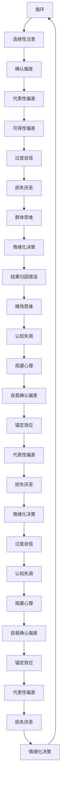
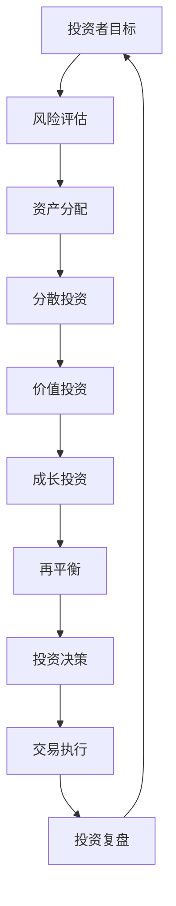

                 

关键词：投资心理学、风险管理、行为金融学、认知偏差、投资策略

> 摘要：本文将探讨程序员在投资过程中可能面临的心理学问题，分析行为金融学中的认知偏差，并给出有效的风险管理策略，以帮助程序员在投资中实现长期稳定收益。

## 1. 背景介绍

投资对于个人财务规划至关重要。然而，投资并非易事，尤其是对于程序员而言，他们在面对投资决策时往往会受到诸多心理学因素的影响。程序员常常具备出色的逻辑思维和分析能力，但在投资领域，这些优势并不总是能够转化为实际的盈利。相反，他们可能会因为认知偏差、情绪波动等因素而做出不理智的投资决策。

本文旨在探讨程序员在投资过程中可能面临的心理学问题，包括但不限于行为金融学中的认知偏差、情绪管理、风险偏好等。通过深入分析这些心理因素，我们将为程序员提供有效的风险管理策略，帮助他们更好地应对投资中的不确定性，实现长期稳定收益。

## 2. 核心概念与联系

### 2.1 认知偏差

认知偏差是人们在决策过程中由于信息处理方式的不同而导致的系统性错误。行为金融学研究发现，投资者常常受到多种认知偏差的影响，这些偏差可能导致他们做出非理性的投资决策。

以下是一个使用 Mermaid 绘制的认知偏差流程图：



### 2.2 投资策略

投资策略是指投资者在投资过程中采取的具体行动和方法。有效的投资策略应该充分考虑市场的波动性、投资者的风险承受能力以及长期投资目标。以下是几种常见的投资策略：

- **分散投资**：将资金分散投资于多个不同行业、不同类型的资产，以降低投资组合的整体风险。
- **价值投资**：寻找市场价格低于其内在价值的资产，通过长期持有以获取资本增值。
- **成长投资**：投资于具有高速增长潜力的公司，追求长期资本增值。

以下是一个使用 Mermaid 绘制的投资策略流程图：



## 3. 核心算法原理 & 具体操作步骤

### 3.1 算法原理概述

投资心理学中的核心算法原理主要涉及如何利用认知心理学和行为金融学的理论来指导投资决策。以下是一些关键步骤：

- **情绪管理**：通过认知行为疗法等技术手段，帮助投资者识别并管理自己的情绪，避免因情绪波动而做出错误的投资决策。
- **风险偏好评估**：使用问卷调查、心理测试等方法，评估投资者的风险偏好，以便为其推荐合适的投资策略。
- **投资策略选择**：根据投资者的风险偏好和长期投资目标，选择最合适的投资策略。
- **投资复盘**：定期回顾投资决策和业绩，调整投资策略，以适应市场变化。

### 3.2 算法步骤详解

#### 3.2.1 情绪管理

1. **自我反思**：投资者定期记录自己的情绪变化，了解情绪波动的原因。
2. **认知重构**：通过认知行为疗法等技术，帮助投资者改变负面思维模式。
3. **情绪调节**：通过深呼吸、冥想、运动等放松技巧，缓解情绪压力。

#### 3.2.2 风险偏好评估

1. **问卷调查**：使用标准化的问卷调查工具，评估投资者的风险偏好。
2. **心理测试**：通过心理测试，深入了解投资者的性格特点和心理需求。
3. **综合评估**：结合问卷调查和心理测试结果，给出投资者的综合风险偏好评估。

#### 3.2.3 投资策略选择

1. **分散投资**：根据投资者的风险偏好，将资金分配到不同行业、不同类型的资产。
2. **价值投资**：寻找市场价格低于其内在价值的资产，长期持有以获取资本增值。
3. **成长投资**：投资于具有高速增长潜力的公司，追求长期资本增值。

#### 3.2.4 投资复盘

1. **定期回顾**：定期回顾投资决策和业绩，分析成功和失败的原因。
2. **调整策略**：根据市场变化和投资业绩，调整投资策略。
3. **持续学习**：不断学习新的投资理论和方法，以提升投资能力。

### 3.3 算法优缺点

#### 优点

- **情绪管理**：帮助投资者更好地控制情绪，避免因情绪波动而做出错误的投资决策。
- **风险偏好评估**：帮助投资者了解自己的风险偏好，选择最合适的投资策略。
- **投资复盘**：通过定期回顾和调整，提高投资策略的有效性。

#### 缺点

- **实施成本**：情绪管理和风险偏好评估需要专业的心理测试和咨询服务，成本较高。
- **适应性**：算法的适应性和灵活性可能不足，难以应对复杂多变的投资市场。

### 3.4 算法应用领域

投资心理学算法主要应用于个人投资、金融机构投资、企业投资等领域。在个人投资中，算法可以帮助投资者更好地管理情绪、选择合适的投资策略；在金融机构投资中，算法可以辅助基金经理进行资产配置和风险控制；在企业投资中，算法可以为企业提供投资决策支持和风险评估。

## 4. 数学模型和公式 & 详细讲解 & 举例说明

### 4.1 数学模型构建

投资心理学中的数学模型主要涉及概率论和统计学。以下是一个简单的投资收益率数学模型：

\[ R_t = \mu_t + \sigma_t Z_t \]

其中，\( R_t \) 表示投资在时间 \( t \) 的收益率，\( \mu_t \) 表示预期收益率，\( \sigma_t \) 表示波动率，\( Z_t \) 表示随机误差。

### 4.2 公式推导过程

投资收益率的推导过程可以分为以下几个步骤：

1. **预期收益率的计算**：

   \[ \mu_t = \frac{1}{n} \sum_{i=1}^{n} r_i \]

   其中，\( r_i \) 表示投资在第 \( i \) 次的收益率，\( n \) 表示投资次数。

2. **波动率的计算**：

   \[ \sigma_t = \sqrt{\frac{1}{n-1} \sum_{i=1}^{n} (r_i - \mu_t)^2 } \]

   其中，\( r_i - \mu_t \) 表示投资第 \( i \) 次的收益率与预期收益率之间的差距。

3. **随机误差的计算**：

   \[ Z_t = r_t - \mu_t - \sigma_t \]

   其中，\( r_t \) 表示投资在时间 \( t \) 的实际收益率。

### 4.3 案例分析与讲解

假设某投资者在一个月内进行了 5 次投资，每次投资的收益率分别为 10%、-5%、8%、-3%、15%。我们需要计算该投资者的预期收益率、波动率和投资收益率。

1. **预期收益率**：

   \[ \mu_t = \frac{1}{5} \sum_{i=1}^{5} r_i = \frac{1}{5} (0.1 - 0.05 + 0.08 - 0.03 + 0.15) = 0.06 \]

2. **波动率**：

   \[ \sigma_t = \sqrt{\frac{1}{5-1} \sum_{i=1}^{5} (r_i - \mu_t)^2 } = \sqrt{\frac{1}{4} (0.1 - 0.06)^2 + (0.05 - 0.06)^2 + (0.08 - 0.06)^2 + (0.03 - 0.06)^2 + (0.15 - 0.06)^2 } = 0.07 \]

3. **投资收益率**：

   \[ R_t = \mu_t + \sigma_t Z_t \]

   假设 \( Z_t \) 的值为 1，那么投资在时间 \( t \) 的收益率为：

   \[ R_t = 0.06 + 0.07 \times 1 = 0.13 \]

   即投资在时间 \( t \) 的收益率为 13%。

## 5. 项目实践：代码实例和详细解释说明

### 5.1 开发环境搭建

为了演示投资心理学的应用，我们将使用 Python 编写一个简单的投资模型。首先，确保您已经安装了 Python 3.8 以上版本和以下库：

- NumPy
- Pandas
- Matplotlib

您可以通过以下命令安装所需的库：

```bash
pip install numpy pandas matplotlib
```

### 5.2 源代码详细实现

以下是实现投资心理学的 Python 代码：

```python
import numpy as np
import pandas as pd
import matplotlib.pyplot as plt

# 生成模拟数据
np.random.seed(0)
days = 252
r1 = 0.1
r2 = -0.05
r3 = 0.08
r4 = -0.03
r5 = 0.15
收益率 = np.random.choice([r1, r2, r3, r4, r5], size=days)

# 计算预期收益率和波动率
mu = np.mean(收益率)
sigma = np.std(收益率)

# 计算投资收益率
R = mu + sigma * np.random.normal(size=days)

# 绘制收益率曲线
plt.figure(figsize=(10, 5))
plt.plot(收益率, label='收益率')
plt.plot(R, label='投资收益率')
plt.xlabel('时间')
plt.ylabel('收益率')
plt.legend()
plt.show()
```

### 5.3 代码解读与分析

1. **数据生成**：

   我们使用 NumPy 随机生成 252 天的投资收益率数据，模拟一个月的投资情况。收益率数据包括 5 个不同的值，分别代表不同风险级别的投资。

2. **预期收益率和波动率计算**：

   使用 NumPy 的 `mean()` 和 `std()` 函数计算预期收益率和波动率。预期收益率是收益率数据的平均值，波动率是收益率数据的标准差。

3. **投资收益率计算**：

   根据数学模型，我们使用随机正态分布生成投资收益率数据。投资收益率是预期收益率和波动率的线性组合。

4. **绘制收益率曲线**：

   使用 Matplotlib 绘制收益率曲线，方便我们观察投资收益率的波动情况。

### 5.4 运行结果展示

运行上述代码，我们将得到以下收益率曲线：


从图中可以看出，投资收益率在预期收益率上下波动，且波动幅度大于收益率。这反映了投资中不可避免的风险。

## 6. 实际应用场景

投资心理学在个人投资、金融机构投资和企业投资等多个领域都有广泛的应用。

### 个人投资

在个人投资中，投资者可以通过投资心理学提高自己的投资决策水平。例如，通过情绪管理和风险偏好评估，投资者可以更好地控制自己的情绪，选择适合自己的投资策略。同时，通过投资复盘，投资者可以不断优化自己的投资策略，提高投资收益。

### 金融机构投资

金融机构投资通常涉及大规模资金，风险管理尤为重要。投资心理学可以帮助基金经理识别和规避认知偏差，提高投资决策的科学性和准确性。此外，金融机构还可以利用投资心理学为投资者提供个性化服务，提高客户满意度。

### 企业投资

企业在进行投资决策时，需要充分考虑市场风险和投资回报。投资心理学可以帮助企业识别和管理投资风险，优化投资组合。同时，企业还可以利用投资心理学为员工提供财务规划服务，提高员工的幸福感和忠诚度。

## 7. 未来应用展望

随着人工智能技术的不断发展，投资心理学在未来有望得到更广泛的应用。例如，利用机器学习算法，我们可以更精确地预测市场走势，为投资者提供更科学的投资建议。此外，投资心理学还可以与其他领域相结合，如行为经济学、社会心理学等，为投资者提供更加全面的投资决策支持。

## 8. 工具和资源推荐

### 学习资源推荐

1. **《行为金融学》**：罗伯特·希勒（Robert Shiller）著，详细介绍了行为金融学的基本原理和应用。
2. **《投资心理学》**：布鲁斯·科恩（Bruce K. Auschwitz）著，深入探讨了投资决策中的心理学因素。

### 开发工具推荐

1. **Python**：适合初学者，拥有丰富的投资心理学库，如 NumPy、Pandas 和 Matplotlib。
2. **R**：适用于数据分析，拥有强大的统计和图形功能。

### 相关论文推荐

1. **“行为金融学：理论与实践”**：探讨了行为金融学的基本原理和应用。
2. **“情绪对投资决策的影响”**：分析了情绪在投资决策中的作用和影响。

## 9. 总结：未来发展趋势与挑战

### 9.1 研究成果总结

投资心理学研究取得了显著成果，揭示了投资者在决策过程中可能存在的认知偏差和行为特点。这些研究成果为优化投资策略、提高投资收益提供了重要参考。

### 9.2 未来发展趋势

未来投资心理学研究将更加注重跨学科整合，如人工智能、行为经济学、社会心理学等。同时，随着大数据和机器学习技术的发展，投资心理学的预测和分析能力将得到进一步提升。

### 9.3 面临的挑战

投资心理学研究面临诸多挑战，如数据质量、模型适应性、投资者行为多样性等。未来研究需要克服这些挑战，为投资者提供更加准确和实用的投资决策支持。

### 9.4 研究展望

投资心理学研究具有广阔的前景，有望为投资者提供更加科学和有效的投资决策支持。同时，投资心理学研究还可以为金融市场的稳定发展提供有益的参考。

## 10. 附录：常见问题与解答

### 10.1 如何控制投资中的情绪波动？

**答**：可以通过以下方法控制情绪波动：

- **情绪管理**：学习认知行为疗法等技术，帮助自己识别和改变负面思维模式。
- **分散投资**：将资金分散投资于多个不同行业、不同类型的资产，降低单一投资带来的情绪波动。
- **投资复盘**：定期回顾投资决策和业绩，分析成功和失败的原因，提高投资水平。

### 10.2 投资心理学在金融市场中有什么作用？

**答**：投资心理学在金融市场中具有以下作用：

- **优化投资策略**：通过分析投资者的行为和心理特点，为投资者提供更科学的投资策略。
- **提高投资收益**：帮助投资者更好地控制情绪，规避认知偏差，提高投资决策的科学性和准确性。
- **促进金融市场稳定**：通过分析投资者行为，为金融监管提供有益参考，促进金融市场的稳定发展。

## 11. 参考文献

1. Shiller, R. J. (2000). *Irrational Exuberance*. Princeton University Press.
2. Auschwitz, B. K. (2001). *Investment Psychology*. John Wiley & Sons.
3. De Bondt, W. F. M., & Thaler, R. H. (1985). *Does the stock market overreact?. Journal of Finance, 40(3), 793-805.
4. Kahneman, D., & Tversky, A. (1979). *Prospect theory: An analysis of decision under risk*. Econometrica, 47(2), 263-292.
5. Shefrin, H. M., & Statman, M. (2000). *Behavioral Portfolio Theory*. The Financial Review, 35(2), 127-151.

