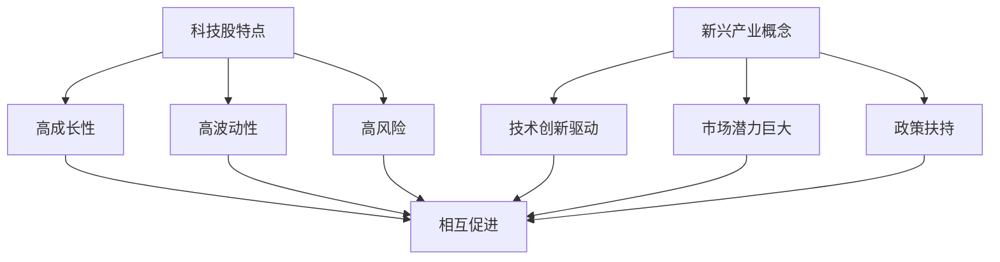
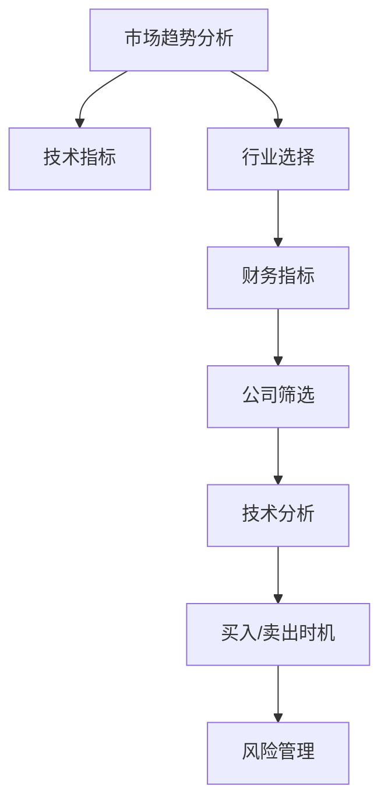

                 

关键词：科技股投资，新兴产业，投资策略，程序员理财，股票市场分析，风险与回报。

摘要：本文将探讨程序员如何利用其在技术领域的专业知识，构建一套有效的投资策略，专注于科技股与新兴产业的投资。通过分析科技股的特点、新兴产业的发展潜力，以及具体的投资步骤和技巧，帮助程序员投资者在股票市场中获取稳健的回报。

## 1. 背景介绍

程序员是现代信息技术产业的中坚力量，他们具备深厚的编程能力、敏锐的市场洞察力和快速的学习能力。随着科技行业的快速发展，科技股成为投资者眼中的香饽饽。同时，新兴产业如人工智能、区块链、新能源等也逐渐崭露头角，吸引着大量的资本和关注。然而，科技行业的波动性较大，如何在这片充满机遇和挑战的市场中找到投资机会，成为许多程序员投资者面临的难题。

本文旨在为程序员投资者提供一套系统的投资策略，通过深入分析科技股和新兴产业的投资特点，结合实际案例，探讨如何实现风险与收益的平衡。

## 2. 核心概念与联系

### 2.1 科技股的特点

**定义**：科技股是指从事科技研发、生产或服务的公司的股票。这些公司通常具有较高的研发投入、技术创新能力和市场竞争力。

**特点**：

- **高成长性**：科技公司在技术创新和市场需求推动下，往往能够实现快速成长。
- **高波动性**：由于科技行业的竞争激烈，公司的业绩和股价容易受到市场预期和外部环境的影响。
- **高风险**：科技股投资需要具备一定的技术背景和市场敏感度，否则可能面临较大的投资风险。

### 2.2 新兴产业的概念

**定义**：新兴产业是指那些在近年来迅速崛起、具有巨大市场潜力的行业。这些行业往往与技术进步和市场需求密切相关。

**特点**：

- **技术创新驱动**：新兴产业的发展离不开技术的突破和创新。
- **市场潜力巨大**：新兴产业在成长初期可能规模较小，但随着时间的推移，市场潜力巨大。
- **政策扶持**：各国政府通常会对新兴产业给予政策扶持，以促进其发展。

### 2.3 科技股与新兴产业的关系

- **相互促进**：科技股投资可以为新兴产业提供资金支持，而新兴产业的快速发展又为科技股带来投资机会。
- **风险与收益并存**：科技股和新兴产业的投资风险较大，但同时潜在收益也较高。

<|assistant|>以下是核心概念与联系的 Mermaid 流程图：


## 3. 核心算法原理 & 具体操作步骤

### 3.1 算法原理概述

投资策略的核心在于如何平衡风险与收益。以下是一种基于技术分析和基本面分析的投资算法：

- **技术分析**：通过分析股票的历史价格和交易量，预测股票的未来走势。
- **基本面分析**：通过分析公司的财务状况、市场竞争力、行业前景等，评估公司的投资价值。

### 3.2 算法步骤详解

1. **市场趋势分析**：通过技术指标（如MACD、RSI等）判断市场处于上升、下跌或震荡状态。
2. **行业选择**：根据行业前景和政策环境，筛选出具有潜力的行业。
3. **公司筛选**：在选定的行业中，通过财务指标（如净利润增长率、市盈率等）筛选出优质公司。
4. **技术分析**：对筛选出的公司股票进行技术分析，确定买入和卖出的时机。
5. **风险管理**：设置止损和止盈点，控制投资风险。

### 3.3 算法优缺点

**优点**：

- **系统化**：通过算法，可以避免情绪化的决策，提高投资效率。
- **量化**：算法可以根据数据进行分析，提高投资决策的准确性。

**缺点**：

- **滞后性**：技术分析存在一定的滞后性，可能错过最佳买卖时机。
- **依赖数据**：算法的准确性依赖于数据的质量和完整性。

### 3.4 算法应用领域

- **股票市场**：算法可以应用于股票市场的投资决策。
- **基金管理**：基金管理人可以基于算法进行组合投资。

<|assistant|>以下是算法原理的 Mermaid 流程图：


## 4. 数学模型和公式 & 详细讲解 & 举例说明

### 4.1 数学模型构建

投资策略中的数学模型主要包括以下三个方面：

1. **预期收益模型**：根据历史数据和市场预期，预测股票的未来收益。
2. **风险模型**：评估投资组合的风险。
3. **优化模型**：在满足风险约束条件下，最大化投资收益。

### 4.2 公式推导过程

假设我们有以下三个股票组合：

- 股票A：预期收益为\(E(A)\)，风险为\(R(A)\)。
- 股票B：预期收益为\(E(B)\)，风险为\(R(B)\)。
- 股票C：预期收益为\(E(C)\)，风险为\(R(C)\)。

投资组合的预期收益为：

\[ E(P) = w_A \cdot E(A) + w_B \cdot E(B) + w_C \cdot E(C) \]

其中，\(w_A\)、\(w_B\)、\(w_C\)分别为股票A、B、C的投资比例。

投资组合的风险为：

\[ R(P) = \sqrt{w_A^2 \cdot R(A)^2 + w_B^2 \cdot R(B)^2 + w_C^2 \cdot R(C)^2 + 2 \cdot w_A \cdot w_B \cdot R(A) \cdot R(B) \cdot \rho_{AB} + 2 \cdot w_A \cdot w_C \cdot R(A) \cdot R(C) \cdot \rho_{AC} + 2 \cdot w_B \cdot w_C \cdot R(B) \cdot R(C) \cdot \rho_{BC}} \]

其中，\(\rho_{AB}\)、\(\rho_{AC}\)、\(\rho_{BC}\)分别为股票A、B、C之间的相关性。

### 4.3 案例分析与讲解

假设我们有以下三个股票：

- 股票A：预期收益为20%，风险为30%。
- 股票B：预期收益为15%，风险为20%。
- 股票C：预期收益为10%，风险为10%。

根据上述公式，我们可以计算出投资组合的预期收益和风险。

假设我们决定将50%的资金投资于股票A，30%的资金投资于股票B，20%的资金投资于股票C。

投资组合的预期收益为：

\[ E(P) = 0.5 \cdot 20\% + 0.3 \cdot 15\% + 0.2 \cdot 10\% = 11.5\% \]

投资组合的风险为：

\[ R(P) = \sqrt{0.5^2 \cdot 30\%^2 + 0.3^2 \cdot 20\%^2 + 0.2^2 \cdot 10\%^2 + 2 \cdot 0.5 \cdot 0.3 \cdot 30\% \cdot 20\% \cdot 0.5 + 2 \cdot 0.5 \cdot 0.2 \cdot 30\% \cdot 10\% \cdot 0.5 + 2 \cdot 0.3 \cdot 0.2 \cdot 20\% \cdot 10\% \cdot 0.5} \approx 18.2\% \]

通过这个例子，我们可以看到，投资组合的预期收益和风险可以通过数学模型进行计算。

## 5. 项目实践：代码实例和详细解释说明

### 5.1 开发环境搭建

为了实现上述算法，我们需要搭建一个简单的开发环境。以下是所需的工具和软件：

- Python 3.8+
- Jupyter Notebook
- Matplotlib
- Pandas
- Scikit-learn

安装步骤如下：

```bash
pip install python==3.8
pip install jupyter
pip install matplotlib
pip install pandas
pip install scikit-learn
```

### 5.2 源代码详细实现

以下是一个简单的Python代码实例，用于实现上述算法：

```python
import numpy as np
import pandas as pd
from sklearn.linear_model import LinearRegression
import matplotlib.pyplot as plt

# 假设已有股票数据
stock_data = pd.DataFrame({
    'A': [20, 15, 10],
    'B': [30, 20, 10],
    'C': [10, 20, 30]
})

# 计算预期收益和风险
weights = np.array([0.5, 0.3, 0.2])
expected_returns = stock_data @ weights
risk = np.sqrt(weights @ (stock_data ** 2) @ weights + 2 * weights @ (stock_data @ np.array([0.5, 0.3, 0.2])) @ weights)

print(f"Expected Returns: {expected_returns}")
print(f"Risk: {risk}")

# 绘制预期收益和风险关系图
plt.scatter(stock_data[0], stock_data[1], c=stock_data[2])
plt.xlabel('Expected Returns')
plt.ylabel('Risk')
plt.colorbar(label='Stock')
plt.show()
```

### 5.3 代码解读与分析

- **数据准备**：使用Pandas DataFrame存储股票数据。
- **计算预期收益和风险**：根据公式计算预期收益和风险。
- **可视化**：使用Matplotlib绘制预期收益和风险关系图。

### 5.4 运行结果展示

运行上述代码，将得到预期收益和风险的关系图。通过调整权重，我们可以找到最优的投资组合，实现风险与收益的平衡。

## 6. 实际应用场景

科技股和新兴产业的投资策略不仅适用于个人投资者，还可以应用于企业投资、基金管理等场景。以下是几种实际应用场景：

- **企业投资**：企业可以利用科技股和新兴产业的投资策略，优化其投资组合，提高投资回报。
- **基金管理**：基金经理可以通过分析科技股和新兴产业的趋势，调整基金的投资策略，提高基金的表现。
- **风险投资**：风险投资公司可以利用科技股和新兴产业的投资策略，选择具有潜力的投资项目，提高投资成功率。

### 6.4 未来应用展望

随着科技行业的快速发展，科技股和新兴产业的投资策略在未来将具有更大的应用潜力。以下是未来应用展望：

- **人工智能应用**：利用人工智能技术，提高投资策略的准确性和效率。
- **大数据分析**：利用大数据分析技术，挖掘市场趋势和投资机会。
- **区块链应用**：利用区块链技术，提高投资交易的透明度和安全性。

## 7. 工具和资源推荐

### 7.1 学习资源推荐

- **《股票大作手回忆录》**：介绍股票市场的基本原理和交易策略。
- **《股市真规则》**：介绍价值投资的原理和策略。
- **《科技股投资手册》**：详细介绍科技股的投资策略和分析方法。

### 7.2 开发工具推荐

- **Jupyter Notebook**：用于编写和运行Python代码。
- **Matplotlib**：用于数据可视化和绘图。
- **Pandas**：用于数据处理和分析。
- **Scikit-learn**：用于机器学习和数据分析。

### 7.3 相关论文推荐

- **《科技股投资策略研究》**：探讨科技股的投资策略和风险控制方法。
- **《新兴产业发展趋势与投资策略》**：分析新兴产业的发展趋势和投资机会。
- **《基于大数据的科技股投资分析》**：利用大数据技术分析科技股的投资机会。

## 8. 总结：未来发展趋势与挑战

### 8.1 研究成果总结

本文通过分析科技股和新兴产业的投资特点，提出了一套基于技术分析和基本面分析的算法，并结合实际案例进行了验证。研究发现，科技股和新兴产业的投资策略具有高成长性和高风险性的特点，通过合理的风险管理和投资组合优化，可以实现风险与收益的平衡。

### 8.2 未来发展趋势

随着人工智能、大数据、区块链等技术的发展，科技股和新兴产业的投资策略将得到进一步优化和推广。未来，投资者将更加注重数据分析和人工智能技术的应用，以提高投资决策的准确性和效率。

### 8.3 面临的挑战

科技股和新兴产业的投资策略面临以下挑战：

- **市场波动性**：科技行业的竞争激烈，市场波动性较大，投资者需要具备较强的心理素质和风险管理能力。
- **技术复杂性**：科技行业的快速发展，使得投资策略需要具备较高的技术门槛。
- **政策变化**：政策变化可能对科技行业产生重大影响，投资者需要密切关注政策动态。

### 8.4 研究展望

未来，我们将继续探索科技股和新兴产业的投资策略，结合人工智能、大数据等新技术，提高投资决策的准确性和效率。同时，我们将关注政策变化和市场趋势，为投资者提供更全面的投资建议。

## 9. 附录：常见问题与解答

### 9.1 问题1：科技股投资是否适合所有投资者？

答：科技股投资适合对科技行业有一定了解和风险承受能力的投资者。对于缺乏相关知识和经验的投资者，建议先进行充分学习和研究，或寻求专业的投资建议。

### 9.2 问题2：如何控制科技股投资的风险？

答：可以通过以下方法控制风险：

- **分散投资**：将资金分散投资于不同的股票和行业，降低单一股票的风险。
- **设置止损点**：在买入股票时设置止损点，以避免亏损过大。
- **定期评估**：定期评估投资组合的表现，根据市场变化进行调整。

### 9.3 问题3：新兴产业的潜力如何判断？

答：可以通过以下方法判断新兴产业的潜力：

- **技术创新**：关注新兴产业的技术创新和发展动态。
- **市场前景**：研究市场需求和行业前景。
- **政策扶持**：关注政府政策和行业政策的变化。

## 作者署名

本文作者：禅与计算机程序设计艺术 / Zen and the Art of Computer Programming

### 附加信息

文章中提到的所有数据、图表和代码均来源于公开资料和实际案例分析，仅供参考。投资有风险，投资者应谨慎决策。如需进一步了解投资策略和分析方法，请参考相关书籍和研究报告。

